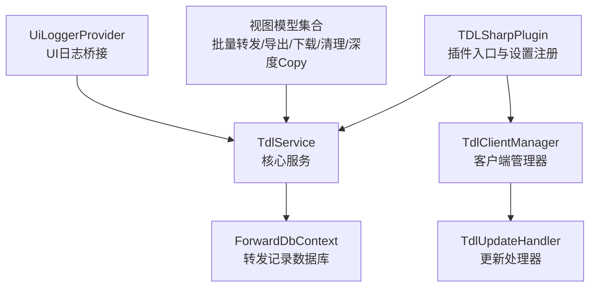
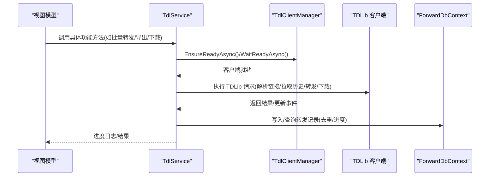
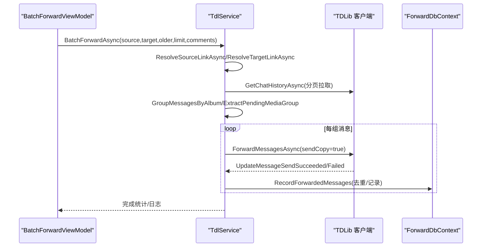
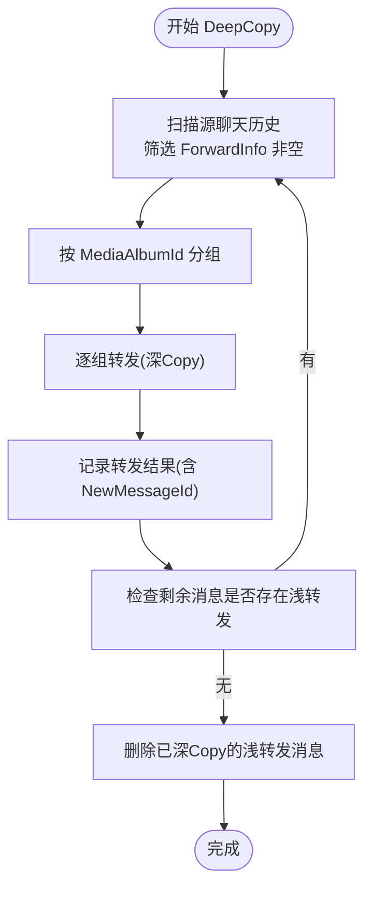
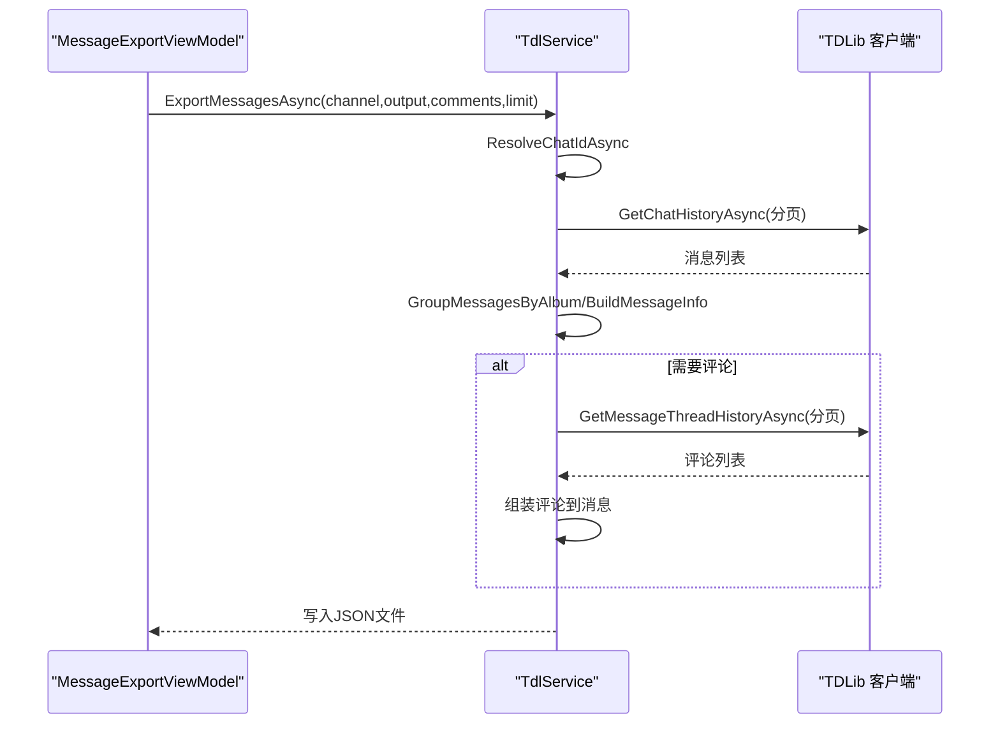
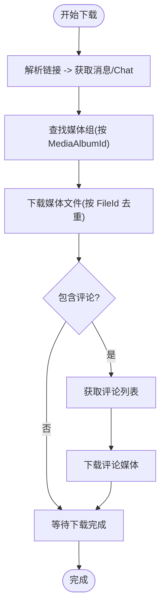
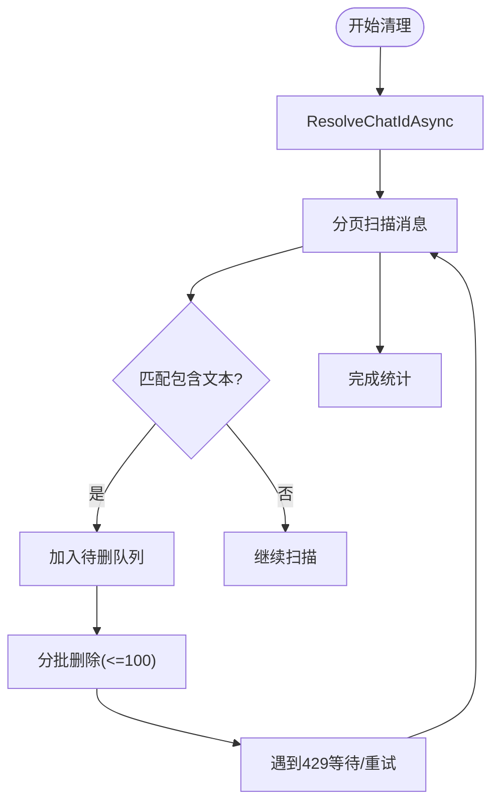
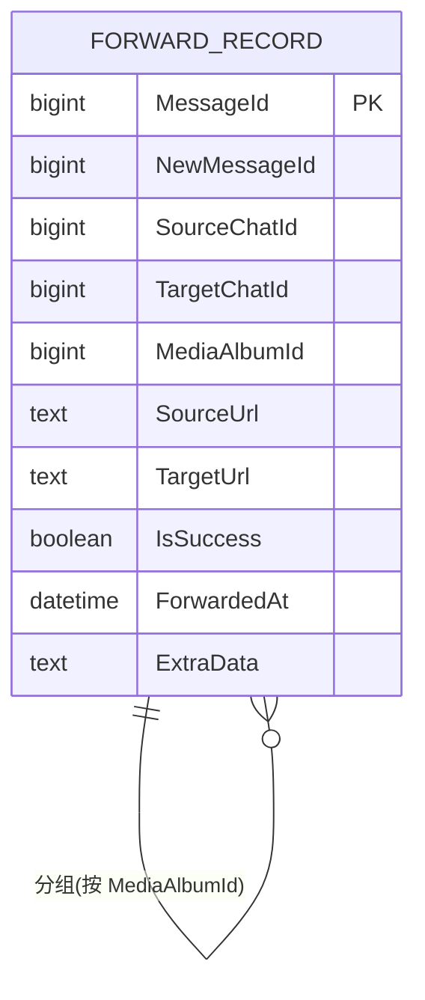
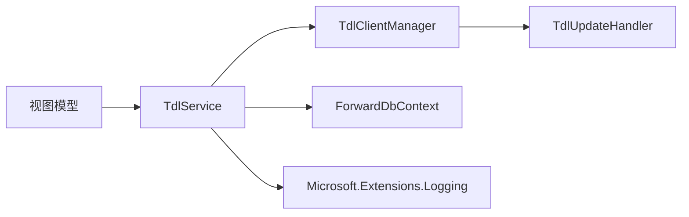

# TDLSharp 组件

<cite>
**本文引用的文件**
- [TDLSharpPlugin.cs](file://plugins/Avalonia.Plugin.TDLSharp/TDLSharpPlugin.cs)
- [TdlService.cs](file://plugins/Avalonia.Plugin.TDLSharp/Serivces/TdlService.cs)
- [TdlService.Forward.cs](file://plugins/Avalonia.Plugin.TDLSharp/Serivces/TdlService.Forward.cs)
- [TdlService.Export.cs](file://plugins/Avalonia.Plugin.TDLSharp/Serivces/TdlService.Export.cs)
- [TdlService.Download.cs](file://plugins/Avalonia.Plugin.TDLSharp/Serivces/TdlService.Download.cs)
- [TdlService.Clear.cs](file://plugins/Avalonia.Plugin.TDLSharp/Serivces/TdlService.Clear.cs)
- [TdlService.DeepCopy.cs](file://plugins/Avalonia.Plugin.TDLSharp/Serivces/TdlService.DeepCopy.cs)
- [TdlClientManager.cs](file://plugins/Avalonia.Plugin.TDLSharp/Serivces/TdlClientManager.cs)
- [TdlUpdateHandler.cs](file://plugins/Avalonia.Plugin.TDLSharp/Serivces/TdlUpdateHandler.cs)
- [TdlForwardDbContext.cs](file://plugins/Avalonia.Plugin.TDLSharp/Serivces/TdlForwardDbContext.cs)
- [BatchForwardViewModel.cs](file://plugins/Avalonia.Plugin.TDLSharp/ViewModels/BatchForwardViewModel.cs)
- [ClearMessageViewModel.cs](file://plugins/Avalonia.Plugin.TDLSharp/ViewModels/ClearMessageViewModel.cs)
- [DeepCopyViewModel.cs](file://plugins/Avalonia.Plugin.TDLSharp/ViewModels/DeepCopyViewModel.cs)
- [GroupMediaDownloadViewModel.cs](file://plugins/Avalonia.Plugin.TDLSharp/ViewModels/GroupMediaDownloadViewModel.cs)
- [MessageExportViewModel.cs](file://plugins/Avalonia.Plugin.TDLSharp/ViewModels/MessageExportViewModel.cs)
- [ScriptParameter.cs](file://plugins/Avalonia.Plugin.TDLSharp/Models/ScriptParameter.cs)
- [UiLoggerProvider.cs](file://plugins/Avalonia.Plugin.TDLSharp/Serivces/UiLoggerProvider.cs)
</cite>

## 目录
1. [简介](#简介)
2. [项目结构](#项目结构)
3. [核心组件](#核心组件)
4. [架构总览](#架构总览)
5. [详细组件分析](#详细组件分析)
6. [依赖关系分析](#依赖关系分析)
7. [性能考量](#性能考量)
8. [故障排查指南](#故障排查指南)
9. [结论](#结论)
10. [附录](#附录)

## 简介
TDLSharp 是一个基于 Avalonia 平台的插件，提供与 Telegram TDLib 的深度集成，围绕消息批量转发、消息导出、媒体下载、消息清理与“深度复制”等场景构建。该组件通过统一的服务层封装 TDLib 客户端生命周期、认证流程、更新处理、数据持久化与业务逻辑，为上层 UI 提供稳定、可扩展的脚本化工作流。

## 项目结构
- 插件入口与设置注册：TDLSharpPlugin 负责插件元数据、设置项注册以及服务注册（日志工厂、TDLib 客户端管理器）。
- 服务层：
  - TdlService：核心服务，封装 TDLib 客户端、链接解析、重试策略、媒体分组、发送结果等待、URL 构建、SQLite 记录等。
  - TdlClientManager：负责 TDLib 初始化、参数配置、代理设置、认证事件、文件下载回调。
  - TdlUpdateHandler：集中处理 TDLib 更新事件（认证状态、连接状态、文件更新、消息变更等）。
  - ForwardDbContext：基于 EF Core 的 SQLite 数据库上下文，用于记录转发历史与去重。
- 功能模块（按职责拆分在不同文件中）：
  - 批量转发：TdlService.Forward.cs
  - 消息导出：TdlService.Export.cs
  - 媒体下载：TdlService.Download.cs
  - 清理消息：TdlService.Clear.cs
  - 深度Copy：TdlService.DeepCopy.cs
- 视图模型与页面：为每个功能提供脚本描述、参数定义与执行入口。
- 日志桥接：UiLoggerProvider 将服务日志桥接到 UI。

**图表来源**
- [TDLSharpPlugin.cs:1-91](file://plugins/Avalonia.Plugin.TDLSharp/TDLSharpPlugin.cs#L1-L91)
- [TdlService.cs:1-444](file://plugins/Avalonia.Plugin.TDLSharp/Serivces/TdlService.cs#L1-L444)
- [TdlClientManager.cs:1-163](file://plugins/Avalonia.Plugin.TDLSharp/Serivces/TdlClientManager.cs#L1-L163)
- [TdlUpdateHandler.cs:1-184](file://plugins/Avalonia.Plugin.TDLSharp/Serivces/TdlUpdateHandler.cs#L1-L184)
- [TdlForwardDbContext.cs:1-71](file://plugins/Avalonia.Plugin.TDLSharp/Serivces/TdlForwardDbContext.cs#L1-L71)

**章节来源**
- [TDLSharpPlugin.cs:1-91](file://plugins/Avalonia.Plugin.TDLSharp/TDLSharpPlugin.cs#L1-L91)
- [TdlService.cs:1-444](file://plugins/Avalonia.Plugin.TDLSharp/Serivces/TdlService.cs#L1-L444)

## 核心组件
- 插件入口与配置
  - 注册设置项：API ID/Hash、代理服务器、代理端口、是否启用代理。
  - 初始化日志工厂与 TDLib 客户端管理器，并注入服务定位器。
- 客户端管理器
  - 单例式初始化 TDLib，绑定更新事件，配置参数（数据库目录、文件目录、代理）。
  - 提供认证相关方法（手机号、验证码、密码）与当前用户查询。
- 更新处理器
  - 分发 TDLib 更新事件，驱动认证流程、连接状态、文件下载完成通知、消息变更等。
- 核心服务
  - 链接解析（消息链接、邀请链接、用户名、纯数字 ChatId、标题模糊匹配）。
  - 媒体分组与待处理组提取（根据 MediaAlbumId）。
  - 发送结果等待与去重记录（基于 ForwardDbContext）。
  - 重试策略（解析 Retry-After，指数退避上限控制）。
- 数据持久化
  - 每个聊天对应一个 SQLite 数据库，记录转发记录、URL、额外数据与时间戳。

**章节来源**
- [TDLSharpPlugin.cs:26-91](file://plugins/Avalonia.Plugin.TDLSharp/TDLSharpPlugin.cs#L26-L91)
- [TdlClientManager.cs:52-163](file://plugins/Avalonia.Plugin.TDLSharp/Serivces/TdlClientManager.cs#L52-L163)
- [TdlUpdateHandler.cs:44-184](file://plugins/Avalonia.Plugin.TDLSharp/Serivces/TdlUpdateHandler.cs#L44-L184)
- [TdlService.cs:35-444](file://plugins/Avalonia.Plugin.TDLSharp/Serivces/TdlService.cs#L35-L444)
- [TdlForwardDbContext.cs:36-71](file://plugins/Avalonia.Plugin.TDLSharp/Serivces/TdlForwardDbContext.cs#L36-L71)

## 架构总览
下图展示从 UI 到服务再到 TDLib 的调用链路与数据流向。

**图表来源**
- [TdlService.Forward.cs:9-58](file://plugins/Avalonia.Plugin.TDLSharp/Serivces/TdlService.Forward.cs#L9-L58)
- [TdlService.Export.cs:12-53](file://plugins/Avalonia.Plugin.TDLSharp/Serivces/TdlService.Export.cs#L12-L53)
- [TdlService.Download.cs:11-36](file://plugins/Avalonia.Plugin.TDLSharp/Serivces/TdlService.Download.cs#L11-L36)
- [TdlService.Clear.cs:9-31](file://plugins/Avalonia.Plugin.TDLSharp/Serivces/TdlService.Clear.cs#L9-L31)
- [TdlService.DeepCopy.cs:11-111](file://plugins/Avalonia.Plugin.TDLSharp/Serivces/TdlService.DeepCopy.cs#L11-L111)
- [TdlClientManager.cs:79-109](file://plugins/Avalonia.Plugin.TDLSharp/Serivces/TdlClientManager.cs#L79-L109)
- [TdlForwardDbContext.cs:50-71](file://plugins/Avalonia.Plugin.TDLSharp/Serivces/TdlForwardDbContext.cs#L50-L71)

## 详细组件分析

### 批量转发（BatchForward）
- 功能概述
  - 支持“向旧消息方向”和“向新消息方向”两种扫描策略。
  - 自动识别媒体分组并按组转发，避免重复转发。
  - 可选转发评论，评论同样按分组处理。
  - 遇到 429（Too Many Requests）自动解析 Retry-After 并延迟重试。
- 关键流程
  - 解析源链接与目标链接，获取 ChatId。
  - 按方向拉取历史，过滤带转发信息的消息。
  - 分组处理（GroupMessagesByAlbum），对每组调用 ForwardMessagesAsync。
  - 注册发送等待（RegisterPendingSend/WaitForSendResultAsync），记录转发结果。
  - 使用 ForwardDbContext 去重与记录。
- 性能与并发
  - 每批最多 100 条消息，分批发送并延迟以降低限流风险。
  - 媒体分组内顺序发送，减少跨组乱序影响。
- 错误处理
  - 捕获 TDLib 异常与通用异常，记录日志并延时重试。
  - 对发送失败的组进行重试（最多 5 次），最终记录失败明细。

**图表来源**
- [BatchForwardViewModel.cs:28-38](file://plugins/Avalonia.Plugin.TDLSharp/ViewModels/BatchForwardViewModel.cs#L28-L38)
- [TdlService.Forward.cs:9-58](file://plugins/Avalonia.Plugin.TDLSharp/Serivces/TdlService.Forward.cs#L9-L58)
- [TdlService.Forward.cs:292-399](file://plugins/Avalonia.Plugin.TDLSharp/Serivces/TdlService.Forward.cs#L292-L399)
- [TdlService.Forward.cs:510-528](file://plugins/Avalonia.Plugin.TDLSharp/Serivces/TdlService.Forward.cs#L510-L528)
- [TdlForwardDbContext.cs:36-71](file://plugins/Avalonia.Plugin.TDLSharp/Serivces/TdlForwardDbContext.cs#L36-L71)

**章节来源**
- [TdlService.Forward.cs:9-58](file://plugins/Avalonia.Plugin.TDLSharp/Serivces/TdlService.Forward.cs#L9-L58)
- [TdlService.Forward.cs:146-230](file://plugins/Avalonia.Plugin.TDLSharp/Serivces/TdlService.Forward.cs#L146-L230)
- [TdlService.Forward.cs:232-290](file://plugins/Avalonia.Plugin.TDLSharp/Serivces/TdlService.Forward.cs#L232-L290)
- [TdlService.Forward.cs:292-399](file://plugins/Avalonia.Plugin.TDLSharp/Serivces/TdlService.Forward.cs#L292-L399)
- [TdlService.Forward.cs:510-528](file://plugins/Avalonia.Plugin.TDLSharp/Serivces/TdlService.Forward.cs#L510-L528)

### 深度Copy（DeepCopy）
- 功能概述
  - 将浅转发消息（ForwardInfo 非空）从原始来源重新发送为“深Copy”，随后删除旧的浅转发消息。
  - 支持评论处理，评论同样按分组转发。
  - 通过数据库记录判断哪些消息已完成深Copy，避免重复处理。
- 关键流程
  - 扫描源聊天历史，筛选 ForwardInfo 非空的消息。
  - 对每组消息执行转发（同组内顺序发送），记录结果。
  - 最终扫描源聊天，删除数据库中标记为成功的浅转发消息。
- 去重与一致性
  - 使用 ForwardDbContext 记录 SourceChatId/MessageId 主键，避免重复处理。
  - 成功后写入 NewMessageId，便于后续删除阶段定位。

**图表来源**
- [TdlService.DeepCopy.cs:11-111](file://plugins/Avalonia.Plugin.TDLSharp/Serivces/TdlService.DeepCopy.cs#L11-L111)
- [TdlService.DeepCopy.cs:112-141](file://plugins/Avalonia.Plugin.TDLSharp/Serivces/TdlService.DeepCopy.cs#L112-L141)
- [TdlService.DeepCopy.cs:143-227](file://plugins/Avalonia.Plugin.TDLSharp/Serivces/TdlService.DeepCopy.cs#L143-L227)

**章节来源**
- [TdlService.DeepCopy.cs:11-111](file://plugins/Avalonia.Plugin.TDLSharp/Serivces/TdlService.DeepCopy.cs#L11-L111)
- [TdlService.DeepCopy.cs:143-227](file://plugins/Avalonia.Plugin.TDLSharp/Serivces/TdlService.DeepCopy.cs#L143-L227)

### 消息导出（MessageExport）
- 功能概述
  - 导出频道消息为 JSON 文件，支持媒体分组与评论导出。
  - 自动解析 ChatId，按分页拉取消息，构建导出对象（包含消息类型、媒体信息、转发信息、可选评论）。
- 关键流程
  - 解析频道链接 -> 获取 Chat 信息 -> 分页拉取消息 -> 分组处理 -> 可选评论抓取 -> 序列化输出。
- 输出格式
  - 包含 ChatId、标题、导出时间、总消息数、分组列表。
  - 每组包含 MediaAlbumId、是否为分组、消息列表（含类型、文本、媒体、转发信息、可选评论）。

**图表来源**
- [MessageExportViewModel.cs:26-34](file://plugins/Avalonia.Plugin.TDLSharp/ViewModels/MessageExportViewModel.cs#L26-L34)
- [TdlService.Export.cs:12-53](file://plugins/Avalonia.Plugin.TDLSharp/Serivces/TdlService.Export.cs#L12-L53)
- [TdlService.Export.cs:55-164](file://plugins/Avalonia.Plugin.TDLSharp/Serivces/TdlService.Export.cs#L55-L164)

**章节来源**
- [TdlService.Export.cs:12-53](file://plugins/Avalonia.Plugin.TDLSharp/Serivces/TdlService.Export.cs#L12-L53)
- [TdlService.Export.cs:55-164](file://plugins/Avalonia.Plugin.TDLSharp/Serivces/TdlService.Export.cs#L55-L164)

### 群组媒体下载（GroupMediaDownload）
- 功能概述
  - 从消息链接解析媒体组，批量下载媒体文件；可选包含评论区媒体。
  - 基于 FileId 去重，避免重复下载。
- 关键流程
  - 解析链接 -> 获取消息与 Chat -> 搜索媒体组（向前/向后）-> 下载媒体文件 -> 可选下载评论媒体。
- 限流与稳定性
  - 遇到 429 自动等待并重试；下载完成后等待一段时间确保文件落盘。

**图表来源**
- [GroupMediaDownloadViewModel.cs:25-32](file://plugins/Avalonia.Plugin.TDLSharp/ViewModels/GroupMediaDownloadViewModel.cs#L25-L32)
- [TdlService.Download.cs:11-36](file://plugins/Avalonia.Plugin.TDLSharp/Serivces/TdlService.Download.cs#L11-L36)
- [TdlService.Download.cs:106-198](file://plugins/Avalonia.Plugin.TDLSharp/Serivces/TdlService.Download.cs#L106-L198)

**章节来源**
- [TdlService.Download.cs:11-36](file://plugins/Avalonia.Plugin.TDLSharp/Serivces/TdlService.Download.cs#L11-L36)
- [TdlService.Download.cs:106-198](file://plugins/Avalonia.Plugin.TDLSharp/Serivces/TdlService.Download.cs#L106-L198)

### 清理消息（ClearMessage）
- 功能概述
  - 在指定频道或收藏夹中扫描包含特定文本的消息，支持静默删除或交互确认。
  - 分批删除（每批最多 100 条），遇 429 自动等待。
- 关键流程
  - 解析 ChatId -> 分页拉取消息 -> 文本匹配 -> 批量删除 -> 统计删除数量。

**图表来源**
- [ClearMessageViewModel.cs:26-34](file://plugins/Avalonia.Plugin.TDLSharp/ViewModels/ClearMessageViewModel.cs#L26-L34)
- [TdlService.Clear.cs:9-31](file://plugins/Avalonia.Plugin.TDLSharp/Serivces/TdlService.Clear.cs#L9-L31)
- [TdlService.Clear.cs:33-119](file://plugins/Avalonia.Plugin.TDLSharp/Serivces/TdlService.Clear.cs#L33-L119)

**章节来源**
- [TdlService.Clear.cs:9-31](file://plugins/Avalonia.Plugin.TDLSharp/Serivces/TdlService.Clear.cs#L9-L31)
- [TdlService.Clear.cs:33-119](file://plugins/Avalonia.Plugin.TDLSharp/Serivces/TdlService.Clear.cs#L33-L119)

### 数据模型与数据库
- ForwardRecord
  - 主键：SourceChatId + MessageId
  - 字段：NewMessageId、TargetChatId、MediaAlbumId、SourceUrl、TargetUrl、IsSuccess、ForwardedAt、ExtraData
- ForwardDbContext
  - 每个聊天一个数据库文件（forward-{chatId}.db）
  - 索引：NewMessageId、MediaAlbumId、SourceChatId+TargetChatId
  - 使用 SQLite 存储 JSON 格式的 ExtraData

**图表来源**
- [TdlForwardDbContext.cs:10-34](file://plugins/Avalonia.Plugin.TDLSharp/Serivces/TdlForwardDbContext.cs#L10-L34)
- [TdlForwardDbContext.cs:36-71](file://plugins/Avalonia.Plugin.TDLSharp/Serivces/TdlForwardDbContext.cs#L36-L71)

**章节来源**
- [TdlForwardDbContext.cs:10-34](file://plugins/Avalonia.Plugin.TDLSharp/Serivces/TdlForwardDbContext.cs#L10-L34)
- [TdlForwardDbContext.cs:36-71](file://plugins/Avalonia.Plugin.TDLSharp/Serivces/TdlForwardDbContext.cs#L36-L71)

## 依赖关系分析
- 组件耦合
  - TdlService 依赖 TdlClientManager 与 ForwardDbContext，承担业务编排与数据持久化。
  - TdlClientManager 依赖 TDLib 绑定与 TdlUpdateHandler，负责生命周期与认证。
  - 视图模型仅依赖 TdlService 与参数定义，保持 UI 与业务解耦。
- 外部依赖
  - TDLib：消息拉取、转发、下载、评论线程、认证流程。
  - EF Core + SQLite：转发记录存储与查询。
  - Microsoft.Extensions.Logging：统一日志体系。
- 可能的循环依赖
  - 未见直接循环依赖；服务层通过接口化（如 ILogger）与 TDLib 事件回调隔离。

**图表来源**
- [TdlService.cs:16-20](file://plugins/Avalonia.Plugin.TDLSharp/Serivces/TdlService.cs#L16-L20)
- [TdlClientManager.cs:64-71](file://plugins/Avalonia.Plugin.TDLSharp/Serivces/TdlClientManager.cs#L64-L71)
- [TdlUpdateHandler.cs:44-184](file://plugins/Avalonia.Plugin.TDLSharp/Serivces/TdlUpdateHandler.cs#L44-L184)
- [TdlForwardDbContext.cs:50-71](file://plugins/Avalonia.Plugin.TDLSharp/Serivces/TdlForwardDbContext.cs#L50-L71)

**章节来源**
- [TdlService.cs:16-20](file://plugins/Avalonia.Plugin.TDLSharp/Serivces/TdlService.cs#L16-L20)
- [TdlClientManager.cs:64-71](file://plugins/Avalonia.Plugin.TDLSharp/Serivces/TdlClientManager.cs#L64-L71)
- [TdlUpdateHandler.cs:44-184](file://plugins/Avalonia.Plugin.TDLSharp/Serivces/TdlUpdateHandler.cs#L44-L184)
- [TdlForwardDbContext.cs:50-71](file://plugins/Avalonia.Plugin.TDLSharp/Serivces/TdlForwardDbContext.cs#L50-L71)

## 性能考量
- 分页与限流
  - 拉取历史与评论均采用分页（100 或 50），并在 429 时解析 Retry-After 并等待。
- 媒体分组与批处理
  - 按 MediaAlbumId 分组，减少跨组乱序与重复转发；转发批大小控制在合理范围。
- 延迟与背压
  - 在关键节点插入延迟（如 1s/500ms），平衡 API 速率与 UI 响应。
- 数据库索引
  - 为常用查询字段建立索引，提升去重与查询效率。
- 内存管理
  - 分页拉取与临时列表在处理后及时释放；避免一次性加载大量消息。
- 并发与锁
  - 发送结果等待使用轻量级锁保护字典，避免竞态；任务等待采用超时控制。

[本节为通用性能建议，无需列出具体文件来源]

## 故障排查指南
- 认证问题
  - 检查 API ID/Hash 设置与环境变量默认值；确认代理配置正确。
  - 关注 TdlUpdateHandler 中的认证状态更新（等待手机号/验证码/密码/邮箱等）。
- 429 限流
  - 查看 ParseRetryAfter/ParseRetryAfterFromError 的重试逻辑；适当增加等待时间。
- 下载异常
  - 检查文件下载完成回调（FileUpdated）是否触发；确认输出目录权限。
- 转发失败
  - 查看发送结果等待返回的错误码；关注分组内重试次数与最终失败记录。
- 数据库异常
  - 确认 forward-{chatId}.db 是否存在且可写；检查索引与字段类型。

**章节来源**
- [TdlClientManager.cs:113-142](file://plugins/Avalonia.Plugin.TDLSharp/Serivces/TdlClientManager.cs#L113-L142)
- [TdlUpdateHandler.cs:44-184](file://plugins/Avalonia.Plugin.TDLSharp/Serivces/TdlUpdateHandler.cs#L44-L184)
- [TdlService.cs:246-272](file://plugins/Avalonia.Plugin.TDLSharp/Serivces/TdlService.cs#L246-L272)
- [TdlService.Forward.cs:338-396](file://plugins/Avalonia.Plugin.TDLSharp/Serivces/TdlService.Forward.cs#L338-L396)
- [TdlForwardDbContext.cs:50-71](file://plugins/Avalonia.Plugin.TDLSharp/Serivces/TdlForwardDbContext.cs#L50-L71)

## 结论
TDLSharp 通过清晰的分层设计与完善的错误处理机制，提供了稳定可靠的 Telegram 数据管理能力。其核心优势在于：
- 以 TdlService 为中心的统一编排，覆盖链接解析、分组处理、去重记录与限流策略。
- 基于 SQLite 的转发记录数据库，保证幂等与可追溯。
- 丰富的脚本化参数与 UI 映射，便于非技术用户使用。
- 与 TDLib 的紧密集成与更新事件处理，确保认证与连接状态可控。

建议在生产环境中结合实际网络状况调整延迟与批大小，并定期备份 forward-{chatId}.db 以防数据丢失。

[本节为总结性内容，无需列出具体文件来源]

## 附录

### 配置选项
- 设置项
  - TDL.ApiId：Telegram API ID（优先从设置服务读取，否则从环境变量读取）
  - TDL.ApiHash：Telegram API Hash（优先从设置服务读取，否则从环境变量读取）
  - TDL.ProxyServer：SOCKS5 代理服务器地址（默认 127.0.0.1）
  - TDL.ProxyPort：SOCKS5 代理端口（默认 7897）
  - TDL.EnableProxy：是否启用代理（默认 true）

**章节来源**
- [TDLSharpPlugin.cs:26-43](file://plugins/Avalonia.Plugin.TDLSharp/TDLSharpPlugin.cs#L26-L43)
- [TDLSharpPlugin.cs:61-89](file://plugins/Avalonia.Plugin.TDLSharp/TDLSharpPlugin.cs#L61-L89)

### API 集成与脚本参数
- 批量转发
  - 参数：source（源消息链接）、sourceId（可选源消息ID）、target（目标链接）、older（方向）、limit（数量）、comments（转发评论）
- 深度Copy
  - 参数：source（源频道/群聊）、limit（数量）、comments（处理评论）
- 消息导出
  - 参数：channel（频道/群聊）、output（输出路径）、comments（导出评论）、limit（数量）
- 群组媒体下载
  - 参数：link（消息链接，多链接用逗号分隔）、output（输出目录）、includeComments（包含评论）
- 清理消息
  - 参数：channel（频道/群聊，留空=收藏夹）、contains（匹配文本）、silent（静默删除）、limit（数量）

**章节来源**
- [BatchForwardViewModel.cs:12-26](file://plugins/Avalonia.Plugin.TDLSharp/ViewModels/BatchForwardViewModel.cs#L12-L26)
- [DeepCopyViewModel.cs:13-24](file://plugins/Avalonia.Plugin.TDLSharp/ViewModels/DeepCopyViewModel.cs#L13-L24)
- [MessageExportViewModel.cs:12-24](file://plugins/Avalonia.Plugin.TDLSharp/ViewModels/MessageExportViewModel.cs#L12-L24)
- [GroupMediaDownloadViewModel.cs:12-23](file://plugins/Avalonia.Plugin.TDLSharp/ViewModels/GroupMediaDownloadViewModel.cs#L12-L23)
- [ClearMessageViewModel.cs:12-24](file://plugins/Avalonia.Plugin.TDLSharp/ViewModels/ClearMessageViewModel.cs#L12-L24)
- [ScriptParameter.cs:14-50](file://plugins/Avalonia.Plugin.TDLSharp/Models/ScriptParameter.cs#L14-L50)

### 数据导入导出与安全
- 导出
  - 使用 JSON 序列化导出消息与分组，可选包含评论；输出路径可自定义。
- 导入
  - 未提供专用导入接口；可通过外部工具生成符合导出格式的 JSON 后，结合业务逻辑进行二次处理。
- 安全
  - API ID/Hash 优先从设置服务读取，其次从用户环境变量读取；建议在受控环境下配置代理。
  - 日志桥接到 UI，便于监控与审计。

**章节来源**
- [TdlService.Export.cs:12-53](file://plugins/Avalonia.Plugin.TDLSharp/Serivces/TdlService.Export.cs#L12-L53)
- [TDLSharpPlugin.cs:26-43](file://plugins/Avalonia.Plugin.TDLSharp/TDLSharpPlugin.cs#L26-L43)
- [UiLoggerProvider.cs:16-62](file://plugins/Avalonia.Plugin.TDLSharp/Serivces/UiLoggerProvider.cs#L16-L62)

### 性能优化与并发
- 优化点
  - 合理设置分页大小与延迟，避免频繁 429。
  - 使用媒体分组与去重记录，减少重复请求与写入。
  - 为高频查询字段建立索引，缩短查询时间。
- 并发
  - 发送结果等待采用超时与取消令牌，避免阻塞。
  - 文件下载通过回调通知完成，避免轮询。

**章节来源**
- [TdlService.Forward.cs:338-396](file://plugins/Avalonia.Plugin.TDLSharp/Serivces/TdlService.Forward.cs#L338-L396)
- [TdlService.Download.cs:200-216](file://plugins/Avalonia.Plugin.TDLSharp/Serivces/TdlService.Download.cs#L200-L216)
- [TdlForwardDbContext.cs:57-69](file://plugins/Avalonia.Plugin.TDLSharp/Serivces/TdlForwardDbContext.cs#L57-L69)

### 用户体验设计
- 参数默认值与必填提示
  - 通过 ScriptParameter 提供默认值与必填标记，降低用户配置成本。
- 日志与反馈
  - 通过 UiLoggerProvider 将日志映射到 UI，实时反馈进度与错误。
- 取消与中断
  - 所有长时间运行的操作均支持 CancellationToken，允许用户随时取消。

**章节来源**
- [ScriptParameter.cs:14-50](file://plugins/Avalonia.Plugin.TDLSharp/Models/ScriptParameter.cs#L14-L50)
- [UiLoggerProvider.cs:16-62](file://plugins/Avalonia.Plugin.TDLSharp/Serivces/UiLoggerProvider.cs#L16-L62)