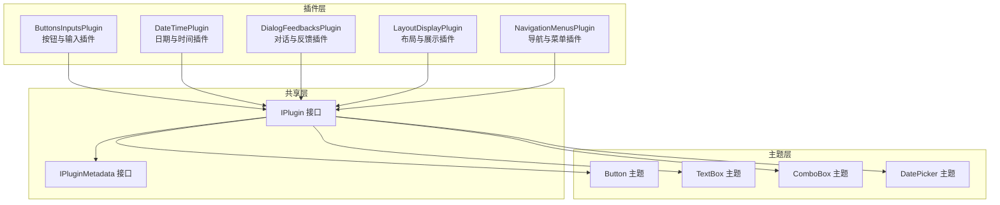
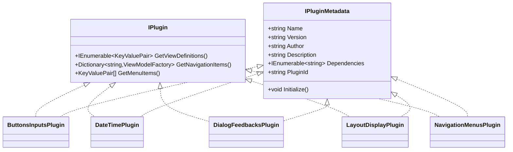
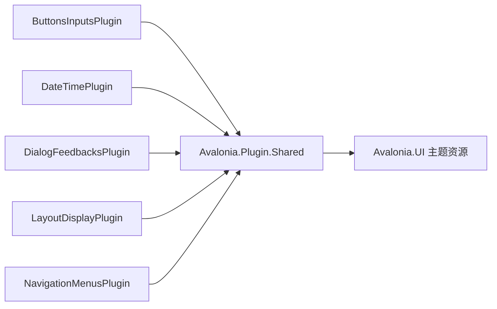

# UI 组件库

<cite>
**本文引用的文件**
- [plugins\Avalonia.Plugin.ButtonsInputs\Avalonia.Plugin.ButtonsInputs.csproj](file://plugins/Avalonia.Plugin.ButtonsInputs/Avalonia.Plugin.ButtonsInputs.csproj)
- [plugins\Avalonia.Plugin.DateTime\Avalonia.Plugin.DateTime.csproj](file://plugins/Avalonia.Plugin.DateTime/Avalonia.Plugin.DateTime.csproj)
- [plugins\Avalonia.Plugin.DialogFeedbacks\Avalonia.Plugin.DialogFeedbacks.csproj](file://plugins/Avalonia.Plugin.DialogFeedbacks/Avalonia.Plugin.DialogFeedbacks.csproj)
- [plugins\Avalonia.Plugin.LayoutDisplay\Avalonia.Plugin.LayoutDisplay.csproj](file://plugins/Avalonia.Plugin.LayoutDisplay/Avalonia.Plugin.LayoutDisplay.csproj)
- [plugins\Avalonia.Plugin.NavigationMenus\Avalonia.Plugin.NavigationMenus.csproj](file://plugins/Avalonia.Plugin.NavigationMenus/Avalonia.Plugin.NavigationMenus.csproj)
- [plugins\Avalonia.Plugin.ButtonsInputs\ButtonsInputsPlugin.cs](file://plugins/Avalonia.Plugin.ButtonsInputs/ButtonsInputsPlugin.cs)
- [plugins\Avalonia.Plugin.DateTime\DateTimePlugin.cs](file://plugins/Avalonia.Plugin.DateTime/DateTimePlugin.cs)
- [plugins\Avalonia.Plugin.DialogFeedbacks\DialogFeedbacksPlugin.cs](file://plugins/Avalonia.Plugin.DialogFeedbacks/DialogFeedbacksPlugin.cs)
- [plugins\Avalonia.Plugin.LayoutDisplay\LayoutDisplayPlugin.cs](file://plugins/Avalonia.Plugin.LayoutDisplay/LayoutDisplayPlugin.cs)
- [plugins\Avalonia.Plugin.NavigationMenus\NavigationMenusPlugin.cs](file://plugins/Avalonia.Plugin.NavigationMenus/NavigationMenusPlugin.cs)
- [src\Avalonia.Plugin.Shared\IPlugin.cs](file://src/Avalonia.Plugin.Shared/IPlugin.cs)
- [src\Avalonia.Plugin.Shared\IPluginMetadata.cs](file://src/Avalonia.Plugin.Shared/IPluginMetadata.cs)
- [src\Avalonia.UI\Theme\Controls\Button.axaml](file://src/Avalonia.UI/Theme/Controls/Button.axaml)
- [src\Avalonia.UI\Theme\Controls\TextBox.axaml](file://src/Avalonia.UI/Theme/Controls/TextBox.axaml)
- [src\Avalonia.UI\Theme\Controls\ComboBox.axaml](file://src/Avalonia.UI/Theme/Controls/ComboBox.axaml)
- [src\Avalonia.UI\Theme\Controls\DatePicker.axaml](file://src/Avalonia.UI/Theme/Controls/DatePicker.axaml)
</cite>

## 目录
1. [简介](#简介)
2. [项目结构](#项目结构)
3. [核心组件](#核心组件)
4. [架构总览](#架构总览)
5. [详细组件分析](#详细组件分析)
6. [依赖分析](#依赖分析)
7. [性能考虑](#性能考虑)
8. [故障排查指南](#故障排查指南)
9. [结论](#结论)
10. [附录](#附录)

## 简介
本文件为 AvaloniaTemplate 的 UI 组件库文档，面向开发者系统化介绍各插件提供的 UI 组件集合与使用方式。内容覆盖按钮与输入类、日期与时间类、对话与反馈类、布局与展示类等模块，并从主题样式、交互行为、响应式设计、可访问性与性能优化等维度给出说明与最佳实践。文档同时提供可视化架构图与流程图，帮助快速理解组件关系与调用路径。

## 项目结构
- 插件层：以功能域划分的独立插件项目，负责注册导航项、菜单项与视图映射，统一通过共享接口暴露能力。
- 主题层：在 Avalonia.UI.Theme.Controls 下集中定义控件的主题样式与状态样式，确保一致的外观与交互体验。
- 共享层：提供插件元数据接口、工具栏模型与通用转换器，支撑插件发现与导航集成。

图表来源
- [plugins\Avalonia.Plugin.ButtonsInputs\ButtonsInputsPlugin.cs:1-100](file://plugins/Avalonia.Plugin.ButtonsInputs/ButtonsInputsPlugin.cs#L1-L100)
- [plugins\Avalonia.Plugin.DateTime\DateTimePlugin.cs:1-20](file://plugins/Avalonia.Plugin.DateTime/DateTimePlugin.cs#L1-L20)
- [plugins\Avalonia.Plugin.DialogFeedbacks\DialogFeedbacksPlugin.cs:1-20](file://plugins/Avalonia.Plugin.DialogFeedbacks/DialogFeedbacksPlugin.cs#L1-L20)
- [plugins\Avalonia.Plugin.LayoutDisplay\LayoutDisplayPlugin.cs:1-20](file://plugins/Avalonia.Plugin.LayoutDisplay/LayoutDisplayPlugin.cs#L1-L20)
- [plugins\Avalonia.Plugin.NavigationMenus\NavigationMenusPlugin.cs:1-20](file://plugins/Avalonia.Plugin.NavigationMenus/NavigationMenusPlugin.cs#L1-L20)
- [src\Avalonia.Plugin.Shared\IPlugin.cs:9-26](file://src/Avalonia.Plugin.Shared/IPlugin.cs#L9-L26)
- [src\Avalonia.Plugin.Shared\IPluginMetadata.cs:3-41](file://src/Avalonia.Plugin.Shared/IPluginMetadata.cs#L3-L41)
- [src\Avalonia.UI\Theme\Controls\Button.axaml:1-423](file://src/Avalonia.UI/Theme/Controls/Button.axaml#L1-L423)
- [src\Avalonia.UI\Theme\Controls\TextBox.axaml:1-647](file://src/Avalonia.UI/Theme/Controls/TextBox.axaml#L1-L647)
- [src\Avalonia.UI\Theme\Controls\ComboBox.axaml:1-346](file://src/Avalonia.UI/Theme/Controls/ComboBox.axaml#L1-L346)
- [src\Avalonia.UI\Theme\Controls\DatePicker.axaml:1-150](file://src/Avalonia.UI/Theme/Controls/DatePicker.axaml#L1-L150)

章节来源
- [plugins\Avalonia.Plugin.ButtonsInputs\Avalonia.Plugin.ButtonsInputs.csproj:1-20](file://plugins/Avalonia.Plugin.ButtonsInputs/Avalonia.Plugin.ButtonsInputs.csproj#L1-L20)
- [plugins\Avalonia.Plugin.DateTime\Avalonia.Plugin.DateTime.csproj:1-21](file://plugins/Avalonia.Plugin.DateTime/Avalonia.Plugin.DateTime.csproj#L1-L21)
- [plugins\Avalonia.Plugin.DialogFeedbacks\Avalonia.Plugin.DialogFeedbacks.csproj:1-19](file://plugins/Avalonia.Plugin.DialogFeedbacks/Avalonia.Plugin.DialogFeedbacks.csproj#L1-L19)
- [plugins\Avalonia.Plugin.LayoutDisplay\Avalonia.Plugin.LayoutDisplay.csproj:1-18](file://plugins/Avalonia.Plugin.LayoutDisplay/Avalonia.Plugin.LayoutDisplay.csproj#L1-L18)
- [plugins\Avalonia.Plugin.NavigationMenus\Avalonia.Plugin.NavigationMenus.csproj:1-18](file://plugins/Avalonia.Plugin.NavigationMenus/Avalonia.Plugin.NavigationMenus.csproj#L1-L18)

## 核心组件
- 插件接口与元数据
  - IPlugin：定义插件向宿主暴露的导航项、菜单项与视图映射能力。
  - IPluginMetadata：定义插件名称、版本、作者、描述、依赖与初始化入口。
- 主题样式
  - Button：提供多种风格（实心/描边/无框）、颜色类别（主色/次色/成功/警告/危险）、尺寸（大/小）、彩色风格等，覆盖悬停/按下/禁用/焦点等伪类状态。
  - TextBox：支持内嵌左右内容、清除按钮、密码显隐切换、占位文本、错误态高亮、横向上下文菜单等。
  - ComboBox：支持占位文本、清空按钮、下拉图标、编辑模式、滚动与弹出层、错误态与边框样式。
  - DatePicker：基于 TextBox 外观，内置日历弹出与确认按钮，支持高亮今日与首日设置。

章节来源
- [src\Avalonia.Plugin.Shared\IPlugin.cs:9-26](file://src/Avalonia.Plugin.Shared/IPlugin.cs#L9-L26)
- [src\Avalonia.Plugin.Shared\IPluginMetadata.cs:3-41](file://src/Avalonia.Plugin.Shared/IPluginMetadata.cs#L3-L41)
- [src\Avalonia.UI\Theme\Controls\Button.axaml:1-423](file://src/Avalonia.UI/Theme/Controls/Button.axaml#L1-L423)
- [src\Avalonia.UI\Theme\Controls\TextBox.axaml:1-647](file://src/Avalonia.UI/Theme/Controls/TextBox.axaml#L1-L647)
- [src\Avalonia.UI\Theme\Controls\ComboBox.axaml:1-346](file://src/Avalonia.UI/Theme/Controls/ComboBox.axaml#L1-L346)
- [src\Avalonia.UI\Theme\Controls\DatePicker.axaml:1-150](file://src/Avalonia.UI/Theme/Controls/DatePicker.axaml#L1-L150)

## 架构总览
插件通过元数据接口声明自身能力，宿主根据导航项与菜单项构建界面；主题层为所有控件提供统一的外观与交互规范，确保跨插件一致性。

图表来源
- [src\Avalonia.Plugin.Shared\IPlugin.cs:9-26](file://src/Avalonia.Plugin.Shared/IPlugin.cs#L9-L26)
- [src\Avalonia.Plugin.Shared\IPluginMetadata.cs:3-41](file://src/Avalonia.Plugin.Shared/IPluginMetadata.cs#L3-L41)
- [plugins\Avalonia.Plugin.ButtonsInputs\ButtonsInputsPlugin.cs:6-24](file://plugins/Avalonia.Plugin.ButtonsInputs/ButtonsInputsPlugin.cs#L6-L24)
- [plugins\Avalonia.Plugin.DateTime\DateTimePlugin.cs:6-18](file://plugins/Avalonia.Plugin.DateTime/DateTimePlugin.cs#L6-L18)
- [plugins\Avalonia.Plugin.DialogFeedbacks\DialogFeedbacksPlugin.cs:6-18](file://plugins/Avalonia.Plugin.DialogFeedbacks/DialogFeedbacksPlugin.cs#L6-L18)
- [plugins\Avalonia.Plugin.LayoutDisplay\LayoutDisplayPlugin.cs:6-18](file://plugins/Avalonia.Plugin.LayoutDisplay/LayoutDisplayPlugin.cs#L6-L18)
- [plugins\Avalonia.Plugin.NavigationMenus\NavigationMenusPlugin.cs:6-18](file://plugins/Avalonia.Plugin.NavigationMenus/NavigationMenusPlugin.cs#L6-L18)

## 详细组件分析

### 按钮与输入类组件
- 按钮 Button
  - 风格：实心、描边、无框、彩色风格。
  - 颜色类别：主色、次色、三级、成功、警告、危险。
  - 尺寸：默认、大、小。
  - 伪类状态：悬停、按下、禁用、焦点。
  - 使用建议：优先使用主题资源控制尺寸与圆角；通过 Classes 切换颜色类别；在图标按钮场景使用内建 PathIcon 主题。
- 文本输入 TextBox
  - 功能：内嵌左右内容、占位文本、清除按钮、密码显隐切换、上下文菜单（桌面/移动）。
  - 错误态：通过 DataValidationErrors 包裹，错误时背景与边框高亮。
  - 响应式：触摸模式自动切换水平上下文菜单。
  - 使用建议：在表单中结合验证器使用错误态；TextArea 场景启用多行与顶部对齐。
- 组合框 ComboBox
  - 功能：占位文本、清空按钮、下拉图标、编辑模式、滚动弹出层。
  - 错误态：与错误态 TextBox 一致的高亮策略。
  - 边框样式：Bordered 变体提供边框强调。
  - 使用建议：可编辑场景注意键盘导航与 Tab 行为；长列表使用虚拟化或限制最大高度。

章节来源
- [src\Avalonia.UI\Theme\Controls\Button.axaml:1-423](file://src/Avalonia.UI/Theme/Controls/Button.axaml#L1-L423)
- [src\Avalonia.UI\Theme\Controls\TextBox.axaml:1-647](file://src/Avalonia.UI/Theme/Controls/TextBox.axaml#L1-L647)
- [src\Avalonia.UI\Theme\Controls\ComboBox.axaml:1-346](file://src/Avalonia.UI/Theme/Controls/ComboBox.axaml#L1-L346)

### 日期与时间类组件
- 日期选择 DatePicker
  - 外观：基于 TextBox，右侧带日历图标与可选清空按钮。
  - 弹出层：内置日历视图与“确认”按钮（按需显示）。
  - 行为：高亮今日、首日设置、焦点边框、禁用态。
  - 使用建议：需要确认流程时启用 NeedConfirmation；配合 FirstDayOfWeek 设置本地化习惯。

章节来源
- [src\Avalonia.UI\Theme\Controls\DatePicker.axaml:1-150](file://src/Avalonia.UI/Theme/Controls/DatePicker.axaml#L1-L150)

### 对话与反馈类组件
- 设计原则
  - 一致性：统一使用主题资源与伪类状态，保证不同弹窗/抽屉/加载/消息提示的视觉连贯。
  - 可访问性：提供焦点装饰器与键盘可达性；避免仅靠颜色传达信息。
  - 性能：弹窗/抽屉延迟加载内容；加载骨架屏减少白屏时间。
- 最佳实践
  - 轻量级提示：Toast/通知卡片用于短时信息反馈。
  - 重要确认：PopConfirm 用于删除/危险操作确认。
  - 复杂交互：Dialog/Drawer 提供承载复杂视图的容器，注意层级管理与阴影/边框主题。

（本节为概念性说明，不直接分析具体源码）

### 布局与展示类组件
- 设计原则
  - 结构化展示：Descriptions/Badge/Banner 等用于信息分组与强调。
  - 响应式布局：配合 WrapPanel/ElasticWrapPanel 实现弹性换行与自适应。
  - 可读性：Typography 与间距遵循主题资源，确保在不同尺寸下的可读性。
- 最佳实践
  - 图片与二维码：ImageViewer/QrCode 提供缩放与生成能力，注意内存占用与渲染性能。
  - 时间线与进度：Timeline/Skeleton 用于长列表与异步加载的占位展示。

（本节为概念性说明，不直接分析具体源码）

### 导航与菜单类组件
- 设计原则
  - 层级清晰：Breadcrumb/NavMenu/Pagination 明确用户位置与跳转路径。
  - 交互明确：ToolBar/Menu 提供常用操作入口，支持溢出模式。
- 最佳实践
  - 保持导航键稳定：插件通过 IPlugin.GetNavigationItems 提供稳定的导航键，便于路由与持久化状态。

章节来源
- [src\Avalonia.Plugin.Shared\IPlugin.cs:19-20](file://src/Avalonia.Plugin.Shared/IPlugin.cs#L19-L20)

## 依赖分析
- 插件到共享层
  - 各插件均实现 IPlugin/IPluginMetadata，依赖共享层的接口契约与工具模型。
- 插件到主题层
  - 所有控件样式集中在主题资源中，插件无需重复定义样式，降低耦合度。
- 项目引用关系
  - 插件项目引用共享层与生成器，确保元数据生成与视图/VM 映射可用。

图表来源
- [plugins\Avalonia.Plugin.ButtonsInputs\ButtonsInputsPlugin.cs:1-100](file://plugins/Avalonia.Plugin.ButtonsInputs/ButtonsInputsPlugin.cs#L1-L100)
- [plugins\Avalonia.Plugin.DateTime\DateTimePlugin.cs:1-20](file://plugins/Avalonia.Plugin.DateTime/DateTimePlugin.cs#L1-L20)
- [plugins\Avalonia.Plugin.DialogFeedbacks\DialogFeedbacksPlugin.cs:1-20](file://plugins/Avalonia.Plugin.DialogFeedbacks/DialogFeedbacksPlugin.cs#L1-L20)
- [plugins\Avalonia.Plugin.LayoutDisplay\LayoutDisplayPlugin.cs:1-20](file://plugins/Avalonia.Plugin.LayoutDisplay/LayoutDisplayPlugin.cs#L1-L20)
- [plugins\Avalonia.Plugin.NavigationMenus\NavigationMenusPlugin.cs:1-20](file://plugins/Avalonia.Plugin.NavigationMenus/NavigationMenusPlugin.cs#L1-L20)
- [src\Avalonia.Plugin.Shared\IPlugin.cs:9-26](file://src/Avalonia.Plugin.Shared/IPlugin.cs#L9-L26)
- [src\Avalonia.Plugin.Shared\IPluginMetadata.cs:3-41](file://src/Avalonia.Plugin.Shared/IPluginMetadata.cs#L3-L41)

章节来源
- [plugins\Avalonia.Plugin.ButtonsInputs\Avalonia.Plugin.ButtonsInputs.csproj:14-17](file://plugins/Avalonia.Plugin.ButtonsInputs/Avalonia.Plugin.ButtonsInputs.csproj#L14-L17)
- [plugins\Avalonia.Plugin.DateTime\Avalonia.Plugin.DateTime.csproj:15-18](file://plugins/Avalonia.Plugin.DateTime/Avalonia.Plugin.DateTime.csproj#L15-L18)
- [plugins\Avalonia.Plugin.DialogFeedbacks\Avalonia.Plugin.DialogFeedbacks.csproj:13-16](file://plugins/Avalonia.Plugin.DialogFeedbacks/Avalonia.Plugin.DialogFeedbacks.csproj#L13-L16)
- [plugins\Avalonia.Plugin.LayoutDisplay\Avalonia.Plugin.LayoutDisplay.csproj:12-15](file://plugins/Avalonia.Plugin.LayoutDisplay/Avalonia.Plugin.LayoutDisplay.csproj#L12-L15)
- [plugins\Avalonia.Plugin.NavigationMenus\Avalonia.Plugin.NavigationMenus.csproj:12-15](file://plugins/Avalonia.Plugin.NavigationMenus/Avalonia.Plugin.NavigationMenus.csproj#L12-L15)

## 性能考虑
- 渲染与动画
  - 使用主题资源统一尺寸与过渡，避免在控件上重复设置昂贵的动画。
  - 弹出层与抽屉采用延迟加载与轻量阴影，减少初始渲染压力。
- 内存与资源
  - 图片与二维码生成需注意缓存与释放；长列表使用虚拟化或分页。
  - 加载骨架屏（Skeleton）与渐进式内容展示，提升感知性能。
- 响应式与布局
  - 在小屏设备上减少不必要的重排与重绘；合理使用 WrapPanel 与弹性布局。

（本节为通用指导，不直接分析具体源码）

## 故障排查指南
- 样式未生效
  - 检查是否正确引用主题资源与 ControlTheme；确认伪类状态是否被覆盖。
- 输入控件无法交互
  - 确认 IsEnabled 与 IsReadOnly 状态；在错误态下 DataValidationErrors 可能影响点击命中区域。
- 弹出层定位异常
  - 检查 Popup 的 PlacementTarget 与偏移设置；在复杂布局中考虑 InheritsTransform。
- 导航与菜单项缺失
  - 确认插件已实现 IPlugin 并返回正确的导航项/菜单项；检查插件初始化顺序。

章节来源
- [src\Avalonia.UI\Theme\Controls\TextBox.axaml:158-178](file://src/Avalonia.UI/Theme/Controls/TextBox.axaml#L158-L178)
- [src\Avalonia.UI\Theme\Controls\ComboBox.axaml:118-148](file://src/Avalonia.UI/Theme/Controls/ComboBox.axaml#L118-L148)
- [src\Avalonia.UI\Theme\Controls\DatePicker.axaml:70-104](file://src/Avalonia.UI/Theme/Controls/DatePicker.axaml#L70-L104)
- [src\Avalonia.Plugin.Shared\IPlugin.cs:19-20](file://src/Avalonia.Plugin.Shared/IPlugin.cs#L19-L20)

## 结论
AvaloniaTemplate 的 UI 组件库通过插件化架构与统一主题体系，实现了高内聚、低耦合的组件生态。开发者可基于主题资源快速定制样式，依托插件接口扩展导航与菜单，结合最佳实践在可访问性与性能方面获得良好平衡。建议在实际项目中优先使用主题资源与伪类状态，避免过度自定义导致维护成本上升。

## 附录
- 快速开始
  - 引入插件项目并实现 IPlugin/IPluginMetadata。
  - 在主题资源中选择合适的 ControlTheme 与样式变体。
  - 使用 ViewModelFactory 与 ViewFactory 建立视图映射，完成导航集成。
- 参考路径
  - 插件接口与元数据：[IPlugin.cs:9-26](file://src/Avalonia.Plugin.Shared/IPlugin.cs#L9-L26)，[IPluginMetadata.cs:3-41](file://src/Avalonia.Plugin.Shared/IPluginMetadata.cs#L3-L41)
  - 控件主题：[Button.axaml:1-423](file://src/Avalonia.UI/Theme/Controls/Button.axaml#L1-L423)，[TextBox.axaml:1-647](file://src/Avalonia.UI/Theme/Controls/TextBox.axaml#L1-L647)，[ComboBox.axaml:1-346](file://src/Avalonia.UI/Theme/Controls/ComboBox.axaml#L1-L346)，[DatePicker.axaml:1-150](file://src/Avalonia.UI/Theme/Controls/DatePicker.axaml#L1-L150)