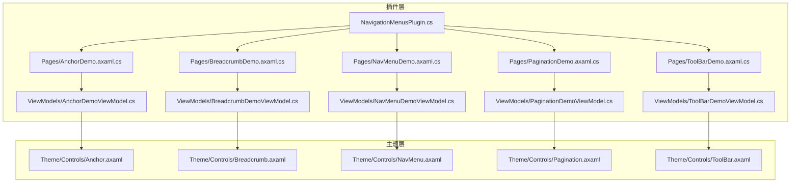
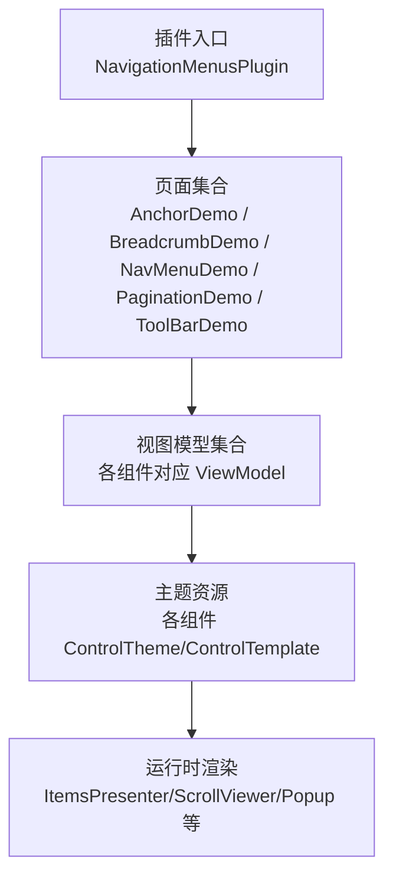
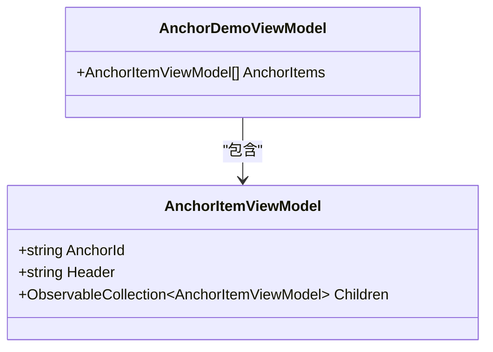
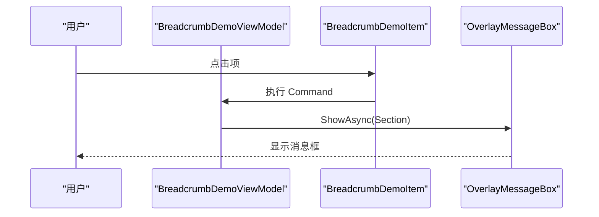
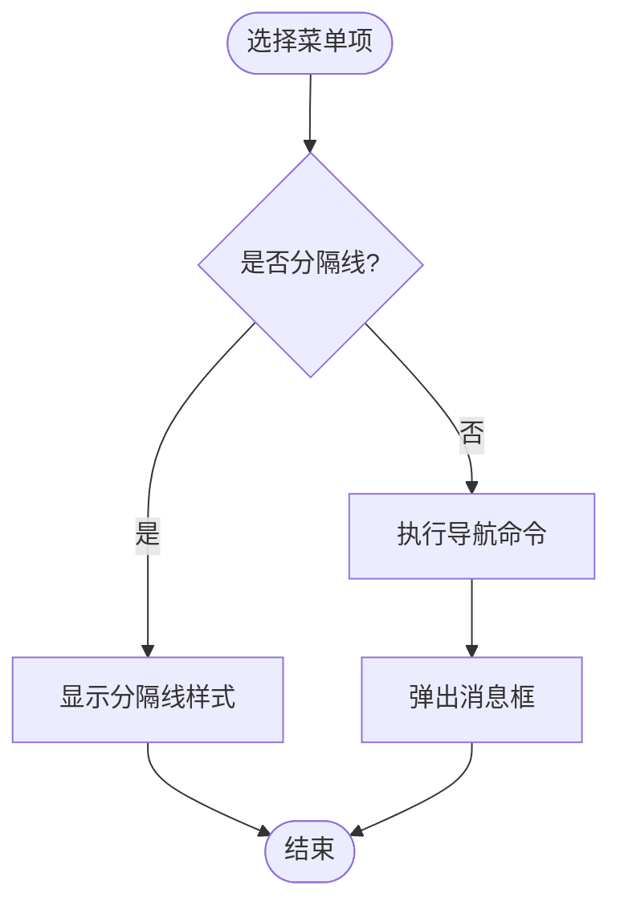
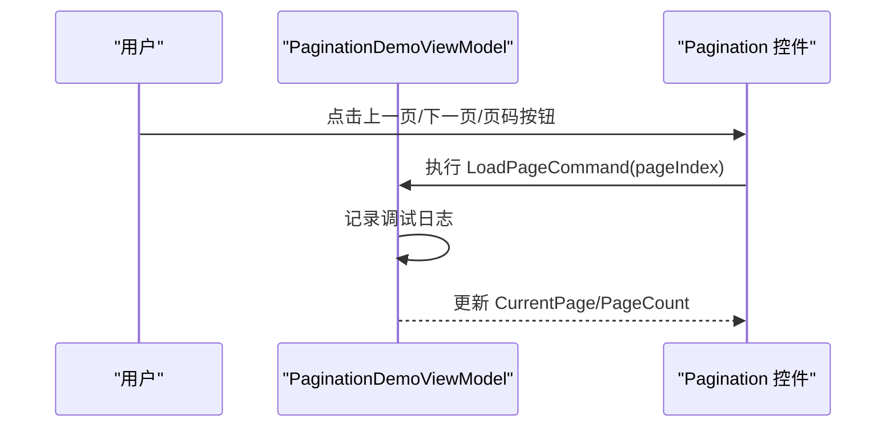
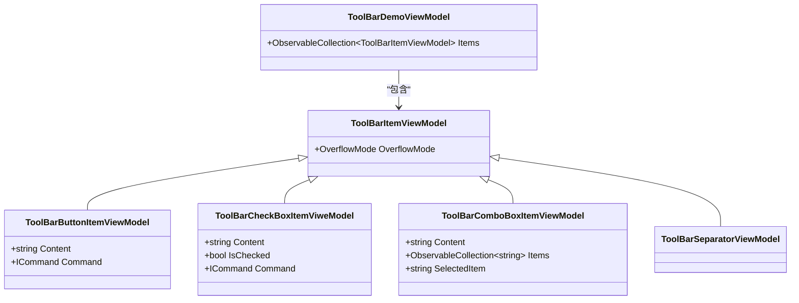
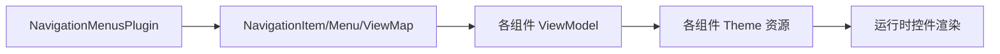

# 导航菜单组件

<cite>
**本文档引用的文件**
- [NavigationMenusPlugin.cs](file://plugins/Avalonia.Plugin.NavigationMenus/NavigationMenusPlugin.cs)
- [AnchorDemo.axaml.cs](file://plugins/Avalonia.Plugin.NavigationMenus/Pages/AnchorDemo.axaml.cs)
- [BreadcrumbDemo.axaml.cs](file://plugins/Avalonia.Plugin.NavigationMenus/Pages/BreadcrumbDemo.axaml.cs)
- [NavMenuDemo.axaml.cs](file://plugins/Avalonia.Plugin.NavigationMenus/Pages/NavMenuDemo.axaml.cs)
- [PaginationDemo.axaml.cs](file://plugins/Avalonia.Plugin.NavigationMenus/Pages/PaginationDemo.axaml.cs)
- [ToolBarDemo.axaml.cs](file://plugins/Avalonia.Plugin.NavigationMenus/Pages/ToolBarDemo.axaml.cs)
- [AnchorDemoViewModel.cs](file://plugins/Avalonia.Plugin.NavigationMenus/ViewModels/AnchorDemoViewModel.cs)
- [BreadcrumbDemoViewModel.cs](file://plugins/Avalonia.Plugin.NavigationMenus/ViewModels/BreadcrumbDemoViewModel.cs)
- [NavMenuDemoViewModel.cs](file://plugins/Avalonia.Plugin.NavigationMenus/ViewModels/NavMenuDemoViewModel.cs)
- [PaginationDemoViewModel.cs](file://plugins/Avalonia.Plugin.NavigationMenus/ViewModels/PaginationDemoViewModel.cs)
- [ToolBarDemoViewModel.cs](file://plugins/Avalonia.Plugin.NavigationMenus/ViewModels/ToolBarDemoViewModel.cs)
- [Anchor.axaml](file://src/Avalonia.UI/Theme/Controls/Anchor.axaml)
- [Breadcrumb.axaml](file://src/Avalonia.UI/Theme/Controls/Breadcrumb.axaml)
- [NavMenu.axaml](file://src/Avalonia.UI/Theme/Controls/NavMenu.axaml)
- [Pagination.axaml](file://src/Avalonia.UI/Theme/Controls/Pagination.axaml)
- [ToolBar.axaml](file://src/Avalonia.UI/Theme/Controls/ToolBar.axaml)
</cite>

## 目录
1. [简介](#简介)
2. [项目结构](#项目结构)
3. [核心组件](#核心组件)
4. [架构总览](#架构总览)
5. [组件详细分析](#组件详细分析)
6. [依赖关系分析](#依赖关系分析)
7. [性能考虑](#性能考虑)
8. [故障排除指南](#故障排除指南)
9. [结论](#结论)
10. [附录](#附录)

## 简介
本文件系统性地介绍导航菜单插件（NavigationMenusPlugin）提供的导航与菜单组件，包括锚点（Anchor）、面包屑（Breadcrumb）、导航菜单（NavMenu）、分页（Pagination）、工具栏（ToolBar）。文档从架构、数据流、状态管理、交互体验、可访问性与本地化、响应式行为与性能优化等维度进行深入说明，并提供配置项、事件处理、样式定制与主题适配指南。

## 项目结构
导航菜单插件位于 plugins/Avalonia.Plugin.NavigationMenus 目录，采用“页面+视图模型”的演示结构，配合 src/Avalonia.UI/Theme/Controls 下的主题资源定义组件外观与交互。

图表来源
- [NavigationMenusPlugin.cs:1-20](file://plugins/Avalonia.Plugin.NavigationMenus/NavigationMenusPlugin.cs#L1-L20)
- [AnchorDemo.axaml.cs:1-17](file://plugins/Avalonia.Plugin.NavigationMenus/Pages/AnchorDemo.axaml.cs#L1-L17)
- [BreadcrumbDemo.axaml.cs:1-17](file://plugins/Avalonia.Plugin.NavigationMenus/Pages/BreadcrumbDemo.axaml.cs#L1-L17)
- [NavMenuDemo.axaml.cs:1-17](file://plugins/Avalonia.Plugin.NavigationMenus/Pages/NavMenuDemo.axaml.cs#L1-L17)
- [PaginationDemo.axaml.cs:1-17](file://plugins/Avalonia.Plugin.NavigationMenus/Pages/PaginationDemo.axaml.cs#L1-L17)
- [ToolBarDemo.axaml.cs:1-17](file://plugins/Avalonia.Plugin.NavigationMenus/Pages/ToolBarDemo.axaml.cs#L1-L17)
- [AnchorDemoViewModel.cs:1-55](file://plugins/Avalonia.Plugin.NavigationMenus/ViewModels/AnchorDemoViewModel.cs#L1-L55)
- [BreadcrumbDemoViewModel.cs:1-48](file://plugins/Avalonia.Plugin.NavigationMenus/ViewModels/BreadcrumbDemoViewModel.cs#L1-L48)
- [NavMenuDemoViewModel.cs:1-140](file://plugins/Avalonia.Plugin.NavigationMenus/ViewModels/NavMenuDemoViewModel.cs#L1-L140)
- [PaginationDemoViewModel.cs:1-34](file://plugins/Avalonia.Plugin.NavigationMenus/ViewModels/PaginationDemoViewModel.cs#L1-L34)
- [ToolBarDemoViewModel.cs:1-96](file://plugins/Avalonia.Plugin.NavigationMenus/ViewModels/ToolBarDemoViewModel.cs#L1-L96)
- [Anchor.axaml:1-90](file://src/Avalonia.UI/Theme/Controls/Anchor.axaml#L1-L90)
- [Breadcrumb.axaml:1-96](file://src/Avalonia.UI/Theme/Controls/Breadcrumb.axaml#L1-L96)
- [NavMenu.axaml:1-290](file://src/Avalonia.UI/Theme/Controls/NavMenu.axaml#L1-L290)
- [Pagination.axaml:1-184](file://src/Avalonia.UI/Theme/Controls/Pagination.axaml#L1-L184)
- [ToolBar.axaml:1-139](file://src/Avalonia.UI/Theme/Controls/ToolBar.axaml#L1-L139)

章节来源
- [NavigationMenusPlugin.cs:1-20](file://plugins/Avalonia.Plugin.NavigationMenus/NavigationMenusPlugin.cs#L1-L20)

## 核心组件
- 锚点（Anchor）
  - 角色：树形层级展示与跳转定位，支持多级子节点与选中态视觉反馈。
  - 关键属性：Header、Children、Level、Selected。
  - 主题资源：管道背景、选中态前景、尺寸与内边距等。
- 面包屑（Breadcrumb）
  - 角色：路径导航与当前页标识，支持图标、只读项与悬停交互。
  - 关键属性：Items、Separator、Icon、IsReadOnly、Content。
  - 主题资源：分隔符颜色、最后项强调、指针悬停态。
- 导航菜单（NavMenu）
  - 角色：主侧边导航，支持折叠/展开、溢出弹出、层级缩进、动画过渡。
  - 关键属性：MenuItems、SelectedMenuItem、SubMenuIndent、IsHorizontalCollapsed、Header/Footer。
  - 主题资源：滚动条透明度、宽度动画、展开/收起图标旋转、分隔线样式。
- 分页（Pagination）
  - 角色：列表/表格分页控制，支持快速跳转与每页数量选择。
  - 关键属性：PageCount、CurrentPage、ShowQuickJump、ShowPageSizeSelector、PageSizeOptions。
  - 主题资源：按钮默认/悬停/按下/选中态、左右省略号按钮图标、只读模式布局。
- 工具栏（ToolBar）
  - 角色：工具集容器，支持溢出弹出、水平/垂直方向、分隔符与多种控件项。
  - 关键属性：Items、Orientation、PopupPlacement、Header。
  - 主题资源：展开按钮、溢出弹出面板、分隔符方向样式。

章节来源
- [AnchorDemoViewModel.cs:14-49](file://plugins/Avalonia.Plugin.NavigationMenus/ViewModels/AnchorDemoViewModel.cs#L14-L49)
- [BreadcrumbDemoViewModel.cs:17-42](file://plugins/Avalonia.Plugin.NavigationMenus/ViewModels/BreadcrumbDemoViewModel.cs#L17-L42)
- [NavMenuDemoViewModel.cs:19-92](file://plugins/Avalonia.Plugin.NavigationMenus/ViewModels/NavMenuDemoViewModel.cs#L19-L92)
- [PaginationDemoViewModel.cs:16-28](file://plugins/Avalonia.Plugin.NavigationMenus/ViewModels/PaginationDemoViewModel.cs#L16-L28)
- [ToolBarDemoViewModel.cs:17-90](file://plugins/Avalonia.Plugin.NavigationMenus/ViewModels/ToolBarDemoViewModel.cs#L17-L90)

## 架构总览
导航菜单插件通过元数据特性注册到系统菜单与导航体系，页面与视图模型解耦，主题资源统一管理组件外观与交互状态。

图表来源
- [NavigationMenusPlugin.cs:6-19](file://plugins/Avalonia.Plugin.NavigationMenus/NavigationMenusPlugin.cs#L6-L19)
- [AnchorDemo.axaml.cs:1-17](file://plugins/Avalonia.Plugin.NavigationMenus/Pages/AnchorDemo.axaml.cs#L1-L17)
- [BreadcrumbDemo.axaml.cs:1-17](file://plugins/Avalonia.Plugin.NavigationMenus/Pages/BreadcrumbDemo.axaml.cs#L1-L17)
- [NavMenuDemo.axaml.cs:1-17](file://plugins/Avalonia.Plugin.NavigationMenus/Pages/NavMenuDemo.axaml.cs#L1-L17)
- [PaginationDemo.axaml.cs:1-17](file://plugins/Avalonia.Plugin.NavigationMenus/Pages/PaginationDemo.axaml.cs#L1-L17)
- [ToolBarDemo.axaml.cs:1-17](file://plugins/Avalonia.Plugin.NavigationMenus/Pages/ToolBarDemo.axaml.cs#L1-L17)
- [Anchor.axaml:7-29](file://src/Avalonia.UI/Theme/Controls/Anchor.axaml#L7-L29)
- [Breadcrumb.axaml:15-22](file://src/Avalonia.UI/Theme/Controls/Breadcrumb.axaml#L15-L22)
- [NavMenu.axaml:7-51](file://src/Avalonia.UI/Theme/Controls/NavMenu.axaml#L7-L51)
- [Pagination.axaml:10-49](file://src/Avalonia.UI/Theme/Controls/Pagination.axaml#L10-L49)
- [ToolBar.axaml:27-116](file://src/Avalonia.UI/Theme/Controls/ToolBar.axaml#L27-L116)

## 组件详细分析

### 锚点（Anchor）
- 数据结构与状态
  - 支持树形结构，父节点可包含多个子节点；选中态通过样式选择器应用。
  - 尺寸与内边距由主题资源控制，支持 Small 模式与 muted 主题变体。
- 路由与导航
  - 通过命令或点击事件触发导航动作，结合 OverlayMessageBox 展示结果。
- 可访问性与本地化
  - 使用 ClassHelper.ClassSource 绑定父级 Anchor，确保样式继承链正确。
  - 文本内容通过 Header/ContentTemplate 绑定，便于多语言切换。
- 响应式与性能
  - ItemsPresenter 渲染子项，TreeLevelToPaddingConverter 控制缩进，避免过度重排。
  - 选中态与管道背景使用动态资源，减少硬编码样式。

图表来源
- [AnchorDemoViewModel.cs:14-49](file://plugins/Avalonia.Plugin.NavigationMenus/ViewModels/AnchorDemoViewModel.cs#L14-L49)

章节来源
- [AnchorDemoViewModel.cs:14-49](file://plugins/Avalonia.Plugin.NavigationMenus/ViewModels/AnchorDemoViewModel.cs#L14-L49)
- [Anchor.axaml:31-89](file://src/Avalonia.UI/Theme/Controls/Anchor.axaml#L31-L89)

### 面包屑（Breadcrumb）
- 数据结构与状态
  - Items 为集合，支持只读项（IsReadOnly）与图标（Icon）。
  - 最后一项强调显示，悬停态改变前景色。
- 路由与导航
  - 每个项绑定命令，在执行时弹出消息框展示当前项内容。
- 可访问性与本地化
  - 内容与图标分别通过 ContentPresenter/IconPresenter 绑定，支持模板化。
  - 分隔符颜色与可见性由模板属性控制。
- 响应式与性能
  - 仅在有内容时显示对应 Presenter，减少无效渲染。

图表来源
- [BreadcrumbDemoViewModel.cs:33-41](file://plugins/Avalonia.Plugin.NavigationMenus/ViewModels/BreadcrumbDemoViewModel.cs#L33-L41)

章节来源
- [BreadcrumbDemoViewModel.cs:17-42](file://plugins/Avalonia.Plugin.NavigationMenus/ViewModels/BreadcrumbDemoViewModel.cs#L17-L42)
- [Breadcrumb.axaml:24-95](file://src/Avalonia.UI/Theme/Controls/Breadcrumb.axaml#L24-L95)

### 导航菜单（NavMenu）
- 数据结构与状态
  - 支持分隔线（IsSeparator）、子菜单（Children）、随机叶子节点选择。
  - 选中项通过 SelectedMenuItem 绑定，支持焦点与悬停态。
- 路由与导航
  - 每个菜单项绑定异步导航命令，弹出消息框展示导航结果。
  - 支持水平折叠模式，首级项仅显示图标，其余级显示展开图标旋转。
- 动画与交互
  - 宽度动画由 SizeAnimationHelper 触发，展开/收起时使用 TransformOperationsTransition。
  - 子项展开/收起使用 LayoutTransformControl 与透明度过渡。
- 可访问性与本地化
  - 首级项在折叠模式下启用 ToolTip，提升无障碍体验。
  - 头部/底部 ContentPresenter 支持模板化，便于国际化。

图表来源
- [NavMenuDemoViewModel.cs:104-113](file://plugins/Avalonia.Plugin.NavigationMenus/ViewModels/NavMenuDemoViewModel.cs#L104-L113)
- [NavMenu.axaml:154-287](file://src/Avalonia.UI/Theme/Controls/NavMenu.axaml#L154-L287)

章节来源
- [NavMenuDemoViewModel.cs:19-92](file://plugins/Avalonia.Plugin.NavigationMenus/ViewModels/NavMenuDemoViewModel.cs#L19-L92)
- [NavMenu.axaml:7-51](file://src/Avalonia.UI/Theme/Controls/NavMenu.axaml#L7-L51)

### 分页（Pagination）
- 数据结构与状态
  - PageSizes 为可配置的每页数量集合，CurrentPage/ PageCount 控制分页范围。
  - QuickJump 输入框与 PageSize 选择器按条件显示。
- 路由与导航
  - 加载页面命令接收页码参数，用于日志输出或触发数据加载。
  - Tiny 主题提供紧凑布局，支持只读模式切换。
- 可访问性与本地化
  - 字符串资源用于“跳转至”、“页”等文案，便于多语言替换。
- 响应式与性能
  - 通过 ShowQuickJump/ShowPageSizeSelector 控制元素可见性，避免不必要的布局计算。

图表来源
- [PaginationDemoViewModel.cs:21-27](file://plugins/Avalonia.Plugin.NavigationMenus/ViewModels/PaginationDemoViewModel.cs#L21-L27)
- [Pagination.axaml:10-49](file://src/Avalonia.UI/Theme/Controls/Pagination.axaml#L10-L49)

章节来源
- [PaginationDemoViewModel.cs:16-28](file://plugins/Avalonia.Plugin.NavigationMenus/ViewModels/PaginationDemoViewModel.cs#L16-L28)
- [Pagination.axaml:51-104](file://src/Avalonia.UI/Theme/Controls/Pagination.axaml#L51-L104)

### 工具栏（ToolBar）
- 数据结构与状态
  - Items 为工具栏项集合，支持按钮、复选框、组合框与分隔符。
  - OverflowMode 控制溢出策略，Popup 弹出面板承载溢出项。
- 路由与导航
  - 各项绑定命令，点击时弹出消息框展示内容。
- 可访问性与本地化
  - ExpandToggleButton 支持 AccessKey 识别，便于键盘操作。
  - Orientation=Vertical 时调整布局与图标方向。
- 响应式与性能
  - 仅在溢出时显示展开按钮，减少非必要元素。

图表来源
- [ToolBarDemoViewModel.cs:17-90](file://plugins/Avalonia.Plugin.NavigationMenus/ViewModels/ToolBarDemoViewModel.cs#L17-L90)

章节来源
- [ToolBarDemoViewModel.cs:17-90](file://plugins/Avalonia.Plugin.NavigationMenus/ViewModels/ToolBarDemoViewModel.cs#L17-L90)
- [ToolBar.axaml:27-116](file://src/Avalonia.UI/Theme/Controls/ToolBar.axaml#L27-L116)

## 依赖关系分析
- 插件元数据
  - NavigationMenusPlugin 使用 [GenerateMetadata] 注册插件信息，作为导航与菜单演示插件。
- 页面与视图模型
  - 每个 Demo 页面通过 [NavigationItem]/[Menu]/[ViewMap] 特性映射到对应的视图模型。
- 主题资源
  - 各组件通过 ControlTheme/ControlTemplate 定义外观，依赖动态资源与转换器实现响应式与主题适配。

图表来源
- [NavigationMenusPlugin.cs:6-19](file://plugins/Avalonia.Plugin.NavigationMenus/NavigationMenusPlugin.cs#L6-L19)
- [AnchorDemoViewModel.cs:9-11](file://plugins/Avalonia.Plugin.NavigationMenus/ViewModels/AnchorDemoViewModel.cs#L9-L11)
- [BreadcrumbDemoViewModel.cs:12-14](file://plugins/Avalonia.Plugin.NavigationMenus/ViewModels/BreadcrumbDemoViewModel.cs#L12-L14)
- [NavMenuDemoViewModel.cs:12-14](file://plugins/Avalonia.Plugin.NavigationMenus/ViewModels/NavMenuDemoViewModel.cs#L12-L14)
- [PaginationDemoViewModel.cs:11-13](file://plugins/Avalonia.Plugin.NavigationMenus/ViewModels/PaginationDemoViewModel.cs#L11-L13)
- [ToolBarDemoViewModel.cs:12-14](file://plugins/Avalonia.Plugin.NavigationMenus/ViewModels/ToolBarDemoViewModel.cs#L12-L14)

章节来源
- [NavigationMenusPlugin.cs:6-19](file://plugins/Avalonia.Plugin.NavigationMenus/NavigationMenusPlugin.cs#L6-L19)

## 性能考虑
- 减少无效渲染
  - 条件可见性（如 IsReadOnly、ShowQuickJump、ShowPageSizeSelector）避免不必要元素绘制。
- 布局与动画
  - 使用 SharedSizeGroup 与 LayoutTransformControl 控制布局一致性与平滑过渡。
  - 滚动条透明度与自动隐藏减少视觉干扰。
- 数据绑定
  - 使用 ObservableCollection 与属性变更通知，避免全量刷新。
- 主题资源
  - 动态资源与转换器集中管理，降低重复样式定义带来的内存占用。

## 故障排除指南
- 无法显示菜单项
  - 检查 MenuItems 是否正确初始化，确认 SelectedMenuItem 绑定有效。
- 折叠模式下无提示
  - 确认 IsHorizontalCollapsed 条件样式已应用，首级项 ToolTip 已启用。
- 分页按钮不可用
  - 检查 LoadPageCommand 参数与 CurrentPage/ PageCount 绑定，确认 ShowQuickJump/ShowPageSizeSelector 设置。
- 工具栏溢出按钮不显示
  - 确认 Items 中存在溢出项且 OverflowMode 配置正确，检查 Popup 是否打开。
- 面包屑最后一项未强调
  - 检查 IsReadOnly 与 last 选择器样式，确认 Content/Icon 的可见性绑定。

章节来源
- [NavMenu.axaml:42-50](file://src/Avalonia.UI/Theme/Controls/NavMenu.axaml#L42-L50)
- [Pagination.axaml:42-46](file://src/Avalonia.UI/Theme/Controls/Pagination.axaml#L42-L46)
- [ToolBar.axaml:113-115](file://src/Avalonia.UI/Theme/Controls/ToolBar.axaml#L113-L115)
- [Breadcrumb.axaml:67-86](file://src/Avalonia.UI/Theme/Controls/Breadcrumb.axaml#L67-L86)

## 结论
导航菜单组件通过清晰的数据结构、完善的主题资源与良好的可访问性设计，提供了从锚点、面包屑到导航菜单、分页与工具栏的完整导航体验。建议在实际项目中结合业务场景合理配置溢出策略、动画开关与本地化资源，以获得更佳的用户体验与维护性。

## 附录

### 配置选项与事件处理清单
- 锚点（Anchor）
  - 属性：Header、Children、Level、Selected
  - 事件：点击/命令触发导航
  - 主题：管道背景、选中态前景、尺寸资源
- 面包屑（Breadcrumb）
  - 属性：Items、Separator、Icon、IsReadOnly、Content
  - 事件：项命令执行
  - 主题：分隔符颜色、最后项强调、指针悬停态
- 导航菜单（NavMenu）
  - 属性：MenuItems、SelectedMenuItem、SubMenuIndent、IsHorizontalCollapsed、Header/Footer
  - 事件：导航命令、展开/收起动画
  - 主题：宽度动画、滚动条透明度、展开图标旋转
- 分页（Pagination）
  - 属性：PageCount、CurrentPage、ShowQuickJump、ShowPageSizeSelector、PageSizeOptions
  - 事件：加载页面命令
  - 主题：按钮状态、图标资源、只读布局
- 工具栏（ToolBar）
  - 属性：Items、Orientation、PopupPlacement、Header
  - 事件：各项命令
  - 主题：展开按钮、溢出弹出面板、分隔符方向

章节来源
- [Anchor.axaml:7-29](file://src/Avalonia.UI/Theme/Controls/Anchor.axaml#L7-L29)
- [Breadcrumb.axaml:15-22](file://src/Avalonia.UI/Theme/Controls/Breadcrumb.axaml#L15-L22)
- [NavMenu.axaml:7-51](file://src/Avalonia.UI/Theme/Controls/NavMenu.axaml#L7-L51)
- [Pagination.axaml:10-49](file://src/Avalonia.UI/Theme/Controls/Pagination.axaml#L10-L49)
- [ToolBar.axaml:27-116](file://src/Avalonia.UI/Theme/Controls/ToolBar.axaml#L27-L116)