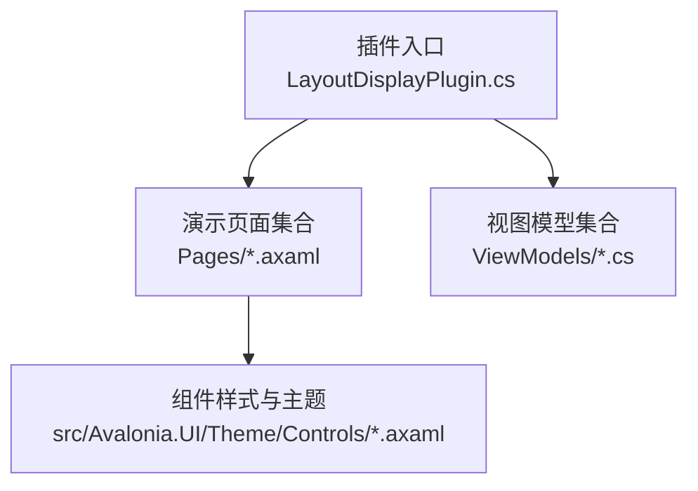
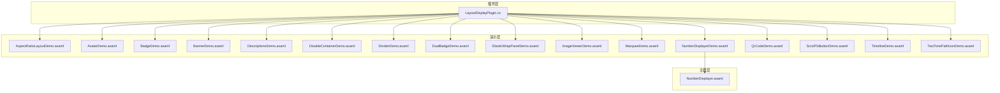

# 布局显示组件

<cite>
**本文引用的文件**
- [LayoutDisplayPlugin.cs](file://plugins/Avalonia.Plugin.LayoutDisplay/LayoutDisplayPlugin.cs)
- [AspectRatioLayoutDemo.axaml](file://plugins/Avalonia.Plugin.LayoutDisplay/Pages/AspectRatioLayoutDemo.axaml)
- [AvatarDemo.axaml](file://plugins/Avalonia.Plugin.LayoutDisplay/Pages/AvatarDemo.axaml)
- [BadgeDemo.axaml](file://plugins/Avalonia.Plugin.LayoutDisplay/Pages/BadgeDemo.axaml)
- [BannerDemo.axaml](file://plugins/Avalonia.Plugin.LayoutDisplay/Pages/BannerDemo.axaml)
- [DescriptionsDemo.axaml](file://plugins/Avalonia.Plugin.LayoutDisplay/Pages/DescriptionsDemo.axaml)
- [DisableContainerDemo.axaml](file://plugins/Avalonia.Plugin.LayoutDisplay/Pages/DisableContainerDemo.axaml)
- [DividerDemo.axaml](file://plugins/Avalonia.Plugin.LayoutDisplay/Pages/DividerDemo.axaml)
- [DualBadgeDemo.axaml](file://plugins/Avalonia.Plugin.LayoutDisplay/Pages/DualBadgeDemo.axaml)
- [ElasticWrapPanelDemo.axaml](file://plugins/Avalonia.Plugin.LayoutDisplay/Pages/ElasticWrapPanelDemo.axaml)
- [ImageViewerDemo.axaml](file://plugins/Avalonia.Plugin.LayoutDisplay/Pages/ImageViewerDemo.axaml)
- [MarqueeDemo.axaml](file://plugins/Avalonia.Plugin.LayoutDisplay/Pages/MarqueeDemo.axaml)
- [NumberDisplayerDemo.axaml](file://plugins/Avalonia.Plugin.LayoutDisplay/Pages/NumberDisplayerDemo.axaml)
- [QrCodeDemo.axaml](file://plugins/Avalonia.Plugin.LayoutDisplay/Pages/QrCodeDemo.axaml)
- [ScrollToButtonDemo.axaml](file://plugins/Avalonia.Plugin.LayoutDisplay/Pages/ScrollToButtonDemo.axaml)
- [TimelineDemo.axaml](file://plugins/Avalonia.Plugin.LayoutDisplay/Pages/TimelineDemo.axaml)
- [TwoTonePathIconDemo.axaml](file://plugins/Avalonia.Plugin.LayoutDisplay/Pages/TwoTonePathIconDemo.axaml)
- [NumberDisplayer.axaml](file://src/Avalonia.UI/Theme/Controls/NumberDisplayer.axaml)
</cite>

## 目录
1. [简介](#简介)
2. [项目结构](#项目结构)
3. [核心组件](#核心组件)
4. [架构总览](#架构总览)
5. [详细组件分析](#详细组件分析)
6. [依赖关系分析](#依赖关系分析)
7. [性能考虑](#性能考虑)
8. [故障排查指南](#故障排查指南)
9. [结论](#结论)
10. [附录](#附录)

## 简介
本文件面向“布局与显示”插件（LayoutDisplayPlugin）提供的各类布局与展示控件，系统梳理其功能特性、布局算法、响应式支持、动画与视觉样式、属性配置、事件处理、样式定制与主题适配，并给出性能优化、内存管理与可访问性建议。覆盖组件包括：AspectRatioLayout、Avatar、Badge、Banner、Descriptions、DisableContainer、Divider、DualBadge、ElasticWrapPanel、ImageViewer、Marquee、NumberDisplayer、QrCode、ScrollToButton、Timeline、TwoTonePathIcon 等。

## 项目结构
- 插件入口与元数据：通过插件元数据类声明插件名称、版本、作者、描述等信息，并在初始化阶段预留扩展点。
- 演示页面：每个组件均配套独立的演示页面（.axaml），用于直观展示组件用法、属性与样式。
- 主题与样式：组件样式与主题资源位于 Avalonia.UI 的主题目录中，便于统一风格与主题切换。

**图表来源**
- [LayoutDisplayPlugin.cs:1-20](file://plugins/Avalonia.Plugin.LayoutDisplay/LayoutDisplayPlugin.cs#L1-L20)

**章节来源**
- [LayoutDisplayPlugin.cs:1-20](file://plugins/Avalonia.Plugin.LayoutDisplay/LayoutDisplayPlugin.cs#L1-L20)

## 核心组件
本节概览各组件的功能定位与典型应用场景：
- AspectRatioLayout：按纵横比自适应内容区域，适合需要保持特定宽高比的容器场景。
- Avatar：头像组件，支持占位文本、图片源、悬停遮罩、尺寸与色彩主题类。
- Badge：徽标组件，支持角标位置、点状徽标、溢出计数、多种主题样式。
- Banner：横幅提示组件，支持标题/内容、类型、图标、边框、关闭等。
- Descriptions：描述列表，支持垂直/水平方向、标签位置、对齐方式、列包装面板。
- DisableContainer：禁用容器装饰器，为被禁用控件提供提示与遮罩。
- Divider：分割线，支持水平/垂直、内容对齐、空心/实心样式。
- DualBadge：双段徽标，支持多种风格（Flat、FlatSquare、Plastic、ForTheBadge）与颜色主题。
- ElasticWrapPanel：弹性换行面板，适合动态宽度下的流式布局。
- ImageViewer：图片查看器，支持缩放、平移、全屏预览等交互。
- Marquee：滚动跑马灯，适合长文本或标题的循环滚动展示。
- NumberDisplayer：数字显示器，支持数值格式化、动画过渡、主题样式。
- QrCode：二维码生成与渲染，支持尺寸、前景色、背景色与错误处理。
- ScrollToButton：滚动到顶部按钮，支持可见性与动画返回顶部。
- Timeline：时间轴，支持节点图标、标签、方向与模板选择。
- TwoTonePathIcon：双色路径图标，支持主题与双色调渲染。

**章节来源**
- [AspectRatioLayoutDemo.axaml:1-80](file://plugins/Avalonia.Plugin.LayoutDisplay/Pages/AspectRatioLayoutDemo.axaml#L1-L80)
- [AvatarDemo.axaml:1-104](file://plugins/Avalonia.Plugin.LayoutDisplay/Pages/AvatarDemo.axaml#L1-L104)
- [BadgeDemo.axaml:1-337](file://plugins/Avalonia.Plugin.LayoutDisplay/Pages/BadgeDemo.axaml#L1-L337)
- [BannerDemo.axaml:1-69](file://plugins/Avalonia.Plugin.LayoutDisplay/Pages/BannerDemo.axaml#L1-L69)
- [DescriptionsDemo.axaml:1-125](file://plugins/Avalonia.Plugin.LayoutDisplay/Pages/DescriptionsDemo.axaml#L1-L125)
- [DisableContainerDemo.axaml:1-30](file://plugins/Avalonia.Plugin.LayoutDisplay/Pages/DisableContainerDemo.axaml#L1-L30)
- [DividerDemo.axaml:1-31](file://plugins/Avalonia.Plugin.LayoutDisplay/Pages/DividerDemo.axaml#L1-L31)
- [DualBadgeDemo.axaml:1-127](file://plugins/Avalonia.Plugin.LayoutDisplay/Pages/DualBadgeDemo.axaml#L1-L127)
- [ElasticWrapPanelDemo.axaml](file://plugins/Avalonia.Plugin.LayoutDisplay/Pages/ElasticWrapPanelDemo.axaml)
- [ImageViewerDemo.axaml](file://plugins/Avalonia.Plugin.LayoutDisplay/Pages/ImageViewerDemo.axaml)
- [MarqueeDemo.axaml](file://plugins/Avalonia.Plugin.LayoutDisplay/Pages/MarqueeDemo.axaml)
- [NumberDisplayerDemo.axaml](file://plugins/Avalonia.Plugin.LayoutDisplay/Pages/NumberDisplayerDemo.axaml)
- [QrCodeDemo.axaml](file://plugins/Avalonia.Plugin.LayoutDisplay/Pages/QrCodeDemo.axaml)
- [ScrollToButtonDemo.axaml](file://plugins/Avalonia.Plugin.LayoutDisplay/Pages/ScrollToButtonDemo.axaml)
- [TimelineDemo.axaml](file://plugins/Avalonia.Plugin.LayoutDisplay/Pages/TimelineDemo.axaml)
- [TwoTonePathIconDemo.axaml](file://plugins/Avalonia.Plugin.LayoutDisplay/Pages/TwoTonePathIconDemo.axaml)
- [NumberDisplayer.axaml](file://src/Avalonia.UI/Theme/Controls/NumberDisplayer.axaml)

## 架构总览
插件采用“演示页面 + 组件样式”的分层组织方式：
- 插件元数据负责注册与标识。
- 每个演示页面聚焦一个或一组相关组件，通过绑定与样式设置展示能力。
- 主题层提供统一的视觉规范与可替换的主题资源。

**图表来源**
- [LayoutDisplayPlugin.cs:1-20](file://plugins/Avalonia.Plugin.LayoutDisplay/LayoutDisplayPlugin.cs#L1-L20)
- [AspectRatioLayoutDemo.axaml:1-80](file://plugins/Avalonia.Plugin.LayoutDisplay/Pages/AspectRatioLayoutDemo.axaml#L1-L80)
- [AvatarDemo.axaml:1-104](file://plugins/Avalonia.Plugin.LayoutDisplay/Pages/AvatarDemo.axaml#L1-L104)
- [BadgeDemo.axaml:1-337](file://plugins/Avalonia.Plugin.LayoutDisplay/Pages/BadgeDemo.axaml#L1-L337)
- [BannerDemo.axaml:1-69](file://plugins/Avalonia.Plugin.LayoutDisplay/Pages/BannerDemo.axaml#L1-L69)
- [DescriptionsDemo.axaml:1-125](file://plugins/Avalonia.Plugin.LayoutDisplay/Pages/DescriptionsDemo.axaml#L1-L125)
- [DisableContainerDemo.axaml:1-30](file://plugins/Avalonia.Plugin.LayoutDisplay/Pages/DisableContainerDemo.axaml#L1-L30)
- [DividerDemo.axaml:1-31](file://plugins/Avalonia.Plugin.LayoutDisplay/Pages/DividerDemo.axaml#L1-L31)
- [DualBadgeDemo.axaml:1-127](file://plugins/Avalonia.Plugin.LayoutDisplay/Pages/DualBadgeDemo.axaml#L1-L127)
- [ElasticWrapPanelDemo.axaml](file://plugins/Avalonia.Plugin.LayoutDisplay/Pages/ElasticWrapPanelDemo.axaml)
- [ImageViewerDemo.axaml](file://plugins/Avalonia.Plugin.LayoutDisplay/Pages/ImageViewerDemo.axaml)
- [MarqueeDemo.axaml](file://plugins/Avalonia.Plugin.LayoutDisplay/Pages/MarqueeDemo.axaml)
- [NumberDisplayerDemo.axaml](file://plugins/Avalonia.Plugin.LayoutDisplay/Pages/NumberDisplayerDemo.axaml)
- [QrCodeDemo.axaml](file://plugins/Avalonia.Plugin.LayoutDisplay/Pages/QrCodeDemo.axaml)
- [ScrollToButtonDemo.axaml](file://plugins/Avalonia.Plugin.LayoutDisplay/Pages/ScrollToButtonDemo.axaml)
- [TimelineDemo.axaml](file://plugins/Avalonia.Plugin.LayoutDisplay/Pages/TimelineDemo.axaml)
- [TwoTonePathIconDemo.axaml](file://plugins/Avalonia.Plugin.LayoutDisplay/Pages/TwoTonePathIconDemo.axaml)
- [NumberDisplayer.axaml](file://src/Avalonia.UI/Theme/Controls/NumberDisplayer.axaml)

## 详细组件分析

### AspectRatioLayout
- 功能概述：根据设定的纵横比范围自动调整内部子项布局，适用于需要保持固定比例的卡片、画布或媒体容器。
- 布局算法：基于容器宽高计算目标纵横比，匹配指定模式（水平矩形、垂直矩形、正方形）或区间范围，优先适配并居中显示。
- 响应式支持：随父容器尺寸变化实时重算，容忍度参数允许在边界范围内微调适配。
- 视觉样式：可通过边框、圆角、背景等常规样式属性控制外观。
- 属性配置要点：纵横比容忍度、内部项接受的纵横比模式或起止值、对齐与内边距。
- 事件与交互：通常作为静态布局容器，不直接暴露输入事件；可通过内部子项承载交互。
- 性能与内存：仅进行几何计算与布局测量，开销较低；避免在频繁尺寸抖动场景下重复创建实例。
- 可访问性：确保内部可交互元素仍具备焦点顺序与键盘可达性。

**章节来源**
- [AspectRatioLayoutDemo.axaml:18-77](file://plugins/Avalonia.Plugin.LayoutDisplay/Pages/AspectRatioLayoutDemo.axaml#L18-L77)

### Avatar
- 功能概述：头像组件，支持文本占位、图片源、悬停遮罩、尺寸与主题色块。
- 布局算法：以自身宽高为基准，内容区按字号与内边距自适应；悬停遮罩与内部图标按父级尺寸绑定。
- 响应式支持：尺寸类（ExtraExtraSmall 到 ExtraLarge）与方形变体适配不同密度与布局。
- 动画与视觉：悬停遮罩可叠加图标与半透明背景，实现轻量交互反馈。
- 属性配置要点：Content、Source、HoverMask、Classes（尺寸/主题）、命令绑定。
- 事件处理：通过命令绑定实现点击行为；悬停遮罩可结合交互状态。
- 样式定制：通过主题类与样式选择器统一设置默认内容与命令。
- 性能与内存：图片加载需注意缓存与释放；悬停遮罩为轻量面板，避免过度嵌套。
- 可访问性：确保可点击头像具备无障碍标签与键盘操作。

**章节来源**
- [AvatarDemo.axaml:20-101](file://plugins/Avalonia.Plugin.LayoutDisplay/Pages/AvatarDemo.axaml#L20-L101)

### Badge
- 功能概述：角标组件，常用于徽章、通知计数、状态提示；支持点状徽标、溢出计数与多主题样式。
- 布局算法：角标位置由 CornerPosition 决定，溢出计数通过 OverflowCount 控制显示上限。
- 响应式支持：在水平紧凑空间中优先显示点状徽标或简化文本。
- 视觉样式：支持 Light、Inverted、Primary/Secondary/Tertiary/Success/Warning/Danger 等主题类。
- 属性配置要点：Header、Dot、OverflowCount、CornerPosition、Classes。
- 事件处理：通常与宿主控件（如 Avatar）组合，通过命令或数据变更驱动更新。
- 样式定制：通过样式选择器为 Badge 设置默认边距与对齐。
- 性能与内存：溢出计数与点状徽标渲染简单，注意大量徽标时的批量更新策略。
- 可访问性：为徽标添加语义化标签，确保读屏可识别。

**章节来源**
- [BadgeDemo.axaml:20-336](file://plugins/Avalonia.Plugin.LayoutDisplay/Pages/BadgeDemo.axaml#L20-L336)

### Banner
- 功能概述：横幅提示组件，支持标题/内容、类型、图标、边框、关闭与可见性控制。
- 布局算法：标题与内容区域按类型与对齐方式排列，图标与关闭按钮按布局规则定位。
- 响应式支持：内容区域支持文本换行与水平对齐；边框与可见性可动态切换。
- 视觉样式：通过类型枚举与样式类控制主题与边框。
- 属性配置要点：Header、Content、Type、ShowIcon、CanClose、IsVisible、Bordered。
- 事件处理：关闭按钮触发关闭逻辑；类型选择器联动改变横幅类型。
- 样式定制：表单控件与横幅属性双向绑定，便于演示与调试。
- 性能与内存：横幅为轻量控件，注意避免频繁创建与销毁。
- 可访问性：提供关闭按钮的无障碍标签与键盘操作。

**章节来源**
- [BannerDemo.axaml:14-67](file://plugins/Avalonia.Plugin.LayoutDisplay/Pages/BannerDemo.axaml#L14-L67)

### Descriptions
- 功能概述：描述列表，支持垂直/水平方向、标签位置、项目对齐与列包装面板。
- 布局算法：垂直方向逐项堆叠；水平方向按标签位置（左/上）与对齐方式排列；列包装面板支持多列流式布局。
- 响应式支持：通过 Orientation 与 LabelPosition 实现不同屏幕下的最优呈现。
- 视觉样式：Small/Large 类控制水平模式下的密度；支持自定义 ItemsPanel 与 ItemTemplate。
- 属性配置要点：ItemsSource、LabelMemberBinding、DisplayMemberBinding、Orientation、LabelPosition、ItemAlignment、MaxWidth、Classes。
- 事件处理：数据变更驱动列表刷新；模板中可嵌入交互控件。
- 样式定制：通过样式类与面板模板实现多样布局。
- 性能与内存：大数据集时建议虚拟化或分页；模板中避免昂贵绑定。
- 可访问性：为标签与内容提供语义化结构与可读性。

**章节来源**
- [DescriptionsDemo.axaml:15-124](file://plugins/Avalonia.Plugin.LayoutDisplay/Pages/DescriptionsDemo.axaml#L15-L124)

### DisableContainer
- 功能概述：禁用容器装饰器，为被禁用控件提供提示与遮罩层。
- 布局算法：在宿主控件外层叠加遮罩与提示文本，保持交互不可用但视觉提示清晰。
- 响应式支持：遮罩随宿主尺寸变化自适应。
- 视觉样式：DisabledTip 文本与遮罩样式可定制。
- 属性配置要点：DisabledTip、装饰器附加属性（如 Enabled）。
- 事件处理：主要用于状态控制而非交互事件。
- 样式定制：通过样式与主题资源统一禁用态外观。
- 性能与内存：遮罩为轻量层，注意避免深层嵌套导致的布局开销。
- 可访问性：为禁用提示提供无障碍标签与焦点管理。

**章节来源**
- [DisableContainerDemo.axaml:11-28](file://plugins/Avalonia.Plugin.LayoutDisplay/Pages/DisableContainerDemo.axaml#L11-L28)

### Divider
- 功能概述：分割线，支持水平/垂直、内容对齐与容器拉伸。
- 布局算法：水平分割线在容器高度内居中或按对齐分布；垂直分割线在容器宽度内按对齐分布。
- 响应式支持：内容对齐与容器拉伸适配不同布局。
- 视觉样式：可设置 Orientation 与对齐方式，配合容器背景突出分割效果。
- 属性配置要点：HorizontalContentAlignment、Orientation。
- 事件处理：通常为静态装饰控件。
- 样式定制：通过样式与主题资源控制分割线样式。
- 性能与内存：极轻量控件，开销可忽略。
- 可访问性：无交互需求，无需特殊无障碍处理。

**章节来源**
- [DividerDemo.axaml:11-29](file://plugins/Avalonia.Plugin.LayoutDisplay/Pages/DividerDemo.axaml#L11-L29)

### DualBadge
- 功能概述：双段徽标，支持多种风格（Flat、FlatSquare、Plastic、ForTheBadge）与颜色主题。
- 布局算法：左右两段内容按风格排版，支持图标与标题组合。
- 响应式支持：在窄空间中优先显示关键信息；风格类影响整体密度。
- 视觉样式：通过 Classes 选择风格与颜色主题。
- 属性配置要点：Content、Header、Icon、Classes。
- 事件处理：通常与宿主组合使用，通过命令或数据变更驱动更新。
- 样式定制：通过主题类与样式选择器统一风格。
- 性能与内存：渲染简单，注意批量使用时的内存占用。
- 可访问性：为徽标内容提供语义化标签。

**章节来源**
- [DualBadgeDemo.axaml:18-126](file://plugins/Avalonia.Plugin.LayoutDisplay/Pages/DualBadgeDemo.axaml#L18-L126)

### ElasticWrapPanel
- 功能概述：弹性换行面板，适合动态宽度下的流式布局与标签云。
- 布局算法：按可用宽度依次放置子项，超出则换行；支持弹性间距与对齐。
- 响应式支持：随容器宽度变化自动换行与重排。
- 视觉样式：通过间距与对齐控制布局密度。
- 属性配置要点：列数、间距、对齐方式等（具体属性以实际控件为准）。
- 事件处理：通常为布局容器，不直接处理交互。
- 样式定制：通过样式与主题资源控制间距与对齐。
- 性能与内存：换行计算与测量成本随子项增多而增加，建议限制最大子项数。
- 可访问性：确保子项具备焦点顺序与键盘可达性。

**章节来源**
- [ElasticWrapPanelDemo.axaml](file://plugins/Avalonia.Plugin.LayoutDisplay/Pages/ElasticWrapPanelDemo.axaml)

### ImageViewer
- 功能概述：图片查看器，支持缩放、平移、全屏预览等交互。
- 布局算法：根据图片尺寸与容器尺寸计算初始缩放与视口中心。
- 响应式支持：随容器尺寸变化调整视口与滚动区域。
- 视觉样式：缩放与滚动条样式可定制。
- 属性配置要点：图片源、缩放模式、滚动与拖拽行为。
- 事件处理：缩放、拖拽、全屏切换等交互事件。
- 样式定制：通过主题资源控制工具栏与指示器样式。
- 性能与内存：大图加载需注意内存与解码优化；缩放与滚动应避免频繁重绘。
- 可访问性：提供键盘快捷键与无障碍标签。

**章节来源**
- [ImageViewerDemo.axaml](file://plugins/Avalonia.Plugin.LayoutDisplay/Pages/ImageViewerDemo.axaml)

### Marquee
- 功能概述：滚动跑马灯，适合长文本或标题的循环滚动展示。
- 布局算法：文本超出容器宽度时启动滚动，支持循环与速度控制。
- 响应式支持：随容器宽度变化动态计算滚动区域。
- 视觉样式：滚动速度与方向可配置。
- 属性配置要点：文本内容、滚动速度、循环模式。
- 事件处理：通常为静态展示控件。
- 样式定制：通过样式与主题资源控制字体与滚动效果。
- 性能与内存：滚动计算与绘制成本较低，注意超长文本的内存占用。
- 可访问性：为读屏提供可选的静止状态与暂停控制。

**章节来源**
- [MarqueeDemo.axaml](file://plugins/Avalonia.Plugin.LayoutDisplay/Pages/MarqueeDemo.axaml)

### NumberDisplayer
- 功能概述：数字显示器，支持数值格式化、动画过渡与主题样式。
- 布局算法：根据数值与格式化规则生成文本，支持动画过渡。
- 响应式支持：随容器宽度变化自适应文本大小。
- 视觉样式：通过主题资源控制字体与颜色。
- 属性配置要点：数值、格式化字符串、动画时长、主题类。
- 事件处理：数值变更触发动画过渡。
- 样式定制：通过主题样式与资源控制显示效果。
- 性能与内存：动画过渡成本低，注意大量数字同时更新时的帧率。
- 可访问性：为读屏提供数值语义化标签。

**章节来源**
- [NumberDisplayerDemo.axaml](file://plugins/Avalonia.Plugin.LayoutDisplay/Pages/NumberDisplayerDemo.axaml)
- [NumberDisplayer.axaml](file://src/Avalonia.UI/Theme/Controls/NumberDisplayer.axaml)

### QrCode
- 功能概述：二维码生成与渲染，支持尺寸、前景色、背景色与错误处理。
- 布局算法：根据输入数据生成二维码矩阵，按像素点渲染。
- 响应式支持：尺寸可随容器变化自适应。
- 视觉样式：前景/背景色与尺寸可配置。
- 属性配置要点：数据源、尺寸、前景/背景色。
- 事件处理：生成失败时触发错误处理流程。
- 样式定制：通过主题资源控制颜色与尺寸。
- 性能与内存：二维码生成与渲染成本与尺寸相关，建议缓存常用二维码。
- 可访问性：为二维码提供替代文本说明。

**章节来源**
- [QrCodeDemo.axaml](file://plugins/Avalonia.Plugin.LayoutDisplay/Pages/QrCodeDemo.axaml)

### ScrollToButton
- 功能概述：滚动到顶部按钮，支持可见性与动画返回顶部。
- 布局算法：根据滚动位置决定按钮可见性，点击后执行平滑滚动。
- 响应式支持：随窗口尺寸变化定位按钮位置。
- 视觉样式：按钮样式与动画可定制。
- 属性配置要点：可见性阈值、滚动动画时长、定位偏移。
- 事件处理：点击事件触发滚动动画。
- 样式定制：通过主题资源控制按钮与动画效果。
- 性能与内存：动画成本低，注意滚动事件频率控制。
- 可访问性：提供键盘操作与无障碍标签。

**章节来源**
- [ScrollToButtonDemo.axaml](file://plugins/Avalonia.Plugin.LayoutDisplay/Pages/ScrollToButtonDemo.axaml)

### Timeline
- 功能概述：时间轴，支持节点图标、标签、方向与模板选择。
- 布局算法：按时间顺序排列节点，支持横向/纵向布局与模板化节点。
- 响应式支持：随容器尺寸变化调整节点间距与方向。
- 视觉样式：节点图标与连接线样式可定制。
- 属性配置要点：节点数据源、方向、图标模板、标签模板。
- 事件处理：节点点击等交互事件。
- 样式定制：通过模板与主题资源控制节点外观。
- 性能与内存：节点过多时建议虚拟化或分页。
- 可访问性：为节点提供语义化标签与键盘导航。

**章节来源**
- [TimelineDemo.axaml](file://plugins/Avalonia.Plugin.LayoutDisplay/Pages/TimelineDemo.axaml)

### TwoTonePathIcon
- 功能概述：双色路径图标，支持主题与双色调渲染。
- 布局算法：根据路径数据与主题生成双色渲染结果。
- 响应式支持：随字号与容器尺寸变化自适应。
- 视觉样式：双色调与主题可配置。
- 属性配置要点：路径数据、主题、尺寸。
- 事件处理：通常为静态展示控件。
- 样式定制：通过主题资源控制颜色与尺寸。
- 性能与内存：渲染成本低，注意大量图标时的内存占用。
- 可访问性：为图标提供语义化标签。

**章节来源**
- [TwoTonePathIconDemo.axaml](file://plugins/Avalonia.Plugin.LayoutDisplay/Pages/TwoTonePathIconDemo.axaml)

## 依赖关系分析
- 插件元数据与演示页面：插件元数据类负责插件注册，演示页面通过绑定与样式选择器使用组件。
- 主题与样式：组件样式集中在主题控件定义中，便于统一风格与主题切换。
- 组件间组合：部分组件（如 Badge 与 Avatar）存在常见组合关系，演示页面展示了典型搭配。

```mermaid
graph TB
LDP["LayoutDisplayPlugin.cs"] --> AR["AspectRatioLayoutDemo.axaml"]
LDP --> AV["AvatarDemo.axaml"]
LDP --> BD["BadgeDemo.axaml"]
LDP --> BN["BannerDemo.axaml"]
LDP --> DS["DescriptionsDemo.axaml"]
LDP --> DC["DisableContainerDemo.axaml"]
LDP --> DR["DividerDemo.axaml"]
LDP --> DB["DualBadgeDemo.axaml"]
LDP --> EW["ElasticWrapPanelDemo.axaml"]
LDP --> IV["ImageViewerDemo.axaml"]
LDP --> MR["MarqueeDemo.axaml"]
LDP --> ND["NumberDisplayerDemo.axaml"]
LDP --> QC["QrCodeDemo.axaml"]
LDP --> SB["ScrollToButtonDemo.axaml"]
LDP --> TL["TimelineDemo.axaml"]
LDP --> TP["TwoTonePathIconDemo.axaml"]
ND --> NM["NumberDisplayer.axaml"]
```

**图表来源**
- [LayoutDisplayPlugin.cs:1-20](file://plugins/Avalonia.Plugin.LayoutDisplay/LayoutDisplayPlugin.cs#L1-L20)
- [AspectRatioLayoutDemo.axaml:1-80](file://plugins/Avalonia.Plugin.LayoutDisplay/Pages/AspectRatioLayoutDemo.axaml#L1-L80)
- [AvatarDemo.axaml:1-104](file://plugins/Avalonia.Plugin.LayoutDisplay/Pages/AvatarDemo.axaml#L1-L104)
- [BadgeDemo.axaml:1-337](file://plugins/Avalonia.Plugin.LayoutDisplay/Pages/BadgeDemo.axaml#L1-L337)
- [BannerDemo.axaml:1-69](file://plugins/Avalonia.Plugin.LayoutDisplay/Pages/BannerDemo.axaml#L1-L69)
- [DescriptionsDemo.axaml:1-125](file://plugins/Avalonia.Plugin.LayoutDisplay/Pages/DescriptionsDemo.axaml#L1-L125)
- [DisableContainerDemo.axaml:1-30](file://plugins/Avalonia.Plugin.LayoutDisplay/Pages/DisableContainerDemo.axaml#L1-L30)
- [DividerDemo.axaml:1-31](file://plugins/Avalonia.Plugin.LayoutDisplay/Pages/DividerDemo.axaml#L1-L31)
- [DualBadgeDemo.axaml:1-127](file://plugins/Avalonia.Plugin.LayoutDisplay/Pages/DualBadgeDemo.axaml#L1-L127)
- [ElasticWrapPanelDemo.axaml](file://plugins/Avalonia.Plugin.LayoutDisplay/Pages/ElasticWrapPanelDemo.axaml)
- [ImageViewerDemo.axaml](file://plugins/Avalonia.Plugin.LayoutDisplay/Pages/ImageViewerDemo.axaml)
- [MarqueeDemo.axaml](file://plugins/Avalonia.Plugin.LayoutDisplay/Pages/MarqueeDemo.axaml)
- [NumberDisplayerDemo.axaml](file://plugins/Avalonia.Plugin.LayoutDisplay/Pages/NumberDisplayerDemo.axaml)
- [QrCodeDemo.axaml](file://plugins/Avalonia.Plugin.LayoutDisplay/Pages/QrCodeDemo.axaml)
- [ScrollToButtonDemo.axaml](file://plugins/Avalonia.Plugin.LayoutDisplay/Pages/ScrollToButtonDemo.axaml)
- [TimelineDemo.axaml](file://plugins/Avalonia.Plugin.LayoutDisplay/Pages/TimelineDemo.axaml)
- [TwoTonePathIconDemo.axaml](file://plugins/Avalonia.Plugin.LayoutDisplay/Pages/TwoTonePathIconDemo.axaml)
- [NumberDisplayer.axaml](file://src/Avalonia.UI/Theme/Controls/NumberDisplayer.axaml)

**章节来源**
- [LayoutDisplayPlugin.cs:1-20](file://plugins/Avalonia.Plugin.LayoutDisplay/LayoutDisplayPlugin.cs#L1-L20)

## 性能考虑
- 布局与测量
  - 避免在频繁尺寸变化场景中创建大量临时容器；复用布局容器与模板。
  - 对于弹性换行与复杂面板，限制子项数量或启用虚拟化。
- 图片与渲染
  - 头像与图片查看器注意缓存与解码优化；大图缩放时避免重复解码。
  - 数字显示器与二维码生成建议缓存常用结果。
- 动画与过渡
  - 滚动到顶部与数字过渡动画应控制时长与频率，避免掉帧。
  - 跑马灯与徽标动画应按需启停，减少后台消耗。
- 内存管理
  - 及时释放图片资源与事件订阅；避免闭包捕获导致的长生命周期对象。
  - 批量更新时合并变更，减少多次布局与重绘。
- 可访问性
  - 为可交互控件提供无障碍标签与键盘可达性；为装饰性控件提供语义化标记。

## 故障排查指南
- 组件未显示或样式异常
  - 检查主题资源是否正确加载；确认样式选择器与 Classes 是否匹配。
  - 核对属性绑定是否生效，尤其是依赖路径与数据上下文。
- 布局错位或尺寸异常
  - 检查容器的对齐与间距设置；确认纵横比容忍度与内部项模式是否合理。
  - 对于弹性面板，确认列数与间距设置是否与内容匹配。
- 性能问题
  - 大量徽标或节点时启用虚拟化；减少不必要的模板复杂度。
  - 控制动画频率与时长，避免高频更新。
- 可访问性问题
  - 为交互控件提供无障碍标签；确保键盘导航顺序合理。
  - 对装饰性元素提供语义化标记，避免干扰读屏体验。

## 结论
“布局与显示”插件提供了丰富且实用的布局与展示组件，覆盖从基础容器到复杂交互的多种场景。通过主题与样式资源的统一管理，开发者可以快速构建一致且美观的界面。建议在实际项目中结合响应式设计与性能优化策略，合理选择组件与布局算法，并重视可访问性与内存管理，以获得稳定高效的用户体验。

## 附录
- 组件组合最佳实践
  - 徽标与头像：Badge 与 Avatar 组合常用于用户信息与通知场景，注意角标位置与溢出计数的优先级。
  - 描述列表：垂直模式适合密集信息展示，水平模式配合 Small/Large 类提升可读性。
  - 分割线：在复杂布局中使用 Divider 明确区域边界，避免视觉混乱。
  - 时间轴：Timeline 适合流程与历史记录展示，注意节点模板与图标的一致性。
  - 数字显示器：配合动画过渡提升数据变化的可视反馈，注意数值格式化与单位。