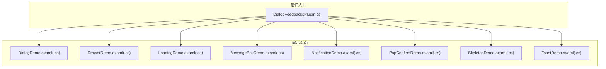
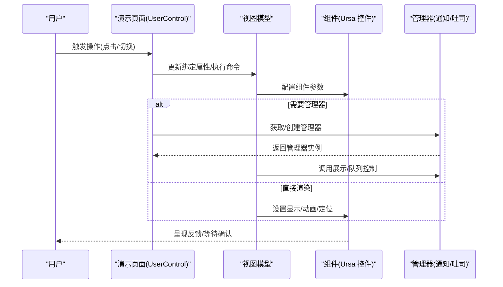
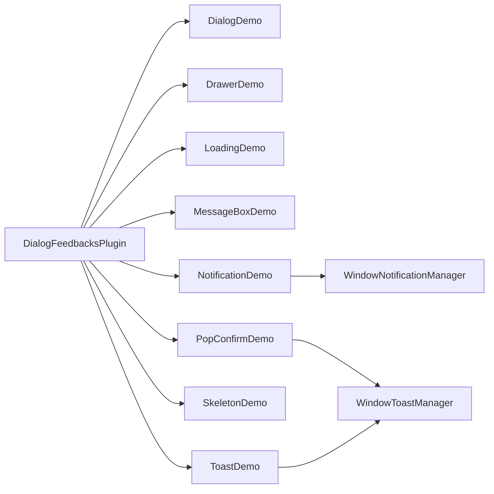

# 弹窗和反馈组件

<cite>
**本文引用的文件**
- [DialogFeedbacksPlugin.cs](file://plugins/Avalonia.Plugin.DialogFeedbacks/DialogFeedbacksPlugin.cs)
- [DialogDemo.axaml](file://plugins/Avalonia.Plugin.DialogFeedbacks/Pages/DialogDemo.axaml)
- [DialogDemo.axaml.cs](file://plugins/Avalonia.Plugin.DialogFeedbacks/Pages/DialogDemo.axaml.cs)
- [DrawerDemo.axaml](file://plugins/Avalonia.Plugin.DialogFeedbacks/Pages/DrawerDemo.axaml)
- [DrawerDemo.axaml.cs](file://plugins/Avalonia.Plugin.DialogFeedbacks/Pages/DrawerDemo.axaml.cs)
- [LoadingDemo.axaml](file://plugins/Avalonia.Plugin.DialogFeedbacks/Pages/LoadingDemo.axaml)
- [LoadingDemo.axaml.cs](file://plugins/Avalonia.Plugin.DialogFeedbacks/Pages/LoadingDemo.axaml.cs)
- [MessageBoxDemo.axaml](file://plugins/Avalonia.Plugin.DialogFeedbacks/Pages/MessageBoxDemo.axaml)
- [MessageBoxDemo.axaml.cs](file://plugins/Avalonia.Plugin.DialogFeedbacks/Pages/MessageBoxDemo.axaml.cs)
- [NotificationDemo.axaml](file://plugins/Avalonia.Plugin.DialogFeedbacks/Pages/NotificationDemo.axaml)
- [NotificationDemo.axaml.cs](file://plugins/Avalonia.Plugin.DialogFeedbacks/Pages/NotificationDemo.axaml.cs)
- [PopConfirmDemo.axaml](file://plugins/Avalonia.Plugin.DialogFeedbacks/Pages/PopConfirmDemo.axaml)
- [PopConfirmDemo.axaml.cs](file://plugins/Avalonia.Plugin.DialogFeedbacks/Pages/PopConfirmDemo.axaml.cs)
- [SkeletonDemo.axaml](file://plugins/Avalonia.Plugin.DialogFeedbacks/Pages/SkeletonDemo.axaml)
- [SkeletonDemo.axaml.cs](file://plugins/Avalonia.Plugin.DialogFeedbacks/Pages/SkeletonDemo.axaml.cs)
- [ToastDemo.axaml](file://plugins/Avalonia.Plugin.DialogFeedbacks/Pages/ToastDemo.axaml)
- [ToastDemo.axaml.cs](file://plugins/Avalonia.Plugin.DialogFeedbacks/Pages/ToastDemo.axaml.cs)
</cite>

## 目录
1. [简介](#简介)
2. [项目结构](#项目结构)
3. [核心组件](#核心组件)
4. [架构总览](#架构总览)
5. [详细组件分析](#详细组件分析)
6. [依赖关系分析](#依赖关系分析)
7. [性能考虑](#性能考虑)
8. [故障排查指南](#故障排查指南)
9. [结论](#结论)
10. [附录](#附录)

## 简介
本文件系统化梳理弹窗与反馈组件插件（DialogFeedbacksPlugin）提供的 UI 反馈能力，覆盖以下组件：Dialog（窗口/覆盖层对话框）、Drawer（抽屉）、Loading（加载指示器/容器）、MessageBox（消息框）、Notification（通知卡片）、PopConfirm（气泡确认）、Skeleton（骨架屏）、Toast（浮动提示）。文档从架构、数据流、交互模式、动画与过渡、事件回调、样式与主题、可访问性、键盘导航、屏幕阅读器兼容性、响应式行为与性能优化等维度进行说明，并给出面向开发者的使用建议与最佳实践。

## 项目结构
该插件位于 plugins/Avalonia.Plugin.DialogFeedbacks，采用“页面+视图模型”的演示结构组织各组件示例。每个组件均配有独立的 AXAML 页面与对应的代码隐藏类，部分页面在附加到可视树时初始化全局或局部的管理器实例（如通知与吐司），以支撑组件运行时行为。

图表来源
- [DialogFeedbacksPlugin.cs:1-20](file://plugins/Avalonia.Plugin.DialogFeedbacks/DialogFeedbacksPlugin.cs#L1-L20)
- [DialogDemo.axaml.cs:1-17](file://plugins/Avalonia.Plugin.DialogFeedbacks/Pages/DialogDemo.axaml.cs#L1-L17)
- [DrawerDemo.axaml.cs:1-17](file://plugins/Avalonia.Plugin.DialogFeedbacks/Pages/DrawerDemo.axaml.cs#L1-L17)
- [LoadingDemo.axaml.cs:1-17](file://plugins/Avalonia.Plugin.DialogFeedbacks/Pages/LoadingDemo.axaml.cs#L1-L17)
- [MessageBoxDemo.axaml.cs:1-17](file://plugins/Avalonia.Plugin.DialogFeedbacks/Pages/MessageBoxDemo.axaml.cs#L1-L17)
- [NotificationDemo.axaml.cs:1-30](file://plugins/Avalonia.Plugin.DialogFeedbacks/Pages/NotificationDemo.axaml.cs#L1-L30)
- [PopConfirmDemo.axaml.cs:1-30](file://plugins/Avalonia.Plugin.DialogFeedbacks/Pages/PopConfirmDemo.axaml.cs#L1-L30)
- [SkeletonDemo.axaml.cs:1-17](file://plugins/Avalonia.Plugin.DialogFeedbacks/Pages/SkeletonDemo.axaml.cs#L1-L17)
- [ToastDemo.axaml.cs:1-36](file://plugins/Avalonia.Plugin.DialogFeedbacks/Pages/ToastDemo.axaml.cs#L1-L36)

章节来源
- [DialogFeedbacksPlugin.cs:1-20](file://plugins/Avalonia.Plugin.DialogFeedbacks/DialogFeedbacksPlugin.cs#L1-L20)

## 核心组件
本节概述各组件的职责、典型使用场景与交互特征：
- Dialog：用于展示窗口级或覆盖层对话框，支持多种启动位置、按钮集、模态/非模态、拖拽移动、调整大小、关闭按钮可见性、样式类注入等；覆盖层模式下可选择全局或局部 OverlayDialogHost。
- Drawer：抽屉面板，支持位置（上/下/左/右）、按钮、轻关闭、模态、自定义内容、可调整大小、全局/局部 OverlayHost。
- Loading：提供 LoadingIcon 与 LoadingContainer，前者用于指示加载状态，后者在加载时遮罩目标内容区域，支持加载文案。
- MessageBox：消息框，支持图标、标题、长消息、覆盖层模式，以及多种预设按钮组合（默认、OK、OKCancel、YesNo、YesNoCancel）。
- Notification：通知卡片集合，支持多位置（TopLeft/TopCenter/TopRight/BottomLeft/BottomCenter/BottomRight）、多主题（纯色/实心）、图标与关闭按钮开关、批量展示。
- PopConfirm：气泡确认，支持触发方式（点击/焦点获得/失去）、定位、异步命令、控制类样式绑定、任意宿主控件（非仅按钮）。
- Skeleton：骨架屏，用于占位渲染，支持激活/加载状态切换、圆角、包裹任意子元素。
- Toast：浮动提示，支持图标与关闭按钮、多主题风格、最大条目数限制、自动安装/卸载管理器。

章节来源
- [DialogDemo.axaml:1-221](file://plugins/Avalonia.Plugin.DialogFeedbacks/Pages/DialogDemo.axaml#L1-L221)
- [DrawerDemo.axaml:1-54](file://plugins/Avalonia.Plugin.DialogFeedbacks/Pages/DrawerDemo.axaml#L1-L54)
- [LoadingDemo.axaml:1-26](file://plugins/Avalonia.Plugin.DialogFeedbacks/Pages/LoadingDemo.axaml#L1-L26)
- [MessageBoxDemo.axaml:1-36](file://plugins/Avalonia.Plugin.DialogFeedbacks/Pages/MessageBoxDemo.axaml#L1-L36)
- [NotificationDemo.axaml:1-64](file://plugins/Avalonia.Plugin.DialogFeedbacks/Pages/NotificationDemo.axaml#L1-L64)
- [PopConfirmDemo.axaml:1-73](file://plugins/Avalonia.Plugin.DialogFeedbacks/Pages/PopConfirmDemo.axaml#L1-L73)
- [SkeletonDemo.axaml:1-63](file://plugins/Avalonia.Plugin.DialogFeedbacks/Pages/SkeletonDemo.axaml#L1-L63)
- [ToastDemo.axaml:1-48](file://plugins/Avalonia.Plugin.DialogFeedbacks/Pages/ToastDemo.axaml#L1-L48)

## 架构总览
组件演示页面通过绑定到各自的视图模型，驱动组件展示与交互；部分页面在附加到可视树时，按需获取或创建顶层管理器（如通知/吐司管理器），确保组件在当前窗口上下文中正确挂载与渲染。

图表来源
- [NotificationDemo.axaml.cs:15-24](file://plugins/Avalonia.Plugin.DialogFeedbacks/Pages/NotificationDemo.axaml.cs#L15-L24)
- [PopConfirmDemo.axaml.cs:15-24](file://plugins/Avalonia.Plugin.DialogFeedbacks/Pages/PopConfirmDemo.axaml.cs#L15-L24)
- [ToastDemo.axaml.cs:17-29](file://plugins/Avalonia.Plugin.DialogFeedbacks/Pages/ToastDemo.axaml.cs#L17-L29)

## 详细组件分析

### Dialog 组件
- 显示时机
  - 窗口级对话框：适合需要独立窗口承载的输入/确认流程。
  - 覆盖层对话框：适合在当前页面上叠加提示/编辑，支持本地/全局 OverlayDialogHost。
- 交互模式
  - 支持多种启动位置、像素坐标、按钮集、模态/非模态、拖拽移动、调整大小、关闭按钮可见性、样式类注入。
  - 覆盖层模式支持轻关闭、全屏、本地/全局宿主选择。
- 动画与过渡
  - 通过主题与动画资源实现进入/退出过渡（具体动画资源由主题提供）。
- 用户操作处理
  - 通过命令绑定触发显示；按钮集决定返回结果。
- 属性与事件
  - 关键属性：标题、启动位置、像素位置、模态、拖拽、调整大小、关闭按钮可见性、按钮集、样式类、覆盖层模式、轻关闭、全屏、本地宿主标识等。
  - 事件：显示/关闭生命周期事件（由底层控件暴露）。
- 样式与主题
  - 支持传入样式类以应用特定样式；覆盖层模式可指定本地宿主。
- 可访问性与键盘导航
  - 按钮焦点顺序遵循 Tab 序列；支持键盘确认/取消。
- 响应式与性能
  - 覆盖层模式下建议使用局部宿主减少全局重绘；避免在大量控件上同时启用全屏模式。

章节来源
- [DialogDemo.axaml:17-198](file://plugins/Avalonia.Plugin.DialogFeedbacks/Pages/DialogDemo.axaml#L17-L198)

### Drawer 抽屉
- 显示时机
  - 侧边或顶部/底部弹出的辅助面板，常用于设置、筛选、详情等。
- 交互模式
  - 位置（上/下/左/右）、按钮、轻关闭、模态、自定义内容、可调整大小、全局/局部 OverlayHost。
- 动画与过渡
  - 通过主题资源实现滑入/滑出过渡。
- 用户操作处理
  - 通过命令触发显示；支持轻关闭与模态阻断。
- 属性与事件
  - 关键属性：标题、位置、按钮、轻关闭、模态、自定义、调整大小、本地宿主开关。
- 样式与主题
  - 通过枚举选择位置与按钮集；支持本地/全局宿主。
- 可访问性与键盘导航
  - 内容区支持键盘导航；焦点管理由抽屉内部处理。
- 响应式与性能
  - 在小屏设备上优先使用全屏或半屏布局；避免在抽屉中放置过多重型控件。

章节来源
- [DrawerDemo.axaml:16-51](file://plugins/Avalonia.Plugin.DialogFeedbacks/Pages/DrawerDemo.axaml#L16-L51)

### Loading 加载指示器与容器
- 显示时机
  - 数据加载、异步操作进行中、页面内容等待渲染时。
- 交互模式
  - LoadingIcon：独立指示器，支持小/中/大尺寸。
  - LoadingContainer：对目标内容进行遮罩，显示加载文案。
- 动画与过渡
  - 指示器旋转动画由主题资源提供；容器显示/隐藏采用淡入淡出。
- 用户操作处理
  - 通过绑定 IsLoading 切换状态；容器自动接管子树渲染。
- 属性与事件
  - 关键属性：LoadingIcon 尺寸类、LoadingContainer 的 IsLoading 与 LoadingMessage。
- 样式与主题
  - 通过 Classes 切换尺寸；容器背景与遮罩样式由主题提供。
- 可访问性与键盘导航
  - 容器内焦点保持；指示器本身不接收交互。
- 响应式与性能
  - 小屏设备上避免长时间加载；提供简短加载文案。

章节来源
- [LoadingDemo.axaml:12-24](file://plugins/Avalonia.Plugin.DialogFeedbacks/Pages/LoadingDemo.axaml#L12-L24)

### MessageBox 消息框
- 显示时机
  - 系统提示、确认/取消、错误告警、信息展示等。
- 交互模式
  - 支持图标、标题、长消息、覆盖层模式；内置多种按钮组合。
- 动画与过渡
  - 显示/隐藏采用主题动画。
- 用户操作处理
  - 通过命令触发不同按钮组合；结果显示在文本块中。
- 属性与事件
  - 关键属性：图标、标题开关、长消息开关、覆盖层开关；命令绑定触发不同消息框。
- 样式与主题
  - 通过主题样式统一按钮外观。
- 可访问性与键盘导航
  - 按钮焦点顺序明确；支持键盘确认/取消。
- 响应式与性能
  - 长消息建议分段；覆盖层模式避免阻断主流程。

章节来源
- [MessageBoxDemo.axaml:19-34](file://plugins/Avalonia.Plugin.DialogFeedbacks/Pages/MessageBoxDemo.axaml#L19-L34)

### Notification 通知卡片
- 显示时机
  - 系统通知、任务完成、警告/错误提示等。
- 交互模式
  - 多位置布局（TopLeft/TopCenter/TopRight/BottomLeft/BottomCenter/BottomRight）；多主题风格（纯色/实心）；可选图标与关闭按钮。
- 动画与过渡
  - 进入/消失采用主题动画；支持队列与层级管理。
- 用户操作处理
  - 通过命令触发不同类型通知；支持点击关闭。
- 属性与事件
  - 关键属性：显示图标、显示关闭、位置、主题、内容类型；事件由管理器统一调度。
- 样式与主题
  - 通过样式类与主题资源切换风格；位置通过单选按钮选择。
- 可访问性与键盘导航
  - 通知可被屏幕阅读器朗读；键盘可聚焦到关闭按钮。
- 响应式与性能
  - 合理控制通知数量；避免在同一位置堆积过多通知。

章节来源
- [NotificationDemo.axaml:14-63](file://plugins/Avalonia.Plugin.DialogFeedbacks/Pages/NotificationDemo.axaml#L14-L63)
- [NotificationDemo.axaml.cs:15-24](file://plugins/Avalonia.Plugin.DialogFeedbacks/Pages/NotificationDemo.axaml.cs#L15-L24)

### PopConfirm 气泡确认
- 显示时机
  - 危险操作前的二次确认，如删除、提交、退出等。
- 交互模式
  - 支持点击/焦点获得/失去触发；定位可选；支持异步命令；可绑定控制类样式；宿主控件不限于按钮。
- 动画与过渡
  - 弹出/收起采用主题动画。
- 用户操作处理
  - 通过 ConfirmCommand/CancelCommand 处理确认/取消；异步命令支持等待与回滚。
- 属性与事件
  - 关键属性：标题、内容、触发模式、定位、确认/取消命令、控制类样式源。
- 样式与主题
  - 通过控制类输入与定位选择器定制外观。
- 可访问性与键盘导航
  - 弹出层支持键盘 Tab 导航；确认/取消按钮可被键盘激活。
- 响应式与性能
  - 在移动端优先使用点击触发；避免频繁弹出。

章节来源
- [PopConfirmDemo.axaml:27-70](file://plugins/Avalonia.Plugin.DialogFeedbacks/Pages/PopConfirmDemo.axaml#L27-L70)
- [PopConfirmDemo.axaml.cs:15-24](file://plugins/Avalonia.Plugin.DialogFeedbacks/Pages/PopConfirmDemo.axaml.cs#L15-L24)

### Skeleton 骨架屏
- 显示时机
  - 数据未就绪时的占位渲染，提升感知速度。
- 交互模式
  - 通过 IsActive 与 IsLoading 控制激活与加载状态；包裹任意子元素。
- 动画与过渡
  - 骨架屏闪烁/高亮动画由主题提供。
- 用户操作处理
  - 通过切换开关控制占位与真实内容的显示。
- 属性与事件
  - 关键属性：IsActive、IsLoading、圆角、尺寸与布局。
- 样式与主题
  - 通过圆角与尺寸类控制外观；与内容区风格一致。
- 可访问性与键盘导航
  - 骨架屏不接收交互；真实内容加载后恢复焦点。
- 响应式与性能
  - 在弱网环境下优先使用；避免过度使用导致视觉疲劳。

章节来源
- [SkeletonDemo.axaml:16-61](file://plugins/Avalonia.Plugin.DialogFeedbacks/Pages/SkeletonDemo.axaml#L16-L61)

### Toast 浮动提示
- 显示时机
  - 操作成功/失败、状态变更、轻量提醒等。
- 交互模式
  - 支持图标与关闭按钮；多主题风格；限制最大条目数；自动安装/卸载管理器。
- 动画与过渡
  - 入场/出场采用主题动画；支持队列入列与去重。
- 用户操作处理
  - 通过命令触发不同类型提示；支持手动关闭与自动消失。
- 属性与事件
  - 关键属性：显示图标、显示关闭、主题、最大条目数；事件由管理器统一调度。
- 样式与主题
  - 通过样式类与主题资源切换风格；最大条目数控制队列长度。
- 可访问性与键盘导航
  - 提示可被屏幕阅读器朗读；键盘可聚焦到关闭按钮。
- 响应式与性能
  - 避免短时间内重复提示；合理设置自动消失时长。

章节来源
- [ToastDemo.axaml:14-47](file://plugins/Avalonia.Plugin.DialogFeedbacks/Pages/ToastDemo.axaml#L14-L47)
- [ToastDemo.axaml.cs:17-30](file://plugins/Avalonia.Plugin.DialogFeedbacks/Pages/ToastDemo.axaml.cs#L17-L30)

## 依赖关系分析
- 插件元数据：DialogFeedbacksPlugin 提供插件标识、版本、描述与依赖声明。
- 页面与管理器：NotificationDemo、PopConfirmDemo、ToastDemo 在附加到可视树时尝试获取或创建对应管理器，确保组件在当前窗口上下文中的可用性。
- 主题与动画：各组件通过主题资源实现统一的动画与样式风格。

图表来源
- [DialogFeedbacksPlugin.cs:6-14](file://plugins/Avalonia.Plugin.DialogFeedbacks/DialogFeedbacksPlugin.cs#L6-L14)
- [NotificationDemo.axaml.cs:19-22](file://plugins/Avalonia.Plugin.DialogFeedbacks/Pages/NotificationDemo.axaml.cs#L19-L22)
- [PopConfirmDemo.axaml.cs:19-22](file://plugins/Avalonia.Plugin.DialogFeedbacks/Pages/PopConfirmDemo.axaml.cs#L19-L22)
- [ToastDemo.axaml.cs:20-22](file://plugins/Avalonia.Plugin.DialogFeedbacks/Pages/ToastDemo.axaml.cs#L20-L22)

章节来源
- [DialogFeedbacksPlugin.cs:1-20](file://plugins/Avalonia.Plugin.DialogFeedbacks/DialogFeedbacksPlugin.cs#L1-L20)
- [NotificationDemo.axaml.cs:15-24](file://plugins/Avalonia.Plugin.DialogFeedbacks/Pages/NotificationDemo.axaml.cs#L15-L24)
- [PopConfirmDemo.axaml.cs:15-24](file://plugins/Avalonia.Plugin.DialogFeedbacks/Pages/PopConfirmDemo.axaml.cs#L15-L24)
- [ToastDemo.axaml.cs:17-29](file://plugins/Avalonia.Plugin.DialogFeedbacks/Pages/ToastDemo.axaml.cs#L17-L29)

## 性能考虑
- 渲染开销
  - 覆盖层对话框与抽屉建议使用局部 OverlayHost，避免全局重绘。
  - Toast/Notification 使用队列与最大条目数限制，防止 UI 堵塞。
- 动画与过渡
  - 合理使用主题动画，避免在低端设备上过度使用复杂转场。
- 内存与生命周期
  - ToastDemo 在离开可视树时卸载管理器，避免内存泄漏。
- 响应式设计
  - 移动端优先使用轻量反馈；桌面端可适当增加信息密度。

章节来源
- [ToastDemo.axaml.cs:25-29](file://plugins/Avalonia.Plugin.DialogFeedbacks/Pages/ToastDemo.axaml.cs#L25-L29)

## 故障排查指南
- 通知/吐司不显示
  - 确认页面已附加到可视树且成功获取/创建管理器；检查 TopLevel 上的管理器实例。
- 覆盖层对话框/抽屉未出现
  - 检查 OverlayDialogHost 的 HostId 是否匹配；确认本地/全局宿主选择正确。
- PopConfirm 不弹出
  - 检查触发模式（点击/焦点）与定位；确认命令绑定有效。
- Toast 无法关闭或堆积
  - 检查最大条目数设置；确认命令是否正确调用关闭逻辑。
- 加载指示器不生效
  - 确认 IsLoading 绑定值；LoadingContainer 的子树是否正确挂载。

章节来源
- [NotificationDemo.axaml.cs:19-22](file://plugins/Avalonia.Plugin.DialogFeedbacks/Pages/NotificationDemo.axaml.cs#L19-L22)
- [PopConfirmDemo.axaml.cs:19-22](file://plugins/Avalonia.Plugin.DialogFeedbacks/Pages/PopConfirmDemo.axaml.cs#L19-L22)
- [ToastDemo.axaml.cs:20-22](file://plugins/Avalonia.Plugin.DialogFeedbacks/Pages/ToastDemo.axaml.cs#L20-L22)

## 结论
DialogFeedbacksPlugin 提供了从窗口级对话框到轻量提示的完整反馈体系。通过统一的主题与动画资源，开发者可在不同平台与设备上获得一致的用户体验。建议在实际项目中结合业务场景选择合适的组件与交互模式，并关注可访问性与性能优化，以提升整体可用性与稳定性。

## 附录
- 可访问性与键盘导航
  - 所有交互控件均支持键盘 Tab 导航与 Enter/Space 激活；建议为关键按钮提供清晰的 ARIA 标签与屏幕阅读器提示。
- 屏幕阅读器兼容性
  - 通知与消息框内容应具备可读性；图标类元素补充文本描述。
- 响应式行为
  - 移动端优先使用覆盖层与轻量反馈；桌面端可扩展信息密度与动画细节。
- 主题适配
  - 通过样式类与主题资源快速切换风格；保持品牌一致性。