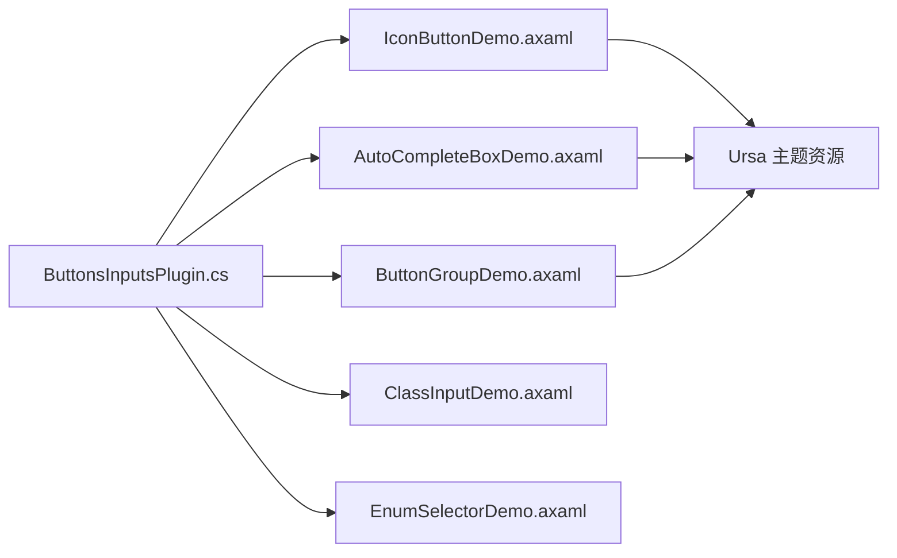

# 按钮和输入组件

<cite>
**本文引用的文件**
- [ButtonsInputsPlugin.cs](file://plugins/Avalonia.Plugin.ButtonsInputs/ButtonsInputsPlugin.cs)
- [ButtonGroupDemo.axaml](file://plugins/Avalonia.Plugin.ButtonsInputs/Pages/ButtonGroupDemo.axaml)
- [ButtonGroupDemo.axaml.cs](file://plugins/Avalonia.Plugin.ButtonsInputs/Pages/ButtonGroupDemo.axaml.cs)
- [IconButtonDemo.axaml](file://plugins/Avalonia.Plugin.ButtonsInputs/Pages/IconButtonDemo.axaml)
- [IconButtonDemo.axaml.cs](file://plugins/Avalonia.Plugin.ButtonsInputs/Pages/IconButtonDemo.axaml.cs)
- [AutoCompleteBoxDemo.axaml](file://plugins/Avalonia.Plugin.ButtonsInputs/Pages/AutoCompleteBoxDemo.axaml)
- [AutoCompleteBoxDemo.axaml.cs](file://plugins/Avalonia.Plugin.ButtonsInputs/Pages/AutoCompleteBoxDemo.axaml.cs)
- [ClassInputDemo.axaml](file://plugins/Avalonia.Plugin.ButtonsInputs/Pages/ClassInputDemo.axaml)
- [ClassInputDemo.axaml.cs](file://plugins/Avalonia.Plugin.ButtonsInputs/Pages/ClassInputDemo.axaml.cs)
- [EnumSelectorDemo.axaml](file://plugins/Avalonia.Plugin.ButtonsInputs/Pages/EnumSelectorDemo.axaml)
- [EnumSelectorDemo.axaml.cs](file://plugins/Avalonia.Plugin.ButtonsInputs/Pages/EnumSelectorDemo.axaml.cs)
- [FormDemo.axaml](file://plugins/Avalonia.Plugin.ButtonsInputs/Pages/FormDemo.axaml)
- [FormDemo.axaml.cs](file://plugins/Avalonia.Plugin.ButtonsInputs/Pages/FormDemo.axaml.cs)
- [KeyGestureInputDemo.axaml](file://plugins/Avalonia.Plugin.ButtonsInputs/Pages/KeyGestureInputDemo.axaml)
- [KeyGestureInputDemo.axaml.cs](file://plugins/Avalonia.Plugin.ButtonsInputs/Pages/KeyGestureInputDemo.axaml.cs)
- [IPv4BoxDemo.axaml](file://plugins/Avalonia.Plugin.ButtonsInputs/Pages/IPv4BoxDemo.axaml)
- [IPv4BoxDemo.axaml.cs](file://plugins/Avalonia.Plugin.ButtonsInputs/Pages/IPv4BoxDemo.axaml.cs)
- [MultiComboBoxDemo.axaml](file://plugins/Avalonia.Plugin.ButtonsInputs/Pages/MultiComboBoxDemo.axaml)
- [MultiComboBoxDemo.axaml.cs](file://plugins/Avalonia.Plugin.ButtonsInputs/Pages/MultiComboBoxDemo.axaml.cs)
- [MultiAutoCompleteBoxDemo.axaml](file://plugins/Avalonia.Plugin.ButtonsInputs/Pages/MultiAutoCompleteBoxDemo.axaml)
- [MultiAutoCompleteBoxDemo.axaml.cs](file://plugins/Avalonia.Plugin.ButtonsInputs/Pages/MultiAutoCompleteBoxDemo.axaml.cs)
- [NumericUpDownDemo.axaml](file://plugins/Avalonia.Plugin.ButtonsInputs/Pages/NumericUpDownDemo.axaml)
- [NumericUpDownDemo.axaml.cs](file://plugins/Avalonia.Plugin.ButtonsInputs/Pages/NumericUpDownDemo.axaml.cs)
- [NumPadDemo.axaml](file://plugins/Avalonia.Plugin.ButtonsInputs/Pages/NumPadDemo.axaml)
- [NumPadDemo.axaml.cs](file://plugins/Avalonia.Plugin.ButtonsInputs/Pages/NumPadDemo.axaml.cs)
- [PathPickerDemo.axaml](file://plugins/Avalonia.Plugin.ButtonsInputs/Pages/PathPickerDemo.axaml)
- [PathPickerDemo.axaml.cs](file://plugins/Avalonia.Plugin.ButtonsInputs/Pages/PathPickerDemo.axaml.cs)
- [PinCodeDemo.axaml](file://plugins/Avalonia.Plugin.ButtonsInputs/Pages/PinCodeDemo.axaml)
- [PinCodeDemo.axaml.cs](file://plugins/Avalonia.Plugin.ButtonsInputs/Pages/PinCodeDemo.axaml.cs)
- [RangeSliderDemo.axaml](file://plugins/Avalonia.Plugin.ButtonsInputs/Pages/RangeSliderDemo.axaml)
- [RangeSliderDemo.axaml.cs](file://plugins/Avalonia.Plugin.ButtonsInputs/Pages/RangeSliderDemo.axaml.cs)
- [RatingDemo.axaml](file://plugins/Avalonia.Plugin.ButtonsInputs/Pages/RatingDemo.axaml)
- [RatingDemo.axaml.cs](file://plugins/Avalonia.Plugin.ButtonsInputs/Pages/RatingDemo.axaml.cs)
- [SelectionListDemo.axaml](file://plugins/Avalonia.Plugin.ButtonsInputs/Pages/SelectionListDemo.axaml)
- [SelectionListDemo.axaml.cs](file://plugins/Avalonia.Plugin.ButtonsInputs/Pages/SelectionListDemo.axaml.cs)
- [TagInputDemo.axaml](file://plugins/Avalonia.Plugin.ButtonsInputs/Pages/TagInputDemo.axaml)
- [TagInputDemo.axaml.cs](file://plugins/Avalonia.Plugin.ButtonsInputs/Pages/TagInputDemo.axaml.cs)
- [ThemeTogglerDemo.axaml](file://plugins/Avalonia.Plugin.ButtonsInputs/Pages/ThemeTogglerDemo.axaml)
- [ThemeTogglerDemo.axaml.cs](file://plugins/Avalonia.Plugin.ButtonsInputs/Pages/ThemeTogglerDemo.axaml.cs)
- [TreeComboBoxDemo.axaml](file://plugins/Avalonia.Plugin.ButtonsInputs/Pages/TreeComboBoxDemo.axaml)
- [TreeComboBoxDemo.axaml.cs](file://plugins/Avalonia.Plugin.ButtonsInputs/Pages/TreeComboBoxDemo.axaml.cs)
</cite>

## 目录
1. [简介](#简介)
2. [项目结构](#项目结构)
3. [核心组件](#核心组件)
4. [架构总览](#架构总览)
5. [详细组件分析](#详细组件分析)
6. [依赖关系分析](#依赖关系分析)
7. [性能考虑](#性能考虑)
8. [故障排查指南](#故障排查指南)
9. [结论](#结论)
10. [附录](#附录)

## 简介
本文件面向按钮与输入类 UI 组件的使用者与维护者，系统化梳理 ButtonsInputsPlugin 插件提供的各类组件：ButtonGroup、IconButton、AutoCompleteBox、ClassInput、EnumSelector、Form、KeyGestureInput、IPv4Box、MultiComboBox、MultiAutoCompleteBox、NumericUpDown、NumPad、PathPicker、PinCode、RangeSlider、Rating、SelectionList、TagInput、ThemeToggler、TreeComboBox。内容涵盖：
- 属性说明与数据绑定方式
- 事件与交互行为
- 样式定制与主题切换
- 验证与可访问性支持
- 组件组合最佳实践与性能优化建议

## 项目结构
ButtonsInputsPlugin 以“演示页面 + 视图模型”的形式组织组件样例，便于理解各控件在真实场景中的用法与组合方式。

```mermaid
graph TB
subgraph "插件入口"
P["ButtonsInputsPlugin.cs"]
end
subgraph "演示页面Pages"
BG["ButtonGroupDemo.axaml(.cs)"]
IB["IconButtonDemo.axaml(.cs)"]
ACB["AutoCompleteBoxDemo.axaml(.cs)"]
CI["ClassInputDemo.axaml(.cs)"]
ES["EnumSelectorDemo.axaml(.cs)"]
F["FormDemo.axaml(.cs)"]
KGI["KeyGestureInputDemo.axaml(.cs)"]
IPV4["IPv4BoxDemo.axaml(.cs)"]
MCB["MultiComboBoxDemo.axaml(.cs)"]
MACB["MultiAutoCompleteBoxDemo.axaml(.cs)"]
NUD["NumericUpDownDemo.axaml(.cs)"]
NP["NumPadDemo.axaml(.cs)"]
PP["PathPickerDemo.axaml(.cs)"]
PC["PinCodeDemo.axaml(.cs)"]
RS["RangeSliderDemo.axaml(.cs)"]
R["RatingDemo.axaml(.cs)"]
SL["SelectionListDemo.axaml(.cs)"]
TI["TagInputDemo.axaml(.cs)"]
TT["ThemeTogglerDemo.axaml(.cs)"]
TCB["TreeComboBoxDemo.axaml(.cs)"]
end
P --> BG
P --> IB
P --> ACB
P --> CI
P --> ES
P --> F
P --> KGI
P --> IPV4
P --> MCB
P --> MACB
P --> NUD
P --> NP
P --> PP
P --> PC
P --> RS
P --> R
P --> SL
P --> TI
P --> TT
P --> TCB
```

图表来源
- [ButtonsInputsPlugin.cs:1-100](file://plugins/Avalonia.Plugin.ButtonsInputs/ButtonsInputsPlugin.cs#L1-L100)
- [ButtonGroupDemo.axaml.cs:1-17](file://plugins/Avalonia.Plugin.ButtonsInputs/Pages/ButtonGroupDemo.axaml.cs#L1-L17)
- [IconButtonDemo.axaml.cs:1-17](file://plugins/Avalonia.Plugin.ButtonsInputs/Pages/IconButtonDemo.axaml.cs#L1-L17)
- [AutoCompleteBoxDemo.axaml.cs:1-17](file://plugins/Avalonia.Plugin.ButtonsInputs/Pages/AutoCompleteBoxDemo.axaml.cs#L1-L17)
- [ClassInputDemo.axaml.cs:1-17](file://plugins/Avalonia.Plugin.ButtonsInputs/Pages/ClassInputDemo.axaml.cs#L1-L17)
- [EnumSelectorDemo.axaml.cs:1-17](file://plugins/Avalonia.Plugin.ButtonsInputs/Pages/EnumSelectorDemo.axaml.cs#L1-L17)
- [FormDemo.axaml.cs:1-17](file://plugins/Avalonia.Plugin.ButtonsInputs/Pages/FormDemo.axaml.cs#L1-L17)
- [KeyGestureInputDemo.axaml.cs:1-17](file://plugins/Avalonia.Plugin.ButtonsInputs/Pages/KeyGestureInputDemo.axaml.cs#L1-L17)
- [IPv4BoxDemo.axaml.cs:1-17](file://plugins/Avalonia.Plugin.ButtonsInputs/Pages/IPv4BoxDemo.axaml.cs#L1-L17)
- [MultiComboBoxDemo.axaml.cs:1-17](file://plugins/Avalonia.Plugin.ButtonsInputs/Pages/MultiComboBoxDemo.axaml.cs#L1-L17)
- [MultiAutoCompleteBoxDemo.axaml.cs:1-17](file://plugins/Avalonia.Plugin.ButtonsInputs/Pages/MultiAutoCompleteBoxDemo.axaml.cs#L1-L17)
- [NumericUpDownDemo.axaml.cs:1-17](file://plugins/Avalonia.Plugin.ButtonsInputs/Pages/NumericUpDownDemo.axaml.cs#L1-L17)
- [NumPadDemo.axaml.cs:1-17](file://plugins/Avalonia.Plugin.ButtonsInputs/Pages/NumPadDemo.axaml.cs#L1-L17)
- [PathPickerDemo.axaml.cs:1-17](file://plugins/Avalonia.Plugin.ButtonsInputs/Pages/PathPickerDemo.axaml.cs#L1-L17)
- [PinCodeDemo.axaml.cs:1-17](file://plugins/Avalonia.Plugin.ButtonsInputs/Pages/PinCodeDemo.axaml.cs#L1-L17)
- [RangeSliderDemo.axaml.cs:1-17](file://plugins/Avalonia.Plugin.ButtonsInputs/Pages/RangeSliderDemo.axaml.cs#L1-L17)
- [RatingDemo.axaml.cs:1-17](file://plugins/Avalonia.Plugin.ButtonsInputs/Pages/RatingDemo.axaml.cs#L1-L17)
- [SelectionListDemo.axaml.cs:1-17](file://plugins/Avalonia.Plugin.ButtonsInputs/Pages/SelectionListDemo.axaml.cs#L1-L17)
- [TagInputDemo.axaml.cs:1-17](file://plugins/Avalonia.Plugin.ButtonsInputs/Pages/TagInputDemo.axaml.cs#L1-L17)
- [ThemeTogglerDemo.axaml.cs:1-17](file://plugins/Avalonia.Plugin.ButtonsInputs/Pages/ThemeTogglerDemo.axaml.cs#L1-L17)
- [TreeComboBoxDemo.axaml.cs:1-17](file://plugins/Avalonia.Plugin.ButtonsInputs/Pages/TreeComboBoxDemo.axaml.cs#L1-L17)

章节来源
- [ButtonsInputsPlugin.cs:1-100](file://plugins/Avalonia.Plugin.ButtonsInputs/ButtonsInputsPlugin.cs#L1-L100)

## 核心组件
本节概述各组件的职责与典型应用场景，并给出属性与交互要点，帮助快速定位到具体实现与演示页面。

- ButtonGroup：用于将一组按钮按组展示，支持命令绑定、项模板、内容绑定与主题类。
- IconButton/IconDropDownButton/IconSplitButton/IconToggleButton/IconToggleSplitButton：图标按钮系列，支持图标放置位置、加载态、尺寸与主题风格切换。
- AutoCompleteBox：带自动完成的输入框，支持占位文本、清空按钮、内嵌前后缀内容、自定义项模板与值成员绑定。
- ClassInput：用于输入控件类名集合，支持分隔符与与其他控件联动。
- EnumSelector：枚举选择器，支持显示描述、枚举类型绑定与值双向绑定。
- Form：表单容器，用于布局与校验场景（演示页面中出现）。
- KeyGestureInput：快捷键输入组件（演示页面中出现）。
- IPv4Box：IPv4 地址输入框（演示页面中出现）。
- MultiComboBox：多选下拉框（演示页面中出现）。
- MultiAutoCompleteBox：多选自动完成输入框（演示页面中出现）。
- NumericUpDown：数值微调器（演示页面中出现）。
- NumPad：数字小键盘（演示页面中出现）。
- PathPicker：路径选择器（演示页面中出现）。
- PinCode：密码输入框（演示页面中出现）。
- RangeSlider：范围滑块（演示页面中出现）。
- Rating：评分组件（演示页面中出现）。
- SelectionList：选择列表（演示页面中出现）。
- TagInput：标签输入（演示页面中出现）。
- ThemeToggler：主题切换器（演示页面中出现）。
- TreeComboBox：树形下拉框（演示页面中出现）。

章节来源
- [ButtonGroupDemo.axaml:14-46](file://plugins/Avalonia.Plugin.ButtonsInputs/Pages/ButtonGroupDemo.axaml#L14-L46)
- [IconButtonDemo.axaml:44-683](file://plugins/Avalonia.Plugin.ButtonsInputs/Pages/IconButtonDemo.axaml#L44-L683)
- [AutoCompleteBoxDemo.axaml:12-57](file://plugins/Avalonia.Plugin.ButtonsInputs/Pages/AutoCompleteBoxDemo.axaml#L12-L57)
- [ClassInputDemo.axaml:8-16](file://plugins/Avalonia.Plugin.ButtonsInputs/Pages/ClassInputDemo.axaml#L8-L16)
- [EnumSelectorDemo.axaml:14-37](file://plugins/Avalonia.Plugin.ButtonsInputs/Pages/EnumSelectorDemo.axaml#L14-L37)

## 架构总览
ButtonsInputsPlugin 通过插件元数据注册组件，演示页面采用 AXAML 壳体与视图模型绑定，配合 Ursa 主题资源与样式选择器进行统一外观控制。组件间通过数据上下文与附加属性实现解耦组合。

```mermaid
graph TB
subgraph "插件元数据"
M["ButtonsInputsPlugin.cs<br/>注册导航/菜单/视图映射注释占位"]
end
subgraph "演示页面"
D1["ButtonGroupDemo.axaml"]
D2["IconButtonDemo.axaml"]
D3["AutoCompleteBoxDemo.axaml"]
D4["ClassInputDemo.axaml"]
D5["EnumSelectorDemo.axaml"]
D6["FormDemo.axaml"]
D7["KeyGestureInputDemo.axaml"]
D8["IPv4BoxDemo.axaml"]
D9["MultiComboBoxDemo.axaml"]
D10["MultiAutoCompleteBoxDemo.axaml"]
D11["NumericUpDownDemo.axaml"]
D12["NumPadDemo.axaml"]
D13["PathPickerDemo.axaml"]
D14["PinCodeDemo.axaml"]
D15["RangeSliderDemo.axaml"]
D16["RatingDemo.axaml"]
D17["SelectionListDemo.axaml"]
D18["TagInputDemo.axaml"]
D19["ThemeTogglerDemo.axaml"]
D20["TreeComboBoxDemo.axaml"]
end
subgraph "主题与样式"
S1["Ursa 主题资源"]
S2["样式选择器 Style Selector"]
end
M --> D1
M --> D2
M --> D3
M --> D4
M --> D5
M --> D6
M --> D7
M --> D8
M --> D9
M --> D10
M --> D11
M --> D12
M --> D13
M --> D14
M --> D15
M --> D16
M --> D17
M --> D18
M --> D19
M --> D20
D2 -.-> S1
D2 -.-> S2
D3 -.-> S1
D3 -.-> S2
D1 -.-> S1
D1 -.-> S2
```

图表来源
- [ButtonsInputsPlugin.cs:20-96](file://plugins/Avalonia.Plugin.ButtonsInputs/ButtonsInputsPlugin.cs#L20-L96)
- [IconButtonDemo.axaml:17-40](file://plugins/Avalonia.Plugin.ButtonsInputs/Pages/IconButtonDemo.axaml#L17-L40)
- [AutoCompleteBoxDemo.axaml:13-28](file://plugins/Avalonia.Plugin.ButtonsInputs/Pages/AutoCompleteBoxDemo.axaml#L13-L28)
- [ButtonGroupDemo.axaml:14-46](file://plugins/Avalonia.Plugin.ButtonsInputs/Pages/ButtonGroupDemo.axaml#L14-L46)

## 详细组件分析

### ButtonGroup
- 用途：将多个按钮按组排列，支持命令绑定、项模板、内容绑定与主题类。
- 关键属性与绑定
  - ItemsSource：绑定集合数据源
  - CommandBinding：绑定命令
  - ContentBinding：绑定项内容
  - ItemTemplate：自定义项模板
  - Classes：主题类（如 Primary/Solid/Large/Small/Danger 等）
- 交互行为
  - 通过命令绑定触发动作
  - 支持不同尺寸与主题风格
- 样式定制
  - 通过 Classes 与主题资源组合实现风格切换
- 使用示例
  - 参考演示页面中的多组 ButtonGroup 实例与模板配置

章节来源
- [ButtonGroupDemo.axaml:14-46](file://plugins/Avalonia.Plugin.ButtonsInputs/Pages/ButtonGroupDemo.axaml#L14-L46)

### IconButton 系列（IconButton/IconDropDownButton/IconSplitButton/IconToggleButton/IconToggleSplitButton）
- 用途：带图标的按钮变体，支持加载态、图标位置、尺寸与主题风格。
- 关键属性与绑定
  - Icon/Content：图标与文字
  - IsLoading：加载态
  - IconPlacement：图标位置（通过 EnumSelector 绑定 Position 枚举）
  - Classes/Theme：尺寸与主题风格（Solid/Outline/Borderless/Colorful 等）
  - IsEnabled/IsChecked/IsThreeState：禁用与三态状态
- 交互行为
  - 加载态与图标位置动态切换
  - 三态切换与菜单飞出（下拉/拆分）
- 样式定制
  - 通过样式选择器统一设置 IsLoading 与 IconPlacement
  - 通过主题资源切换不同风格
- 使用示例
  - 参考演示页面中各按钮的尺寸、主题与加载态组合

章节来源
- [IconButtonDemo.axaml:44-683](file://plugins/Avalonia.Plugin.ButtonsInputs/Pages/IconButtonDemo.axaml#L44-L683)

### AutoCompleteBox
- 用途：带自动完成功能的输入框，适合从大量选项中快速选择。
- 关键属性与绑定
  - ItemsSource：候选项集合
  - ItemTemplate：自定义项模板
  - ValueMemberBinding：值成员绑定（反射绑定）
  - PlaceholderText：占位文本
  - Classes：清空按钮、尺寸、边框等样式类
  - InnerLeftContent/InnerRightContent：内嵌前后缀内容
- 交互行为
  - 输入时过滤候选项
  - 选中后显示值或自定义模板
- 样式定制
  - 通过样式选择器统一设置宽度与模板
- 使用示例
  - 参考演示页面中不同尺寸、禁用态与前后缀组合

章节来源
- [AutoCompleteBoxDemo.axaml:12-57](file://plugins/Avalonia.Plugin.ButtonsInputs/Pages/AutoCompleteBoxDemo.axaml#L12-L57)

### ClassInput（ControlClassesInput）
- 用途：输入控件类名集合，支持分隔符与与其他控件联动。
- 关键属性与绑定
  - Separator：分隔符
  - 附加属性：ControlClassesInput.Source 绑定到其他控件，实现类名同步
- 交互行为
  - 输入类名并应用到目标控件
- 使用示例
  - 参考演示页面中与多个控件联动的实例

章节来源
- [ClassInputDemo.axaml:8-16](file://plugins/Avalonia.Plugin.ButtonsInputs/Pages/ClassInputDemo.axaml#L8-L16)

### EnumSelector
- 用途：枚举选择器，支持显示描述、枚举类型与值双向绑定。
- 关键属性与绑定
  - EnumType：枚举类型
  - Value：当前值
  - DisplayDescription：是否显示描述
  - Classes：尺寸（如 Small）
- 交互行为
  - 通过下拉选择枚举值
- 使用示例
  - 参考演示页面中类型选择与值显示

章节来源
- [EnumSelectorDemo.axaml:14-37](file://plugins/Avalonia.Plugin.ButtonsInputs/Pages/EnumSelectorDemo.axaml#L14-L37)

### Form
- 用途：表单容器，用于布局与校验场景。
- 关键属性与绑定
  - 作为布局容器承载其他表单元素
- 使用示例
  - 参考演示页面中的 Form 容器

章节来源
- [FormDemo.axaml:1-17](file://plugins/Avalonia.Plugin.ButtonsInputs/Pages/FormDemo.axaml.cs#L1-L17)

### KeyGestureInput
- 用途：快捷键输入组件。
- 使用示例
  - 参考演示页面中的 KeyGestureInput 示例

章节来源
- [KeyGestureInputDemo.axaml:1-17](file://plugins/Avalonia.Plugin.ButtonsInputs/Pages/KeyGestureInputDemo.axaml.cs#L1-L17)

### IPv4Box
- 用途：IPv4 地址输入框。
- 使用示例
  - 参考演示页面中的 IPv4Box 示例

章节来源
- [IPv4BoxDemo.axaml:1-17](file://plugins/Avalonia.Plugin.ButtonsInputs/Pages/IPv4BoxDemo.axaml.cs#L1-L17)

### MultiComboBox
- 用途：多选下拉框。
- 使用示例
  - 参考演示页面中的 MultiComboBox 示例

章节来源
- [MultiComboBoxDemo.axaml:1-17](file://plugins/Avalonia.Plugin.ButtonsInputs/Pages/MultiComboBoxDemo.axaml.cs#L1-L17)

### MultiAutoCompleteBox
- 用途：多选自动完成输入框。
- 使用示例
  - 参考演示页面中的 MultiAutoCompleteBox 示例

章节来源
- [MultiAutoCompleteBoxDemo.axaml:1-17](file://plugins/Avalonia.Plugin.ButtonsInputs/Pages/MultiAutoCompleteBoxDemo.axaml.cs#L1-L17)

### NumericUpDown
- 用途：数值微调器。
- 使用示例
  - 参考演示页面中的 NumericUpDown 示例

章节来源
- [NumericUpDownDemo.axaml:1-17](file://plugins/Avalonia.Plugin.ButtonsInputs/Pages/NumericUpDownDemo.axaml.cs#L1-L17)

### NumPad
- 用途：数字小键盘。
- 使用示例
  - 参考演示页面中的 NumPad 示例

章节来源
- [NumPadDemo.axaml:1-17](file://plugins/Avalonia.Plugin.ButtonsInputs/Pages/NumPadDemo.axaml.cs#L1-L17)

### PathPicker
- 用途：路径选择器。
- 使用示例
  - 参考演示页面中的 PathPicker 示例

章节来源
- [PathPickerDemo.axaml:1-17](file://plugins/Avalonia.Plugin.ButtonsInputs/Pages/PathPickerDemo.axaml.cs#L1-L17)

### PinCode
- 用途：密码输入框（通常为固定长度的数字输入）。
- 使用示例
  - 参考演示页面中的 PinCode 示例

章节来源
- [PinCodeDemo.axaml:1-17](file://plugins/Avalonia.Plugin.ButtonsInputs/Pages/PinCodeDemo.axaml.cs#L1-L17)

### RangeSlider
- 用途：范围滑块。
- 使用示例
  - 参考演示页面中的 RangeSlider 示例

章节来源
- [RangeSliderDemo.axaml:1-17](file://plugins/Avalonia.Plugin.ButtonsInputs/Pages/RangeSliderDemo.axaml.cs#L1-L17)

### Rating
- 用途：评分组件。
- 使用示例
  - 参考演示页面中的 Rating 示例

章节来源
- [RatingDemo.axaml:1-17](file://plugins/Avalonia.Plugin.ButtonsInputs/Pages/RatingDemo.axaml.cs#L1-L17)

### SelectionList
- 用途：选择列表。
- 使用示例
  - 参考演示页面中的 SelectionList 示例

章节来源
- [SelectionListDemo.axaml:1-17](file://plugins/Avalonia.Plugin.ButtonsInputs/Pages/SelectionListDemo.axaml.cs#L1-L17)

### TagInput
- 用途：标签输入。
- 使用示例
  - 参考演示页面中的 TagInput 示例

章节来源
- [TagInputDemo.axaml:1-17](file://plugins/Avalonia.Plugin.ButtonsInputs/Pages/TagInputDemo.axaml.cs#L1-L17)

### ThemeToggler
- 用途：主题切换器。
- 使用示例
  - 参考演示页面中的 ThemeToggler 示例

章节来源
- [ThemeTogglerDemo.axaml:1-17](file://plugins/Avalonia.Plugin.ButtonsInputs/Pages/ThemeTogglerDemo.axaml.cs#L1-L17)

### TreeComboBox
- 用途：树形下拉框。
- 使用示例
  - 参考演示页面中的 TreeComboBox 示例

章节来源
- [TreeComboBoxDemo.axaml:1-17](file://plugins/Avalonia.Plugin.ButtonsInputs/Pages/TreeComboBoxDemo.axaml.cs#L1-L17)

## 依赖关系分析
- 插件元数据层：ButtonsInputsPlugin 负责声明插件信息与潜在的导航/菜单/视图映射（当前为注释占位）。
- 演示页面层：各 Demo.axaml 作为 UI 壳体，绑定对应 ViewModel，使用 Ursa 控件与主题资源。
- 样式与主题层：通过 Style Selector 与主题资源（如 Solid/Outline/Borderless、Colorful 等）实现一致的外观控制。

图表来源
- [ButtonsInputsPlugin.cs:20-96](file://plugins/Avalonia.Plugin.ButtonsInputs/ButtonsInputsPlugin.cs#L20-L96)
- [IconButtonDemo.axaml:17-40](file://plugins/Avalonia.Plugin.ButtonsInputs/Pages/IconButtonDemo.axaml#L17-L40)
- [AutoCompleteBoxDemo.axaml:13-28](file://plugins/Avalonia.Plugin.ButtonsInputs/Pages/AutoCompleteBoxDemo.axaml#L13-L28)
- [ButtonGroupDemo.axaml:14-46](file://plugins/Avalonia.Plugin.ButtonsInputs/Pages/ButtonGroupDemo.axaml#L14-L46)

章节来源
- [ButtonsInputsPlugin.cs:20-96](file://plugins/Avalonia.Plugin.ButtonsInputs/ButtonsInputsPlugin.cs#L20-L96)

## 性能考虑
- 列表与模板
  - AutoCompleteBox/SelectionList 等组件在大数据集上应避免复杂模板，优先使用简单文本绑定与轻量模板。
  - 使用虚拟化容器（若底层控件支持）减少渲染开销。
- 绑定与更新
  - 避免频繁触发大对象绑定更新；对枚举选择器等可缓存类型信息。
  - 对加载态组件（如 IconButton 的 IsLoading）仅在必要时切换，减少样式重绘。
- 主题与样式
  - 复用样式选择器与主题资源，避免重复设置 Setter，降低 XAML 解析与应用成本。
- 输入组件
  - 对高频输入组件（如 AutoCompleteBox、TagInput）限制过滤频率，避免过度计算。
  - IPv4Box/PinCode 等固定格式输入可提前做格式约束，减少无效重算。

## 故障排查指南
- 绑定问题
  - 若枚举选择器不显示值，请确认 EnumType 与 Value 的类型匹配，以及 DisplayDescription 的布尔绑定正确。
- 样式不生效
  - 检查样式选择器的 TargetType 与控件命名空间是否一致；确认主题资源名称拼写正确。
- 图标与加载态
  - 若图标位置或加载态不随切换而变化，检查样式绑定的 SourceName 与属性名是否一致。
- 数据模板
  - AutoCompleteBox 的项模板需确保绑定路径正确，避免空值导致显示异常。

章节来源
- [EnumSelectorDemo.axaml:14-37](file://plugins/Avalonia.Plugin.ButtonsInputs/Pages/EnumSelectorDemo.axaml#L14-L37)
- [IconButtonDemo.axaml:17-40](file://plugins/Avalonia.Plugin.ButtonsInputs/Pages/IconButtonDemo.axaml#L17-L40)
- [AutoCompleteBoxDemo.axaml:13-28](file://plugins/Avalonia.Plugin.ButtonsInputs/Pages/AutoCompleteBoxDemo.axaml#L13-L28)

## 结论
ButtonsInputsPlugin 提供了丰富的按钮与输入组件，覆盖常用交互场景。通过统一的主题与样式体系、清晰的数据绑定方式以及演示页面的组合示例，开发者可以快速掌握组件的使用方法，并在实际项目中实现一致、可维护的界面体验。建议在复杂场景中遵循性能与可访问性最佳实践，结合组件特性进行合理组合与优化。

## 附录
- 组件清单与演示页面映射
  - ButtonGroup → ButtonGroupDemo.axaml
  - IconButton 系列 → IconButtonDemo.axaml
  - AutoCompleteBox → AutoCompleteBoxDemo.axaml
  - ClassInput → ClassInputDemo.axaml
  - EnumSelector → EnumSelectorDemo.axaml
  - Form → FormDemo.axaml
  - KeyGestureInput → KeyGestureInputDemo.axaml
  - IPv4Box → IPv4BoxDemo.axaml
  - MultiComboBox → MultiComboBoxDemo.axaml
  - MultiAutoCompleteBox → MultiAutoCompleteBoxDemo.axaml
  - NumericUpDown → NumericUpDownDemo.axaml
  - NumPad → NumPadDemo.axaml
  - PathPicker → PathPickerDemo.axaml
  - PinCode → PinCodeDemo.axaml
  - RangeSlider → RangeSliderDemo.axaml
  - Rating → RatingDemo.axaml
  - SelectionList → SelectionListDemo.axaml
  - TagInput → TagInputDemo.axaml
  - ThemeToggler → ThemeTogglerDemo.axaml
  - TreeComboBox → TreeComboBoxDemo.axaml