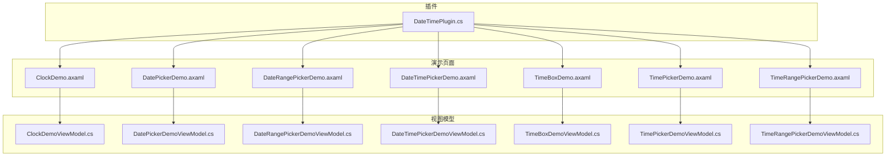
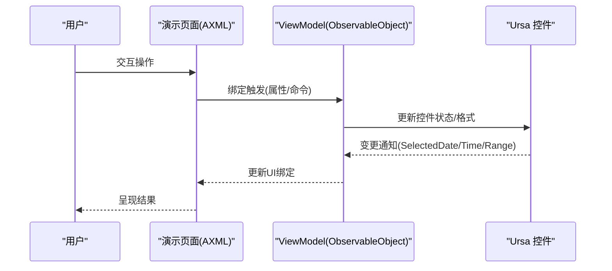
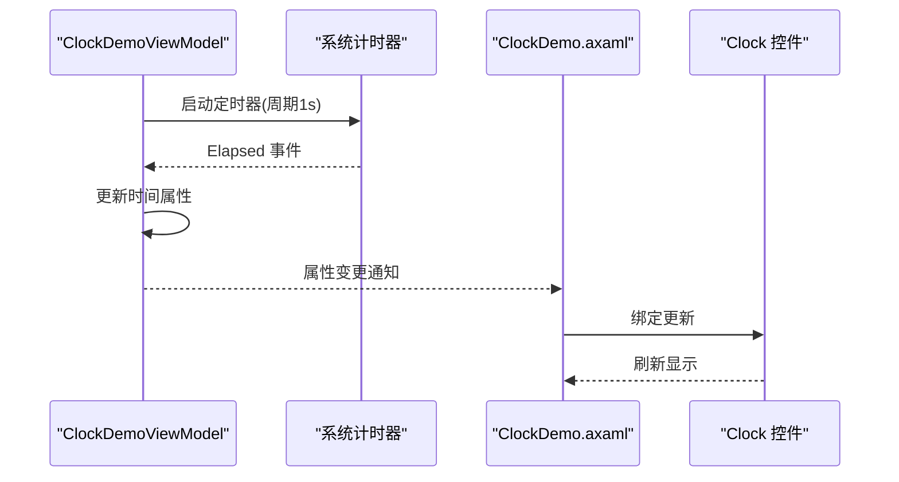
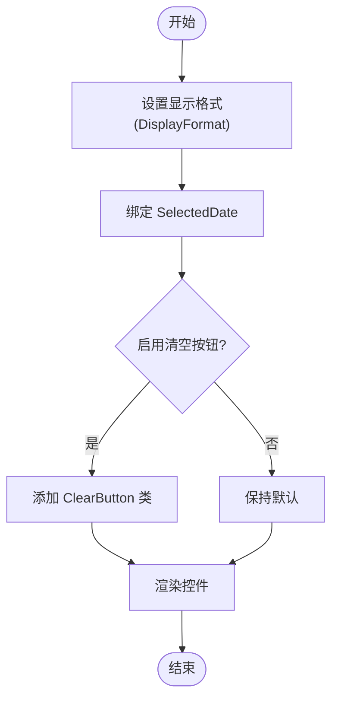
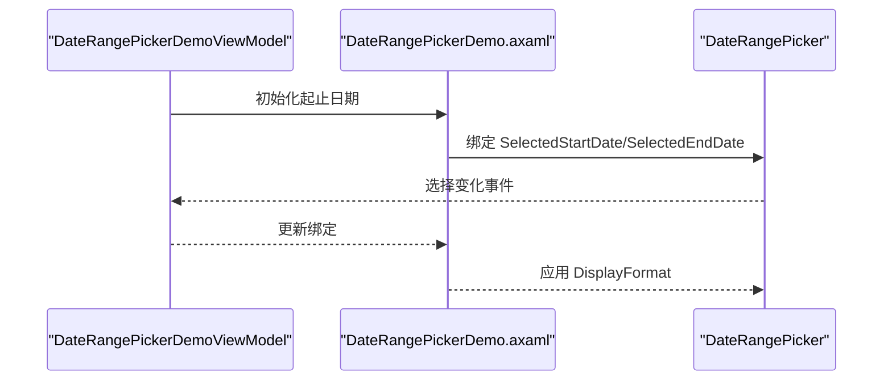
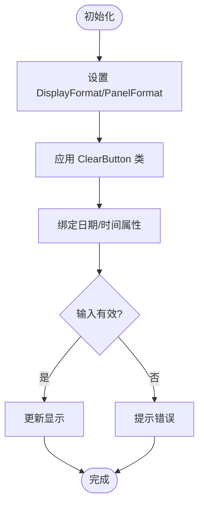
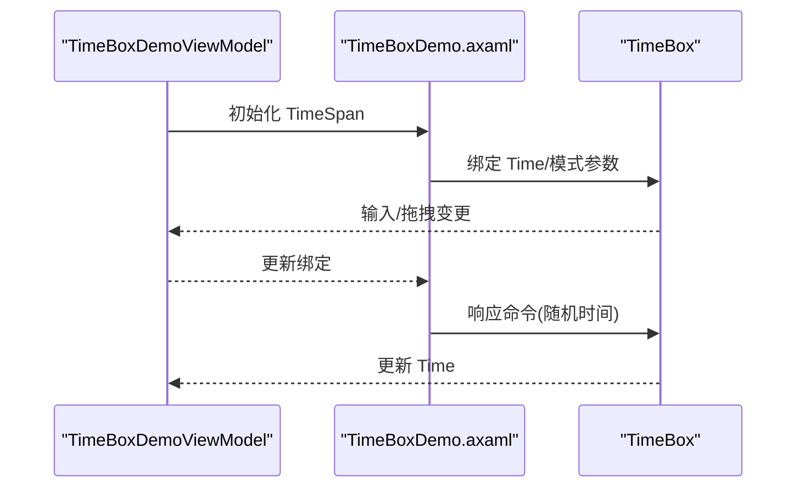
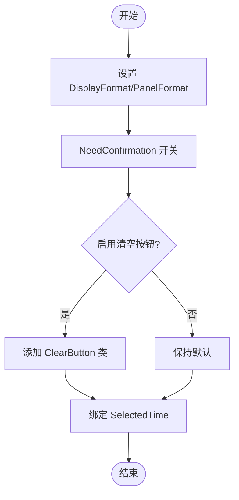
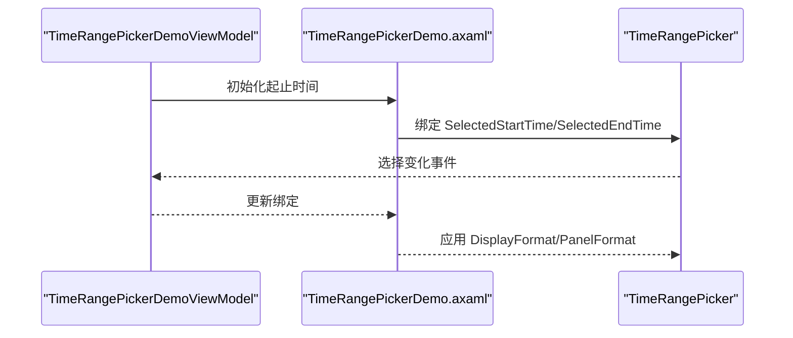
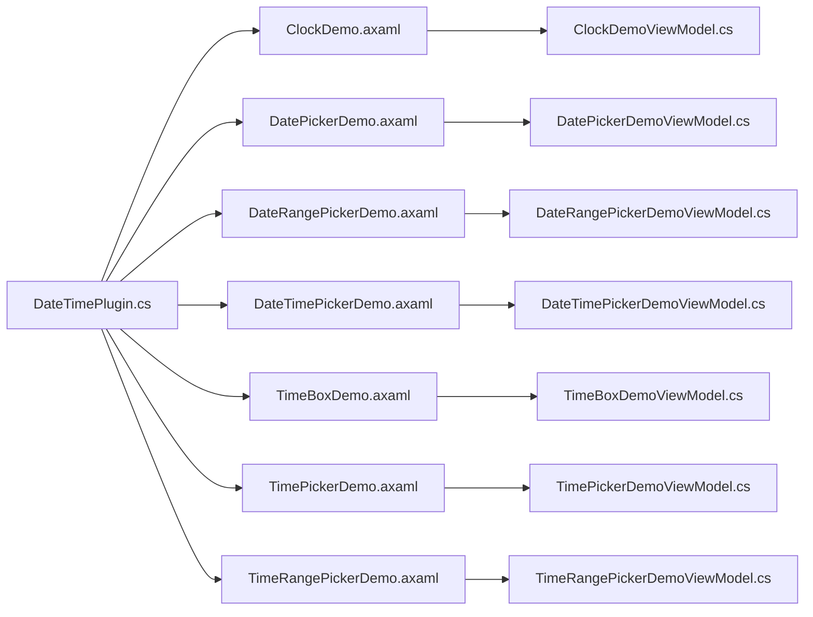

# 日期时间组件

<cite>
**本文引用的文件**
- [DateTimePlugin.cs](file://plugins/Avalonia.Plugin.DateTime/DateTimePlugin.cs)
- [ClockDemo.axaml](file://plugins/Avalonia.Plugin.DateTime/Pages/ClockDemo.axaml)
- [ClockDemoViewModel.cs](file://plugins/Avalonia.Plugin.DateTime/ViewModels/ClockDemoViewModel.cs)
- [DatePickerDemo.axaml](file://plugins/Avalonia.Plugin.DateTime/Pages/DatePickerDemo.axaml)
- [DatePickerDemoViewModel.cs](file://plugins/Avalonia.Plugin.DateTime/ViewModels/DatePickerDemoViewModel.cs)
- [DateRangePickerDemo.axaml](file://plugins/Avalonia.Plugin.DateTime/Pages/DateRangePickerDemo.axaml)
- [DateRangePickerDemoViewModel.cs](file://plugins/Avalonia.Plugin.DateTime/ViewModels/DateRangePickerDemoViewModel.cs)
- [DateTimePickerDemo.axaml](file://plugins/Avalonia.Plugin.DateTime/Pages/DateTimePickerDemo.axaml)
- [DateTimePickerDemoViewModel.cs](file://plugins/Avalonia.Plugin.DateTime/ViewModels/DateTimePickerDemoViewModel.cs)
- [TimeBoxDemo.axaml](file://plugins/Avalonia.Plugin.DateTime/Pages/TimeBoxDemo.axaml)
- [TimeBoxDemoViewModel.cs](file://plugins/Avalonia.Plugin.DateTime/ViewModels/TimeBoxDemoViewModel.cs)
- [TimePickerDemo.axaml](file://plugins/Avalonia.Plugin.DateTime/Pages/TimePickerDemo.axaml)
- [TimePickerDemoViewModel.cs](file://plugins/Avalonia.Plugin.DateTime/ViewModels/TimePickerDemoViewModel.cs)
- [TimeRangePickerDemo.axaml](file://plugins/Avalonia.Plugin.DateTime/Pages/TimeRangePickerDemo.axaml)
- [TimeRangePickerDemoViewModel.cs](file://plugins/Avalonia.Plugin.DateTime/ViewModels/TimeRangePickerDemoViewModel.cs)
</cite>

## 目录
1. [简介](#简介)
2. [项目结构](#项目结构)
3. [核心组件](#核心组件)
4. [架构总览](#架构总览)
5. [详细组件分析](#详细组件分析)
6. [依赖关系分析](#依赖关系分析)
7. [性能考量](#性能考量)
8. [故障排查指南](#故障排查指南)
9. [结论](#结论)
10. [附录](#附录)

## 简介
本文件面向日期时间组件的使用与集成，围绕 DateTimePlugin 所提供的以下组件展开：Clock、DatePicker、DateRangePicker、DateTimePicker、TimeBox、TimePicker、TimeRangePicker。内容涵盖时间格式化、本地化支持、时区处理、用户交互模式、配置示例（默认值、校验规则、事件处理、样式定制）、最佳实践、性能与可访问性建议，以及与系统时间与本地化设置的集成方式。

## 项目结构
- 插件入口：插件元数据类负责声明插件标识、版本与依赖等信息。
- 页面与视图模型：每个演示页面对应一个 AXAML 视图与一个 ViewModel，用于展示组件的典型用法与绑定模式。
- 控件来源：演示页面通过命名空间映射到 Ursa 主题库中的控件，这些控件在主题资源中实现具体功能。

图表来源
- [DateTimePlugin.cs:1-20](file://plugins/Avalonia.Plugin.DateTime/DateTimePlugin.cs#L1-L20)
- [ClockDemo.axaml:1-19](file://plugins/Avalonia.Plugin.DateTime/Pages/ClockDemo.axaml#L1-L19)
- [DatePickerDemo.axaml:1-29](file://plugins/Avalonia.Plugin.DateTime/Pages/DatePickerDemo.axaml#L1-L29)
- [DateRangePickerDemo.axaml:1-38](file://plugins/Avalonia.Plugin.DateTime/Pages/DateRangePickerDemo.axaml#L1-L38)
- [DateTimePickerDemo.axaml:1-31](file://plugins/Avalonia.Plugin.DateTime/Pages/DateTimePickerDemo.axaml#L1-L31)
- [TimeBoxDemo.axaml:1-68](file://plugins/Avalonia.Plugin.DateTime/Pages/TimeBoxDemo.axaml#L1-L68)
- [TimePickerDemo.axaml:1-56](file://plugins/Avalonia.Plugin.DateTime/Pages/TimePickerDemo.axaml#L1-L56)
- [TimeRangePickerDemo.axaml:1-45](file://plugins/Avalonia.Plugin.DateTime/Pages/TimeRangePickerDemo.axaml#L1-L45)

章节来源
- [DateTimePlugin.cs:1-20](file://plugins/Avalonia.Plugin.DateTime/DateTimePlugin.cs#L1-L20)

## 核心组件
- Clock：数字时钟显示，支持平滑动画切换。
- DatePicker：单日期选择器，支持显示格式、清空按钮、双向绑定。
- DateRangePicker：日期范围选择器，支持起止日期绑定与显示格式。
- DateTimePicker：日期+时间选择器，支持显示格式与面板格式。
- TimeBox：时间输入框，支持快速输入、拖拽、循环与时长绑定。
- TimePicker：时间选择器，支持确认模式、显示/面板格式、清空按钮与绑定。
- TimeRangePicker：时间范围选择器，支持起止时间绑定与格式配置。

章节来源
- [ClockDemo.axaml:14-16](file://plugins/Avalonia.Plugin.DateTime/Pages/ClockDemo.axaml#L14-L16)
- [DatePickerDemo.axaml:14-26](file://plugins/Avalonia.Plugin.DateTime/Pages/DatePickerDemo.axaml#L14-L26)
- [DateRangePickerDemo.axaml:14-35](file://plugins/Avalonia.Plugin.DateTime/Pages/DateRangePickerDemo.axaml#L14-L35)
- [DateTimePickerDemo.axaml:15-28](file://plugins/Avalonia.Plugin.DateTime/Pages/DateTimePickerDemo.axaml#L15-L28)
- [TimeBoxDemo.axaml:14-65](file://plugins/Avalonia.Plugin.DateTime/Pages/TimeBoxDemo.axaml#L14-L65)
- [TimePickerDemo.axaml:13-53](file://plugins/Avalonia.Plugin.DateTime/Pages/TimePickerDemo.axaml#L13-L53)
- [TimeRangePickerDemo.axaml:11-42](file://plugins/Avalonia.Plugin.DateTime/Pages/TimeRangePickerDemo.axaml#L11-L42)

## 架构总览
组件遵循 MVVM 模式：AXAML 页面定义视图与绑定，ViewModel 负责状态与命令；控件来自 Ursa 主题库，通过命名空间映射使用。插件元数据类声明插件信息，页面通过导航与菜单属性注册到主应用。

图表来源
- [ClockDemo.axaml:14-16](file://plugins/Avalonia.Plugin.DateTime/Pages/ClockDemo.axaml#L14-L16)
- [ClockDemoViewModel.cs:12-36](file://plugins/Avalonia.Plugin.DateTime/ViewModels/ClockDemoViewModel.cs#L12-L36)
- [TimeBoxDemo.axaml:28-61](file://plugins/Avalonia.Plugin.DateTime/Pages/TimeBoxDemo.axaml#L28-L61)
- [TimeBoxDemoViewModel.cs:12-25](file://plugins/Avalonia.Plugin.DateTime/ViewModels/TimeBoxDemoViewModel.cs#L12-L25)

## 详细组件分析

### Clock 组件
- 功能要点
  - 实时显示当前时间，支持平滑过渡动画。
  - 通过绑定将时间源与视图解耦，便于外部更新。
- 配置与交互
  - 平滑开关：控制是否启用平滑动画。
  - 时间绑定：双向绑定到 ViewModel 的时间属性。
- 最佳实践
  - 使用定时器或系统时间源驱动刷新，避免阻塞 UI。
  - 在 ViewModel 中集中管理时间源，减少页面逻辑。
- 性能与可访问性
  - 平滑动画可能增加 CPU/GPU 开销，按需启用。
  - 为屏幕阅读器提供可读性更强的文本描述。

图表来源
- [ClockDemo.axaml:14-16](file://plugins/Avalonia.Plugin.DateTime/Pages/ClockDemo.axaml#L14-L16)
- [ClockDemoViewModel.cs:12-36](file://plugins/Avalonia.Plugin.DateTime/ViewModels/ClockDemoViewModel.cs#L12-L36)

章节来源
- [ClockDemo.axaml:14-16](file://plugins/Avalonia.Plugin.DateTime/Pages/ClockDemo.axaml#L14-L16)
- [ClockDemoViewModel.cs:12-36](file://plugins/Avalonia.Plugin.DateTime/ViewModels/ClockDemoViewModel.cs#L12-L36)

### DatePicker 组件
- 功能要点
  - 单日期选择，支持自定义显示格式。
  - 清空按钮样式类，一键清除选择。
  - 支持双向绑定 SelectedDate。
- 配置与交互
  - 显示格式：通过 DisplayFormat 绑定动态设置。
  - 清空按钮：添加 ClearButton 类名以启用。
  - 绑定：SelectedDate 与 ViewModel 属性双向同步。
- 最佳实践
  - 将默认日期初始化为 Today 或业务期望值。
  - 对空值进行显式处理，避免空引用。
- 性能与可访问性
  - 复杂格式解析仅在变更时触发。
  - 提供键盘导航与无障碍标签。

图表来源
- [DatePickerDemo.axaml:14-26](file://plugins/Avalonia.Plugin.DateTime/Pages/DatePickerDemo.axaml#L14-L26)
- [DatePickerDemoViewModel.cs:11-18](file://plugins/Avalonia.Plugin.DateTime/ViewModels/DatePickerDemoViewModel.cs#L11-L18)

章节来源
- [DatePickerDemo.axaml:14-26](file://plugins/Avalonia.Plugin.DateTime/Pages/DatePickerDemo.axaml#L14-L26)
- [DatePickerDemoViewModel.cs:11-18](file://plugins/Avalonia.Plugin.DateTime/ViewModels/DatePickerDemoViewModel.cs#L11-L18)

### DateRangePicker 组件
- 功能要点
  - 选择日期范围（起始/结束）。
  - 支持显示格式与清空按钮。
  - 通过 SelectedStartDate/SelectedEndDate 绑定。
- 配置与交互
  - 显示格式：DisplayFormat 动态绑定。
  - 清空按钮：ClearButton 类。
  - 初始化：可通过绑定传入初始起止日期。
- 最佳实践
  - 起止日期一致性校验，确保 Start <= End。
  - 对空值与无效区间进行提示。
- 性能与可访问性
  - 区间变更时批量通知，减少重绘。
  - 提供区间说明与无障碍提示。

图表来源
- [DateRangePickerDemo.axaml:18-35](file://plugins/Avalonia.Plugin.DateTime/Pages/DateRangePickerDemo.axaml#L18-L35)
- [DateRangePickerDemoViewModel.cs:11-20](file://plugins/Avalonia.Plugin.DateTime/ViewModels/DateRangePickerDemoViewModel.cs#L11-L20)

章节来源
- [DateRangePickerDemo.axaml:18-35](file://plugins/Avalonia.Plugin.DateTime/Pages/DateRangePickerDemo.axaml#L18-L35)
- [DateRangePickerDemoViewModel.cs:11-20](file://plugins/Avalonia.Plugin.DateTime/ViewModels/DateRangePickerDemoViewModel.cs#L11-L20)

### DateTimePicker 组件
- 功能要点
  - 日期+时间选择，支持显示格式与面板格式。
  - 清空按钮样式类。
- 配置与交互
  - 显示格式：DisplayFormat。
  - 面板格式：PanelFormat（如 hh mm ss）。
  - 清空按钮：Classes="ClearButton"。
- 最佳实践
  - 面板格式与显示格式保持一致语义，避免混淆。
  - 对空值进行显式处理与校验。
- 性能与可访问性
  - 面板渲染按需更新，避免频繁重建。
  - 提供键盘快捷键与无障碍标签。

图表来源
- [DateTimePickerDemo.axaml:15-28](file://plugins/Avalonia.Plugin.DateTime/Pages/DateTimePickerDemo.axaml#L15-L28)

章节来源
- [DateTimePickerDemo.axaml:15-28](file://plugins/Avalonia.Plugin.DateTime/Pages/DateTimePickerDemo.axaml#L15-L28)
- [DateTimePickerDemoViewModel.cs:10](file://plugins/Avalonia.Plugin.DateTime/ViewModels/DateTimePickerDemoViewModel.cs#L10)

### TimeBox 组件
- 功能要点
  - 时间输入框，支持快速输入、拖拽、循环与时长绑定。
  - 显示前导零、拖拽方向、是否允许拖拽、是否循环。
- 配置与交互
  - 快速输入：InputMode="Fast"。
  - 显示前导零：ShowLeadingZero。
  - 拖拽：AllowDrag + DragOrientation。
  - 循环：IsTimeLoop。
  - 绑定：Time 属性（TimeSpan）。
  - 命令：随机时间命令用于演示。
- 最佳实践
  - 拖拽方向与输入模式应与业务场景匹配。
  - 循环模式适合时钟类场景，注意边界处理。
- 性能与可访问性
  - 拖拽与循环可能触发高频更新，注意节流。
  - 提供键盘输入与无障碍提示。

图表来源
- [TimeBoxDemo.axaml:28-61](file://plugins/Avalonia.Plugin.DateTime/Pages/TimeBoxDemo.axaml#L28-L61)
- [TimeBoxDemoViewModel.cs:12-25](file://plugins/Avalonia.Plugin.DateTime/ViewModels/TimeBoxDemoViewModel.cs#L12-L25)

章节来源
- [TimeBoxDemo.axaml:14-65](file://plugins/Avalonia.Plugin.DateTime/Pages/TimeBoxDemo.axaml#L14-L65)
- [TimeBoxDemoViewModel.cs:12-25](file://plugins/Avalonia.Plugin.DateTime/ViewModels/TimeBoxDemoViewModel.cs#L12-L25)

### TimePicker 组件
- 功能要点
  - 时间选择器，支持确认模式、显示/面板格式、清空按钮与绑定。
- 配置与交互
  - 显示格式：DisplayFormat。
  - 面板格式：PanelFormat。
  - 确认模式：NeedConfirmation。
  - 清空按钮：Classes="ClearButton"。
  - 绑定：SelectedTime。
- 最佳实践
  - 确认模式适合需要明确提交的场景。
  - 清空按钮提升用户体验。
- 性能与可访问性
  - 面板渲染与确认流程应尽量轻量。
  - 提供键盘导航与无障碍标签。

图表来源
- [TimePickerDemo.axaml:29-53](file://plugins/Avalonia.Plugin.DateTime/Pages/TimePickerDemo.axaml#L29-L53)
- [TimePickerDemoViewModel.cs:11-18](file://plugins/Avalonia.Plugin.DateTime/ViewModels/TimePickerDemoViewModel.cs#L11-L18)

章节来源
- [TimePickerDemo.axaml:13-53](file://plugins/Avalonia.Plugin.DateTime/Pages/TimePickerDemo.axaml#L13-L53)
- [TimePickerDemoViewModel.cs:11-18](file://plugins/Avalonia.Plugin.DateTime/ViewModels/TimePickerDemoViewModel.cs#L11-L18)

### TimeRangePicker 组件
- 功能要点
  - 时间范围选择器，支持起止时间绑定与格式配置。
- 配置与交互
  - 显示格式：DisplayFormat。
  - 面板格式：PanelFormat。
  - 清空按钮：Classes="ClearButton"。
  - 绑定：SelectedStartTime/SelectedEndTime。
- 最佳实践
  - 起止时间一致性校验，确保 Start <= End。
  - 对空值与无效区间进行提示。
- 性能与可访问性
  - 区间变更时批量通知，减少重绘。
  - 提供区间说明与无障碍提示。

图表来源
- [TimeRangePickerDemo.axaml:24-42](file://plugins/Avalonia.Plugin.DateTime/Pages/TimeRangePickerDemo.axaml#L24-L42)
- [TimeRangePickerDemoViewModel.cs:11-20](file://plugins/Avalonia.Plugin.DateTime/ViewModels/TimeRangePickerDemoViewModel.cs#L11-L20)

章节来源
- [TimeRangePickerDemo.axaml:11-42](file://plugins/Avalonia.Plugin.DateTime/Pages/TimeRangePickerDemo.axaml#L11-L42)
- [TimeRangePickerDemoViewModel.cs:11-20](file://plugins/Avalonia.Plugin.DateTime/ViewModels/TimeRangePickerDemoViewModel.cs#L11-L20)

## 依赖关系分析
- 插件元数据：声明插件标识、版本与依赖。
- 页面与视图模型：通过导航与菜单属性注册，建立页面到 ViewModel 的映射。
- 控件来源：演示页面通过命名空间映射到 Ursa 主题库控件，实现统一的主题与样式。

图表来源
- [DateTimePlugin.cs:6-14](file://plugins/Avalonia.Plugin.DateTime/DateTimePlugin.cs#L6-L14)
- [ClockDemo.axaml:8](file://plugins/Avalonia.Plugin.DateTime/Pages/ClockDemo.axaml#L8)
- [TimeBoxDemo.axaml:8](file://plugins/Avalonia.Plugin.DateTime/Pages/TimeBoxDemo.axaml#L8)

章节来源
- [DateTimePlugin.cs:6-14](file://plugins/Avalonia.Plugin.DateTime/DateTimePlugin.cs#L6-L14)

## 性能考量
- 刷新频率
  - Clock 使用定时器每秒刷新，注意在低功耗设备上可降低频率或暂停非活跃窗口。
- 格式化开销
  - 显示格式与面板格式变更时，避免频繁重建控件，优先复用现有实例。
- 拖拽与循环
  - TimeBox 的拖拽与循环可能引发高频更新，建议节流或在不可见时停止更新。
- 绑定与通知
  - 使用 MVVM 框架的属性变更通知，避免手动强制刷新导致的重绘风暴。
- 内存与生命周期
  - ViewModel 实现 IDisposable，在页面关闭时释放计时器与事件订阅。

## 故障排查指南
- 组件无响应
  - 检查绑定路径是否正确，确认 ViewModel 属性已标记为可观察属性。
  - 确认页面数据类型与视图模型类型匹配。
- 时间显示异常
  - Clock 未刷新：检查定时器是否启动与事件是否订阅。
  - TimeBox 循环或拖拽异常：确认 IsTimeLoop 与 DragOrientation 设置。
- 格式不生效
  - DisplayFormat/PanelFormat 是否正确绑定且未被覆盖。
  - 清空按钮未出现：确认 Classes="ClearButton" 已添加。
- 范围选择异常
  - DateRangePicker/TimeRangePicker 起止顺序与一致性：确保 Start <= End。
- 性能问题
  - 高频刷新：降低刷新频率或在后台线程计算，主线程只做 UI 更新。
  - 大量控件：延迟加载或虚拟化，避免一次性创建过多实例。

章节来源
- [ClockDemoViewModel.cs:14-36](file://plugins/Avalonia.Plugin.DateTime/ViewModels/ClockDemoViewModel.cs#L14-L36)
- [TimeBoxDemo.axaml:28-61](file://plugins/Avalonia.Plugin.DateTime/Pages/TimeBoxDemo.axaml#L28-L61)
- [TimeRangePickerDemo.axaml:24-42](file://plugins/Avalonia.Plugin.DateTime/Pages/TimeRangePickerDemo.axaml#L24-L42)

## 结论
上述组件提供了完整的日期时间选择与展示能力，结合 MVVM 模式与 Ursa 主题库控件，能够满足大多数应用场景。通过合理的配置（格式、确认模式、清空按钮、绑定与命令）、性能优化与可访问性设计，可以构建高质量的日期时间交互体验。

## 附录
- 本地化与系统时间
  - 显示格式与区域设置：通过 DisplayFormat/PanelFormat 适配不同语言与地区习惯。
  - 系统时间集成：Clock 与 TimeBox 可直接绑定系统时间源，确保与系统时间同步。
  - 时区处理：组件本身以本地时间为主，若需跨时区，请在 ViewModel 层转换为 UTC 或目标时区再显示。
- 验证与事件
  - 范围校验：在 ViewModel 中对起止时间/日期进行约束，失败时反馈给用户。
  - 事件处理：利用命令与属性变更通知实现业务逻辑，避免在控件层写入复杂逻辑。
- 样式定制
  - 通过 Classes 与主题资源覆盖默认样式，保持整体风格一致。