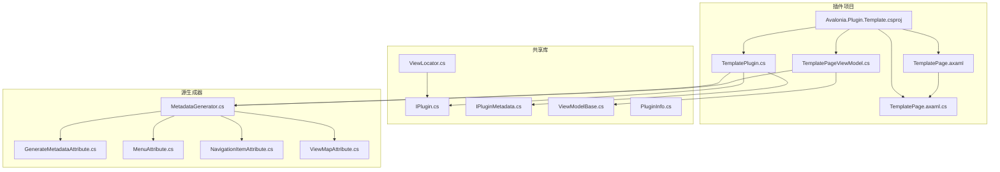
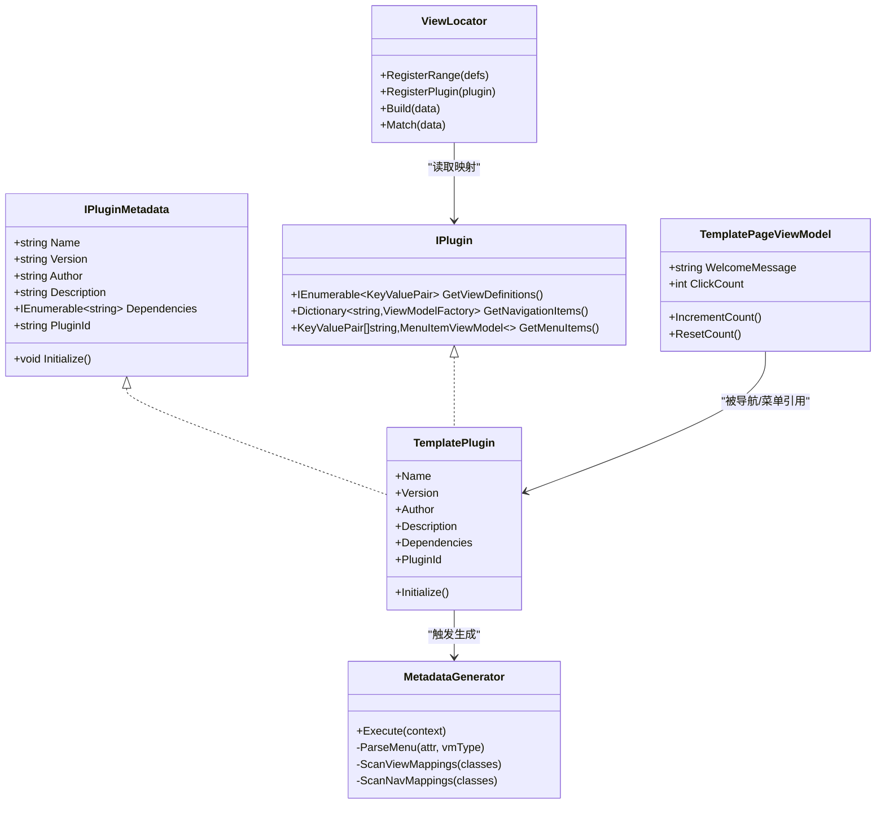
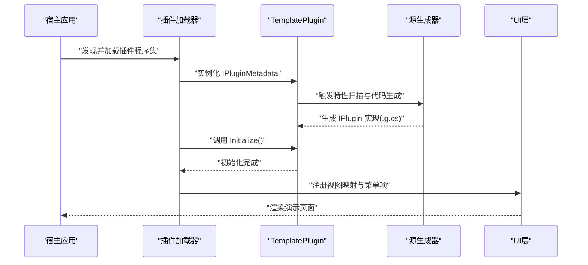
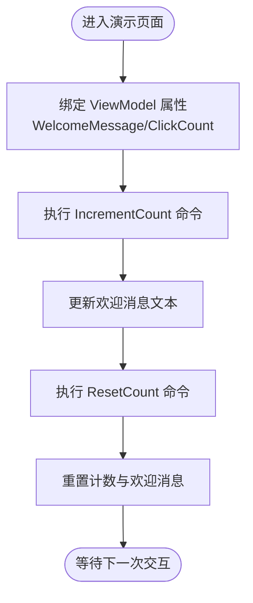
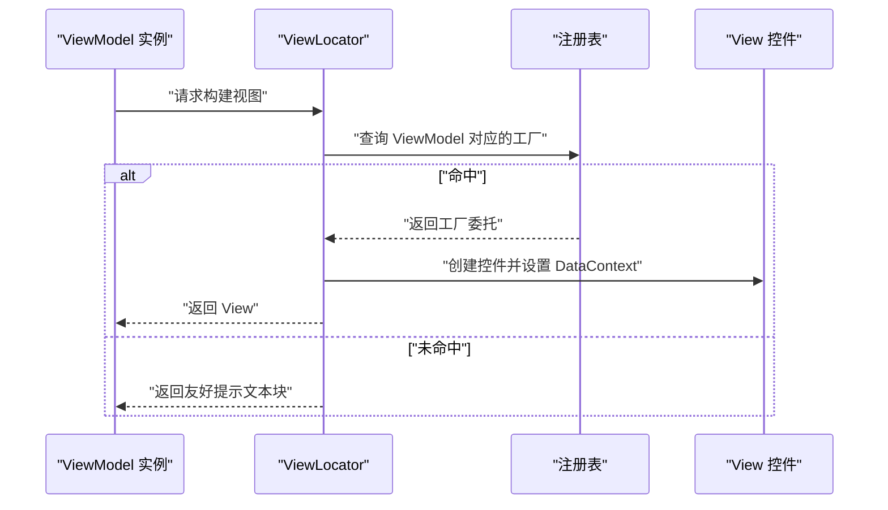
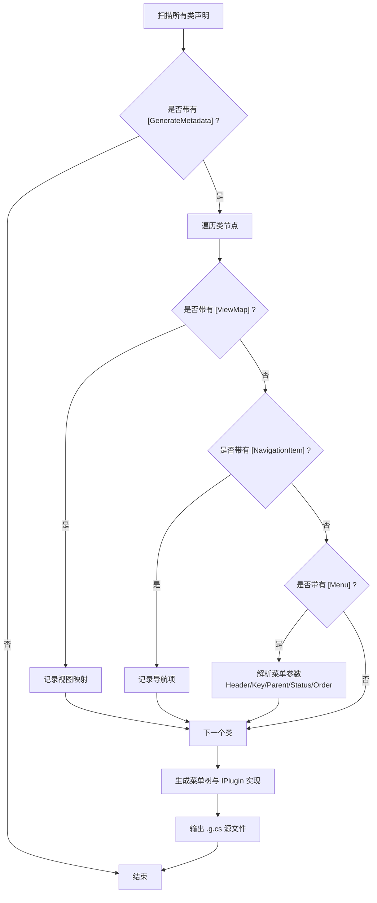
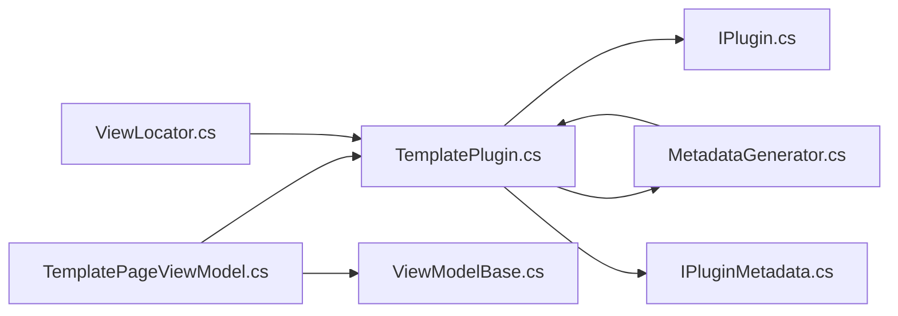

# 模板组件

<cite>
**本文档引用的文件**
- [TemplatePlugin.cs](file://plugins/Avalonia.Plugin.Template/TemplatePlugin.cs)
- [TemplatePage.axaml](file://plugins/Avalonia.Plugin.Template/Pages/TemplatePage.axaml)
- [TemplatePage.axaml.cs](file://plugins/Avalonia.Plugin.Template/Pages/TemplatePage.axaml.cs)
- [TemplatePageViewModel.cs](file://plugins/Avalonia.Plugin.Template/ViewModels/TemplatePageViewModel.cs)
- [Avalonia.Plugin.Template.csproj](file://plugins/Avalonia.Plugin.Template/Avalonia.Plugin.Template.csproj)
- [IPlugin.cs](file://src/Avalonia.Plugin.Shared/IPlugin.cs)
- [IPluginMetadata.cs](file://src/Avalonia.Plugin.Shared/IPluginMetadata.cs)
- [ViewModelBase.cs](file://src/Avalonia.Plugin.Shared/ViewModelBase.cs)
- [GenerateMetadataAttribute.cs](file://src/Avalonia.Plugin.Shared/Attributes/GenerateMetadataAttribute.cs)
- [MenuAttribute.cs](file://src/Avalonia.Plugin.Shared/Attributes/MenuAttribute.cs)
- [NavigationItemAttribute.cs](file://src/Avalonia.Plugin.Shared/Attributes/NavigationItemAttribute.cs)
- [ViewMapAttribute.cs](file://src/Avalonia.Plugin.Shared/Attributes/ViewMapAttribute.cs)
- [MetadataGenerator.cs](file://src/Avalonia.Plugin.Generators/MetadataGenerator.cs)
- [ViewLocator.cs](file://src/Avalonia.Plugin.Shared/ViewLocator.cs)
- [PluginInfo.cs](file://src/Avalonia.Plugin.Shared/Models/PluginInfo.cs)
</cite>

## 目录
1. [简介](#简介)
2. [项目结构](#项目结构)
3. [核心组件](#核心组件)
4. [架构总览](#架构总览)
5. [详细组件分析](#详细组件分析)
6. [依赖关系分析](#依赖关系分析)
7. [性能考虑](#性能考虑)
8. [故障排除指南](#故障排除指南)
9. [结论](#结论)
10. [附录](#附录)

## 简介
本模板组件提供了一个“最小可用”的插件开发样板，演示了 Avalonia 插件系统的核心能力：插件元数据、菜单集成、导航项绑定以及 ViewModel-View 双向映射。通过该模板，开发者可以快速创建新的插件项目，理解插件生命周期、命名约定、代码生成与配置模板，并掌握从项目创建到插件发布的完整流程。

该模板的关键价值在于：
- 最小化样板代码：仅保留必要元素，避免冗余
- 自动化元数据生成：通过特性与源生成器减少手写代码
- 明确的命名约定与目录结构：降低学习成本，提升一致性
- 可扩展的定制化：支持菜单层级、导航键、视图映射等灵活配置

## 项目结构
模板插件采用清晰的功能分层与命名约定：
- 插件项目文件：定义目标框架、隐式 using、可空启用与对共享库与源生成器的引用
- Pages：存放演示页面的 AXAML 与代码隐藏文件
- ViewModels：存放演示页面的 ViewModel，使用社区工具包实现命令与属性变更通知
- 插件入口：实现 IPluginMetadata 接口，标注元数据与生成器特性

**图表来源**
- [Avalonia.Plugin.Template.csproj:1-15](file://plugins/Avalonia.Plugin.Template/Avalonia.Plugin.Template.csproj#L1-L15)
- [TemplatePlugin.cs:1-20](file://plugins/Avalonia.Plugin.Template/TemplatePlugin.cs#L1-L20)
- [TemplatePageViewModel.cs:1-30](file://plugins/Avalonia.Plugin.Template/ViewModels/TemplatePageViewModel.cs#L1-L30)
- [TemplatePage.axaml:1-49](file://plugins/Avalonia.Plugin.Template/Pages/TemplatePage.axaml#L1-L49)
- [TemplatePage.axaml.cs:1-12](file://plugins/Avalonia.Plugin.Template/Pages/TemplatePage.axaml.cs#L1-L12)
- [IPlugin.cs:1-81](file://src/Avalonia.Plugin.Shared/IPlugin.cs#L1-L81)
- [IPluginMetadata.cs:1-44](file://src/Avalonia.Plugin.Shared/IPluginMetadata.cs#L1-L44)
- [ViewModelBase.cs:1-12](file://src/Avalonia.Plugin.Shared/ViewModelBase.cs#L1-L12)
- [ViewLocator.cs:1-72](file://src/Avalonia.Plugin.Shared/ViewLocator.cs#L1-L72)
- [PluginInfo.cs:1-19](file://src/Avalonia.Plugin.Shared/Models/PluginInfo.cs#L1-L19)
- [MetadataGenerator.cs:1-246](file://src/Avalonia.Plugin.Generators/MetadataGenerator.cs#L1-L246)
- [GenerateMetadataAttribute.cs:1-4](file://src/Avalonia.Plugin.Shared/Attributes/GenerateMetadataAttribute.cs#L1-L4)
- [MenuAttribute.cs:1-39](file://src/Avalonia.Plugin.Shared/Attributes/MenuAttribute.cs#L1-L39)
- [NavigationItemAttribute.cs:1-8](file://src/Avalonia.Plugin.Shared/Attributes/NavigationItemAttribute.cs#L1-L8)
- [ViewMapAttribute.cs:1-9](file://src/Avalonia.Plugin.Shared/Attributes/ViewMapAttribute.cs#L1-L9)

**章节来源**
- [Avalonia.Plugin.Template.csproj:1-15](file://plugins/Avalonia.Plugin.Template/Avalonia.Plugin.Template.csproj#L1-L15)
- [TemplatePlugin.cs:1-20](file://plugins/Avalonia.Plugin.Template/TemplatePlugin.cs#L1-L20)
- [TemplatePageViewModel.cs:1-30](file://plugins/Avalonia.Plugin.Template/ViewModels/TemplatePageViewModel.cs#L1-L30)
- [TemplatePage.axaml:1-49](file://plugins/Avalonia.Plugin.Template/Pages/TemplatePage.axaml#L1-L49)
- [TemplatePage.axaml.cs:1-12](file://plugins/Avalonia.Plugin.Template/Pages/TemplatePage.axaml.cs#L1-L12)

## 核心组件
- 插件元数据与入口
  - TemplatePlugin 实现 IPluginMetadata，提供插件名称、版本、作者、描述、依赖与唯一标识，并留有 Initialize 生命周期钩子
  - 使用 GenerateMetadata 特性标记，配合源生成器自动生成 IPlugin 实现
- 页面与 ViewModel
  - TemplatePage.axaml 定义演示界面，绑定 TemplatePageViewModel
  - TemplatePageViewModel 使用社区工具包的可观测属性与命令，展示点击计数与欢迎消息
  - 通过 NavigationItem、Menu、ViewMap 特性声明导航键、菜单项与视图映射
- 共享基础设施
  - IPlugin/IPluginMetadata 定义插件契约与元数据接口
  - ViewLocator 提供 ViewModel 到 View 的注册与解析机制
  - MetadataGenerator 通过特性扫描与代码生成，自动实现 IPlugin 的三大能力

**章节来源**
- [TemplatePlugin.cs:6-19](file://plugins/Avalonia.Plugin.Template/TemplatePlugin.cs#L6-L19)
- [TemplatePageViewModel.cs:8-29](file://plugins/Avalonia.Plugin.Template/ViewModels/TemplatePageViewModel.cs#L8-L29)
- [TemplatePage.axaml:1-49](file://plugins/Avalonia.Plugin.Template/Pages/TemplatePage.axaml#L1-L49)
- [IPlugin.cs:9-26](file://src/Avalonia.Plugin.Shared/IPlugin.cs#L9-L26)
- [IPluginMetadata.cs:3-41](file://src/Avalonia.Plugin.Shared/IPluginMetadata.cs#L3-L41)
- [ViewLocator.cs:6-71](file://src/Avalonia.Plugin.Shared/ViewLocator.cs#L6-L71)
- [MetadataGenerator.cs:7-130](file://src/Avalonia.Plugin.Generators/MetadataGenerator.cs#L7-L130)

## 架构总览
模板插件遵循“特性驱动 + 源生成”的设计模式，将运行时需要的插件能力在编译期生成，从而减少运行时开销与手写样板代码。

**图表来源**
- [IPluginMetadata.cs:3-41](file://src/Avalonia.Plugin.Shared/IPluginMetadata.cs#L3-L41)
- [IPlugin.cs:9-26](file://src/Avalonia.Plugin.Shared/IPlugin.cs#L9-L26)
- [TemplatePlugin.cs:6-19](file://plugins/Avalonia.Plugin.Template/TemplatePlugin.cs#L6-L19)
- [TemplatePageViewModel.cs:11-29](file://plugins/Avalonia.Plugin.Template/ViewModels/TemplatePageViewModel.cs#L11-L29)
- [ViewLocator.cs:6-71](file://src/Avalonia.Plugin.Shared/ViewLocator.cs#L6-L71)
- [MetadataGenerator.cs:7-130](file://src/Avalonia.Plugin.Generators/MetadataGenerator.cs#L7-L130)

## 详细组件分析

### 组件一：TemplatePlugin（插件入口）
- 角色与职责
  - 提供插件元数据（名称、版本、作者、描述、依赖、唯一标识）
  - 作为 IPluginMetadata 的实现，承载插件生命周期钩子 Initialize
  - 通过 [GenerateMetadata] 标记，交由源生成器生成 IPlugin 实现
- 关键点
  - 插件 ID 唯一且稳定，便于安装管理与更新
  - Initialize 留空，可在后续扩展中加入初始化逻辑
- 开发建议
  - 在 Initialize 中进行资源注册、事件订阅或服务初始化
  - 合理设置 Dependencies，确保运行时依赖满足

**图表来源**
- [TemplatePlugin.cs:16-19](file://plugins/Avalonia.Plugin.Template/TemplatePlugin.cs#L16-L19)
- [MetadataGenerator.cs:12-130](file://src/Avalonia.Plugin.Generators/MetadataGenerator.cs#L12-L130)
- [ViewLocator.cs:32-42](file://src/Avalonia.Plugin.Shared/ViewLocator.cs#L32-L42)

**章节来源**
- [TemplatePlugin.cs:6-19](file://plugins/Avalonia.Plugin.Template/TemplatePlugin.cs#L6-L19)
- [IPluginMetadata.cs:3-41](file://src/Avalonia.Plugin.Shared/IPluginMetadata.cs#L3-L41)

### 组件二：TemplatePageViewModel（演示 ViewModel）
- 角色与职责
  - 展示 ViewModel-View 绑定与命令模式
  - 通过 NavigationItem、Menu、ViewMap 特性声明导航键、菜单项与视图映射
- 关键点
  - 使用社区工具包的可观测属性与 Relay 命令，减少样板代码
  - 菜单项具备父级、状态与排序等属性，支持灵活的菜单组织
- 开发建议
  - 将业务逻辑集中在 ViewModel，保持页面轻量化
  - 使用命令封装交互行为，便于单元测试

**图表来源**
- [TemplatePageViewModel.cs:13-28](file://plugins/Avalonia.Plugin.Template/ViewModels/TemplatePageViewModel.cs#L13-L28)
- [TemplatePage.axaml:21-33](file://plugins/Avalonia.Plugin.Template/Pages/TemplatePage.axaml#L21-L33)

**章节来源**
- [TemplatePageViewModel.cs:8-29](file://plugins/Avalonia.Plugin.Template/ViewModels/TemplatePageViewModel.cs#L8-L29)
- [ViewModelBase.cs:5-7](file://src/Avalonia.Plugin.Shared/ViewModelBase.cs#L5-L7)

### 组件三：ViewLocator（视图定位与映射）
- 角色与职责
  - 维护 ViewModel 到 View 的注册表，支持动态解析与构建
  - 提供批量注册与插件注册接口，保证映射在运行时生效
- 关键点
  - 内部使用字典存储映射，查找复杂度 O(1)
  - 当未找到映射时，返回友好提示，便于调试
- 开发建议
  - 在插件 Initialize 中调用 RegisterPlugin 注册自身映射
  - 如需覆盖默认映射，可使用 RegisterRange 进行批量替换

**图表来源**
- [ViewLocator.cs:47-68](file://src/Avalonia.Plugin.Shared/ViewLocator.cs#L47-L68)
- [ViewLocator.cs:32-42](file://src/Avalonia.Plugin.Shared/ViewLocator.cs#L32-L42)

**章节来源**
- [ViewLocator.cs:6-71](file://src/Avalonia.Plugin.Shared/ViewLocator.cs#L6-L71)

### 组件四：MetadataGenerator（源生成器）
- 角色与职责
  - 扫描插件项目中的特性，自动生成 IPlugin 的实现
  - 生成视图映射、导航项与菜单树结构
- 关键点
  - 支持 ViewMap、NavigationItem、Menu 等特性
  - 自动处理菜单父子关系与排序，构建树形结构
- 开发建议
  - 保持特性使用的一致性，避免混用不同参数形式
  - 如需自定义菜单层级，合理设置 ParentKey 与 Order

**图表来源**
- [MetadataGenerator.cs:14-130](file://src/Avalonia.Plugin.Generators/MetadataGenerator.cs#L14-L130)
- [MetadataGenerator.cs:201-245](file://src/Avalonia.Plugin.Generators/MetadataGenerator.cs#L201-L245)

**章节来源**
- [MetadataGenerator.cs:7-130](file://src/Avalonia.Plugin.Generators/MetadataGenerator.cs#L7-L130)
- [GenerateMetadataAttribute.cs:3](file://src/Avalonia.Plugin.Shared/Attributes/GenerateMetadataAttribute.cs#L3)
- [MenuAttribute.cs:11-38](file://src/Avalonia.Plugin.Shared/Attributes/MenuAttribute.cs#L11-38)
- [NavigationItemAttribute.cs:4-8](file://src/Avalonia.Plugin.Shared/Attributes/NavigationItemAttribute.cs#L4-L8)
- [ViewMapAttribute.cs:5-9](file://src/Avalonia.Plugin.Shared/Attributes/ViewMapAttribute.cs#L5-L9)

## 依赖关系分析
- 编译期依赖
  - 插件项目引用共享库与源生成器，以便在编译期生成 IPlugin 实现
- 运行时依赖
  - 插件通过 ViewLocator 注册映射，UI 层根据 DataContext 自动解析视图
  - 宿主应用通过 IPlugin 接口获取菜单项、导航项与视图映射
- 循环依赖规避
  - 源生成器仅读取特性，不引入运行时循环；插件实现 IPlugin，不反向依赖宿主

**图表来源**
- [TemplatePlugin.cs:6-19](file://plugins/Avalonia.Plugin.Template/TemplatePlugin.cs#L6-L19)
- [TemplatePageViewModel.cs:11-29](file://plugins/Avalonia.Plugin.Template/ViewModels/TemplatePageViewModel.cs#L11-L29)
- [ViewLocator.cs:32-42](file://src/Avalonia.Plugin.Shared/ViewLocator.cs#L32-L42)
- [MetadataGenerator.cs:12-130](file://src/Avalonia.Plugin.Generators/MetadataGenerator.cs#L12-L130)
- [IPlugin.cs:9-26](file://src/Avalonia.Plugin.Shared/IPlugin.cs#L9-L26)
- [IPluginMetadata.cs:3-41](file://src/Avalonia.Plugin.Shared/IPluginMetadata.cs#L3-L41)
- [ViewModelBase.cs:5-7](file://src/Avalonia.Plugin.Shared/ViewModelBase.cs#L5-L7)

**章节来源**
- [Avalonia.Plugin.Template.csproj:10-13](file://plugins/Avalonia.Plugin.Template/Avalonia.Plugin.Template.csproj#L10-L13)
- [IPlugin.cs:9-26](file://src/Avalonia.Plugin.Shared/IPlugin.cs#L9-L26)
- [ViewLocator.cs:32-42](file://src/Avalonia.Plugin.Shared/ViewLocator.cs#L32-L42)

## 性能考虑
- 源生成优势
  - 将运行时的反射与扫描工作移至编译期，显著降低启动时开销
  - 生成的 IPlugin 实现直接返回预构建的数据结构，避免运行时解析
- 视图映射缓存
  - ViewLocator 使用字典存储映射，查找为 O(1)，适合高频解析场景
- 建议
  - 控制特性数量与复杂度，避免生成代码过大
  - 在 Initialize 中进行一次性注册，避免重复注册导致的覆盖与抖动

[本节为通用性能讨论，无需特定文件来源]

## 故障排除指南
- 问题：页面未显示或显示“未找到视图”
  - 检查 ViewModel 是否正确标注 [ViewMap(typeof(Pages.TemplatePage))]
  - 确认 ViewLocator 已注册插件映射（RegisterPlugin）
  - 确保 DataContext 为正确的 ViewModel 实例
- 问题：菜单未出现或层级错误
  - 检查 [Menu] 特性的参数，确认 Header、Key、ParentKey、Order 设置正确
  - 确认 [GenerateMetadata] 存在，且源生成器已成功生成 IPlugin 实现
- 问题：命令未响应
  - 确认 ViewModel 继承自 ViewModelBase 并使用社区工具包命令
  - 检查 AXAML 中的 Command 绑定是否指向正确的命令名

**章节来源**
- [ViewLocator.cs:47-68](file://src/Avalonia.Plugin.Shared/ViewLocator.cs#L47-L68)
- [TemplatePageViewModel.cs:16-28](file://plugins/Avalonia.Plugin.Template/ViewModels/TemplatePageViewModel.cs#L16-L28)
- [TemplatePage.axaml:29-33](file://plugins/Avalonia.Plugin.Template/Pages/TemplatePage.axaml#L29-L33)

## 结论
模板组件以“特性 + 源生成”为核心，提供了从零开始构建 Avalonia 插件的最小可行样板。它通过明确的命名约定、清晰的目录结构与自动化代码生成，显著降低了插件开发门槛，减少了重复劳动，提升了开发效率。同时，其可扩展的设计允许开发者在不破坏契约的前提下自由定制菜单、导航与视图映射，满足多样化的业务需求。

[本节为总结性内容，无需特定文件来源]

## 附录

### A. 项目创建与发布流程（模板指引）
- 创建步骤
  - 复制模板项目目录，重命名为目标插件名称（如 Avalonia.Plugin.YourFeature）
  - 更新插件项目文件的目标框架与输出类型
  - 修改 TemplatePlugin 的元数据（名称、版本、作者、描述、依赖、唯一标识）
  - 在 ViewModels 中创建新的演示 ViewModel，并标注 [NavigationItem]、[Menu]、[ViewMap]
  - 在 Pages 中创建对应的 AXAML 页面并绑定 ViewModel
  - 在 Initialize 中进行必要的注册（如 ViewLocator.RegisterRange）
- 发布准备
  - 配置 NuGet 包信息（若打包为 NuGet）
  - 准备安装清单与依赖声明
  - 进行端到端测试（菜单、导航、命令、视图解析）

**章节来源**
- [TemplatePlugin.cs:9-14](file://plugins/Avalonia.Plugin.Template/TemplatePlugin.cs#L9-L14)
- [TemplatePageViewModel.cs:8-10](file://plugins/Avalonia.Plugin.Template/ViewModels/TemplatePageViewModel.cs#L8-L10)
- [TemplatePage.axaml:1-8](file://plugins/Avalonia.Plugin.Template/Pages/TemplatePage.axaml#L1-L8)
- [Avalonia.Plugin.Template.csproj:3-8](file://plugins/Avalonia.Plugin.Template/Avalonia.Plugin.Template.csproj#L3-L8)

### B. 命名约定与最佳实践
- 命名约定
  - 插件类：Plugin 名称 + Plugin（如 TemplatePlugin）
  - 页面类：页面名称 + Page（如 TemplatePage）
  - ViewModel：页面名称 + ViewModel（如 TemplatePageViewModel）
  - 导航键：使用语义化英文键（如 TemplateDemo）
- 最佳实践
  - 使用社区工具包的可观测属性与命令，保持 ViewModel 轻薄
  - 将业务逻辑集中在 ViewModel，页面仅负责展示与绑定
  - 合理使用 [Menu] 的 ParentKey 与 Order，构建清晰的菜单层次
  - 在 Initialize 中集中注册映射，避免分散注册

**章节来源**
- [TemplatePageViewModel.cs:8-10](file://plugins/Avalonia.Plugin.Template/ViewModels/TemplatePageViewModel.cs#L8-L10)
- [MenuAttribute.cs:11-38](file://src/Avalonia.Plugin.Shared/Attributes/MenuAttribute.cs#L11-L38)

### C. 测试策略
- 单元测试
  - 针对 ViewModel 的命令与属性变更进行断言
  - 验证菜单项与导航项的生成结果（可通过检查生成的 .g.cs 或接口返回值）
- 集成测试
  - 验证 ViewLocator 能正确解析 ViewModel 到 View 的映射
  - 验证插件在宿主应用中的加载、菜单呈现与页面导航
- 回归测试
  - 更改特性参数后，确认源生成器重新生成 IPlugin 实现
  - 验证菜单层级与排序在修改后仍符合预期

**章节来源**
- [TemplatePageViewModel.cs:16-28](file://plugins/Avalonia.Plugin.Template/ViewModels/TemplatePageViewModel.cs#L16-L28)
- [ViewLocator.cs:32-42](file://src/Avalonia.Plugin.Shared/ViewLocator.cs#L32-L42)
- [MetadataGenerator.cs:12-130](file://src/Avalonia.Plugin.Generators/MetadataGenerator.cs#L12-L130)