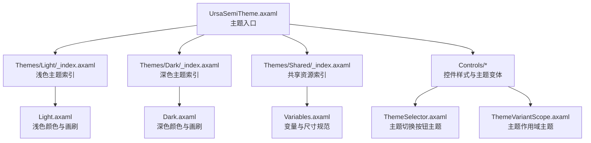
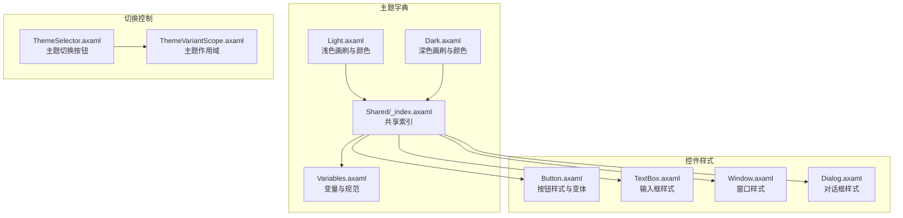
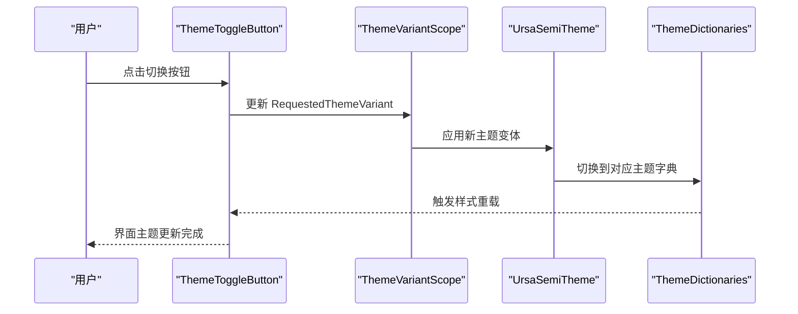
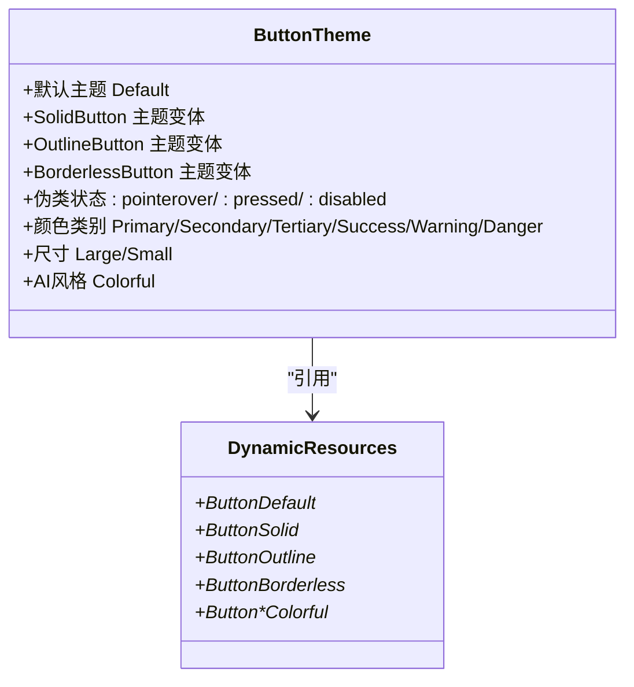
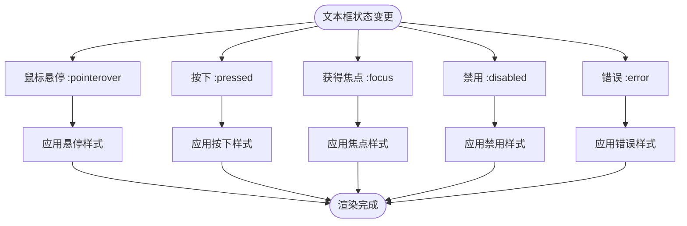
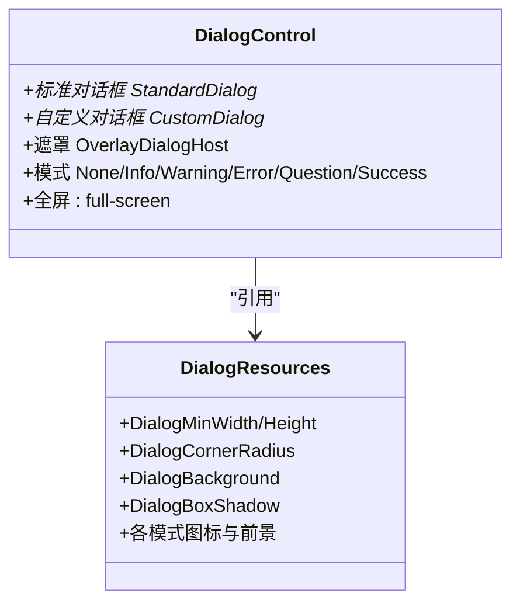
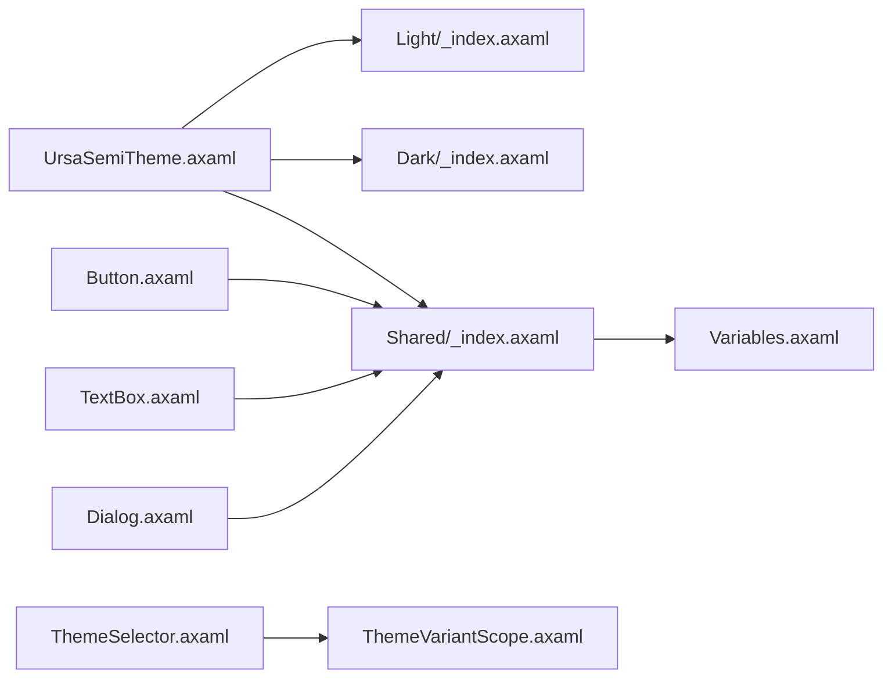

# 主题系统

<cite>
**本文档引用的文件**
- [UrsaSemiTheme.axaml](file://src/Avalonia.UI/Theme/UrsaSemiTheme.axaml)
- [Dark/_index.axaml](file://src/Avalonia.UI/Theme/Themes/Dark/_index.axaml)
- [Light/_index.axaml](file://src/Avalonia.UI/Theme/Themes/Light/_index.axaml)
- [Shared/_index.axaml](file://src/Avalonia.UI/Theme/Themes/Shared/_index.axaml)
- [Dark.axaml](file://src/Avalonia.UI/Theme/Themes/Dark/Dark.axaml)
- [Light.axaml](file://src/Avalonia.UI/Theme/Themes/Light/Light.axaml)
- [Variables.axaml](file://src/Avalonia.UI/Theme/Themes/Shared/Variables.axaml)
- [ThemeSelector.axaml](file://src/Avalonia.UI/Theme/Controls/ThemeSelector.axaml)
- [ThemeVariantScope.axaml](file://src/Avalonia.UI/Theme/Controls/ThemeVariantScope.axaml)
- [Button.axaml](file://src/Avalonia.UI/Theme/Controls/Button.axaml)
- [TextBox.axaml](file://src/Avalonia.UI/Theme/Controls/TextBox.axaml)
- [Window.axaml](file://src/Avalonia.UI/Theme/Controls/Window.axaml)
- [Dialog.axaml](file://src/Avalonia.UI/Theme/Controls/Dialog.axaml)
- [ThemeTogglerDemo.axaml](file://plugins/Avalonia.Plugin.ButtonsInputs/Pages/ThemeTogglerDemo.axaml)
- [ThemeTogglerDemoViewModel.cs](file://plugins/Avalonia.Plugin.ButtonsInputs/ViewModels/ThemeTogglerDemoViewModel.cs)
- [SettingsService.cs](file://src/Avalonia.UI/Services/SettingsService.cs)
</cite>

## 目录
1. [简介](#简介)
2. [项目结构](#项目结构)
3. [核心组件](#核心组件)
4. [架构总览](#架构总览)
5. [详细组件分析](#详细组件分析)
6. [依赖关系分析](#依赖关系分析)
7. [性能考量](#性能考量)
8. [故障排除指南](#故障排除指南)
9. [结论](#结论)
10. [附录](#附录)

## 简介
本文件系统性解析 AvaloniaTemplate 的主题系统，涵盖深色/浅色主题的实现机制与动态切换流程，主题文件的组织结构、样式定义与变量体系，以及自定义主题开发的完整指南。文档同时提供主题切换的实现原理、用户体验优化策略、最佳实践与设计规范，并讨论系统的扩展性与维护策略。

## 项目结构
主题系统位于 Avalonia.UI 项目的 Theme 目录下，采用“主题字典 + 控件样式 + 变量资源”的分层组织方式：
- 主题入口：UrsaSemiTheme.axaml 聚合 Light/Dark/Shared 资源
- 深色/浅色主题：Themes/Dark 与 Themes/Light 分别定义颜色与样式
- 共享资源：Themes/Shared 定义通用变量、图标索引与跨主题控件样式
- 控件样式：Controls 下按控件类型组织样式与主题变体
- 切换控制：Controls/ThemeSelector.axaml 提供主题切换 UI 主题
- 作用域控制：Controls/ThemeVariantScope.axaml 提供局部主题作用域

图表来源
- [UrsaSemiTheme.axaml:1-23](file://src/Avalonia.UI/Theme/UrsaSemiTheme.axaml#L1-L23)
- [Light/_index.axaml:1-83](file://src/Avalonia.UI/Theme/Themes/Light/_index.axaml#L1-L83)
- [Dark/_index.axaml:1-83](file://src/Avalonia.UI/Theme/Themes/Dark/_index.axaml#L1-L83)
- [Shared/_index.axaml:1-85](file://src/Avalonia.UI/Theme/Themes/Shared/_index.axaml#L1-L85)
- [Variables.axaml:1-69](file://src/Avalonia.UI/Theme/Themes/Shared/Variables.axaml#L1-L69)

章节来源
- [UrsaSemiTheme.axaml:1-23](file://src/Avalonia.UI/Theme/UrsaSemiTheme.axaml#L1-L23)
- [Light/_index.axaml:1-83](file://src/Avalonia.UI/Theme/Themes/Light/_index.axaml#L1-L83)
- [Dark/_index.axaml:1-83](file://src/Avalonia.UI/Theme/Themes/Dark/_index.axaml#L1-L83)
- [Shared/_index.axaml:1-85](file://src/Avalonia.UI/Theme/Themes/Shared/_index.axaml#L1-L85)

## 核心组件
- 主题入口与聚合
  - UrsaSemiTheme.axaml 使用 ResourceDictionary.ThemeDictionaries 将 Default/Light/Dark 映射到对应主题索引，实现系统级主题切换。
  - 同时通过 MergedDictionaries 引入 Icons、Controls、Shared 与本地化资源，形成完整的主题包。
- 颜色与画刷系统
  - Light.axaml 与 Dark.axaml 定义了从 0 到 9 的多级色彩（Red/Pink/Purple/Violet/Indigo/Blue/LightBlue/Cyan/Teal/Green/LightGreen/Lime/Yellow/Amber/Orange/Grey/AIPurple）及 AI 相关渐变与背景。
  - 提供主色、次色、信息/成功/警告/危险等语义画刷，以及文本、链接、边框、禁用态、阴影等基础画刷。
- 变量与规范
  - Variables.axaml 统一管理高度、宽度、边距、圆角、间距、字号与字体族，确保跨主题一致性。
- 控件样式与主题变体
  - Button.axaml、TextBox.axaml、Dialog.axaml 等控件样式通过 DynamicResource 引用变量与语义画刷，实现跨主题渲染。
  - ThemeSelector.axaml 与 ThemeVariantScope.axaml 提供全局与局部主题切换能力。

章节来源
- [UrsaSemiTheme.axaml:5-19](file://src/Avalonia.UI/Theme/UrsaSemiTheme.axaml#L5-L19)
- [Dark.axaml:1-586](file://src/Avalonia.UI/Theme/Themes/Dark/Dark.axaml#L1-L586)
- [Light.axaml:1-567](file://src/Avalonia.UI/Theme/Themes/Light/Light.axaml#L1-L567)
- [Variables.axaml:1-69](file://src/Avalonia.UI/Theme/Themes/Shared/Variables.axaml#L1-L69)
- [Button.axaml:1-423](file://src/Avalonia.UI/Theme/Controls/Button.axaml#L1-L423)
- [TextBox.axaml:1-647](file://src/Avalonia.UI/Theme/Controls/TextBox.axaml#L1-L647)
- [Dialog.axaml:1-732](file://src/Avalonia.UI/Theme/Controls/Dialog.axaml#L1-L732)
- [ThemeSelector.axaml:1-30](file://src/Avalonia.UI/Theme/Controls/ThemeSelector.axaml#L1-L30)
- [ThemeVariantScope.axaml:1-10](file://src/Avalonia.UI/Theme/Controls/ThemeVariantScope.axaml#L1-L10)

## 架构总览
主题系统采用“主题字典 + 动态资源 + 控件主题变体”的架构：
- 主题字典：Light/Dark/Shared 分别提供颜色、画刷与变量
- 动态资源：控件样式通过 DynamicResource 引用语义画刷与变量
- 主题切换：通过 ThemeDictionaries 与 ThemeVariantScope 实现全局或局部主题切换

图表来源
- [Light.axaml:1-567](file://src/Avalonia.UI/Theme/Themes/Light/Light.axaml#L1-L567)
- [Dark.axaml:1-586](file://src/Avalonia.UI/Theme/Themes/Dark/Dark.axaml#L1-L586)
- [Shared/_index.axaml:1-85](file://src/Avalonia.UI/Theme/Themes/Shared/_index.axaml#L1-L85)
- [Variables.axaml:1-69](file://src/Avalonia.UI/Theme/Themes/Shared/Variables.axaml#L1-L69)
- [Button.axaml:1-423](file://src/Avalonia.UI/Theme/Controls/Button.axaml#L1-L423)
- [TextBox.axaml:1-647](file://src/Avalonia.UI/Theme/Controls/TextBox.axaml#L1-L647)
- [Window.axaml:1-30](file://src/Avalonia.UI/Theme/Controls/Window.axaml#L1-L30)
- [Dialog.axaml:1-732](file://src/Avalonia.UI/Theme/Controls/Dialog.axaml#L1-L732)
- [ThemeSelector.axaml:1-30](file://src/Avalonia.UI/Theme/Controls/ThemeSelector.axaml#L1-L30)
- [ThemeVariantScope.axaml:1-10](file://src/Avalonia.UI/Theme/Controls/ThemeVariantScope.axaml#L1-L10)

## 详细组件分析

### 主题切换组件分析
- ThemeToggleButton 与 ThemeVariantScope
  - ThemeVariantScope 为主题作用域容器，通过 RequestedThemeVariant 属性设置局部主题变体。
  - ThemeSelector.axaml 为 ThemeToggleButton 提供 UI 主题，根据当前主题状态显示不同图标与提示。
  - Demo 页面 ThemeTogglerDemo.axaml 展示了全局切换与局部作用域切换的使用方式。

图表来源
- [ThemeSelector.axaml:1-30](file://src/Avalonia.UI/Theme/Controls/ThemeSelector.axaml#L1-L30)
- [ThemeVariantScope.axaml:1-10](file://src/Avalonia.UI/Theme/Controls/ThemeVariantScope.axaml#L1-L10)
- [UrsaSemiTheme.axaml:7-11](file://src/Avalonia.UI/Theme/UrsaSemiTheme.axaml#L7-L11)
- [ThemeTogglerDemo.axaml:1-28](file://plugins/Avalonia.Plugin.ButtonsInputs/Pages/ThemeTogglerDemo.axaml#L1-L28)

章节来源
- [ThemeSelector.axaml:1-30](file://src/Avalonia.UI/Theme/Controls/ThemeSelector.axaml#L1-L30)
- [ThemeVariantScope.axaml:1-10](file://src/Avalonia.UI/Theme/Controls/ThemeVariantScope.axaml#L1-L10)
- [ThemeTogglerDemo.axaml:1-28](file://plugins/Avalonia.Plugin.ButtonsInputs/Pages/ThemeTogglerDemo.axaml#L1-L28)
- [ThemeTogglerDemoViewModel.cs:1-12](file://plugins/Avalonia.Plugin.ButtonsInputs/ViewModels/ThemeTogglerDemoViewModel.cs#L1-L12)

### 按钮样式组件分析
- 主题变体与伪类状态
  - 支持 Solid/Outline/Borderless 三种主题变体，以及 Primary/Secondary/Tertiary/Success/Warning/Danger 等颜色类别。
  - 通过 :pointerover/:pressed/:disabled 等伪类状态切换不同画刷与边框。
  - 支持 Large/Small 尺寸与 Colorful（AI 风格）主题变体。
- 动态资源引用
  - 通过 DynamicResource 引用按钮前景、背景、边框、圆角、内边距等变量，确保跨主题一致表现。

图表来源
- [Button.axaml:95-186](file://src/Avalonia.UI/Theme/Controls/Button.axaml#L95-L186)
- [Button.axaml:188-342](file://src/Avalonia.UI/Theme/Controls/Button.axaml#L188-L342)
- [Button.axaml:344-397](file://src/Avalonia.UI/Theme/Controls/Button.axaml#L344-L397)

章节来源
- [Button.axaml:1-423](file://src/Avalonia.UI/Theme/Controls/Button.axaml#L1-L423)

### 文本框样式组件分析
- 上下文菜单与交互
  - 默认与横向上下文菜单 Flyout，支持剪切/复制/粘贴操作。
  - 支持清空按钮与密码可见性切换按钮。
- 状态样式
  - :pointerover/:pressed/:focus/:disabled/:error 等状态切换背景、边框与占位符颜色。
  - 支持 Bordered 与 TextArea 变体，适配不同输入场景。

图表来源
- [TextBox.axaml:158-178](file://src/Avalonia.UI/Theme/Controls/TextBox.axaml#L158-L178)
- [TextBox.axaml:180-197](file://src/Avalonia.UI/Theme/Controls/TextBox.axaml#L180-L197)
- [TextBox.axaml:222-256](file://src/Avalonia.UI/Theme/Controls/TextBox.axaml#L222-L256)
- [TextBox.axaml:258-282](file://src/Avalonia.UI/Theme/Controls/TextBox.axaml#L258-L282)

章节来源
- [TextBox.axaml:1-647](file://src/Avalonia.UI/Theme/Controls/TextBox.axaml#L1-L647)

### 对话框样式组件分析
- 标准与自定义对话框
  - StandardDialogControl/Window 与 CustomDialogControl/Window 提供不同布局与交互模式。
  - 支持多模式（None/Info/Warning/Error/Question/Success），自动映射图标与按钮语义。
- 层级与遮罩
  - OverlayDialogHost 提供遮罩画刷；支持全屏模式与标题栏右键菜单操作。

图表来源
- [Dialog.axaml:11-131](file://src/Avalonia.UI/Theme/Controls/Dialog.axaml#L11-L131)
- [Dialog.axaml:133-430](file://src/Avalonia.UI/Theme/Controls/Dialog.axaml#L133-L430)
- [Dialog.axaml:432-497](file://src/Avalonia.UI/Theme/Controls/Dialog.axaml#L432-L497)
- [Dialog.axaml:499-730](file://src/Avalonia.UI/Theme/Controls/Dialog.axaml#L499-L730)

章节来源
- [Dialog.axaml:1-732](file://src/Avalonia.UI/Theme/Controls/Dialog.axaml#L1-L732)

### 颜色系统与变量体系
- 颜色层级
  - 每个主题提供 0-9 的多级颜色，覆盖 Red/Pink/Purple/Violet/Indigo/Blue/LightBlue/Cyan/Teal/Green/LightGreen/Lime/Yellow/Amber/Orange/Grey/AIPurple。
  - 提供语义画刷：Primary/Secondary/Tertiary/Information/Success/Warning/Danger/AI 相关画刷与背景渐变。
- 变量规范
  - 控件高度、图标宽度、边框厚度、圆角半径、间距、字号与字体族统一在 Variables.axaml 中定义。
  - 控件样式通过 DynamicResource 引用变量，保证跨主题一致性。

章节来源
- [Dark.axaml:1-586](file://src/Avalonia.UI/Theme/Themes/Dark/Dark.axaml#L1-L586)
- [Light.axaml:1-567](file://src/Avalonia.UI/Theme/Themes/Light/Light.axaml#L1-L567)
- [Variables.axaml:1-69](file://src/Avalonia.UI/Theme/Themes/Shared/Variables.axaml#L1-L69)

## 依赖关系分析
- 主题入口对主题字典的依赖
  - UrsaSemiTheme.axaml 通过 ThemeDictionaries 将 Default/Light/Dark 指向各自索引文件，形成主题切换的直接依赖链。
- 控件样式对共享资源的依赖
  - 所有控件样式均通过 DynamicResource 引用 Shared/_index.axaml 中的变量与语义画刷，降低耦合度。
- 切换控制对作用域的依赖
  - ThemeSelector.axaml 依赖 ThemeVariantScope 实现局部主题切换，二者通过控件类型与模板部件关联。

图表来源
- [UrsaSemiTheme.axaml:7-19](file://src/Avalonia.UI/Theme/UrsaSemiTheme.axaml#L7-L19)
- [Light/_index.axaml:1-83](file://src/Avalonia.UI/Theme/Themes/Light/_index.axaml#L1-L83)
- [Dark/_index.axaml:1-83](file://src/Avalonia.UI/Theme/Themes/Dark/_index.axaml#L1-L83)
- [Shared/_index.axaml:1-85](file://src/Avalonia.UI/Theme/Themes/Shared/_index.axaml#L1-L85)
- [Variables.axaml:1-69](file://src/Avalonia.UI/Theme/Themes/Shared/Variables.axaml#L1-L69)
- [Button.axaml:95-108](file://src/Avalonia.UI/Theme/Controls/Button.axaml#L95-L108)
- [TextBox.axaml:46-63](file://src/Avalonia.UI/Theme/Controls/TextBox.axaml#L46-L63)
- [Dialog.axaml:11-22](file://src/Avalonia.UI/Theme/Controls/Dialog.axaml#L11-L22)
- [ThemeSelector.axaml:4-16](file://src/Avalonia.UI/Theme/Controls/ThemeSelector.axaml#L4-L16)
- [ThemeVariantScope.axaml:4-9](file://src/Avalonia.UI/Theme/Controls/ThemeVariantScope.axaml#L4-L9)

章节来源
- [UrsaSemiTheme.axaml:1-23](file://src/Avalonia.UI/Theme/UrsaSemiTheme.axaml#L1-L23)
- [Shared/_index.axaml:1-85](file://src/Avalonia.UI/Theme/Themes/Shared/_index.axaml#L1-L85)
- [Button.axaml:1-423](file://src/Avalonia.UI/Theme/Controls/Button.axaml#L1-L423)
- [TextBox.axaml:1-647](file://src/Avalonia.UI/Theme/Controls/TextBox.axaml#L1-L647)
- [Dialog.axaml:1-732](file://src/Avalonia.UI/Theme/Controls/Dialog.axaml#L1-L732)
- [ThemeSelector.axaml:1-30](file://src/Avalonia.UI/Theme/Controls/ThemeSelector.axaml#L1-L30)
- [ThemeVariantScope.axaml:1-10](file://src/Avalonia.UI/Theme/Controls/ThemeVariantScope.axaml#L1-L10)

## 性能考量
- 资源加载与缓存
  - 通过 ResourceDictionary.MergedDictionaries 与 ResourceDictionary.ThemeDictionaries 组织资源，避免重复加载。
  - 动态资源引用减少主题切换时的样式重建成本。
- 渲染优化
  - 控件样式尽量使用 DynamicResource，避免硬编码值导致的重绘。
  - 合理使用 BoxShadows 与透明度，平衡视觉效果与性能。
- 主题切换体验
  - 建议在应用启动阶段预加载常用主题资源，减少首次切换延迟。
  - 对于复杂对话框与窗口，可考虑过渡动画与懒加载策略。

## 故障排除指南
- 主题未生效
  - 检查 UrsaSemiTheme.axaml 中 ThemeDictionaries 是否正确映射 Default/Light/Dark。
  - 确认控件样式是否通过 DynamicResource 引用共享变量。
- 切换无效
  - 确认 ThemeVariantScope 的 RequestedThemeVariant 设置正确。
  - 检查 ThemeToggleButton 的 TargetScope 绑定是否指向正确的 Scope。
- 资源缺失
  - 检查 Shared/_index.axaml 是否包含 Variables.axaml 与各控件样式索引。
  - 确认 Variables.axaml 中关键变量（如字体、字号、间距）存在且命名一致。

章节来源
- [UrsaSemiTheme.axaml:7-19](file://src/Avalonia.UI/Theme/UrsaSemiTheme.axaml#L7-L19)
- [ThemeVariantScope.axaml:4-9](file://src/Avalonia.UI/Theme/Controls/ThemeVariantScope.axaml#L4-L9)
- [ThemeSelector.axaml:17-28](file://src/Avalonia.UI/Theme/Controls/ThemeSelector.axaml#L17-L28)
- [Shared/_index.axaml:1-85](file://src/Avalonia.UI/Theme/Themes/Shared/_index.axaml#L1-L85)
- [Variables.axaml:1-69](file://src/Avalonia.UI/Theme/Themes/Shared/Variables.axaml#L1-L69)

## 结论
AvaloniaTemplate 的主题系统以清晰的层次化结构与动态资源机制实现了跨主题的一致性与灵活性。通过主题字典、共享变量与控件主题变体的协同，系统支持全局与局部主题切换，并提供了完善的按钮、输入框、对话框等核心控件样式。遵循本文档的设计规范与最佳实践，开发者可以高效地扩展与维护自定义主题。

## 附录

### 自定义主题开发指南
- 颜色系统设计
  - 在 Light.axaml/Dark.axaml 中新增颜色层级与语义画刷，保持命名一致性（如 SemiColorPrimary/Pointerover/Active/Disabled）。
  - 为 AI 相关功能提供渐变与背景画刷，确保跨主题可用性。
- 字体与间距规范
  - 在 Variables.axaml 中定义新的字号、间距与圆角常量，避免硬编码。
  - 控件样式中统一通过 DynamicResource 引用变量。
- 控件样式扩展
  - 新增控件样式时，优先基于现有主题变体（Solid/Outline/Borderless）进行扩展。
  - 使用伪类状态（:pointerover/:pressed/:disabled）完善交互反馈。
- 主题切换集成
  - 在 SettingsService 中注册主题设置项，支持应用级主题选择。
  - 使用 ThemeVariantScope 实现局部主题作用域，满足特定页面或区域的主题需求。

章节来源
- [SettingsService.cs:125-135](file://src/Avalonia.UI/Services/SettingsService.cs#L125-L135)
- [Light.axaml:1-567](file://src/Avalonia.UI/Theme/Themes/Light/Light.axaml#L1-L567)
- [Dark.axaml:1-586](file://src/Avalonia.UI/Theme/Themes/Dark/Dark.axaml#L1-L586)
- [Variables.axaml:1-69](file://src/Avalonia.UI/Theme/Themes/Shared/Variables.axaml#L1-L69)
- [Button.axaml:95-186](file://src/Avalonia.UI/Theme/Controls/Button.axaml#L95-L186)
- [TextBox.axaml:46-63](file://src/Avalonia.UI/Theme/Controls/TextBox.axaml#L46-L63)
- [Dialog.axaml:11-22](file://src/Avalonia.UI/Theme/Controls/Dialog.axaml#L11-L22)