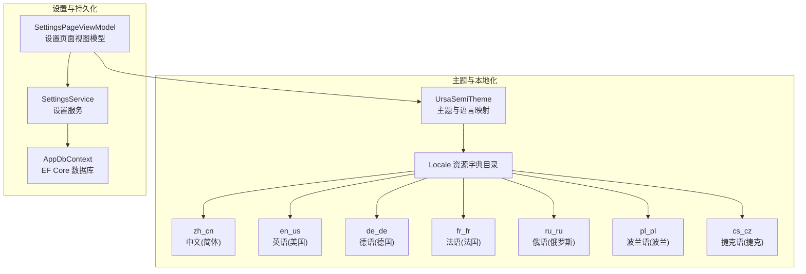
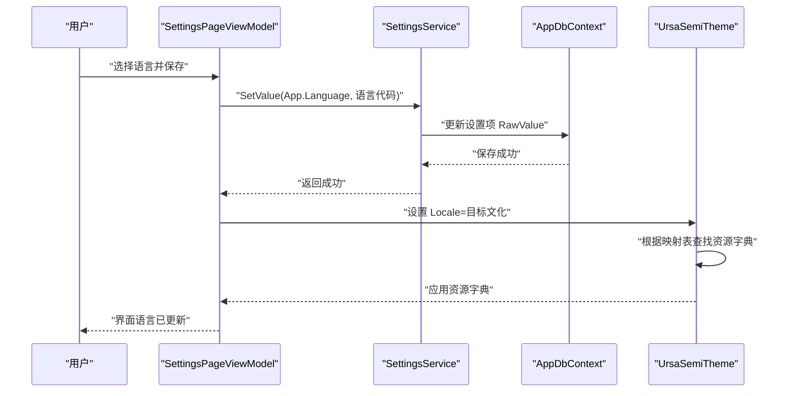
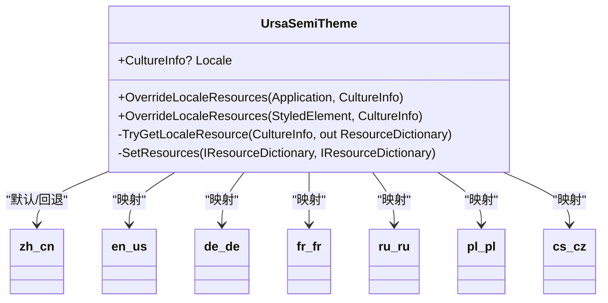
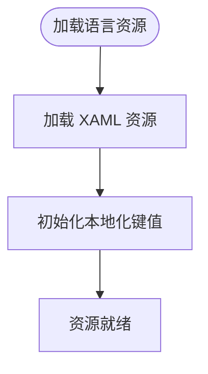
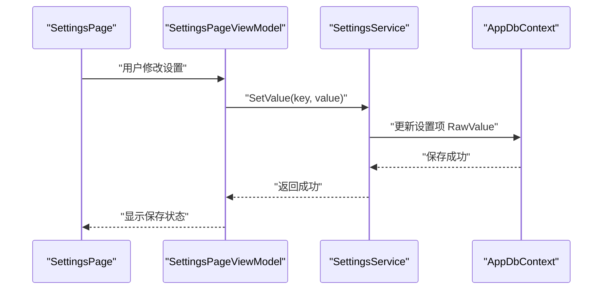
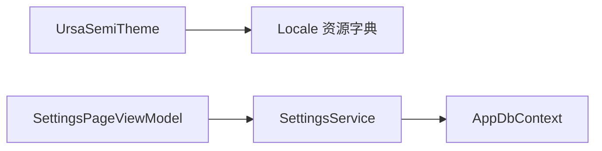

# 国际化支持

<cite>
**本文引用的文件**
- [UrsaSemiTheme.axaml.cs](file://src/Avalonia.UI/Theme/UrsaSemiTheme.axaml.cs)
- [en-us.axaml.cs](file://src/Avalonia.UI/Theme/Locale/en-us.axaml.cs)
- [zh-cn.axaml.cs](file://src/Avalonia.UI/Theme/Locale/zh-cn.axaml.cs)
- [de-de.axaml.cs](file://src/Avalonia.UI/Theme/Locale/de-de.axaml.cs)
- [fr-fr.axaml.cs](file://src/Avalonia.UI/Theme/Locale/fr-fr.axaml.cs)
- [pl-pl.axaml.cs](file://src/Avalonia.UI/Theme/Locale/pl-pl.axaml.cs)
- [ru-ru.axaml.cs](file://src/Avalonia.UI/Theme/Locale/ru-ru.axaml.cs)
- [cs-cz.axaml.cs](file://src/Avalonia.UI/Theme/Locale/cs-cz.axaml.cs)
- [SettingsService.cs](file://src/Avalonia.UI/Services/SettingsService.cs)
- [SettingsPageViewModel.cs](file://src/Avalonia.UI/ViewModels/SettingsPageViewModel.cs)
- [SettingsPage.axaml](file://src/Avalonia.UI/Pages/SettingsPage.axaml)
- [AppDbContext.cs](file://src/Avalonia.UI/Data/AppDbContext.cs)
</cite>

## 目录
1. [简介](#简介)
2. [项目结构](#项目结构)
3. [核心组件](#核心组件)
4. [架构总览](#架构总览)
5. [组件详解](#组件详解)
6. [依赖关系分析](#依赖关系分析)
7. [性能考量](#性能考量)
8. [故障排查指南](#故障排查指南)
9. [结论](#结论)
10. [附录](#附录)

## 简介
本文件系统性阐述 AvaloniaTemplate 的国际化（i18n）与本地化（l10n）设计与实现，覆盖以下方面：
- 多语言架构的设计原理与实现策略
- 本地化资源的组织结构与管理方式
- 已支持语言列表与当前翻译状态
- 添加新语言支持的完整流程（资源文件创建、翻译工作流、测试验证）
- 语言切换机制的实现原理与用户体验优化
- 内容贡献者的翻译指南与质量保证标准
- 国际化相关的性能考虑与维护策略

## 项目结构
国际化能力主要由主题层的 Ursa 半主题与语言资源字典共同构成，同时通过设置系统持久化用户语言偏好并在运行时动态应用。

**图表来源**
- [UrsaSemiTheme.axaml.cs:14-25](file://src/Avalonia.UI/Theme/UrsaSemiTheme.axaml.cs#L14-L25)
- [SettingsService.cs:8-15](file://src/Avalonia.UI/Services/SettingsService.cs#L8-L15)
- [SettingsPageViewModel.cs:12-29](file://src/Avalonia.UI/ViewModels/SettingsPageViewModel.cs#L12-L29)

**章节来源**
- [UrsaSemiTheme.axaml.cs:14-25](file://src/Avalonia.UI/Theme/UrsaSemiTheme.axaml.cs#L14-L25)
- [SettingsService.cs:8-15](file://src/Avalonia.UI/Services/SettingsService.cs#L8-L15)
- [SettingsPageViewModel.cs:12-29](file://src/Avalonia.UI/ViewModels/SettingsPageViewModel.cs#L12-L29)

## 核心组件
- 主题与语言映射：UrsaSemiTheme 维护语言到资源字典的映射表，并提供运行时切换语言的能力。
- 语言资源字典：每个语言对应一个 ResourceDictionary 派生类，负责加载该语言的本地化资源键值。
- 设置系统：SettingsService 提供设置项注册、读写与默认值初始化；SettingsPageViewModel 负责 UI 层交互与运行时应用设置。
- 数据持久化：AppDbContext 使用 EF Core 存储设置项，确保语言偏好等用户配置可持久化。

**章节来源**
- [UrsaSemiTheme.axaml.cs:14-25](file://src/Avalonia.UI/Theme/UrsaSemiTheme.axaml.cs#L14-L25)
- [en-us.axaml.cs:6-12](file://src/Avalonia.UI/Theme/Locale/en-us.axaml.cs#L6-L12)
- [SettingsService.cs:8-15](file://src/Avalonia.UI/Services/SettingsService.cs#L8-L15)
- [SettingsPageViewModel.cs:12-29](file://src/Avalonia.UI/ViewModels/SettingsPageViewModel.cs#L12-L29)
- [AppDbContext.cs:6-12](file://src/Avalonia.UI/Data/AppDbContext.cs#L6-L12)

## 架构总览
下图展示语言切换从用户操作到资源生效的端到端流程：

**图表来源**
- [SettingsPageViewModel.cs:38-62](file://src/Avalonia.UI/ViewModels/SettingsPageViewModel.cs#L38-L62)
- [SettingsService.cs:76-83](file://src/Avalonia.UI/Services/SettingsService.cs#L76-L83)
- [UrsaSemiTheme.axaml.cs:36-59](file://src/Avalonia.UI/Theme/UrsaSemiTheme.axaml.cs#L36-L59)

## 组件详解

### 主题与语言映射（UrsaSemiTheme）
- 语言映射表：通过静态字典将 CultureInfo 映射到各语言资源字典，默认回退到中文(简体)。
- 运行时切换：设置 Locale 属性时，尝试按文化获取资源字典并替换当前资源；若失败则回退至默认资源或不变文化。
- 资源覆盖：提供对 Application 或 StyledElement 的资源覆盖方法，便于在特定元素范围内应用语言资源。

**图表来源**
- [UrsaSemiTheme.axaml.cs:14-25](file://src/Avalonia.UI/Theme/UrsaSemiTheme.axaml.cs#L14-L25)
- [zh-cn.axaml.cs:5-8](file://src/Avalonia.UI/Theme/Locale/zh-cn.axaml.cs#L5-L8)
- [en-us.axaml.cs:6-12](file://src/Avalonia.UI/Theme/Locale/en-us.axaml.cs#L6-L12)
- [de-de.axaml.cs:6-12](file://src/Avalonia.UI/Theme/Locale/de-de.axaml.cs#L6-L12)
- [fr-fr.axaml.cs:6-13](file://src/Avalonia.UI/Theme/Locale/fr-fr.axaml.cs#L6-L13)
- [ru-ru.axaml.cs:6-13](file://src/Avalonia.UI/Theme/Locale/ru-ru.axaml.cs#L6-L13)
- [pl-pl.axaml.cs:6-12](file://src/Avalonia.UI/Theme/Locale/pl-pl.axaml.cs#L6-L12)
- [cs-cz.axaml.cs:6-12](file://src/Avalonia.UI/Theme/Locale/cs-cz.axaml.cs#L6-L12)

**章节来源**
- [UrsaSemiTheme.axaml.cs:14-25](file://src/Avalonia.UI/Theme/UrsaSemiTheme.axaml.cs#L14-L25)
- [UrsaSemiTheme.axaml.cs:36-59](file://src/Avalonia.UI/Theme/UrsaSemiTheme.axaml.cs#L36-L59)
- [UrsaSemiTheme.axaml.cs:61-83](file://src/Avalonia.UI/Theme/UrsaSemiTheme.axaml.cs#L61-L83)
- [UrsaSemiTheme.axaml.cs:85-97](file://src/Avalonia.UI/Theme/UrsaSemiTheme.axaml.cs#L85-L97)
- [UrsaSemiTheme.axaml.cs:99-109](file://src/Avalonia.UI/Theme/UrsaSemiTheme.axaml.cs#L99-L109)

### 语言资源字典（Locale）
- 结构：每个语言文件包含一个继承自 ResourceDictionary 的类，构造函数中加载对应 XAML 资源，并初始化必要的本地化键值。
- 当前状态：示例资源字典均显式设置了统一的占位键，用于演示与占位用途；实际翻译应在此基础上完善键值。

**图表来源**
- [en-us.axaml.cs:8-12](file://src/Avalonia.UI/Theme/Locale/en-us.axaml.cs#L8-L12)
- [de-de.axaml.cs:8-12](file://src/Avalonia.UI/Theme/Locale/de-de.axaml.cs#L8-L12)
- [fr-fr.axaml.cs:8-13](file://src/Avalonia.UI/Theme/Locale/fr-fr.axaml.cs#L8-L13)
- [pl-pl.axaml.cs:8-12](file://src/Avalonia.UI/Theme/Locale/pl-pl.axaml.cs#L8-L12)
- [ru-ru.axaml.cs:8-13](file://src/Avalonia.UI/Theme/Locale/ru-ru.axaml.cs#L8-L13)
- [cs-cz.axaml.cs:8-12](file://src/Avalonia.UI/Theme/Locale/cs-cz.axaml.cs#L8-L12)
- [zh-cn.axaml.cs:5-8](file://src/Avalonia.UI/Theme/Locale/zh-cn.axaml.cs#L5-L8)

**章节来源**
- [en-us.axaml.cs:6-12](file://src/Avalonia.UI/Theme/Locale/en-us.axaml.cs#L6-L12)
- [de-de.axaml.cs:6-12](file://src/Avalonia.UI/Theme/Locale/de-de.axaml.cs#L6-L12)
- [fr-fr.axaml.cs:6-13](file://src/Avalonia.UI/Theme/Locale/fr-fr.axaml.cs#L6-L13)
- [pl-pl.axaml.cs:6-12](file://src/Avalonia.UI/Theme/Locale/pl-pl.axaml.cs#L6-L12)
- [ru-ru.axaml.cs:6-13](file://src/Avalonia.UI/Theme/Locale/ru-ru.axaml.cs#L6-L13)
- [cs-cz.axaml.cs:6-12](file://src/Avalonia.UI/Theme/Locale/cs-cz.axaml.cs#L6-L12)
- [zh-cn.axaml.cs:5-8](file://src/Avalonia.UI/Theme/Locale/zh-cn.axaml.cs#L5-L8)

### 设置系统与持久化
- 设置注册与默认值：初始化时注册常用设置项（如主题、侧边栏折叠、用户名），并设置默认值。
- 读写设置：提供 GetValue/SetValue 接口，支持泛型转换与选项序列化。
- 设置页面：SettingsPageViewModel 负责分组加载设置项、响应用户修改、保存到数据库并应用运行时设置（如主题）。

**图表来源**
- [SettingsPageViewModel.cs:38-62](file://src/Avalonia.UI/ViewModels/SettingsPageViewModel.cs#L38-L62)
- [SettingsService.cs:65-83](file://src/Avalonia.UI/Services/SettingsService.cs#L65-L83)
- [AppDbContext.cs:14-28](file://src/Avalonia.UI/Data/AppDbContext.cs#L14-L28)

**章节来源**
- [SettingsService.cs:17-55](file://src/Avalonia.UI/Services/SettingsService.cs#L17-L55)
- [SettingsService.cs:125-135](file://src/Avalonia.UI/Services/SettingsService.cs#L125-L135)
- [SettingsPageViewModel.cs:107-127](file://src/Avalonia.UI/ViewModels/SettingsPageViewModel.cs#L107-L127)
- [SettingsPageViewModel.cs:81-99](file://src/Avalonia.UI/ViewModels/SettingsPageViewModel.cs#L81-L99)
- [SettingsPage.axaml:1-117](file://src/Avalonia.UI/Pages/SettingsPage.axaml#L1-L117)

## 依赖关系分析
- UrsaSemiTheme 依赖各语言资源字典类进行资源合并与替换。
- SettingsPageViewModel 依赖 SettingsService 读写设置，并在保存后调用运行时应用逻辑。
- SettingsService 依赖 AppDbContext 进行设置项的持久化存储。

**图表来源**
- [UrsaSemiTheme.axaml.cs:14-25](file://src/Avalonia.UI/Theme/UrsaSemiTheme.axaml.cs#L14-L25)
- [SettingsPageViewModel.cs:12-29](file://src/Avalonia.UI/ViewModels/SettingsPageViewModel.cs#L12-L29)
- [SettingsService.cs:8-15](file://src/Avalonia.UI/Services/SettingsService.cs#L8-L15)

**章节来源**
- [UrsaSemiTheme.axaml.cs:14-25](file://src/Avalonia.UI/Theme/UrsaSemiTheme.axaml.cs#L14-L25)
- [SettingsPageViewModel.cs:12-29](file://src/Avalonia.UI/ViewModels/SettingsPageViewModel.cs#L12-L29)
- [SettingsService.cs:8-15](file://src/Avalonia.UI/Services/SettingsService.cs#L8-L15)

## 性能考量
- 资源字典切换成本：每次切换语言会替换当前资源字典，建议避免频繁切换；可在应用启动时一次性完成切换。
- 默认回退策略：未匹配到语言时回退至默认资源，减少异常处理开销。
- EF Core 访问：设置读写使用 DbContextFactory 创建上下文，注意批量操作时复用上下文以降低分配成本。
- UI 更新：语言切换后仅替换资源字典，不触发全量重建，有利于保持 UI 响应性。

[本节为通用性能建议，无需特定文件引用]

## 故障排查指南
- 切换无效：检查 Locale 属性是否被正确赋值，确认目标文化存在于映射表中；若不存在，将回退到默认资源。
- 资源缺失：确认对应语言资源字典已加载且包含所需键值；示例资源字典中存在占位键，需补充完整翻译。
- 设置未保存：检查 SettingsService.GetValue/SetValue 是否正确调用，确认 AppDbContext 事务提交成功。
- 不变文化模式：主题注释提示在 InvariantGlobalization 模式下不要设置 Locale，避免异常。

**章节来源**
- [UrsaSemiTheme.axaml.cs:11-13](file://src/Avalonia.UI/Theme/UrsaSemiTheme.axaml.cs#L11-L13)
- [UrsaSemiTheme.axaml.cs:36-59](file://src/Avalonia.UI/Theme/UrsaSemiTheme.axaml.cs#L36-L59)
- [SettingsService.cs:65-83](file://src/Avalonia.UI/Services/SettingsService.cs#L65-L83)

## 结论
AvaloniaTemplate 的国际化方案采用“主题+资源字典”的清晰分层：UrsaSemiTheme 负责语言映射与资源替换，语言资源字典承载具体文本与键值，设置系统负责持久化与运行时应用。该方案具备良好的扩展性与可维护性，适合逐步完善多语言支持。

[本节为总结性内容，无需特定文件引用]

## 附录

### 支持的语言列表与当前翻译状态
- 已支持语言（含占位键）：
  - 中文(简体) zh-CN
  - 英语(美国) en-US
  - 德语(德国) de-DE
  - 法语(法国) fr-FR
  - 俄语(俄罗斯) ru-RU
  - 波兰语(波兰) pl-PL
  - 捷克语(捷克) cs-CZ
- 当前状态：示例资源字典已初始化统一占位键，建议补充完整翻译内容以满足生产使用。

**章节来源**
- [UrsaSemiTheme.axaml.cs:16-25](file://src/Avalonia.UI/Theme/UrsaSemiTheme.axaml.cs#L16-L25)
- [en-us.axaml.cs:10-11](file://src/Avalonia.UI/Theme/Locale/en-us.axaml.cs#L10-L11)
- [de-de.axaml.cs:10-11](file://src/Avalonia.UI/Theme/Locale/de-de.axaml.cs#L10-L11)
- [fr-fr.axaml.cs:10-11](file://src/Avalonia.UI/Theme/Locale/fr-fr.axaml.cs#L10-L11)
- [pl-pl.axaml.cs:10-11](file://src/Avalonia.UI/Theme/Locale/pl-pl.axaml.cs#L10-L11)
- [ru-ru.axaml.cs:10-11](file://src/Avalonia.UI/Theme/Locale/ru-ru.axaml.cs#L10-L11)
- [cs-cz.axaml.cs:10-11](file://src/Avalonia.UI/Theme/Locale/cs-cz.axaml.cs#L10-L11)
- [zh-cn.axaml.cs:5-8](file://src/Avalonia.UI/Theme/Locale/zh-cn.axaml.cs#L5-L8)

### 添加新语言支持的完整流程
- 步骤一：创建资源字典
  - 在 Locale 目录新增语言代码的资源字典类，继承 ResourceDictionary 并在构造函数中加载 XAML 资源。
  - 参考现有文件命名与结构。
  - 参考路径：[en-us.axaml.cs:6-12](file://src/Avalonia.UI/Theme/Locale/en-us.axaml.cs#L6-L12)
- 步骤二：完善资源键值
  - 补充所有需要本地化的键值，确保覆盖 UI 中使用的全部字符串。
  - 参考路径：[zh-cn.axaml.cs:5-8](file://src/Avalonia.UI/Theme/Locale/zh-cn.axaml.cs#L5-L8)
- 步骤三：注册到映射表
  - 在 UrsaSemiTheme 的语言映射表中添加新的 CultureInfo 到资源字典的映射。
  - 参考路径：[UrsaSemiTheme.axaml.cs:16-25](file://src/Avalonia.UI/Theme/UrsaSemiTheme.axaml.cs#L16-L25)
- 步骤四：翻译工作流
  - 使用占位键作为翻译基线，逐步完善各语言版本。
  - 建议建立评审流程，确保术语一致与上下文贴合。
- 步骤五：测试验证
  - 在设置页面选择新语言并保存，观察界面文案是否正确切换。
  - 验证资源字典加载与键值解析无异常。
  - 参考路径：[SettingsPageViewModel.cs:38-62](file://src/Avalonia.UI/ViewModels/SettingsPageViewModel.cs#L38-L62)
- 步骤六：回归与发布
  - 对关键页面进行多语言回归测试，确保布局与字符集兼容。
  - 发布前检查 EF Core 设置项是否包含新语言键。

**章节来源**
- [UrsaSemiTheme.axaml.cs:16-25](file://src/Avalonia.UI/Theme/UrsaSemiTheme.axaml.cs#L16-L25)
- [en-us.axaml.cs:6-12](file://src/Avalonia.UI/Theme/Locale/en-us.axaml.cs#L6-L12)
- [SettingsPageViewModel.cs:38-62](file://src/Avalonia.UI/ViewModels/SettingsPageViewModel.cs#L38-L62)

### 语言切换机制与用户体验优化
- 切换原理：通过设置 UrsaSemiTheme.Locale，在运行时替换应用或元素级资源字典，实现即时语言切换。
- 用户体验优化建议：
  - 在设置页面提供语言下拉框与预览提示。
  - 切换后自动刷新相关页面，避免部分缓存导致的残留文本。
  - 对长文本与多语言排版进行布局适配测试。
- 参考路径：
  - [UrsaSemiTheme.axaml.cs:36-59](file://src/Avalonia.UI/Theme/UrsaSemiTheme.axaml.cs#L36-L59)
  - [SettingsPageViewModel.cs:81-99](file://src/Avalonia.UI/ViewModels/SettingsPageViewModel.cs#L81-L99)

**章节来源**
- [UrsaSemiTheme.axaml.cs:36-59](file://src/Avalonia.UI/Theme/UrsaSemiTheme.axaml.cs#L36-L59)
- [SettingsPageViewModel.cs:81-99](file://src/Avalonia.UI/ViewModels/SettingsPageViewModel.cs#L81-L99)

### 翻译指南与质量保证标准
- 翻译指南
  - 键名一致性：保持键名稳定，避免频繁变更；新增键时统一命名规范。
  - 上下文贴合：结合 UI 场景翻译，避免直译导致歧义。
  - 文化适配：注意日期、数字、货币等格式的文化差异。
- 质量保证
  - 建立术语表与翻译记忆库，提升一致性。
  - 引入自动化校验（如键名检查、占位符匹配）。
  - 定期进行多语言回归测试与可用性评估。

[本节为通用指导，无需特定文件引用]