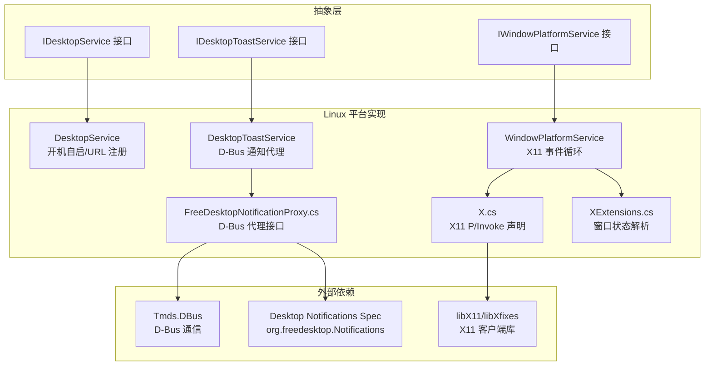
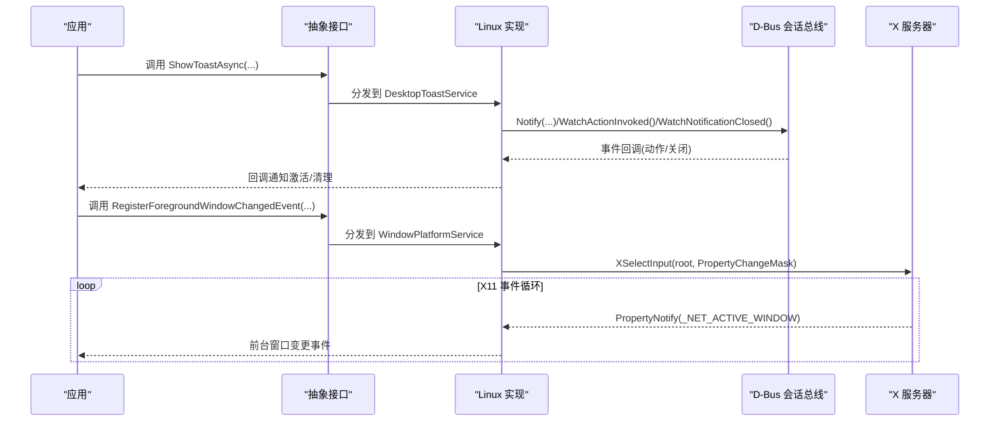
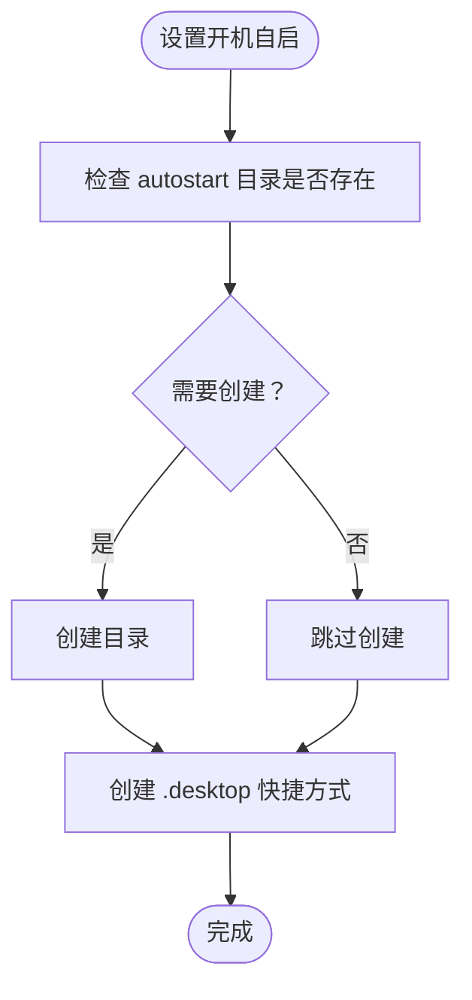
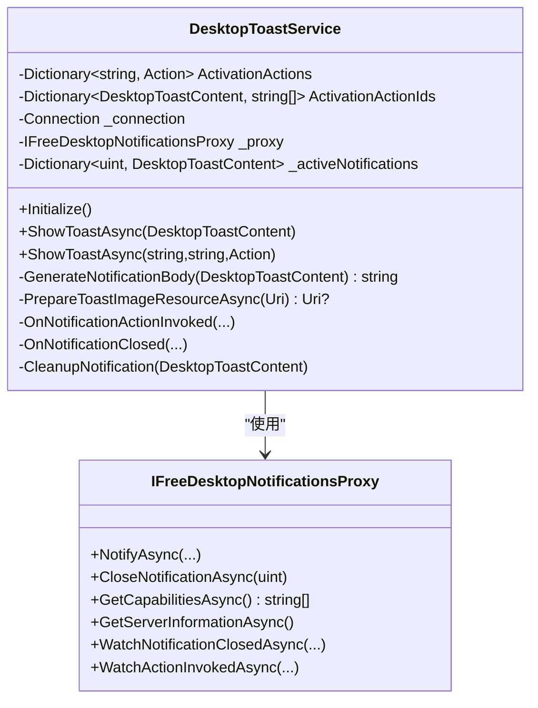
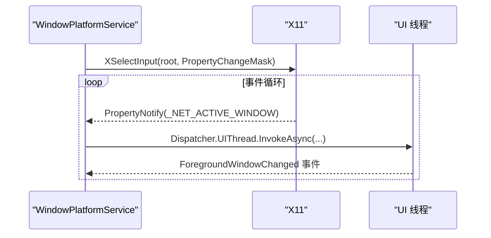
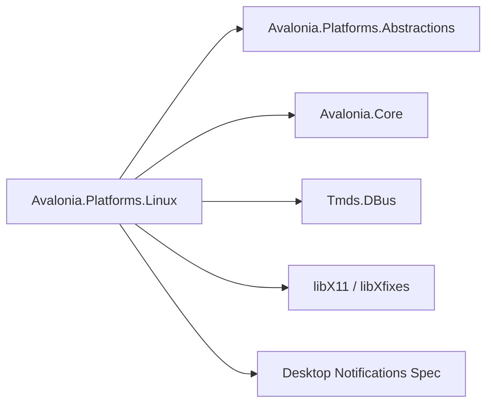

# Linux 平台实现

<cite>
**本文引用的文件**
- [Avalonia.Platforms.Linux.csproj](file://src/platforms/Avalonia.Platforms.Linux/Avalonia.Platforms.Linux.csproj)
- [DesktopService.cs](file://src/platforms/Avalonia.Platforms.Linux/Services/DesktopService.cs)
- [DesktopToastService.cs](file://src/platforms/Avalonia.Platforms.Linux/Services/DesktopToastService.cs)
- [WindowPlatformService.cs](file://src/platforms/Avalonia.Platforms.Linux/Services/WindowPlatformService.cs)
- [FreeDesktopNotificationProxy.cs](file://src/platforms/Avalonia.Platforms.Linux/Notification/FreedomDesktopNotificationProxy.cs)
- [X.cs](file://src/platforms/Avalonia.Platforms.Linux/X.cs)
- [XExtensions.cs](file://src/platforms/Avalonia.Platforms.Linux/XExtensions.cs)
- [IDesktopService.cs](file://src/Avalonia.Platforms.Abstractions/Services/IDesktopService.cs)
- [IDesktopToastService.cs](file://src/Avalonia.Platforms.Abstractions/Services/IDesktopToastService.cs)
- [IWindowPlatformService.cs](file://src/Avalonia.Platforms.Abstractions/Services/IWindowPlatformService.cs)
</cite>

## 目录
1. [简介](#简介)
2. [项目结构](#项目结构)
3. [核心组件](#核心组件)
4. [架构总览](#架构总览)
5. [详细组件分析](#详细组件分析)
6. [依赖关系分析](#依赖关系分析)
7. [性能考量](#性能考量)
8. [故障排查指南](#故障排查指南)
9. [结论](#结论)
10. [附录](#附录)

## 简介
本文件面向 Linux 平台的 Avalonia 实现，聚焦于桌面服务、桌面通知服务与窗口平台服务的实现细节，系统阐述对 FreeDesktop 规范的遵循与实现策略，并说明与 GNOME、KDE、XFCE 等桌面环境的兼容性处理思路。同时给出 Linux 特有通知协议（Desktop Notifications Specification）的使用方式、包管理集成与系统服务注册建议、权限管理最佳实践及不同发行版适配策略。

## 项目结构
Linux 平台实现位于独立的平台工程中，通过抽象层接口对接上层应用，底层依赖 X11 与 D-Bus，分别用于窗口平台能力与桌面通知能力。

图表来源
- [Avalonia.Platforms.Linux.csproj:1-20](file://src/platforms/Avalonia.Platforms.Linux/Avalonia.Platforms.Linux.csproj#L1-L20)
- [DesktopService.cs:1-45](file://src/platforms/Avalonia.Platforms.Linux/Services/DesktopService.cs#L1-L45)
- [DesktopToastService.cs:1-246](file://src/platforms/Avalonia.Platforms.Linux/Services/DesktopToastService.cs#L1-L246)
- [WindowPlatformService.cs:1-342](file://src/platforms/Avalonia.Platforms.Linux/Services/WindowPlatformService.cs#L1-L342)
- [FreeDesktopNotificationProxy.cs:1-35](file://src/platforms/Avalonia.Platforms.Linux/Notification/FreedomDesktopNotificationProxy.cs#L1-L35)
- [X.cs:1-833](file://src/platforms/Avalonia.Platforms.Linux/X.cs#L1-L833)
- [XExtensions.cs:1-88](file://src/platforms/Avalonia.Platforms.Linux/XExtensions.cs#L1-L88)

章节来源
- [Avalonia.Platforms.Linux.csproj:1-20](file://src/platforms/Avalonia.Platforms.Linux/Avalonia.Platforms.Linux.csproj#L1-L20)

## 核心组件
- 桌面服务（开机自启与 URL 协议注册）
  - 通过 FreeDesktop autostart 机制实现开机自启；URL 协议注册接口存在但未实现。
- 桌面通知服务（基于 Desktop Notifications Specification）
  - 使用 D-Bus org.freedesktop.Notifications 接口，支持通知动作、关闭事件监听与能力查询。
- 窗口平台服务（X11）
  - 通过 X11 事件循环监听前台窗口变化，提供窗口特性控制（置顶/置底/透明等）、窗口状态检测、鼠标位置与 PID 查询等。

章节来源
- [IDesktopService.cs:1-17](file://src/Avalonia.Platforms.Abstractions/Services/IDesktopService.cs#L1-L17)
- [IDesktopToastService.cs:1-30](file://src/Avalonia.Platforms.Abstractions/Services/IDesktopToastService.cs#L1-L30)
- [IWindowPlatformService.cs:1-106](file://src/Avalonia.Platforms.Abstractions/Services/IWindowPlatformService.cs#L1-L106)
- [DesktopService.cs:1-45](file://src/platforms/Avalonia.Platforms.Linux/Services/DesktopService.cs#L1-L45)
- [DesktopToastService.cs:1-246](file://src/platforms/Avalonia.Platforms.Linux/Services/DesktopToastService.cs#L1-L246)
- [WindowPlatformService.cs:1-342](file://src/platforms/Avalonia.Platforms.Linux/Services/WindowPlatformService.cs#L1-L342)

## 架构总览
Linux 平台以“抽象接口 + 平台实现”的方式组织，上层仅依赖抽象层，平台层通过 D-Bus 与 X11 提供具体能力。

图表来源
- [DesktopToastService.cs:39-61](file://src/platforms/Avalonia.Platforms.Linux/Services/DesktopToastService.cs#L39-L61)
- [FreeDesktopNotificationProxy.cs:17-34](file://src/platforms/Avalonia.Platforms.Linux/Notification/FreedomDesktopNotificationProxy.cs#L17-L34)
- [WindowPlatformService.cs:69-126](file://src/platforms/Avalonia.Platforms.Linux/Services/WindowPlatformService.cs#L69-L126)

## 详细组件分析

### 桌面服务（开机自启与 URL 注册）
- 开机自启
  - 通过 FreeDesktop autostart 机制，在用户配置目录下创建 .desktop 文件，实现随会话启动。
  - 支持启用/禁用，内部使用辅助工具创建快捷方式。
- URL 协议注册
  - 接口已定义，当前实现返回不支持注册。

图表来源
- [DesktopService.cs:13-39](file://src/platforms/Avalonia.Platforms.Linux/Services/DesktopService.cs#L13-L39)

章节来源
- [DesktopService.cs:1-45](file://src/platforms/Avalonia.Platforms.Linux/Services/DesktopService.cs#L1-L45)
- [IDesktopService.cs:1-17](file://src/Avalonia.Platforms.Abstractions/Services/IDesktopService.cs#L1-L17)

### 桌面通知服务（Desktop Notifications Specification）
- D-Bus 代理
  - 通过 Tmds.DBus 生成 org.freedesktop.Notifications 接口代理，支持 Notify、Close、GetCapabilities、GetServerInformation、WatchNotificationClosed、WatchActionInvoked。
- 初始化与事件订阅
  - 连接会话总线，创建代理并订阅动作与关闭事件，获取能力集。
- 通知体构造
  - 支持标题、正文、图标、按钮动作；图片资源支持 file/avares/http(s) 三种来源，内部转换为临时文件路径。
- 行为与兼容性
  - 对 KDE 的 body-images 能力进行条件判断；部分桌面环境对内联图片渲染存在差异，代码中保留了兼容性注释与开关。
- 生命周期管理
  - 维护活动通知映射与动作 ID 到回调的映射，确保通知关闭后清理资源。

图表来源
- [DesktopToastService.cs:12-61](file://src/platforms/Avalonia.Platforms.Linux/Services/DesktopToastService.cs#L12-L61)
- [FreeDesktopNotificationProxy.cs:17-34](file://src/platforms/Avalonia.Platforms.Linux/Notification/FreedomDesktopNotificationProxy.cs#L17-L34)

章节来源
- [DesktopToastService.cs:1-246](file://src/platforms/Avalonia.Platforms.Linux/Services/DesktopToastService.cs#L1-L246)
- [FreeDesktopNotificationProxy.cs:1-35](file://src/platforms/Avalonia.Platforms.Linux/Notification/FreedomDesktopNotificationProxy.cs#L1-L35)
- [IDesktopToastService.cs:1-30](file://src/Avalonia.Platforms.Abstractions/Services/IDesktopToastService.cs#L1-L30)

### 窗口平台服务（X11）
- 事件循环与前台窗口监听
  - 启动专用线程，初始化 X11 线程模型，选择根窗口属性事件，监听 _NET_ACTIVE_WINDOW 属性变化，推送到 UI 线程分发前台窗口变更事件。
- 窗口特性控制
  - 支持透明区域、置顶/置底、工具窗口类型、跳过窗口管理（override_redirect）等；通过发送 ClientMessage 事件与 X11 原子交互。
- 窗口状态检测
  - 通过 _NET_WM_STATE 及其原子值判断最大化/最小化/全屏等状态。
- 辅助能力
  - 获取窗口标题、类名、鼠标位置、前台窗口 PID、强制清空窗口绘制等。

图表来源
- [WindowPlatformService.cs:69-126](file://src/platforms/Avalonia.Platforms.Linux/Services/WindowPlatformService.cs#L69-L126)

章节来源
- [WindowPlatformService.cs:1-342](file://src/platforms/Avalonia.Platforms.Linux/Services/WindowPlatformService.cs#L1-L342)
- [X.cs:1-833](file://src/platforms/Avalonia.Platforms.Linux/X.cs#L1-L833)
- [XExtensions.cs:1-88](file://src/platforms/Avalonia.Platforms.Linux/XExtensions.cs#L1-L88)
- [IWindowPlatformService.cs:1-106](file://src/Avalonia.Platforms.Abstractions/Services/IWindowPlatformService.cs#L1-L106)

## 依赖关系分析
- 平台工程依赖
  - 抽象层接口工程与 Avalonia 核心工程，确保平台实现与上层解耦。
  - 第三方库 Tmds.DBus 用于 D-Bus 通信。
- 运行时依赖
  - X11 客户端库 libX11 与 libXfixes，提供窗口与图形操作能力。
  - D-Bus 会话总线，承载桌面通知协议。

图表来源
- [Avalonia.Platforms.Linux.csproj:10-17](file://src/platforms/Avalonia.Platforms.Linux/Avalonia.Platforms.Linux.csproj#L10-L17)

章节来源
- [Avalonia.Platforms.Linux.csproj:1-20](file://src/platforms/Avalonia.Platforms.Linux/Avalonia.Platforms.Linux.csproj#L1-L20)

## 性能考量
- X11 事件循环
  - 使用专用线程处理 X11 事件，避免阻塞 UI 线程；注意错误处理与资源释放。
- D-Bus 通知
  - 图片资源下载与写入临时文件可能带来 I/O 开销，建议缓存与复用；对 KDE 的 body-images 能力进行能力检测，避免无效渲染。
- 窗口特性切换
  - 频繁发送 ClientMessage 与 XFlush 可能导致额外开销，建议批处理或去抖动。

## 故障排查指南
- 通知无响应或重复触发
  - 检查 D-Bus 代理初始化与事件订阅是否成功；确认桌面环境支持的能力集合；注意通知关闭事件可能重复触发，需幂等处理。
- 前台窗口事件不更新
  - 确认 X11 事件循环线程运行正常；检查 _NET_ACTIVE_WINDOW 属性监听是否生效；验证 XErrorHandler 是否正确安装。
- 透明/置顶/置底无效
  - 确认桌面环境支持对应 _NET_WM_STATE 原子；检查 override_redirect 切换是否成功；必要时回退到 WM 通用属性。
- 权限与路径问题
  - 开机自启路径位于用户配置目录，需确保目录可写；通知图片资源访问需处理网络/文件权限异常。

章节来源
- [DesktopToastService.cs:99-140](file://src/platforms/Avalonia.Platforms.Linux/Services/DesktopToastService.cs#L99-L140)
- [WindowPlatformService.cs:29-57](file://src/platforms/Avalonia.Platforms.Linux/Services/WindowPlatformService.cs#L29-L57)

## 结论
Linux 平台实现严格遵循 FreeDesktop 规范，通过 D-Bus 与 X11 提供稳定的服务能力。桌面通知服务覆盖主流桌面环境，窗口平台服务提供基础的窗口管理与前台监控能力。建议在实际部署中结合各发行版特性进行兼容性测试，并在通知与窗口特性方面做好能力检测与降级处理。

## 附录
- 包管理与系统服务注册
  - 开机自启采用 FreeDesktop autostart 机制，适合打包为 .deb/.rpm 等格式并在安装脚本中创建 .desktop 文件。
- 权限管理
  - 通知图片资源涉及文件系统与网络访问，需在沙箱或受限环境中谨慎处理；X11 访问需确保 DISPLAY 正确。
- 发行版适配策略
  - 不同桌面环境对通知能力与窗口管理的支持存在差异，应通过能力查询与特性检测动态调整行为；对 KDE 的 body-images 渲染差异应做条件分支处理。