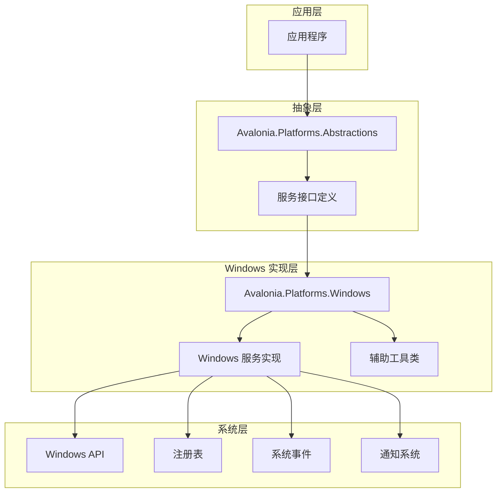
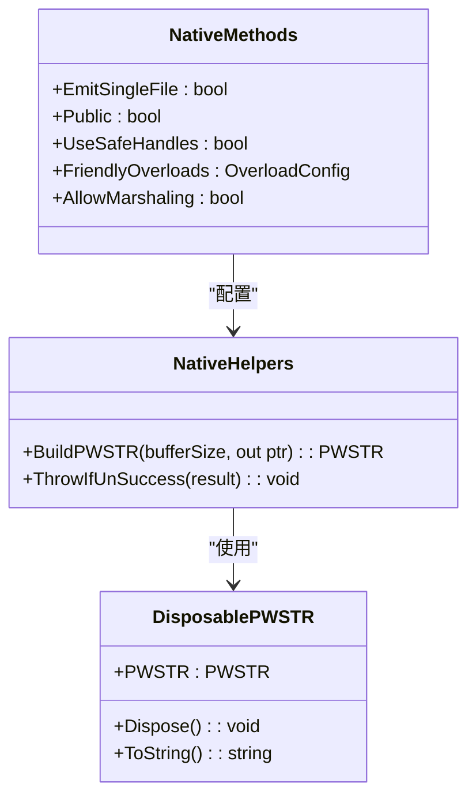
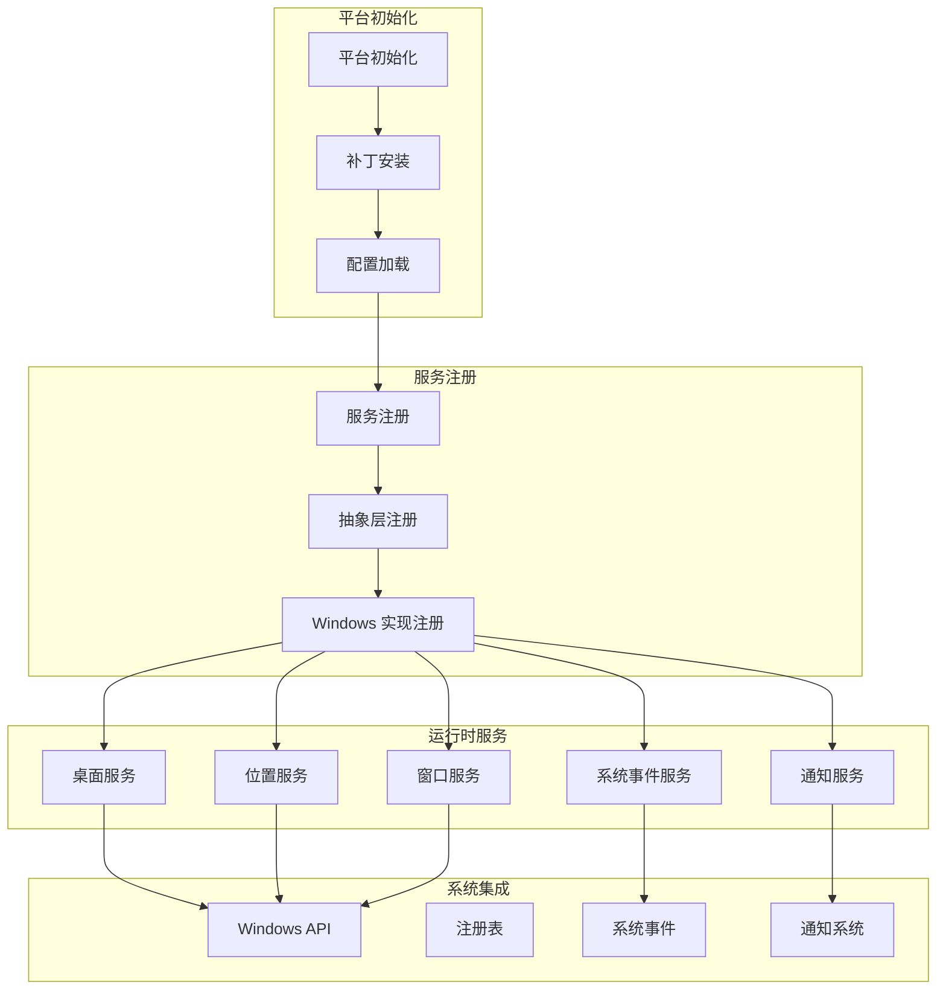
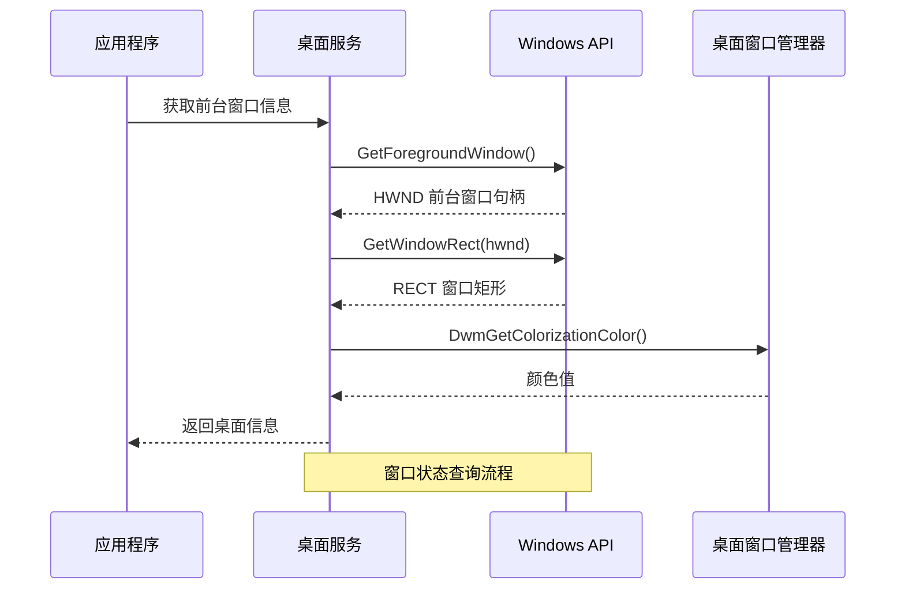
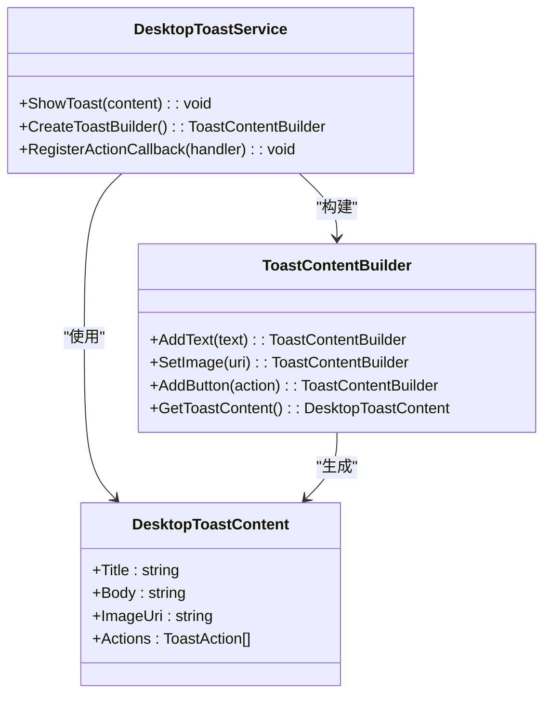
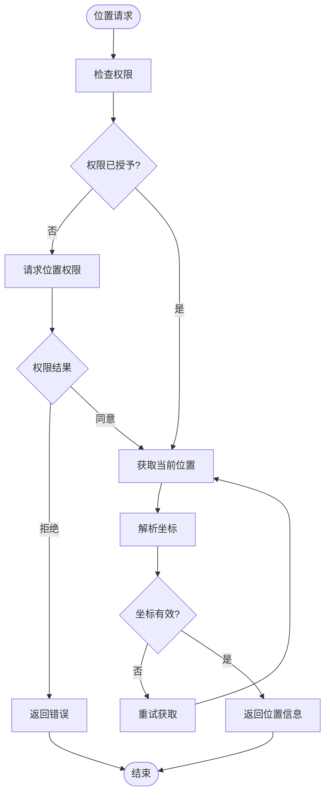
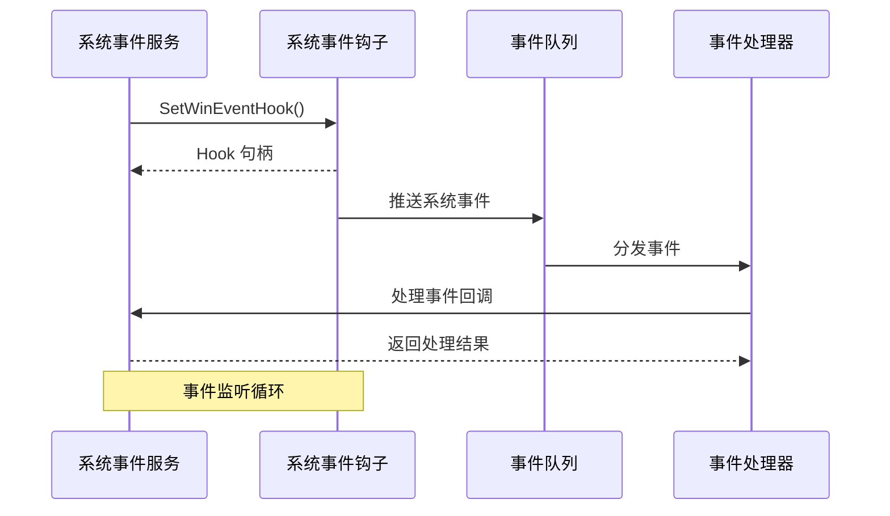
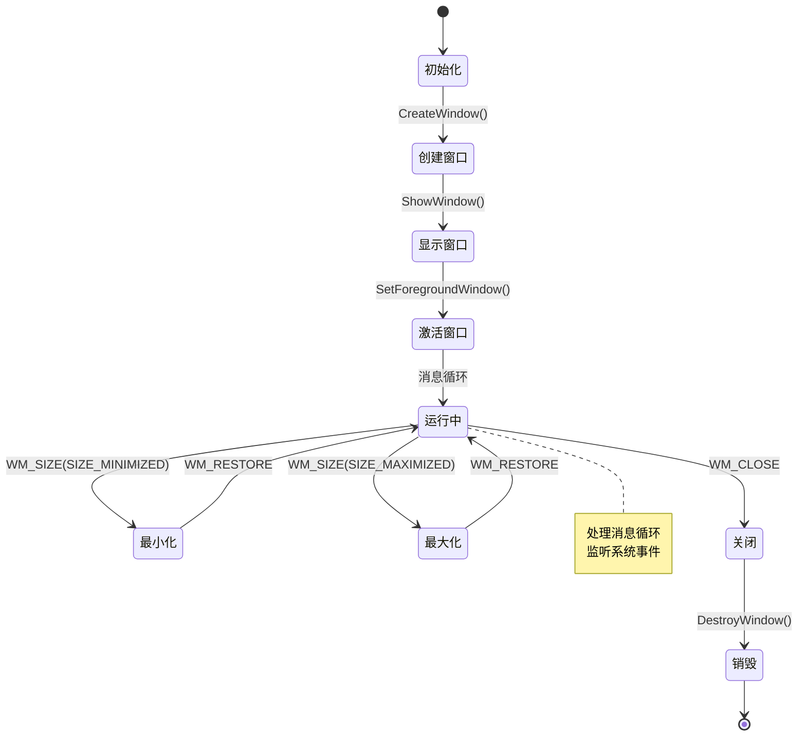
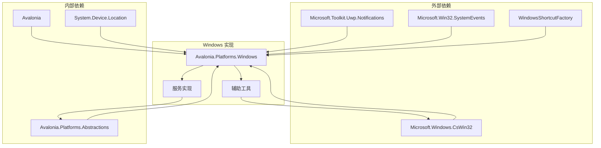

# Windows 平台实现

<cite>
**本文档引用的文件**
- [Avalonia.Platforms.Windows.csproj](file://src/platforms/Avalonia.Platforms.Windows/Avalonia.Platforms.Windows.csproj)
- [NativeMethods.json](file://src/platforms/Avalonia.Platforms.Windows/NativeMethods.json)
- [NativeMethods.txt](file://src/platforms/Avalonia.Platforms.Windows/NativeMethods.txt)
- [PatcherEntrance.cs](file://src/platforms/Avalonia.Platforms.Windows/PatcherEntrance.cs)
- [AssemblyInfo.cs](file://src/platforms/Avalonia.Platforms.Windows/AssemblyInfo.cs)
- [GlobalUsing.cs](file://src/platforms/Avalonia.Platforms.Windows/GlobalUsing.cs)
- [NativeHelpers.cs](file://src/platforms/Avalonia.Platforms.Windows/NativeHelpers.cs)
- [DisposablePWSTR.cs](file://src/platforms/Avalonia.Platforms.Windows/DisposablePWSTR.cs)
- [IDesktopService.cs](file://src/Avalonia.Platforms.Abstractions/Services/IDesktopService.cs)
- [IDesktopToastService.cs](file://src/Avalonia.Platforms.Abstractions/Services/IDesktopToastService.cs)
- [ILocationService.cs](file://src/Avalonia.Platforms.Abstractions/Services/ILocationService.cs)
- [ISystemEventsService.cs](file://src/Avalonia.Platforms.Abstractions/Services/ISystemEventsService.cs)
- [IWindowPlatformService.cs](file://src/Avalonia.Platforms.Abstractions/Services/IWindowPlatformService.cs)
- [DesktopToastContent.cs](file://src/Avalonia.Platforms.Abstractions/Models/DesktopToastContent.cs)
- [LocationCoordinate.cs](file://src/Avalonia.Platforms.Abstractions/Models/LocationCoordinate.cs)
- [PlatformServices.cs](file://src/Avalonia.Platforms.Abstractions/PlatformServices.cs)
- [DesktopServiceStub.cs](file://src/Avalonia.Platforms.Abstractions/Stubs/Services/DesktopServiceStub.cs)
- [DesktopToastServiceStub.cs](file://src/Avalonia.Platforms.Abstractions/Stubs/Services/DesktopToastServiceStub.cs)
- [LocationServiceStub.cs](file://src/Avalonia.Platforms.Abstractions/Stubs/Services/LocationServiceStub.cs)
- [SystemEventsServiceStub.cs](file://src/Avalonia.Platforms.Abstractions/Stubs/Services/SystemEventsServiceStub.cs)
- [WindowPlatformServiceStub.cs](file://src/Avalonia.Platforms.Abstractions/Stubs/Services/WindowPlatformServiceStub.cs)
</cite>

## 目录
1. [简介](#简介)
2. [项目结构](#项目结构)
3. [核心组件](#核心组件)
4. [架构概览](#架构概览)
5. [详细组件分析](#详细组件分析)
6. [依赖关系分析](#依赖关系分析)
7. [性能考虑](#性能考虑)
8. [故障排除指南](#故障排除指南)
9. [结论](#结论)

## 简介

本文件详细阐述了 Avalonia 模板项目在 Windows 平台下的实现方案。该项目采用跨平台设计，通过抽象层定义统一的服务接口，再由各平台具体实现来提供本地化功能。Windows 平台实现重点关注以下核心服务：

- 桌面服务：提供系统级桌面操作能力
- 桌面通知服务：实现 Windows 通知系统集成
- 位置服务：基于系统地理位置 API 提供定位功能
- 系统事件服务：监听和响应系统级事件
- 窗口平台服务：管理窗口生命周期和平台特定行为

该实现充分利用了 Windows API、注册表操作、系统事件钩子等原生功能，同时保持与 Avalonia 跨平台框架的无缝集成。

## 项目结构

Windows 平台实现采用分层架构设计，主要包含以下层次：

**图表来源**
- [Avalonia.Platforms.Windows.csproj:1-26](file://src/platforms/Avalonia.Platforms.Windows/Avalonia.Platforms.Windows.csproj#L1-L26)
- [PlatformServices.cs](file://src/Avalonia.Platforms.Abstractions/PlatformServices.cs)

**章节来源**
- [Avalonia.Platforms.Windows.csproj:1-26](file://src/platforms/Avalonia.Platforms.Windows/Avalonia.Platforms.Windows.csproj#L1-L26)
- [AssemblyInfo.cs:1-3](file://src/platforms/Avalonia.Platforms.Windows/AssemblyInfo.cs#L1-L3)

## 核心组件

### Windows 平台配置

Windows 平台项目配置具有以下关键特性：

- **目标框架**：.NET 10.0，支持 Windows 10.0.19041.0 及以上版本
- **平台限定**：明确声明仅支持 Windows 平台
- **依赖管理**：通过包引用管理第三方库

### 原生方法集成

项目采用 CsWin32 工具链实现安全的原生 API 调用：

**图表来源**
- [NativeMethods.json:1-10](file://src/platforms/Avalonia.Platforms.Windows/NativeMethods.json#L1-L10)
- [NativeHelpers.cs:1-21](file://src/platforms/Avalonia.Platforms.Windows/NativeHelpers.cs#L1-L21)
- [DisposablePWSTR.cs:1-39](file://src/platforms/Avalonia.Platforms.Windows/DisposablePWSTR.cs#L1-L39)

**章节来源**
- [NativeMethods.json:1-10](file://src/platforms/Avalonia.Platforms.Windows/NativeMethods.json#L1-L10)
- [NativeHelpers.cs:1-21](file://src/platforms/Avalonia.Platforms.Windows/NativeHelpers.cs#L1-L21)
- [DisposablePWSTR.cs:1-39](file://src/platforms/Avalonia.Platforms.Windows/DisposablePWSTR.cs#L1-L39)

## 架构概览

Windows 平台实现遵循依赖注入和插件化架构模式：

**图表来源**
- [PatcherEntrance.cs:1-12](file://src/platforms/Avalonia.Platforms.Windows/PatcherEntrance.cs#L1-L12)
- [PlatformServices.cs](file://src/Avalonia.Platforms.Abstractions/PlatformServices.cs)

## 详细组件分析

### 桌面服务实现

桌面服务负责系统级桌面操作，包括窗口管理、桌面切换等功能。其核心实现涉及以下 Windows API：

- **窗口管理 API**：SetWindowLong、GetWindowLong、SetWindowPos
- **桌面切换**：CreateDesktop、OpenDesktop、SwitchDesktop
- **显示属性**：GetWindowRect、GetForegroundWindow

**图表来源**
- [NativeMethods.txt:1-106](file://src/platforms/Avalonia.Platforms.Windows/NativeMethods.txt#L1-L106)

### 桌面通知服务实现

桌面通知服务基于 Microsoft.Toolkit.Uwp.Notifications 包实现，提供现代化的通知功能：

**图表来源**
- [IDesktopToastService.cs](file://src/Avalonia.Platforms.Abstractions/Services/IDesktopToastService.cs)
- [DesktopToastContent.cs](file://src/Avalonia.Platforms.Abstractions/Models/DesktopToastContent.cs)

### 位置服务实现

位置服务利用 System.Device.Location 库提供的地理位置 API：

**图表来源**
- [ILocationService.cs](file://src/Avalonia.Platforms.Abstractions/Services/ILocationService.cs)
- [LocationCoordinate.cs](file://src/Avalonia.Platforms.Abstractions/Models/LocationCoordinate.cs)

### 系统事件服务实现

系统事件服务监听 Windows 系统事件，包括窗口状态变化、系统设置更改等：

**图表来源**
- [ISystemEventsService.cs](file://src/Avalonia.Platforms.Abstractions/Services/ISystemEventsService.cs)
- [NativeMethods.txt:40-42](file://src/platforms/Avalonia.Platforms.Windows/NativeMethods.txt#L40-L42)

### 窗口平台服务实现

窗口平台服务管理窗口生命周期和平台特定行为：

**图表来源**
- [IWindowPlatformService.cs](file://src/Avalonia.Platforms.Abstractions/Services/IWindowPlatformService.cs)

**章节来源**
- [IDesktopService.cs](file://src/Avalonia.Platforms.Abstractions/Services/IDesktopService.cs)
- [IDesktopToastService.cs](file://src/Avalonia.Platforms.Abstractions/Services/IDesktopToastService.cs)
- [ILocationService.cs](file://src/Avalonia.Platforms.Abstractions/Services/ILocationService.cs)
- [ISystemEventsService.cs](file://src/Avalonia.Platforms.Abstractions/Services/ISystemEventsService.cs)
- [IWindowPlatformService.cs](file://src/Avalonia.Platforms.Abstractions/Services/IWindowPlatformService.cs)

## 依赖关系分析

Windows 平台实现的依赖关系呈现清晰的分层结构：

**图表来源**
- [Avalonia.Platforms.Windows.csproj:10-24](file://src/platforms/Avalonia.Platforms.Windows/Avalonia.Platforms.Windows.csproj#L10-L24)

**章节来源**
- [Avalonia.Platforms.Windows.csproj:10-24](file://src/platforms/Avalonia.Platforms.Windows/Avalonia.Platforms.Windows.csproj#L10-L24)

## 性能考虑

### 内存管理优化

Windows 平台实现特别关注内存泄漏防护：

- **PWSTR 内存管理**：使用 DisposablePWSTR 确保原生字符串内存正确释放
- **句柄资源管理**：所有 Win32 句柄使用 using 语句确保及时释放
- **事件钩子清理**：确保 UnhookWinEvent 在适当时候调用

### 异步操作优化

- **非阻塞调用**：大量使用异步 API 避免界面冻结
- **超时机制**：对可能阻塞的操作设置合理超时
- **批量操作**：合并多个相关操作减少系统调用次数

### 缓存策略

- **API 调用缓存**：对频繁查询的结果进行短期缓存
- **配置数据缓存**：避免重复读取注册表和配置文件
- **对象池**：复用临时对象减少 GC 压力

## 故障排除指南

### 常见问题及解决方案

#### 权限相关问题

**问题**：位置服务无法获取用户位置
**解决方案**：
1. 确认应用具有位置访问权限
2. 检查 Windows 位置服务是否启用
3. 验证地理位置 API 是否可用

#### 注册表操作失败

**问题**：开机自启动或 URL 协议注册失败
**解决方案**：
1. 检查管理员权限
2. 验证注册表路径正确性
3. 确认 Windows 版本兼容性

#### 通知显示异常

**问题**：桌面通知不显示或显示错误
**解决方案**：
1. 检查通知系统服务状态
2. 验证通知内容格式
3. 确认应用具有通知权限

### 调试技巧

- **启用详细日志**：记录所有 Win32 API 调用结果
- **使用调试器**：监控句柄泄漏和内存使用情况
- **性能分析**：使用性能计数器监控系统资源使用

**章节来源**
- [NativeHelpers.cs:14-20](file://src/platforms/Avalonia.Platforms.Windows/NativeHelpers.cs#L14-L20)
- [DisposablePWSTR.cs:27-32](file://src/platforms/Avalonia.Platforms.Windows/DisposablePWSTR.cs#L27-L32)

## 结论

Windows 平台实现展现了优秀的跨平台架构设计，通过抽象层与具体实现的分离，既保证了功能的完整性，又保持了代码的可维护性。关键优势包括：

1. **安全性**：严格的内存管理和异常处理机制
2. **性能**：优化的资源使用和异步操作策略
3. **兼容性**：全面的 Windows 版本支持和向后兼容
4. **扩展性**：模块化的架构便于功能扩展

该实现为其他平台的移植提供了良好的参考模板，特别是在原生 API 集成、系统事件处理和资源管理方面积累了宝贵经验。