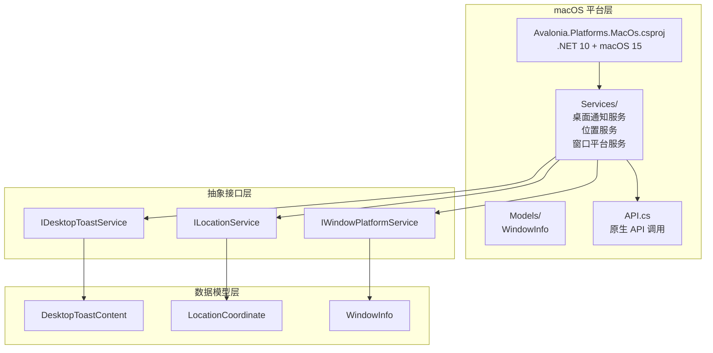
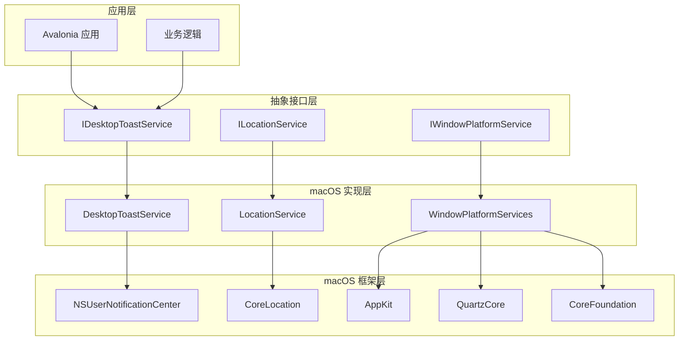
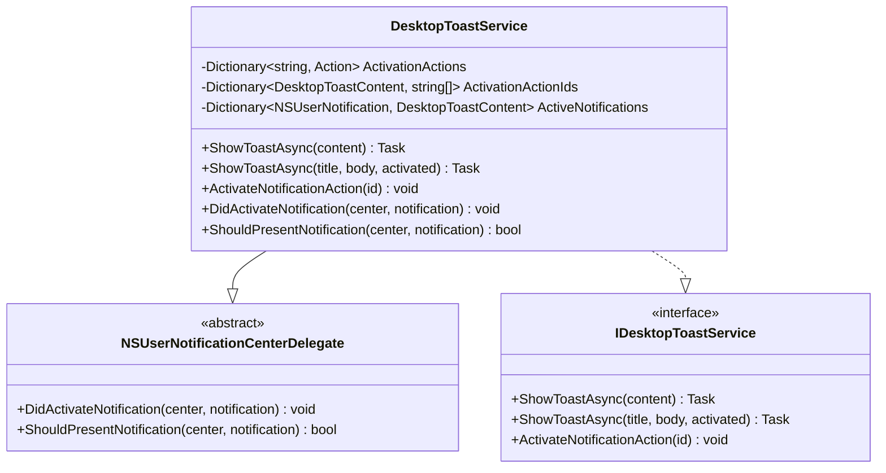
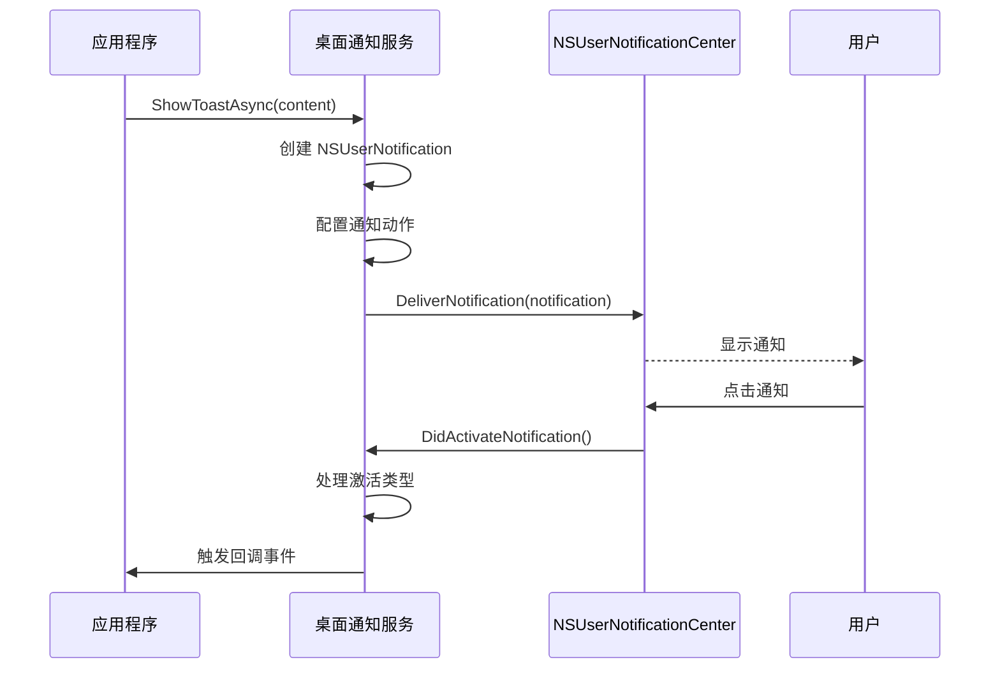
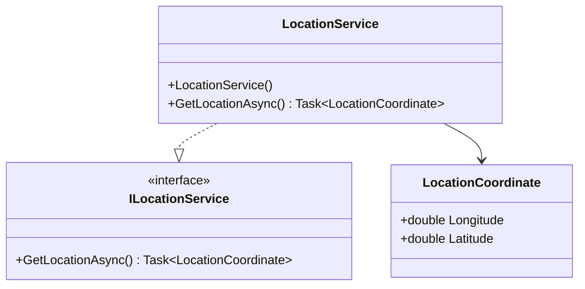
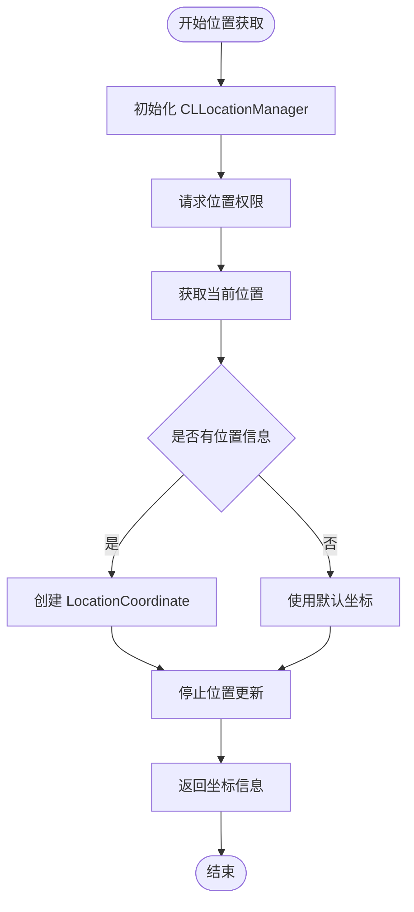
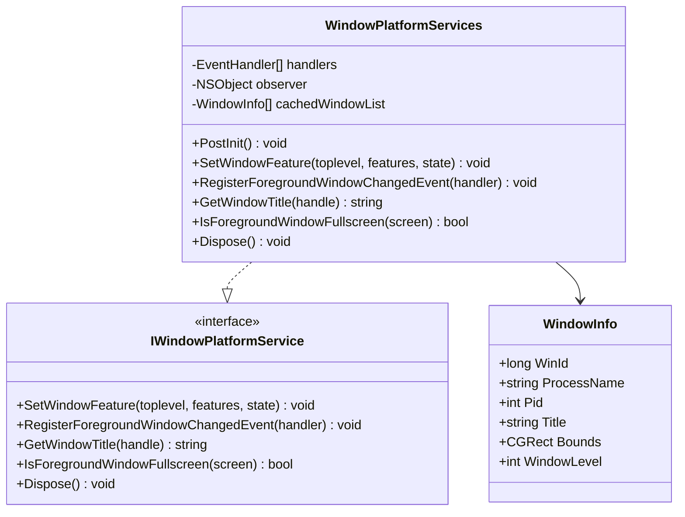
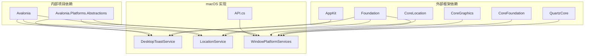

# macOS 平台实现

<cite>
**本文档引用的文件**
- [Avalonia.Platforms.MacOs.csproj](file://src/platforms/Avalonia.Platforms.MacOs/Avalonia.Platforms.MacOs.csproj)
- [API.cs](file://src/platforms/Avalonia.Platforms.MacOs/API.cs)
- [DesktopToastService.cs](file://src/platforms/Avalonia.Platforms.MacOs/Services/DesktopToastService.cs)
- [LocationService.cs](file://src/platforms/Avalonia.Platforms.MacOs/Services/LocationService.cs)
- [WindowPlatformServices.cs](file://src/platforms/Avalonia.Platforms.MacOs/Services/WindowPlatformServices.cs)
- [WindowInfo.cs](file://src/platforms/Avalonia.Platforms.MacOs/Models/WindowInfo.cs)
- [IDesktopToastService.cs](file://src/Avalonia.Platforms.Abstractions/Services/IDesktopToastService.cs)
- [ILocationService.cs](file://src/Avalonia.Platforms.Abstractions/Services/ILocationService.cs)
- [IWindowPlatformService.cs](file://src/Avalonia.Platforms.Abstractions/Services/IWindowPlatformService.cs)
- [DesktopToastContent.cs](file://src/Avalonia.Platforms.Abstractions/Models/DesktopToastContent.cs)
- [LocationCoordinate.cs](file://src/Avalonia.Platforms.Abstractions/Models/LocationCoordinate.cs)
</cite>

## 目录
1. [简介](#简介)
2. [项目结构](#项目结构)
3. [核心组件](#核心组件)
4. [架构概览](#架构概览)
5. [详细组件分析](#详细组件分析)
6. [依赖关系分析](#依赖关系分析)
7. [性能考虑](#性能考虑)
8. [故障排除指南](#故障排除指南)
9. [结论](#结论)

## 简介

本文档详细介绍了 Avalonia 模板项目中 macOS 平台的实现方案。该实现基于 .NET 10 和 macOS 15 目标框架，通过直接调用 macOS 原生 API 来实现桌面通知、位置服务和窗口平台服务的 macOS 特定功能。

项目采用分层架构设计，将平台特定的实现与抽象接口分离，确保了代码的可维护性和可扩展性。核心实现包括：

- **桌面通知服务**：基于 NSUserNotificationCenter 实现的通知系统
- **位置服务**：基于 CoreLocation 框架的位置获取功能  
- **窗口平台服务**：基于 QuartzCore 和 AppKit 的窗口管理功能

## 项目结构

macOS 平台实现位于 `src/platforms/Avalonia.Platforms.MacOs` 目录下，采用清晰的分层组织结构：

**图表来源**
- [Avalonia.Platforms.MacOs.csproj:1-15](file://src/platforms/Avalonia.Platforms.MacOs/Avalonia.Platforms.MacOs.csproj#L1-L15)
- [DesktopToastService.cs:1-114](file://src/platforms/Avalonia.Platforms.MacOs/Services/DesktopToastService.cs#L1-L114)
- [LocationService.cs:1-26](file://src/platforms/Avalonia.Platforms.MacOs/Services/LocationService.cs#L1-L26)
- [WindowPlatformServices.cs:1-261](file://src/platforms/Avalonia.Platforms.MacOs/Services/WindowPlatformServices.cs#L1-L261)

**章节来源**
- [Avalonia.Platforms.MacOs.csproj:1-15](file://src/platforms/Avalonia.Platforms.MacOs/Avalonia.Platforms.MacOs.csproj#L1-L15)

## 核心组件

### 桌面通知服务 (DesktopToastService)

桌面通知服务实现了 `IDesktopToastService` 接口，提供跨平台统一的通知功能。该服务基于 macOS 的 NSUserNotificationCenter 框架实现，支持自定义按钮和激活回调。

主要特性：
- 支持富文本通知（标题、正文、附加动作）
- 自动处理通知激活事件
- 支持异步通知显示
- 完整的通知生命周期管理

### 位置服务 (LocationService)

位置服务实现了 `ILocationService` 接口，提供设备地理位置获取功能。该服务基于 CoreLocation 框架，支持权限请求和位置信息读取。

核心功能：
- 自动请求位置权限
- 异步位置信息获取
- 坐标数据标准化
- 简化的 API 接口

### 窗口平台服务 (WindowPlatformServices)

窗口平台服务实现了 `IWindowPlatformService` 接口，提供全面的窗口管理功能。该服务集成了多个 macOS 框架，包括 AppKit、QuartzCore 和 CoreFoundation。

主要能力：
- 前台窗口跟踪和事件监听
- 窗口属性动态修改
- 屏幕信息检测（全屏、最大化）
- 窗口列表枚举和查询

**章节来源**
- [DesktopToastService.cs:1-114](file://src/platforms/Avalonia.Platforms.MacOs/Services/DesktopToastService.cs#L1-L114)
- [LocationService.cs:1-26](file://src/platforms/Avalonia.Platforms.MacOs/Services/LocationService.cs#L1-L26)
- [WindowPlatformServices.cs:1-261](file://src/platforms/Avalonia.Platforms.MacOs/Services/WindowPlatformServices.cs#L1-L261)

## 架构概览

macOS 平台实现采用了清晰的分层架构，确保了平台特定功能与抽象接口的解耦：

**图表来源**
- [DesktopToastService.cs:7-18](file://src/platforms/Avalonia.Platforms.MacOs/Services/DesktopToastService.cs#L7-L18)
- [LocationService.cs:7-13](file://src/platforms/Avalonia.Platforms.MacOs/Services/LocationService.cs#L7-L13)
- [WindowPlatformServices.cs:15-25](file://src/platforms/Avalonia.Platforms.MacOs/Services/WindowPlatformServices.cs#L15-L25)

## 详细组件分析

### 桌面通知服务实现

桌面通知服务通过继承 `NSUserNotificationCenterDelegate` 类来实现通知系统的完整功能：

**图表来源**
- [DesktopToastService.cs:7-18](file://src/platforms/Avalonia.Platforms.MacOs/Services/DesktopToastService.cs#L7-L18)
- [IDesktopToastService.cs:8-30](file://src/Avalonia.Platforms.Abstractions/Services/IDesktopToastService.cs#L8-L30)

通知服务的核心工作流程：

**图表来源**
- [DesktopToastService.cs:20-94](file://src/platforms/Avalonia.Platforms.MacOs/Services/DesktopToastService.cs#L20-L94)

**章节来源**
- [DesktopToastService.cs:1-114](file://src/platforms/Avalonia.Platforms.MacOs/Services/DesktopToastService.cs#L1-L114)
- [DesktopToastContent.cs:1-42](file://src/Avalonia.Platforms.Abstractions/Models/DesktopToastContent.cs#L1-L42)

### 位置服务实现

位置服务基于 CoreLocation 框架实现，提供了简洁的地理位置获取接口：

**图表来源**
- [LocationService.cs:7-26](file://src/platforms/Avalonia.Platforms.MacOs/Services/LocationService.cs#L7-L26)
- [ILocationService.cs:8-15](file://src/Avalonia.Platforms.Abstractions/Services/ILocationService.cs#L8-L15)
- [LocationCoordinate.cs:6-17](file://src/Avalonia.Platforms.Abstractions/Models/LocationCoordinate.cs#L6-L17)

位置获取的工作流程：

**图表来源**
- [LocationService.cs:15-25](file://src/platforms/Avalonia.Platforms.MacOs/Services/LocationService.cs#L15-L25)

**章节来源**
- [LocationService.cs:1-26](file://src/platforms/Avalonia.Platforms.MacOs/Services/LocationService.cs#L1-L26)
- [LocationCoordinate.cs:1-17](file://src/Avalonia.Platforms.Abstractions/Models/LocationCoordinate.cs#L1-L17)

### 窗口平台服务实现

窗口平台服务是最复杂的组件，集成了多个 macOS 框架来实现全面的窗口管理功能：

**图表来源**
- [WindowPlatformServices.cs:15-25](file://src/platforms/Avalonia.Platforms.MacOs/Services/WindowPlatformServices.cs#L15-L25)
- [IWindowPlatformService.cs:12-106](file://src/Avalonia.Platforms.Abstractions/Services/IWindowPlatformService.cs#L12-L106)
- [WindowInfo.cs:3-21](file://src/platforms/Avalonia.Platforms.MacOs/Models/WindowInfo.cs#L3-L21)

窗口管理的核心功能包括：

1. **前台窗口跟踪**：通过 NSWorkspace 监听应用程序激活事件
2. **窗口信息获取**：使用 QuartzCore API 查询系统窗口列表
3. **窗口属性控制**：动态修改窗口样式和行为
4. **屏幕信息检测**：判断窗口在屏幕上的状态

**章节来源**
- [WindowPlatformServices.cs:1-261](file://src/platforms/Avalonia.Platforms.MacOs/Services/WindowPlatformServices.cs#L1-L261)
- [WindowInfo.cs:1-21](file://src/platforms/Avalonia.Platforms.MacOs/Models/WindowInfo.cs#L1-L21)

## 依赖关系分析

macOS 平台实现的依赖关系展现了清晰的层次结构：

**图表来源**
- [DesktopToastService.cs:1-4](file://src/platforms/Avalonia.Platforms.MacOs/Services/DesktopToastService.cs#L1-L4)
- [LocationService.cs:1-3](file://src/platforms/Avalonia.Platforms.MacOs/Services/LocationService.cs#L1-L3)
- [WindowPlatformServices.cs:1-11](file://src/platforms/Avalonia.Platforms.MacOs/Services/WindowPlatformServices.cs#L1-L11)
- [API.cs:1-16](file://src/platforms/Avalonia.Platforms.MacOs/API.cs#L1-L16)

**章节来源**
- [Avalonia.Platforms.MacOs.csproj:10-13](file://src/platforms/Avalonia.Platforms.MacOs/Avalonia.Platforms.MacOs.csproj#L10-L13)

## 性能考虑

### 内存管理优化

macOS 平台实现特别注意内存泄漏的预防：

1. **CFRelease 调用**：在使用 QuartzCore API 后正确释放 CoreFoundation 对象
2. **观察者清理**：在 Dispose 方法中移除 NSNotificationCenter 观察者
3. **资源及时释放**：使用 `using` 语句确保 CLLocationManager 等对象的及时释放

### 异步操作处理

- **通知服务**：使用异步方法避免 UI 阻塞
- **位置获取**：异步位置查询不阻塞主线程
- **窗口操作**：窗口属性修改采用异步模式

### 缓存策略

- **窗口信息缓存**：缓存窗口列表以减少频繁的系统调用
- **通知状态管理**：维护活动通知的映射关系以提高响应效率

## 故障排除指南

### 常见问题及解决方案

#### 通知权限问题
**症状**：通知无法显示或被系统阻止
**原因**：用户未授予通知权限
**解决方案**：
1. 确保应用程序具有正确的 Info.plist 配置
2. 检查系统偏好设置中的通知权限
3. 重新启动应用程序以重新请求权限

#### 位置权限问题
**症状**：位置获取失败或返回默认值
**原因**：用户拒绝位置权限或设备无定位功能
**解决方案**：
1. 检查 Info.plist 中的 NSLocationWhenInUseUsageDescription
2. 验证系统设置中的位置服务权限
3. 确认设备具备 GPS 或网络定位功能

#### 窗口管理限制
**症状**：无法获取其他应用程序的窗口信息
**原因**：macOS 安全限制防止跨进程窗口访问
**解决方案**：
1. 使用 GetWindowFromHandle 仅获取当前应用程序窗口
2. 通过窗口句柄进行跨进程通信
3. 考虑使用 Accessibility 权限（需要额外配置）

**章节来源**
- [DesktopToastService.cs:15-18](file://src/platforms/Avalonia.Platforms.MacOs/Services/DesktopToastService.cs#L15-L18)
- [LocationService.cs:9-13](file://src/platforms/Avalonia.Platforms.MacOs/Services/LocationService.cs#L9-L13)
- [WindowPlatformServices.cs:27-31](file://src/platforms/Avalonia.Platforms.MacOs/Services/WindowPlatformServices.cs#L27-L31)

## 结论

Avalonia 模板项目的 macOS 平台实现展现了优秀的架构设计和平台集成能力。通过合理利用 macOS 原生 API，该实现成功地将跨平台抽象接口与具体的平台功能相结合。

### 主要优势

1. **清晰的架构分离**：抽象接口与具体实现完全分离
2. **完整的功能覆盖**：涵盖了通知、位置、窗口管理等核心功能
3. **良好的错误处理**：完善的异常处理和资源管理机制
4. **性能优化考虑**：内存管理和异步操作的合理运用

### 技术亮点

- **原生 API 集成**：直接调用 QuartzCore、CoreLocation、AppKit 等框架
- **内存安全**：严格的资源管理和 CFRelease 调用
- **用户体验**：异步操作确保 UI 流畅性
- **扩展性**：模块化设计便于功能扩展

该实现为其他跨平台项目提供了优秀的 macOS 集成参考，展示了如何在保持跨平台特性的同时充分利用平台特定的功能。