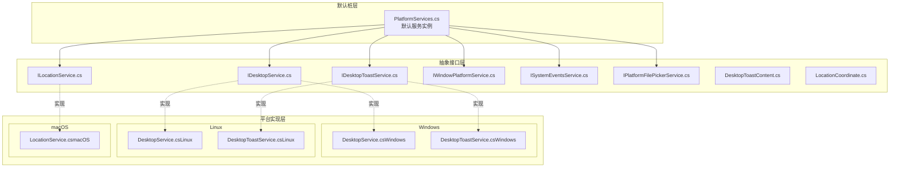
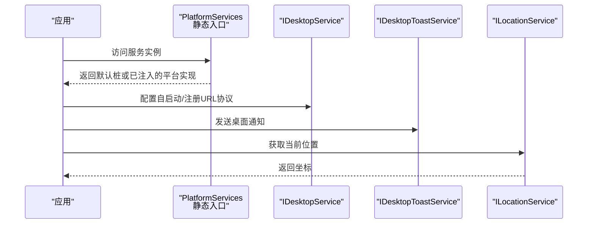
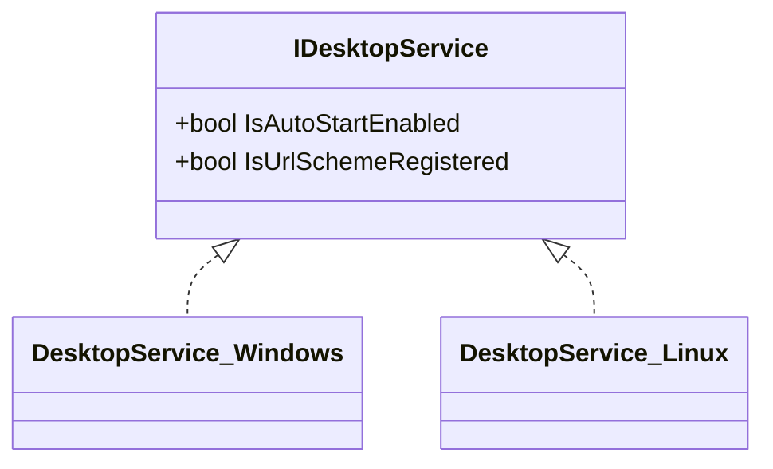
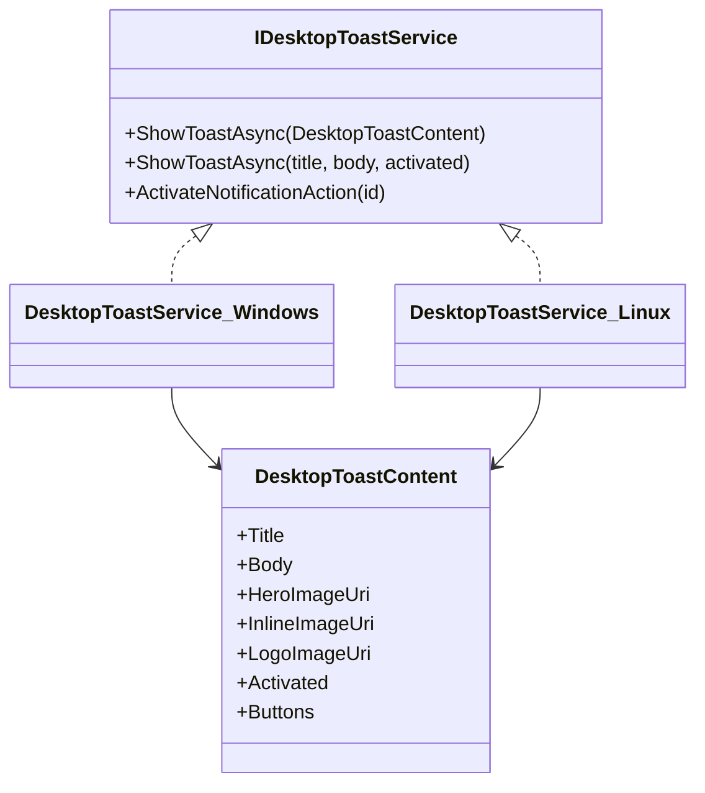
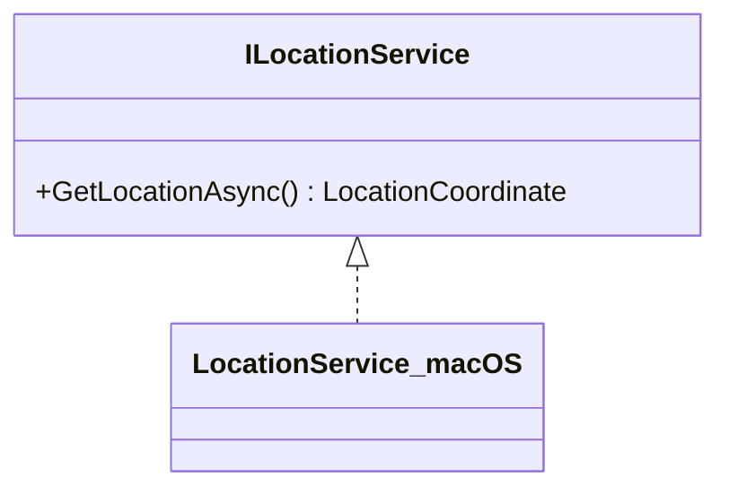
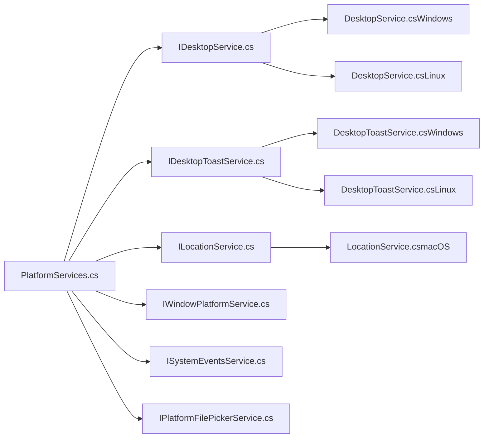

# 平台抽象层

<cite>
**本文引用的文件**
- [PlatformServices.cs](file://src/Avalonia.Platforms.Abstractions/PlatformServices.cs)
- [IDesktopService.cs](file://src/Avalonia.Platforms.Abstractions/Services/IDesktopService.cs)
- [IDesktopToastService.cs](file://src/Avalonia.Platforms.Abstractions/Services/IDesktopToastService.cs)
- [ILocationService.cs](file://src/Avalonia.Platforms.Abstractions/Services/ILocationService.cs)
- [IWindowPlatformService.cs](file://src/Avalonia.Platforms.Abstractions/Services/IWindowPlatformService.cs)
- [ISystemEventsService.cs](file://src/Avalonia.Platforms.Abstractions/Services/ISystemEventsService.cs)
- [IPlatformFilePickerService.cs](file://src/Avalonia.Platforms.Abstractions/Services/IPlatformFilePickerService.cs)
- [DesktopToastContent.cs](file://src/Avalonia.Platforms.Abstractions/Models/DesktopToastContent.cs)
- [LocationCoordinate.cs](file://src/Avalonia.Platforms.Abstractions/Models/LocationCoordinate.cs)
- [DesktopService.cs（Windows）](file://src/platforms/Avalonia.Platforms.Windows/Services/DesktopService.cs)
- [DesktopToastService.cs（Windows）](file://src/platforms/Avalonia.Platforms.Windows/Services/DesktopToastService.cs)
- [DesktopService.cs（Linux）](file://src/platforms/Avalonia.Platforms.Linux/Services/DesktopService.cs)
- [DesktopToastService.cs（Linux）](file://src/platforms/Avalonia.Platforms.Linux/Services/DesktopToastService.cs)
- [LocationService.cs（macOS）](file://src/platforms/Avalonia.Platforms.MacOs/Services/LocationService.cs)
</cite>

## 目录
1. [简介](#简介)
2. [项目结构](#项目结构)
3. [核心组件](#核心组件)
4. [架构总览](#架构总览)
5. [详细组件分析](#详细组件分析)
6. [依赖关系分析](#依赖关系分析)
7. [性能考量](#性能考量)
8. [故障排查指南](#故障排查指南)
9. [结论](#结论)
10. [附录](#附录)

## 简介
本文件系统性梳理 AvaloniaTemplate 的“平台抽象层”，聚焦于如何通过统一接口屏蔽 Windows、Linux、macOS 的平台差异，确保上层应用以一致的方式调用桌面服务、通知服务、位置服务与窗口平台能力。文档从设计理念、接口定义、平台实现差异、数据流与控制流、错误处理与性能优化等方面展开，并给出扩展新平台的指导与最佳实践。

## 项目结构
平台抽象层由“抽象接口 + 默认桩 + 平台实现”三层构成：
- 抽象接口层：定义跨平台统一的服务契约（如桌面服务、通知服务、位置服务、窗口平台服务、系统事件服务、文件选择器服务）。
- 默认桩层：提供默认空实现或占位实现，保障在未注入具体平台实现时仍可运行。
- 平台实现层：针对 Windows、Linux、macOS 分别实现上述接口，完成平台特定功能封装。

图表来源
- [PlatformServices.cs:1-45](file://src/Avalonia.Platforms.Abstractions/PlatformServices.cs#L1-L45)
- [IDesktopService.cs:1-17](file://src/Avalonia.Platforms.Abstractions/Services/IDesktopService.cs#L1-L17)
- [IDesktopToastService.cs:1-30](file://src/Avalonia.Platforms.Abstractions/Services/IDesktopToastService.cs#L1-L30)
- [ILocationService.cs:1-15](file://src/Avalonia.Platforms.Abstractions/Services/ILocationService.cs#L1-L15)
- [IWindowPlatformService.cs:1-106](file://src/Avalonia.Platforms.Abstractions/Services/IWindowPlatformService.cs#L1-L106)
- [ISystemEventsService.cs:1-12](file://src/Avalonia.Platforms.Abstractions/Services/ISystemEventsService.cs#L1-L12)
- [IPlatformFilePickerService.cs:1-35](file://src/Avalonia.Platforms.Abstractions/Services/IPlatformFilePickerService.cs#L1-L35)
- [DesktopToastContent.cs:1-42](file://src/Avalonia.Platforms.Abstractions/Models/DesktopToastContent.cs#L1-L42)
- [LocationCoordinate.cs:1-17](file://src/Avalonia.Platforms.Abstractions/Models/LocationCoordinate.cs#L1-L17)
- [DesktopService.cs（Windows）:1-45](file://src/platforms/Avalonia.Platforms.Windows/Services/DesktopService.cs#L1-L45)
- [DesktopToastService.cs（Windows）:1-161](file://src/platforms/Avalonia.Platforms.Windows/Services/DesktopToastService.cs#L1-L161)
- [DesktopService.cs（Linux）:1-45](file://src/platforms/Avalonia.Platforms.Linux/Services/DesktopService.cs#L1-L45)
- [DesktopToastService.cs（Linux）:1-246](file://src/platforms/Avalonia.Platforms.Linux/Services/DesktopToastService.cs#L1-L246)
- [LocationService.cs（macOS）:1-26](file://src/platforms/Avalonia.Platforms.MacOs/Services/LocationService.cs#L1-L26)

章节来源
- [PlatformServices.cs:1-45](file://src/Avalonia.Platforms.Abstractions/PlatformServices.cs#L1-L45)

## 核心组件
- 平台服务入口：通过静态类集中暴露各平台服务实例，便于全局访问与替换。
- 抽象接口族：定义桌面、通知、位置、窗口平台、系统事件、文件选择器等统一契约。
- 数据模型：通知内容与位置坐标作为跨平台数据载体，承载平台间传递的信息。

章节来源
- [PlatformServices.cs:9-45](file://src/Avalonia.Platforms.Abstractions/PlatformServices.cs#L9-L45)
- [IDesktopService.cs:6-17](file://src/Avalonia.Platforms.Abstractions/Services/IDesktopService.cs#L6-L17)
- [IDesktopToastService.cs:8-30](file://src/Avalonia.Platforms.Abstractions/Services/IDesktopToastService.cs#L8-L30)
- [ILocationService.cs:8-15](file://src/Avalonia.Platforms.Abstractions/Services/ILocationService.cs#L8-L15)
- [IWindowPlatformService.cs:12-106](file://src/Avalonia.Platforms.Abstractions/Services/IWindowPlatformService.cs#L12-L106)
- [ISystemEventsService.cs:6-12](file://src/Avalonia.Platforms.Abstractions/Services/ISystemEventsService.cs#L6-L12)
- [IPlatformFilePickerService.cs:9-35](file://src/Avalonia.Platforms.Abstractions/Services/IPlatformFilePickerService.cs#L9-L35)
- [DesktopToastContent.cs:6-42](file://src/Avalonia.Platforms.Abstractions/Models/DesktopToastContent.cs#L6-L42)
- [LocationCoordinate.cs:6-17](file://src/Avalonia.Platforms.Abstractions/Models/LocationCoordinate.cs#L6-L17)

## 架构总览
平台抽象层采用“静态入口 + 接口契约 + 平台实现”的分层设计。默认桩提供兜底能力；平台实现按需替换默认实例，从而实现跨平台兼容。

图表来源
- [PlatformServices.cs:9-45](file://src/Avalonia.Platforms.Abstractions/PlatformServices.cs#L9-L45)
- [IDesktopService.cs:6-17](file://src/Avalonia.Platforms.Abstractions/Services/IDesktopService.cs#L6-L17)
- [IDesktopToastService.cs:8-30](file://src/Avalonia.Platforms.Abstractions/Services/IDesktopToastService.cs#L8-L30)
- [ILocationService.cs:8-15](file://src/Avalonia.Platforms.Abstractions/Services/ILocationService.cs#L8-L15)

## 详细组件分析

### 平台服务入口与默认桩
- 设计要点
  - 通过静态属性集中暴露各服务实例，便于全局访问。
  - 默认值均为对应桩实现，避免空引用。
  - 提供能力探测字段（如定位服务可用性），辅助上层条件化逻辑。
- 使用建议
  - 应用启动时优先注入平台实现；若未注入，默认桩可保证运行。
  - 对可选能力（如定位）应先判断可用性再调用。

章节来源
- [PlatformServices.cs:9-45](file://src/Avalonia.Platforms.Abstractions/PlatformServices.cs#L9-L45)

### 桌面服务（IDesktopService）
- 职责
  - 管理应用自启动能力。
  - 管理 URL 协议注册状态。
- 平台差异
  - Windows：通过快捷方式与注册表实现自启动与协议注册。
  - Linux：遵循 Freedesktop 自启动规范，写入用户目录配置；URL 协议注册默认不支持。
  - macOS：该接口在抽象层存在，但当前仓库未提供具体实现文件，属于“预留接口”。

图表来源
- [IDesktopService.cs:6-17](file://src/Avalonia.Platforms.Abstractions/Services/IDesktopService.cs#L6-L17)
- [DesktopService.cs（Windows）:8-45](file://src/platforms/Avalonia.Platforms.Windows/Services/DesktopService.cs#L8-L45)
- [DesktopService.cs（Linux）:8-45](file://src/platforms/Avalonia.Platforms.Linux/Services/DesktopService.cs#L8-L45)

章节来源
- [IDesktopService.cs:6-17](file://src/Avalonia.Platforms.Abstractions/Services/IDesktopService.cs#L6-L17)
- [DesktopService.cs（Windows）:8-45](file://src/platforms/Avalonia.Platforms.Windows/Services/DesktopService.cs#L8-L45)
- [DesktopService.cs（Linux）:8-45](file://src/platforms/Avalonia.Platforms.Linux/Services/DesktopService.cs#L8-L45)

### 桌面通知服务（IDesktopToastService）
- 职责
  - 异步显示桌面通知（支持标题、正文、图片、按钮与激活回调）。
  - 支持按内容或标题+正文两种调用形式。
  - 提供通知激活动作的统一处理入口。
- 平台差异
  - Windows：基于 Microsoft.Toolkit.Uwp.Notifications 构建 Toast XML，兼容多版本系统行为。
  - Linux：通过 DBus freedesktop 通知协议发送通知，支持按钮与关闭事件监听。
- 数据模型
  - 通知内容对象包含标题、正文、图片 URI、激活事件与按钮字典。

图表来源
- [IDesktopToastService.cs:8-30](file://src/Avalonia.Platforms.Abstractions/Services/IDesktopToastService.cs#L8-L30)
- [DesktopToastService.cs（Windows）:21-161](file://src/platforms/Avalonia.Platforms.Windows/Services/DesktopToastService.cs#L21-L161)
- [DesktopToastService.cs（Linux）:12-246](file://src/platforms/Avalonia.Platforms.Linux/Services/DesktopToastService.cs#L12-L246)
- [DesktopToastContent.cs:6-42](file://src/Avalonia.Platforms.Abstractions/Models/DesktopToastContent.cs#L6-L42)

章节来源
- [IDesktopToastService.cs:8-30](file://src/Avalonia.Platforms.Abstractions/Services/IDesktopToastService.cs#L8-L30)
- [DesktopToastService.cs（Windows）:27-100](file://src/platforms/Avalonia.Platforms.Windows/Services/DesktopToastService.cs#L27-L100)
- [DesktopToastService.cs（Linux）:147-201](file://src/platforms/Avalonia.Platforms.Linux/Services/DesktopToastService.cs#L147-L201)
- [DesktopToastContent.cs:6-42](file://src/Avalonia.Platforms.Abstractions/Models/DesktopToastContent.cs#L6-L42)

### 位置服务（ILocationService）
- 职责
  - 异步获取设备当前地理坐标。
- 平台差异
  - macOS：通过 CoreLocation 请求授权并读取坐标。
  - Windows/Linux：抽象接口存在，但当前仓库未提供对应实现文件，属于“预留接口”。

图表来源
- [ILocationService.cs:8-15](file://src/Avalonia.Platforms.Abstractions/Services/ILocationService.cs#L8-L15)
- [LocationService.cs（macOS）:7-26](file://src/platforms/Avalonia.Platforms.MacOs/Services/LocationService.cs#L7-L26)

章节来源
- [ILocationService.cs:8-15](file://src/Avalonia.Platforms.Abstractions/Services/ILocationService.cs#L8-L15)
- [LocationService.cs（macOS）:15-25](file://src/platforms/Avalonia.Platforms.MacOs/Services/LocationService.cs#L15-L25)

### 窗口平台服务（IWindowPlatformService）
- 职责
  - 设置/查询窗口特性（如圆角、阴影等）。
  - 前台窗口变更事件注册/注销。
  - 查询窗口标题、类名、最大化/最小化/全屏状态。
  - 获取鼠标位置、前台窗口句柄、窗口进程 ID。
  - 强制重绘目标窗口。
- 设计意义
  - 将平台差异封装在接口背后，上层仅依赖抽象，避免直接调用平台 API。

章节来源
- [IWindowPlatformService.cs:12-106](file://src/Avalonia.Platforms.Abstractions/Services/IWindowPlatformService.cs#L12-L106)

### 系统事件服务（ISystemEventsService）
- 职责
  - 暴露系统时间变化事件，供订阅者响应。

章节来源
- [ISystemEventsService.cs:6-12](file://src/Avalonia.Platforms.Abstractions/Services/ISystemEventsService.cs#L6-L12)

### 平台文件选择器服务（IPlatformFilePickerService）
- 职责
  - 提供打开/保存文件与打开文件夹的选择器异步接口，接收 Avalonia 标准选项与根窗口上下文。

章节来源
- [IPlatformFilePickerService.cs:9-35](file://src/Avalonia.Platforms.Abstractions/Services/IPlatformFilePickerService.cs#L9-L35)

### 数据模型
- DesktopToastContent：承载通知标题、正文、图片与按钮等信息。
- LocationCoordinate：承载经纬度坐标。

章节来源
- [DesktopToastContent.cs:6-42](file://src/Avalonia.Platforms.Abstractions/Models/DesktopToastContent.cs#L6-L42)
- [LocationCoordinate.cs:6-17](file://src/Avalonia.Platforms.Abstractions/Models/LocationCoordinate.cs#L6-L17)

## 依赖关系分析
- 抽象接口与默认桩
  - PlatformServices 聚合各服务接口，提供默认桩实例，形成“可替换的单例容器”。
- 平台实现
  - Windows/Linux/macOS 分别实现 IDesktopService、IDesktopToastService、ILocationService 等接口。
- 数据模型
  - 通知内容与位置坐标作为跨层数据载体，被多个平台实现复用。

图表来源
- [PlatformServices.cs:9-45](file://src/Avalonia.Platforms.Abstractions/PlatformServices.cs#L9-L45)
- [IDesktopService.cs:6-17](file://src/Avalonia.Platforms.Abstractions/Services/IDesktopService.cs#L6-L17)
- [IDesktopToastService.cs:8-30](file://src/Avalonia.Platforms.Abstractions/Services/IDesktopToastService.cs#L8-L30)
- [ILocationService.cs:8-15](file://src/Avalonia.Platforms.Abstractions/Services/ILocationService.cs#L8-L15)
- [IWindowPlatformService.cs:12-106](file://src/Avalonia.Platforms.Abstractions/Services/IWindowPlatformService.cs#L12-L106)
- [ISystemEventsService.cs:6-12](file://src/Avalonia.Platforms.Abstractions/Services/ISystemEventsService.cs#L6-L12)
- [IPlatformFilePickerService.cs:9-35](file://src/Avalonia.Platforms.Abstractions/Services/IPlatformFilePickerService.cs#L9-L35)
- [DesktopService.cs（Windows）:8-45](file://src/platforms/Avalonia.Platforms.Windows/Services/DesktopService.cs#L8-L45)
- [DesktopService.cs（Linux）:8-45](file://src/platforms/Avalonia.Platforms.Linux/Services/DesktopService.cs#L8-L45)
- [DesktopToastService.cs（Windows）:21-161](file://src/platforms/Avalonia.Platforms.Windows/Services/DesktopToastService.cs#L21-L161)
- [DesktopToastService.cs（Linux）:12-246](file://src/platforms/Avalonia.Platforms.Linux/Services/DesktopToastService.cs#L12-L246)
- [LocationService.cs（macOS）:7-26](file://src/platforms/Avalonia.Platforms.MacOs/Services/LocationService.cs#L7-L26)

## 性能考量
- 通知资源处理
  - Windows/Linux 均对 avares/http(s) 图片进行本地缓存（临时文件），避免重复下载与 IO 开销。
  - 建议：控制图片尺寸与数量，及时清理临时文件，降低磁盘压力。
- 通知生命周期管理
  - Windows/Linux 实现均在激活/关闭/失败后清理按钮动作映射，防止内存泄漏。
  - 建议：上层避免频繁创建大量一次性通知，合理复用通知模板。
- 位置服务
  - macOS 实现中请求一次位置后即停止更新，避免持续占用资源。
  - 建议：上层按需调用，避免高频轮询。
- 文件选择器
  - 采用异步接口，避免阻塞 UI 线程。
  - 建议：在长耗时场景提供取消与进度反馈。

## 故障排查指南
- 通知无法显示
  - Windows：检查系统版本与通知兼容性，确认 AUMID 与图标资源可用。
  - Linux：确认 DBus 会话连接正常，freedesktop 能力支持（如 body-images）。
- 自启动/协议注册失败
  - Windows：确认快捷方式创建与注册表写入权限。
  - Linux：确认 ~/.config/autostart 目录可写，无权限异常日志。
- 位置权限被拒绝
  - macOS：确认已弹出授权对话框且用户允许“使用期间”访问。
- 事件回调未触发
  - 检查平台实现中的事件订阅与 UI 线程调度是否正确。

章节来源
- [DesktopToastService.cs（Windows）:75-89](file://src/platforms/Avalonia.Platforms.Windows/Services/DesktopToastService.cs#L75-L89)
- [DesktopToastService.cs（Linux）:39-61](file://src/platforms/Avalonia.Platforms.Linux/Services/DesktopToastService.cs#L39-L61)
- [DesktopService.cs（Windows）:12-28](file://src/platforms/Avalonia.Platforms.Windows/Services/DesktopService.cs#L12-L28)
- [DesktopService.cs（Linux）:17-37](file://src/platforms/Avalonia.Platforms.Linux/Services/DesktopService.cs#L17-L37)
- [LocationService.cs（macOS）:9-13](file://src/platforms/Avalonia.Platforms.MacOs/Services/LocationService.cs#L9-L13)

## 结论
平台抽象层通过清晰的接口契约与默认桩机制，有效屏蔽了 Windows、Linux、macOS 的平台差异，使上层应用以统一方式调用桌面、通知、位置与窗口平台能力。当前仓库已覆盖 Windows 与 Linux 的桌面与通知实现，macOS 提供位置服务实现；其余接口在 Windows/Linux 上为预留实现。后续扩展新平台时，只需实现对应接口并替换默认桩即可。

## 附录

### 平台实现差异与适配策略
- 桌面服务
  - Windows：使用快捷方式与注册表实现自启动与协议注册。
  - Linux：遵循 Freedesktop 规范，写入 autostart 目录；协议注册默认不可用。
- 桌面通知
  - Windows：基于 Microsoft.Toolkit.Uwp.Notifications 构建 Toast XML，兼容多版本系统。
  - Linux：通过 DBus freedesktop 协议发送通知，支持按钮与关闭事件。
- 位置服务
  - macOS：通过 CoreLocation 请求授权并读取坐标。
  - Windows/Linux：接口存在但当前仓库未提供实现，可按需扩展。

章节来源
- [DesktopService.cs（Windows）:8-45](file://src/platforms/Avalonia.Platforms.Windows/Services/DesktopService.cs#L8-L45)
- [DesktopToastService.cs（Windows）:21-161](file://src/platforms/Avalonia.Platforms.Windows/Services/DesktopToastService.cs#L21-L161)
- [DesktopService.cs（Linux）:8-45](file://src/platforms/Avalonia.Platforms.Linux/Services/DesktopService.cs#L8-L45)
- [DesktopToastService.cs（Linux）:12-246](file://src/platforms/Avalonia.Platforms.Linux/Services/DesktopToastService.cs#L12-L246)
- [LocationService.cs（macOS）:7-26](file://src/platforms/Avalonia.Platforms.MacOs/Services/LocationService.cs#L7-L26)

### 扩展新平台支持的步骤与最佳实践
- 步骤
  - 新建平台项目，实现抽象接口（如 IDesktopService、IDesktopToastService、ILocationService 等）。
  - 在平台初始化阶段，将实现类赋值给 PlatformServices 对应静态属性。
  - 编写单元测试与集成测试，验证关键流程（通知、位置、自启动）。
- 最佳实践
  - 保持接口不变，仅在平台实现中引入平台特定依赖。
  - 对外部资源（网络图片、系统 API）做好异常捕获与降级处理。
  - 注意线程模型与 UI 线程调度，避免阻塞。
  - 对敏感权限（位置）遵循最小授权原则，提供明确的用户引导。