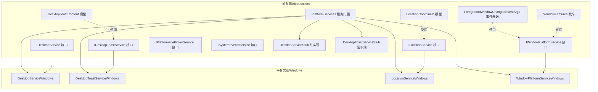
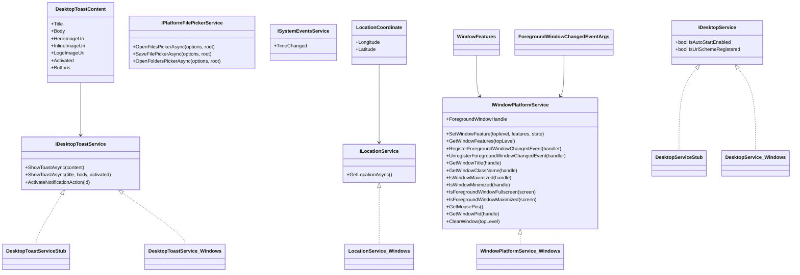
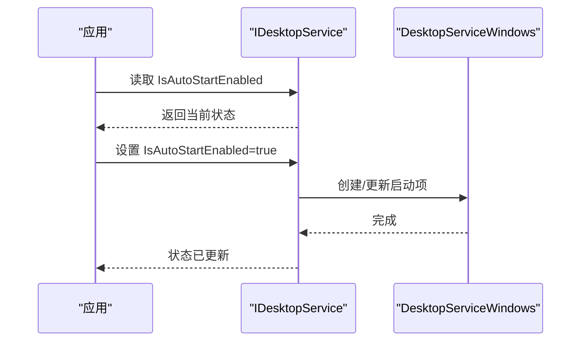
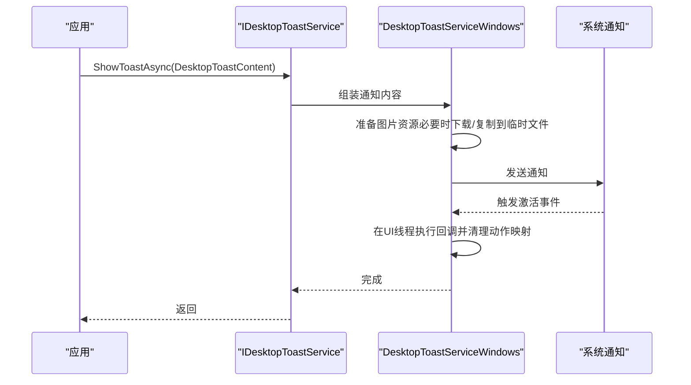
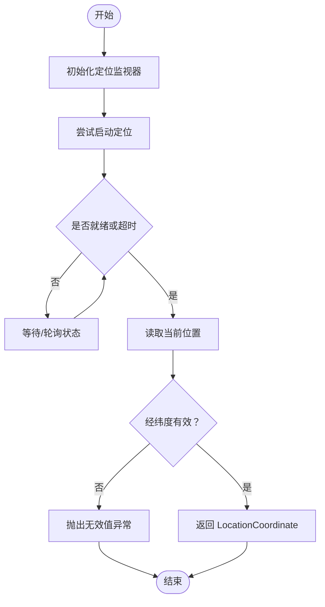
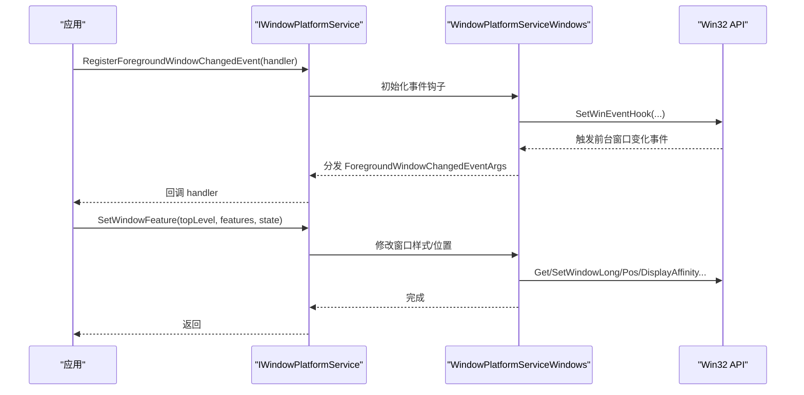
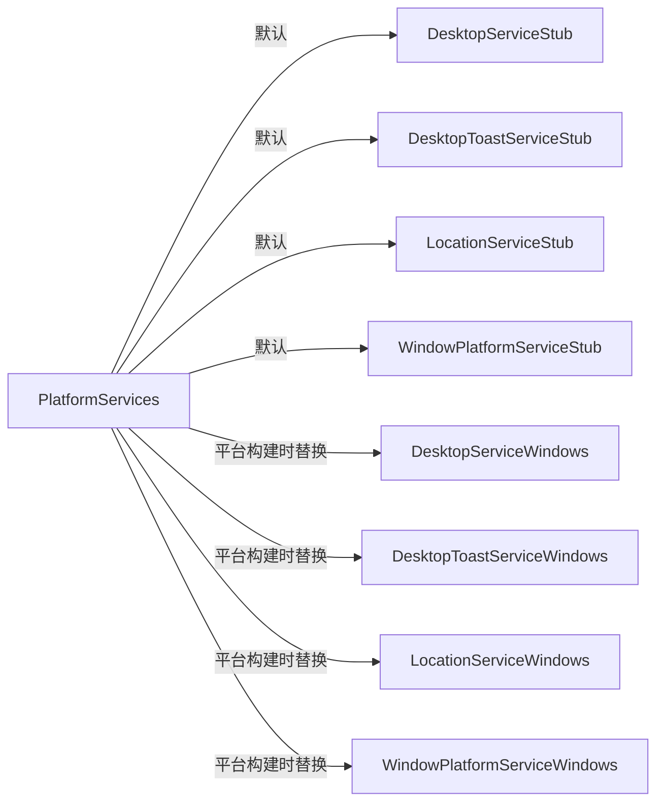

# 平台抽象设计

<cite>
**本文引用的文件**
- [IDesktopService.cs](file://src/Avalonia.Platforms.Abstractions/Services/IDesktopService.cs)
- [IDesktopToastService.cs](file://src/Avalonia.Platforms.Abstractions/Services/IDesktopToastService.cs)
- [ILocationService.cs](file://src/Avalonia.Platforms.Abstractions/Services/ILocationService.cs)
- [IPlatformFilePickerService.cs](file://src/Avalonia.Platforms.Abstractions/Services/IPlatformFilePickerService.cs)
- [ISystemEventsService.cs](file://src/Avalonia.Platforms.Abstractions/Services/ISystemEventsService.cs)
- [IWindowPlatformService.cs](file://src/Avalonia.Platforms.Abstractions/Services/IWindowPlatformService.cs)
- [DesktopToastContent.cs](file://src/Avalonia.Platforms.Abstractions/Models/DesktopToastContent.cs)
- [LocationCoordinate.cs](file://src/Avalonia.Platforms.Abstractions/Models/LocationCoordinate.cs)
- [WindowFeatures.cs](file://src/Avalonia.Platforms.Abstractions/Enums/WindowFeatures.cs)
- [ForegroundWindowChangedEventArgs.cs](file://src/Avalonia.Platforms.Abstractions/Models/ForegroundWindowChangedEventArgs.cs)
- [DesktopServiceStub.cs](file://src/Avalonia.Platforms.Abstractions/Stubs/Services/DesktopServiceStub.cs)
- [DesktopToastServiceStub.cs](file://src/Avalonia.Platforms.Abstractions/Stubs/Services/DesktopToastServiceStub.cs)
- [PlatformServices.cs](file://src/Avalonia.Platforms.Abstractions/PlatformServices.cs)
- [DesktopService.cs（Windows）](file://src/platforms/Avalonia.Platforms.Windows/Services/DesktopService.cs)
- [DesktopToastService.cs（Windows）](file://src/platforms/Avalonia.Platforms.Windows/Services/DesktopToastService.cs)
- [LocationService.cs（Windows）](file://src/platforms/Avalonia.Platforms.Windows/Services/LocationService.cs)
- [WindowPlatformService.cs（Windows）](file://src/platforms/Avalonia.Platforms.Windows/Services/WindowPlatformService.cs)
</cite>

## 目录
1. [引言](#引言)
2. [项目结构](#项目结构)
3. [核心组件](#核心组件)
4. [架构总览](#架构总览)
5. [详细组件分析](#详细组件分析)
6. [依赖关系分析](#依赖关系分析)
7. [性能考量](#性能考量)
8. [故障排查指南](#故障排查指南)
9. [结论](#结论)
10. [附录：扩展与最佳实践](#附录扩展与最佳实践)

## 引言
本文件系统性阐述平台抽象层的设计理念与实现方式，重点说明如何通过统一接口屏蔽底层平台差异，确保上层应用在不同操作系统（如 Windows、macOS、Linux）中保持一致的行为与体验。文档围绕核心抽象接口（如 IDesktopService、IDesktopToastService、ILocationService、IWindowPlatformService 等）进行职责拆分与使用场景说明，并结合现有 Windows 实现展示如何在具体平台上落地。同时，文档给出平台扩展接口的设计指导与最佳实践，帮助开发者正确实现新的平台适配器。

## 项目结构
平台抽象层由“抽象接口 + 数据模型 + 服务门面 + 平台实现”四部分组成：
- 抽象接口：位于 Abstractions 层，定义跨平台能力契约
- 数据模型：位于 Abstractions 层 Models，承载跨平台的数据结构
- 服务门面：PlatformServices 提供静态入口，负责注入默认桩实现或平台实现
- 平台实现：位于 platforms 下各平台子项目，按需实现抽象接口

图表来源
- [PlatformServices.cs:1-45](file://src/Avalonia.Platforms.Abstractions/PlatformServices.cs#L1-L45)
- [IDesktopService.cs:1-17](file://src/Avalonia.Platforms.Abstractions/Services/IDesktopService.cs#L1-L17)
- [IDesktopToastService.cs:1-30](file://src/Avalonia.Platforms.Abstractions/Services/IDesktopToastService.cs#L1-L30)
- [ILocationService.cs:1-15](file://src/Avalonia.Platforms.Abstractions/Services/ILocationService.cs#L1-L15)
- [IWindowPlatformService.cs:1-106](file://src/Avalonia.Platforms.Abstractions/Services/IWindowPlatformService.cs#L1-L106)
- [IPlatformFilePickerService.cs:1-35](file://src/Avalonia.Platforms.Abstractions/Services/IPlatformFilePickerService.cs#L1-L35)
- [ISystemEventsService.cs:1-12](file://src/Avalonia.Platforms.Abstractions/Services/ISystemEventsService.cs#L1-L12)
- [DesktopToastContent.cs:1-42](file://src/Avalonia.Platforms.Abstractions/Models/DesktopToastContent.cs#L1-L42)
- [LocationCoordinate.cs:1-17](file://src/Avalonia.Platforms.Abstractions/Models/LocationCoordinate.cs#L1-L17)
- [WindowFeatures.cs:1-37](file://src/Avalonia.Platforms.Abstractions/Enums/WindowFeatures.cs#L1-L37)
- [ForegroundWindowChangedEventArgs.cs:1-21](file://src/Avalonia.Platforms.Abstractions/Models/ForegroundWindowChangedEventArgs.cs#L1-L21)
- [DesktopServiceStub.cs:1-20](file://src/Avalonia.Platforms.Abstractions/Stubs/Services/DesktopServiceStub.cs#L1-L20)
- [DesktopToastServiceStub.cs:1-23](file://src/Avalonia.Platforms.Abstractions/Stubs/Services/DesktopToastServiceStub.cs#L1-L23)
- [DesktopService.cs（Windows）:1-45](file://src/platforms/Avalonia.Platforms.Windows/Services/DesktopService.cs#L1-L45)
- [DesktopToastService.cs（Windows）:1-161](file://src/platforms/Avalonia.Platforms.Windows/Services/DesktopToastService.cs#L1-L161)
- [LocationService.cs（Windows）:1-42](file://src/platforms/Avalonia.Platforms.Windows/Services/LocationService.cs#L1-L42)
- [WindowPlatformService.cs（Windows）:1-310](file://src/platforms/Avalonia.Platforms.Windows/Services/WindowPlatformService.cs#L1-L310)

章节来源
- [PlatformServices.cs:1-45](file://src/Avalonia.Platforms.Abstractions/PlatformServices.cs#L1-L45)

## 核心组件
本节聚焦于平台抽象层的核心接口与数据模型，说明其职责边界与典型使用场景。

- IDesktopService：封装桌面级能力，如开机自启动与 URL 协议注册状态的查询与设置。适合需要与系统启动项或协议处理交互的应用。
- IDesktopToastService：提供桌面通知能力，支持以内容对象或标题/正文形式显示通知，并可处理通知激活动作。适合消息提醒、任务完成反馈等场景。
- ILocationService：提供地理定位能力，返回当前位置坐标。适合需要基于用户位置提供功能的应用。
- IWindowPlatformService：提供窗口平台能力，包含窗口特性设置、前台窗口变更事件、窗口属性查询、鼠标位置与进程 ID 查询、强制重绘等。适合需要窗口行为控制与系统窗口交互的高级场景。
- IPlatformFilePickerService：提供文件/文件夹选择器能力，面向 TopLevel 根窗口，返回选择结果。适合需要从系统文件对话框选择资源的场景。
- ISystemEventsService：提供系统事件订阅能力，如系统时间变化事件。适合需要响应系统环境变化的场景。
- 数据模型与枚举：
  - DesktopToastContent：封装通知标题、正文、图片、按钮与激活回调
  - LocationCoordinate：封装经纬度
  - WindowFeatures：窗口特性位标志集合（穿透、置底/置顶、隐私、工具窗口、跳过窗口管理）
  - ForegroundWindowChangedEventArgs：前台窗口变更事件参数

章节来源
- [IDesktopService.cs:1-17](file://src/Avalonia.Platforms.Abstractions/Services/IDesktopService.cs#L1-L17)
- [IDesktopToastService.cs:1-30](file://src/Avalonia.Platforms.Abstractions/Services/IDesktopToastService.cs#L1-L30)
- [ILocationService.cs:1-15](file://src/Avalonia.Platforms.Abstractions/Services/ILocationService.cs#L1-L15)
- [IWindowPlatformService.cs:1-106](file://src/Avalonia.Platforms.Abstractions/Services/IWindowPlatformService.cs#L1-L106)
- [IPlatformFilePickerService.cs:1-35](file://src/Avalonia.Platforms.Abstractions/Services/IPlatformFilePickerService.cs#L1-L35)
- [ISystemEventsService.cs:1-12](file://src/Avalonia.Platforms.Abstractions/Services/ISystemEventsService.cs#L1-L12)
- [DesktopToastContent.cs:1-42](file://src/Avalonia.Platforms.Abstractions/Models/DesktopToastContent.cs#L1-L42)
- [LocationCoordinate.cs:1-17](file://src/Avalonia.Platforms.Abstractions/Models/LocationCoordinate.cs#L1-L17)
- [WindowFeatures.cs:1-37](file://src/Avalonia.Platforms.Abstractions/Enums/WindowFeatures.cs#L1-L37)
- [ForegroundWindowChangedEventArgs.cs:1-21](file://src/Avalonia.Platforms.Abstractions/Models/ForegroundWindowChangedEventArgs.cs#L1-L21)

## 架构总览
平台抽象层采用“接口契约 + 服务门面 + 平台实现”的分层架构：
- 抽象接口定义能力边界，确保上层不直接依赖平台细节
- 服务门面 PlatformServices 提供静态访问点，默认注入桩实现；在具体平台构建时替换为真实实现
- 平台实现按需覆盖接口，屏蔽底层 API 差异（如 Windows 的 Win32 API、macOS 的 Core Location、Linux 的 D-Bus）

图表来源
- [IDesktopService.cs:1-17](file://src/Avalonia.Platforms.Abstractions/Services/IDesktopService.cs#L1-L17)
- [IDesktopToastService.cs:1-30](file://src/Avalonia.Platforms.Abstractions/Services/IDesktopToastService.cs#L1-L30)
- [ILocationService.cs:1-15](file://src/Avalonia.Platforms.Abstractions/Services/ILocationService.cs#L1-L15)
- [IWindowPlatformService.cs:1-106](file://src/Avalonia.Platforms.Abstractions/Services/IWindowPlatformService.cs#L1-L106)
- [IPlatformFilePickerService.cs:1-35](file://src/Avalonia.Platforms.Abstractions/Services/IPlatformFilePickerService.cs#L1-L35)
- [ISystemEventsService.cs:1-12](file://src/Avalonia.Platforms.Abstractions/Services/ISystemEventsService.cs#L1-L12)
- [DesktopToastContent.cs:1-42](file://src/Avalonia.Platforms.Abstractions/Models/DesktopToastContent.cs#L1-L42)
- [LocationCoordinate.cs:1-17](file://src/Avalonia.Platforms.Abstractions/Models/LocationCoordinate.cs#L1-L17)
- [WindowFeatures.cs:1-37](file://src/Avalonia.Platforms.Abstractions/Enums/WindowFeatures.cs#L1-L37)
- [ForegroundWindowChangedEventArgs.cs:1-21](file://src/Avalonia.Platforms.Abstractions/Models/ForegroundWindowChangedEventArgs.cs#L1-L21)
- [DesktopServiceStub.cs:1-20](file://src/Avalonia.Platforms.Abstractions/Stubs/Services/DesktopServiceStub.cs#L1-L20)
- [DesktopToastServiceStub.cs:1-23](file://src/Avalonia.Platforms.Abstractions/Stubs/Services/DesktopToastServiceStub.cs#L1-L23)
- [DesktopService.cs（Windows）:1-45](file://src/platforms/Avalonia.Platforms.Windows/Services/DesktopService.cs#L1-L45)
- [DesktopToastService.cs（Windows）:1-161](file://src/platforms/Avalonia.Platforms.Windows/Services/DesktopToastService.cs#L1-L161)
- [LocationService.cs（Windows）:1-42](file://src/platforms/Avalonia.Platforms.Windows/Services/LocationService.cs#L1-L42)
- [WindowPlatformService.cs（Windows）:1-310](file://src/platforms/Avalonia.Platforms.Windows/Services/WindowPlatformService.cs#L1-L310)

## 详细组件分析

### 桌面服务（IDesktopService）
- 设计要点
  - 将“开机自启动”和“URL 协议注册”两类系统级能力抽象为可读写的布尔属性，简化调用方逻辑
  - 通过平台实现决定具体写入位置与注册机制（例如 Windows 的启动目录与快捷方式）
- 典型使用场景
  - 安装/卸载引导：根据 IsAutoStartEnabled 决定是否创建或删除启动项
  - 协议处理：根据 IsUrlSchemeRegistered 决定是否注册或注销自定义协议
- Windows 实现要点
  - 开机自启动：检测启动目录下是否存在应用快捷方式，存在则视为已启用
  - 协议注册：委托辅助类进行注册/注销操作

图表来源
- [IDesktopService.cs:1-17](file://src/Avalonia.Platforms.Abstractions/Services/IDesktopService.cs#L1-L17)
- [DesktopService.cs（Windows）:10-30](file://src/platforms/Avalonia.Platforms.Windows/Services/DesktopService.cs#L10-L30)

章节来源
- [IDesktopService.cs:1-17](file://src/Avalonia.Platforms.Abstractions/Services/IDesktopService.cs#L1-L17)
- [DesktopService.cs（Windows）:1-45](file://src/platforms/Avalonia.Platforms.Windows/Services/DesktopService.cs#L1-L45)

### 桌面通知服务（IDesktopToastService）
- 设计要点
  - 支持两种调用方式：传入 DesktopToastContent 对象或直接传入标题/正文
  - 支持按钮与激活回调，激活后清理临时动作映射
  - 通过兼容层在 Windows 上生成并显示系统通知
- 典型使用场景
  - 任务完成提示、下载进度、系统告警等
- Windows 实现要点
  - 使用通知构建器组装内容，处理图片资源（本地/嵌入/网络）缓存
  - 订阅激活事件并在 UI 线程执行回调
  - 在较新系统版本上设置重启后过期策略

图表来源
- [IDesktopToastService.cs:1-30](file://src/Avalonia.Platforms.Abstractions/Services/IDesktopToastService.cs#L1-L30)
- [DesktopToastContent.cs:1-42](file://src/Avalonia.Platforms.Abstractions/Models/DesktopToastContent.cs#L1-L42)
- [DesktopToastService.cs（Windows）:27-100](file://src/platforms/Avalonia.Platforms.Windows/Services/DesktopToastService.cs#L27-L100)

章节来源
- [IDesktopToastService.cs:1-30](file://src/Avalonia.Platforms.Abstractions/Services/IDesktopToastService.cs#L1-L30)
- [DesktopToastContent.cs:1-42](file://src/Avalonia.Platforms.Abstractions/Models/DesktopToastContent.cs#L1-L42)
- [DesktopToastService.cs（Windows）:1-161](file://src/platforms/Avalonia.Platforms.Windows/Services/DesktopToastService.cs#L1-L161)

### 地理位置服务（ILocationService）
- 设计要点
  - 提供异步获取当前位置坐标的能力，返回 LocationCoordinate
  - 平台实现负责处理权限、超时与异常
- 典型使用场景
  - 基于位置的天气、导航、附近设施等功能
- Windows 实现要点
  - 使用系统定位服务进行坐标获取，设置超时与取消逻辑
  - 校验经纬度有效性，抛出无效值异常

图表来源
- [ILocationService.cs:1-15](file://src/Avalonia.Platforms.Abstractions/Services/ILocationService.cs#L1-L15)
- [LocationCoordinate.cs:1-17](file://src/Avalonia.Platforms.Abstractions/Models/LocationCoordinate.cs#L1-L17)
- [LocationService.cs（Windows）:10-41](file://src/platforms/Avalonia.Platforms.Windows/Services/LocationService.cs#L10-L41)

章节来源
- [ILocationService.cs:1-15](file://src/Avalonia.Platforms.Abstractions/Services/ILocationService.cs#L1-L15)
- [LocationCoordinate.cs:1-17](file://src/Avalonia.Platforms.Abstractions/Models/LocationCoordinate.cs#L1-L17)
- [LocationService.cs（Windows）:1-42](file://src/platforms/Avalonia.Platforms.Windows/Services/LocationService.cs#L1-L42)

### 窗口平台服务（IWindowPlatformService）
- 设计要点
  - 提供窗口特性设置（穿透、置底/置顶、隐私、工具窗口、跳过窗口管理）
  - 提供前台窗口变更事件订阅与查询（标题、类名、最大化/最小化/全屏、鼠标位置、进程 ID）
  - 提供强制重绘能力占位
- 典型使用场景
  - 高级窗口行为控制（如置顶、隐私模式）、多屏判断、前台窗口监控
- Windows 实现要点
  - 使用 Win32 API 进行窗口样式与位置操作
  - 通过系统事件钩子监听前台窗口变化，过滤特定窗口类名
  - 提供安全的字符串缓冲区与内存释放

图表来源
- [IWindowPlatformService.cs:1-106](file://src/Avalonia.Platforms.Abstractions/Services/IWindowPlatformService.cs#L1-L106)
- [WindowFeatures.cs:1-37](file://src/Avalonia.Platforms.Abstractions/Enums/WindowFeatures.cs#L1-L37)
- [ForegroundWindowChangedEventArgs.cs:1-21](file://src/Avalonia.Platforms.Abstractions/Models/ForegroundWindowChangedEventArgs.cs#L1-L21)
- [WindowPlatformService.cs（Windows）:54-120](file://src/platforms/Avalonia.Platforms.Windows/Services/WindowPlatformService.cs#L54-L120)
- [WindowPlatformService.cs（Windows）:122-180](file://src/platforms/Avalonia.Platforms.Windows/Services/WindowPlatformService.cs#L122-L180)

章节来源
- [IWindowPlatformService.cs:1-106](file://src/Avalonia.Platforms.Abstractions/Services/IWindowPlatformService.cs#L1-L106)
- [WindowFeatures.cs:1-37](file://src/Avalonia.Platforms.Abstractions/Enums/WindowFeatures.cs#L1-L37)
- [ForegroundWindowChangedEventArgs.cs:1-21](file://src/Avalonia.Platforms.Abstractions/Models/ForegroundWindowChangedEventArgs.cs#L1-L21)
- [WindowPlatformService.cs（Windows）:1-310](file://src/platforms/Avalonia.Platforms.Windows/Services/WindowPlatformService.cs#L1-L310)

### 文件选择器服务（IPlatformFilePickerService）
- 设计要点
  - 面向 TopLevel 根窗口提供打开/保存/打开多个文件夹的选择器
  - 返回路径列表或单个保存路径
- 典型使用场景
  - 导入配置、导出报告、批量选择资源目录
- 默认实现
  - Abstractions 中提供默认的 Avalonia 默认文件选择器桩实现，可在平台实现中替换

章节来源
- [IPlatformFilePickerService.cs:1-35](file://src/Avalonia.Platforms.Abstractions/Services/IPlatformFilePickerService.cs#L1-L35)
- [PlatformServices.cs:44](file://src/Avalonia.Platforms.Abstractions/PlatformServices.cs#L44)

### 系统事件服务（ISystemEventsService）
- 设计要点
  - 提供系统时间变化等事件的订阅接口
- 典型使用场景
  - 需要响应系统时间调整的业务逻辑

章节来源
- [ISystemEventsService.cs:1-12](file://src/Avalonia.Platforms.Abstractions/Services/ISystemEventsService.cs#L1-L12)
- [PlatformServices.cs:34](file://src/Avalonia.Platforms.Abstractions/PlatformServices.cs#L34)

## 依赖关系分析
- 低耦合高内聚
  - 抽象接口仅定义契约，不包含平台细节，便于替换实现
  - 服务门面集中注入，避免上层分散依赖
- 可替换性
  - 默认注入桩实现，平台构建时替换为真实实现
- 平台差异屏蔽
  - Windows 实现直接对接 Win32 API，其他平台可按相同接口提供替代实现

图表来源
- [PlatformServices.cs:14-44](file://src/Avalonia.Platforms.Abstractions/PlatformServices.cs#L14-L44)
- [DesktopServiceStub.cs:1-20](file://src/Avalonia.Platforms.Abstractions/Stubs/Services/DesktopServiceStub.cs#L1-L20)
- [DesktopToastServiceStub.cs:1-23](file://src/Avalonia.Platforms.Abstractions/Stubs/Services/DesktopToastServiceStub.cs#L1-L23)
- [DesktopService.cs（Windows）:1-45](file://src/platforms/Avalonia.Platforms.Windows/Services/DesktopService.cs#L1-L45)
- [DesktopToastService.cs（Windows）:1-161](file://src/platforms/Avalonia.Platforms.Windows/Services/DesktopToastService.cs#L1-L161)
- [LocationService.cs（Windows）:1-42](file://src/platforms/Avalonia.Platforms.Windows/Services/LocationService.cs#L1-L42)
- [WindowPlatformService.cs（Windows）:1-310](file://src/platforms/Avalonia.Platforms.Windows/Services/WindowPlatformService.cs#L1-L310)

章节来源
- [PlatformServices.cs:1-45](file://src/Avalonia.Platforms.Abstractions/PlatformServices.cs#L1-L45)

## 性能考量
- 事件钩子与 UI 线程
  - 前台窗口事件通过系统钩子捕获，注意在 UI 线程分发回调，避免跨线程访问控件
- 资源准备
  - 通知图片可能涉及网络下载或临时文件写入，应限制并发与及时清理
- 定位服务
  - 定位启动与等待过程应设置合理超时，避免阻塞主线程
- 窗口操作
  - 窗口样式与位置修改频繁时，尽量合并操作减少系统调用次数

## 故障排查指南
- 通知无法显示或激活无效
  - 检查通知构建流程与图片资源准备是否成功
  - 确认激活参数是否正确传递与清理
- 定位失败或返回无效坐标
  - 检查系统定位服务是否可用、权限是否授予、超时设置是否合理
- 前台窗口事件不触发
  - 检查系统钩子是否初始化成功、事件过滤条件是否正确
- 窗口特性设置无效
  - 检查平台句柄是否有效、特性标志是否匹配平台支持范围

章节来源
- [DesktopToastService.cs（Windows）:112-149](file://src/platforms/Avalonia.Platforms.Windows/Services/DesktopToastService.cs#L112-L149)
- [LocationService.cs（Windows）:15-35](file://src/platforms/Avalonia.Platforms.Windows/Services/LocationService.cs#L15-L35)
- [WindowPlatformService.cs（Windows）:54-120](file://src/platforms/Avalonia.Platforms.Windows/Services/WindowPlatformService.cs#L54-L120)

## 结论
平台抽象层通过清晰的接口契约与服务门面，有效屏蔽了底层平台差异，使上层应用能够以一致的方式调用桌面、通知、定位、窗口与文件选择等能力。Windows 实现展示了如何在具体平台上落地这些能力，开发者可据此扩展到其他平台，确保跨平台兼容性与可维护性。

## 附录：扩展与最佳实践
- 设计指导
  - 新平台实现应遵循现有接口契约，保持方法签名与语义一致
  - 对于不支持的能力，保留空实现或抛出明确异常，避免静默失败
- 最佳实践
  - 将平台特定的资源准备（如通知图片）放在异步任务中执行，并及时清理
  - 对系统事件订阅进行生命周期管理，避免泄漏
  - 在 UI 线程中处理与界面相关的回调，避免跨线程问题
  - 为每个接口提供默认桩实现，确保在未注入平台实现时仍可运行

章节来源
- [PlatformServices.cs:14-44](file://src/Avalonia.Platforms.Abstractions/PlatformServices.cs#L14-L44)
- [DesktopServiceStub.cs:1-20](file://src/Avalonia.Platforms.Abstractions/Stubs/Services/DesktopServiceStub.cs#L1-L20)
- [DesktopToastServiceStub.cs:1-23](file://src/Avalonia.Platforms.Abstractions/Stubs/Services/DesktopToastServiceStub.cs#L1-L23)