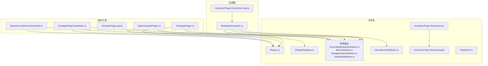
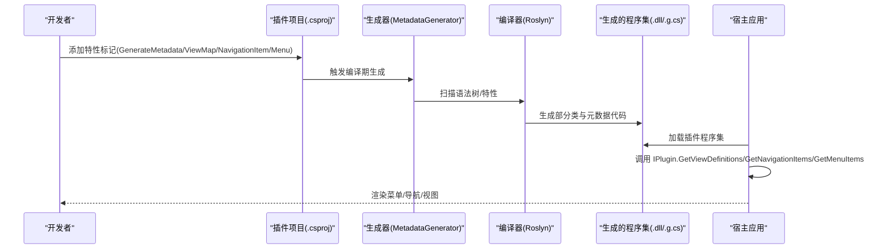
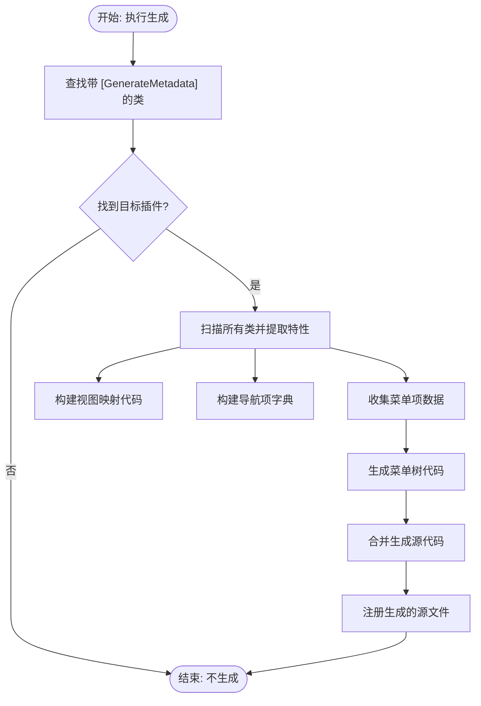
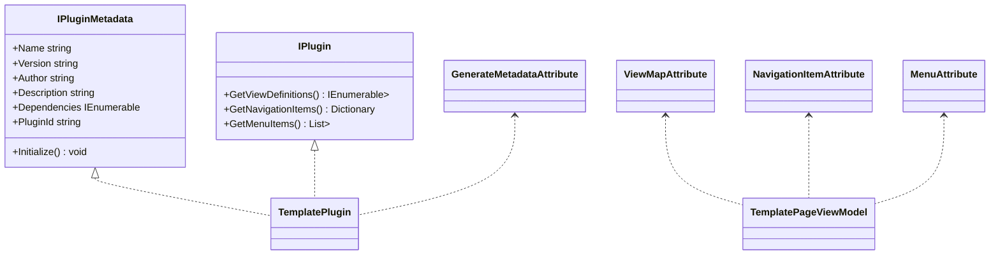
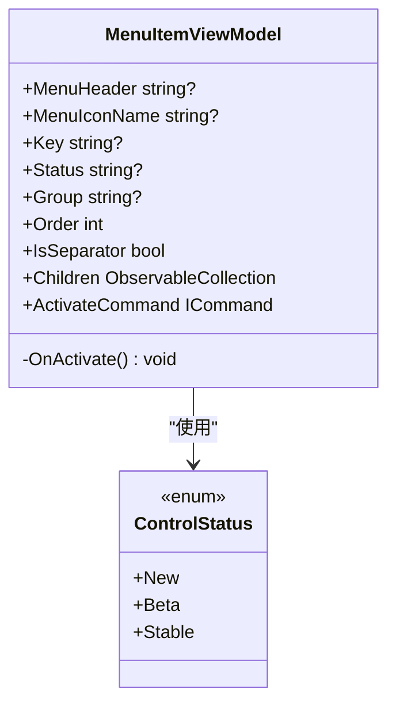
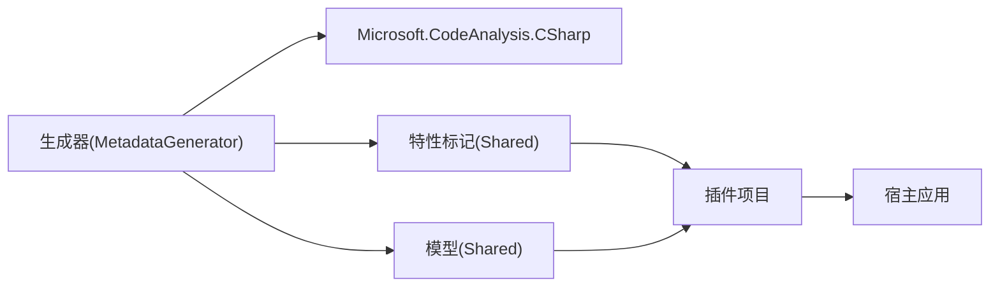

# 开发工具和生成器

<cite>
**本文引用的文件**
- [MetadataGenerator.cs](file://src/Avalonia.Plugin.Generators/MetadataGenerator.cs)
- [Avalonia.Plugin.Generators.csproj](file://src/Avalonia.Plugin.Generators/Avalonia.Plugin.Generators.csproj)
- [GenerateMetadataAttribute.cs](file://src/Avalonia.Plugin.Shared/Attributes/GenerateMetadataAttribute.cs)
- [MenuAttribute.cs](file://src/Avalonia.Plugin.Shared/Attributes/MenuAttribute.cs)
- [NavigationItemAttribute.cs](file://src/Avalonia.Plugin.Shared/Attributes/NavigationItemAttribute.cs)
- [ViewMapAttribute.cs](file://src/Avalonia.Plugin.Shared/Attributes/ViewMapAttribute.cs)
- [IPlugin.cs](file://src/Avalonia.Plugin.Shared/IPlugin.cs)
- [IPluginMetadata.cs](file://src/Avalonia.Plugin.Shared/IPluginMetadata.cs)
- [MenuItemViewModel.cs](file://src/Avalonia.Plugin.Shared/ViewModels/MenuItemViewModel.cs)
- [Avalonia.Plugin.Shared.props](file://src/Avalonia.Plugin.Shared/buildTransitive/Avalonia.Plugin.Shared.props)
- [Avalonia.Plugin.Shared.targets](file://src/Avalonia.Plugin.Shared/buildTransitive/Avalonia.Plugin.Shared.targets)
- [TemplatePlugin.cs](file://plugins/Avalonia.Plugin.Template/TemplatePlugin.cs)
- [TemplatePageViewModel.cs](file://plugins/Avalonia.Plugin.Template/ViewModels/TemplatePageViewModel.cs)
- [TemplatePage.axaml](file://plugins/Avalonia.Plugin.Template/Pages/TemplatePage.axaml)
- [ButtonsInputsPlugin.cs](file://plugins/Avalonia.Plugin.ButtonsInputs/ButtonsInputsPlugin.cs)
- [ButtonGroupDemoViewModel.cs](file://plugins/Avalonia.Plugin.ButtonsInputs/ViewModels/ButtonGroupDemoViewModel.cs)
- [PluginInfo.cs](file://src/Avalonia.Plugin.Shared/Models/PluginInfo.cs)
</cite>

## 目录
1. [简介](#简介)
2. [项目结构](#项目结构)
3. [核心组件](#核心组件)
4. [架构总览](#架构总览)
5. [详细组件分析](#详细组件分析)
6. [依赖分析](#依赖分析)
7. [性能考虑](#性能考虑)
8. [故障排查指南](#故障排查指南)
9. [结论](#结论)
10. [附录](#附录)

## 简介
本文件面向 AvaloniaTemplate 的插件体系与开发工具，重点围绕“插件元数据生成器”展开，系统性说明其工作原理、使用方法与扩展机制；同时覆盖开发辅助工具（代码模板、快捷键与调试工具）、开发环境配置与 IDE 集成建议、以及生成器的扩展与自定义选项。文档以循序渐进的方式呈现，既适合初学者快速上手，也为资深开发者提供深入的技术细节与最佳实践。

## 项目结构
AvaloniaTemplate 采用“共享库 + 生成器 + 插件示例”的分层组织方式：
- 共享库：提供插件接口、元数据模型、通用控件与构建目标，确保插件在运行时的一致行为与依赖管理。
- 生成器：在编译期扫描插件项目中的特性标记，自动生成元数据绑定代码，减少手工维护成本。
- 插件示例：通过特性标记演示如何声明视图映射、导航项与菜单项，配合生成器实现零样板代码的元数据注入。

图表来源
- [MetadataGenerator.cs:1-246](file://src/Avalonia.Plugin.Generators/MetadataGenerator.cs#L1-L246)
- [Avalonia.Plugin.Generators.csproj:1-22](file://src/Avalonia.Plugin.Generators/Avalonia.Plugin.Generators.csproj#L1-L22)
- [IPlugin.cs:1-81](file://src/Avalonia.Plugin.Shared/IPlugin.cs#L1-L81)
- [IPluginMetadata.cs:1-44](file://src/Avalonia.Plugin.Shared/IPluginMetadata.cs#L1-L44)
- [GenerateMetadataAttribute.cs:1-4](file://src/Avalonia.Plugin.Shared/Attributes/GenerateMetadataAttribute.cs#L1-L4)
- [MenuAttribute.cs:1-39](file://src/Avalonia.Plugin.Shared/Attributes/MenuAttribute.cs#L1-L39)
- [NavigationItemAttribute.cs:1-8](file://src/Avalonia.Plugin.Shared/Attributes/NavigationItemAttribute.cs#L1-L8)
- [ViewMapAttribute.cs:1-9](file://src/Avalonia.Plugin.Shared/Attributes/ViewMapAttribute.cs#L1-L9)
- [MenuItemViewModel.cs:1-40](file://src/Avalonia.Plugin.Shared/ViewModels/MenuItemViewModel.cs#L1-L40)
- [Avalonia.Plugin.Shared.props:1-21](file://src/Avalonia.Plugin.Shared/buildTransitive/Avalonia.Plugin.Shared.props#L1-L21)
- [Avalonia.Plugin.Shared.targets:1-67](file://src/Avalonia.Plugin.Shared/buildTransitive/Avalonia.Plugin.Shared.targets#L1-L67)
- [TemplatePlugin.cs:1-20](file://plugins/Avalonia.Plugin.Template/TemplatePlugin.cs#L1-L20)
- [TemplatePageViewModel.cs:1-30](file://plugins/Avalonia.Plugin.Template/ViewModels/TemplatePageViewModel.cs#L1-L30)
- [TemplatePage.axaml:1-49](file://plugins/Avalonia.Plugin.Template/Pages/TemplatePage.axaml#L1-L49)
- [ButtonsInputsPlugin.cs:1-100](file://plugins/Avalonia.Plugin.ButtonsInputs/ButtonsInputsPlugin.cs#L1-L100)
- [ButtonGroupDemoViewModel.cs:1-46](file://plugins/Avalonia.Plugin.ButtonsInputs/ViewModels/ButtonGroupDemoViewModel.cs#L1-L46)

章节来源
- [Avalonia.Plugin.Generators.csproj:1-22](file://src/Avalonia.Plugin.Generators/Avalonia.Plugin.Generators.csproj#L1-L22)
- [Avalonia.Plugin.Shared.props:1-21](file://src/Avalonia.Plugin.Shared/buildTransitive/Avalonia.Plugin.Shared.props#L1-L21)
- [Avalonia.Plugin.Shared.targets:1-67](file://src/Avalonia.Plugin.Shared/buildTransitive/Avalonia.Plugin.Shared.targets#L1-L67)

## 核心组件
- 插件元数据生成器（ISourceGenerator）
  - 在编译期扫描插件项目中带特定特性的类，自动提取视图映射、导航项与菜单项信息，并生成实现 IPlugin 的部分类，注入到插件程序集。
- 插件接口与元数据接口
  - IPlugin 定义三类元数据查询能力：视图映射、导航项、菜单项。
  - IPluginMetadata 提供插件基础元信息与初始化入口。
- 特性标记
  - GenerateMetadataAttribute：标记插件类，触发生成器工作。
  - ViewMapAttribute：声明 ViewModel 到 View 的映射。
  - NavigationItemAttribute：声明导航键，用于路由跳转。
  - MenuAttribute：声明菜单项标题、键、父级键、状态与排序等。
- 菜单项模型
  - MenuItemViewModel 支持层级结构、激活命令与状态枚举，便于运行时渲染与交互。
- 构建目标与依赖排除
  - 通过 props/targets 在打包阶段排除共享依赖，避免插件包臃肿。

章节来源
- [MetadataGenerator.cs:1-246](file://src/Avalonia.Plugin.Generators/MetadataGenerator.cs#L1-L246)
- [IPlugin.cs:1-81](file://src/Avalonia.Plugin.Shared/IPlugin.cs#L1-L81)
- [IPluginMetadata.cs:1-44](file://src/Avalonia.Plugin.Shared/IPluginMetadata.cs#L1-L44)
- [GenerateMetadataAttribute.cs:1-4](file://src/Avalonia.Plugin.Shared/Attributes/GenerateMetadataAttribute.cs#L1-L4)
- [ViewMapAttribute.cs:1-9](file://src/Avalonia.Plugin.Shared/Attributes/ViewMapAttribute.cs#L1-L9)
- [NavigationItemAttribute.cs:1-8](file://src/Avalonia.Plugin.Shared/Attributes/NavigationItemAttribute.cs#L1-L8)
- [MenuAttribute.cs:1-39](file://src/Avalonia.Plugin.Shared/Attributes/MenuAttribute.cs#L1-L39)
- [MenuItemViewModel.cs:1-40](file://src/Avalonia.Plugin.Shared/ViewModels/MenuItemViewModel.cs#L1-L40)
- [Avalonia.Plugin.Shared.props:1-21](file://src/Avalonia.Plugin.Shared/buildTransitive/Avalonia.Plugin.Shared.props#L1-L21)
- [Avalonia.Plugin.Shared.targets:1-67](file://src/Avalonia.Plugin.Shared/buildTransitive/Avalonia.Plugin.Shared.targets#L1-L67)

## 架构总览
下图展示从“插件特性标记”到“运行时菜单/导航/视图绑定”的端到端流程：

图表来源
- [MetadataGenerator.cs:12-130](file://src/Avalonia.Plugin.Generators/MetadataGenerator.cs#L12-L130)
- [IPlugin.cs:9-26](file://src/Avalonia.Plugin.Shared/IPlugin.cs#L9-L26)
- [TemplatePlugin.cs:6-19](file://plugins/Avalonia.Plugin.Template/TemplatePlugin.cs#L6-L19)
- [TemplatePageViewModel.cs:8-11](file://plugins/Avalonia.Plugin.Template/ViewModels/TemplatePageViewModel.cs#L8-L11)
- [TemplatePage.axaml:1-49](file://plugins/Avalonia.Plugin.Template/Pages/TemplatePage.axaml#L1-L49)

## 详细组件分析

### 组件一：插件元数据生成器（MetadataGenerator）
- 工作原理
  - 初始化阶段空操作；执行阶段遍历当前编译的语法树，定位带 [GenerateMetadata] 的类作为目标插件。
  - 扫描所有类，提取以下信息：
    - 视图映射：[ViewMap] 对应 ViewModel -> View 工厂方法。
    - 导航项：[NavigationItem] 对应 Key -> ViewModel 工厂方法。
    - 菜单项：[Menu] 对应 Header/Key/ParentKey/Status/Order 等，构建菜单树。
  - 生成部分类，实现 IPlugin 的三项元数据查询方法，并将生成的源文件写入编译产物。
- 关键算法
  - 菜单树构建：先收集所有条目，建立父-子映射，自动补全缺失父节点，最后仅输出顶层节点并按 Order 排序。
- 错误处理
  - 若未找到目标插件类则直接返回，不生成任何内容。
  - 参数解析失败时采用安全默认值（如 Order 解析失败回退为默认值）。
- 性能特征
  - 仅在编译期运行，对运行时无影响；生成代码为静态常量与简单工厂，开销极低。

图表来源
- [MetadataGenerator.cs:12-130](file://src/Avalonia.Plugin.Generators/MetadataGenerator.cs#L12-L130)
- [MetadataGenerator.cs:133-141](file://src/Avalonia.Plugin.Generators/MetadataGenerator.cs#L133-L141)
- [MetadataGenerator.cs:201-245](file://src/Avalonia.Plugin.Generators/MetadataGenerator.cs#L201-L245)

章节来源
- [MetadataGenerator.cs:1-246](file://src/Avalonia.Plugin.Generators/MetadataGenerator.cs#L1-L246)

### 组件二：特性标记与接口契约
- GenerateMetadataAttribute
  - 作用：标记插件类，触发生成器扫描与代码生成。
- ViewMapAttribute
  - 作用：声明 ViewModel 类型与对应 View 类型的工厂映射。
- NavigationItemAttribute
  - 作用：声明导航键，用于路由跳转与页面导航。
- MenuAttribute
  - 作用：声明菜单项的标题、键、父级键、状态与排序；支持位置参数与命名参数混合。
- IPlugin 与 IPluginMetadata
  - IPlugin：定义三项元数据查询方法，供宿主应用动态加载与渲染。
  - IPluginMetadata：定义插件基础元信息与初始化入口。

图表来源
- [IPlugin.cs:9-26](file://src/Avalonia.Plugin.Shared/IPlugin.cs#L9-L26)
- [IPluginMetadata.cs:3-41](file://src/Avalonia.Plugin.Shared/IPluginMetadata.cs#L3-L41)
- [GenerateMetadataAttribute.cs:1-4](file://src/Avalonia.Plugin.Shared/Attributes/GenerateMetadataAttribute.cs#L1-L4)
- [ViewMapAttribute.cs:1-9](file://src/Avalonia.Plugin.Shared/Attributes/ViewMapAttribute.cs#L1-L9)
- [NavigationItemAttribute.cs:1-8](file://src/Avalonia.Plugin.Shared/Attributes/NavigationItemAttribute.cs#L1-L8)
- [MenuAttribute.cs:1-39](file://src/Avalonia.Plugin.Shared/Attributes/MenuAttribute.cs#L1-L39)
- [TemplatePlugin.cs:6-19](file://plugins/Avalonia.Plugin.Template/TemplatePlugin.cs#L6-L19)
- [TemplatePageViewModel.cs:8-11](file://plugins/Avalonia.Plugin.Template/ViewModels/TemplatePageViewModel.cs#L8-L11)

章节来源
- [GenerateMetadataAttribute.cs:1-4](file://src/Avalonia.Plugin.Shared/Attributes/GenerateMetadataAttribute.cs#L1-L4)
- [ViewMapAttribute.cs:1-9](file://src/Avalonia.Plugin.Shared/Attributes/ViewMapAttribute.cs#L1-L9)
- [NavigationItemAttribute.cs:1-8](file://src/Avalonia.Plugin.Shared/Attributes/NavigationItemAttribute.cs#L1-L8)
- [MenuAttribute.cs:1-39](file://src/Avalonia.Plugin.Shared/Attributes/MenuAttribute.cs#L1-L39)
- [IPlugin.cs:1-81](file://src/Avalonia.Plugin.Shared/IPlugin.cs#L1-L81)
- [IPluginMetadata.cs:1-44](file://src/Avalonia.Plugin.Shared/IPluginMetadata.cs#L1-L44)

### 组件三：菜单项模型与状态
- MenuItemViewModel
  - 字段：标题、图标名、键、状态、分组、排序、子项集合、激活命令。
  - 激活命令：通过弱引用消息总线发送“跳转到指定键”的消息，驱动宿主导航。
- 状态枚举
  - 新功能、Beta、稳定等状态，可用于菜单项的视觉提示或过滤。

图表来源
- [MenuItemViewModel.cs:15-39](file://src/Avalonia.Plugin.Shared/ViewModels/MenuItemViewModel.cs#L15-L39)

章节来源
- [MenuItemViewModel.cs:1-40](file://src/Avalonia.Plugin.Shared/ViewModels/MenuItemViewModel.cs#L1-L40)

### 组件四：构建目标与依赖排除
- props/targets
  - 在打包阶段自动排除共享依赖（如 System.*、Microsoft.*、Avalonia.* 等），仅复制插件实际需要的本地依赖，减小体积并降低冲突风险。
- 适用场景
  - 插件独立发布与热加载；避免与宿主或其它插件携带重复框架程序集。

章节来源
- [Avalonia.Plugin.Shared.props:1-21](file://src/Avalonia.Plugin.Shared/buildTransitive/Avalonia.Plugin.Shared.props#L1-L21)
- [Avalonia.Plugin.Shared.targets:1-67](file://src/Avalonia.Plugin.Shared/buildTransitive/Avalonia.Plugin.Shared.targets#L1-L67)

### 组件五：示例插件与使用范式
- TemplatePlugin
  - 使用 [GenerateMetadata] 标记，作为生成器的目标插件。
- TemplatePageViewModel
  - 同时使用 [NavigationItem]、[Menu]、[ViewMap]，演示三类元数据的声明方式。
- TemplatePage.axaml
  - 与 ViewModel 绑定，展示生成的导航与菜单如何驱动页面显示。
- ButtonsInputsPlugin 与 ButtonGroupDemoViewModel
  - 展示更复杂的菜单层级与导航键命名约定。

章节来源
- [TemplatePlugin.cs:1-20](file://plugins/Avalonia.Plugin.Template/TemplatePlugin.cs#L1-L20)
- [TemplatePageViewModel.cs:1-30](file://plugins/Avalonia.Plugin.Template/ViewModels/TemplatePageViewModel.cs#L1-L30)
- [TemplatePage.axaml:1-49](file://plugins/Avalonia.Plugin.Template/Pages/TemplatePage.axaml#L1-L49)
- [ButtonsInputsPlugin.cs:1-100](file://plugins/Avalonia.Plugin.ButtonsInputs/ButtonsInputsPlugin.cs#L1-L100)
- [ButtonGroupDemoViewModel.cs:1-46](file://plugins/Avalonia.Plugin.ButtonsInputs/ViewModels/ButtonGroupDemoViewModel.cs#L1-L46)

## 依赖分析
- 生成器依赖
  - Roslyn 分析 API（Microsoft.CodeAnalysis.CSharp），用于语法树扫描与特性解析。
- 插件与共享库耦合
  - 插件通过 IPlugin/IPluginMetadata 与宿主解耦；特性标记与模型位于共享库，保证一致性。
- 构建期与运行期
  - 生成器仅在构建期工作；生成的代码在运行期被宿主调用，不引入额外运行时依赖。

图表来源
- [Avalonia.Plugin.Generators.csproj:14-17](file://src/Avalonia.Plugin.Generators/Avalonia.Plugin.Generators.csproj#L14-L17)
- [MetadataGenerator.cs:1-246](file://src/Avalonia.Plugin.Generators/MetadataGenerator.cs#L1-L246)
- [IPlugin.cs:1-81](file://src/Avalonia.Plugin.Shared/IPlugin.cs#L1-L81)
- [IPluginMetadata.cs:1-44](file://src/Avalonia.Plugin.Shared/IPluginMetadata.cs#L1-L44)

章节来源
- [Avalonia.Plugin.Generators.csproj:1-22](file://src/Avalonia.Plugin.Generators/Avalonia.Plugin.Generators.csproj#L1-L22)

## 性能考虑
- 编译期生成
  - 生成器仅在编译期运行，生成的代码为静态常量与简单工厂，对运行时性能无负面影响。
- 菜单树构建
  - 生成器内部进行一次线性扫描与字典构建，时间复杂度 O(n)；运行时仅做一次树装配与顶层筛选，开销极低。
- 依赖排除
  - 通过构建目标排除共享依赖，减少插件包大小与加载时间。

## 故障排查指南
- 问题：生成器未生成任何代码
  - 检查插件类是否正确添加 [GenerateMetadata] 标记。
  - 确认插件项目已引用生成器包并在编译期生效。
- 问题：菜单项未显示或排序异常
  - 检查 [Menu] 的参数是否正确传入（Header/Key/ParentKey/Order）。
  - 确保父级键存在或允许自动生成虚拟根节点。
- 问题：导航键无效或页面未加载
  - 检查 [NavigationItem] 的 Key 是否与菜单项一致。
  - 确认 [ViewMap] 的 View 类型与页面命名空间匹配。
- 问题：插件包过大或加载缓慢
  - 检查构建目标是否启用共享依赖排除。
  - 确认未手动引入不必要的第三方包。

章节来源
- [MetadataGenerator.cs:12-130](file://src/Avalonia.Plugin.Generators/MetadataGenerator.cs#L12-L130)
- [MetadataGenerator.cs:201-245](file://src/Avalonia.Plugin.Generators/MetadataGenerator.cs#L201-L245)
- [Avalonia.Plugin.Shared.targets:1-67](file://src/Avalonia.Plugin.Shared/buildTransitive/Avalonia.Plugin.Shared.targets#L1-L67)

## 结论
AvaloniaTemplate 的开发工具与生成器通过“特性标记 + 编译期生成”的方式，将插件的元数据声明与实现解耦，显著降低了样板代码与维护成本。结合共享库的接口契约与构建目标的依赖排除策略，形成了清晰、可扩展且易于维护的插件体系。开发者只需专注于业务特性标记，即可获得完整的菜单、导航与视图绑定能力。

## 附录

### A. 使用步骤与最佳实践
- 步骤
  - 在插件类上添加 [GenerateMetadata]。
  - 在每个 ViewModel 上添加 [NavigationItem]、[Menu]、[ViewMap]。
  - 编译项目，生成器会自动生成 IPlugin 实现的部分类。
  - 在宿主应用中加载插件并调用 IPlugin 的三项方法完成渲染。
- 最佳实践
  - 将菜单键与导航键统一命名，保持一致性。
  - 使用命名参数明确设置菜单状态与排序，提升可读性。
  - 将父级菜单键与子级菜单键分离，避免硬编码路径。
  - 优先使用共享依赖排除策略，控制插件包体积。

章节来源
- [TemplatePlugin.cs:6-19](file://plugins/Avalonia.Plugin.Template/TemplatePlugin.cs#L6-L19)
- [TemplatePageViewModel.cs:8-11](file://plugins/Avalonia.Plugin.Template/ViewModels/TemplatePageViewModel.cs#L8-L11)
- [Avalonia.Plugin.Shared.targets:1-67](file://src/Avalonia.Plugin.Shared/buildTransitive/Avalonia.Plugin.Shared.targets#L1-L67)

### B. 开发环境配置与 IDE 集成建议
- Visual Studio
  - 安装最新 .NET SDK 与 Avalonia 工具链；启用“启用 Roslyn 分析器”以获得更好的生成器诊断。
- Rider
  - 确保使用最新版本并启用 .NET MAUI/Avalonia 支持；生成器应在编译期自动触发。
- VS Code
  - 安装 C# 扩展与 Avalonia 扩展；在任务中配置 dotnet build 以触发生成器。

### C. 生成器扩展与自定义选项
- 扩展点
  - 可在生成器中增加新的特性识别与代码生成分支，例如支持更多元数据类型（如工具栏项、主题切换等）。
  - 可扩展菜单树构建算法，支持多级父子关系、权限过滤或动态权重计算。
- 自定义选项
  - 通过 MSBuild 属性或特性参数传递自定义配置，控制生成代码的命名空间、类名后缀或输出目录。
  - 支持条件生成：仅在特定条件下生成某类元数据，以适配不同部署场景。

章节来源
- [MetadataGenerator.cs:12-130](file://src/Avalonia.Plugin.Generators/MetadataGenerator.cs#L12-L130)
- [Avalonia.Plugin.Shared.props:1-21](file://src/Avalonia.Plugin.Shared/buildTransitive/Avalonia.Plugin.Shared.props#L1-L21)

### D. 工具链维护与升级策略
- 升级策略
  - 生成器依赖 Roslyn 版本需与 IDE/SDK 保持兼容；升级前先在 CI 中验证生成结果。
  - 共享库接口变更应向后兼容或提供迁移指南；插件项目应逐步更新特性参数与调用方式。
- 维护建议
  - 将生成器与共享库拆分为独立 NuGet 包，便于独立演进与回滚。
  - 增加单元测试与集成测试，覆盖典型特性组合与边界情况（如重复键、缺失父键、非法排序）。

章节来源
- [Avalonia.Plugin.Generators.csproj:14-17](file://src/Avalonia.Plugin.Generators/Avalonia.Plugin.Generators.csproj#L14-L17)
- [IPlugin.cs:1-81](file://src/Avalonia.Plugin.Shared/IPlugin.cs#L1-L81)