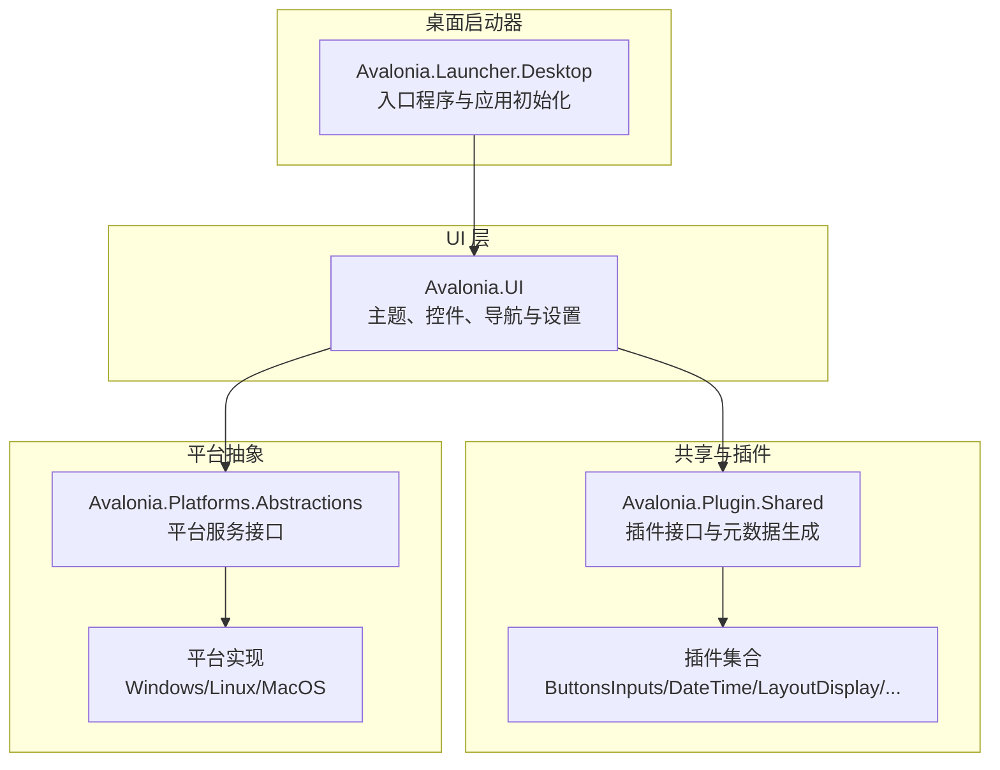
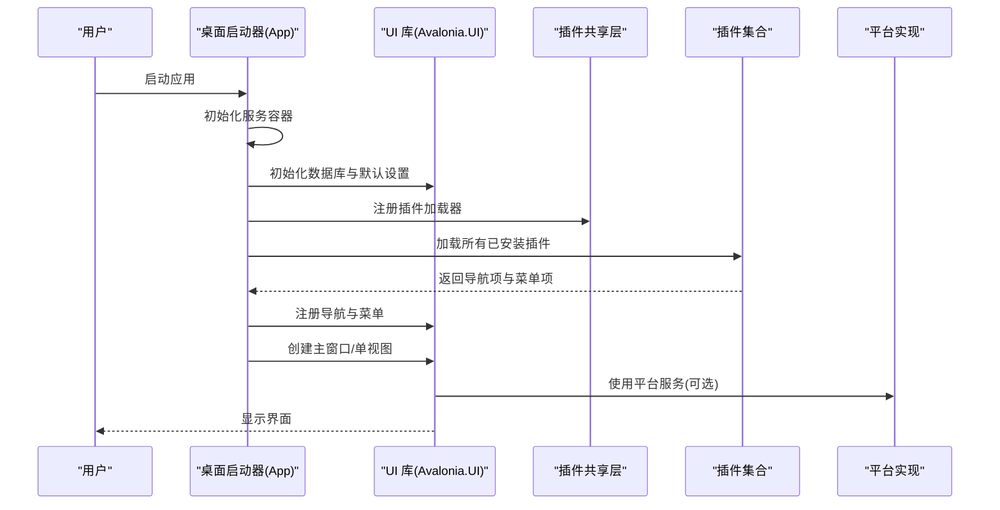
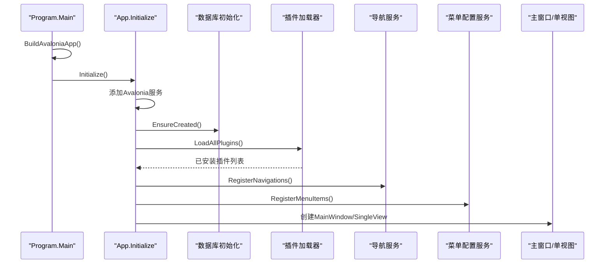
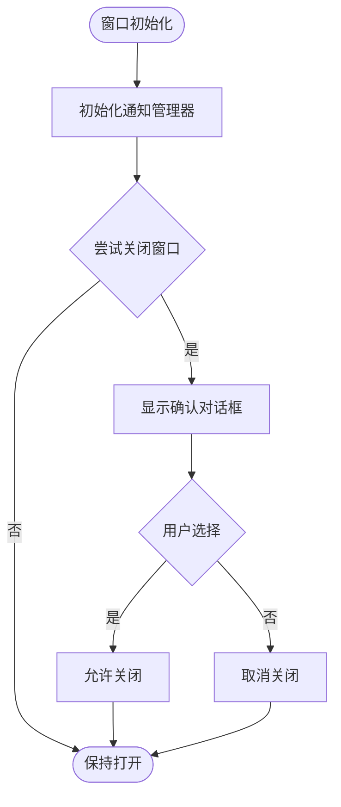
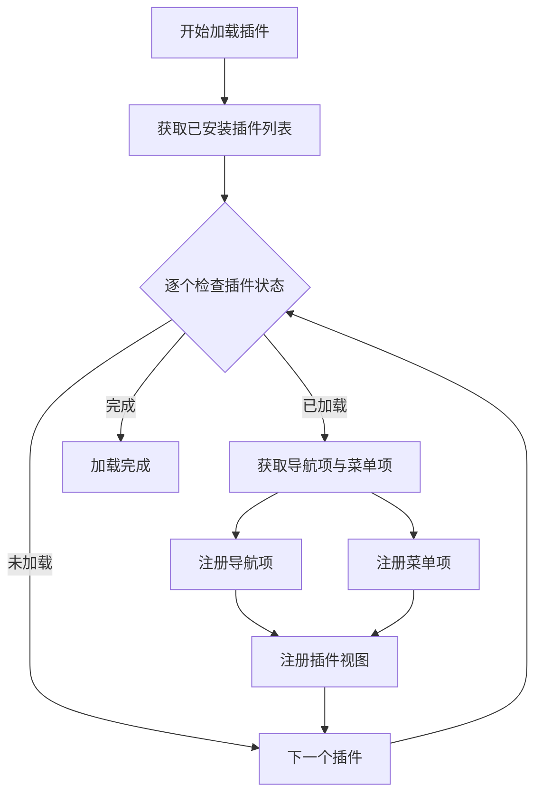
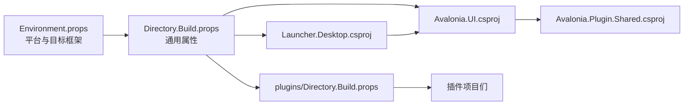

# 快速开始

<cite>
**本文引用的文件**
- [src/Directory.Build.props](file://src/Directory.Build.props)
- [src/Directory.Packages.props](file://src/Directory.Packages.props)
- [src/Environment.props](file://src/Environment.props)
- [src/launcher/Avalonia.Launcher.Desktop/Program.cs](file://src/launcher/Avalonia.Launcher.Desktop/Program.cs)
- [src/launcher/Avalonia.Launcher.Desktop/App.axaml.cs](file://src/launcher/Avalonia.Launcher.Desktop/App.axaml.cs)
- [src/Avalonia.UI/Avalonia.UI.csproj](file://src/Avalonia.UI/Avalonia.UI.csproj)
- [src/launcher/Avalonia.Launcher.Desktop/Avalonia.Launcher.Desktop.csproj](file://src/launcher/Avalonia.Launcher.Desktop/Avalonia.Launcher.Desktop.csproj)
- [src/Avalonia.UI/Views/MainWindow.axaml.cs](file://src/Avalonia.UI/Views/MainWindow.axaml.cs)
- [plugins/Directory.Build.props](file://plugins/Directory.Build.props)
- [skills-lock.json](file://skills-lock.json)
</cite>

## 目录
1. [简介](#简介)
2. [项目结构](#项目结构)
3. [核心组件](#核心组件)
4. [架构总览](#架构总览)
5. [详细组件分析](#详细组件分析)
6. [依赖关系分析](#依赖关系分析)
7. [性能考虑](#性能考虑)
8. [故障排除指南](#故障排除指南)
9. [结论](#结论)
10. [附录](#附录)

## 简介
本指南面向初学者，帮助你在 Windows、Linux 和 macOS 上快速搭建 AvaloniaTemplate 的开发与运行环境，并完成首次运行。你将获得环境要求、安装步骤、构建与运行流程、跨平台注意事项以及验证安装成功的测试方法。

## 项目结构
该项目采用多项目解决方案组织，核心由桌面启动器、UI 库、平台抽象层、插件体系与若干平台实现组成。桌面启动器负责应用初始化、数据库初始化、插件加载与主窗口展示；UI 库提供主题、控件与导航服务；平台抽象层定义跨平台能力接口；插件体系通过元数据注册导航项与菜单项；平台实现针对 Windows、Linux、macOS 提供差异化服务。

图表来源
- [src/launcher/Avalonia.Launcher.Desktop/App.axaml.cs:23-88](file://src/launcher/Avalonia.Launcher.Desktop/App.axaml.cs#L23-L88)
- [src/Avalonia.UI/Avalonia.UI.csproj:24-26](file://src/Avalonia.UI/Avalonia.UI.csproj#L24-L26)
- [src/Avalonia.Platforms.Abstractions/README.md:1-3](file://src/Avalonia.Platforms.Abstractions/README.md#L1-L3)

章节来源
- [src/launcher/Avalonia.Launcher.Desktop/App.axaml.cs:23-88](file://src/launcher/Avalonia.Launcher.Desktop/App.axaml.cs#L23-L88)
- [src/Avalonia.UI/Avalonia.UI.csproj:1-29](file://src/Avalonia.UI/Avalonia.UI.csproj#L1-L29)

## 核心组件
- 桌面启动器：负责应用生命周期初始化、数据库创建与默认设置、插件加载与导航注册、主窗口或单视图展示。
- UI 库：封装主题、控件、导航服务、设置服务与插件集成，作为插件宿主。
- 插件共享层：定义插件接口、元数据生成与视图定位器，统一插件加载与注册流程。
- 平台抽象层：定义桌面通知、文件选择、系统事件、窗口平台等服务接口。
- 平台实现：在 Windows、Linux、macOS 上分别提供具体实现，适配各平台特性。

章节来源
- [src/launcher/Avalonia.Launcher.Desktop/App.axaml.cs:23-88](file://src/launcher/Avalonia.Launcher.Desktop/App.axaml.cs#L23-L88)
- [src/Avalonia.UI/Avalonia.UI.csproj:13-22](file://src/Avalonia.UI/Avalonia.UI.csproj#L13-L22)
- [src/Directory.Build.props:1-11](file://src/Directory.Build.props#L1-L11)
- [src/Environment.props:35-49](file://src/Environment.props#L35-L49)

## 架构总览
下图展示了从启动器到 UI、插件与平台服务的整体交互：

图表来源
- [src/launcher/Avalonia.Launcher.Desktop/App.axaml.cs:42-88](file://src/launcher/Avalonia.Launcher.Desktop/App.axaml.cs#L42-L88)
- [src/Avalonia.UI/Avalonia.UI.csproj:13-22](file://src/Avalonia.UI/Avalonia.UI.csproj#L13-L22)

## 详细组件分析

### 组件一：桌面启动器与应用初始化
- 入口程序负责构建 AppBuilder、启用平台检测与 Win32 选项、输出日志，并以经典桌面生命周期启动。
- 应用初始化阶段加载 XAML、添加 Avalonia 服务、构建服务提供者、初始化数据库、加载插件并注册导航与菜单，最后根据生命周期创建主窗口或单视图。

图表来源
- [src/launcher/Avalonia.Launcher.Desktop/Program.cs:11-23](file://src/launcher/Avalonia.Launcher.Desktop/Program.cs#L11-L23)
- [src/launcher/Avalonia.Launcher.Desktop/App.axaml.cs:23-88](file://src/launcher/Avalonia.Launcher.Desktop/App.axaml.cs#L23-L88)

章节来源
- [src/launcher/Avalonia.Launcher.Desktop/Program.cs:11-23](file://src/launcher/Avalonia.Launcher.Desktop/Program.cs#L11-L23)
- [src/launcher/Avalonia.Launcher.Desktop/App.axaml.cs:23-88](file://src/launcher/Avalonia.Launcher.Desktop/App.axaml.cs#L23-L88)

### 组件二：主窗口与通知管理
- 主窗口构造时初始化通知管理器，限制同时显示的通知数量。
- 关闭前弹出确认对话框，确保用户意图明确。

图表来源
- [src/Avalonia.UI/Views/MainWindow.axaml.cs:10-21](file://src/Avalonia.UI/Views/MainWindow.axaml.cs#L10-L21)

章节来源
- [src/Avalonia.UI/Views/MainWindow.axaml.cs:10-21](file://src/Avalonia.UI/Views/MainWindow.axaml.cs#L10-L21)

### 组件三：插件体系与导航/菜单注册
- 插件加载器遍历已安装插件，对每个加载成功的插件提取导航项与菜单项，注册到导航服务与菜单配置服务，并通过视图定位器注册插件视图。

图表来源
- [src/launcher/Avalonia.Launcher.Desktop/App.axaml.cs:54-88](file://src/launcher/Avalonia.Launcher.Desktop/App.axaml.cs#L54-L88)

章节来源
- [src/launcher/Avalonia.Launcher.Desktop/App.axaml.cs:54-88](file://src/launcher/Avalonia.Launcher.Desktop/App.axaml.cs#L54-L88)

## 依赖关系分析
- 项目使用统一的包版本管理与目录级属性，集中定义目标框架、可空引用与平台特性。
- 启动器项目引用 UI 库与插件共享层，UI 库引用 Avalonia、Irihi.Ursa、Entity Framework Core 与插件共享层。
- 插件项目继承目录级属性并导入共享 props，确保一致的目标框架与编译选项。

图表来源
- [src/Environment.props:1-58](file://src/Environment.props#L1-L58)
- [src/Directory.Build.props:1-11](file://src/Directory.Build.props#L1-L11)
- [src/launcher/Avalonia.Launcher.Desktop/Avalonia.Launcher.Desktop.csproj:28-31](file://src/launcher/Avalonia.Launcher.Desktop/Avalonia.Launcher.Desktop.csproj#L28-L31)
- [src/Avalonia.UI/Avalonia.UI.csproj:24-26](file://src/Avalonia.UI/Avalonia.UI.csproj#L24-L26)
- [plugins/Directory.Build.props:1-13](file://plugins/Directory.Build.props#L1-L13)

章节来源
- [src/Directory.Packages.props:1-10](file://src/Directory.Packages.props#L1-L10)
- [src/Environment.props:1-58](file://src/Environment.props#L1-L58)
- [src/Directory.Build.props:1-11](file://src/Directory.Build.props#L1-L11)
- [src/launcher/Avalonia.Launcher.Desktop/Avalonia.Launcher.Desktop.csproj:1-33](file://src/launcher/Avalonia.Launcher.Desktop/Avalonia.Launcher.Desktop.csproj#L1-L33)
- [src/Avalonia.UI/Avalonia.UI.csproj:1-29](file://src/Avalonia.UI/Avalonia.UI.csproj#L1-L29)
- [plugins/Directory.Build.props:1-13](file://plugins/Directory.Build.props#L1-L13)

## 性能考虑
- 首次运行会创建 SQLite 数据库并初始化默认设置，建议在开发机上确保磁盘空间充足且具备写权限。
- 插件加载过程会扫描并注册导航与菜单项，插件越多初始化时间越长；建议仅在开发阶段加载必要插件。
- 跨平台运行时，平台检测与服务初始化可能带来轻微开销，通常可忽略不计。

## 故障排除指南
- 无法找到 .NET SDK 或 MSBuild
  - 现象：构建失败，提示找不到 SDK 或工具链。
  - 处理：安装与项目匹配的 .NET SDK；确认 PATH 正确；重启终端后重试。
- 平台目标框架不匹配
  - 现象：在非目标平台编译失败或运行异常。
  - 处理：确保 Environment.props 中的平台条件与实际系统一致；必要时手动指定发布平台。
- 插件加载失败或导航/菜单未出现
  - 现象：应用启动但缺少插件页面或菜单项。
  - 处理：检查插件是否正确打包并位于可发现位置；查看控制台输出中的错误日志；确认插件元数据生成正常。
- 数据库初始化失败
  - 现象：首次启动无数据或报错。
  - 处理：确认 SQLite 可写目录权限；删除旧数据库文件后重新启动；检查 EF Core 设计包版本。
- 关闭窗口时无确认对话框
  - 现象：直接关闭窗口，未提示确认。
  - 处理：确认 MainWindow 的 CanClose 逻辑被调用；检查消息框相关依赖是否可用。

章节来源
- [src/launcher/Avalonia.Launcher.Desktop/App.axaml.cs:83-87](file://src/launcher/Avalonia.Launcher.Desktop/App.axaml.cs#L83-L87)
- [src/Avalonia.UI/Views/MainWindow.axaml.cs:16-21](file://src/Avalonia.UI/Views/MainWindow.axaml.cs#L16-L21)

## 结论
通过本指南，你可以在 Windows、Linux 与 macOS 上完成 AvaloniaTemplate 的环境准备、构建与首次运行。建议先在本地验证基础功能，再逐步引入更多插件与平台特性。如遇问题，请参考故障排除部分或检查控制台输出。

## 附录

### 环境要求
- .NET 版本
  - 目标框架：net10.0
  - 启动器项目：WinExe 输出类型（发布模式且为 Windows 时）
  - 平台差异：Windows 使用 windows10.0.19041.0；macOS 使用 macos15.0
- 开发工具
  - Visual Studio 2022+ 或 VS Code + C# 扩展
  - .NET SDK 10.x
  - Git（用于克隆仓库）

章节来源
- [src/Directory.Build.props:3-10](file://src/Directory.Build.props#L3-L10)
- [src/Environment.props:35-49](file://src/Environment.props#L35-L49)
- [src/launcher/Avalonia.Launcher.Desktop/Avalonia.Launcher.Desktop.csproj:2-8](file://src/launcher/Avalonia.Launcher.Desktop/Avalonia.Launcher.Desktop.csproj#L2-L8)

### 安装步骤与首次运行
- 克隆仓库
  - 使用 Git 将项目克隆到本地目录
- 还原与构建
  - 在项目根目录执行还原与构建命令
- 运行应用
  - 启动桌面启动器项目，观察主窗口与插件页面是否加载
- 验证
  - 首次运行应完成数据库初始化与默认设置
  - 确认插件导航项出现在菜单中
  - 尝试关闭窗口，确认出现确认对话框

章节来源
- [src/launcher/Avalonia.Launcher.Desktop/Program.cs:11-23](file://src/launcher/Avalonia.Launcher.Desktop/Program.cs#L11-L23)
- [src/launcher/Avalonia.Launcher.Desktop/App.axaml.cs:42-52](file://src/launcher/Avalonia.Launcher.Desktop/App.axaml.cs#L42-L52)
- [src/Avalonia.UI/Views/MainWindow.axaml.cs:16-21](file://src/Avalonia.UI/Views/MainWindow.axaml.cs#L16-L21)

### 不同操作系统注意事项
- Windows
  - 目标框架包含 Windows 平台标识；发布 Release 或 Release_MSIX 时输出类型为 WinExe
  - 建议使用 Visual Studio 进行调试与发布
- Linux
  - 平台常量与宏定义已启用；注意运行时权限与依赖库
- macOS
  - 目标框架包含 macOS 平台标识；注意签名与沙盒策略（如需发布）

章节来源
- [src/Environment.props:35-49](file://src/Environment.props#L35-L49)

### 技能与外部资源
- 项目包含技能锁定文件，记录了布局、视图模型与开发技能的来源与校验哈希，便于团队协作与溯源。

章节来源
- [skills-lock.json:1-24](file://skills-lock.json#L1-L24)