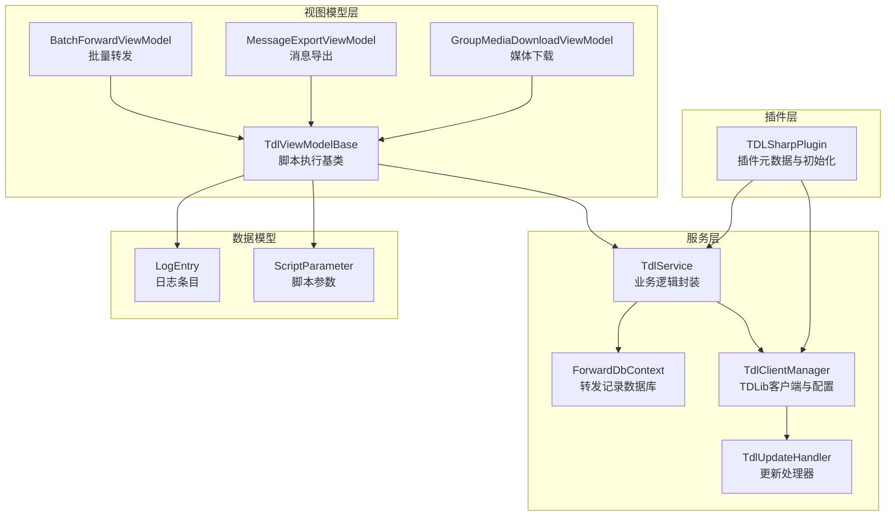
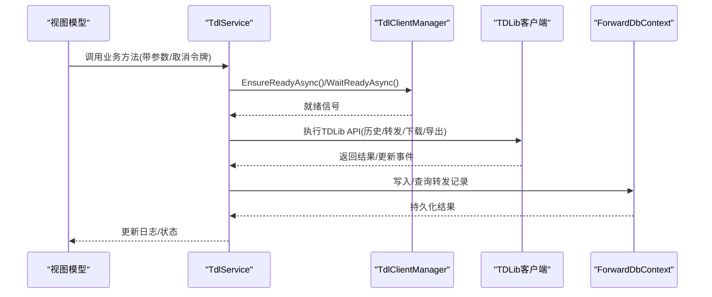
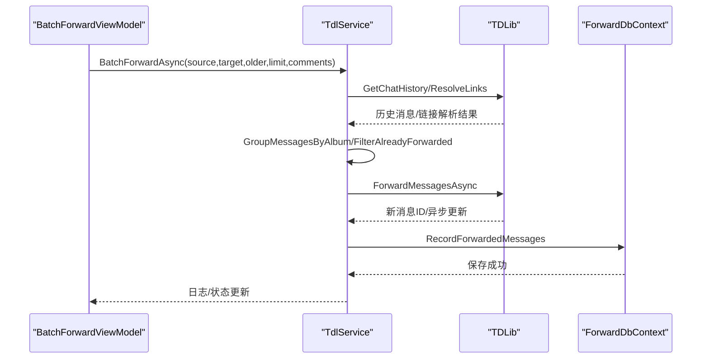
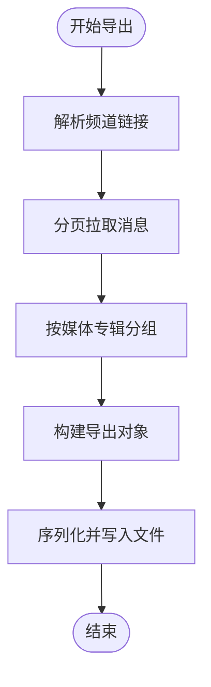
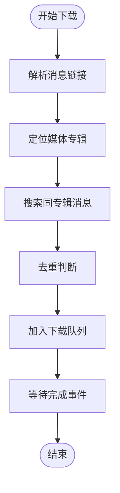
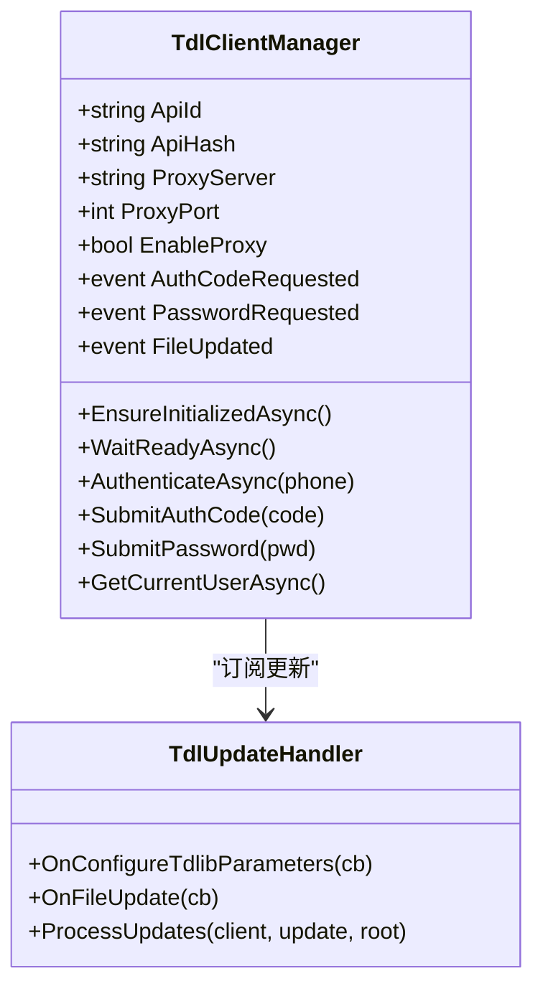
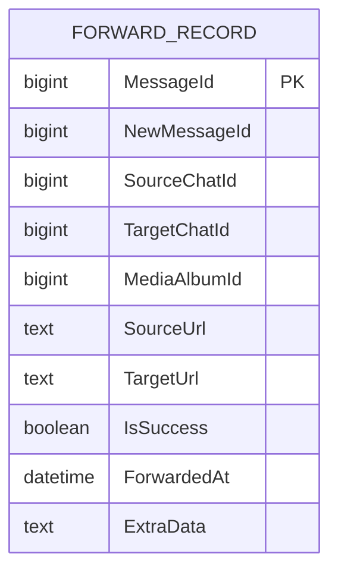
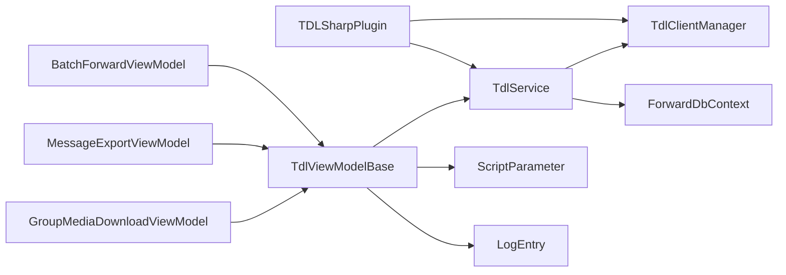

# TDLSharp插件开发

<cite>
**本文档引用的文件**
- [TDLSharpPlugin.cs](file://plugins/Avalonia.Plugin.TDLSharp/TDLSharpPlugin.cs)
- [TdlService.cs](file://plugins/Avalonia.Plugin.TDLSharp/Servicess/TdlService.cs)
- [TdlClientManager.cs](file://plugins/Avalonia.Plugin.TDLSharp/Servicess/TdlClientManager.cs)
- [TdlForwardDbContext.cs](file://plugins/Avalonia.Plugin.TDLSharp/Servicess/TdlForwardDbContext.cs)
- [TdlViewModelBase.cs](file://plugins/Avalonia.Plugin.TDLSharp/ViewModels/TdlViewModelBase.cs)
- [TdlService.Forward.cs](file://plugins/Avalonia.Plugin.TDLSharp/Servicess/TdlService.Forward.cs)
- [TdlService.Export.cs](file://plugins/Avalonia.Plugin.TDLSharp/Servicess/TdlService.Export.cs)
- [TdlService.Download.cs](file://plugins/Avalonia.Plugin.TDLSharp/Servicess/TdlService.Download.cs)
- [TdlService.DeepCopy.cs](file://plugins/Avalonia.Plugin.TDLSharp/Servicess/TdlService.DeepCopy.cs)
- [TdlService.Clear.cs](file://plugins/Avalonia.Plugin.TDLSharp/Servicess/TdlService.Clear.cs)
- [BatchForwardViewModel.cs](file://plugins/Avalonia.Plugin.TDLSharp/ViewModels/BatchForwardViewModel.cs)
- [MessageExportViewModel.cs](file://plugins/Avalonia.Plugin.TDLSharp/ViewModels/MessageExportViewModel.cs)
- [GroupMediaDownloadViewModel.cs](file://plugins/Avalonia.Plugin.TDLSharp/ViewModels/GroupMediaDownloadViewModel.cs)
- [ScriptParameter.cs](file://plugins/Avalonia.Plugin.TDLSharp/Models/ScriptParameter.cs)
- [LogEntry.cs](file://plugins/Avalonia.Plugin.TDLSharp/Models/LogEntry.cs)
</cite>

## 目录
1. [简介](#简介)
2. [项目结构](#项目结构)
3. [核心组件](#核心组件)
4. [架构总览](#架构总览)
5. [详细组件分析](#详细组件分析)
6. [依赖关系分析](#依赖关系分析)
7. [性能考虑](#性能考虑)
8. [故障排除指南](#故障排除指南)
9. [结论](#结论)
10. [附录](#附录)

## 简介
本指南面向希望基于TDLSharp插件开发复杂业务功能的工程师，系统讲解如何利用TDLib与Telegram进行企业级集成，涵盖批量转发、消息导出、媒体下载等核心能力。文档从架构设计、数据服务、业务封装、异步与并发控制、错误处理与重试、与外部系统集成等方面展开，并提供性能优化与安全实践建议。

## 项目结构
TDLSharp插件采用“插件元数据 + 服务层 + 视图模型 + 数据模型”的分层组织方式：
- 插件元数据：注册设置项、服务、生命周期初始化
- 服务层：封装TDLib客户端、业务逻辑、数据库持久化、更新处理
- 视图模型：脚本参数定义、执行流程、日志与状态管理
- 数据模型：脚本参数、日志条目等

**图表来源**
- [TDLSharpPlugin.cs:1-91](file://plugins/Avalonia.Plugin.TDLSharp/TDLSharpPlugin.cs#L1-L91)
- [TdlClientManager.cs:1-163](file://plugins/Avalonia.Plugin.TDLSharp/Servicess/TdlClientManager.cs#L1-L163)
- [TdlService.cs:1-444](file://plugins/Avalonia.Plugin.TDLSharp/Servicess/TdlService.cs#L1-L444)
- [TdlForwardDbContext.cs:1-71](file://plugins/Avalonia.Plugin.TDLSharp/Servicess/TdlForwardDbContext.cs#L1-L71)
- [TdlViewModelBase.cs:1-118](file://plugins/Avalonia.Plugin.TDLSharp/ViewModels/TdlViewModelBase.cs#L1-L118)
- [BatchForwardViewModel.cs:1-40](file://plugins/Avalonia.Plugin.TDLSharp/ViewModels/BatchForwardViewModel.cs#L1-L40)
- [MessageExportViewModel.cs:1-36](file://plugins/Avalonia.Plugin.TDLSharp/ViewModels/MessageExportViewModel.cs#L1-L36)
- [GroupMediaDownloadViewModel.cs:1-34](file://plugins/Avalonia.Plugin.TDLSharp/ViewModels/GroupMediaDownloadViewModel.cs#L1-L34)
- [ScriptParameter.cs:1-81](file://plugins/Avalonia.Plugin.TDLSharp/Models/ScriptParameter.cs#L1-L81)
- [LogEntry.cs:1-28](file://plugins/Avalonia.Plugin.TDLSharp/Models/LogEntry.cs#L1-L28)

**章节来源**
- [TDLSharpPlugin.cs:1-91](file://plugins/Avalonia.Plugin.TDLSharp/TDLSharpPlugin.cs#L1-L91)
- [TdlService.cs:1-444](file://plugins/Avalonia.Plugin.TDLSharp/Servicess/TdlService.cs#L1-L444)
- [TdlViewModelBase.cs:1-118](file://plugins/Avalonia.Plugin.TDLSharp/ViewModels/TdlViewModelBase.cs#L1-L118)

## 核心组件
- 插件元数据与初始化：注册设置项（API ID/Hash、代理）、构建日志工厂与客户端管理器、注入服务定位器
- 客户端管理器：统一配置TDLib参数、建立代理、监听文件更新、暴露认证事件
- 业务服务：封装批量转发、消息导出、媒体下载、深拷贝与清理等业务方法
- 数据库上下文：以SQLite存储转发记录，支持去重与结果追踪
- 视图模型：定义脚本参数、执行流程、日志与状态管理、取消令牌

**章节来源**
- [TDLSharpPlugin.cs:20-91](file://plugins/Avalonia.Plugin.TDLSharp/TDLSharpPlugin.cs#L20-L91)
- [TdlClientManager.cs:7-163](file://plugins/Avalonia.Plugin.TDLSharp/Servicess/TdlClientManager.cs#L7-L163)
- [TdlService.cs:8-444](file://plugins/Avalonia.Plugin.TDLSharp/Servicess/TdlService.cs#L8-L444)
- [TdlForwardDbContext.cs:10-71](file://plugins/Avalonia.Plugin.TDLSharp/Servicess/TdlForwardDbContext.cs#L10-L71)
- [TdlViewModelBase.cs:12-118](file://plugins/Avalonia.Plugin.TDLSharp/ViewModels/TdlViewModelBase.cs#L12-L118)

## 架构总览
TDLSharp采用“服务驱动 + 数据持久化 + UI脚本化”的架构：
- 服务层负责与TDLib交互、业务编排、错误与重试策略
- 数据层使用SQLite记录转发结果，避免重复处理
- 视图模型层通过脚本参数驱动，统一执行入口与日志输出
- 插件层负责环境初始化、设置注入与服务注册

**图表来源**
- [TdlViewModelBase.cs:40-94](file://plugins/Avalonia.Plugin.TDLSharp/ViewModels/TdlViewModelBase.cs#L40-L94)
- [TdlService.cs:24-28](file://plugins/Avalonia.Plugin.TDLSharp/Servicess/TdlService.cs#L24-L28)
- [TdlClientManager.cs:52-82](file://plugins/Avalonia.Plugin.TDLSharp/Servicess/TdlClientManager.cs#L52-L82)
- [TdlForwardDbContext.cs:36-71](file://plugins/Avalonia.Plugin.TDLSharp/Servicess/TdlForwardDbContext.cs#L36-L71)

## 详细组件分析

### 批量转发（Batch Forward）
- 功能要点：支持向旧/新消息方向批量转发；按媒体专辑分组；去重与记录持久化；可选转发评论；异步发送结果跟踪与重试
- 关键流程：
  - 解析源/目标链接，获取ChatId与起始消息ID
  - 分页拉取历史，按媒体专辑分组
  - 过滤已转发消息，批量转发并注册待发送任务
  - 等待异步发送结果，处理429限流与失败重试
  - 记录转发结果，支持转发评论链

**图表来源**
- [BatchForwardViewModel.cs:28-38](file://plugins/Avalonia.Plugin.TDLSharp/ViewModels/BatchForwardViewModel.cs#L28-L38)
- [TdlService.Forward.cs:9-58](file://plugins/Avalonia.Plugin.TDLSharp/Servicess/TdlService.Forward.cs#L9-L58)
- [TdlService.Forward.cs:292-399](file://plugins/Avalonia.Plugin.TDLSharp/Servicess/TdlService.Forward.cs#L292-L399)
- [TdlForwardDbContext.cs:36-71](file://plugins/Avalonia.Plugin.TDLSharp/Servicess/TdlForwardDbContext.cs#L36-L71)

**章节来源**
- [TdlService.Forward.cs:9-58](file://plugins/Avalonia.Plugin.TDLSharp/Servicess/TdlService.Forward.cs#L9-L58)
- [TdlService.Forward.cs:146-290](file://plugins/Avalonia.Plugin.TDLSharp/Servicess/TdlService.Forward.cs#L146-L290)
- [TdlService.Forward.cs:292-399](file://plugins/Avalonia.Plugin.TDLSharp/Servicess/TdlService.Forward.cs#L292-L399)

### 消息导出（Message Export）
- 功能要点：将频道消息导出为JSON，支持评论导出与媒体信息提取
- 关键流程：
  - 解析频道链接，获取ChatId
  - 分页拉取消息，按媒体专辑分组
  - 构造导出对象（含消息类型、文本、媒体、转发信息、评论）
  - 序列化并写入文件

**图表来源**
- [TdlService.Export.cs:12-53](file://plugins/Avalonia.Plugin.TDLSharp/Servicess/TdlService.Export.cs#L12-L53)
- [TdlService.Export.cs:55-164](file://plugins/Avalonia.Plugin.TDLSharp/Servicess/TdlService.Export.cs#L55-L164)

**章节来源**
- [TdlService.Export.cs:12-53](file://plugins/Avalonia.Plugin.TDLSharp/Servicess/TdlService.Export.cs#L12-L53)
- [TdlService.Export.cs:166-315](file://plugins/Avalonia.Plugin.TDLSharp/Servicess/TdlService.Export.cs#L166-L315)

### 媒体下载（Group Media Download）
- 功能要点：根据消息链接下载媒体文件，支持评论区媒体；去重下载；按媒体专辑聚合
- 关键流程：
  - 解析消息链接，定位媒体专辑
  - 搜索同专辑消息并去重
  - 下载媒体文件并等待完成事件

**图表来源**
- [TdlService.Download.cs:11-36](file://plugins/Avalonia.Plugin.TDLSharp/Servicess/TdlService.Download.cs#L11-L36)
- [TdlService.Download.cs:106-198](file://plugins/Avalonia.Plugin.TDLSharp/Servicess/TdlService.Download.cs#L106-L198)

**章节来源**
- [TdlService.Download.cs:11-36](file://plugins/Avalonia.Plugin.TDLSharp/Servicess/TdlService.Download.cs#L11-L36)
- [TdlService.Download.cs:200-231](file://plugins/Avalonia.Plugin.TDLSharp/Servicess/TdlService.Download.cs#L200-L231)

### 深拷贝与清理（Deep Copy & Clear）
- 深拷贝：扫描浅转发消息，转换为深拷贝并删除浅转发消息
- 清理：按关键字匹配并批量删除消息，支持静默与交互两种模式

**章节来源**
- [TdlService.DeepCopy.cs:11-111](file://plugins/Avalonia.Plugin.TDLSharp/Servicess/TdlService.DeepCopy.cs#L11-L111)
- [TdlService.DeepCopy.cs:143-227](file://plugins/Avalonia.Plugin.TDLSharp/Servicess/TdlService.DeepCopy.cs#L143-L227)
- [TdlService.Clear.cs:9-31](file://plugins/Avalonia.Plugin.TDLSharp/Servicess/TdlService.Clear.cs#L9-L31)
- [TdlService.Clear.cs:33-119](file://plugins/Avalonia.Plugin.TDLSharp/Servicess/TdlService.Clear.cs#L33-L119)

### 客户端管理与更新处理
- 初始化：设置TDLib参数、数据库/文件目录、代理配置
- 更新处理：监听文件下载完成事件，触发UI更新
- 认证流程：暴露认证码/密码请求事件，供上层处理

**图表来源**
- [TdlClientManager.cs:7-163](file://plugins/Avalonia.Plugin.TDLSharp/Servicess/TdlClientManager.cs#L7-L163)

**章节来源**
- [TdlClientManager.cs:52-142](file://plugins/Avalonia.Plugin.TDLSharp/Servicess/TdlClientManager.cs#L52-L142)

### 数据服务架构与去重策略
- 数据模型：ForwardRecord记录源消息、目标消息、专辑ID、URL、结果与额外数据
- 去重策略：基于源ChatId+MessageId组合键，避免重复转发
- 存储位置：每个会话/聊天对应独立SQLite数据库文件

**图表来源**
- [TdlForwardDbContext.cs:10-71](file://plugins/Avalonia.Plugin.TDLSharp/Servicess/TdlForwardDbContext.cs#L10-L71)

**章节来源**
- [TdlForwardDbContext.cs:36-71](file://plugins/Avalonia.Plugin.TDLSharp/Servicess/TdlForwardDbContext.cs#L36-L71)

### 异步操作与错误处理
- 取消令牌：所有长时间运行的操作均支持取消
- 429限流：解析限流时间，指数退避与固定延迟结合
- 异步发送结果：通过TaskCompletionSource跟踪发送结果，支持超时与失败重试
- UI日志：统一日志入口，限制日志数量，保证UI流畅

**章节来源**
- [TdlService.cs:359-395](file://plugins/Avalonia.Plugin.TDLSharp/Servicess/TdlService.cs#L359-L395)
- [TdlService.Forward.cs:342-357](file://plugins/Avalonia.Plugin.TDLSharp/Servicess/TdlService.Forward.cs#L342-L357)
- [TdlViewModelBase.cs:40-94](file://plugins/Avalonia.Plugin.TDLSharp/ViewModels/TdlViewModelBase.cs#L40-L94)

## 依赖关系分析
- 插件层依赖服务层与共享框架（IPluginMetadata、ServiceLocator、SettingsService）
- 服务层依赖TDLib绑定、Entity Framework Core、Microsoft.Extensions.Logging
- 视图模型依赖脚本参数模型与日志模型，通过ServiceLocator获取服务实例

**图表来源**
- [TDLSharpPlugin.cs:10-59](file://plugins/Avalonia.Plugin.TDLSharp/TDLSharpPlugin.cs#L10-L59)
- [TdlService.cs:16-22](file://plugins/Avalonia.Plugin.TDLSharp/Servicess/TdlService.cs#L16-L22)
- [TdlViewModelBase.cs:89-116](file://plugins/Avalonia.Plugin.TDLSharp/ViewModels/TdlViewModelBase.cs#L89-L116)

**章节来源**
- [TDLSharpPlugin.cs:10-59](file://plugins/Avalonia.Plugin.TDLSharp/TDLSharpPlugin.cs#L10-L59)
- [TdlService.cs:16-22](file://plugins/Avalonia.Plugin.TDLSharp/Servicess/TdlService.cs#L16-L22)
- [TdlViewModelBase.cs:89-116](file://plugins/Avalonia.Plugin.TDLSharp/ViewModels/TdlViewModelBase.cs#L89-L116)

## 性能考虑
- 分页与批处理：历史拉取采用100条/批，减少单次请求压力
- 媒体会话聚合：按MediaAlbumId分组，降低重复处理与网络往返
- 去重与缓存：数据库记录避免重复转发；文件ID集合避免重复下载
- 限流与退避：429时动态计算等待时间，避免触发更频繁的限流
- 异步与并发：异步发送与等待，配合Task.WhenAny与超时控制，提升吞吐
- UI刷新节流：日志上限与Dispatcher调度，避免UI卡顿

## 故障排除指南
- 认证问题：检查API ID/Hash与代理配置；关注AuthCodeRequested/PasswordRequested事件
- 429限流：查看ParseRetryAfter输出，适当延长等待时间
- 下载失败：确认文件本地路径与权限；监听FileUpdated事件验证完成
- 导出异常：检查输出路径权限与磁盘空间；关注评论获取失败的日志
- 转发失败：查看异步发送结果与错误码；必要时调整重试次数与间隔

**章节来源**
- [TdlClientManager.cs:30-33](file://plugins/Avalonia.Plugin.TDLSharp/Servicess/TdlClientManager.cs#L30-L33)
- [TdlService.cs:246-272](file://plugins/Avalonia.Plugin.TDLSharp/Servicess/TdlService.cs#L246-L272)
- [TdlService.Download.cs:144-151](file://plugins/Avalonia.Plugin.TDLSharp/Servicess/TdlService.Download.cs#L144-L151)
- [TdlService.Export.cs:95-100](file://plugins/Avalonia.Plugin.TDLSharp/Servicess/TdlService.Export.cs#L95-L100)
- [TdlService.Forward.cs:342-357](file://plugins/Avalonia.Plugin.TDLSharp/Servicess/TdlService.Forward.cs#L342-L357)

## 结论
TDLSharp插件通过清晰的分层架构与完善的错误处理机制，为企业级业务提供了稳定可靠的Telegram集成能力。开发者可基于现有服务与视图模型快速扩展新的业务场景，同时遵循限流、去重、异步与日志规范，确保在高并发与大规模数据场景下的稳定性与可维护性。

## 附录
- 最佳实践清单
  - 使用脚本参数模型统一输入校验
  - 在服务层集中处理限流与重试
  - 利用数据库记录去重与审计
  - 通过UI日志提供可观测性
  - 严格使用取消令牌支持中断
  - 对敏感配置使用环境变量与设置服务