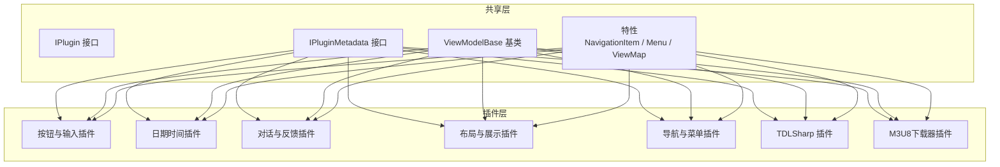
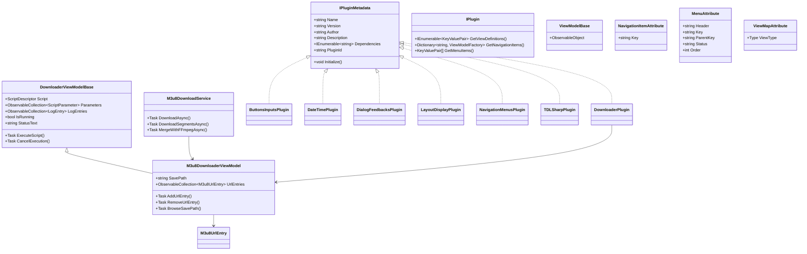
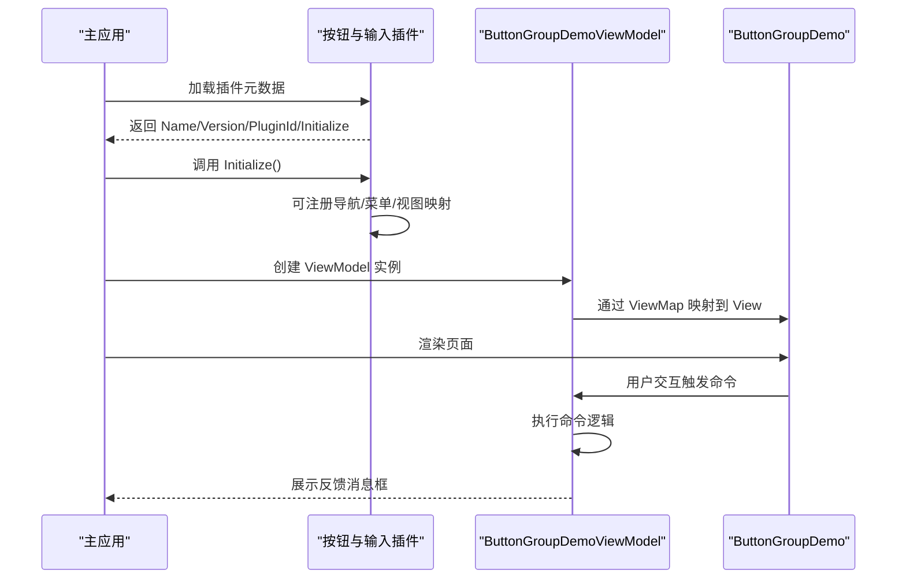
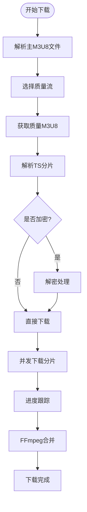
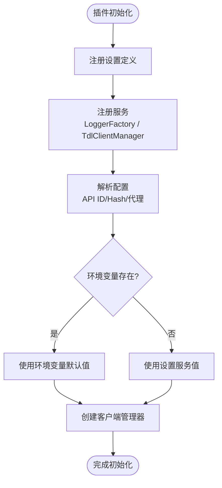

# 完整插件开发示例

<cite>
**本文引用的文件**
- [ButtonsInputsPlugin.cs](file://plugins/Avalonia.Plugin.ButtonsInputs/ButtonsInputsPlugin.cs)
- [DateTimePlugin.cs](file://plugins/Avalonia.Plugin.DateTime/DateTimePlugin.cs)
- [DialogFeedbacksPlugin.cs](file://plugins/Avalonia.Plugin.DialogFeedbacks/DialogFeedbacksPlugin.cs)
- [LayoutDisplayPlugin.cs](file://plugins/Avalonia.Plugin.LayoutDisplay/LayoutDisplayPlugin.cs)
- [NavigationMenusPlugin.cs](file://plugins/Avalonia.Plugin.NavigationMenus/NavigationMenusPlugin.cs)
- [TDLSharpPlugin.cs](file://plugins/Avalonia.Plugin.TDLSharp/TDLSharpPlugin.cs)
- [DownloaderPlugin.cs](file://plugins/Avalonia.Plugin.Downloader/DownloaderPlugin.cs)
- [ButtonGroupDemo.axaml.cs](file://plugins/Avalonia.Plugin.ButtonsInputs/Pages/ButtonGroupDemo.axaml.cs)
- [ButtonGroupDemoViewModel.cs](file://plugins/Avalonia.Plugin.ButtonsInputs/ViewModels/ButtonGroupDemoViewModel.cs)
- [ClockDemo.axaml.cs](file://plugins/Avalonia.Plugin.DateTime/Pages/ClockDemo.axaml.cs)
- [DialogDemo.axaml.cs](file://plugins/Avalonia.Plugin.DialogFeedbacks/Pages/DialogDemo.axaml.cs)
- [AvatarDemo.axaml.cs](file://plugins/Avalonia.Plugin.LayoutDisplay/Pages/AvatarDemo.axaml.cs)
- [NavMenuDemo.axaml.cs](file://plugins/Avalonia.Plugin.NavigationMenus/Pages/NavMenuDemo.axaml.cs)
- [M3u8DownloaderPage.axaml.cs](file://plugins/Avalonia.Plugin.Downloader/Pages/M3u8DownloaderPage.axaml.cs)
- [M3u8DownloaderViewModel.cs](file://plugins/Avalonia.Plugin.Downloader/ViewModels/M3u8DownloaderViewModel.cs)
- [DownloaderViewModelBase.cs](file://plugins/Avalonia.Plugin.Downloader/ViewModels/DownloaderViewModelBase.cs)
- [M3u8DownloadService.cs](file://plugins/Avalonia.Plugin.Downloader/Services/M3u8DownloadService.cs)
- [DirectUiLogger.cs](file://plugins/Avalonia.Plugin.Downloader/Services/DirectUiLogger.cs)
- [M3u8UrlEntry.cs](file://plugins/Avalonia.Plugin.Downloader/Models/M3u8UrlEntry.cs)
- [LogEntry.cs](file://plugins/Avalonia.Plugin.Downloader/Models/LogEntry.cs)
- [ScriptParameter.cs](file://plugins/Avalonia.Plugin.Downloader/Models/ScriptParameter.cs)
- [M3u8Models.cs](file://plugins/Avalonia.Plugin.Downloader/Models/M3u8Models.cs)
- [IPlugin.cs](file://src/Avalonia.Plugin.Shared/IPlugin.cs)
- [IPluginMetadata.cs](file://src/Avalonia.Plugin.Shared/IPluginMetadata.cs)
- [ViewModelBase.cs](file://src/Avalonia.Plugin.Shared/ViewModelBase.cs)
- [NavigationItemAttribute.cs](file://src/Avalonia.Plugin.Shared/Attributes/NavigationItemAttribute.cs)
- [MenuAttribute.cs](file://src/Avalonia.Plugin.Shared/Attributes/MenuAttribute.cs)
- [ViewMapAttribute.cs](file://src/Avalonia.Plugin.Shared/Attributes/ViewMapAttribute.cs)
</cite>

## 更新摘要
**变更内容**
- 新增M3U8下载器插件作为高级插件功能示例
- 添加多链接管理、文件名提取、进度跟踪等高级功能实现
- 完善插件架构分析，展示真实服务集成模式
- 更新依赖分析和故障排除指南

## 目录
1. [简介](#简介)
2. [项目结构](#项目结构)
3. [核心组件](#核心组件)
4. [架构总览](#架构总览)
5. [详细组件分析](#详细组件分析)
6. [依赖分析](#依赖分析)
7. [性能考虑](#性能考虑)
8. [故障排除指南](#故障排除指南)
9. [结论](#结论)
10. [附录](#附录)

## 简介
本教程围绕一套完整的 Avalonia 插件开发示例，系统讲解如何基于统一的插件框架构建不同类型的演示插件：按钮与输入控件、日期时间、对话与反馈、布局与展示、导航与菜单、**M3U8视频下载器**以及一个具备真实服务集成的 TDLSharp 插件。教程从基础插件元数据定义入手，逐步深入到界面设计、MVVM 模式、数据绑定、用户交互处理、插件间协作与资源共享等主题，帮助开发者掌握从简单到复杂的渐进式插件开发流程。

**更新** 新增M3U8下载器插件，展示高级插件功能实现，包括多链接管理、文件名提取、进度跟踪、加密解密、并发下载等复杂功能。

## 项目结构
该仓库采用"插件分目录 + 共享层"的组织方式：
- plugins 目录下包含多个功能插件子项目，每个插件负责一组相关的演示页面与视图模型。
- src/Avalonia.Plugin.Shared 提供插件通用接口、基类、特性与工具，统一了插件元数据、导航、菜单、视图映射等规范。
- 各插件通过特性标注（如 [NavigationItem]、[Menu]、[ViewMap]）声明自身在主应用中的可见性与路由关系。

**图表来源**
- [IPlugin.cs:1-81](file://src/Avalonia.Plugin.Shared/IPlugin.cs#L1-L81)
- [IPluginMetadata.cs:1-44](file://src/Avalonia.Plugin.Shared/IPluginMetadata.cs#L1-L44)
- [ViewModelBase.cs:1-12](file://src/Avalonia.Plugin.Shared/ViewModelBase.cs#L1-L12)
- [NavigationItemAttribute.cs:1-8](file://src/Avalonia.Plugin.Shared/Attributes/NavigationItemAttribute.cs#L1-L8)
- [MenuAttribute.cs:1-39](file://src/Avalonia.Plugin.Shared/Attributes/MenuAttribute.cs#L1-L39)
- [ViewMapAttribute.cs:1-9](file://src/Avalonia.Plugin.Shared/Attributes/ViewMapAttribute.cs#L1-L9)

**章节来源**
- [IPlugin.cs:1-81](file://src/Avalonia.Plugin.Shared/IPlugin.cs#L1-L81)
- [IPluginMetadata.cs:1-44](file://src/Avalonia.Plugin.Shared/IPluginMetadata.cs#L1-L44)
- [ViewModelBase.cs:1-12](file://src/Avalonia.Plugin.Shared/ViewModelBase.cs#L1-L12)

## 核心组件
- 插件元数据接口 IPluginMetadata：定义插件的基本信息（名称、版本、作者、描述、依赖、ID）与初始化入口 Initialize()。
- 插件接口 IPlugin：定义插件向宿主暴露的导航项、菜单项与视图映射能力。
- MVVM 基类 ViewModelBase：基于 CommunityToolkit.Mvvm 提供的可观测对象基类，简化属性变更通知与命令绑定。
- 特性系统：
  - [NavigationItem]：为 ViewModel 标注导航键，用于生成导航列表。
  - [Menu]：为 ViewModel 标注菜单项标题、键、父级与排序等信息。
  - [ViewMap]：将 ViewModel 与具体 View 进行类型映射，便于运行时自动解析。

**更新** 新增脚本参数系统，支持动态参数配置和执行流程管理。

**章节来源**
- [IPlugin.cs:1-81](file://src/Avalonia.Plugin.Shared/IPlugin.cs#L1-L81)
- [IPluginMetadata.cs:1-44](file://src/Avalonia.Plugin.Shared/IPluginMetadata.cs#L1-L44)
- [ViewModelBase.cs:1-12](file://src/Avalonia.Plugin.Shared/ViewModelBase.cs#L1-L12)
- [NavigationItemAttribute.cs:1-8](file://src/Avalonia.Plugin.Shared/Attributes/NavigationItemAttribute.cs#L1-L8)
- [MenuAttribute.cs:1-39](file://src/Avalonia.Plugin.Shared/Attributes/MenuAttribute.cs#L1-L39)
- [ViewMapAttribute.cs:1-9](file://src/Avalonia.Plugin.Shared/Attributes/ViewMapAttribute.cs#L1-L9)

## 架构总览
插件系统通过"元数据 + 特性 + 接口"三者协同工作：
- 插件类实现 IPluginMetadata 并使用 [GenerateMetadata] 生成元数据；可选择性实现 IPlugin 来提供导航、菜单与视图映射。
- ViewModel 通过特性标注自身在导航树与菜单树中的位置，并通过 [ViewMap] 绑定到对应的页面视图。
- 主应用根据插件提供的元数据与特性，动态构建导航、菜单与内容区域，实现模块化扩展。

**图表来源**
- [IPluginMetadata.cs:1-44](file://src/Avalonia.Plugin.Shared/IPluginMetadata.cs#L1-L44)
- [IPlugin.cs:1-81](file://src/Avalonia.Plugin.Shared/IPlugin.cs#L1-L81)
- [ViewModelBase.cs:1-12](file://src/Avalonia.Plugin.Shared/ViewModelBase.cs#L1-L12)
- [NavigationItemAttribute.cs:1-8](file://src/Avalonia.Plugin.Shared/Attributes/NavigationItemAttribute.cs#L1-L8)
- [MenuAttribute.cs:1-39](file://src/Avalonia.Plugin.Shared/Attributes/MenuAttribute.cs#L1-L39)
- [ViewMapAttribute.cs:1-9](file://src/Avalonia.Plugin.Shared/Attributes/ViewMapAttribute.cs#L1-L9)
- [DownloaderViewModelBase.cs:1-128](file://plugins/Avalonia.Plugin.Downloader/ViewModels/DownloaderViewModelBase.cs#L1-L128)
- [M3u8DownloaderViewModel.cs:1-138](file://plugins/Avalonia.Plugin.Downloader/ViewModels/M3u8DownloaderViewModel.cs#L1-L138)
- [M3u8DownloadService.cs:1-630](file://plugins/Avalonia.Plugin.Downloader/Services/M3u8DownloadService.cs#L1-L630)
- [ButtonsInputsPlugin.cs:1-100](file://plugins/Avalonia.Plugin.ButtonsInputs/ButtonsInputsPlugin.cs#L1-L100)
- [DateTimePlugin.cs:1-20](file://plugins/Avalonia.Plugin.DateTime/DateTimePlugin.cs#L1-L20)
- [DialogFeedbacksPlugin.cs:1-20](file://plugins/Avalonia.Plugin.DialogFeedbacks/DialogFeedbacksPlugin.cs#L1-L20)
- [LayoutDisplayPlugin.cs:1-20](file://plugins/Avalonia.Plugin.LayoutDisplay/LayoutDisplayPlugin.cs#L1-L20)
- [NavigationMenusPlugin.cs:1-20](file://plugins/Avalonia.Plugin.NavigationMenus/NavigationMenusPlugin.cs#L1-L20)
- [TDLSharpPlugin.cs:1-91](file://plugins/Avalonia.Plugin.TDLSharp/TDLSharpPlugin.cs#L1-L91)
- [DownloaderPlugin.cs:1-24](file://plugins/Avalonia.Plugin.Downloader/DownloaderPlugin.cs#L1-L24)

## 详细组件分析

### 按钮与输入插件（ButtonsInputs）
- 功能特性
  - 提供按钮组、图标按钮、自动完成框、类名输入、枚举选择器、表单、快捷键输入、IPv4 输入、多选下拉、数字微调器、数字小键盘、路径选择器、密码输入、范围滑条、评分、选择列表、标签输入、主题切换器、树形下拉等演示页面。
  - 通过特性标注 ViewModel，自动注册导航与菜单项，并建立 ViewModel 到 View 的映射。
- 技术实现
  - 插件类实现 IPluginMetadata，可按需实现 IPlugin 的导航、菜单与视图映射方法。
  - 示例 ViewModel 使用 ObservableCollection 维护按钮集合，使用 AsyncRelayCommand 实现异步命令，结合消息框进行用户反馈。
- 架构设计
  - 以特性驱动的声明式配置，降低样板代码，提升可维护性。
  - 页面与视图模型一一对应，遵循 MVVM 分离关注点原则。

**图表来源**
- [ButtonsInputsPlugin.cs:1-100](file://plugins/Avalonia.Plugin.ButtonsInputs/ButtonsInputsPlugin.cs#L1-L100)
- [ButtonGroupDemoViewModel.cs:1-46](file://plugins/Avalonia.Plugin.ButtonsInputs/ViewModels/ButtonGroupDemoViewModel.cs#L1-L46)
- [ButtonGroupDemo.axaml.cs:1-17](file://plugins/Avalonia.Plugin.ButtonsInputs/Pages/ButtonGroupDemo.axaml.cs#L1-L17)

**章节来源**
- [ButtonsInputsPlugin.cs:1-100](file://plugins/Avalonia.Plugin.ButtonsInputs/ButtonsInputsPlugin.cs#L1-L100)
- [ButtonGroupDemoViewModel.cs:1-46](file://plugins/Avalonia.Plugin.ButtonsInputs/ViewModels/ButtonGroupDemoViewModel.cs#L1-L46)
- [ButtonGroupDemo.axaml.cs:1-17](file://plugins/Avalonia.Plugin.ButtonsInputs/Pages/ButtonGroupDemo.axaml.cs#L1-L17)

### 日期时间插件（DateTime）
- 功能特性
  - 提供时钟、日期选择器、日期范围选择器、日期时间选择器、时间框、时间选择器、时间范围选择器等演示页面。
- 技术实现
  - 插件类实现 IPluginMetadata，提供基本元数据与空实现的 Initialize()。
- 架构设计
  - 轻量级插件模板，适合快速添加新演示页面，保持与主应用一致的导航与菜单风格。

**章节来源**
- [DateTimePlugin.cs:1-20](file://plugins/Avalonia.Plugin.DateTime/DateTimePlugin.cs#L1-L20)
- [ClockDemo.axaml.cs:1-17](file://plugins/Avalonia.Plugin.DateTime/Pages/ClockDemo.axaml.cs#L1-L17)

### 对话与反馈插件（DialogFeedbacks）
- 功能特性
  - 提供对话框、抽屉、加载、消息框、通知、弹出确认、骨架屏、吐司等反馈与交互演示。
- 技术实现
  - 插件类实现 IPluginMetadata，提供基本元数据与空实现的 Initialize()。
- 架构设计
  - 专注于用户反馈与交互提示，页面与视图模型一一对应，便于主应用统一管理样式与行为。

**章节来源**
- [DialogFeedbacksPlugin.cs:1-20](file://plugins/Avalonia.Plugin.DialogFeedbacks/DialogFeedbacksPlugin.cs#L1-L20)
- [DialogDemo.axaml.cs:1-17](file://plugins/Avalonia.Plugin.DialogFeedbacks/Pages/DialogDemo.axaml.cs#L1-L17)

### 布局与展示插件（LayoutDisplay）
- 功能特性
  - 提供纵横比布局、头像、徽章、横幅、描述列表、禁用容器、分割线、双徽章、弹性换行面板、图片查看器、跑马灯、数字显示器、二维码、滚动到顶部按钮、时间轴、双色路径图标等布局与展示控件演示。
- 技术实现
  - 插件类实现 IPluginMetadata，提供基本元数据与空实现的 Initialize()。
- 架构设计
  - 以展示为主，强调控件的视觉效果与使用场景，适合作为设计系统的一部分。

**章节来源**
- [LayoutDisplayPlugin.cs:1-20](file://plugins/Avalonia.Plugin.LayoutDisplay/LayoutDisplayPlugin.cs#L1-L20)
- [AvatarDemo.axaml.cs:1-17](file://plugins/Avalonia.Plugin.LayoutDisplay/Pages/AvatarDemo.axaml.cs#L1-L17)

### 导航与菜单插件（NavigationMenus）
- 功能特性
  - 提供锚点、面包屑、导航菜单、分页、工具栏等导航与菜单控件演示。
- 技术实现
  - 插件类实现 IPluginMetadata，提供基本元数据与空实现的 Initialize()。
- 架构设计
  - 专注于导航体验，页面与视图模型一一对应，便于主应用统一构建导航树。

**章节来源**
- [NavigationMenusPlugin.cs:1-20](file://plugins/Avalonia.Plugin.NavigationMenus/NavigationMenusPlugin.cs#L1-L20)
- [NavMenuDemo.axaml.cs:1-17](file://plugins/Avalonia.Plugin.NavigationMenus/Pages/NavMenuDemo.axaml.cs#L1-L17)

### M3U8下载器插件（高级功能示例）
- 功能特性
  - 支持多M3U8链接批量下载，自动解析质量选项并选择目标流。
  - 内置AES-128、AES-128-ECB、CHACHA20加密解密，支持SAMPLE-AES（需要许可证）。
  - 并发下载TS分片，智能重试机制，实时进度跟踪。
  - 自动文件名提取，FFmpeg合并，支持自定义HTTP请求头。
  - 完整的日志系统和状态管理。
- 技术实现
  - 基于 DownloaderViewModelBase 的脚本化执行框架，支持动态参数配置。
  - M3u8DownloadService 提供完整的下载流程，包括M3U8解析、加密解密、并发下载、FFmpeg合并。
  - M3u8UrlEntry 支持手动指定文件名，自动从URL提取文件名。
  - DirectUiLogger 提供UI日志输出，支持实时进度更新。
- 架构设计
  - 采用分层架构：ViewModel负责UI交互和参数管理，Service负责业务逻辑，Model负责数据结构。
  - 支持取消操作和异常处理，提供完整的用户体验。

**图表来源**
- [M3u8DownloadService.cs:19-124](file://plugins/Avalonia.Plugin.Downloader/Services/M3u8DownloadService.cs#L19-L124)
- [M3u8DownloaderViewModel.cs:74-118](file://plugins/Avalonia.Plugin.Downloader/ViewModels/M3u8DownloaderViewModel.cs#L74-L118)

**章节来源**
- [DownloaderPlugin.cs:1-24](file://plugins/Avalonia.Plugin.Downloader/DownloaderPlugin.cs#L1-L24)
- [M3u8DownloaderPage.axaml.cs:1-42](file://plugins/Avalonia.Plugin.Downloader/Pages/M3u8DownloaderPage.axaml.cs#L1-L42)
- [M3u8DownloaderViewModel.cs:1-138](file://plugins/Avalonia.Plugin.Downloader/ViewModels/M3u8DownloaderViewModel.cs#L1-L138)
- [DownloaderViewModelBase.cs:1-128](file://plugins/Avalonia.Plugin.Downloader/ViewModels/DownloaderViewModelBase.cs#L1-L128)
- [M3u8DownloadService.cs:1-630](file://plugins/Avalonia.Plugin.Downloader/Services/M3u8DownloadService.cs#L1-L630)

### TDLSharp 插件（服务集成示例）
- 功能特性
  - 集成 Telegram TDLib，提供批量转发、消息导出、媒体下载等功能的演示页面。
  - 支持通过设置服务注册与读取 API ID/Hash、代理服务器与端口、代理开关等配置。
- 技术实现
  - 在 Initialize() 中注册设置与服务，使用 ServiceLocator 注册 ILoggerFactory 与 TdlClientManager。
  - 通过环境变量或设置服务读取配置，解析为强类型参数。
- 架构设计
  - 将外部服务封装为可注入的服务，支持运行时配置与日志记录，体现真实工程中的插件实践。

**图表来源**
- [TDLSharpPlugin.cs:1-91](file://plugins/Avalonia.Plugin.TDLSharp/TDLSharpPlugin.cs#L1-L91)

**章节来源**
- [TDLSharpPlugin.cs:1-91](file://plugins/Avalonia.Plugin.TDLSharp/TDLSharpPlugin.cs#L1-L91)

## 依赖分析
- 插件对共享层的依赖
  - 所有插件均依赖 Avalonia.Plugin.Shared 提供的接口、基类与特性，确保元数据与导航/菜单/视图映射的一致性。
- 插件间的协作
  - 插件之间无直接耦合，通过共享层的统一接口与特性进行协作。
  - TDLSharp 插件通过 ServiceLocator 注入服务，其他插件可按需引入共享服务或自行注册所需服务。
  - **新增** M3U8下载器插件依赖CliWrap库进行FFmpeg调用，展示插件可集成第三方库的能力。
- 外部依赖
  - 按钮与输入插件示例中使用了社区命令库（CommunityToolkit.Mvvm）与 Ursa 控件库，体现了插件可自由选择第三方库的灵活性。
  - **更新** M3U8下载器插件额外依赖CliWrap库用于FFmpeg进程管理。

**章节来源**
- [IPlugin.cs:1-81](file://src/Avalonia.Plugin.Shared/IPlugin.cs#L1-L81)
- [IPluginMetadata.cs:1-44](file://src/Avalonia.Plugin.Shared/IPluginMetadata.cs#L1-L44)
- [ButtonGroupDemoViewModel.cs:1-46](file://plugins/Avalonia.Plugin.ButtonsInputs/ViewModels/ButtonGroupDemoViewModel.cs#L1-L46)
- [M3u8DownloadService.cs:6](file://plugins/Avalonia.Plugin.Downloader/Services/M3u8DownloadService.cs#L6)

## 性能考虑
- 页面与视图模型分离：通过特性驱动的映射减少运行时反射开销，提高启动效率。
- 异步命令：使用 AsyncRelayCommand 处理耗时操作，避免阻塞 UI 线程。
- 设置与环境变量：优先使用设置服务，其次回退到环境变量，减少重复解析成本。
- 服务注册：集中于 Initialize() 中完成，避免在构造函数中执行重任务。
- **新增** 并发控制：M3U8下载器使用信号量控制并发下载，避免资源过度占用。
- **新增** 内存管理：实时日志限制在1000条以内，防止内存泄漏。
- **新增** 进度优化：批量日志输出，减少UI刷新频率。

## 故障排除指南
- 插件未出现在导航或菜单中
  - 检查 ViewModel 是否正确标注 [NavigationItem] 与 [Menu]。
  - 确认插件类是否实现 IPlugin 的相应方法并返回有效数据。
- 页面无法渲染
  - 检查 [ViewMap] 是否正确映射到对应的页面类型。
  - 确认页面的 .axaml.cs 文件已正确初始化。
- 设置读取失败
  - 检查设置键是否与注册时一致。
  - 确认环境变量键是否存在且拼写正确。
- 服务注入异常
  - 确认 Initialize() 中已注册所需服务。
  - 检查 ServiceLocator 的生命周期与作用域。
- **新增** M3U8下载失败
  - 检查网络连接和M3U8链接有效性。
  - 确认FFmpeg可执行文件路径正确。
  - 查看日志输出获取具体错误信息。
- **新增** 加密流下载失败
  - 确认加密方式受支持（AES-128、AES-128-ECB、CHACHA20）。
  - 检查密钥获取权限和网络访问。
- **新增** 并发下载问题
  - 调整并发数参数，避免过多并发导致资源不足。
  - 检查磁盘空间和临时文件夹权限。

**章节来源**
- [MenuAttribute.cs:1-39](file://src/Avalonia.Plugin.Shared/Attributes/MenuAttribute.cs#L1-L39)
- [NavigationItemAttribute.cs:1-8](file://src/Avalonia.Plugin.Shared/Attributes/NavigationItemAttribute.cs#L1-L8)
- [ViewMapAttribute.cs:1-9](file://src/Avalonia.Plugin.Shared/Attributes/ViewMapAttribute.cs#L1-L9)
- [TDLSharpPlugin.cs:1-91](file://plugins/Avalonia.Plugin.TDLSharp/TDLSharpPlugin.cs#L1-L91)
- [M3u8DownloadService.cs:112-116](file://plugins/Avalonia.Plugin.Downloader/Services/M3u8DownloadService.cs#L112-L116)

## 结论
本教程展示了如何基于统一的插件框架，快速构建多种类型的演示插件。通过特性驱动的声明式配置、MVVM 模式与服务注入，插件既能保持独立性，又能与主应用无缝协作。**新增的M3U8下载器插件**进一步展示了高级插件功能的实现模式，包括多链接管理、文件名提取、进度跟踪、加密解密、并发下载等复杂功能。对于需要集成外部服务的场景（如 TDLSharp 和 M3U8下载器），插件提供了可扩展的设置与服务注册机制，便于在不破坏插件边界的前提下实现复杂功能。

## 附录
- 渐进式开发建议
  - 第一步：创建最小插件（仅实现 IPluginMetadata 与 Initialize），验证加载与元数据展示。
  - 第二步：添加一个简单页面与 ViewModel，使用 [NavigationItem] 与 [ViewMap] 进行映射。
  - 第三步：引入 [Menu] 特性，完善菜单树结构。
  - 第四步：集成设置服务与外部服务，实现真实业务逻辑。
  - **新增** 第五步：实现脚本化执行框架，支持动态参数配置和复杂业务流程。
- 最佳实践
  - 使用特性标注替代硬编码，提升可维护性。
  - 将 UI 与逻辑分离，保持 ViewModel 的纯净性。
  - 在 Initialize() 中集中注册设置与服务，避免分散初始化。
  - 为每个插件提供清晰的导航与菜单入口，便于用户发现与使用。
  - **新增** 合理使用并发控制，避免资源竞争和性能问题。
  - **新增** 实现完善的错误处理和日志系统，提升用户体验。
  - **新增** 考虑内存管理和资源清理，防止内存泄漏。