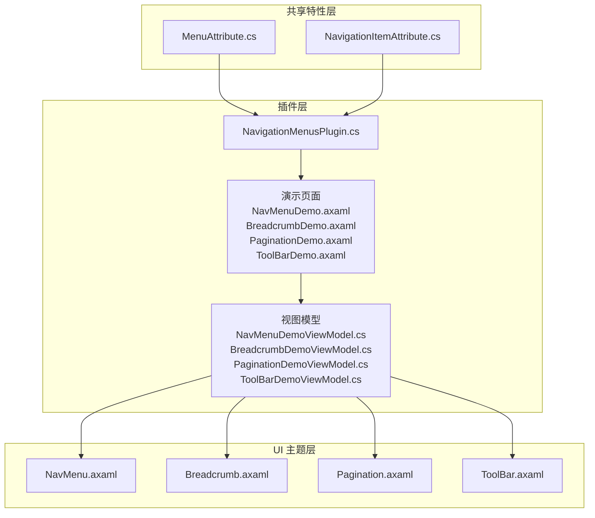
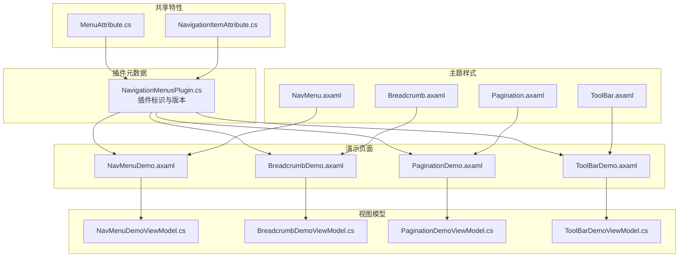
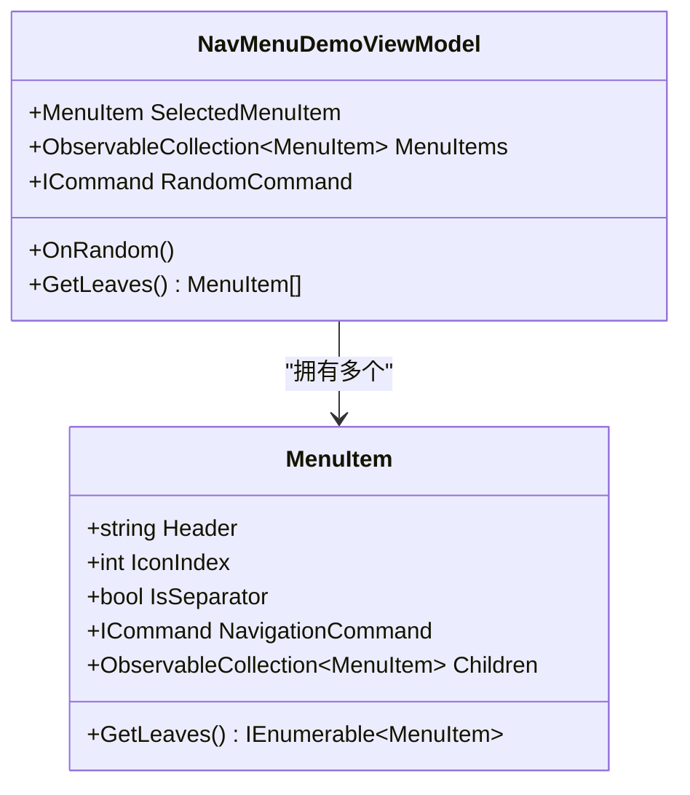
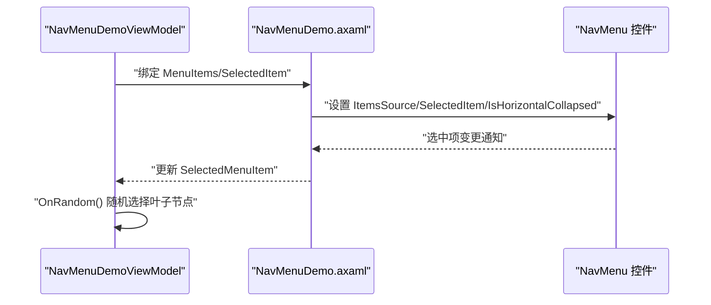
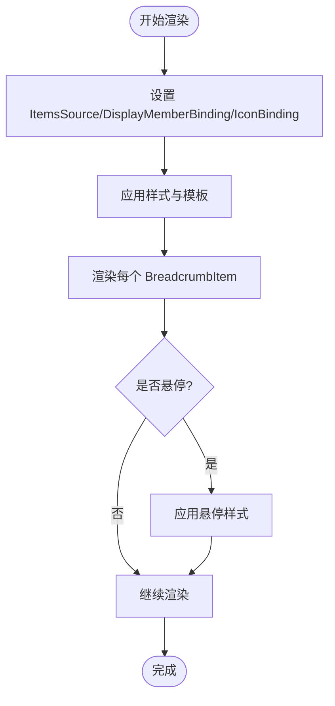
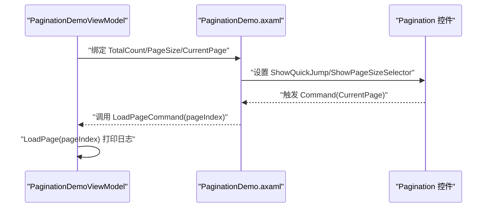
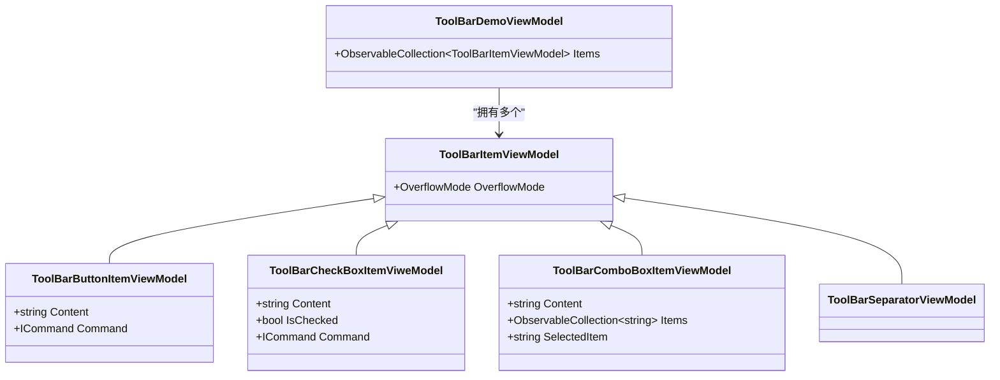
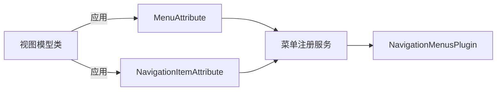

# 导航菜单插件开发

<cite>
**本文档引用的文件**
- [NavigationMenusPlugin.cs](file://plugins/Avalonia.Plugin.NavigationMenus/NavigationMenusPlugin.cs)
- [NavMenu.axaml](file://src/Avalonia.UI/Theme/Controls/NavMenu.axaml)
- [Breadcrumb.axaml](file://src/Avalonia.UI/Theme/Controls/Breadcrumb.axaml)
- [Pagination.axaml](file://src/Avalonia.UI/Theme/Controls/Pagination.axaml)
- [ToolBar.axaml](file://src/Avalonia.UI/Theme/Controls/ToolBar.axaml)
- [NavMenuDemo.axaml](file://plugins/Avalonia.Plugin.NavigationMenus/Pages/NavMenuDemo.axaml)
- [BreadcrumbDemo.axaml](file://plugins/Avalonia.Plugin.NavigationMenus/Pages/BreadcrumbDemo.axaml)
- [PaginationDemo.axaml](file://plugins/Avalonia.Plugin.NavigationMenus/Pages/PaginationDemo.axaml)
- [ToolBarDemo.axaml](file://plugins/Avalonia.Plugin.NavigationMenus/Pages/ToolBarDemo.axaml)
- [NavMenuDemoViewModel.cs](file://plugins/Avalonia.Plugin.NavigationMenus/ViewModels/NavMenuDemoViewModel.cs)
- [BreadcrumbDemoViewModel.cs](file://plugins/Avalonia.Plugin.NavigationMenus/ViewModels/BreadcrumbDemoViewModel.cs)
- [PaginationDemoViewModel.cs](file://plugins/Avalonia.Plugin.NavigationMenus/ViewModels/PaginationDemoViewModel.cs)
- [ToolBarDemoViewModel.cs](file://plugins/Avalonia.Plugin.NavigationMenus/ViewModels/ToolBarDemoViewModel.cs)
- [MenuAttribute.cs](file://src/Avalonia.Plugin.Shared/Attributes/MenuAttribute.cs)
- [NavigationItemAttribute.cs](file://src/Avalonia.Plugin.Shared/Attributes/NavigationItemAttribute.cs)
</cite>

## 目录
1. [简介](#简介)
2. [项目结构](#项目结构)
3. [核心组件](#核心组件)
4. [架构概览](#架构概览)
5. [详细组件分析](#详细组件分析)
6. [依赖关系分析](#依赖关系分析)
7. [性能考虑](#性能考虑)
8. [故障排除指南](#故障排除指南)
9. [结论](#结论)

## 简介
本教程基于 AvaloniaTemplate 项目中的 NavigationMenus 插件，系统讲解如何开发提供导航功能的插件。重点覆盖以下导航组件的开发方法：
- 菜单层级管理：NavMenu 的多级菜单结构与折叠展开逻辑
- 面包屑导航：Breadcrumb 的路径导航与交互处理
- 分页控制：Pagination 的页面跳转与数据加载
- 工具栏：ToolBar 的溢出布局与工具集组织

同时，文档将展示导航状态管理、路由处理和用户体验优化策略，并解释插件的导航注册机制、菜单动态生成以及权限控制集成方式。最后提供架构设计、性能优化与可扩展性的实践指导。

## 项目结构
NavigationMenus 插件位于 plugins/Avalonia.Plugin.NavigationMenus 目录下，采用“插件 + 演示页面 + 视图模型”的标准分层组织：
- 插件元数据：NavigationMenusPlugin.cs 提供插件标识与版本信息
- 控件主题：src/Avalonia.UI/Theme/Controls 下包含 NavMenu、Breadcrumb、Pagination、ToolBar 的样式定义
- 演示页面：Pages 目录包含各组件的演示页面（NavMenuDemo.axaml、BreadcrumbDemo.axaml、PaginationDemo.axaml、ToolBarDemo.axaml）
- 视图模型：ViewModels 目录包含对应演示页面的视图模型（NavMenuDemoViewModel.cs、BreadcrumbDemoViewModel.cs、PaginationDemoViewModel.cs、ToolBarDemoViewModel.cs）
- 共享属性：src/Avalonia.Plugin.Shared/Attributes 提供菜单注册与导航项映射的特性支持

**图表来源**
- [NavigationMenusPlugin.cs:1-20](file://plugins/Avalonia.Plugin.NavigationMenus/NavigationMenusPlugin.cs#L1-L20)
- [NavMenuDemo.axaml:1-123](file://plugins/Avalonia.Plugin.NavigationMenus/Pages/NavMenuDemo.axaml#L1-L123)
- [BreadcrumbDemo.axaml:1-59](file://plugins/Avalonia.Plugin.NavigationMenus/Pages/BreadcrumbDemo.axaml#L1-L59)
- [PaginationDemo.axaml:1-39](file://plugins/Avalonia.Plugin.NavigationMenus/Pages/PaginationDemo.axaml#L1-L39)
- [ToolBarDemo.axaml:1-134](file://plugins/Avalonia.Plugin.NavigationMenus/Pages/ToolBarDemo.axaml#L1-L134)
- [NavMenuDemoViewModel.cs:1-140](file://plugins/Avalonia.Plugin.NavigationMenus/ViewModels/NavMenuDemoViewModel.cs#L1-L140)
- [BreadcrumbDemoViewModel.cs:1-48](file://plugins/Avalonia.Plugin.NavigationMenus/ViewModels/BreadcrumbDemoViewModel.cs#L1-L48)
- [PaginationDemoViewModel.cs:1-34](file://plugins/Avalonia.Plugin.NavigationMenus/ViewModels/PaginationDemoViewModel.cs#L1-L34)
- [ToolBarDemoViewModel.cs:1-96](file://plugins/Avalonia.Plugin.NavigationMenus/ViewModels/ToolBarDemoViewModel.cs#L1-L96)
- [MenuAttribute.cs:1-39](file://src/Avalonia.Plugin.Shared/Attributes/MenuAttribute.cs#L1-L39)
- [NavigationItemAttribute.cs:1-8](file://src/Avalonia.Plugin.Shared/Attributes/NavigationItemAttribute.cs#L1-L8)

**章节来源**
- [NavigationMenusPlugin.cs:1-20](file://plugins/Avalonia.Plugin.NavigationMenus/NavigationMenusPlugin.cs#L1-L20)
- [NavMenuDemo.axaml:1-123](file://plugins/Avalonia.Plugin.NavigationMenus/Pages/NavMenuDemo.axaml#L1-L123)
- [BreadcrumbDemo.axaml:1-59](file://plugins/Avalonia.Plugin.NavigationMenus/Pages/BreadcrumbDemo.axaml#L1-L59)
- [PaginationDemo.axaml:1-39](file://plugins/Avalonia.Plugin.NavigationMenus/Pages/PaginationDemo.axaml#L1-L39)
- [ToolBarDemo.axaml:1-134](file://plugins/Avalonia.Plugin.NavigationMenus/Pages/ToolBarDemo.axaml#L1-L134)

## 核心组件
本节概述四个导航组件的关键职责与协作关系：
- NavMenu：提供多级菜单树，支持水平折叠/展开、图标绑定、子菜单绑定、选中项管理与动画过渡
- Breadcrumb：展示当前路径，支持只读项、图标与分隔符配置，以及点击导航
- Pagination：提供上一页/下一页、页码按钮、快速跳转与页大小选择，支持 Tiny 主题
- ToolBar：组织工具按钮、分隔符与输入控件，支持溢出弹出与方向切换

这些组件均通过 Avalonia 的样式系统（ControlTheme）进行主题化，并在演示页面中以数据绑定的方式与视图模型交互。

**章节来源**
- [NavMenu.axaml:1-290](file://src/Avalonia.UI/Theme/Controls/NavMenu.axaml#L1-L290)
- [Breadcrumb.axaml:1-96](file://src/Avalonia.UI/Theme/Controls/Breadcrumb.axaml#L1-L96)
- [Pagination.axaml:1-184](file://src/Avalonia.UI/Theme/Controls/Pagination.axaml#L1-L184)
- [ToolBar.axaml:1-139](file://src/Avalonia.UI/Theme/Controls/ToolBar.axaml#L1-L139)

## 架构概览
导航菜单插件采用“插件元数据 + 主题样式 + 演示页面 + 视图模型”的分层架构。插件元数据负责声明插件信息；主题样式定义控件外观与交互；演示页面展示控件用法；视图模型承载业务状态与命令。

**图表来源**
- [NavigationMenusPlugin.cs:1-20](file://plugins/Avalonia.Plugin.NavigationMenus/NavigationMenusPlugin.cs#L1-L20)
- [NavMenu.axaml:1-290](file://src/Avalonia.UI/Theme/Controls/NavMenu.axaml#L1-L290)
- [Breadcrumb.axaml:1-96](file://src/Avalonia.UI/Theme/Controls/Breadcrumb.axaml#L1-L96)
- [Pagination.axaml:1-184](file://src/Avalonia.UI/Theme/Controls/Pagination.axaml#L1-L184)
- [ToolBar.axaml:1-139](file://src/Avalonia.UI/Theme/Controls/ToolBar.axaml#L1-L139)
- [NavMenuDemo.axaml:1-123](file://plugins/Avalonia.Plugin.NavigationMenus/Pages/NavMenuDemo.axaml#L1-L123)
- [BreadcrumbDemo.axaml:1-59](file://plugins/Avalonia.Plugin.NavigationMenus/Pages/BreadcrumbDemo.axaml#L1-L59)
- [PaginationDemo.axaml:1-39](file://plugins/Avalonia.Plugin.NavigationMenus/Pages/PaginationDemo.axaml#L1-L39)
- [ToolBarDemo.axaml:1-134](file://plugins/Avalonia.Plugin.NavigationMenus/Pages/ToolBarDemo.axaml#L1-L134)
- [NavMenuDemoViewModel.cs:1-140](file://plugins/Avalonia.Plugin.NavigationMenus/ViewModels/NavMenuDemoViewModel.cs#L1-L140)
- [BreadcrumbDemoViewModel.cs:1-48](file://plugins/Avalonia.Plugin.NavigationMenus/ViewModels/BreadcrumbDemoViewModel.cs#L1-L48)
- [PaginationDemoViewModel.cs:1-34](file://plugins/Avalonia.Plugin.NavigationMenus/ViewModels/PaginationDemoViewModel.cs#L1-L34)
- [ToolBarDemoViewModel.cs:1-96](file://plugins/Avalonia.Plugin.NavigationMenus/ViewModels/ToolBarDemoViewModel.cs#L1-L96)
- [MenuAttribute.cs:1-39](file://src/Avalonia.Plugin.Shared/Attributes/MenuAttribute.cs#L1-L39)
- [NavigationItemAttribute.cs:1-8](file://src/Avalonia.Plugin.Shared/Attributes/NavigationItemAttribute.cs#L1-L8)

## 详细组件分析

### NavMenu 组件分析
NavMenu 是一个多级菜单控件，支持：
- 层级缩进与子菜单展开/收起
- 图标与标题绑定、选中项管理
- 水平折叠模式下的工具提示与布局优化
- 动画过渡效果（宽度变化、内容显隐）

**图表来源**
- [NavMenuDemoViewModel.cs:15-140](file://plugins/Avalonia.Plugin.NavigationMenus/ViewModels/NavMenuDemoViewModel.cs#L15-L140)

演示页面通过数据绑定将菜单数据源、选中项与命令传递给 NavMenu，并使用样式为菜单项设置分隔符属性。

**图表来源**
- [NavMenuDemo.axaml:35-82](file://plugins/Avalonia.Plugin.NavigationMenus/Pages/NavMenuDemo.axaml#L35-L82)
- [NavMenuDemoViewModel.cs:70-93](file://plugins/Avalonia.Plugin.NavigationMenus/ViewModels/NavMenuDemoViewModel.cs#L70-L93)

**章节来源**
- [NavMenu.axaml:1-290](file://src/Avalonia.UI/Theme/Controls/NavMenu.axaml#L1-L290)
- [NavMenuDemo.axaml:1-123](file://plugins/Avalonia.Plugin.NavigationMenus/Pages/NavMenuDemo.axaml#L1-L123)
- [NavMenuDemoViewModel.cs:1-140](file://plugins/Avalonia.Plugin.NavigationMenus/ViewModels/NavMenuDemoViewModel.cs#L1-L140)

### Breadcrumb 组件分析
Breadcrumb 用于展示当前路径，支持：
- 图标与内容绑定、分隔符配置
- 只读项样式与悬停效果
- 小尺寸主题与自定义样式

**图表来源**
- [Breadcrumb.axaml:1-96](file://src/Avalonia.UI/Theme/Controls/Breadcrumb.axaml#L1-L96)
- [BreadcrumbDemo.axaml:18-57](file://plugins/Avalonia.Plugin.NavigationMenus/Pages/BreadcrumbDemo.axaml#L18-L57)

**章节来源**
- [Breadcrumb.axaml:1-96](file://src/Avalonia.UI/Theme/Controls/Breadcrumb.axaml#L1-L96)
- [BreadcrumbDemo.axaml:1-59](file://plugins/Avalonia.Plugin.NavigationMenus/Pages/BreadcrumbDemo.axaml#L1-L59)
- [BreadcrumbDemoViewModel.cs:1-48](file://plugins/Avalonia.Plugin.NavigationMenus/ViewModels/BreadcrumbDemoViewModel.cs#L1-L48)

### Pagination 组件分析
Pagination 提供分页控制，支持：
- 上一页/下一页按钮
- 页码按钮集合与快速跳转
- 页大小选择器
- Tiny 主题与只读模式

**图表来源**
- [PaginationDemo.axaml:23-36](file://plugins/Avalonia.Plugin.NavigationMenus/Pages/PaginationDemo.axaml#L23-L36)
- [PaginationDemoViewModel.cs:14-28](file://plugins/Avalonia.Plugin.NavigationMenus/ViewModels/PaginationDemoViewModel.cs#L14-L28)
- [Pagination.axaml:1-184](file://src/Avalonia.UI/Theme/Controls/Pagination.axaml#L1-L184)

**章节来源**
- [PaginationDemo.axaml:1-39](file://plugins/Avalonia.Plugin.NavigationMenus/Pages/PaginationDemo.axaml#L1-L39)
- [PaginationDemoViewModel.cs:1-34](file://plugins/Avalonia.Plugin.NavigationMenus/ViewModels/PaginationDemoViewModel.cs#L1-L34)
- [Pagination.axaml:1-184](file://src/Avalonia.UI/Theme/Controls/Pagination.axaml#L1-L184)

### ToolBar 组件分析
ToolBar 用于组织工具按钮、分隔符与输入控件，支持：
- 水平/垂直方向切换
- 溢出弹出面板与按钮可见性控制
- 自定义项模板与溢出模式

**图表来源**
- [ToolBarDemoViewModel.cs:15-96](file://plugins/Avalonia.Plugin.NavigationMenus/ViewModels/ToolBarDemoViewModel.cs#L15-L96)

**章节来源**
- [ToolBar.axaml:1-139](file://src/Avalonia.UI/Theme/Controls/ToolBar.axaml#L1-L139)
- [ToolBarDemo.axaml:1-134](file://plugins/Avalonia.Plugin.NavigationMenus/Pages/ToolBarDemo.axaml#L1-L134)
- [ToolBarDemoViewModel.cs:1-96](file://plugins/Avalonia.Plugin.NavigationMenus/ViewModels/ToolBarDemoViewModel.cs#L1-L96)

## 依赖关系分析
插件的导航注册机制通过共享特性实现：
- MenuAttribute：用于标记 ViewModel 并生成菜单项，包含标题、键、父键、状态与排序
- NavigationItemAttribute：用于标记导航项键，与菜单注册配合工作

**图表来源**
- [MenuAttribute.cs:1-39](file://src/Avalonia.Plugin.Shared/Attributes/MenuAttribute.cs#L1-L39)
- [NavigationItemAttribute.cs:1-8](file://src/Avalonia.Plugin.Shared/Attributes/NavigationItemAttribute.cs#L1-L8)
- [NavigationMenusPlugin.cs:1-20](file://plugins/Avalonia.Plugin.NavigationMenus/NavigationMenusPlugin.cs#L1-L20)

**章节来源**
- [MenuAttribute.cs:1-39](file://src/Avalonia.Plugin.Shared/Attributes/MenuAttribute.cs#L1-L39)
- [NavigationItemAttribute.cs:1-8](file://src/Avalonia.Plugin.Shared/Attributes/NavigationItemAttribute.cs#L1-L8)
- [NavigationMenusPlugin.cs:1-20](file://plugins/Avalonia.Plugin.NavigationMenus/NavigationMenusPlugin.cs#L1-L20)

## 性能考虑
- 控件动画与过渡：NavMenu 与 ToolBar 使用过渡动画提升交互体验，但需注意在大量子项时的渲染开销
- 数据绑定优化：使用 ObservableCollection 以减少 UI 刷新成本；避免在绑定中执行复杂计算
- 溢出布局：ToolBar 的溢出弹出仅在需要时显示，减少主工具栏的布局压力
- 分页加载：Pagination 的命令参数仅传递当前页索引，避免不必要的数据传输

[本节为通用性能建议，无需特定文件引用]

## 故障排除指南
- 菜单不显示或显示异常：检查 NavMenu 的 ItemsSource、SubMenuBinding 与 HeaderBinding 是否正确设置
- 选中项未更新：确认 SelectedItem 绑定与视图模型属性变更通知是否生效
- 面包屑点击无响应：验证 BreadcrumbItem 的 IsReadOnly 设置与 Command 绑定
- 分页命令未触发：检查 Pagination 的 Command 与 CommandParameter 绑定，确保 CurrentPage 值有效
- ToolBar 溢出按钮不出现：确认 OverflowMode 设置与容器尺寸是否允许溢出

**章节来源**
- [NavMenuDemo.axaml:35-82](file://plugins/Avalonia.Plugin.NavigationMenus/Pages/NavMenuDemo.axaml#L35-L82)
- [BreadcrumbDemo.axaml:18-57](file://plugins/Avalonia.Plugin.NavigationMenus/Pages/BreadcrumbDemo.axaml#L18-L57)
- [PaginationDemo.axaml:23-36](file://plugins/Avalonia.Plugin.NavigationMenus/Pages/PaginationDemo.axaml#L23-L36)
- [ToolBarDemo.axaml:17-67](file://plugins/Avalonia.Plugin.NavigationMenus/Pages/ToolBarDemo.axaml#L17-L67)

## 结论
通过 NavigationMenus 插件，我们展示了如何在 Avalonia 中构建完整的导航体系：从插件元数据到主题样式，再到演示页面与视图模型的协同工作。NavMenu 实现了灵活的多级菜单与折叠模式；Breadcrumb 提供清晰的路径指示；Pagination 支持高效的数据分页；ToolBar 则组织了丰富的工具集。结合共享特性，插件实现了自动化的菜单注册与导航项映射，便于扩展与维护。遵循本文档的架构设计、性能优化与可扩展性建议，可以快速开发高质量的导航组件插件。