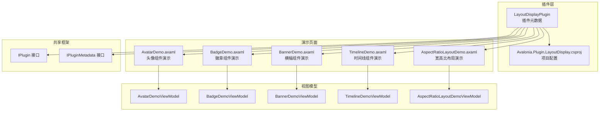
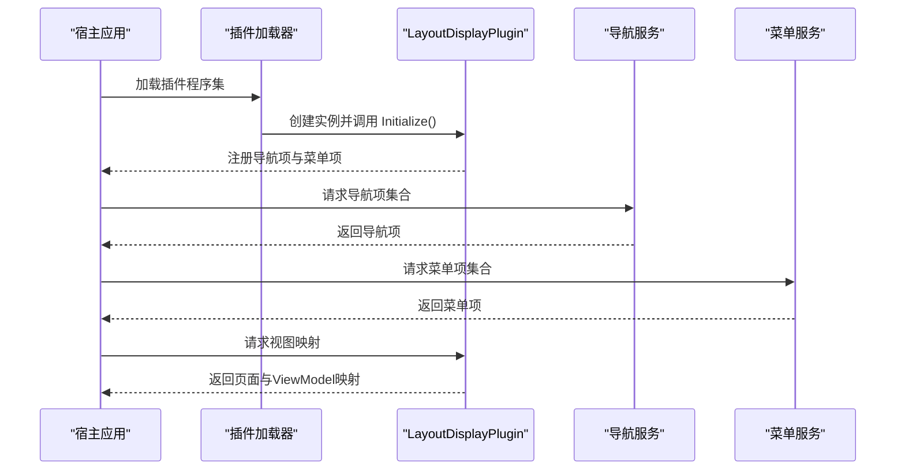
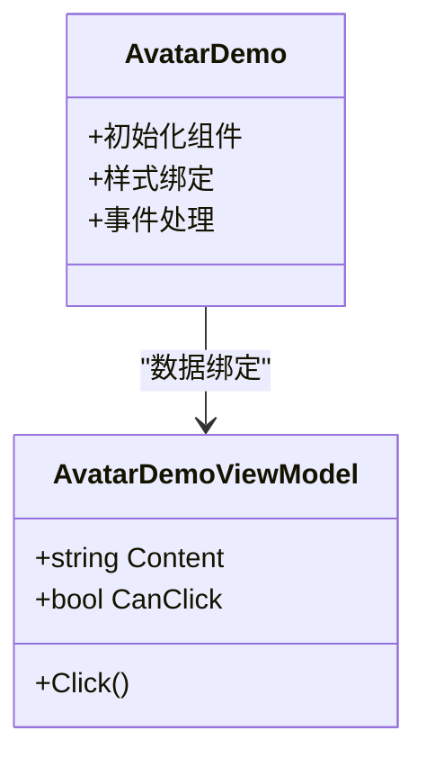
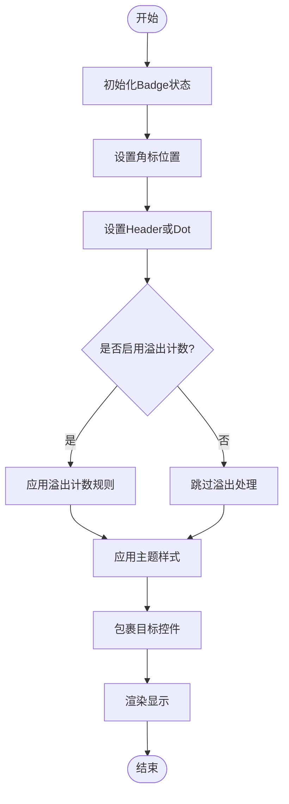
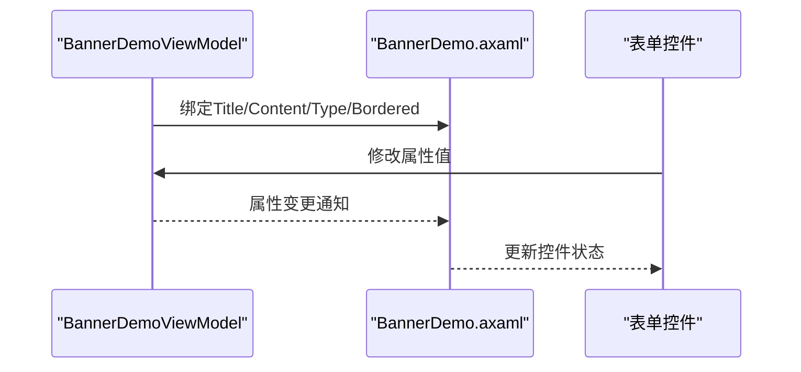
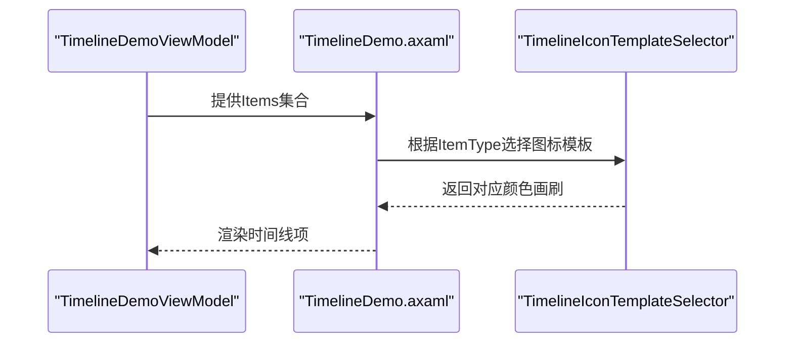
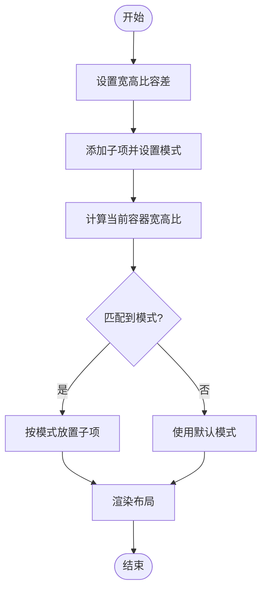
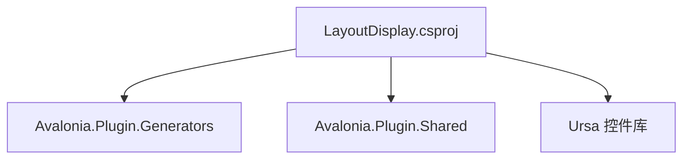

# 布局显示插件开发

<cite>
**本文档引用的文件**
- [LayoutDisplayPlugin.cs](file://plugins/Avalonia.Plugin.LayoutDisplay/LayoutDisplayPlugin.cs)
- [Avalonia.Plugin.LayoutDisplay.csproj](file://plugins/Avalonia.Plugin.LayoutDisplay/Avalonia.Plugin.LayoutDisplay.csproj)
- [IPlugin.cs](file://src/Avalonia.Plugin.Shared/IPlugin.cs)
- [IPluginMetadata.cs](file://src/Avalonia.Plugin.Shared/IPluginMetadata.cs)
- [AvatarDemo.axaml](file://plugins/Avalonia.Plugin.LayoutDisplay/Pages/AvatarDemo.axaml)
- [AvatarDemo.axaml.cs](file://plugins/Avalonia.Plugin.LayoutDisplay/Pages/AvatarDemo.axaml.cs)
- [AvatarDemoViewModel.cs](file://plugins/Avalonia.Plugin.LayoutDisplay/ViewModels/AvatarDemoViewModel.cs)
- [BadgeDemo.axaml](file://plugins/Avalonia.Plugin.LayoutDisplay/Pages/BadgeDemo.axaml)
- [BadgeDemo.axaml.cs](file://plugins/Avalonia.Plugin.LayoutDisplay/Pages/BadgeDemo.axaml.cs)
- [BadgeDemoViewModel.cs](file://plugins/Avalonia.Plugin.LayoutDisplay/ViewModels/BadgeDemoViewModel.cs)
- [BannerDemo.axaml](file://plugins/Avalonia.Plugin.LayoutDisplay/Pages/BannerDemo.axaml)
- [BannerDemo.axaml.cs](file://plugins/Avalonia.Plugin.LayoutDisplay/Pages/BannerDemo.axaml.cs)
- [BannerDemoViewModel.cs](file://plugins/Avalonia.Plugin.LayoutDisplay/ViewModels/BannerDemoViewModel.cs)
- [TimelineDemo.axaml](file://plugins/Avalonia.Plugin.LayoutDisplay/Pages/TimelineDemo.axaml)
- [TimelineDemo.axaml.cs](file://plugins/Avalonia.Plugin.LayoutDisplay/Pages/TimelineDemo.axaml.cs)
- [TimelineDemoViewModel.cs](file://plugins/Avalonia.Plugin.LayoutDisplay/ViewModels/TimelineDemoViewModel.cs)
- [AspectRatioLayoutDemo.axaml](file://plugins/Avalonia.Plugin.LayoutDisplay/Pages/AspectRatioLayoutDemo.axaml)
- [AspectRatioLayoutDemo.axaml.cs](file://plugins/Avalonia.Plugin.LayoutDisplay/Pages/AspectRatioLayoutDemo.axaml.cs)
- [AspectRatioLayoutDemoViewModel.cs](file://plugins/Avalonia.Plugin.LayoutDisplay/ViewModels/AspectRatioLayoutDemoViewModel.cs)
</cite>

## 目录
1. [简介](#简介)
2. [项目结构](#项目结构)
3. [核心组件](#核心组件)
4. [架构概览](#架构概览)
5. [详细组件分析](#详细组件分析)
6. [依赖分析](#依赖分析)
7. [性能考虑](#性能考虑)
8. [故障排除指南](#故障排除指南)
9. [结论](#结论)
10. [附录](#附录)

## 简介
本指南面向希望在Avalonia应用中开发布局与显示类插件的开发者。通过对LayoutDisplayPlugin及其演示页面的深入分析，系统讲解Avatar头像、Badge徽章、Banner横幅、Timeline时间线等布局组件的开发方法，涵盖图像显示、徽章标记、时间线展示、响应式布局、尺寸适配、主题集成、样式定制与可访问性支持。同时提供设计原则、性能优化与用户体验提升的最佳实践。

## 项目结构
LayoutDisplay插件采用“插件元数据 + 演示页面 + 视图模型”的标准组织方式，遵循共享插件框架的约定，便于统一注册、导航与菜单集成。

**图表来源**
- [LayoutDisplayPlugin.cs:1-20](file://plugins/Avalonia.Plugin.LayoutDisplay/LayoutDisplayPlugin.cs#L1-L20)
- [Avalonia.Plugin.LayoutDisplay.csproj:1-18](file://plugins/Avalonia.Plugin.LayoutDisplay/Avalonia.Plugin.LayoutDisplay.csproj#L1-L18)
- [IPlugin.cs:1-81](file://src/Avalonia.Plugin.Shared/IPlugin.cs#L1-L81)
- [IPluginMetadata.cs:1-44](file://src/Avalonia.Plugin.Shared/IPluginMetadata.cs#L1-L44)

**章节来源**
- [LayoutDisplayPlugin.cs:1-20](file://plugins/Avalonia.Plugin.LayoutDisplay/LayoutDisplayPlugin.cs#L1-L20)
- [Avalonia.Plugin.LayoutDisplay.csproj:1-18](file://plugins/Avalonia.Plugin.LayoutDisplay/Avalonia.Plugin.LayoutDisplay.csproj#L1-L18)
- [IPlugin.cs:1-81](file://src/Avalonia.Plugin.Shared/IPlugin.cs#L1-L81)
- [IPluginMetadata.cs:1-44](file://src/Avalonia.Plugin.Shared/IPluginMetadata.cs#L1-L44)

## 核心组件
- 插件元数据：定义插件名称、版本、作者、描述、依赖与初始化入口，作为插件系统识别与加载的基础。
- 演示页面：每个组件均配套独立的UserControl演示页面，展示组件用法、交互与样式效果。
- 视图模型：使用MVVM模式，通过CommunityToolkit.Mvvm提供属性变更通知与命令绑定，简化UI交互逻辑。
- 共享接口：IPlugin与IPluginMetadata定义了插件的标准契约，确保统一的导航、菜单与视图映射机制。

**章节来源**
- [LayoutDisplayPlugin.cs:6-19](file://plugins/Avalonia.Plugin.LayoutDisplay/LayoutDisplayPlugin.cs#L6-L19)
- [AvatarDemoViewModel.cs:9-22](file://plugins/Avalonia.Plugin.LayoutDisplay/ViewModels/AvatarDemoViewModel.cs#L9-L22)
- [BadgeDemoViewModel.cs:9-32](file://plugins/Avalonia.Plugin.LayoutDisplay/ViewModels/BadgeDemoViewModel.cs#L9-L32)
- [BannerDemoViewModel.cs:8-46](file://plugins/Avalonia.Plugin.LayoutDisplay/ViewModels/BannerDemoViewModel.cs#L8-L46)
- [TimelineDemoViewModel.cs:9-37](file://plugins/Avalonia.Plugin.LayoutDisplay/ViewModels/TimelineDemoViewModel.cs#L9-L37)
- [AspectRatioLayoutDemoViewModel.cs:7-12](file://plugins/Avalonia.Plugin.LayoutDisplay/ViewModels/AspectRatioLayoutDemoViewModel.cs#L7-L12)

## 架构概览
LayoutDisplay插件通过IPluginMetadata实现插件元数据，结合共享框架的导航与菜单特性，将各组件演示页面以导航项与菜单项的形式暴露给宿主应用。演示页面采用强类型绑定与资源字典，配合主题系统实现一致的视觉风格与交互体验。

**图表来源**
- [LayoutDisplayPlugin.cs:16-18](file://plugins/Avalonia.Plugin.LayoutDisplay/LayoutDisplayPlugin.cs#L16-L18)
- [IPlugin.cs:9-26](file://src/Avalonia.Plugin.Shared/IPlugin.cs#L9-L26)

## 详细组件分析

### 头像组件（Avatar）
Avatar组件用于展示用户头像或占位内容，支持多种尺寸、形状、颜色主题与悬停遮罩交互。演示页面展示了从纯色背景到图片源、从圆形到方形、从默认到不同尺寸的完整用法。

- 关键特性
  - 图像显示：支持Source属性加载外部图片资源。
  - 尺寸与形状：通过Classes控制尺寸（如ExtraExtraSmall到ExtraLarge）与形状（Square）。
  - 主题与颜色：通过Classes应用预设主题色（如Red、Blue、Green等）。
  - 交互遮罩：HoverMask支持自定义悬停时的覆盖层，常用于操作入口提示。
  - 内容展示：Content属性支持文本或图标等轻量内容。

- 开发要点
  - 使用Classes进行主题与尺寸切换，避免硬编码样式。
  - 利用绑定更新Content与Command，实现动态交互。
  - 在HoverMask中使用相对尺寸绑定，确保遮罩与头像尺寸一致。

**图表来源**
- [AvatarDemo.axaml:14-19](file://plugins/Avalonia.Plugin.LayoutDisplay/Pages/AvatarDemo.axaml#L14-L19)
- [AvatarDemoViewModel.cs:14-21](file://plugins/Avalonia.Plugin.LayoutDisplay/ViewModels/AvatarDemoViewModel.cs#L14-L21)

**章节来源**
- [AvatarDemo.axaml:14-103](file://plugins/Avalonia.Plugin.LayoutDisplay/Pages/AvatarDemo.axaml#L14-L103)
- [AvatarDemoViewModel.cs:9-22](file://plugins/Avalonia.Plugin.LayoutDisplay/ViewModels/AvatarDemoViewModel.cs#L9-L22)

### 徽章组件（Badge）
Badge用于在其他控件（尤其是头像）上叠加角标，支持数字、点状标记、溢出计数与多主题样式。演示页面覆盖了位置、样式、溢出策略与容器拉伸等场景。

- 关键特性
  - 角标位置：通过CornerPosition选择四个角的位置。
  - 数字与点状：Header显示数字或文本；Dot为true时显示点状徽章。
  - 溢出计数：OverflowCount设置最大显示值，超过部分以“99+”等形式呈现。
  - 主题样式：支持Primary、Secondary、Tertiary、Success、Warning、Danger、Light、Inverted等。
  - 容器适配：Badge可包裹任意控件，实现对目标元素的装饰。

- 开发要点
  - 使用EnumSelector绑定CornerPosition，提升交互体验。
  - 合理设置OverflowCount，避免信息过载。
  - 在浅色背景下优先使用Light或Inverted主题，保证可读性。

**图表来源**
- [BadgeDemo.axaml:20-337](file://plugins/Avalonia.Plugin.LayoutDisplay/Pages/BadgeDemo.axaml#L20-L337)

**章节来源**
- [BadgeDemo.axaml:1-337](file://plugins/Avalonia.Plugin.LayoutDisplay/Pages/BadgeDemo.axaml#L1-L337)
- [BadgeDemoViewModel.cs:9-32](file://plugins/Avalonia.Plugin.LayoutDisplay/ViewModels/BadgeDemoViewModel.cs#L9-L32)

### 横幅组件（Banner）
Banner用于展示通知或引导信息，支持标题、内容、图标、边框、关闭按钮与多种通知类型。演示页面通过表单控件动态调整Banner属性，直观展示交互效果。

- 关键特性
  - 标题与内容：Header与Content支持空值控制显示。
  - 通知类型：通过Type绑定枚举类型，切换图标与颜色。
  - 对齐方式：HorizontalContentAlignment控制内容水平对齐。
  - 可见性与关闭：IsVisible与CanClose控制显示与关闭行为。
  - 边框样式：Bordered控制边框显示。

- 开发要点
  - 使用Form与EnumSelector构建直观的属性编辑界面。
  - 注意标题与内容为空时的布局表现，避免留白过多。
  - 在浅色背景下合理使用图标与颜色，确保对比度。

**图表来源**
- [BannerDemo.axaml:14-68](file://plugins/Avalonia.Plugin.LayoutDisplay/Pages/BannerDemo.axaml#L14-L68)
- [BannerDemoViewModel.cs:15-46](file://plugins/Avalonia.Plugin.LayoutDisplay/ViewModels/BannerDemoViewModel.cs#L15-L46)

**章节来源**
- [BannerDemo.axaml:1-69](file://plugins/Avalonia.Plugin.LayoutDisplay/Pages/BannerDemo.axaml#L1-L69)
- [BannerDemoViewModel.cs:8-46](file://plugins/Avalonia.Plugin.LayoutDisplay/ViewModels/BannerDemoViewModel.cs#L8-L46)

### 时间线组件（Timeline）
Timeline用于按时间顺序展示一系列步骤或事件，支持交替、左侧、右侧三种模式与自定义图标模板。演示页面通过数据模板选择器为不同状态配置颜色。

- 关键特性
  - 数据绑定：ItemsSource绑定集合，配合MemberBinding映射字段。
  - 模式切换：Alternate、Left、Right三种布局模式。
  - 自定义图标：IconTemplate使用模板选择器根据状态返回不同颜色。
  - 时间格式：TimeMemberBinding与TimeFormat支持灵活的时间展示。

- 开发要点
  - 使用模板选择器为不同类型配置图标与颜色，保持视觉一致性。
  - 合理设置TimeMemberBinding与TimeFormat，确保时间排序正确。
  - 在交替模式下注意左右两侧的对齐与间距。

**图表来源**
- [TimelineDemo.axaml:15-83](file://plugins/Avalonia.Plugin.LayoutDisplay/Pages/TimelineDemo.axaml#L15-L83)
- [TimelineDemoViewModel.cs:14-47](file://plugins/Avalonia.Plugin.LayoutDisplay/ViewModels/TimelineDemoViewModel.cs#L14-L47)

**章节来源**
- [TimelineDemo.axaml:1-84](file://plugins/Avalonia.Plugin.LayoutDisplay/Pages/TimelineDemo.axaml#L1-L84)
- [TimelineDemoViewModel.cs:9-47](file://plugins/Avalonia.Plugin.LayoutDisplay/ViewModels/TimelineDemoViewModel.cs#L9-L47)

### 宽高比布局（AspectRatioLayout）
AspectRatioLayout用于在容器内按指定宽高比放置子项，支持水平矩形、垂直矩形、正方形与自定义范围的布局模式。演示页面通过数值控件实时调整容差与显示值。

- 关键特性
  - 容差设置：AspectRatioTolerance控制宽高比判断的精度。
  - 子项模式：AcceptAspectRatioMode支持多种布局模式。
  - 范围控制：StartAspectRatioValue与EndAspectRatioValue定义区间。
  - 边框与圆角：BorderThickness、BorderBrush、CornerRadius提升视觉边界。

- 开发要点
  - 合理设置容差，避免因浮点误差导致布局抖动。
  - 在复杂布局中使用多个子项分段展示不同范围，增强可读性。
  - 注意容器尺寸变化对子项布局的影响，必要时添加约束。

**图表来源**
- [AspectRatioLayoutDemo.axaml:18-78](file://plugins/Avalonia.Plugin.LayoutDisplay/Pages/AspectRatioLayoutDemo.axaml#L18-L78)

**章节来源**
- [AspectRatioLayoutDemo.axaml:1-80](file://plugins/Avalonia.Plugin.LayoutDisplay/Pages/AspectRatioLayoutDemo.axaml#L1-L80)
- [AspectRatioLayoutDemoViewModel.cs:7-12](file://plugins/Avalonia.Plugin.LayoutDisplay/ViewModels/AspectRatioLayoutDemoViewModel.cs#L7-L12)

## 依赖分析
- 插件项目依赖共享生成器与共享库，确保元数据生成与通用接口的一致性。
- 演示页面依赖Ursa控件库（u命名空间），通过主题与样式资源实现统一外观。
- 视图模型依赖CommunityToolkit.Mvvm进行属性与命令声明，减少样板代码。

**图表来源**
- [Avalonia.Plugin.LayoutDisplay.csproj:12-15](file://plugins/Avalonia.Plugin.LayoutDisplay/Avalonia.Plugin.LayoutDisplay.csproj#L12-L15)

**章节来源**
- [Avalonia.Plugin.LayoutDisplay.csproj:1-18](file://plugins/Avalonia.Plugin.LayoutDisplay/Avalonia.Plugin.LayoutDisplay.csproj#L1-L18)

## 性能考虑
- 数据绑定优化
  - 使用弱事件与一次性绑定减少不必要的更新。
  - 对频繁更新的属性使用节流或批处理机制。
- 布局测量与排列
  - 避免在容器中嵌套过多层级，减少Measure/Arrange开销。
  - 对固定尺寸的子项设置明确的宽高，避免重复计算。
- 资源与样式
  - 复用资源字典与样式，避免重复创建Brush与Geometry对象。
  - 使用Theme资源而非内联样式，提升缓存命中率。
- 图像与图标
  - 对大图进行缩放与缓存，避免运行时重复解码。
  - 使用矢量图标替代位图，提升清晰度与性能。

## 故障排除指南
- 插件未显示在导航或菜单中
  - 检查插件是否实现了IPluginMetadata并正确标注导航项与菜单项特性。
  - 确认Initialize()中无异常抛出，且项目引用了共享库。
- 组件样式不生效
  - 确认Ursa命名空间已正确引入，样式选择器与资源字典可用。
  - 检查Classes与Theme属性是否拼写正确。
- 绑定无效或数据未更新
  - 确保ViewModel继承自共享基类并使用ObservableProperty与RelayCommand。
  - 检查x:DataType与DataContext设置是否匹配。
- 时间线图标颜色不正确
  - 确认模板选择器中的键名与ItemType枚举值一致。
  - 检查资源字典中颜色资源是否存在且可解析。

**章节来源**
- [LayoutDisplayPlugin.cs:16-18](file://plugins/Avalonia.Plugin.LayoutDisplay/LayoutDisplayPlugin.cs#L16-L18)
- [IPlugin.cs:9-26](file://src/Avalonia.Plugin.Shared/IPlugin.cs#L9-L26)
- [AvatarDemoViewModel.cs:14-21](file://plugins/Avalonia.Plugin.LayoutDisplay/ViewModels/AvatarDemoViewModel.cs#L14-L21)
- [TimelineDemo.axaml:17-23](file://plugins/Avalonia.Plugin.LayoutDisplay/Pages/TimelineDemo.axaml#L17-L23)

## 结论
通过LayoutDisplay插件的实现，我们总结出开发Avalonia布局与显示类插件的关键路径：以IPluginMetadata为核心，结合MVVM模式与Ursa控件库，快速构建可扩展、可维护的演示页面。针对Avatar、Badge、Banner、Timeline与AspectRatioLayout等组件，建议遵循主题化、响应式与可访问性的设计原则，持续优化性能与用户体验。

## 附录
- 设计原则
  - 一致性：统一的颜色、字体与间距规范。
  - 可访问性：提供足够的对比度、键盘导航与屏幕阅读器支持。
  - 响应式：适配不同屏幕尺寸与方向，优先考虑移动端体验。
- 最佳实践
  - 使用枚举与模板选择器管理状态与样式，避免硬编码。
  - 通过资源字典集中管理主题与样式，便于全局更新。
  - 对复杂布局使用容器与间距控制，保持结构清晰。