# 弹窗反馈插件开发

<cite>
**本文档引用的文件**
- [DialogFeedbacksPlugin.cs](file://plugins/Avalonia.Plugin.DialogFeedbacks/DialogFeedbacksPlugin.cs)
- [DialogDemo.axaml.cs](file://plugins/Avalonia.Plugin.DialogFeedbacks/Pages/DialogDemo.axaml.cs)
- [MessageBoxDemo.axaml.cs](file://plugins/Avalonia.Plugin.DialogFeedbacks/Pages/MessageBoxDemo.axaml.cs)
- [NotificationDemo.axaml.cs](file://plugins/Avalonia.Plugin.DialogFeedbacks/Pages/NotificationDemo.axaml.cs)
- [ToastDemo.axaml.cs](file://plugins/Avalonia.Plugin.DialogFeedbacks/Pages/ToastDemo.axaml.cs)
- [DialogDemoViewModel.cs](file://plugins/Avalonia.Plugin.DialogFeedbacks/ViewModels/DialogDemoViewModel.cs)
- [MessageBoxDemoViewModel.cs](file://plugins/Avalonia.Plugin.DialogFeedbacks/ViewModels/MessageBoxDemoViewModel.cs)
- [NotificationDemoViewModel.cs](file://plugins/Avalonia.Plugin.DialogFeedbacks/ViewModels/NotificationDemoViewModel.cs)
- [ToastDemoViewModel.cs](file://plugins/Avalonia.Plugin.DialogFeedbacks/ViewModels/ToastDemoViewModel.cs)
- [DefaultDemoDialog.axaml.cs](file://src/Avalonia.Plugin.Shared/Dialogs/DefaultDemoDialog.axaml.cs)
- [CustomDemoDialog.axaml.cs](file://src/Avalonia.Plugin.Shared/Dialogs/CustomDemoDialog.axaml.cs)
- [Dialog.axaml](file://src/Avalonia.UI/Theme/Controls/Dialog.axaml)
- [MessageBox.axaml](file://src/Avalonia.UI/Theme/Controls/MessageBox.axaml)
- [Notification.axaml](file://src/Avalonia.UI/Theme/Controls/Notification.axaml)
- [Toast.axaml](file://src/Avalonia.UI/Theme/Controls/Toast.axaml)
- [WindowNotificationManager.axaml](file://src/Avalonia.UI/Theme/Controls/WindowNotificationManager.axaml)
- [WindowToastManager.axaml](file://src/Avalonia.UI/Theme/Controls/WindowToastManager.axaml)
</cite>

## 目录
1. [简介](#简介)
2. [项目结构](#项目结构)
3. [核心组件](#核心组件)
4. [架构概览](#架构概览)
5. [详细组件分析](#详细组件分析)
6. [依赖关系分析](#依赖关系分析)
7. [性能考虑](#性能考虑)
8. [故障排除指南](#故障排除指南)
9. [结论](#结论)
10. [附录](#附录)

## 简介

本教程基于AvaloniaTemplate项目中的DialogFeedbacksPlugin插件，详细介绍如何开发提供用户交互反馈的弹窗插件。该插件展示了多种弹窗组件的实现方法，包括模态对话框、非模态消息框和通知系统。

DialogFeedbacksPlugin是一个专门用于演示和展示弹窗反馈功能的插件，它集成了Ursa控件库中的各种弹窗组件，为开发者提供了完整的弹窗解决方案参考。

## 项目结构

DialogFeedbacksPlugin位于plugins/Avalonia.Plugin.DialogFeedbacks目录下，采用标准的插件项目结构：

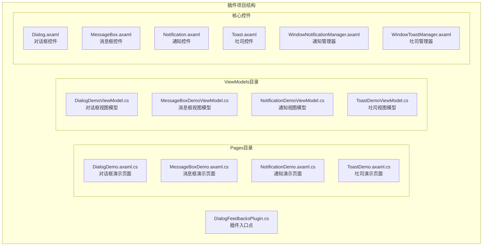

**图表来源**
- [DialogFeedbacksPlugin.cs:1-20](file://plugins/Avalonia.Plugin.DialogFeedbacks/DialogFeedbacksPlugin.cs#L1-L20)
- [DialogDemo.axaml.cs:1-17](file://plugins/Avalonia.Plugin.DialogFeedbacks/Pages/DialogDemo.axaml.cs#L1-L17)
- [MessageBoxDemo.axaml.cs:1-17](file://plugins/Avalonia.Plugin.DialogFeedbacks/Pages/MessageBoxDemo.axaml.cs#L1-L17)
- [NotificationDemo.axaml.cs:1-30](file://plugins/Avalonia.Plugin.DialogFeedbacks/Pages/NotificationDemo.axaml.cs#L1-L30)
- [ToastDemo.axaml.cs:1-36](file://plugins/Avalonia.Plugin.DialogFeedbacks/Pages/ToastDemo.axaml.cs#L1-L36)

**章节来源**
- [DialogFeedbacksPlugin.cs:1-20](file://plugins/Avalonia.Plugin.DialogFeedbacks/DialogFeedbacksPlugin.cs#L1-L20)

## 核心组件

### 插件元数据管理

DialogFeedbacksPlugin实现了IPluginMetadata接口，提供插件的基本信息和初始化功能：

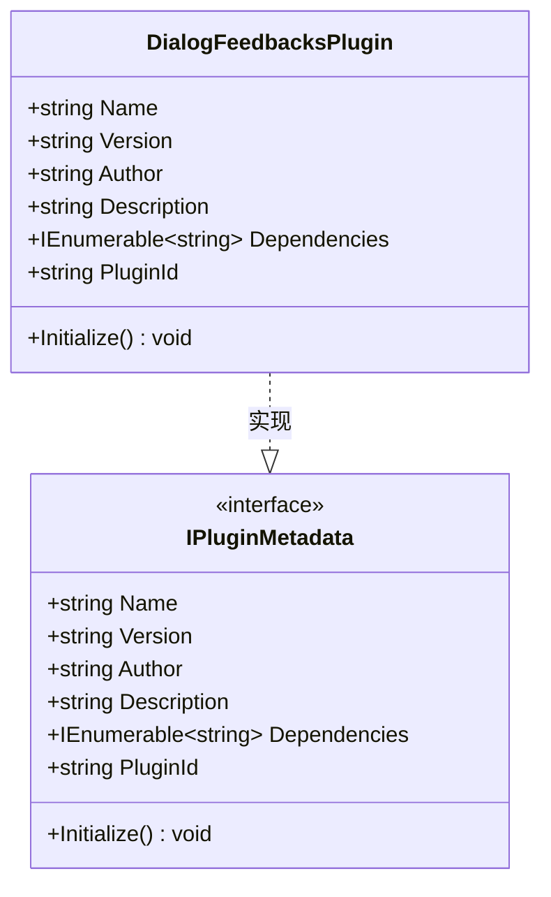

**图表来源**
- [DialogFeedbacksPlugin.cs:6-19](file://plugins/Avalonia.Plugin.DialogFeedbacks/DialogFeedbacksPlugin.cs#L6-L19)

### 弹窗组件类型

插件包含四种主要的弹窗组件类型：

1. **对话框(Demo)**：模态和非模态对话框
2. **消息框(MessageBox)**：标准消息提示框
3. **通知(Notification)**：系统级通知显示
4. **吐司(Toast)**：轻量级状态提示

**章节来源**
- [DialogDemoViewModel.cs:14-24](file://plugins/Avalonia.Plugin.DialogFeedbacks/ViewModels/DialogDemoViewModel.cs#L14-L24)
- [MessageBoxDemoViewModel.cs:12-15](file://plugins/Avalonia.Plugin.DialogFeedbacks/ViewModels/MessageBoxDemoViewModel.cs#L12-L15)
- [NotificationDemoViewModel.cs:12-15](file://plugins/Avalonia.Plugin.DialogFeedbacks/ViewModels/NotificationDemoViewModel.cs#L12-L15)
- [ToastDemoViewModel.cs:11-14](file://plugins/Avalonia.Plugin.DialogFeedbacks/ViewModels/ToastDemoViewModel.cs#L11-L14)

## 架构概览

DialogFeedbacksPlugin采用MVVM架构模式，结合Ursa控件库实现完整的弹窗反馈系统：

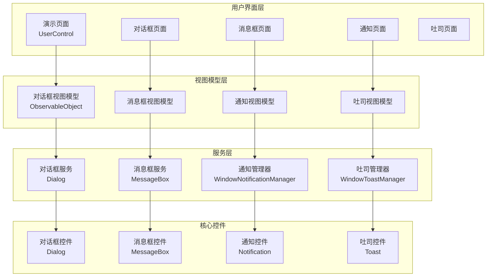

**图表来源**
- [DialogDemoViewModel.cs:17-24](file://plugins/Avalonia.Plugin.DialogFeedbacks/ViewModels/DialogDemoViewModel.cs#L17-L24)
- [MessageBoxDemoViewModel.cs:15](file://plugins/Avalonia.Plugin.DialogFeedbacks/ViewModels/MessageBoxDemoViewModel.cs#L15)
- [NotificationDemoViewModel.cs:15](file://plugins/Avalonia.Plugin.DialogFeedbacks/ViewModels/NotificationDemoViewModel.cs#L15)
- [ToastDemoViewModel.cs:14](file://plugins/Avalonia.Plugin.DialogFeedbacks/ViewModels/ToastDemoViewModel.cs#L14)

## 详细组件分析

### 对话框组件

对话框组件是插件中最复杂的弹窗类型，支持多种配置选项和显示模式。

#### 对话框视图模型架构

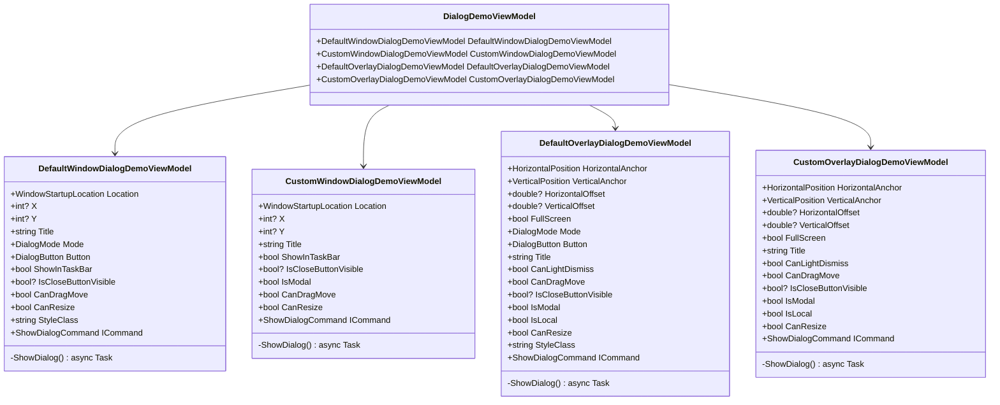

**图表来源**
- [DialogDemoViewModel.cs:17-24](file://plugins/Avalonia.Plugin.DialogFeedbacks/ViewModels/DialogDemoViewModel.cs#L17-L24)
- [DialogDemoViewModel.cs:26-76](file://plugins/Avalonia.Plugin.DialogFeedbacks/ViewModels/DialogDemoViewModel.cs#L26-L76)
- [DialogDemoViewModel.cs:78-132](file://plugins/Avalonia.Plugin.DialogFeedbacks/ViewModels/DialogDemoViewModel.cs#L78-L132)
- [DialogDemoViewModel.cs:134-193](file://plugins/Avalonia.Plugin.DialogFeedbacks/ViewModels/DialogDemoViewModel.cs#L134-L193)
- [DialogDemoViewModel.cs:195-246](file://plugins/Avalonia.Plugin.DialogFeedbacks/ViewModels/DialogDemoViewModel.cs#L195-L246)

#### 对话框显示流程

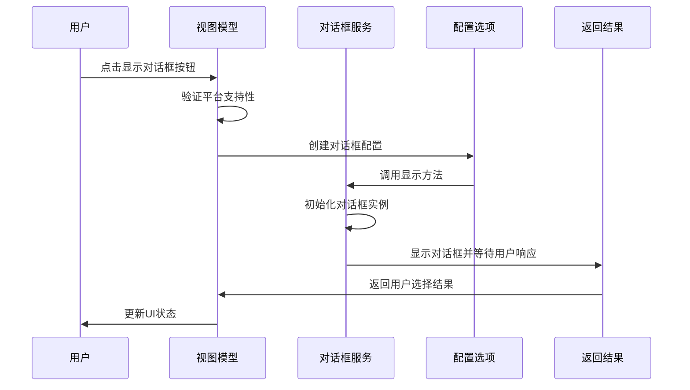

**图表来源**
- [DialogDemoViewModel.cs:51-75](file://plugins/Avalonia.Plugin.DialogFeedbacks/ViewModels/DialogDemoViewModel.cs#L51-L75)
- [DialogDemoViewModel.cs:100-131](file://plugins/Avalonia.Plugin.DialogFeedbacks/ViewModels/DialogDemoViewModel.cs#L100-L131)
- [DialogDemoViewModel.cs:165-192](file://plugins/Avalonia.Plugin.DialogFeedbacks/ViewModels/DialogDemoViewModel.cs#L165-L192)
- [DialogDemoViewModel.cs:221-245](file://plugins/Avalonia.Plugin.DialogFeedbacks/ViewModels/DialogDemoViewModel.cs#L221-L245)

#### 对话框配置选项

对话框支持丰富的配置选项，包括位置、样式、行为等设置：

| 配置项 | 类型 | 描述 | 默认值 |
|--------|------|------|--------|
| Title | string | 对话框标题 | null |
| Mode | DialogMode | 对话框模式 | None |
| Button | DialogButton | 按钮配置 | OKCancel |
| ShowInTaskBar | bool | 是否显示在任务栏 | false |
| IsCloseButtonVisible | bool? | 关闭按钮可见性 | null |
| StartupLocation | WindowStartupLocation | 启动位置 | CenterScreen |
| CanDragMove | bool | 是否可拖拽移动 | true |
| CanResize | bool | 是否可调整大小 | true |
| StyleClass | string | 样式类名 | null |
| Position | PixelPoint | 精确位置坐标 | null |

**章节来源**
- [DialogDemoViewModel.cs:58-74](file://plugins/Avalonia.Plugin.DialogFeedbacks/ViewModels/DialogDemoViewModel.cs#L58-L74)
- [DialogDemoViewModel.cs:107-120](file://plugins/Avalonia.Plugin.DialogFeedbacks/ViewModels/DialogDemoViewModel.cs#L107-L120)
- [DialogDemoViewModel.cs:167-182](file://plugins/Avalonia.Plugin.DialogFeedbacks/ViewModels/DialogDemoViewModel.cs#L167-L182)
- [DialogDemoViewModel.cs:223-236](file://plugins/Avalonia.Plugin.DialogFeedbacks/ViewModels/DialogDemoViewModel.cs#L223-L236)

### 消息框组件

消息框组件提供简单直接的信息提示功能，支持多种图标和按钮配置。

#### 消息框视图模型设计

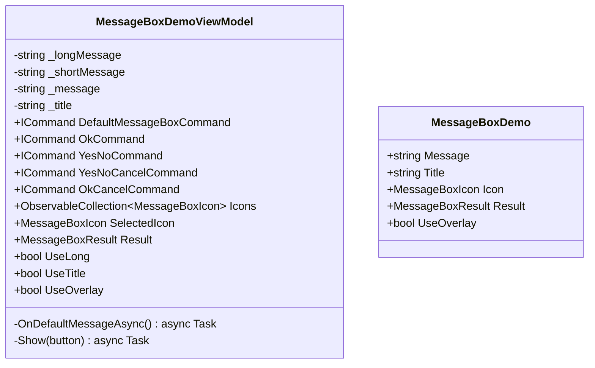

**图表来源**
- [MessageBoxDemoViewModel.cs:15-90](file://plugins/Avalonia.Plugin.DialogFeedbacks/ViewModels/MessageBoxDemoViewModel.cs#L15-L90)
- [MessageBoxDemoViewModel.cs:92-141](file://plugins/Avalonia.Plugin.DialogFeedbacks/ViewModels/MessageBoxDemoViewModel.cs#L92-L141)

#### 消息框显示流程

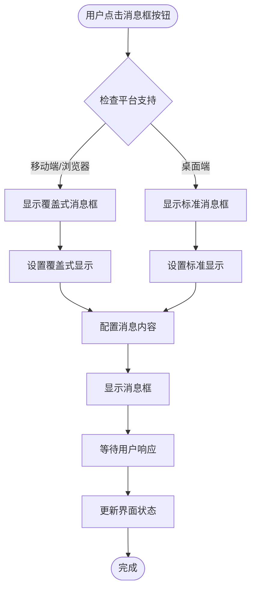

**图表来源**
- [MessageBoxDemoViewModel.cs:92-103](file://plugins/Avalonia.Plugin.DialogFeedbacks/ViewModels/MessageBoxDemoViewModel.cs#L92-L103)
- [MessageBoxDemoViewModel.cs:125-141](file://plugins/Avalonia.Plugin.DialogFeedbacks/ViewModels/MessageBoxDemoViewModel.cs#L125-L141)

**章节来源**
- [MessageBoxDemoViewModel.cs:17-67](file://plugins/Avalonia.Plugin.DialogFeedbacks/ViewModels/MessageBoxDemoViewModel.cs#L17-L67)
- [MessageBoxDemoViewModel.cs:79-90](file://plugins/Avalonia.Plugin.DialogFeedbacks/ViewModels/MessageBoxDemoViewModel.cs#L79-L90)

### 通知组件

通知组件提供系统级的通知显示功能，支持多种位置和样式配置。

#### 通知视图模型架构

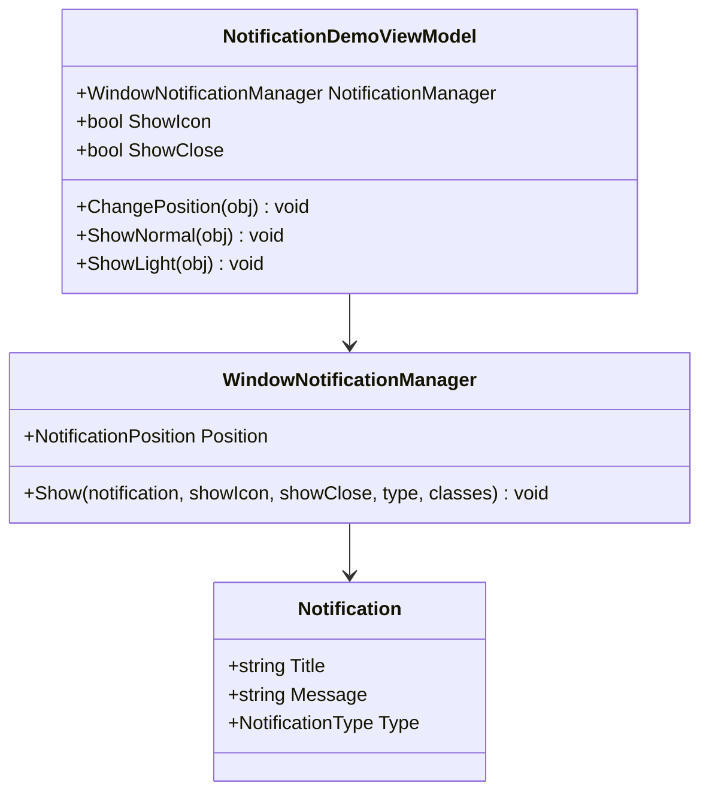

**图表来源**
- [NotificationDemoViewModel.cs:15-56](file://plugins/Avalonia.Plugin.DialogFeedbacks/ViewModels/NotificationDemoViewModel.cs#L15-L56)

#### 通知管理器生命周期

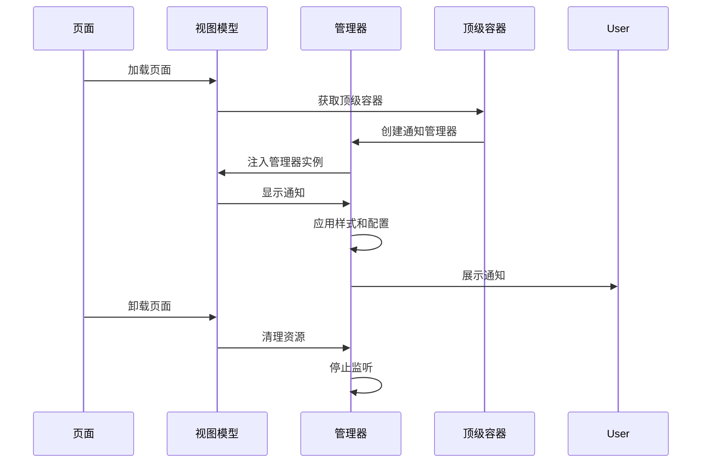

**图表来源**
- [NotificationDemo.axaml.cs:15-23](file://plugins/Avalonia.Plugin.DialogFeedbacks/Pages/NotificationDemo.axaml.cs#L15-L23)
- [NotificationDemoViewModel.cs:22-42](file://plugins/Avalonia.Plugin.DialogFeedbacks/ViewModels/NotificationDemoViewModel.cs#L22-L42)

**章节来源**
- [NotificationDemoViewModel.cs:17-30](file://plugins/Avalonia.Plugin.DialogFeedbacks/ViewModels/NotificationDemoViewModel.cs#L17-L30)
- [NotificationDemoViewModel.cs:32-56](file://plugins/Avalonia.Plugin.DialogFeedbacks/ViewModels/NotificationDemoViewModel.cs#L32-L56)

### 吐司组件

吐司组件提供轻量级的状态提示功能，支持最大数量限制和样式配置。

#### 吐司视图模型设计

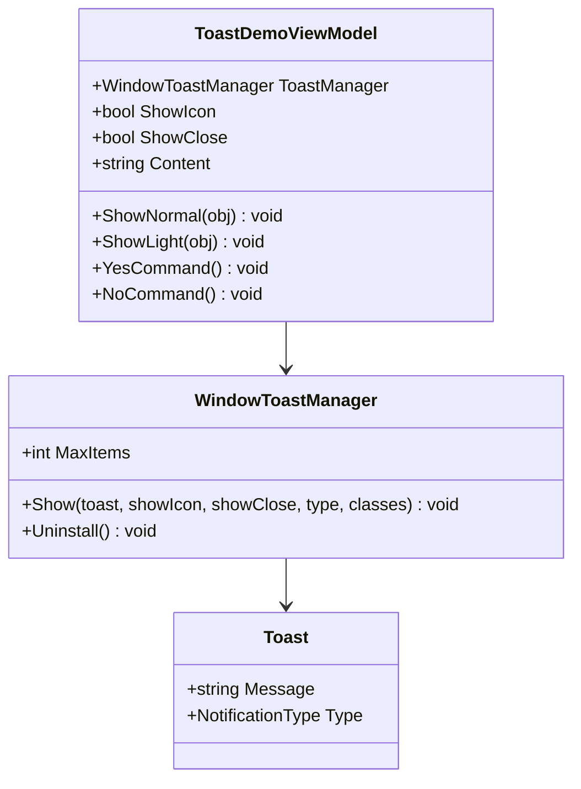

**图表来源**
- [ToastDemoViewModel.cs:14-69](file://plugins/Avalonia.Plugin.DialogFeedbacks/ViewModels/ToastDemoViewModel.cs#L14-L69)

#### 吐司管理器资源管理

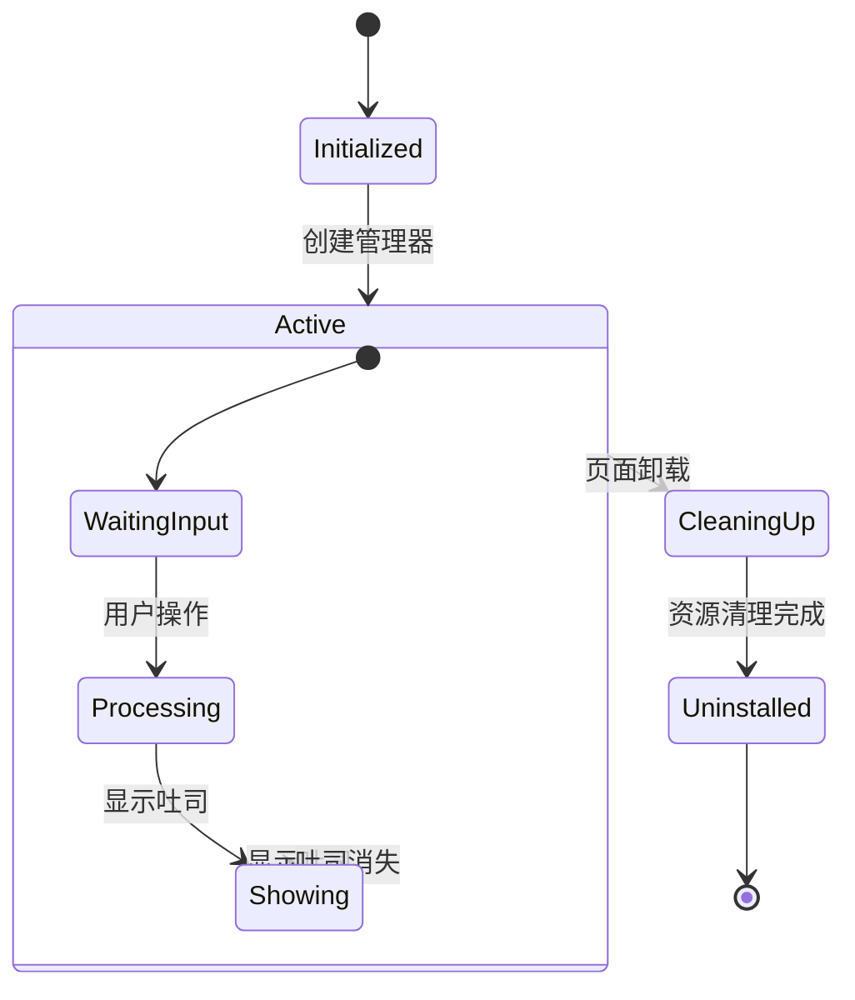

**图表来源**
- [ToastDemo.axaml.cs:17-29](file://plugins/Avalonia.Plugin.DialogFeedbacks/Pages/ToastDemo.axaml.cs#L17-L29)
- [ToastDemoViewModel.cs:21-39](file://plugins/Avalonia.Plugin.DialogFeedbacks/ViewModels/ToastDemoViewModel.cs#L21-L39)

**章节来源**
- [ToastDemoViewModel.cs:16-39](file://plugins/Avalonia.Plugin.DialogFeedbacks/ViewModels/ToastDemoViewModel.cs#L16-L39)
- [ToastDemoViewModel.cs:58-69](file://plugins/Avalonia.Plugin.DialogFeedbacks/ViewModels/ToastDemoViewModel.cs#L58-L69)

## 依赖关系分析

DialogFeedbacksPlugin依赖于多个核心组件和服务：

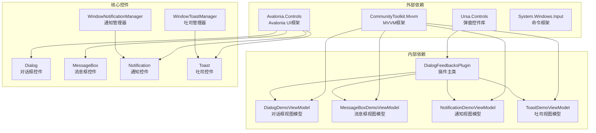

**图表来源**
- [DialogDemoViewModel.cs:1-10](file://plugins/Avalonia.Plugin.DialogFeedbacks/ViewModels/DialogDemoViewModel.cs#L1-L10)
- [MessageBoxDemoViewModel.cs:1-9](file://plugins/Avalonia.Plugin.DialogFeedbacks/ViewModels/MessageBoxDemoViewModel.cs#L1-L9)
- [NotificationDemoViewModel.cs:1-9](file://plugins/Avalonia.Plugin.DialogFeedbacks/ViewModels/NotificationDemoViewModel.cs#L1-L9)
- [ToastDemoViewModel.cs:1-8](file://plugins/Avalonia.Plugin.DialogFeedbacks/ViewModels/ToastDemoViewModel.cs#L1-L8)

**章节来源**
- [DialogFeedbacksPlugin.cs:1-3](file://plugins/Avalonia.Plugin.DialogFeedbacks/DialogFeedbacksPlugin.cs#L1-L3)

## 性能考虑

### 弹窗性能优化策略

1. **延迟加载**: 弹窗组件采用按需加载机制，避免不必要的初始化开销
2. **资源管理**: 吐司管理器在页面卸载时自动清理资源，防止内存泄漏
3. **异步处理**: 所有弹窗操作都支持异步执行，避免阻塞UI线程
4. **缓存机制**: 通知管理器维护弹窗实例缓存，提高重复显示效率

### 平台适配优化

插件针对不同平台进行了专门的优化：

- **桌面端**: 支持所有弹窗功能，包括模态对话框
- **移动端/浏览器**: 自动降级到覆盖式弹窗，确保兼容性
- **平板设备**: 优化触摸交互体验

## 故障排除指南

### 常见问题及解决方案

#### 1. 弹窗无法显示

**问题症状**: 调用显示方法后无任何反应

**可能原因**:
- 顶级容器未正确获取
- 平台不支持某些弹窗类型
- 配置参数错误

**解决步骤**:
1. 检查页面是否已附加到视觉树
2. 验证平台支持情况
3. 确认配置参数的有效性

#### 2. 弹窗位置异常

**问题症状**: 弹窗显示位置不正确

**可能原因**:
- 坐标计算错误
- 宿主容器尺寸变化
- 屏幕分辨率适配问题

**解决步骤**:
1. 验证坐标参数设置
2. 检查宿主容器的布局状态
3. 调整锚点和偏移量设置

#### 3. 资源泄漏问题

**问题症状**: 多次打开关闭弹窗后内存持续增长

**可能原因**:
- 管理器未正确清理
- 事件订阅未注销
- 弹窗实例未释放

**解决步骤**:
1. 确保在页面卸载时调用清理方法
2. 检查事件订阅的生命周期
3. 验证弹窗实例的正确释放

**章节来源**
- [ToastDemo.axaml.cs:25-29](file://plugins/Avalonia.Plugin.DialogFeedbacks/Pages/ToastDemo.axaml.cs#L25-L29)
- [NotificationDemo.axaml.cs:15-23](file://plugins/Avalonia.Plugin.DialogFeedbacks/Pages/NotificationDemo.axaml.cs#L15-L23)

## 结论

DialogFeedbacksPlugin为开发者提供了一个完整的弹窗反馈解决方案参考。通过分析该插件的实现，我们可以学到：

1. **架构设计**: MVVM模式与Ursa控件库的完美结合
2. **平台适配**: 针对不同平台的智能降级策略
3. **资源管理**: 生命周期管理和内存优化最佳实践
4. **用户体验**: 从焦点处理到动画效果的全方位优化

这个插件不仅展示了各种弹窗组件的实现方法，更重要的是体现了现代UI开发中应该遵循的设计原则和最佳实践。

## 附录

### 开发最佳实践清单

#### 1. 弹窗设计原则
- 保持简洁明了的信息传达
- 提供清晰的用户操作路径
- 确保无障碍访问支持
- 考虑不同屏幕尺寸的适配

#### 2. 性能优化要点
- 使用异步模式避免UI阻塞
- 合理管理弹窗生命周期
- 优化资源使用和内存管理
- 实现适当的缓存策略

#### 3. 用户体验优化
- 提供一致的视觉风格
- 确保流畅的动画过渡
- 支持键盘导航和快捷键
- 实现适当的反馈机制

#### 4. 测试策略
- 覆盖不同平台的功能测试
- 边界条件和异常处理测试
- 性能和压力测试
- 用户体验可用性测试