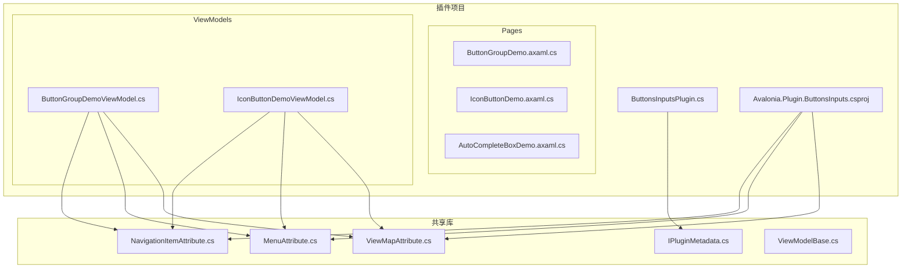
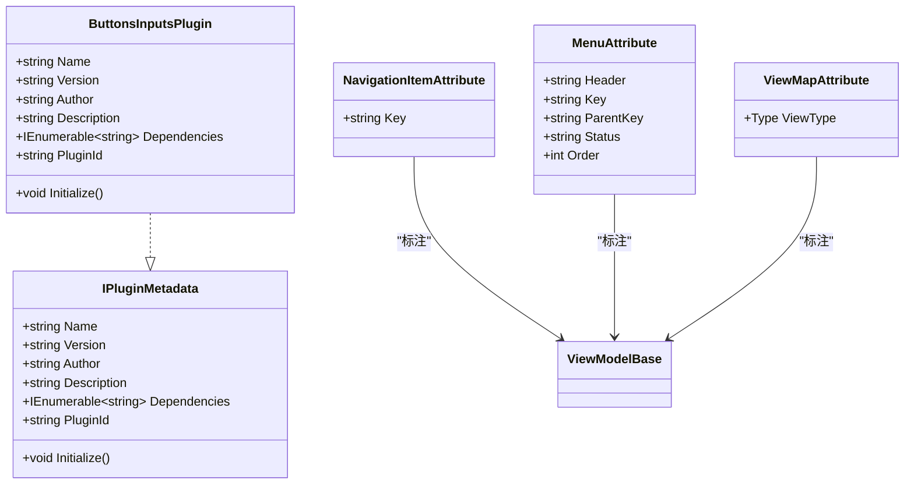
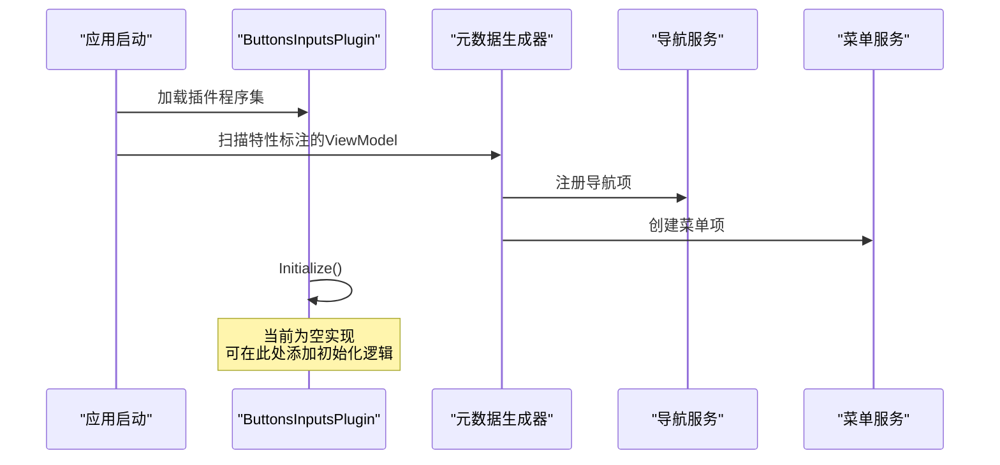
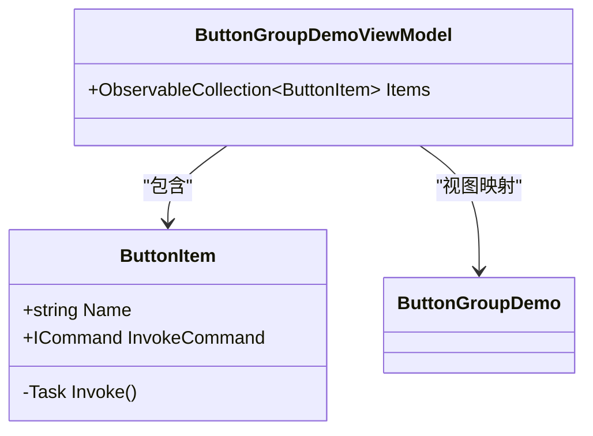
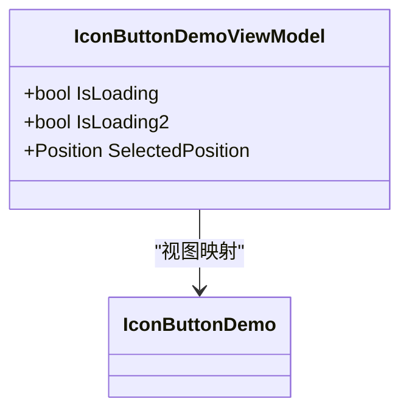
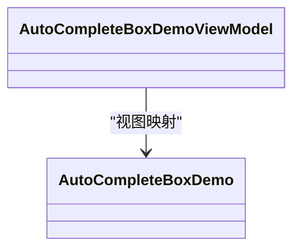
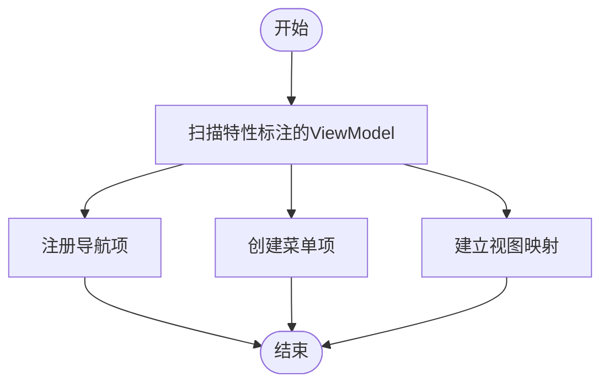
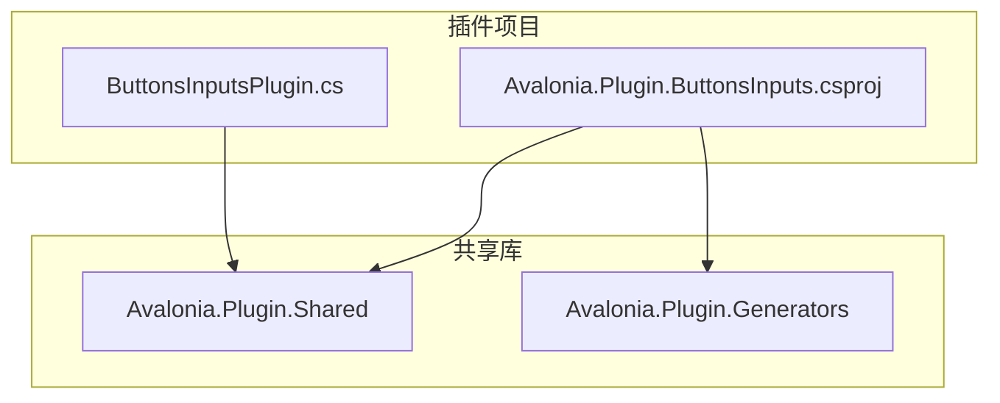

# 按钮输入插件开发

<cite>
**本文档引用的文件**
- [ButtonsInputsPlugin.cs](file://plugins/Avalonia.Plugin.ButtonsInputs/ButtonsInputsPlugin.cs)
- [Avalonia.Plugin.ButtonsInputs.csproj](file://plugins/Avalonia.Plugin.ButtonsInputs/Avalonia.Plugin.ButtonsInputs.csproj)
- [ButtonGroupDemo.axaml.cs](file://plugins/Avalonia.Plugin.ButtonsInputs/Pages/ButtonGroupDemo.axaml.cs)
- [ButtonGroupDemoViewModel.cs](file://plugins/Avalonia.Plugin.ButtonsInputs/ViewModels/ButtonGroupDemoViewModel.cs)
- [IconButtonDemo.axaml.cs](file://plugins/Avalonia.Plugin.ButtonsInputs/Pages/IconButtonDemo.axaml.cs)
- [IconButtonDemoViewModel.cs](file://plugins/Avalonia.Plugin.ButtonsInputs/ViewModels/IconButtonDemoViewModel.cs)
- [AutoCompleteBoxDemo.axaml.cs](file://plugins/Avalonia.Plugin.ButtonsInputs/Pages/AutoCompleteBoxDemo.axaml.cs)
- [NavigationItemAttribute.cs](file://src/Avalonia.Plugin.Shared/Attributes/NavigationItemAttribute.cs)
- [MenuAttribute.cs](file://src/Avalonia.Plugin.Shared/Attributes/MenuAttribute.cs)
- [ViewMapAttribute.cs](file://src/Avalonia.Plugin.Shared/Attributes/ViewMapAttribute.cs)
- [IPluginMetadata.cs](file://src/Avalonia.Plugin.Shared/IPluginMetadata.cs)
- [ViewModelBase.cs](file://src/Avalonia.Plugin.Shared/ViewModelBase.cs)
</cite>

## 目录
1. [简介](#简介)
2. [项目结构](#项目结构)
3. [核心组件](#核心组件)
4. [架构概览](#架构概览)
5. [详细组件分析](#详细组件分析)
6. [依赖关系分析](#依赖关系分析)
7. [性能考虑](#性能考虑)
8. [故障排除指南](#故障排除指南)
9. [结论](#结论)
10. [附录](#附录)

## 简介
本教程面向希望开发按钮输入类插件的开发者，基于 Avalonia.Plugin.ButtonsInputs 插件的实际实现，系统讲解如何构建包含多种按钮和输入控件的插件。内容涵盖插件元数据配置、导航项注册、菜单项创建与视图映射机制，并通过 ButtonGroup、IconButton 等具体组件展示 XAML 界面设计、ViewModel 绑定和用户交互处理的最佳实践。

## 项目结构
按钮输入插件采用清晰的分层组织方式：插件元数据定义在根部，演示页面位于 Pages 目录，对应的 ViewModel 放置在 ViewModels 目录；共享的元数据生成器和属性定义位于 src/Avalonia.Plugin.Shared 中。

**图表来源**
- [ButtonsInputsPlugin.cs:1-100](file://plugins/Avalonia.Plugin.ButtonsInputs/ButtonsInputsPlugin.cs#L1-L100)
- [Avalonia.Plugin.ButtonsInputs.csproj:1-20](file://plugins/Avalonia.Plugin.ButtonsInputs/Avalonia.Plugin.ButtonsInputs.csproj#L1-L20)
- [NavigationItemAttribute.cs:1-8](file://src/Avalonia.Plugin.Shared/Attributes/NavigationItemAttribute.cs#L1-L8)
- [MenuAttribute.cs:1-39](file://src/Avalonia.Plugin.Shared/Attributes/MenuAttribute.cs#L1-L39)
- [ViewMapAttribute.cs:1-9](file://src/Avalonia.Plugin.Shared/Attributes/ViewMapAttribute.cs#L1-L9)
- [IPluginMetadata.cs:1-44](file://src/Avalonia.Plugin.Shared/IPluginMetadata.cs#L1-L44)
- [ViewModelBase.cs:1-12](file://src/Avalonia.Plugin.Shared/ViewModelBase.cs#L1-L12)

**章节来源**
- [ButtonsInputsPlugin.cs:1-100](file://plugins/Avalonia.Plugin.ButtonsInputs/ButtonsInputsPlugin.cs#L1-L100)
- [Avalonia.Plugin.ButtonsInputs.csproj:1-20](file://plugins/Avalonia.Plugin.ButtonsInputs/Avalonia.Plugin.ButtonsInputs.csproj#L1-L20)

## 核心组件
本节深入解析插件的核心组成，包括插件元数据接口、导航项特性、菜单项特性和视图映射特性，以及基础 ViewModel 类。

- 插件元数据接口 IPluginMetadata：定义插件的基本信息（名称、版本、作者、描述、依赖、唯一标识）和初始化方法。
- 导航项特性 NavigationItemAttribute：为 ViewModel 标记导航键，用于建立 ViewModel 与导航系统的关联。
- 菜单项特性 MenuAttribute：为 ViewModel 标记菜单项信息（标题、键、父级键、状态、排序），支持自动菜单生成。
- 视图映射特性 ViewMapAttribute：将 ViewModel 与对应的 View 类型进行映射，便于运行时动态加载。
- 基础 ViewModel 类 ViewModelBase：继承自 ObservableObject，提供 MVVM 开发的基础能力。

这些组件共同构成了插件的元数据驱动架构，使得插件能够声明式地注册导航项、菜单项和视图映射，简化了插件的集成与扩展。

**章节来源**
- [IPluginMetadata.cs:1-44](file://src/Avalonia.Plugin.Shared/IPluginMetadata.cs#L1-L44)
- [NavigationItemAttribute.cs:1-8](file://src/Avalonia.Plugin.Shared/Attributes/NavigationItemAttribute.cs#L1-L8)
- [MenuAttribute.cs:1-39](file://src/Avalonia.Plugin.Shared/Attributes/MenuAttribute.cs#L1-L39)
- [ViewMapAttribute.cs:1-9](file://src/Avalonia.Plugin.Shared/Attributes/ViewMapAttribute.cs#L1-L9)
- [ViewModelBase.cs:1-12](file://src/Avalonia.Plugin.Shared/ViewModelBase.cs#L1-L12)

## 架构概览
按钮输入插件采用“声明式元数据 + 运行时映射”的架构模式。插件通过特性标注 ViewModel，运行时由元数据生成器扫描并注册导航项、菜单项和视图映射。插件主类实现 IPluginMetadata 接口，负责插件基本信息与初始化。

**图表来源**
- [IPluginMetadata.cs:1-44](file://src/Avalonia.Plugin.Shared/IPluginMetadata.cs#L1-L44)
- [ButtonsInputsPlugin.cs:1-100](file://plugins/Avalonia.Plugin.ButtonsInputs/ButtonsInputsPlugin.cs#L1-L100)
- [NavigationItemAttribute.cs:1-8](file://src/Avalonia.Plugin.Shared/Attributes/NavigationItemAttribute.cs#L1-L8)
- [MenuAttribute.cs:1-39](file://src/Avalonia.Plugin.Shared/Attributes/MenuAttribute.cs#L1-L39)
- [ViewMapAttribute.cs:1-9](file://src/Avalonia.Plugin.Shared/Attributes/ViewMapAttribute.cs#L1-L9)
- [ViewModelBase.cs:1-12](file://src/Avalonia.Plugin.Shared/ViewModelBase.cs#L1-L12)

## 详细组件分析

### 插件主类 ButtonsInputsPlugin
ButtonsInputsPlugin 实现 IPluginMetadata 接口，提供插件的基本信息与初始化入口。当前实现中，导航项注册、菜单项创建和视图映射均以注释形式保留，展示了完整的扩展点，开发者可按需取消注释并实现相应功能。

**图表来源**
- [ButtonsInputsPlugin.cs:20-24](file://plugins/Avalonia.Plugin.ButtonsInputs/ButtonsInputsPlugin.cs#L20-L24)
- [ButtonsInputsPlugin.cs:25-52](file://plugins/Avalonia.Plugin.ButtonsInputs/ButtonsInputsPlugin.cs#L25-L52)
- [ButtonsInputsPlugin.cs:54-88](file://plugins/Avalonia.Plugin.ButtonsInputs/ButtonsInputsPlugin.cs#L54-L88)
- [ButtonsInputsPlugin.cs:92-96](file://plugins/Avalonia.Plugin.ButtonsInputs/ButtonsInputsPlugin.cs#L92-L96)

**章节来源**
- [ButtonsInputsPlugin.cs:1-100](file://plugins/Avalonia.Plugin.ButtonsInputs/ButtonsInputsPlugin.cs#L1-L100)

### ButtonGroup 组件实现
ButtonGroupDemo 展示了多按钮组合的交互场景。其 ViewModel 通过 NavigationItem、Menu 和 ViewMap 特性完成注册与映射，并使用 ObservableCollection 维护按钮项集合，每个按钮项包含名称和命令。

**图表来源**
- [ButtonGroupDemoViewModel.cs:11-24](file://plugins/Avalonia.Plugin.ButtonsInputs/ViewModels/ButtonGroupDemoViewModel.cs#L11-L24)
- [ButtonGroupDemoViewModel.cs:26-40](file://plugins/Avalonia.Plugin.ButtonsInputs/ViewModels/ButtonGroupDemoViewModel.cs#L26-L40)
- [ButtonGroupDemo.axaml.cs:5-11](file://plugins/Avalonia.Plugin.ButtonsInputs/Pages/ButtonGroupDemo.axaml.cs#L5-L11)

**章节来源**
- [ButtonGroupDemoViewModel.cs:1-46](file://plugins/Avalonia.Plugin.ButtonsInputs/ViewModels/ButtonGroupDemoViewModel.cs#L1-L46)
- [ButtonGroupDemo.axaml.cs:1-17](file://plugins/Avalonia.Plugin.ButtonsInputs/Pages/ButtonGroupDemo.axaml.cs#L1-L17)

### IconButton 组件实现
IconButtonDemo 展示了图标按钮的交互场景。其 ViewModel 使用 ObservableObject 作为基类，通过 [ObservableProperty] 特性声明可观察属性，支持加载状态、位置选择等交互状态管理。

**图表来源**
- [IconButtonDemoViewModel.cs:8-16](file://plugins/Avalonia.Plugin.ButtonsInputs/ViewModels/IconButtonDemoViewModel.cs#L8-L16)
- [IconButtonDemo.axaml.cs:5-11](file://plugins/Avalonia.Plugin.ButtonsInputs/Pages/IconButtonDemo.axaml.cs#L5-L11)

**章节来源**
- [IconButtonDemoViewModel.cs:1-22](file://plugins/Avalonia.Plugin.ButtonsInputs/ViewModels/IconButtonDemoViewModel.cs#L1-L22)
- [IconButtonDemo.axaml.cs:1-17](file://plugins/Avalonia.Plugin.ButtonsInputs/Pages/IconButtonDemo.axaml.cs#L1-L17)

### AutoCompleteBox 组件实现
AutoCompleteBoxDemo 展示了自动完成输入框的交互场景。其 ViewModel 通过 NavigationItem、Menu 和 ViewMap 特性完成注册与映射，支持输入提示、选择等功能。

**图表来源**
- [AutoCompleteBoxDemo.axaml.cs:5-11](file://plugins/Avalonia.Plugin.ButtonsInputs/Pages/AutoCompleteBoxDemo.axaml.cs#L5-L11)

**章节来源**
- [AutoCompleteBoxDemo.axaml.cs:1-17](file://plugins/Avalonia.Plugin.ButtonsInputs/Pages/AutoCompleteBoxDemo.axaml.cs#L1-L17)

### 元数据特性详解
- NavigationItemAttribute：用于标记 ViewModel 的导航键，确保导航系统能正确识别该 ViewModel。
- MenuAttribute：用于标记 ViewModel 的菜单项信息，支持设置标题、键、父级键、状态和排序。
- ViewMapAttribute：用于将 ViewModel 与 View 类型进行映射，便于运行时动态加载对应视图。

**图表来源**
- [NavigationItemAttribute.cs:4-8](file://src/Avalonia.Plugin.Shared/Attributes/NavigationItemAttribute.cs#L4-L8)
- [MenuAttribute.cs:11-38](file://src/Avalonia.Plugin.Shared/Attributes/MenuAttribute.cs#L11-L38)
- [ViewMapAttribute.cs:5-9](file://src/Avalonia.Plugin.Shared/Attributes/ViewMapAttribute.cs#L5-L9)

**章节来源**
- [NavigationItemAttribute.cs:1-8](file://src/Avalonia.Plugin.Shared/Attributes/NavigationItemAttribute.cs#L1-L8)
- [MenuAttribute.cs:1-39](file://src/Avalonia.Plugin.Shared/Attributes/MenuAttribute.cs#L1-L39)
- [ViewMapAttribute.cs:1-9](file://src/Avalonia.Plugin.Shared/Attributes/ViewMapAttribute.cs#L1-L9)

## 依赖关系分析
按钮输入插件项目通过 NuGet 引用共享库 Avalonia.Plugin.Shared，并使用元数据生成器进行特性扫描与注册。这种设计实现了插件与框架的解耦，便于扩展新的按钮和输入控件。

**图表来源**
- [Avalonia.Plugin.ButtonsInputs.csproj:14-17](file://plugins/Avalonia.Plugin.ButtonsInputs/Avalonia.Plugin.ButtonsInputs.csproj#L14-L17)

**章节来源**
- [Avalonia.Plugin.ButtonsInputs.csproj:1-20](file://plugins/Avalonia.Plugin.ButtonsInputs/Avalonia.Plugin.ButtonsInputs.csproj#L1-L20)

## 性能考虑
- 特性扫描优化：建议在插件初始化阶段缓存特性扫描结果，避免重复扫描导致的性能开销。
- 视图延迟加载：对于复杂的演示页面，可采用延迟加载策略，在用户导航到对应页面时再实例化视图。
- 数据绑定优化：使用 ObservableCollection 等高效的数据结构，减少不必要的 UI 刷新。
- 命令执行优化：合理使用异步命令，避免阻塞 UI 线程。

## 故障排除指南
- 插件未显示在导航中：检查 ViewModel 是否正确标注 NavigationItemAttribute，确保 Key 唯一且与导航项一致。
- 菜单项缺失或排序错误：检查 MenuAttribute 的 Header、Key、ParentKey、Order 设置是否正确。
- 视图无法加载：确认 ViewMapAttribute 指向的 View 类型存在且与 ViewModel 正确映射。
- 插件初始化失败：检查 ButtonsInputsPlugin.Initialize() 实现，确保无异常抛出。

**章节来源**
- [ButtonsInputsPlugin.cs:20-24](file://plugins/Avalonia.Plugin.ButtonsInputs/ButtonsInputsPlugin.cs#L20-L24)
- [NavigationItemAttribute.cs:4-8](file://src/Avalonia.Plugin.Shared/Attributes/NavigationItemAttribute.cs#L4-L8)
- [MenuAttribute.cs:11-38](file://src/Avalonia.Plugin.Shared/Attributes/MenuAttribute.cs#L11-L38)
- [ViewMapAttribute.cs:5-9](file://src/Avalonia.Plugin.Shared/Attributes/ViewMapAttribute.cs#L5-L9)

## 结论
通过本教程的学习，开发者可以掌握按钮输入类插件的完整开发流程。利用声明式元数据特性，结合导航项注册、菜单项创建和视图映射机制，能够快速构建包含多种按钮和输入控件的插件。建议在实际项目中遵循本文的最佳实践，确保插件的可维护性与扩展性。

## 附录
- 插件项目模板：参考现有插件项目的目录结构与命名约定。
- 特性使用规范：统一使用 NavigationItem、Menu、ViewMap 特性标注 ViewModel。
- 页面与 ViewModel 对应关系：确保每个演示页面都有对应的 ViewModel，并正确建立视图映射。
- 初始化流程：在插件 Initialize() 方法中添加必要的初始化逻辑，如资源加载、事件订阅等。