# 日期时间插件开发

<cite>
**本文档引用的文件**
- [DateTimePlugin.cs](file://plugins/Avalonia.Plugin.DateTime/DateTimePlugin.cs)
- [ClockDemo.axaml.cs](file://plugins/Avalonia.Plugin.DateTime/Pages/ClockDemo.axaml.cs)
- [DatePickerDemo.axaml.cs](file://plugins/Avalonia.Plugin.DateTime/Pages/DatePickerDemo.axaml.cs)
- [TimePickerDemo.axaml.cs](file://plugins/Avalonia.Plugin.DateTime/Pages/TimePickerDemo.axaml.cs)
- [ClockDemoViewModel.cs](file://plugins/Avalonia.Plugin.DateTime/ViewModels/ClockDemoViewModel.cs)
- [DatePickerDemoViewModel.cs](file://plugins/Avalonia.Plugin.DateTime/ViewModels/DatePickerDemoViewModel.cs)
- [TimePickerDemoViewModel.cs](file://plugins/Avalonia.Plugin.DateTime/ViewModels/TimePickerDemoViewModel.cs)
- [Clock.axaml](file://src/Avalonia.UI/Theme/Controls/Clock.axaml)
- [DatePicker.axaml](file://src/Avalonia.UI/Theme/Controls/DatePicker.axaml)
- [TimePicker.axaml](file://src/Avalonia.UI/Theme/Controls/TimePicker.axaml)
- [ViewMapAttribute.cs](file://src/Avalonia.Plugin.Shared/Attributes/ViewMapAttribute.cs)
- [MenuAttribute.cs](file://src/Avalonia.Plugin.Shared/Attributes/MenuAttribute.cs)
- [PositionToAngleConverter.cs](file://src/Avalonia.Plugin.Shared/Converters/PositionToAngleConverter.cs)
</cite>

## 目录
1. [简介](#简介)
2. [项目结构](#项目结构)
3. [核心组件](#核心组件)
4. [架构概览](#架构概览)
5. [详细组件分析](#详细组件分析)
6. [依赖关系分析](#依赖关系分析)
7. [性能考虑](#性能考虑)
8. [故障排除指南](#故障排除指南)
9. [结论](#结论)
10. [附录](#附录)

## 简介

本指南基于AvaloniaTemplate项目中的DateTimePlugin插件，详细介绍如何开发处理日期和时间相关功能的插件。该插件提供了Clock、DatePicker、TimePicker等核心组件，展示了完整的插件开发流程，包括导航集成、菜单配置、视图映射、时间格式化、本地化支持和用户交互优化。

## 项目结构

DateTimePlugin位于plugins目录下，采用标准的插件架构设计：

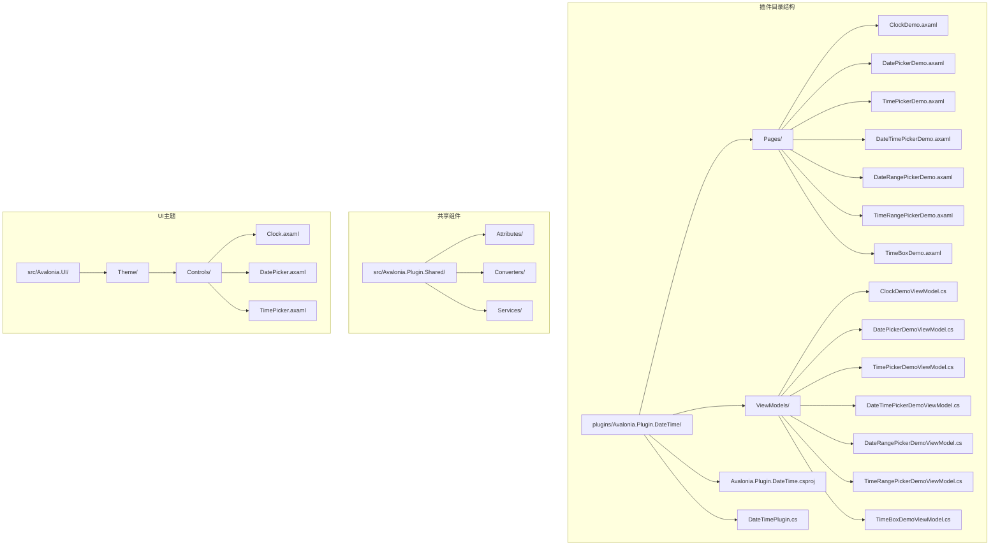

**图表来源**
- [DateTimePlugin.cs:1-20](file://plugins/Avalonia.Plugin.DateTime/DateTimePlugin.cs#L1-L20)
- [ClockDemo.axaml.cs:1-17](file://plugins/Avalonia.Plugin.DateTime/Pages/ClockDemo.axaml.cs#L1-L17)
- [Clock.axaml:1-60](file://src/Avalonia.UI/Theme/Controls/Clock.axaml#L1-L60)

**章节来源**
- [DateTimePlugin.cs:1-20](file://plugins/Avalonia.Plugin.DateTime/DateTimePlugin.cs#L1-L20)
- [ClockDemo.axaml.cs:1-17](file://plugins/Avalonia.Plugin.DateTime/Pages/ClockDemo.axaml.cs#L1-L17)

## 核心组件

### 插件元数据管理

DateTimePlugin实现了IPluginMetadata接口，提供插件的基本信息和初始化功能：

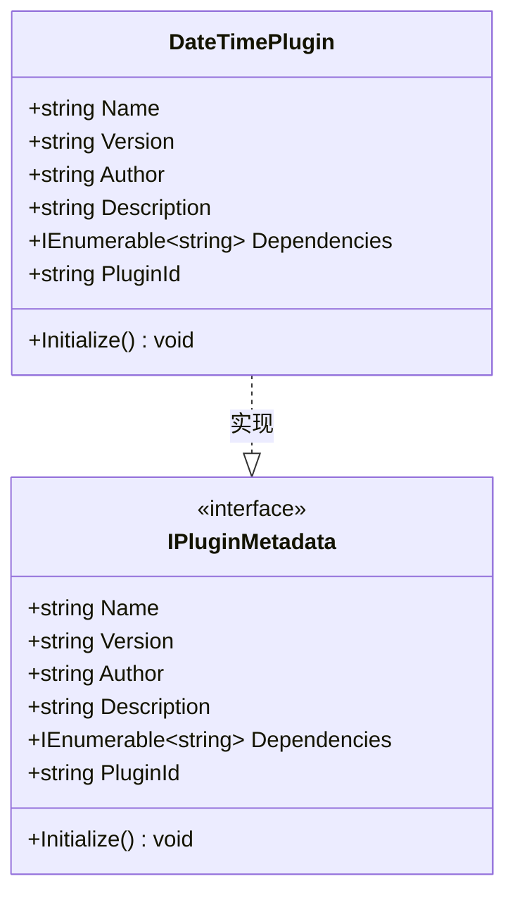

**图表来源**
- [DateTimePlugin.cs:6-19](file://plugins/Avalonia.Plugin.DateTime/DateTimePlugin.cs#L6-L19)

### 视图映射机制

通过ViewMapAttribute特性实现ViewModel与View的自动映射：

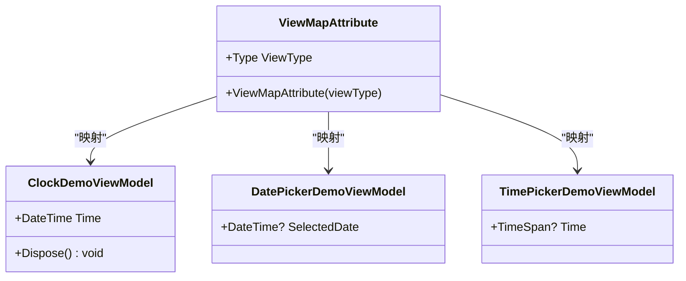

**图表来源**
- [ViewMapAttribute.cs:5-9](file://src/Avalonia.Plugin.Shared/Attributes/ViewMapAttribute.cs#L5-L9)
- [ClockDemoViewModel.cs:11-11](file://plugins/Avalonia.Plugin.DateTime/ViewModels/ClockDemoViewModel.cs#L11-L11)

**章节来源**
- [DateTimePlugin.cs:6-19](file://plugins/Avalonia.Plugin.DateTime/DateTimePlugin.cs#L6-L19)
- [ViewMapAttribute.cs:5-9](file://src/Avalonia.Plugin.Shared/Attributes/ViewMapAttribute.cs#L5-L9)

## 架构概览

插件采用MVVM模式，结合Avalonia的控件系统和主题机制：

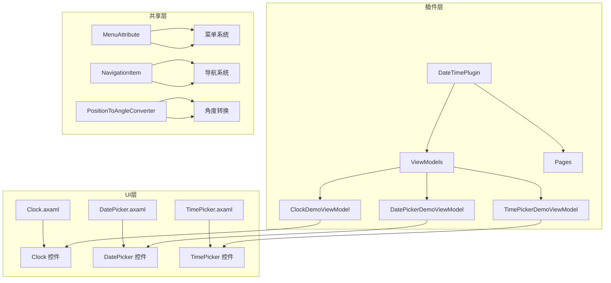

**图表来源**
- [ClockDemoViewModel.cs:9-11](file://plugins/Avalonia.Plugin.DateTime/ViewModels/ClockDemoViewModel.cs#L9-L11)
- [Clock.axaml:6-59](file://src/Avalonia.UI/Theme/Controls/Clock.axaml#L6-L59)
- [MenuAttribute.cs:11-38](file://src/Avalonia.Plugin.Shared/Attributes/MenuAttribute.cs#L11-L38)

## 详细组件分析

### Clock组件开发

Clock组件是时间显示的核心控件，具有以下特点：

#### 时间显示逻辑

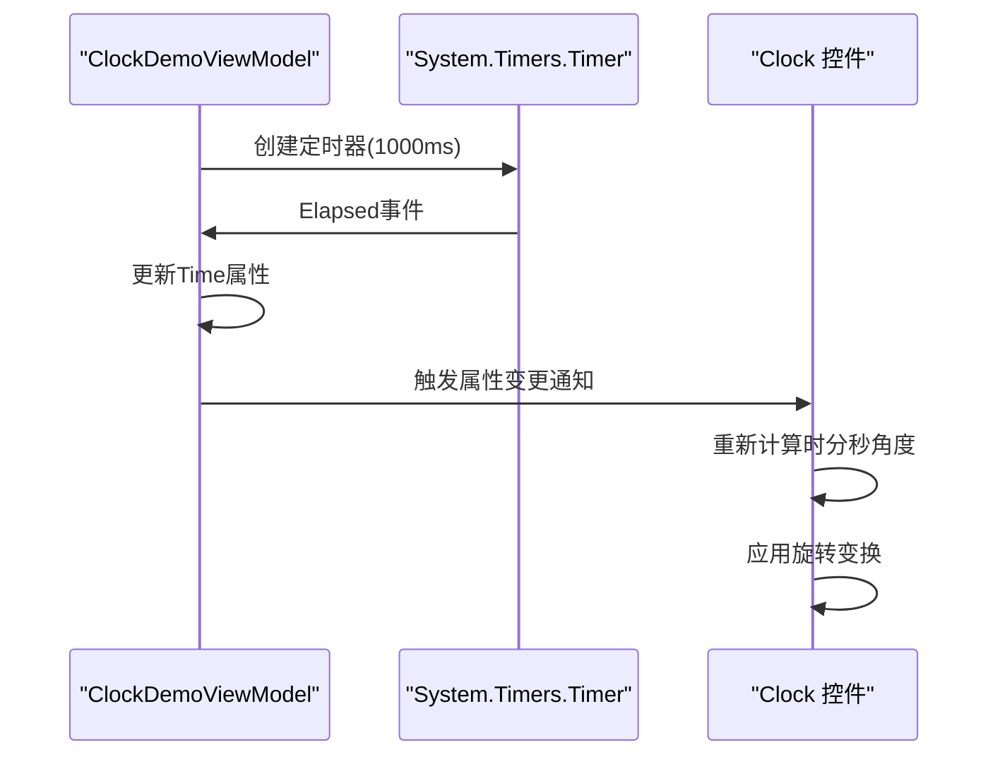

**图表来源**
- [ClockDemoViewModel.cs:14-29](file://plugins/Avalonia.Plugin.DateTime/ViewModels/ClockDemoViewModel.cs#L14-L29)
- [Clock.axaml:17-49](file://src/Avalonia.UI/Theme/Controls/Clock.axaml#L17-L49)

#### Clock手柄渲染机制

Clock控件使用统一网格布局和角度转换实现精确的时间显示：

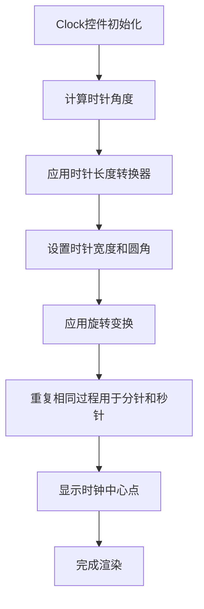

**图表来源**
- [Clock.axaml:17-55](file://src/Avalonia.UI/Theme/Controls/Clock.axaml#L17-L55)

**章节来源**
- [ClockDemoViewModel.cs:14-36](file://plugins/Avalonia.Plugin.DateTime/ViewModels/ClockDemoViewModel.cs#L14-L36)
- [Clock.axaml:1-60](file://src/Avalonia.UI/Theme/Controls/Clock.axaml#L1-L60)

### DatePicker组件实现

DatePicker组件提供了完整的日期选择功能：

#### 组件结构分析

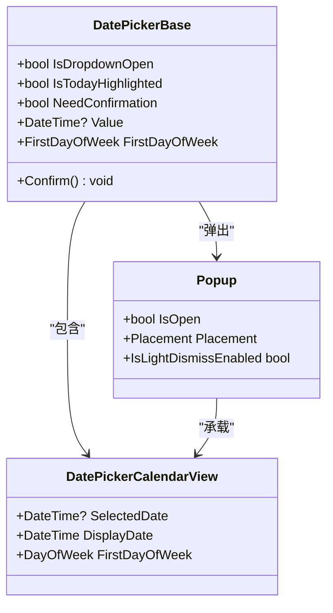

**图表来源**
- [DatePicker.axaml:6-109](file://src/Avalonia.UI/Theme/Controls/DatePicker.axaml#L6-L109)

#### 用户交互流程

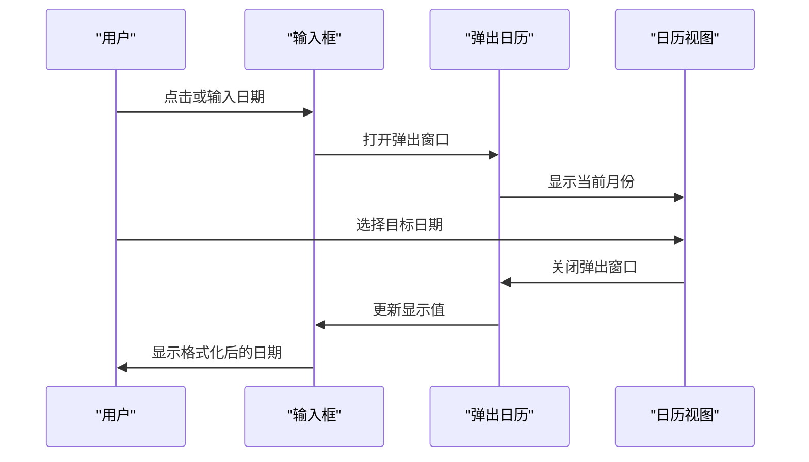

**图表来源**
- [DatePicker.axaml:70-103](file://src/Avalonia.UI/Theme/Controls/DatePicker.axaml#L70-L103)

**章节来源**
- [DatePickerDemoViewModel.cs:13-18](file://plugins/Avalonia.Plugin.DateTime/ViewModels/DatePickerDemoViewModel.cs#L13-L18)
- [DatePicker.axaml:1-150](file://src/Avalonia.UI/Theme/Controls/DatePicker.axaml#L1-L150)

### TimePicker组件开发

TimePicker组件实现了灵活的时间选择功能：

#### 滚动面板设计

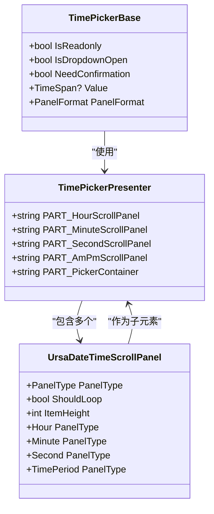

**图表来源**
- [TimePicker.axaml:9-101](file://src/Avalonia.UI/Theme/Controls/TimePicker.axaml#L9-L101)

#### 时间格式化流程

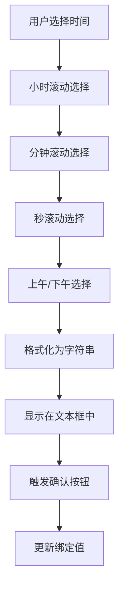

**图表来源**
- [TimePicker.axaml:103-244](file://src/Avalonia.UI/Theme/Controls/TimePicker.axaml#L103-L244)

**章节来源**
- [TimePickerDemoViewModel.cs:13-18](file://plugins/Avalonia.Plugin.DateTime/ViewModels/TimePickerDemoViewModel.cs#L13-L18)
- [TimePicker.axaml:1-245](file://src/Avalonia.UI/Theme/Controls/TimePicker.axaml#L1-L245)

### 导航集成与菜单配置

插件通过特性系统实现自动化的导航和菜单集成：

#### 菜单系统集成

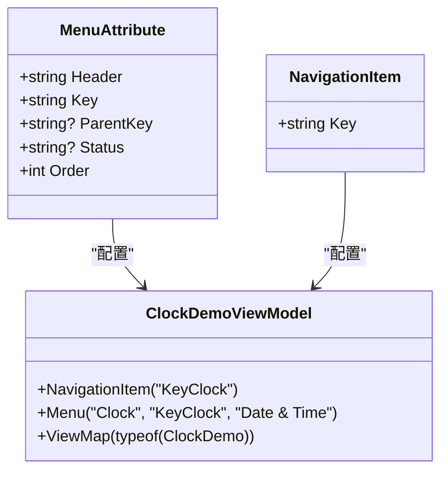

**图表来源**
- [MenuAttribute.cs:11-38](file://src/Avalonia.Plugin.Shared/Attributes/MenuAttribute.cs#L11-L38)
- [ClockDemoViewModel.cs:9-11](file://plugins/Avalonia.Plugin.DateTime/ViewModels/ClockDemoViewModel.cs#L9-L11)

**章节来源**
- [MenuAttribute.cs:1-39](file://src/Avalonia.Plugin.Shared/Attributes/MenuAttribute.cs#L1-L39)
- [ClockDemoViewModel.cs:9-11](file://plugins/Avalonia.Plugin.DateTime/ViewModels/ClockDemoViewModel.cs#L9-L11)

## 依赖关系分析

插件系统采用松耦合的设计模式，通过特性驱动的依赖注入实现模块化：

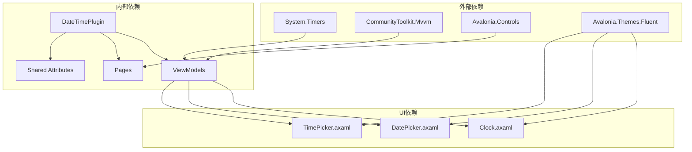

**图表来源**
- [ClockDemoViewModel.cs:1-6](file://plugins/Avalonia.Plugin.DateTime/ViewModels/ClockDemoViewModel.cs#L1-L6)
- [DateTimePlugin.cs:1-3](file://plugins/Avalonia.Plugin.DateTime/DateTimePlugin.cs#L1-L3)

**章节来源**
- [ClockDemoViewModel.cs:1-6](file://plugins/Avalonia.Plugin.DateTime/ViewModels/ClockDemoViewModel.cs#L1-L6)
- [DateTimePlugin.cs:1-3](file://plugins/Avalonia.Plugin.DateTime/DateTimePlugin.cs#L1-L3)

## 性能考虑

### 内存管理优化

1. **定时器资源管理**：Clock组件正确实现了IDisposable接口，在构造函数中启动定时器，在Dispose中释放资源
2. **事件订阅管理**：避免内存泄漏，确保事件订阅在适当时候解除
3. **UI线程优化**：所有UI更新都在主线程执行，避免跨线程访问问题

### 渲染性能优化

1. **角度计算缓存**：Clock控件的角度计算基于绑定属性，利用Avalonia的数据绑定机制实现高效更新
2. **模板复用**：控件主题通过ResourceDictionary定义，支持模板复用和样式继承
3. **延迟加载**：弹出式组件（DatePicker、TimePicker）采用延迟加载策略，减少初始渲染负担

## 故障排除指南

### 常见问题及解决方案

#### 时间不更新问题
- **症状**：Clock显示时间不变化
- **原因**：定时器未启动或事件处理异常
- **解决**：检查定时器初始化和Elapsed事件订阅

#### 日期选择异常
- **症状**：DatePicker无法正常显示或选择日期
- **原因**：弹出窗口定位或日历视图配置错误
- **解决**：验证Popup组件的Placement和IsOpen绑定

#### 时间格式化错误
- **症状**：TimePicker显示格式不符合预期
- **原因**：PanelFormat属性配置不当或转换器缺失
- **解决**：检查PanelFormat设置和相关转换器

**章节来源**
- [ClockDemoViewModel.cs:31-36](file://plugins/Avalonia.Plugin.DateTime/ViewModels/ClockDemoViewModel.cs#L31-L36)
- [DatePicker.axaml:70-77](file://src/Avalonia.UI/Theme/Controls/DatePicker.axaml#L70-L77)
- [TimePicker.axaml:191-193](file://src/Avalonia.UI/Theme/Controls/TimePicker.axaml#L191-L193)

## 结论

DateTimePlugin展示了Avalonia插件开发的最佳实践，包括：

1. **模块化设计**：清晰的分层架构和职责分离
2. **特性驱动开发**：通过特性实现自动化配置和集成
3. **MVVM模式**：规范的数据绑定和业务逻辑分离
4. **主题系统**：可定制的UI外观和样式
5. **性能优化**：合理的资源管理和渲染优化

该插件为开发者提供了完整的日期时间处理解决方案，可以作为其他功能插件开发的参考模板。

## 附录

### 开发最佳实践

1. **代码组织**：遵循MVVM模式，保持ViewModel和View的职责分离
2. **资源管理**：及时释放定时器和其他系统资源
3. **错误处理**：实现适当的异常处理和资源清理
4. **测试覆盖**：为关键功能编写单元测试和集成测试
5. **文档维护**：保持代码注释和文档的同步更新

### 扩展建议

1. **国际化支持**：添加多语言本地化支持
2. **无障碍访问**：增强屏幕阅读器和键盘导航支持
3. **性能监控**：集成性能指标收集和分析
4. **插件间通信**：实现插件间的解耦通信机制
5. **配置管理**：提供灵活的运行时配置选项