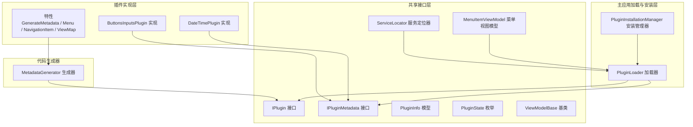
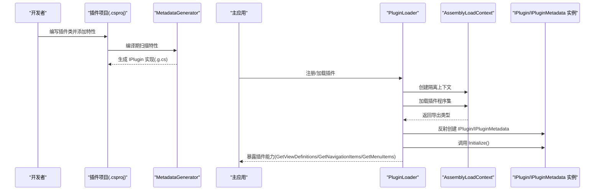
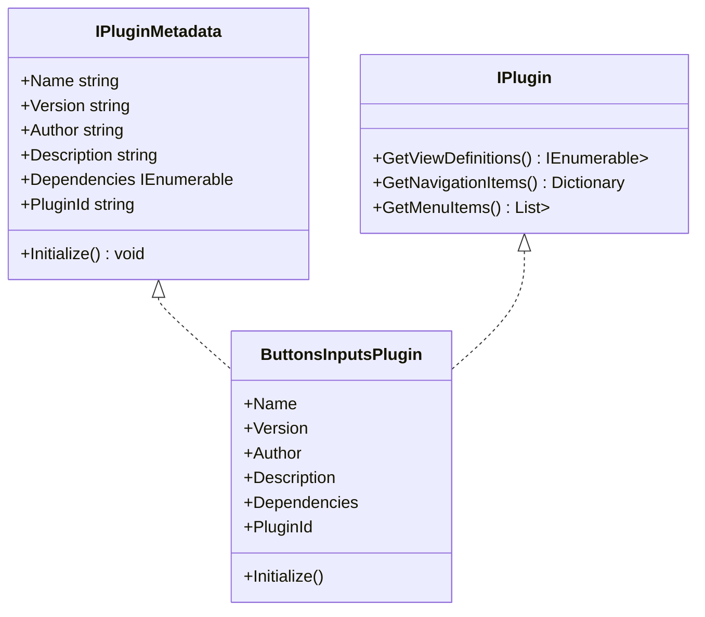
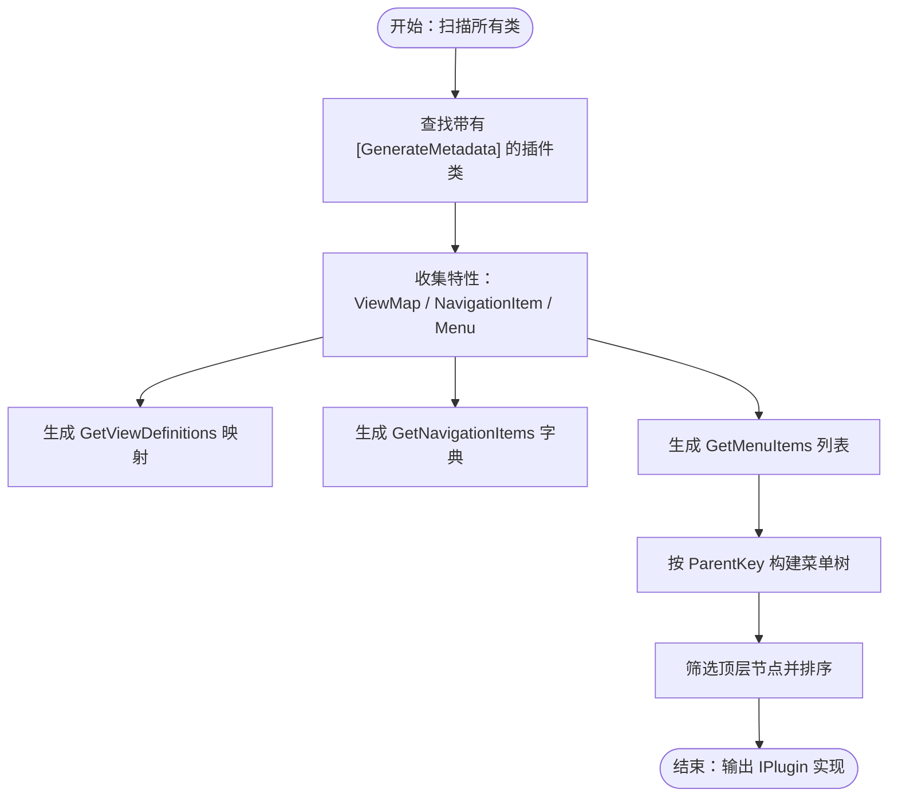
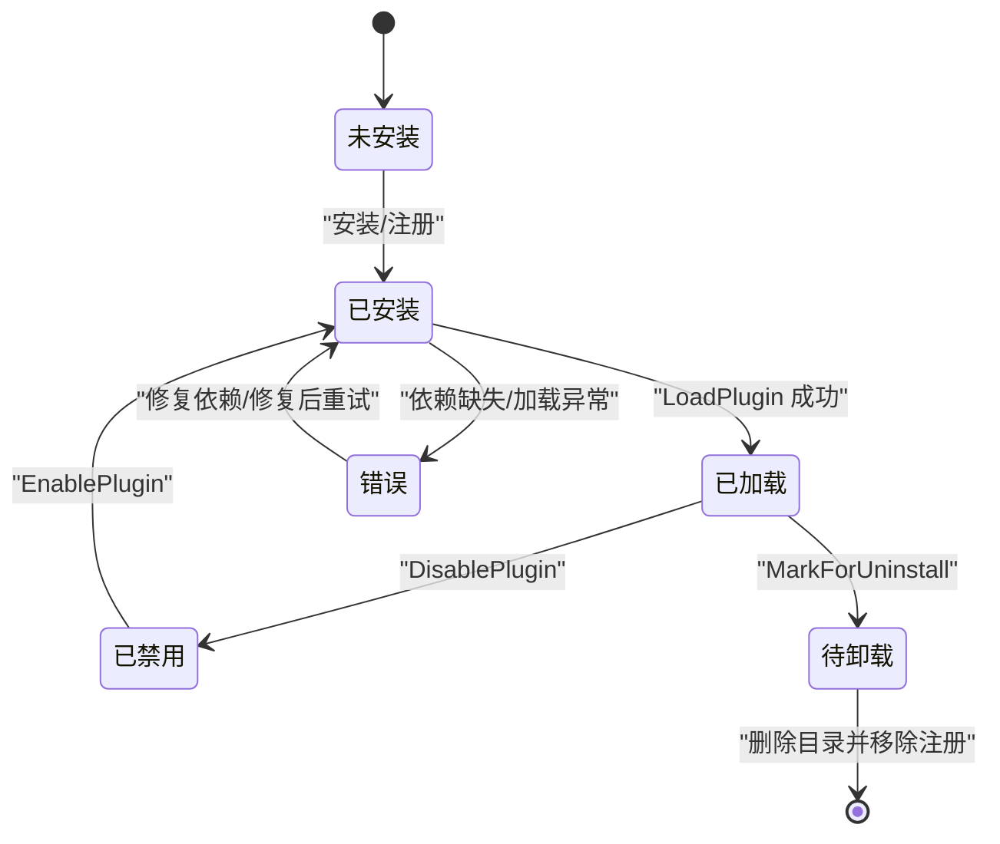
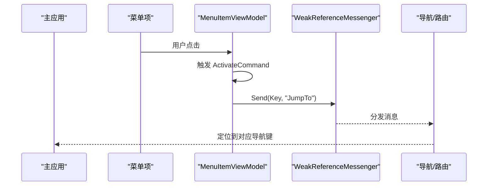
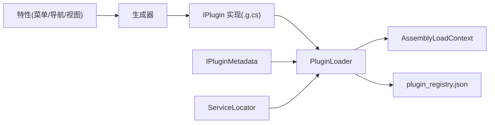

# 插件开发基础

<cite>
**本文档引用的文件**
- [IPlugin.cs](file://src/Avalonia.Plugin.Shared/IPlugin.cs)
- [IPluginMetadata.cs](file://src/Avalonia.Plugin.Shared/IPluginMetadata.cs)
- [GenerateMetadataAttribute.cs](file://src/Avalonia.Plugin.Shared/Attributes/GenerateMetadataAttribute.cs)
- [MenuAttribute.cs](file://src/Avalonia.Plugin.Shared/Attributes/MenuAttribute.cs)
- [NavigationItemAttribute.cs](file://src/Avalonia.Plugin.Shared/Attributes/NavigationItemAttribute.cs)
- [ViewMapAttribute.cs](file://src/Avalonia.Plugin.Shared/Attributes/ViewMapAttribute.cs)
- [ButtonsInputsPlugin.cs](file://plugins/Avalonia.Plugin.ButtonsInputs/ButtonsInputsPlugin.cs)
- [DateTimePlugin.cs](file://plugins/Avalonia.Plugin.DateTime/DateTimePlugin.cs)
- [PluginInfo.cs](file://src/Avalonia.Plugin.Shared/Models/PluginInfo.cs)
- [PluginState.cs](file://src/Avalonia.Plugin.Shared/Models/PluginState.cs)
- [PluginLoader.cs](file://src/Avalonia.UI/Serivces/PluginLoader.cs)
- [PluginInstallationManager.cs](file://src/Avalonia.UI/Serivces/PluginInstallationManager.cs)
- [MetadataGenerator.cs](file://src/Avalonia.Plugin.Generators/MetadataGenerator.cs)
- [ServiceLocator.cs](file://src/Avalonia.Plugin.Shared/ServiceLocator.cs)
- [ViewModelBase.cs](file://src/Avalonia.Plugin.Shared/ViewModelBase.cs)
- [MenuItemViewModel.cs](file://src/Avalonia.Plugin.Shared/ViewModels/MenuItemViewModel.cs)
</cite>

## 目录
1. [简介](#简介)
2. [项目结构](#项目结构)
3. [核心组件](#核心组件)
4. [架构总览](#架构总览)
5. [详细组件分析](#详细组件分析)
6. [依赖分析](#依赖分析)
7. [性能考虑](#性能考虑)
8. [故障排查指南](#故障排查指南)
9. [结论](#结论)
10. [附录](#附录)

## 简介
本指南面向初学者，系统讲解该Avalonia模板中的插件系统：从核心接口设计、元数据与属性装饰器、到生命周期管理、安装与加载流程，再到与主应用的交互方式（导航、菜单、视图映射、服务注册与依赖注入）。通过循序渐进的概念说明与可视化图示，帮助你快速掌握插件开发的基础知识与实践路径。

## 项目结构
插件系统由“共享接口层”“插件实现层”“主应用加载与安装层”“代码生成器”四部分组成：
- 共享接口层：定义插件契约（IPlugin、IPluginMetadata）、通用模型（PluginInfo、PluginState）、工具（ServiceLocator、ViewModelBase）与菜单模型（MenuItemViewModel）。
- 插件实现层：各插件项目实现IPlugin或IPluginMetadata，并通过特性声明元数据与交互能力。
- 主应用加载与安装层：负责插件发现、加载、卸载、启用/禁用、安装/卸载包等。
- 代码生成器：在编译期扫描特性，自动生成IPlugin实现（导航项、菜单树、视图映射）。

图表来源
- [IPlugin.cs:1-81](file://src/Avalonia.Plugin.Shared/IPlugin.cs#L1-L81)
- [IPluginMetadata.cs:1-44](file://src/Avalonia.Plugin.Shared/IPluginMetadata.cs#L1-L44)
- [PluginInfo.cs:1-19](file://src/Avalonia.Plugin.Shared/Models/PluginInfo.cs#L1-L19)
- [PluginState.cs:1-12](file://src/Avalonia.Plugin.Shared/Models/PluginState.cs#L1-L12)
- [PluginLoader.cs:1-460](file://src/Avalonia.UI/Serivces/PluginLoader.cs#L1-L460)
- [PluginInstallationManager.cs:1-261](file://src/Avalonia.UI/Serivces/PluginInstallationManager.cs#L1-L261)
- [MetadataGenerator.cs:1-246](file://src/Avalonia.Plugin.Generators/MetadataGenerator.cs#L1-L246)
- [ButtonsInputsPlugin.cs:1-100](file://plugins/Avalonia.Plugin.ButtonsInputs/ButtonsInputsPlugin.cs#L1-L100)
- [DateTimePlugin.cs:1-20](file://plugins/Avalonia.Plugin.DateTime/DateTimePlugin.cs#L1-L20)

章节来源
- [IPlugin.cs:1-81](file://src/Avalonia.Plugin.Shared/IPlugin.cs#L1-L81)
- [IPluginMetadata.cs:1-44](file://src/Avalonia.Plugin.Shared/IPluginMetadata.cs#L1-L44)
- [PluginInfo.cs:1-19](file://src/Avalonia.Plugin.Shared/Models/PluginInfo.cs#L1-L19)
- [PluginState.cs:1-12](file://src/Avalonia.Plugin.Shared/Models/PluginState.cs#L1-L12)
- [PluginLoader.cs:1-460](file://src/Avalonia.UI/Serivces/PluginLoader.cs#L1-L460)
- [PluginInstallationManager.cs:1-261](file://src/Avalonia.UI/Serivces/PluginInstallationManager.cs#L1-L261)
- [MetadataGenerator.cs:1-246](file://src/Avalonia.Plugin.Generators/MetadataGenerator.cs#L1-L246)
- [ButtonsInputsPlugin.cs:1-100](file://plugins/Avalonia.Plugin.ButtonsInputs/ButtonsInputsPlugin.cs#L1-L100)
- [DateTimePlugin.cs:1-20](file://plugins/Avalonia.Plugin.DateTime/DateTimePlugin.cs#L1-L20)

## 核心组件
- IPlugin：定义插件向宿主暴露的能力清单，包括视图与ViewModel映射、导航项、菜单项。
- IPluginMetadata：定义插件元数据与初始化入口，便于统一管理插件信息。
- 特性系统：GenerateMetadata、Menu、NavigationItem、ViewMap，用于在编译期生成IPlugin实现。
- 加载器与安装管理器：负责插件的发现、加载、卸载、启用/禁用、安装/卸载包与依赖校验。
- 服务定位器：提供全局IServiceProvider访问与本地注册服务的便捷方法。
- 菜单与视图模型：MenuItemViewModel支持命令激活、分组、排序、弱引用消息传递。

章节来源
- [IPlugin.cs:1-81](file://src/Avalonia.Plugin.Shared/IPlugin.cs#L1-L81)
- [IPluginMetadata.cs:1-44](file://src/Avalonia.Plugin.Shared/IPluginMetadata.cs#L1-L44)
- [GenerateMetadataAttribute.cs:1-4](file://src/Avalonia.Plugin.Shared/Attributes/GenerateMetadataAttribute.cs#L1-L4)
- [MenuAttribute.cs:1-39](file://src/Avalonia.Plugin.Shared/Attributes/MenuAttribute.cs#L1-L39)
- [NavigationItemAttribute.cs:1-8](file://src/Avalonia.Plugin.Shared/Attributes/NavigationItemAttribute.cs#L1-L8)
- [ViewMapAttribute.cs:1-9](file://src/Avalonia.Plugin.Shared/Attributes/ViewMapAttribute.cs#L1-L9)
- [PluginLoader.cs:1-460](file://src/Avalonia.UI/Serivces/PluginLoader.cs#L1-L460)
- [PluginInstallationManager.cs:1-261](file://src/Avalonia.UI/Serivces/PluginInstallationManager.cs#L1-L261)
- [ServiceLocator.cs:1-64](file://src/Avalonia.Plugin.Shared/ServiceLocator.cs#L1-L64)
- [MenuItemViewModel.cs:1-40](file://src/Avalonia.Plugin.Shared/ViewModels/MenuItemViewModel.cs#L1-L40)

## 架构总览
下图展示了插件系统的关键交互：插件通过特性声明元数据与交互点；编译期生成器根据特性生成IPlugin实现；运行时加载器通过独立的AssemblyLoadContext加载插件程序集，解析导出类型并实例化IPlugin与IPluginMetadata；安装管理器负责包安装、元数据解析与依赖验证；ServiceLocator为插件与宿主提供服务访问。

图表来源
- [MetadataGenerator.cs:1-246](file://src/Avalonia.Plugin.Generators/MetadataGenerator.cs#L1-L246)
- [PluginLoader.cs:1-460](file://src/Avalonia.UI/Serivces/PluginLoader.cs#L1-L460)
- [ButtonsInputsPlugin.cs:1-100](file://plugins/Avalonia.Plugin.ButtonsInputs/ButtonsInputsPlugin.cs#L1-L100)
- [DateTimePlugin.cs:1-20](file://plugins/Avalonia.Plugin.DateTime/DateTimePlugin.cs#L1-L20)

## 详细组件分析

### IPlugin 接口设计与实现要求
- 设计目标：以最小接口暴露插件能力，便于宿主统一集成。
- 关键方法：
  - GetViewDefinitions：返回 ViewModel 到 View 的工厂映射，用于动态绑定。
  - GetNavigationItems：返回导航键到 ViewModel 工厂的字典，用于页面导航。
  - GetMenuItems：返回菜单项列表（含父子关系），用于主菜单展示。
- 实现建议：
  - 使用特性驱动的编译期生成（见下节），避免手写样板代码。
  - 保持方法幂等、无副作用，避免在这些方法中执行重任务。
  - 将复杂初始化移至 IPluginMetadata.Initialize 中。

图表来源
- [IPlugin.cs:1-81](file://src/Avalonia.Plugin.Shared/IPlugin.cs#L1-L81)
- [IPluginMetadata.cs:1-44](file://src/Avalonia.Plugin.Shared/IPluginMetadata.cs#L1-L44)
- [ButtonsInputsPlugin.cs:1-100](file://plugins/Avalonia.Plugin.ButtonsInputs/ButtonsInputsPlugin.cs#L1-L100)

章节来源
- [IPlugin.cs:1-81](file://src/Avalonia.Plugin.Shared/IPlugin.cs#L1-L81)
- [ButtonsInputsPlugin.cs:1-100](file://plugins/Avalonia.Plugin.ButtonsInputs/ButtonsInputsPlugin.cs#L1-L100)

### 插件元数据管理与属性装饰器
- GenerateMetadataAttribute：标记插件类，触发生成器在编译期为其生成 IPlugin 实现。
- MenuAttribute：为 ViewModel 标记菜单项，支持标题、键、父级、状态、排序等。
- NavigationItemAttribute：为 ViewModel 标记导航项键。
- ViewMapAttribute：建立 ViewModel 与 View 的类型映射。
- 生成器行为：
  - 扫描所有类，收集上述特性的使用情况。
  - 生成 GetViewDefinitions、GetNavigationItems、GetMenuItems 的实现。
  - 构建菜单树：根据 ParentKey 自动补全缺失父节点，最终输出顶层菜单项并按 Order 排序。

图表来源
- [MetadataGenerator.cs:1-246](file://src/Avalonia.Plugin.Generators/MetadataGenerator.cs#L1-L246)
- [GenerateMetadataAttribute.cs:1-4](file://src/Avalonia.Plugin.Shared/Attributes/GenerateMetadataAttribute.cs#L1-L4)
- [MenuAttribute.cs:1-39](file://src/Avalonia.Plugin.Shared/Attributes/MenuAttribute.cs#L1-L39)
- [NavigationItemAttribute.cs:1-8](file://src/Avalonia.Plugin.Shared/Attributes/NavigationItemAttribute.cs#L1-L8)
- [ViewMapAttribute.cs:1-9](file://src/Avalonia.Plugin.Shared/Attributes/ViewMapAttribute.cs#L1-L9)

章节来源
- [MetadataGenerator.cs:1-246](file://src/Avalonia.Plugin.Generators/MetadataGenerator.cs#L1-L246)
- [GenerateMetadataAttribute.cs:1-4](file://src/Avalonia.Plugin.Shared/Attributes/GenerateMetadataAttribute.cs#L1-L4)
- [MenuAttribute.cs:1-39](file://src/Avalonia.Plugin.Shared/Attributes/MenuAttribute.cs#L1-L39)
- [NavigationItemAttribute.cs:1-8](file://src/Avalonia.Plugin.Shared/Attributes/NavigationItemAttribute.cs#L1-L8)
- [ViewMapAttribute.cs:1-9](file://src/Avalonia.Plugin.Shared/Attributes/ViewMapAttribute.cs#L1-L9)

### 插件生命周期管理机制
- 状态机：未安装、已安装、已加载、已禁用、待卸载、错误。
- 关键操作：
  - 加载：创建隔离的 AssemblyLoadContext，反射解析 IPlugin 与 IPluginMetadata，调用 Initialize。
  - 卸载：移除缓存、释放上下文，回到已安装状态。
  - 启用/禁用：更新状态并触发事件；启用时尝试加载。
  - 待卸载：清理插件目录后从注册表移除。
- 依赖校验：加载前检查依赖是否已加载，否则置为错误并记录原因。

图表来源
- [PluginState.cs:1-12](file://src/Avalonia.Plugin.Shared/Models/PluginState.cs#L1-L12)
- [PluginLoader.cs:1-460](file://src/Avalonia.UI/Serivces/PluginLoader.cs#L1-L460)

章节来源
- [PluginState.cs:1-12](file://src/Avalonia.Plugin.Shared/Models/PluginState.cs#L1-L12)
- [PluginLoader.cs:1-460](file://src/Avalonia.UI/Serivces/PluginLoader.cs#L1-L460)

### 插件与主应用程序的交互方式
- 导航与菜单：
  - 通过 IPlugin.GetNavigationItems 提供导航键到 ViewModel 工厂的映射。
  - 通过 IPlugin.GetMenuItems 提供菜单树，支持分组、状态、排序与激活命令。
  - 菜单项激活通过弱引用消息发送键值，宿主据此跳转。
- 视图映射：
  - 通过 IPlugin.GetViewDefinitions 将 ViewModel 与 View 绑定，实现动态渲染。
- 服务注册与依赖注入：
  - 使用 ServiceLocator.Initialize 设置全局 IServiceProvider。
  - 在插件中通过 ServiceLocator.GetService<T>() 获取服务；也可在宿主侧通过扩展方法注册服务。
- 事件通信：
  - 菜单项激活使用 WeakReferenceMessenger.Default 发送消息，降低耦合。

图表来源
- [MenuItemViewModel.cs:1-40](file://src/Avalonia.Plugin.Shared/ViewModels/MenuItemViewModel.cs#L1-L40)
- [IPlugin.cs:1-81](file://src/Avalonia.Plugin.Shared/IPlugin.cs#L1-L81)

章节来源
- [MenuItemViewModel.cs:1-40](file://src/Avalonia.Plugin.Shared/ViewModels/MenuItemViewModel.cs#L1-L40)
- [IPlugin.cs:1-81](file://src/Avalonia.Plugin.Shared/IPlugin.cs#L1-L81)
- [ServiceLocator.cs:1-64](file://src/Avalonia.Plugin.Shared/ServiceLocator.cs#L1-L64)

### 插件开发基本流程与步骤
- 项目结构规划
  - 插件项目命名：Avalonia.Plugin.{功能名}.csproj
  - 目录组织：ViewModels、Pages、Converters、Services（如需）
- 命名约定与代码规范
  - 插件类使用 [GenerateMetadata] 标注，实现 IPluginMetadata（可 partial）
  - ViewModel 使用 ViewModelBase 基类，遵循 MVVM 命名约定（XxxViewModel.cs）
  - 页面使用 Xxx.axaml/xaml.cs，与 ViewModel 对应
- 开发步骤
  - 在 ViewModel 上添加 [Menu]、[NavigationItem]、[ViewMap] 特性
  - 编译项目，生成器会自动生成 IPlugin 实现
  - 在插件类中实现 IPluginMetadata 的属性与 Initialize
  - 在主应用中通过 PluginLoader 注册/加载插件
- 安装与发布
  - 使用 PluginInstallationManager 从文件流/压缩包安装
  - 支持 nuspec 元数据解析与 plugin.json 回退方案

章节来源
- [ButtonsInputsPlugin.cs:1-100](file://plugins/Avalonia.Plugin.ButtonsInputs/ButtonsInputsPlugin.cs#L1-L100)
- [DateTimePlugin.cs:1-20](file://plugins/Avalonia.Plugin.DateTime/DateTimePlugin.cs#L1-L20)
- [PluginInstallationManager.cs:1-261](file://src/Avalonia.UI/Serivces/PluginInstallationManager.cs#L1-L261)
- [MetadataGenerator.cs:1-246](file://src/Avalonia.Plugin.Generators/MetadataGenerator.cs#L1-L246)

## 依赖分析
- 组件内聚与耦合
  - IPlugin 与 IPluginMetadata 低耦合：前者专注能力暴露，后者专注元数据与初始化。
  - 生成器与插件实现解耦：通过特性声明，编译期生成，运行时无需手写。
  - 加载器与插件实现解耦：通过反射与隔离上下文加载，避免强引用。
- 外部依赖与集成点
  - System.Reflection：用于反射解析导出类型。
  - System.Text.Json：用于序列化/反序列化插件注册表与元数据。
  - CommunityToolkit.Mvvm：用于 ViewModel 基类与命令。
- 潜在循环依赖
  - 插件不应直接引用宿主的 UI 层；通过 IPlugin 抽象进行交互，避免循环。

图表来源
- [MetadataGenerator.cs:1-246](file://src/Avalonia.Plugin.Generators/MetadataGenerator.cs#L1-L246)
- [PluginLoader.cs:1-460](file://src/Avalonia.UI/Serivces/PluginLoader.cs#L1-L460)
- [ServiceLocator.cs:1-64](file://src/Avalonia.Plugin.Shared/ServiceLocator.cs#L1-L64)

章节来源
- [PluginLoader.cs:1-460](file://src/Avalonia.UI/Serivces/PluginLoader.cs#L1-L460)
- [ServiceLocator.cs:1-64](file://src/Avalonia.Plugin.Shared/ServiceLocator.cs#L1-L64)

## 性能考虑
- 加载隔离：使用独立的 AssemblyLoadContext 隔离插件程序集，避免内存泄漏与类型冲突。
- 懒加载：优先在首次需要时才创建 ViewModel/View，减少启动开销。
- 依赖校验：在加载前完成依赖检查，避免运行时失败。
- 生成器优化：特性扫描与代码生成在编译期完成，运行时仅执行反射与实例化。
- 序列化：注册表读写采用异步/流式处理，避免阻塞主线程。

## 故障排查指南
- 插件无法加载
  - 检查程序集路径是否存在；查看状态是否为错误并读取错误信息。
  - 确认依赖是否已加载；若缺失，先安装/启用依赖插件。
- 未出现菜单/导航
  - 确认 ViewModel 是否正确标注 [Menu]/[NavigationItem]/[ViewMap]。
  - 检查生成器是否成功生成 IPlugin 实现（查看生成的 .g.cs 文件）。
- 服务未找到
  - 确保 ServiceLocator.Initialize 已调用并传入有效 IServiceProvider。
  - 检查服务注册是否正确，或使用 TryGetService 进行容错处理。
- 卸载失败
  - 确认插件非内置；检查待卸载流程是否触发目录删除与注册表更新。

章节来源
- [PluginLoader.cs:1-460](file://src/Avalonia.UI/Serivces/PluginLoader.cs#L1-L460)
- [PluginInstallationManager.cs:1-261](file://src/Avalonia.UI/Serivces/PluginInstallationManager.cs#L1-L261)
- [ServiceLocator.cs:1-64](file://src/Avalonia.Plugin.Shared/ServiceLocator.cs#L1-L64)

## 结论
该插件系统通过“特性 + 生成器 + 反射 + 隔离加载”的组合，实现了低耦合、可扩展且易于维护的插件生态。开发者只需专注于业务实现与特性标注，即可快速交付插件；主应用通过统一的加载与安装管理器实现对插件的全生命周期控制。建议在实际项目中严格遵循命名与结构规范，充分利用生成器减少样板代码，并通过服务定位器与消息机制实现松耦合交互。

## 附录
- 插件模型字段说明
  - PluginId：插件唯一标识
  - Name/Version/Author/Description：元数据
  - Dependencies：依赖的插件ID列表
  - InstallPath/AssemblyPath：安装目录与主程序集路径
  - State：当前状态（枚举）
  - IsBuiltIn/HasMetadata/ErrorMessage/InstallTime：辅助信息

章节来源
- [PluginInfo.cs:1-19](file://src/Avalonia.Plugin.Shared/Models/PluginInfo.cs#L1-L19)
- [PluginState.cs:1-12](file://src/Avalonia.Plugin.Shared/Models/PluginState.cs#L1-L12)