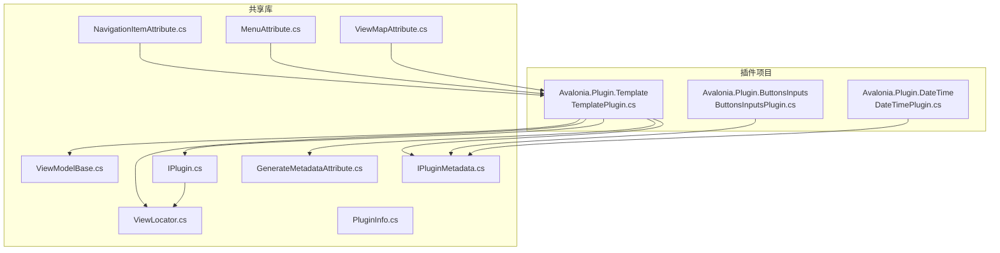
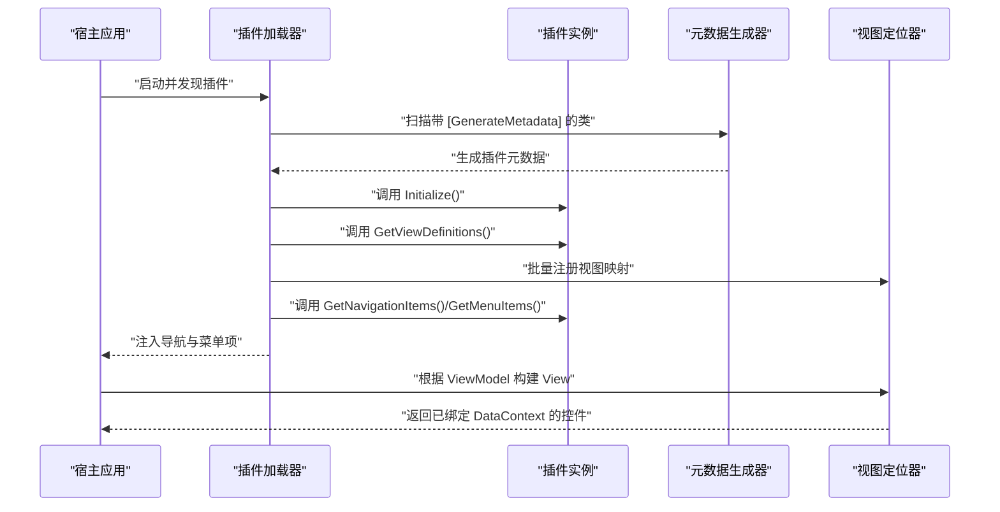
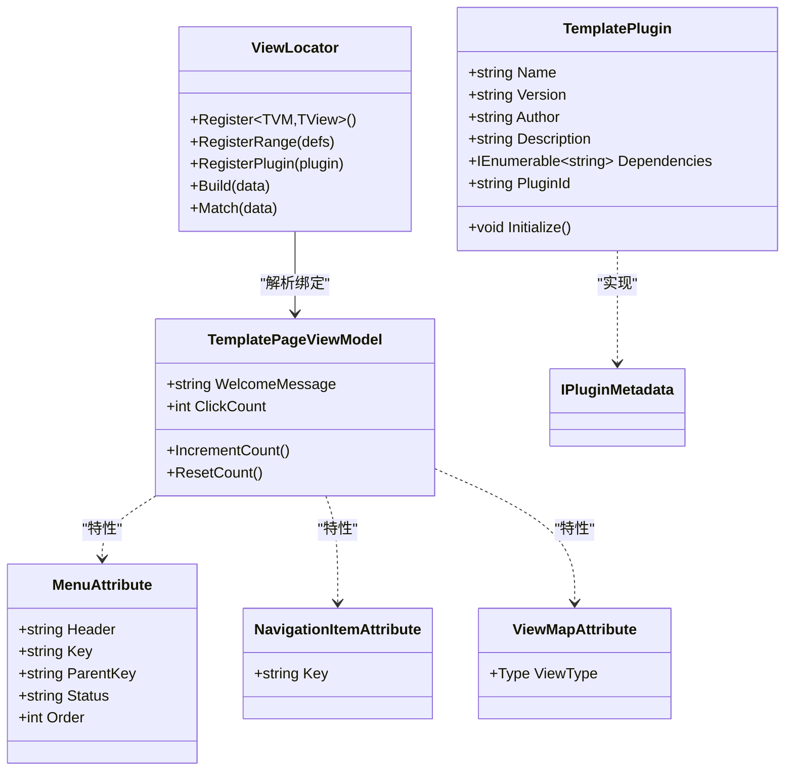
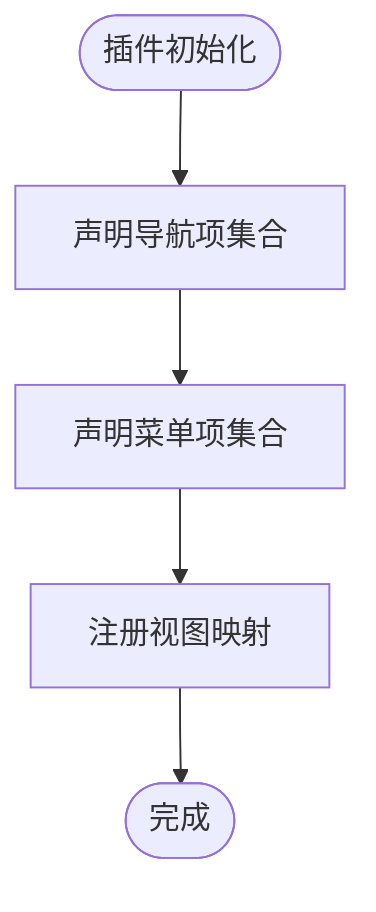
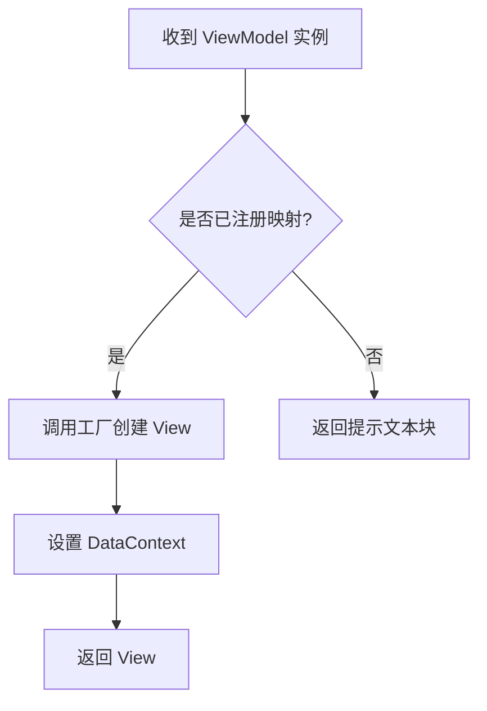
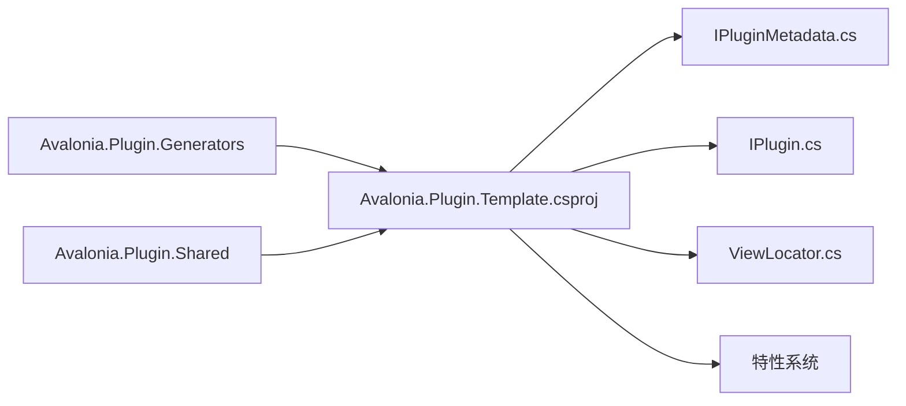

# 插件开发教程

<cite>
**本文引用的文件**
- [TemplatePlugin.cs](file://plugins/Avalonia.Plugin.Template/TemplatePlugin.cs)
- [Avalonia.Plugin.Template.csproj](file://plugins/Avalonia.Plugin.Template/Avalonia.Plugin.Template.csproj)
- [TemplatePage.axaml](file://plugins/Avalonia.Plugin.Template/Pages/TemplatePage.axaml)
- [TemplatePageViewModel.cs](file://plugins/Avalonia.Plugin.Template/ViewModels/TemplatePageViewModel.cs)
- [ButtonsInputsPlugin.cs](file://plugins/Avalonia.Plugin.ButtonsInputs/ButtonsInputsPlugin.cs)
- [DateTimePlugin.cs](file://plugins/Avalonia.Plugin.DateTime/DateTimePlugin.cs)
- [IPlugin.cs](file://src/Avalonia.Plugin.Shared/IPlugin.cs)
- [IPluginMetadata.cs](file://src/Avalonia.Plugin.Shared/IPluginMetadata.cs)
- [ViewLocator.cs](file://src/Avalonia.Plugin.Shared/ViewLocator.cs)
- [GenerateMetadataAttribute.cs](file://src/Avalonia.Plugin.Shared/Attributes/GenerateMetadataAttribute.cs)
- [NavigationItemAttribute.cs](file://src/Avalonia.Plugin.Shared/Attributes/NavigationItemAttribute.cs)
- [MenuAttribute.cs](file://src/Avalonia.Plugin.Shared/Attributes/MenuAttribute.cs)
- [ViewMapAttribute.cs](file://src/Avalonia.Plugin.Shared/Attributes/ViewMapAttribute.cs)
- [ViewModelBase.cs](file://src/Avalonia.Plugin.Shared/ViewModelBase.cs)
- [PluginInfo.cs](file://src/Avalonia.Plugin.Shared/Models/PluginInfo.cs)
</cite>

## 目录
1. [引言](#引言)
2. [项目结构](#项目结构)
3. [核心组件](#核心组件)
4. [架构总览](#架构总览)
5. [详细组件分析](#详细组件分析)
6. [依赖分析](#依赖分析)
7. [性能考虑](#性能考虑)
8. [故障排除指南](#故障排除指南)
9. [结论](#结论)
10. [附录](#附录)

## 引言
本教程面向希望基于 AvaloniaTemplate 开发插件的开发者，提供从零开始的完整指导。内容涵盖开发环境准备、项目模板使用、基础概念理解、循序渐进的示例演示（从简单模板插件到复杂业务插件）、插件项目结构与命名约定、代码规范、常见插件类型开发模式与最佳实践，以及测试、调试与部署的完整流程。教程中的所有示例均来自仓库现有插件与共享组件，确保可直接参考与落地。

## 项目结构
AvaloniaTemplate 采用多项目分层组织方式：
- plugins：插件实现目录，每个插件独立为一个类库项目，包含 Pages（视图）、ViewModels（视图模型）、Converters（转换器）等。
- src：共享库与宿主应用，包含插件系统的核心接口、元数据模型、视图定位器、特性定义等。
- launcher：桌面启动器项目，作为宿主应用入口。
- platforms：平台适配层，封装各平台的服务与集成。

下面的图示展示了插件与共享库之间的关系：

**图表来源**
- [TemplatePlugin.cs:1-20](file://plugins/Avalonia.Plugin.Template/TemplatePlugin.cs#L1-L20)
- [ButtonsInputsPlugin.cs:1-100](file://plugins/Avalonia.Plugin.ButtonsInputs/ButtonsInputsPlugin.cs#L1-L100)
- [DateTimePlugin.cs:1-20](file://plugins/Avalonia.Plugin.DateTime/DateTimePlugin.cs#L1-L20)
- [IPlugin.cs:1-81](file://src/Avalonia.Plugin.Shared/IPlugin.cs#L1-L81)
- [IPluginMetadata.cs:1-44](file://src/Avalonia.Plugin.Shared/IPluginMetadata.cs#L1-L44)
- [ViewLocator.cs:1-72](file://src/Avalonia.Plugin.Shared/ViewLocator.cs#L1-L72)
- [GenerateMetadataAttribute.cs:1-4](file://src/Avalonia.Plugin.Shared/Attributes/GenerateMetadataAttribute.cs#L1-L4)
- [NavigationItemAttribute.cs:1-8](file://src/Avalonia.Plugin.Shared/Attributes/NavigationItemAttribute.cs#L1-L8)
- [MenuAttribute.cs:1-39](file://src/Avalonia.Plugin.Shared/Attributes/MenuAttribute.cs#L1-L39)
- [ViewMapAttribute.cs:1-9](file://src/Avalonia.Plugin.Shared/Attributes/ViewMapAttribute.cs#L1-L9)
- [ViewModelBase.cs:1-12](file://src/Avalonia.Plugin.Shared/ViewModelBase.cs#L1-L12)
- [PluginInfo.cs:1-19](file://src/Avalonia.Plugin.Shared/Models/PluginInfo.cs#L1-L19)

**章节来源**
- [TemplatePlugin.cs:1-20](file://plugins/Avalonia.Plugin.Template/TemplatePlugin.cs#L1-L20)
- [Avalonia.Plugin.Template.csproj:1-15](file://plugins/Avalonia.Plugin.Template/Avalonia.Plugin.Template.csproj#L1-L15)

## 核心组件
本节介绍插件系统的关键接口与共享能力，它们是所有插件实现的基础。

- IPluginMetadata：定义插件的基本元数据与初始化入口，包括名称、版本、作者、描述、依赖、唯一标识与 Initialize 方法。
- IPlugin：定义插件对外暴露的能力，包括：
  - GetViewDefinitions：返回 ViewModel 到 View 的映射集合。
  - GetNavigationItems：返回导航项字典（键为导航键，值为 ViewModel 工厂）。
  - GetMenuItems：返回菜单项列表（包含父菜单键与排序信息）。
- ViewLocator：视图定位器，维护 ViewModel 到 View 的注册表，支持动态注册与按需构建视图。
- 特性系统：
  - GenerateMetadataAttribute：标记类生成插件元数据。
  - NavigationItemAttribute：标记 ViewModel 并指定导航键。
  - MenuAttribute：标记 ViewModel 并生成菜单项（含父键、状态、排序）。
  - ViewMapAttribute：标记 ViewModel 并指定对应的 View 类型。
- ViewModelBase：基于 CommunityToolkit.Mvvm 的可观察基类，统一插件视图模型的属性变更通知机制。
- PluginInfo：描述已安装插件的完整信息，包括安装路径、程序集路径、状态、错误信息等。

这些组件共同构成了插件的“声明式 + 运行时绑定”的开发范式，使插件可以声明导航、菜单与视图映射，由共享库在运行时解析并注入到宿主应用中。

**章节来源**
- [IPluginMetadata.cs:1-44](file://src/Avalonia.Plugin.Shared/IPluginMetadata.cs#L1-L44)
- [IPlugin.cs:1-81](file://src/Avalonia.Plugin.Shared/IPlugin.cs#L1-L81)
- [ViewLocator.cs:1-72](file://src/Avalonia.Plugin.Shared/ViewLocator.cs#L1-L72)
- [GenerateMetadataAttribute.cs:1-4](file://src/Avalonia.Plugin.Shared/Attributes/GenerateMetadataAttribute.cs#L1-L4)
- [NavigationItemAttribute.cs:1-8](file://src/Avalonia.Plugin.Shared/Attributes/NavigationItemAttribute.cs#L1-L8)
- [MenuAttribute.cs:1-39](file://src/Avalonia.Plugin.Shared/Attributes/MenuAttribute.cs#L1-L39)
- [ViewMapAttribute.cs:1-9](file://src/Avalonia.Plugin.Shared/Attributes/ViewMapAttribute.cs#L1-L9)
- [ViewModelBase.cs:1-12](file://src/Avalonia.Plugin.Shared/ViewModelBase.cs#L1-L12)
- [PluginInfo.cs:1-19](file://src/Avalonia.Plugin.Shared/Models/PluginInfo.cs#L1-L19)

## 架构总览
下图展示了插件系统在运行时的交互流程：插件通过特性声明元数据与绑定关系，共享库在启动时扫描并注册，宿主应用通过 ViewLocator 将 ViewModel 自动解析为 View。

**图表来源**
- [TemplatePlugin.cs:1-20](file://plugins/Avalonia.Plugin.Template/TemplatePlugin.cs#L1-L20)
- [IPlugin.cs:1-81](file://src/Avalonia.Plugin.Shared/IPlugin.cs#L1-L81)
- [ViewLocator.cs:1-72](file://src/Avalonia.Plugin.Shared/ViewLocator.cs#L1-L72)
- [GenerateMetadataAttribute.cs:1-4](file://src/Avalonia.Plugin.Shared/Attributes/GenerateMetadataAttribute.cs#L1-L4)

## 详细组件分析

### 组件一：模板插件（最小可用示例）
模板插件是最简实现，演示了插件元数据、特性声明、视图与视图模型绑定、菜单集成与命令处理。

- 插件元数据与初始化
  - 使用 [GenerateMetadata] 标记类，实现 IPluginMetadata 接口，提供 Name、Version、Author、Description、Dependencies、PluginId 与 Initialize。
- 视图与视图模型绑定
  - 在 ViewModel 上使用 [NavigationItem]、[Menu]、[ViewMap] 三个特性，声明导航键、菜单项与视图映射。
  - ViewLocator 根据注册表将 ViewModel 实例自动解析为对应的 View 控件并设置 DataContext。
- 页面与命令
  - 页面通过绑定 ViewModel 的属性与命令，展示点击计数与欢迎消息更新。

**图表来源**
- [TemplatePlugin.cs:1-20](file://plugins/Avalonia.Plugin.Template/TemplatePlugin.cs#L1-L20)
- [TemplatePageViewModel.cs:1-30](file://plugins/Avalonia.Plugin.Template/ViewModels/TemplatePageViewModel.cs#L1-L30)
- [ViewLocator.cs:1-72](file://src/Avalonia.Plugin.Shared/ViewLocator.cs#L1-L72)
- [MenuAttribute.cs:1-39](file://src/Avalonia.Plugin.Shared/Attributes/MenuAttribute.cs#L1-L39)
- [NavigationItemAttribute.cs:1-8](file://src/Avalonia.Plugin.Shared/Attributes/NavigationItemAttribute.cs#L1-L8)
- [ViewMapAttribute.cs:1-9](file://src/Avalonia.Plugin.Shared/Attributes/ViewMapAttribute.cs#L1-L9)

**章节来源**
- [TemplatePlugin.cs:1-20](file://plugins/Avalonia.Plugin.Template/TemplatePlugin.cs#L1-L20)
- [TemplatePage.axaml:1-49](file://plugins/Avalonia.Plugin.Template/Pages/TemplatePage.axaml#L1-L49)
- [TemplatePageViewModel.cs:1-30](file://plugins/Avalonia.Plugin.Template/ViewModels/TemplatePageViewModel.cs#L1-L30)
- [Avalonia.Plugin.Template.csproj:1-15](file://plugins/Avalonia.Plugin.Template/Avalonia.Plugin.Template.csproj#L1-L15)

### 组件二：按钮与输入控件插件
该插件展示了如何在一个插件中声明多个导航项与菜单项，体现“一个插件承载多种功能”的模式。

- 元数据与初始化
  - 同样使用 [GenerateMetadata] 标记类，实现 IPluginMetadata。
- 导航与菜单的声明式扩展
  - 通过注释掉的方法展示如何返回大量导航项与菜单项，体现插件对多页面与多菜单的组织能力。
- 视图映射
  - 可通过特性或运行时注册的方式，将多个 ViewModel 与 View 建立映射关系。

**图表来源**
- [ButtonsInputsPlugin.cs:1-100](file://plugins/Avalonia.Plugin.ButtonsInputs/ButtonsInputsPlugin.cs#L1-L100)

**章节来源**
- [ButtonsInputsPlugin.cs:1-100](file://plugins/Avalonia.Plugin.ButtonsInputs/ButtonsInputsPlugin.cs#L1-L100)

### 组件三：日期与时间插件
该插件是最小元数据插件的典型代表，强调“轻量级”插件的开发思路。

- 元数据最小化
  - 提供 Name、Version、Author、Description、Dependencies、PluginId 与 Initialize。
- 适用场景
  - 适合仅提供少量功能或作为演示用途的插件。

**章节来源**
- [DateTimePlugin.cs:1-20](file://plugins/Avalonia.Plugin.DateTime/DateTimePlugin.cs#L1-L20)

### 组件四：视图定位器（ViewLocator）
ViewLocator 是插件系统中“声明式绑定”的关键执行者，负责将 ViewModel 解析为 View。

- 注册机制
  - 支持单个注册、批量注册与插件注册三种方式。
  - 插件注册时会遍历 IPlugin.GetViewDefinitions() 返回的映射集合，并允许后加载的插件覆盖先前映射。
- 构建流程
  - Build 方法根据 ViewModel 类型查找工厂委托，创建 View 并设置 DataContext；若未找到映射，则返回友好提示文本块。
- 性能特征
  - 内部使用字典存储映射，查找为 O(1)，具备良好的运行时性能。

**图表来源**
- [ViewLocator.cs:1-72](file://src/Avalonia.Plugin.Shared/ViewLocator.cs#L1-L72)

**章节来源**
- [ViewLocator.cs:1-72](file://src/Avalonia.Plugin.Shared/ViewLocator.cs#L1-L72)

## 依赖分析
插件项目与共享库之间存在明确的依赖关系：
- 插件项目引用共享库（Avalonia.Plugin.Shared），以便使用接口、特性与工具类。
- 插件项目还引用元数据生成器（Avalonia.Plugin.Generators），用于在编译期生成插件元数据。
- 共享库提供插件系统的核心能力：接口契约、特性系统、视图定位器、视图模型基类与插件信息模型。

**图表来源**
- [Avalonia.Plugin.Template.csproj:1-15](file://plugins/Avalonia.Plugin.Template/Avalonia.Plugin.Template.csproj#L1-L15)
- [IPluginMetadata.cs:1-44](file://src/Avalonia.Plugin.Shared/IPluginMetadata.cs#L1-L44)
- [IPlugin.cs:1-81](file://src/Avalonia.Plugin.Shared/IPlugin.cs#L1-L81)
- [ViewLocator.cs:1-72](file://src/Avalonia.Plugin.Shared/ViewLocator.cs#L1-L72)

**章节来源**
- [Avalonia.Plugin.Template.csproj:1-15](file://plugins/Avalonia.Plugin.Template/Avalonia.Plugin.Template.csproj#L1-L15)

## 性能考虑
- 视图定位器采用字典存储映射，查找为 O(1)，避免了反射开销，适合高频绑定场景。
- 插件注册时允许覆盖映射，便于通过后续插件替换默认实现，但应谨慎管理覆盖策略，避免意外行为。
- 导航项与菜单项的声明式方式减少了运行时拼装成本，提升启动效率。
- 建议在插件中尽量使用轻量的视图模型与简洁的视图层次，减少布局计算与渲染压力。

## 故障排除指南
- 视图未找到
  - 现象：页面显示“未找到视图”的提示文本。
  - 排查：确认 ViewModel 是否正确标注 [ViewMap] 或插件是否在 Initialize 中返回了正确的映射。
  - 参考：ViewLocator 的 Build 方法在未匹配时会返回提示文本块。
- 导航或菜单不显示
  - 现象：导航项或菜单项缺失。
  - 排查：确认 ViewModel 是否标注 [NavigationItem] 与 [Menu]，并检查插件是否返回了导航项与菜单项集合。
- 插件初始化异常
  - 现象：插件无法加载或出现错误。
  - 排查：检查 Initialize 方法内部逻辑，查看共享库是否记录了错误信息（PluginInfo.ErrorMessage）。
- 命令未响应
  - 现象：按钮点击无反应。
  - 排查：确认 ViewModel 继承自 ViewModelBase，命令方法使用 [RelayCommand] 标注，且绑定路径正确。

**章节来源**
- [ViewLocator.cs:1-72](file://src/Avalonia.Plugin.Shared/ViewLocator.cs#L1-L72)
- [PluginInfo.cs:1-19](file://src/Avalonia.Plugin.Shared/Models/PluginInfo.cs#L1-L19)

## 结论
通过本教程，您已经掌握了 AvaloniaTemplate 插件开发的完整流程：从项目结构与命名约定，到特性声明与接口实现；从视图定位器的工作原理，到导航与菜单的声明式集成；再到性能优化与故障排除。建议以模板插件为起点，逐步扩展到更复杂的业务插件，遵循共享库提供的契约与最佳实践，确保插件的可维护性与可扩展性。

## 附录
- 开发环境准备
  - 安装 .NET SDK（目标框架为 net10.0）。
  - 使用 Avalonia UI 工程模板创建项目。
  - 在插件项目中添加对共享库与元数据生成器的引用。
- 项目模板使用
  - 参考模板插件的目录结构与命名约定，保持 Pages 与 ViewModels 的一一对应。
  - 使用特性标注 ViewModel，确保生成正确的元数据与绑定关系。
- 测试与调试
  - 在宿主应用中启用插件管理界面，验证插件加载、导航与菜单显示。
  - 使用断点跟踪 ViewLocator 的注册与构建过程，排查视图映射问题。
- 部署
  - 将插件输出复制到宿主应用的插件目录，确保插件清单与依赖满足要求。
  - 使用共享库提供的安装管理器进行安装与卸载操作。