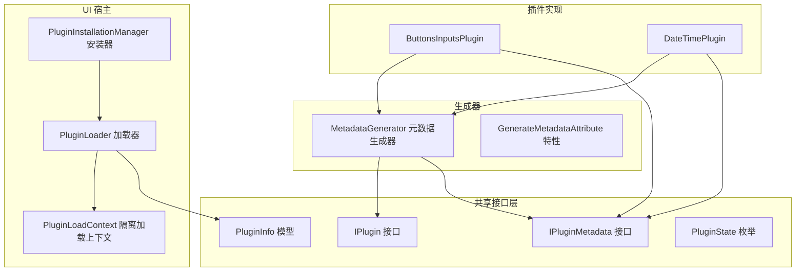
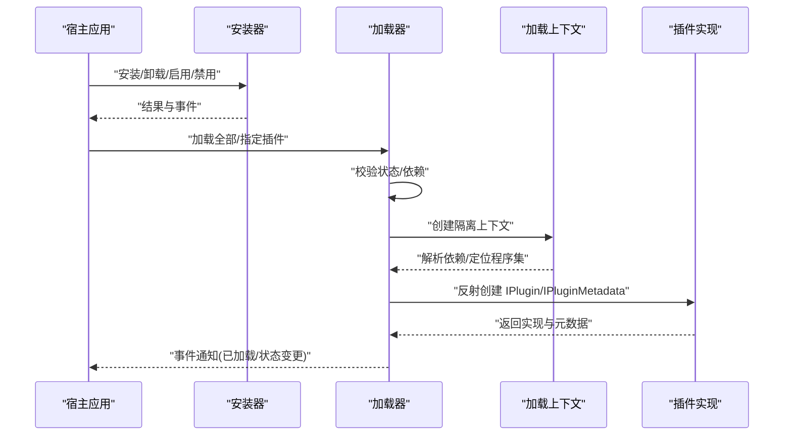
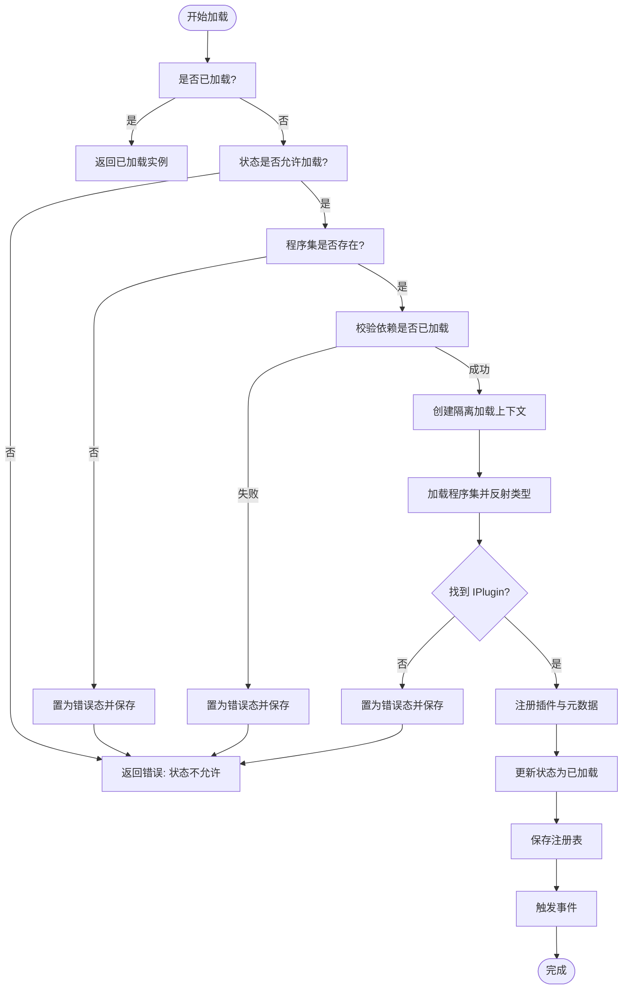
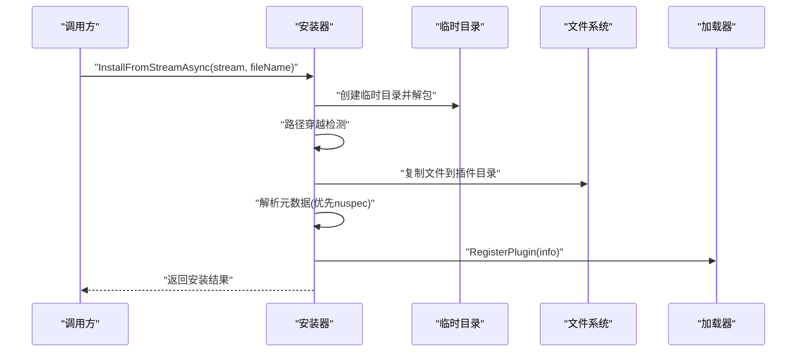
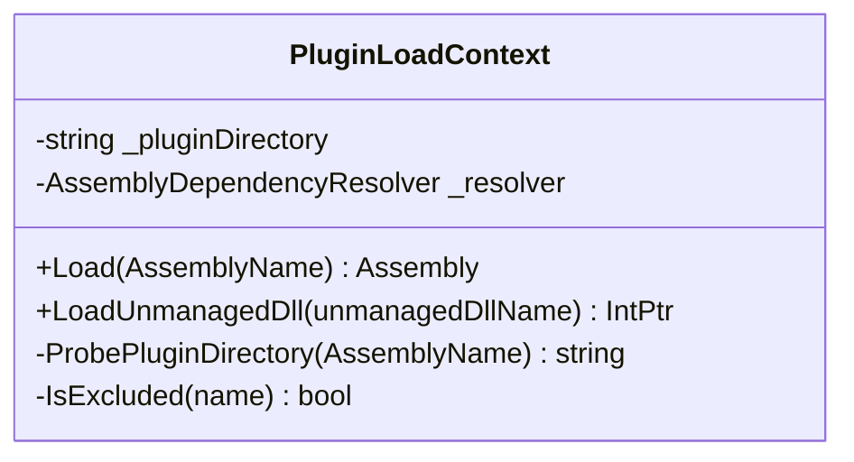
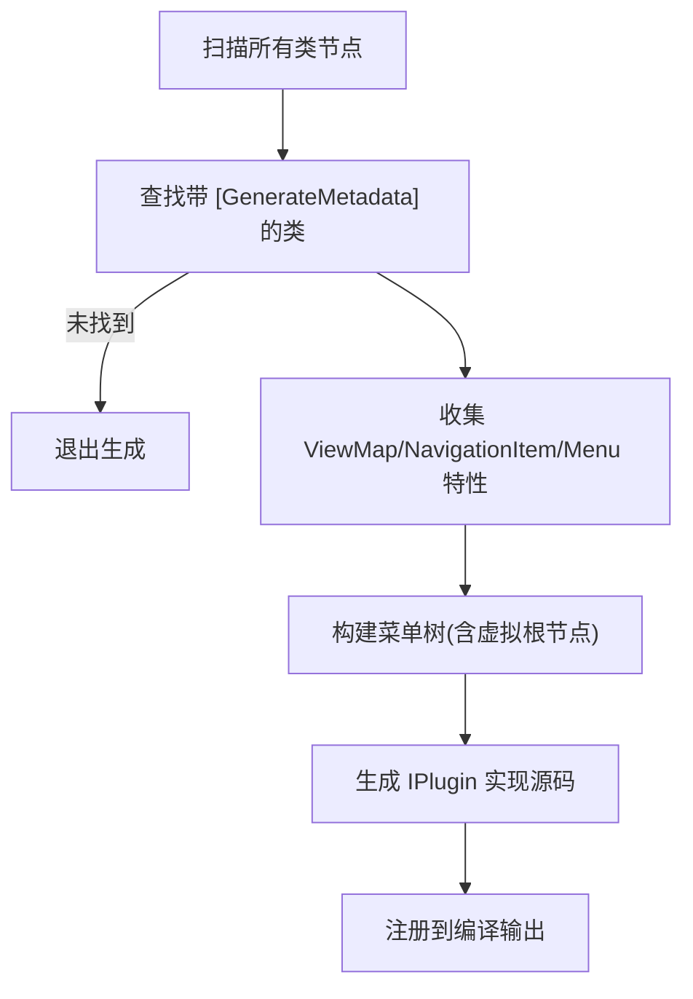
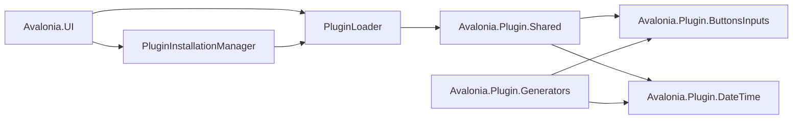
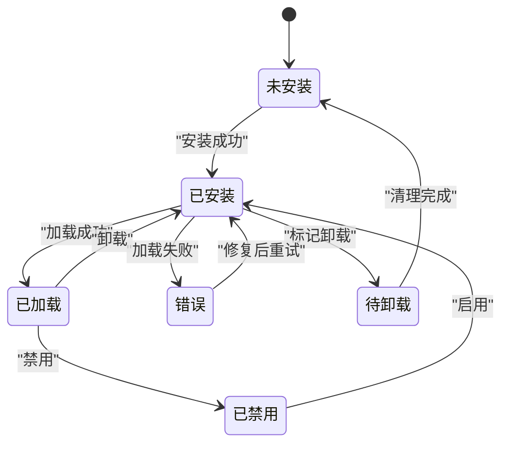

# 插件测试与调试

<cite>
**本文引用的文件**
- [IPlugin.cs](file://src/Avalonia.Plugin.Shared/IPlugin.cs)
- [IPluginMetadata.cs](file://src/Avalonia.Plugin.Shared/IPluginMetadata.cs)
- [PluginInfo.cs](file://src/Avalonia.Plugin.Shared/Models/PluginInfo.cs)
- [PluginState.cs](file://src/Avalonia.Plugin.Shared/Models/PluginState.cs)
- [IPluginLoader.cs](file://src/Avalonia.Plugin.Shared/Services/IPluginLoader.cs)
- [IPluginInstallationManager.cs](file://src/Avalonia.Plugin.Shared/Services/IPluginInstallationManager.cs)
- [PluginLoader.cs](file://src/Avalonia.UI/Services/PluginLoader.cs)
- [PluginInstallationManager.cs](file://src/Avalonia.UI/Services/PluginInstallationManager.cs)
- [PluginLoadContext.cs](file://src/Avalonia.UI/Services/PluginLoadContext.cs)
- [MetadataGenerator.cs](file://src/Avalonia.Plugin.Generators/MetadataGenerator.cs)
- [GenerateMetadataAttribute.cs](file://src/Avalonia.Plugin.Shared/Attributes/GenerateMetadataAttribute.cs)
- [ButtonsInputsPlugin.cs](file://plugins/Avalonia.Plugin.ButtonsInputs/ButtonsInputsPlugin.cs)
- [DateTimePlugin.cs](file://plugins/Avalonia.Plugin.DateTime/DateTimePlugin.cs)
- [Avalonia.Plugin.ButtonsInputs.csproj](file://plugins/Avalonia.Plugin.ButtonsInputs/Avalonia.Plugin.ButtonsInputs.csproj)
- [Avalonia.Plugin.Generators.csproj](file://src/Avalonia.Plugin.Generators/Avalonia.Plugin.Generators.csproj)
- [Avalonia.Plugin.Shared.csproj](file://src/Avalonia.Plugin.Shared/Avalonia.Plugin.Shared.csproj)
- [PluginManagementViewModel.cs](file://src/Avalonia.UI/ViewModels/PluginManagementViewModel.cs)
</cite>

## 目录
1. [简介](#简介)
2. [项目结构](#项目结构)
3. [核心组件](#核心组件)
4. [架构总览](#架构总览)
5. [详细组件分析](#详细组件分析)
6. [依赖关系分析](#依赖关系分析)
7. [性能考量](#性能考量)
8. [故障排查指南](#故障排查指南)
9. [结论](#结论)
10. [附录](#附录)

## 简介
本指南面向使用 Avalonia 插件系统的开发者，围绕插件测试与调试提供系统化方法论与实操建议。内容涵盖：
- 测试策略：单元测试、集成测试、端到端测试
- 加载失败排查：依赖冲突、版本不匹配、配置错误
- 调试最佳实践：日志记录、异常处理、性能监控
- 热重载与动态更新测试
- 质量保证与问题诊断流程

## 项目结构
该仓库采用“共享接口层 + UI宿主 + 插件实现 + 生成器”的分层组织方式：
- 共享接口层：定义插件契约与元数据模型
- UI宿主：负责插件安装、加载、卸载与状态管理
- 插件实现：各功能插件以独立项目存在，通过生成器自动生成元数据与导航/菜单映射
- 生成器：在编译期扫描特性并生成实现代码

**图表来源**
- [IPlugin.cs:9-26](file://src/Avalonia.Plugin.Shared/IPlugin.cs#L9-L26)
- [IPluginMetadata.cs:3-41](file://src/Avalonia.Plugin.Shared/IPluginMetadata.cs#L3-L41)
- [PluginInfo.cs:3-18](file://src/Avalonia.Plugin.Shared/Models/PluginInfo.cs#L3-L18)
- [PluginState.cs:3-11](file://src/Avalonia.Plugin.Shared/Models/PluginState.cs#L3-L11)
- [PluginLoader.cs:10-35](file://src/Avalonia.UI/Services/PluginLoader.cs#L10-L35)
- [PluginInstallationManager.cs:10-23](file://src/Avalonia.UI/Services/PluginInstallationManager.cs#L10-L23)
- [PluginLoadContext.cs:6-34](file://src/Avalonia.UI/Services/PluginLoadContext.cs#L6-L34)
- [MetadataGenerator.cs:7-130](file://src/Avalonia.Plugin.Generators/MetadataGenerator.cs#L7-L130)
- [GenerateMetadataAttribute.cs:1-4](file://src/Avalonia.Plugin.Shared/Attributes/GenerateMetadataAttribute.cs#L1-L4)
- [ButtonsInputsPlugin.cs:6-24](file://plugins/Avalonia.Plugin.ButtonsInputs/ButtonsInputsPlugin.cs#L6-L24)
- [DateTimePlugin.cs:6-19](file://plugins/Avalonia.Plugin.DateTime/DateTimePlugin.cs#L6-L19)

**章节来源**
- [Avalonia.Plugin.ButtonsInputs.csproj:1-20](file://plugins/Avalonia.Plugin.ButtonsInputs/Avalonia.Plugin.ButtonsInputs.csproj#L1-L20)
- [Avalonia.Plugin.Generators.csproj:1-22](file://src/Avalonia.Plugin.Generators/Avalonia.Plugin.Generators.csproj#L1-L22)
- [Avalonia.Plugin.Shared.csproj:1-30](file://src/Avalonia.Plugin.Shared/Avalonia.Plugin.Shared.csproj#L1-L30)

## 核心组件
- 插件契约与元数据
  - IPlugin：定义视图-视图模型映射、导航项、菜单项等能力
  - IPluginMetadata：定义插件元信息与初始化入口
  - PluginInfo/PluginState：承载插件注册表、状态机与错误信息
- 加载与安装
  - PluginLoader：插件发现、隔离加载、依赖校验、事件通知
  - PluginInstallationManager：从包安装/卸载、解析元数据、安全解压
  - PluginLoadContext：基于 AssemblyLoadContext 的隔离加载与依赖解析
- 编译期生成
  - MetadataGenerator：扫描特性，生成 IPlugin 实现与菜单树
  - GenerateMetadataAttribute：标记插件类由生成器处理

**章节来源**
- [IPlugin.cs:9-26](file://src/Avalonia.Plugin.Shared/IPlugin.cs#L9-L26)
- [IPluginMetadata.cs:3-41](file://src/Avalonia.Plugin.Shared/IPluginMetadata.cs#L3-L41)
- [PluginInfo.cs:3-18](file://src/Avalonia.Plugin.Shared/Models/PluginInfo.cs#L3-L18)
- [PluginState.cs:3-11](file://src/Avalonia.Plugin.Shared/Models/PluginState.cs#L3-L11)
- [IPluginLoader.cs:5-17](file://src/Avalonia.Plugin.Shared/Services/IPluginLoader.cs#L5-L17)
- [IPluginInstallationManager.cs:5-16](file://src/Avalonia.Plugin.Shared/Services/IPluginInstallationManager.cs#L5-L16)
- [PluginLoader.cs:10-156](file://src/Avalonia.UI/Services/PluginLoader.cs#L10-L156)
- [PluginInstallationManager.cs:10-151](file://src/Avalonia.UI/Services/PluginInstallationManager.cs#L10-L151)
- [PluginLoadContext.cs:6-106](file://src/Avalonia.UI/Services/PluginLoadContext.cs#L6-L106)
- [MetadataGenerator.cs:7-130](file://src/Avalonia.Plugin.Generators/MetadataGenerator.cs#L7-L130)
- [GenerateMetadataAttribute.cs:1-4](file://src/Avalonia.Plugin.Shared/Attributes/GenerateMetadataAttribute.cs#L1-L4)

## 架构总览
下图展示插件生命周期与关键交互：

**图表来源**
- [PluginInstallationManager.cs:29-151](file://src/Avalonia.UI/Services/PluginInstallationManager.cs#L29-L151)
- [PluginLoader.cs:53-156](file://src/Avalonia.UI/Services/PluginLoader.cs#L53-L156)
- [PluginLoadContext.cs:36-58](file://src/Avalonia.UI/Services/PluginLoadContext.cs#L36-L58)
- [IPluginLoader.cs:5-17](file://src/Avalonia.Plugin.Shared/Services/IPluginLoader.cs#L5-L17)

## 详细组件分析

### 组件一：插件加载器（PluginLoader）
职责与行为
- 注册表管理：持久化插件清单与状态
- 依赖校验：确保依赖已加载且可用
- 隔离加载：使用专用 AssemblyLoadContext 避免全局污染
- 事件驱动：对外广播加载/卸载/状态变化

关键流程
- 加载单个插件：检查状态、验证依赖、反射解析类型、更新状态并触发事件
- 启用/禁用/卸载：切换状态、回收上下文、清理缓存
- 批量加载：遍历注册表，跳过非安装态或错误态插件

**图表来源**
- [PluginLoader.cs:53-156](file://src/Avalonia.UI/Services/PluginLoader.cs#L53-L156)
- [PluginLoader.cs:353-372](file://src/Avalonia.UI/Services/PluginLoader.cs#L353-L372)

**章节来源**
- [PluginLoader.cs:10-460](file://src/Avalonia.UI/Services/PluginLoader.cs#L10-L460)
- [PluginState.cs:3-11](file://src/Avalonia.Plugin.Shared/Models/PluginState.cs#L3-L11)

### 组件二：插件安装器（PluginInstallationManager）
职责与行为
- 安全解包：Zip 包路径穿越检测、逐条写入目标目录
- 元数据解析：优先 nuspec，其次 plugin.json，最后回退到程序集信息
- 安装/卸载：注册插件、标记卸载、触发事件

**图表来源**
- [PluginInstallationManager.cs:40-151](file://src/Avalonia.UI/Services/PluginInstallationManager.cs#L40-L151)
- [PluginInstallationManager.cs:178-259](file://src/Avalonia.UI/Services/PluginInstallationManager.cs#L178-L259)

**章节来源**
- [IPluginInstallationManager.cs:5-23](file://src/Avalonia.Plugin.Shared/Services/IPluginInstallationManager.cs#L5-L23)
- [PluginInstallationManager.cs:10-261](file://src/Avalonia.UI/Services/PluginInstallationManager.cs#L10-L261)

### 组件三：隔离加载上下文（PluginLoadContext）
职责与行为
- 依赖解析：优先使用 Resolver，否则在插件目录内探测同名 DLL
- 排除策略：对系统/框架/平台程序集走默认上下文，避免版本冲突
- 可回收：支持卸载，释放内存与句柄

**图表来源**
- [PluginLoadContext.cs:6-106](file://src/Avalonia.UI/Services/PluginLoadContext.cs#L6-L106)

**章节来源**
- [PluginLoadContext.cs:6-106](file://src/Avalonia.UI/Services/PluginLoadContext.cs#L6-L106)

### 组件四：元数据生成器（MetadataGenerator）
职责与行为
- 扫描特性：GenerateMetadata、ViewMap、NavigationItem、Menu
- 生成代码：为插件类生成 IPlugin 实现，自动构建菜单树与导航映射
- 语法解析：支持命名参数与位置参数，生成菜单父子关系与排序

**图表来源**
- [MetadataGenerator.cs:12-130](file://src/Avalonia.Plugin.Generators/MetadataGenerator.cs#L12-L130)
- [GenerateMetadataAttribute.cs:1-4](file://src/Avalonia.Plugin.Shared/Attributes/GenerateMetadataAttribute.cs#L1-L4)

**章节来源**
- [MetadataGenerator.cs:7-246](file://src/Avalonia.Plugin.Generators/MetadataGenerator.cs#L7-L246)
- [GenerateMetadataAttribute.cs:1-4](file://src/Avalonia.Plugin.Shared/Attributes/GenerateMetadataAttribute.cs#L1-L4)

### 组件五：插件实现示例
- ButtonsInputsPlugin：演示如何标注 [GenerateMetadata] 并提供元数据
- DateTimePlugin：演示最小化元数据实现

**章节来源**
- [ButtonsInputsPlugin.cs:6-24](file://plugins/Avalonia.Plugin.ButtonsInputs/ButtonsInputsPlugin.cs#L6-L24)
- [DateTimePlugin.cs:6-19](file://plugins/Avalonia.Plugin.DateTime/DateTimePlugin.cs#L6-L19)

## 依赖关系分析
- 插件实现依赖共享接口层（IPlugin/IPluginMetadata）
- 插件项目引用生成器分析器，以便在编译期生成 IPlugin 实现
- 宿主通过加载器与安装器间接依赖插件实现，但不直接引用具体插件类型，保持松耦合

**图表来源**
- [Avalonia.Plugin.ButtonsInputs.csproj:14-17](file://plugins/Avalonia.Plugin.ButtonsInputs/Avalonia.Plugin.ButtonsInputs.csproj#L14-L17)
- [Avalonia.Plugin.Generators.csproj:1-22](file://src/Avalonia.Plugin.Generators/Avalonia.Plugin.Generators.csproj#L1-L22)
- [PluginLoader.cs:10-35](file://src/Avalonia.UI/Services/PluginLoader.cs#L10-L35)
- [PluginInstallationManager.cs:18-23](file://src/Avalonia.UI/Services/PluginInstallationManager.cs#L18-L23)

**章节来源**
- [Avalonia.Plugin.ButtonsInputs.csproj:1-20](file://plugins/Avalonia.Plugin.ButtonsInputs/Avalonia.Plugin.ButtonsInputs.csproj#L1-L20)
- [Avalonia.Plugin.Generators.csproj:1-22](file://src/Avalonia.Plugin.Generators/Avalonia.Plugin.Generators.csproj#L1-L22)
- [Avalonia.Plugin.Shared.csproj:1-30](file://src/Avalonia.Plugin.Shared/Avalonia.Plugin.Shared.csproj#L1-L30)

## 性能考量
- 隔离加载上下文可回收，避免内存泄漏；卸载时务必调用 Unload
- 依赖解析优先 Resolver，其次插件目录探测，减少不必要的磁盘扫描
- 批量加载时建议串行化依赖校验，避免并发竞争导致的重复尝试
- 插件注册表 JSON 序列化/反序列化应尽量避免频繁 IO，必要时合并写入

[本节为通用指导，无需列出章节来源]

## 故障排查指南

常见加载失败原因与排查步骤
- 程序集缺失
  - 现象：状态置为错误，错误信息包含“程序集未找到”
  - 排查：确认 AssemblyPath 是否正确、文件是否存在、权限是否足够
- 依赖未满足
  - 现象：状态置为错误，错误信息包含“缺少依赖/依赖未加载”
  - 排查：检查依赖 ID 是否存在于注册表、依赖状态是否为已加载
- 版本不匹配
  - 现象：反射创建失败或运行时绑定异常
  - 排查：核对插件与宿主使用的框架版本一致；避免共享程序集被错误隔离
- 配置错误
  - 现象：安装后无法加载、状态异常
  - 排查：检查 plugin.json/nuspec 内容；确认插件目录权限与路径穿越保护未误伤合法文件

调试最佳实践
- 日志记录
  - 在 PluginLoader/PluginInstallationManager 中增加结构化日志，记录关键事件与错误堆栈
  - 使用事件（PluginLoaded/PluginUnloaded/PluginStateChanged）跟踪状态变化
- 异常处理
  - 对反射创建、文件 IO、Zip 解包进行 try/catch 包裹，捕获并记录异常消息
  - 对卸载与禁用操作进行幂等处理，避免重复卸载
- 性能监控
  - 记录加载耗时、依赖解析耗时、注册表读写耗时
  - 监控加载上下文数量与内存占用，防止泄露

热重载与动态更新测试
- 单元测试
  - Mock IPluginLoader/IPluginInstallationManager，验证安装/卸载/启用/禁用流程
  - 验证依赖校验与错误状态传播
- 集成测试
  - 使用真实 Zip 包与插件目录，模拟安装/升级/卸载全过程
  - 验证注册表持久化与重启后状态恢复
- 端到端测试
  - 在宿主界面中触发插件管理操作，观察状态文本与按钮可用性
  - 通过事件订阅验证加载/卸载事件是否正确触发

**图表来源**
- [PluginState.cs:3-11](file://src/Avalonia.Plugin.Shared/Models/PluginState.cs#L3-L11)
- [PluginManagementViewModel.cs:193-206](file://src/Avalonia.UI/ViewModels/PluginManagementViewModel.cs#L193-L206)

**章节来源**
- [PluginLoader.cs:53-156](file://src/Avalonia.UI/Services/PluginLoader.cs#L53-L156)
- [PluginInstallationManager.cs:40-151](file://src/Avalonia.UI/Services/PluginInstallationManager.cs#L40-L151)
- [PluginManagementViewModel.cs:182-206](file://src/Avalonia.UI/ViewModels/PluginManagementViewModel.cs#L182-L206)

## 结论
通过明确的插件契约、严格的安装与加载流程、可回收的隔离上下文以及编译期元数据生成，本系统提供了稳定可靠的插件生态。结合本文的测试策略与调试方法，开发者可以高效地验证插件质量、快速定位问题并保障运行时稳定性。

[本节为总结性内容，无需列出章节来源]

## 附录

### 测试策略清单
- 单元测试
  - IPluginLoader：加载/卸载/启用/禁用/依赖校验
  - IPluginInstallationManager：安装/卸载/元数据解析/路径穿越防护
  - MetadataGenerator：特性扫描与代码生成正确性
- 集成测试
  - 完整安装包解包与注册表更新
  - 多插件依赖链加载与错误冒泡
- 端到端测试
  - 宿主界面插件管理页操作与状态反馈
  - 插件热重载与上下文回收验证

### 关键接口与职责速览
- IPlugin：声明插件能力（视图映射、导航、菜单）
- IPluginMetadata：声明元数据与初始化
- IPluginLoader：加载/卸载/状态管理
- IPluginInstallationManager：安装/卸载/元数据解析
- PluginLoadContext：隔离加载与依赖解析

**章节来源**
- [IPlugin.cs:9-26](file://src/Avalonia.Plugin.Shared/IPlugin.cs#L9-L26)
- [IPluginMetadata.cs:3-41](file://src/Avalonia.Plugin.Shared/IPluginMetadata.cs#L3-L41)
- [IPluginLoader.cs:5-17](file://src/Avalonia.Plugin.Shared/Services/IPluginLoader.cs#L5-L17)
- [IPluginInstallationManager.cs:5-16](file://src/Avalonia.Plugin.Shared/Services/IPluginInstallationManager.cs#L5-L16)
- [PluginLoadContext.cs:6-106](file://src/Avalonia.UI/Services/PluginLoadContext.cs#L6-L106)