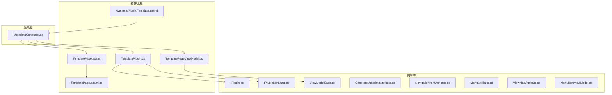
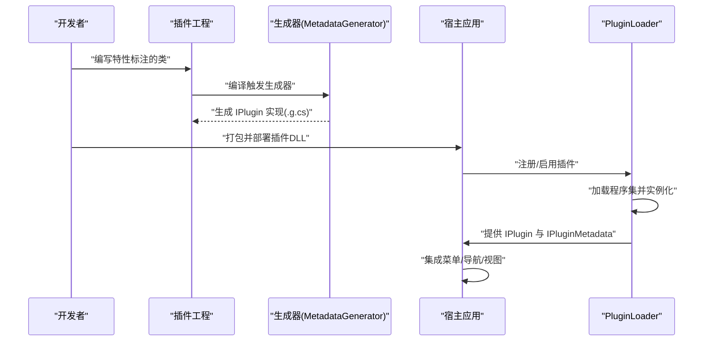
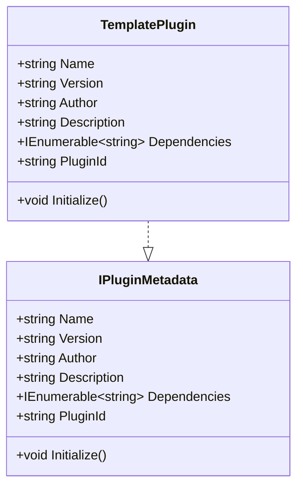
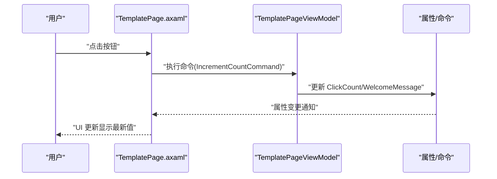
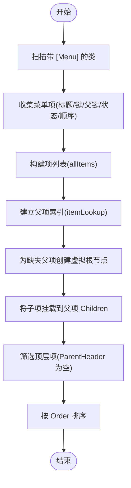
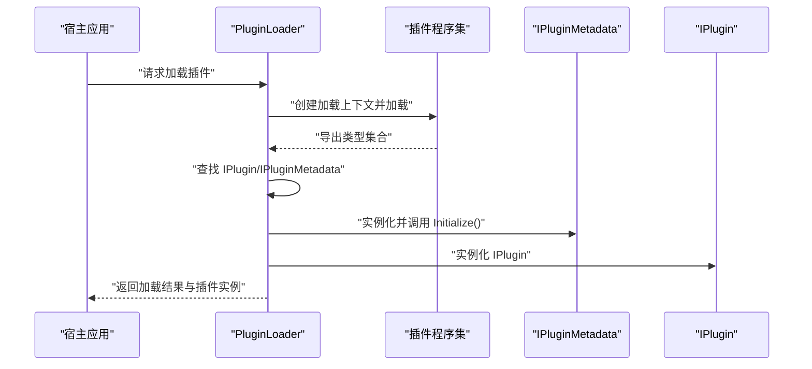
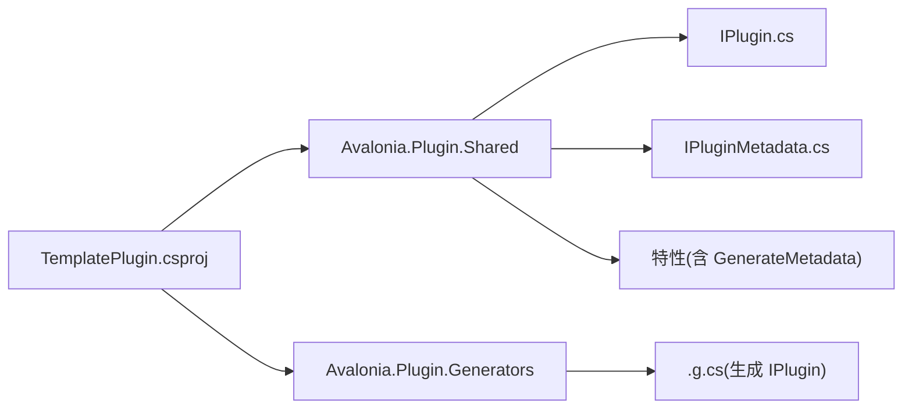

# 模板插件使用

<cite>
**本文引用的文件**
- [TemplatePlugin.cs](file://plugins/Avalonia.Plugin.Template/TemplatePlugin.cs)
- [Avalonia.Plugin.Template.csproj](file://plugins/Avalonia.Plugin.Template/Avalonia.Plugin.Template.csproj)
- [TemplatePageViewModel.cs](file://plugins/Avalonia.Plugin.Template/ViewModels/TemplatePageViewModel.cs)
- [TemplatePage.axaml](file://plugins/Avalonia.Plugin.Template/Pages/TemplatePage.axaml)
- [TemplatePage.axaml.cs](file://plugins/Avalonia.Plugin.Template/Pages/TemplatePage.axaml.cs)
- [IPlugin.cs](file://src/Avalonia.Plugin.Shared/IPlugin.cs)
- [IPluginMetadata.cs](file://src/Avalonia.Plugin.Shared/IPluginMetadata.cs)
- [ViewModelBase.cs](file://src/Avalonia.Plugin.Shared/ViewModelBase.cs)
- [GenerateMetadataAttribute.cs](file://src/Avalonia.Plugin.Shared/Attributes/GenerateMetadataAttribute.cs)
- [NavigationItemAttribute.cs](file://src/Avalonia.Plugin.Shared/Attributes/NavigationItemAttribute.cs)
- [MenuAttribute.cs](file://src/Avalonia.Plugin.Shared/Attributes/MenuAttribute.cs)
- [ViewMapAttribute.cs](file://src/Avalonia.Plugin.Shared/Attributes/ViewMapAttribute.cs)
- [MenuItemViewModel.cs](file://src/Avalonia.Plugin.Shared/ViewModels/MenuItemViewModel.cs)
- [MetadataGenerator.cs](file://src/Avalonia.Plugin.Generators/MetadataGenerator.cs)
- [PluginLoader.cs](file://src/Avalonia.UI/Services/PluginLoader.cs)
</cite>

## 目录
1. [简介](#简介)
2. [项目结构](#项目结构)
3. [核心组件](#核心组件)
4. [架构总览](#架构总览)
5. [详细组件分析](#详细组件分析)
6. [依赖分析](#依赖分析)
7. [性能考虑](#性能考虑)
8. [故障排除指南](#故障排除指南)
9. [结论](#结论)
10. [附录](#附录)

## 简介
本指南面向希望基于模板插件快速开发自定义插件的开发者。文档围绕 TemplatePlugin 的实现结构展开，系统讲解元数据配置、初始化流程与插件标识符管理；深入剖析 ViewModel-View 绑定模式的实现原理与最佳实践；提供模板项目的完整使用示例，包括复制模板、修改配置与自定义功能的方法；解释模板插件中的关键代码模式，如命令绑定、属性变更通知与数据验证；最后给出基于模板插件快速开发自定义插件的实用指导。

## 项目结构
模板插件位于 plugins/Avalonia.Plugin.Template 目录，采用“插件工程 + 共享库 + 生成器”的组织方式：
- 插件工程：包含页面、视图模型与插件入口类，负责演示绑定与菜单集成。
- 共享库：提供插件接口、元数据接口、基类与特性，统一插件开发规范。
- 生成器：在编译期扫描特性并生成 IPlugin 实现，减少样板代码。

图表来源
- [TemplatePlugin.cs:1-20](file://plugins/Avalonia.Plugin.Template/TemplatePlugin.cs#L1-L20)
- [TemplatePageViewModel.cs:1-30](file://plugins/Avalonia.Plugin.Template/ViewModels/TemplatePageViewModel.cs#L1-L30)
- [TemplatePage.axaml:1-49](file://plugins/Avalonia.Plugin.Template/Pages/TemplatePage.axaml#L1-L49)
- [TemplatePage.axaml.cs:1-12](file://plugins/Avalonia.Plugin.Template/Pages/TemplatePage.axaml.cs#L1-L12)
- [Avalonia.Plugin.Template.csproj:1-15](file://plugins/Avalonia.Plugin.Template/Avalonia.Plugin.Template.csproj#L1-L15)
- [IPlugin.cs:1-81](file://src/Avalonia.Plugin.Shared/IPlugin.cs#L1-L81)
- [IPluginMetadata.cs:1-44](file://src/Avalonia.Plugin.Shared/IPluginMetadata.cs#L1-L44)
- [ViewModelBase.cs:1-12](file://src/Avalonia.Plugin.Shared/ViewModelBase.cs#L1-L12)
- [GenerateMetadataAttribute.cs:1-4](file://src/Avalonia.Plugin.Shared/Attributes/GenerateMetadataAttribute.cs#L1-L4)
- [NavigationItemAttribute.cs:1-8](file://src/Avalonia.Plugin.Shared/Attributes/NavigationItemAttribute.cs#L1-L8)
- [MenuAttribute.cs:1-39](file://src/Avalonia.Plugin.Shared/Attributes/MenuAttribute.cs#L1-L39)
- [ViewMapAttribute.cs:1-9](file://src/Avalonia.Plugin.Shared/Attributes/ViewMapAttribute.cs#L1-L9)
- [MenuItemViewModel.cs:1-40](file://src/Avalonia.Plugin.Shared/ViewModels/MenuItemViewModel.cs#L1-L40)
- [MetadataGenerator.cs:1-246](file://src/Avalonia.Plugin.Generators/MetadataGenerator.cs#L1-L246)

章节来源
- [TemplatePlugin.cs:1-20](file://plugins/Avalonia.Plugin.Template/TemplatePlugin.cs#L1-L20)
- [Avalonia.Plugin.Template.csproj:1-15](file://plugins/Avalonia.Plugin.Template/Avalonia.Plugin.Template.csproj#L1-L15)

## 核心组件
- 插件元数据与入口
  - TemplatePlugin 实现 IPluginMetadata，提供 Name、Version、Author、Description、Dependencies、PluginId 与 Initialize 方法。其中 PluginId 为插件唯一标识符，用于注册表与加载器识别。
  - 通过 [GenerateMetadata] 特性配合编译期生成器，自动生成 IPlugin 的 GetViewDefinitions、GetNavigationItems、GetMenuItems 实现，避免手写样板代码。

- 视图模型与绑定
  - TemplatePageViewModel 继承 ViewModelBase，使用 CommunityToolkit.Mvvm 的 [ObservableProperty] 与 [RelayCommand] 自动生成属性变更通知与命令绑定，实现简洁高效的 MVVM。
  - 使用 [NavigationItem]、[Menu]、[ViewMap] 特性声明导航键、菜单项与视图映射，由生成器在编译期注入到 IPlugin 实现中。

- 页面与资源
  - TemplatePage.axaml 定义 UI 布局，绑定 ViewModel 的属性与命令；TemplatePage.axaml.cs 仅负责初始化控件生命周期。

章节来源
- [TemplatePlugin.cs:6-19](file://plugins/Avalonia.Plugin.Template/TemplatePlugin.cs#L6-L19)
- [TemplatePageViewModel.cs:8-29](file://plugins/Avalonia.Plugin.Template/ViewModels/TemplatePageViewModel.cs#L8-L29)
- [TemplatePage.axaml:21-33](file://plugins/Avalonia.Plugin.Template/Pages/TemplatePage.axaml#L21-L33)
- [TemplatePage.axaml.cs:7-11](file://plugins/Avalonia.Plugin.Template/Pages/TemplatePage.axaml.cs#L7-L11)
- [IPluginMetadata.cs:3-41](file://src/Avalonia.Plugin.Shared/IPluginMetadata.cs#L3-L41)
- [ViewModelBase.cs:5-7](file://src/Avalonia.Plugin.Shared/ViewModelBase.cs#L5-L7)
- [GenerateMetadataAttribute.cs:3-4](file://src/Avalonia.Plugin.Shared/Attributes/GenerateMetadataAttribute.cs#L3-L4)
- [NavigationItemAttribute.cs:5-8](file://src/Avalonia.Plugin.Shared/Attributes/NavigationItemAttribute.cs#L5-L8)
- [MenuAttribute.cs:12-38](file://src/Avalonia.Plugin.Shared/Attributes/MenuAttribute.cs#L12-L38)
- [ViewMapAttribute.cs:6-9](file://src/Avalonia.Plugin.Shared/Attributes/ViewMapAttribute.cs#L6-L9)

## 架构总览
模板插件遵循“特性驱动 + 编译期生成 + 运行时加载”的架构：
- 编译期：MetadataGenerator 扫描带有 [GenerateMetadata] 的类，解析 [ViewMap]、[NavigationItem]、[Menu] 等特性，生成 IPlugin 的具体实现，包含视图映射、导航项与菜单树构建。
- 运行时：PluginLoader 动态加载插件程序集，实例化 IPlugin 与 IPluginMetadata，并调用 Initialize 完成初始化；随后通过菜单服务与导航服务将插件内容集成到宿主应用。

图表来源
- [MetadataGenerator.cs:12-130](file://src/Avalonia.Plugin.Generators/MetadataGenerator.cs#L12-L130)
- [PluginLoader.cs:94-146](file://src/Avalonia.UI/Services/PluginLoader.cs#L94-L146)

## 详细组件分析

### TemplatePlugin 分析
- 元数据字段
  - Name/Version/Author/Description/Dependencies/PluginId：标准化插件信息，便于注册与展示。
  - Initialize：预留初始化入口，可在运行时执行插件特有的启动逻辑。
- 插件标识符管理
  - PluginId 为固定 GUID 字符串，确保插件在注册表与加载器中的唯一性，避免冲突。

图表来源
- [IPluginMetadata.cs:3-41](file://src/Avalonia.Plugin.Shared/IPluginMetadata.cs#L3-L41)
- [TemplatePlugin.cs:9-19](file://plugins/Avalonia.Plugin.Template/TemplatePlugin.cs#L9-L19)

章节来源
- [TemplatePlugin.cs:9-19](file://plugins/Avalonia.Plugin.Template/TemplatePlugin.cs#L9-L19)
- [IPluginMetadata.cs:8-39](file://src/Avalonia.Plugin.Shared/IPluginMetadata.cs#L8-L39)

### ViewModel-View 绑定模式分析
- 绑定机制
  - TemplatePageViewModel 使用 [ObservableProperty] 自动实现 INotifyPropertyChanged，TemplatePage.axaml 将 DataContext 指向该 ViewModel，并通过 Binding 绑定属性与命令。
  - 命令绑定：IncrementCountCommand/ResetCountCommand 由 [RelayCommand] 生成，按钮 Command 绑定到命令，点击后更新计数与欢迎消息。
- 最佳实践
  - 使用 [ObservableProperty] 简化属性变更通知，避免手动实现 OnPropertyChanged。
  - 使用 [RelayCommand] 生成命令，保持 ViewModel 的轻量与可测试性。
  - 在 XAML 中明确 x:DataType 并使用 Binding，提升类型安全与设计器支持。

图表来源
- [TemplatePage.axaml:21-33](file://plugins/Avalonia.Plugin.Template/Pages/TemplatePage.axaml#L21-L33)
- [TemplatePageViewModel.cs:13-28](file://plugins/Avalonia.Plugin.Template/ViewModels/TemplatePageViewModel.cs#L13-L28)

章节来源
- [TemplatePageViewModel.cs:13-28](file://plugins/Avalonia.Plugin.Template/ViewModels/TemplatePageViewModel.cs#L13-L28)
- [TemplatePage.axaml:21-33](file://plugins/Avalonia.Plugin.Template/Pages/TemplatePage.axaml#L21-L33)
- [ViewModelBase.cs:5-7](file://src/Avalonia.Plugin.Shared/ViewModelBase.cs#L5-L7)

### 菜单与导航集成分析
- 特性驱动声明
  - [NavigationItem]：声明导航键，供宿主导航服务跳转。
  - [Menu]：声明菜单项标题、键、父级键、状态与排序，生成器构建菜单树。
  - [ViewMap]：声明 ViewModel 到 View 的映射，生成器注入到 IPlugin。
- 菜单树构建
  - 生成器扫描所有带 [Menu] 的类，收集菜单项并建立父子关系；若父项缺失则创建虚拟根节点，最终输出顶层菜单项并按 Order 排序。

图表来源
- [MetadataGenerator.cs:83-126](file://src/Avalonia.Plugin.Generators/MetadataGenerator.cs#L83-L126)
- [MenuAttribute.cs:12-38](file://src/Avalonia.Plugin.Shared/Attributes/MenuAttribute.cs#L12-L38)
- [MenuItemViewModel.cs:15-39](file://src/Avalonia.Plugin.Shared/ViewModels/MenuItemViewModel.cs#L15-L39)

章节来源
- [TemplatePageViewModel.cs:8-10](file://plugins/Avalonia.Plugin.Template/ViewModels/TemplatePageViewModel.cs#L8-L10)
- [MenuAttribute.cs:12-38](file://src/Avalonia.Plugin.Shared/Attributes/MenuAttribute.cs#L12-L38)
- [ViewMapAttribute.cs:6-9](file://src/Avalonia.Plugin.Shared/Attributes/ViewMapAttribute.cs#L6-L9)
- [NavigationItemAttribute.cs:5-8](file://src/Avalonia.Plugin.Shared/Attributes/NavigationItemAttribute.cs#L5-L8)
- [MetadataGenerator.cs:47-52](file://src/Avalonia.Plugin.Generators/MetadataGenerator.cs#L47-L52)

### 插件加载与初始化流程
- 加载流程
  - PluginLoader 根据插件注册信息加载程序集，反射查找 IPlugin 与 IPluginMetadata 实现，实例化后调用 Initialize。
  - 若未找到 IPlugin 实现或依赖不满足，记录错误并回滚状态。
- 生命周期
  - 支持启用/禁用/卸载/重新安装等操作，每次变更都会持久化注册表并触发事件通知。

图表来源
- [PluginLoader.cs:94-146](file://src/Avalonia.UI/Services/PluginLoader.cs#L94-L146)

章节来源
- [PluginLoader.cs:94-146](file://src/Avalonia.UI/Services/PluginLoader.cs#L94-L146)

## 依赖分析
- 插件工程依赖
  - 对共享库的引用：提供 IPlugin、IPluginMetadata、ViewModelBase、特性与菜单模型。
  - 对生成器的引用：在编译期生成 IPlugin 实现，减少手写代码。
- 运行时依赖
  - 宿主应用通过 PluginLoader 动态加载插件，要求插件程序集包含有效的 IPlugin 与 IPluginMetadata 实现。

图表来源
- [Avalonia.Plugin.Template.csproj:10-13](file://plugins/Avalonia.Plugin.Template/Avalonia.Plugin.Template.csproj#L10-L13)
- [IPlugin.cs:9-26](file://src/Avalonia.Plugin.Shared/IPlugin.cs#L9-L26)
- [IPluginMetadata.cs:3-41](file://src/Avalonia.Plugin.Shared/IPluginMetadata.cs#L3-L41)
- [GenerateMetadataAttribute.cs:3-4](file://src/Avalonia.Plugin.Shared/Attributes/GenerateMetadataAttribute.cs#L3-L4)
- [MetadataGenerator.cs:12-130](file://src/Avalonia.Plugin.Generators/MetadataGenerator.cs#L12-L130)

章节来源
- [Avalonia.Plugin.Template.csproj:10-13](file://plugins/Avalonia.Plugin.Template/Avalonia.Plugin.Template.csproj#L10-L13)
- [IPlugin.cs:9-26](file://src/Avalonia.Plugin.Shared/IPlugin.cs#L9-L26)
- [IPluginMetadata.cs:3-41](file://src/Avalonia.Plugin.Shared/IPluginMetadata.cs#L3-L41)

## 性能考虑
- 编译期生成
  - 使用生成器在编译期完成 IPlugin 实现的拼装，避免运行时反射与字符串解析开销，提升加载速度与稳定性。
- 轻量 ViewModel
  - 采用 CommunityToolkit.Mvvm 的 [ObservableProperty]/[RelayCommand]，减少样板代码与内存占用。
- 菜单树构建
  - 生成器一次性构建菜单树并缓存，宿主应用查询时无需重复计算。

## 故障排除指南
- 插件未被识别
  - 确认插件类是否带有 [GenerateMetadata] 特性，且实现了 IPluginMetadata。
  - 检查插件程序集是否包含 IPlugin 实现；否则加载器会报“未找到 IPlugin 实现”。
- 菜单/导航不显示
  - 确认 ViewModel 上已正确标注 [NavigationItem]、[Menu]、[ViewMap]。
  - 检查父菜单键是否存在，若缺失将自动创建虚拟根节点，但需确认最终顶层项是否符合预期。
- 加载失败
  - 查看 PluginLoader 的错误信息，常见原因包括：程序集不存在、依赖未满足、初始化异常等。
- 属性变更无效
  - 确保使用 [ObservableProperty] 标注属性，且在命令中修改的是属性而非局部变量。

章节来源
- [PluginLoader.cs:102-118](file://src/Avalonia.UI/Services/PluginLoader.cs#L102-L118)
- [MetadataGenerator.cs:83-126](file://src/Avalonia.Plugin.Generators/MetadataGenerator.cs#L83-L126)
- [TemplatePageViewModel.cs:13-28](file://plugins/Avalonia.Plugin.Template/ViewModels/TemplatePageViewModel.cs#L13-L28)

## 结论
模板插件以最小实现展示了 Avalonia 插件系统的完整工作流：通过特性声明元数据与绑定关系，借助生成器在编译期生成 IPlugin 实现，再由宿主应用的 PluginLoader 动态加载与初始化。开发者可在此基础上快速扩展自定义插件，遵循 MVVM 模式与特性标注约定，即可实现菜单集成、导航跳转与视图绑定的一体化体验。

## 附录

### 快速上手：复制模板并定制
- 复制模板
  - 将 plugins/Avalonia.Plugin.Template 目录复制为新的插件目录，例如 Avalonia.Plugin.YourPlugin。
- 修改元数据
  - 在新插件的 TemplatePlugin.cs 中更新 Name、Version、Author、Description、PluginId 等字段。
- 添加页面与视图模型
  - 在 Pages 与 ViewModels 目录下创建新的页面与视图模型，使用 [NavigationItem]、[Menu]、[ViewMap] 标注。
- 配置项目文件
  - 在新插件的 .csproj 中引用共享库与生成器，确保生成器参与编译。
- 验证与运行
  - 重新构建项目，确认生成器输出的 .g.cs 存在；在宿主应用中注册并启用插件，检查菜单与页面是否正常显示。

章节来源
- [TemplatePlugin.cs:9-19](file://plugins/Avalonia.Plugin.Template/TemplatePlugin.cs#L9-L19)
- [TemplatePageViewModel.cs:8-10](file://plugins/Avalonia.Plugin.Template/ViewModels/TemplatePageViewModel.cs#L8-L10)
- [Avalonia.Plugin.Template.csproj:10-13](file://plugins/Avalonia.Plugin.Template/Avalonia.Plugin.Template.csproj#L10-L13)

### 关键代码模式清单
- 命令绑定
  - 使用 [RelayCommand] 生成命令，XAML 中通过 Command 绑定到命令属性。
- 属性变更通知
  - 使用 [ObservableProperty] 标注属性，自动实现属性变更通知。
- 数据验证
  - 可在属性 setter 内进行校验并设置错误状态，结合 UI 的 Validation.ErrorTemplate 显示提示。
- 菜单与导航
  - 使用 [Menu]、[NavigationItem]、[ViewMap] 标注，由生成器注入 IPlugin 实现。

章节来源
- [TemplatePageViewModel.cs:16-28](file://plugins/Avalonia.Plugin.Template/ViewModels/TemplatePageViewModel.cs#L16-L28)
- [TemplatePage.axaml:21-33](file://plugins/Avalonia.Plugin.Template/Pages/TemplatePage.axaml#L21-L33)
- [MenuAttribute.cs:12-38](file://src/Avalonia.Plugin.Shared/Attributes/MenuAttribute.cs#L12-L38)
- [NavigationItemAttribute.cs:5-8](file://src/Avalonia.Plugin.Shared/Attributes/NavigationItemAttribute.cs#L5-L8)
- [ViewMapAttribute.cs:6-9](file://src/Avalonia.Plugin.Shared/Attributes/ViewMapAttribute.cs#L6-L9)