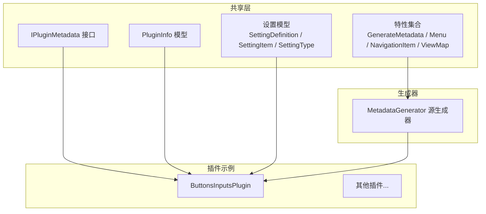
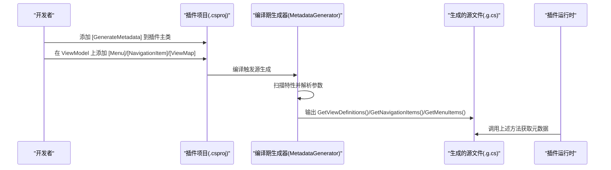
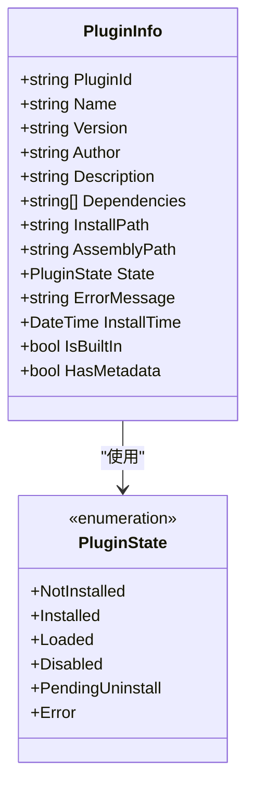
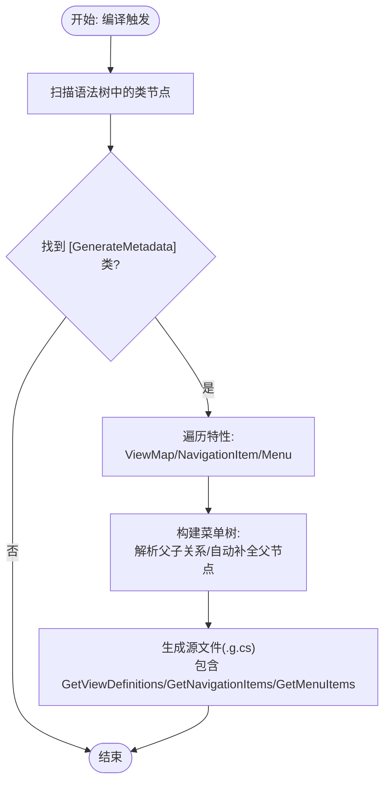
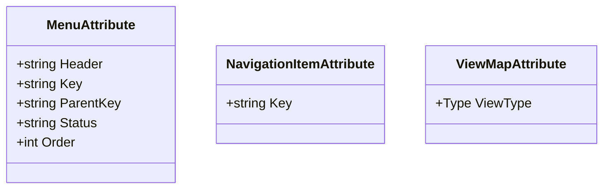
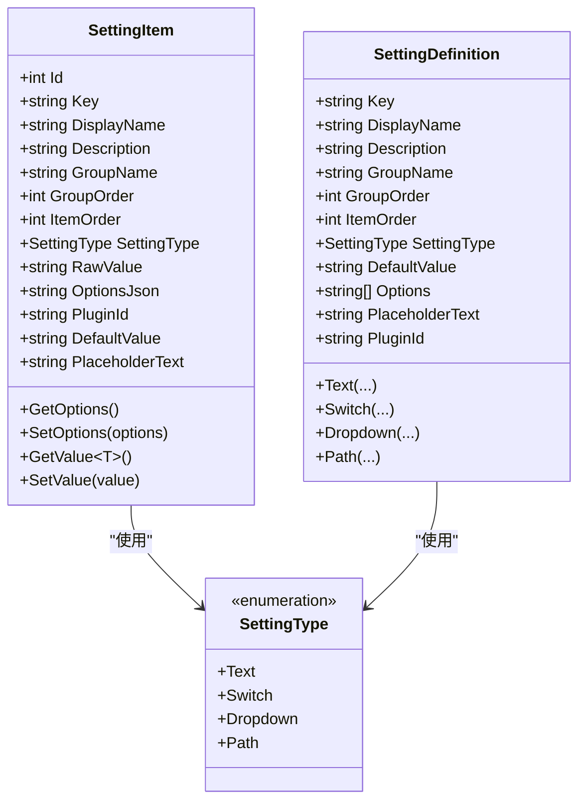
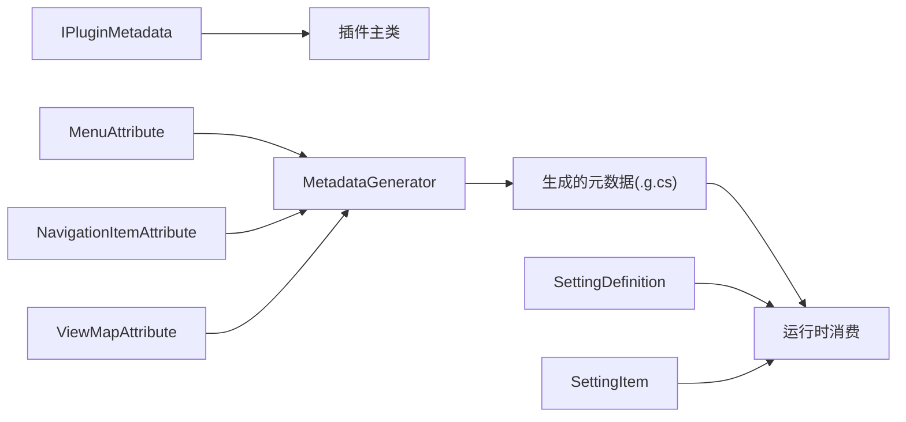

# 插件元数据管理

<cite>
**本文档引用的文件**
- [PluginInfo.cs](file://src/Avalonia.Plugin.Shared/Models/PluginInfo.cs)
- [IPluginMetadata.cs](file://src/Avalonia.Plugin.Shared/IPluginMetadata.cs)
- [GenerateMetadataAttribute.cs](file://src/Avalonia.Plugin.Shared/Attributes/GenerateMetadataAttribute.cs)
- [MetadataGenerator.cs](file://src/Avalonia.Plugin.Generators/MetadataGenerator.cs)
- [MenuAttribute.cs](file://src/Avalonia.Plugin.Shared/Attributes/MenuAttribute.cs)
- [NavigationItemAttribute.cs](file://src/Avalonia.Plugin.Shared/Attributes/NavigationItemAttribute.cs)
- [ViewMapAttribute.cs](file://src/Avalonia.Plugin.Shared/Attributes/ViewMapAttribute.cs)
- [ButtonsInputsPlugin.cs](file://plugins/Avalonia.Plugin.ButtonsInputs/ButtonsInputsPlugin.cs)
- [SettingDefinition.cs](file://src/Avalonia.Plugin.Shared/Models/SettingDefinition.cs)
- [SettingItem.cs](file://src/Avalonia.Plugin.Shared/Models/SettingItem.cs)
- [SettingType.cs](file://src/Avalonia.Plugin.Shared/Models/SettingType.cs)
- [PluginState.cs](file://src/Avalonia.Plugin.Shared/Models/PluginState.cs)
- [ControlData.cs](file://src/Avalonia.Plugin.Shared/Models/ControlData.cs)
</cite>

## 目录
1. [简介](#简介)
2. [项目结构](#项目结构)
3. [核心组件](#核心组件)
4. [架构总览](#架构总览)
5. [详细组件分析](#详细组件分析)
6. [依赖关系分析](#依赖关系分析)
7. [性能考虑](#性能考虑)
8. [故障排查指南](#故障排查指南)
9. [结论](#结论)
10. [附录](#附录)

## 简介
本技术文档聚焦于插件元数据管理，围绕以下目标展开：
- 深入解析 PluginInfo 模型的设计与用途，涵盖插件标识、版本信息、依赖关系、配置选项等字段的职责与约束。
- 全面阐述 GenerateMetadataAttribute 的使用方法与元数据生成机制，说明如何通过编译期源生成实现自动元数据提取与手动配置的协同。
- 提供插件元数据的标准格式与验证规则，确保插件信息的完整性与一致性。
- 给出元数据缓存策略与性能优化技巧，并设计元数据变更的实时同步机制。

## 项目结构
该仓库采用“共享层 + 生成器 + 插件示例”的分层组织方式：
- 共享模型与特性定义位于共享库，统一规范插件元数据与扩展点。
- 源生成器在编译期扫描插件项目中的特性标记，生成插件运行时所需的导航、视图映射与菜单树等元数据。
- 示例插件展示如何使用特性标注 ViewModel，并通过 [GenerateMetadata] 触发生成器工作。

**图表来源**
- [IPluginMetadata.cs:1-44](file://src/Avalonia.Plugin.Shared/IPluginMetadata.cs#L1-L44)
- [PluginInfo.cs:1-19](file://src/Avalonia.Plugin.Shared/Models/PluginInfo.cs#L1-L19)
- [GenerateMetadataAttribute.cs:1-4](file://src/Avalonia.Plugin.Shared/Attributes/GenerateMetadataAttribute.cs#L1-L4)
- [MenuAttribute.cs:1-39](file://src/Avalonia.Plugin.Shared/Attributes/MenuAttribute.cs#L1-L39)
- [NavigationItemAttribute.cs:1-8](file://src/Avalonia.Plugin.Shared/Attributes/NavigationItemAttribute.cs#L1-L8)
- [ViewMapAttribute.cs:1-9](file://src/Avalonia.Plugin.Shared/Attributes/ViewMapAttribute.cs#L1-L9)
- [MetadataGenerator.cs:1-246](file://src/Avalonia.Plugin.Generators/MetadataGenerator.cs#L1-L246)
- [ButtonsInputsPlugin.cs:1-100](file://plugins/Avalonia.Plugin.ButtonsInputs/ButtonsInputsPlugin.cs#L1-L100)

**章节来源**
- [PluginInfo.cs:1-19](file://src/Avalonia.Plugin.Shared/Models/PluginInfo.cs#L1-L19)
- [IPluginMetadata.cs:1-44](file://src/Avalonia.Plugin.Shared/IPluginMetadata.cs#L1-L44)
- [GenerateMetadataAttribute.cs:1-4](file://src/Avalonia.Plugin.Shared/Attributes/GenerateMetadataAttribute.cs#L1-L4)
- [MetadataGenerator.cs:1-246](file://src/Avalonia.Plugin.Generators/MetadataGenerator.cs#L1-L246)
- [ButtonsInputsPlugin.cs:1-100](file://plugins/Avalonia.Plugin.ButtonsInputs/ButtonsInputsPlugin.cs#L1-L100)

## 核心组件
- PluginInfo：承载插件元数据的核心模型，包含标识、名称、版本、作者、描述、依赖、安装路径、程序集路径、状态、错误信息、安装时间、是否内置、是否有元数据等字段。
- IPluginMetadata：插件元数据接口，定义插件名称、版本、作者、描述、依赖、唯一标识及初始化方法。
- GenerateMetadataAttribute：触发编译期源生成的特性标记，作用于插件主类。
- 特性族：MenuAttribute、NavigationItemAttribute、ViewMapAttribute，分别用于声明菜单项、导航项与视图映射。
- 设置模型：SettingDefinition、SettingItem、SettingType，用于定义与存储插件配置项。

**章节来源**
- [PluginInfo.cs:1-19](file://src/Avalonia.Plugin.Shared/Models/PluginInfo.cs#L1-L19)
- [IPluginMetadata.cs:1-44](file://src/Avalonia.Plugin.Shared/IPluginMetadata.cs#L1-L44)
- [GenerateMetadataAttribute.cs:1-4](file://src/Avalonia.Plugin.Shared/Attributes/GenerateMetadataAttribute.cs#L1-L4)
- [MenuAttribute.cs:1-39](file://src/Avalonia.Plugin.Shared/Attributes/MenuAttribute.cs#L1-L39)
- [NavigationItemAttribute.cs:1-8](file://src/Avalonia.Plugin.Shared/Attributes/NavigationItemAttribute.cs#L1-L8)
- [ViewMapAttribute.cs:1-9](file://src/Avalonia.Plugin.Shared/Attributes/ViewMapAttribute.cs#L1-L9)
- [SettingDefinition.cs:1-89](file://src/Avalonia.Plugin.Shared/Models/SettingDefinition.cs#L1-L89)
- [SettingItem.cs:1-61](file://src/Avalonia.Plugin.Shared/Models/SettingItem.cs#L1-L61)
- [SettingType.cs:1-10](file://src/Avalonia.Plugin.Shared/Models/SettingType.cs#L1-L10)

## 架构总览
下图展示了从插件项目到运行时元数据的生成与消费流程：

**图表来源**
- [ButtonsInputsPlugin.cs:6-24](file://plugins/Avalonia.Plugin.ButtonsInputs/ButtonsInputsPlugin.cs#L6-L24)
- [MetadataGenerator.cs:12-130](file://src/Avalonia.Plugin.Generators/MetadataGenerator.cs#L12-L130)
- [MenuAttribute.cs:11-38](file://src/Avalonia.Plugin.Shared/Attributes/MenuAttribute.cs#L11-L38)
- [NavigationItemAttribute.cs:4-8](file://src/Avalonia.Plugin.Shared/Attributes/NavigationItemAttribute.cs#L4-L8)
- [ViewMapAttribute.cs:5-9](file://src/Avalonia.Plugin.Shared/Attributes/ViewMapAttribute.cs#L5-L9)

## 详细组件分析

### PluginInfo 模型设计与用途
- 字段职责
  - 标识与基础信息：PluginId、Name、Version、Author、Description。
  - 依赖与安装：Dependencies、InstallPath、AssemblyPath、IsBuiltIn、HasMetadata。
  - 生命周期与状态：State、InstallTime、ErrorMessage。
- 设计要点
  - 使用可空类型与默认值保证序列化与反序列化的健壮性。
  - IsBuiltIn 与 HasMetadata 字段为运行时与安装器提供状态判断依据。
  - State 使用枚举集中表达插件生命周期状态，便于统一处理。
- 数据复杂度
  - 依赖列表为线性结构，查询与去重可在加载阶段完成。
  - 时间戳字段支持排序与统计。

**图表来源**
- [PluginInfo.cs:3-18](file://src/Avalonia.Plugin.Shared/Models/PluginInfo.cs#L3-L18)
- [PluginState.cs:3-11](file://src/Avalonia.Plugin.Shared/Models/PluginState.cs#L3-L11)

**章节来源**
- [PluginInfo.cs:1-19](file://src/Avalonia.Plugin.Shared/Models/PluginInfo.cs#L1-L19)
- [PluginState.cs:1-12](file://src/Avalonia.Plugin.Shared/Models/PluginState.cs#L1-L12)

### GenerateMetadataAttribute 与元数据生成机制
- 使用方法
  - 在插件主类上添加 [GenerateMetadata]，触发编译期源生成。
  - 在各 ViewModel 上使用 [Menu]、[NavigationItem]、[ViewMap] 标注，生成器会自动扫描并生成对应元数据。
- 生成流程
  - 扫描所有类节点，定位带 [GenerateMetadata] 的目标类。
  - 遍历特性，收集 ViewMap、NavigationItem、Menu 的参数。
  - 生成 GetViewDefinitions、GetNavigationItems、GetMenuItems 的实现。
  - 菜单树生成：根据 ParentKey 自动补全缺失父节点，构建层级结构并仅输出顶层节点。
- 生成器能力
  - 支持位置参数与命名参数混合解析（如 Header、Key、ParentKey、Status、Order）。
  - 对 Order 进行类型安全转换，确保排序正确。
  - 生成的源文件以 partial 类形式注入插件主类，避免手写样板代码。

**图表来源**
- [MetadataGenerator.cs:12-130](file://src/Avalonia.Plugin.Generators/MetadataGenerator.cs#L12-L130)
- [MetadataGenerator.cs:133-245](file://src/Avalonia.Plugin.Generators/MetadataGenerator.cs#L133-L245)

**章节来源**
- [GenerateMetadataAttribute.cs:1-4](file://src/Avalonia.Plugin.Shared/Attributes/GenerateMetadataAttribute.cs#L1-L4)
- [MetadataGenerator.cs:1-246](file://src/Avalonia.Plugin.Generators/MetadataGenerator.cs#L1-L246)
- [ButtonsInputsPlugin.cs:6-24](file://plugins/Avalonia.Plugin.ButtonsInputs/ButtonsInputsPlugin.cs#L6-L24)

### 菜单、导航与视图映射特性
- MenuAttribute
  - 参数：Header、Key、ParentKey；可选属性：Status、Order。
  - 生成器将菜单项解析为结构化数据，构建树形菜单。
- NavigationItemAttribute
  - 参数：Key，用于建立 ViewModel 到导航键的映射。
- ViewMapAttribute
  - 参数：ViewType，用于建立 ViewModel 到 View 的工厂映射。

**图表来源**
- [MenuAttribute.cs:11-38](file://src/Avalonia.Plugin.Shared/Attributes/MenuAttribute.cs#L11-L38)
- [NavigationItemAttribute.cs:4-8](file://src/Avalonia.Plugin.Shared/Attributes/NavigationItemAttribute.cs#L4-L8)
- [ViewMapAttribute.cs:5-9](file://src/Avalonia.Plugin.Shared/Attributes/ViewMapAttribute.cs#L5-L9)

**章节来源**
- [MenuAttribute.cs:1-39](file://src/Avalonia.Plugin.Shared/Attributes/MenuAttribute.cs#L1-L39)
- [NavigationItemAttribute.cs:1-8](file://src/Avalonia.Plugin.Shared/Attributes/NavigationItemAttribute.cs#L1-L8)
- [ViewMapAttribute.cs:1-9](file://src/Avalonia.Plugin.Shared/Attributes/ViewMapAttribute.cs#L1-L9)

### 插件元数据标准格式与验证规则
- 标准格式
  - 插件主类必须标注 [GenerateMetadata]，并实现 IPluginMetadata 接口。
  - ViewModel 必须标注 [NavigationItem] 与 [ViewMap]，以便生成导航与视图映射。
  - 菜单项建议标注 [Menu]，并提供 Header、Key、ParentKey、Order 等参数。
- 验证规则
  - 唯一性：PluginId 应全局唯一；导航键 Key 与菜单键 Key 在插件内应唯一。
  - 关系一致性：ParentKey 必须指向存在的菜单项；缺失父项时由生成器自动补全。
  - 类型与范围：Order 必须为整数；Status 可为空或预定义值。
  - 依赖完整性：Dependencies 中的条目应为合法的插件标识或版本约束。
- 建议
  - 使用常量或枚举定义菜单键与导航键，减少拼写错误。
  - 将菜单分组与排序策略标准化，便于维护。

**章节来源**
- [IPluginMetadata.cs:1-44](file://src/Avalonia.Plugin.Shared/IPluginMetadata.cs#L1-L44)
- [ButtonsInputsPlugin.cs:6-24](file://plugins/Avalonia.Plugin.ButtonsInputs/ButtonsInputsPlugin.cs#L6-L24)
- [MetadataGenerator.cs:201-245](file://src/Avalonia.Plugin.Generators/MetadataGenerator.cs#L201-L245)

### 配置选项模型与管理
- SettingDefinition：定义配置项的元数据（键、显示名、描述、分组、顺序、类型、默认值、选项等），并提供便捷工厂方法（Text、Switch、Dropdown、Path）。
- SettingItem：运行时存储配置项的实例（含原始值、默认值、选项序列化等），提供类型安全的 GetValue/SetValue。
- SettingType：枚举定义支持的配置类型（文本、开关、下拉、路径）。

**图表来源**
- [SettingDefinition.cs:3-88](file://src/Avalonia.Plugin.Shared/Models/SettingDefinition.cs#L3-L88)
- [SettingItem.cs:5-60](file://src/Avalonia.Plugin.Shared/Models/SettingItem.cs#L5-L60)
- [SettingType.cs:3-9](file://src/Avalonia.Plugin.Shared/Models/SettingType.cs#L3-L9)

**章节来源**
- [SettingDefinition.cs:1-89](file://src/Avalonia.Plugin.Shared/Models/SettingDefinition.cs#L1-L89)
- [SettingItem.cs:1-61](file://src/Avalonia.Plugin.Shared/Models/SettingItem.cs#L1-L61)
- [SettingType.cs:1-10](file://src/Avalonia.Plugin.Shared/Models/SettingType.cs#L1-L10)

### 控制数据与本地化支持
- ControlData：用于控制面板或界面元素的本地化数据结构，包含菜单标题与中文映射。
- 用途：为 UI 层提供多语言支持的基础数据。

**章节来源**
- [ControlData.cs:1-8](file://src/Avalonia.Plugin.Shared/Models/ControlData.cs#L1-L8)

## 依赖关系分析
- 插件主类依赖 IPluginMetadata 接口，实现元数据与初始化。
- 生成器依赖特性族（Menu、NavigationItem、ViewMap）进行扫描与解析。
- 生成的元数据服务于运行时导航、菜单与视图映射。
- 设置模型独立于生成器，但可被插件运行时读取与持久化。

**图表来源**
- [IPluginMetadata.cs:1-44](file://src/Avalonia.Plugin.Shared/IPluginMetadata.cs#L1-L44)
- [MetadataGenerator.cs:12-130](file://src/Avalonia.Plugin.Generators/MetadataGenerator.cs#L12-L130)
- [MenuAttribute.cs:11-38](file://src/Avalonia.Plugin.Shared/Attributes/MenuAttribute.cs#L11-L38)
- [NavigationItemAttribute.cs:4-8](file://src/Avalonia.Plugin.Shared/Attributes/NavigationItemAttribute.cs#L4-L8)
- [ViewMapAttribute.cs:5-9](file://src/Avalonia.Plugin.Shared/Attributes/ViewMapAttribute.cs#L5-L9)
- [SettingDefinition.cs:1-89](file://src/Avalonia.Plugin.Shared/Models/SettingDefinition.cs#L1-L89)
- [SettingItem.cs:1-61](file://src/Avalonia.Plugin.Shared/Models/SettingItem.cs#L1-L61)

**章节来源**
- [IPluginMetadata.cs:1-44](file://src/Avalonia.Plugin.Shared/IPluginMetadata.cs#L1-L44)
- [MetadataGenerator.cs:1-246](file://src/Avalonia.Plugin.Generators/MetadataGenerator.cs#L1-L246)
- [SettingDefinition.cs:1-89](file://src/Avalonia.Plugin.Shared/Models/SettingDefinition.cs#L1-L89)
- [SettingItem.cs:1-61](file://src/Avalonia.Plugin.Shared/Models/SettingItem.cs#L1-L61)

## 性能考虑
- 编译期生成
  - 将元数据生成移至编译期，避免运行时反射与动态解析开销。
  - 生成器仅扫描特性，复杂度近似 O(N)（N 为类数量）。
- 菜单树构建
  - 生成器在生成阶段完成树构建与父节点补全，运行时仅消费结果，避免重复计算。
- 缓存策略
  - 运行时可缓存已生成的导航字典与菜单树，键为插件标识或导航键。
  - 对频繁访问的元数据（如视图映射）可采用弱引用或懒加载策略。
- 同步机制
  - 插件卸载/更新时清理缓存；新增插件时增量注册元数据。
  - 事件驱动：监听插件状态变化，触发 UI 刷新与缓存重建。

[本节为通用性能指导，不涉及具体文件分析]

## 故障排查指南
- 未生成元数据
  - 检查插件主类是否标注 [GenerateMetadata]。
  - 确认 ViewModel 是否正确标注 [NavigationItem]、[ViewMap]、[Menu]。
- 菜单层级异常
  - 检查 ParentKey 是否拼写正确；若父项缺失，生成器会自动补全为虚拟根节点。
- 导航键冲突
  - 确保同一插件内的导航键唯一；跨插件可通过前缀区分。
- 设置项类型不匹配
  - 使用 SettingItem.GetValue<T>() 获取强类型值；注意布尔与数值的序列化格式。
- 插件状态异常
  - 通过 PluginInfo.State 与 ErrorMessage 判断安装/加载状态；必要时重装或检查依赖。

**章节来源**
- [ButtonsInputsPlugin.cs:6-24](file://plugins/Avalonia.Plugin.ButtonsInputs/ButtonsInputsPlugin.cs#L6-L24)
- [MetadataGenerator.cs:90-126](file://src/Avalonia.Plugin.Generators/MetadataGenerator.cs#L90-L126)
- [SettingItem.cs:34-60](file://src/Avalonia.Plugin.Shared/Models/SettingItem.cs#L34-L60)
- [PluginInfo.cs:13-14](file://src/Avalonia.Plugin.Shared/Models/PluginInfo.cs#L13-L14)

## 结论
本方案通过“特性 + 源生成器”的组合，实现了插件元数据的自动化与规范化管理。PluginInfo 与 IPluginMetadata 明确了插件元数据的结构与契约，GenerateMetadataAttribute 与配套特性使元数据采集无需手写样板代码。配合设置模型与缓存策略，系统在保证一致性的同时兼顾性能与可维护性。

## 附录
- 最佳实践
  - 统一命名规范：插件标识、导航键、菜单键采用一致风格。
  - 分组与排序：合理使用 GroupOrder 与 ItemOrder，提升设置页可读性。
  - 文档与示例：为每个插件提供最小可用示例，降低接入成本。
- 扩展方向
  - 引入插件清单校验工具，在 CI 中强制执行元数据规范。
  - 增加元数据热更新通道，支持运行时增量刷新。