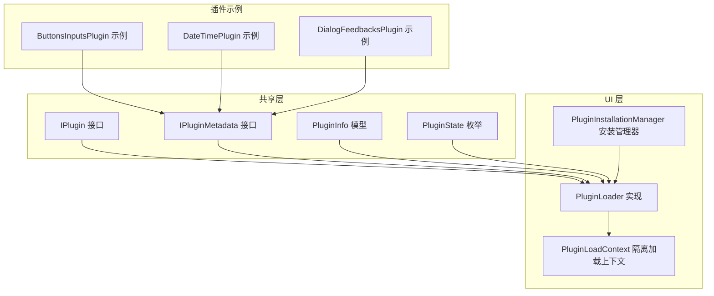
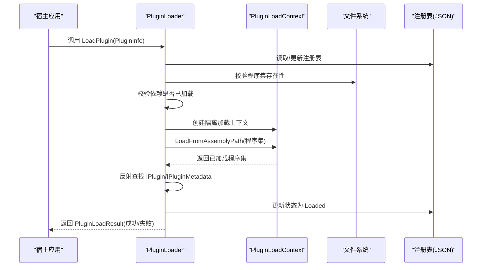
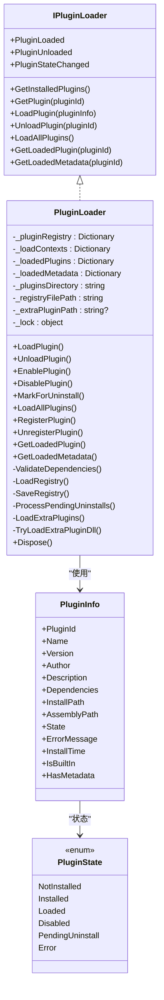
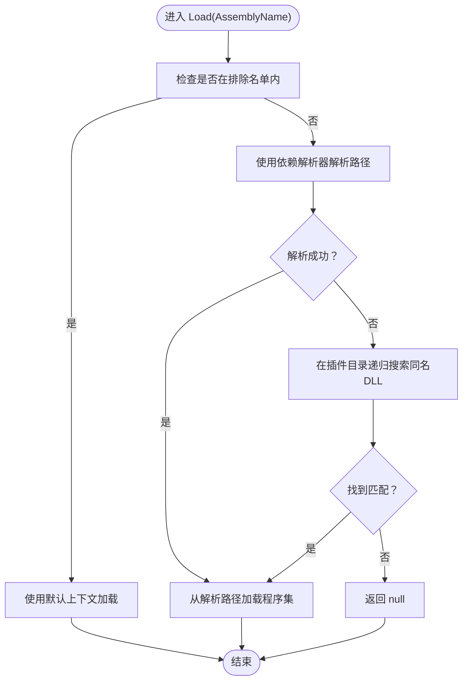
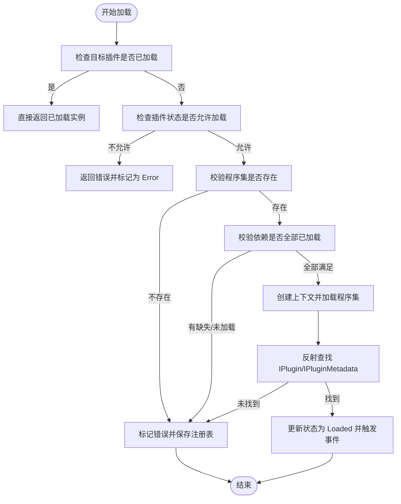
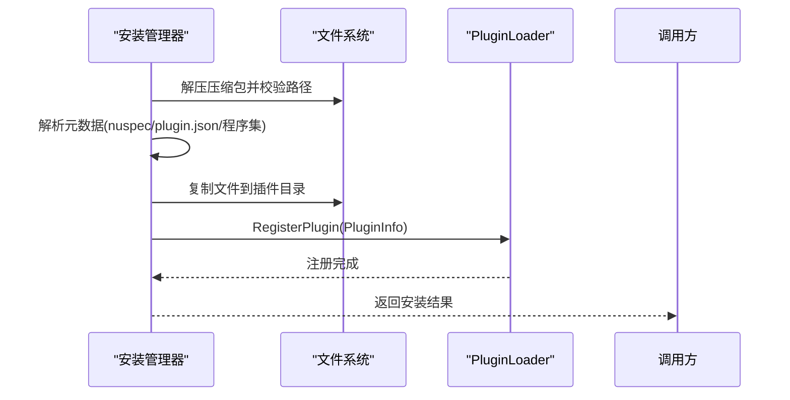
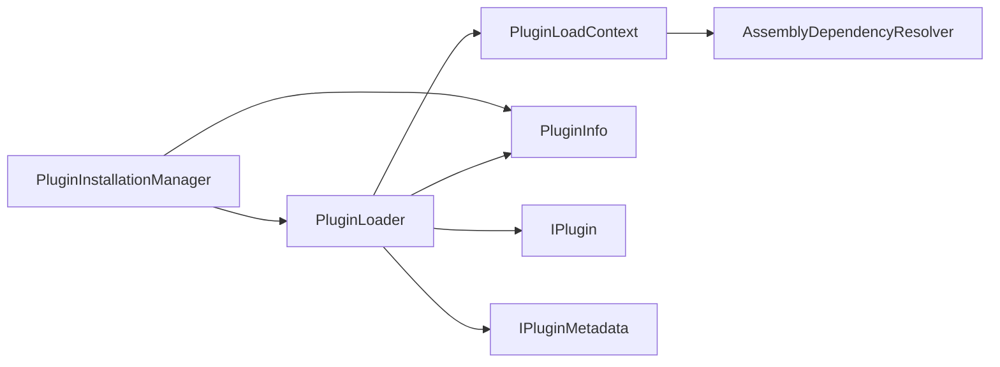

# 插件加载机制

<cite>
**本文档引用的文件**
- [IPluginLoader.cs](file://src/Avalonia.Plugin.Shared/Services/IPluginLoader.cs)
- [PluginLoader.cs](file://src/Avalonia.UI/Services/PluginLoader.cs)
- [PluginLoadContext.cs](file://src/Avalonia.UI/Services/PluginLoadContext.cs)
- [IPlugin.cs](file://src/Avalonia.Plugin.Shared/IPlugin.cs)
- [IPluginMetadata.cs](file://src/Avalonia.Plugin.Shared/IPluginMetadata.cs)
- [PluginInfo.cs](file://src/Avalonia.Plugin.Shared/Models/PluginInfo.cs)
- [PluginState.cs](file://src/Avalonia.Plugin.Shared/Models/PluginState.cs)
- [PluginInstallationManager.cs](file://src/Avalonia.UI/Services/PluginInstallationManager.cs)
- [ButtonsInputsPlugin.cs](file://plugins/Avalonia.Plugin.ButtonsInputs/ButtonsInputsPlugin.cs)
- [DateTimePlugin.cs](file://plugins/Avalonia.Plugin.DateTime/DateTimePlugin.cs)
- [DialogFeedbacksPlugin.cs](file://plugins/Avalonia.Plugin.DialogFeedbacks/DialogFeedbacksPlugin.cs)
- [ServiceLocator.cs](file://src/Avalonia.Plugin.Shared/ServiceLocator.cs)
- [Avalonia.Plugin.Shared.props](file://src/Avalonia.Plugin.Shared/buildTransitive/Avalonia.Plugin.Shared.props)
- [Avalonia.Plugin.Shared.targets](file://src/Avalonia.Plugin.Shared/buildTransitive/Avalonia.Plugin.Shared.targets)
</cite>

## 目录
1. [简介](#简介)
2. [项目结构](#项目结构)
3. [核心组件](#核心组件)
4. [架构总览](#架构总览)
5. [详细组件分析](#详细组件分析)
6. [依赖关系分析](#依赖关系分析)
7. [性能考量](#性能考量)
8. [故障排除指南](#故障排除指南)
9. [结论](#结论)
10. [附录](#附录)

## 简介
本技术文档系统性阐述了 AvaloniaTemplate 项目中的插件加载机制，重点围绕 PluginLoader 与 PluginLoadContext 的实现原理展开，涵盖程序集加载策略、依赖解析算法、冲突处理机制、隔离加载环境与版本兼容性管理，并提供性能优化建议、故障诊断方法与安全考虑。

## 项目结构
该仓库采用多项目组织方式，插件系统由共享接口层、UI 加载层与多个插件示例组成：
- 共享接口与模型：定义插件契约、元数据接口与状态枚举
- UI 加载与安装：实现插件发现、注册、加载、卸载与安装流程
- 插件示例：演示如何声明式生成元数据并实现插件接口

图表来源
- [PluginLoader.cs:1-460](file://src/Avalonia.UI/Services/PluginLoader.cs#L1-L460)
- [PluginLoadContext.cs:1-107](file://src/Avalonia.UI/Services/PluginLoadContext.cs#L1-L107)
- [PluginInstallationManager.cs:1-261](file://src/Avalonia.UI/Services/PluginInstallationManager.cs#L1-L261)
- [IPlugin.cs:1-81](file://src/Avalonia.Plugin.Shared/IPlugin.cs#L1-L81)
- [IPluginMetadata.cs:1-44](file://src/Avalonia.Plugin.Shared/IPluginMetadata.cs#L1-L44)
- [PluginInfo.cs:1-19](file://src/Avalonia.Plugin.Shared/Models/PluginInfo.cs#L1-L19)
- [PluginState.cs:1-12](file://src/Avalonia.Plugin.Shared/Models/PluginState.cs#L1-L12)
- [ButtonsInputsPlugin.cs:1-100](file://plugins/Avalonia.Plugin.ButtonsInputs/ButtonsInputsPlugin.cs#L1-L100)
- [DateTimePlugin.cs:1-20](file://plugins/Avalonia.Plugin.DateTime/DateTimePlugin.cs#L1-L20)
- [DialogFeedbacksPlugin.cs:1-20](file://plugins/Avalonia.Plugin.DialogFeedbacks/DialogFeedbacksPlugin.cs#L1-L20)

章节来源
- [PluginLoader.cs:1-460](file://src/Avalonia.UI/Services/PluginLoader.cs#L1-L460)
- [PluginLoadContext.cs:1-107](file://src/Avalonia.UI/Services/PluginLoadContext.cs#L1-L107)
- [PluginInstallationManager.cs:1-261](file://src/Avalonia.UI/Services/PluginInstallationManager.cs#L1-L261)

## 核心组件
- 插件接口与元数据
  - IPlugin：定义插件提供的视图映射、导航项与菜单项能力
  - IPluginMetadata：定义插件元数据（名称、版本、作者、描述、依赖、ID）与初始化方法
- 插件信息与状态
  - PluginInfo：记录插件的标识、版本、依赖、安装路径、程序集路径、状态、错误信息等
  - PluginState：枚举化插件生命周期状态（未安装、已安装、已加载、禁用、待卸载、错误）
- 加载器与上下文
  - IPluginLoader：对外暴露插件查询、加载、卸载、批量加载与事件通知
  - PluginLoader：实现插件注册表管理、依赖校验、程序集加载、上下文隔离与卸载
  - PluginLoadContext：基于 AssemblyLoadContext 的隔离加载器，控制依赖解析与本机库加载
- 安装管理器
  - PluginInstallationManager：负责从压缩包安装/卸载插件、解析元数据、执行安全检查与目录迁移

章节来源
- [IPlugin.cs:1-81](file://src/Avalonia.Plugin.Shared/IPlugin.cs#L1-L81)
- [IPluginMetadata.cs:1-44](file://src/Avalonia.Plugin.Shared/IPluginMetadata.cs#L1-L44)
- [PluginInfo.cs:1-19](file://src/Avalonia.Plugin.Shared/Models/PluginInfo.cs#L1-L19)
- [PluginState.cs:1-12](file://src/Avalonia.Plugin.Shared/Models/PluginState.cs#L1-L12)
- [IPluginLoader.cs:1-26](file://src/Avalonia.Plugin.Shared/Services/IPluginLoader.cs#L1-L26)
- [PluginLoader.cs:1-460](file://src/Avalonia.UI/Services/PluginLoader.cs#L1-L460)
- [PluginLoadContext.cs:1-107](file://src/Avalonia.UI/Services/PluginLoadContext.cs#L1-L107)
- [PluginInstallationManager.cs:1-261](file://src/Avalonia.UI/Services/PluginInstallationManager.cs#L1-L261)

## 架构总览
插件系统通过“安装—注册—加载—运行—卸载”的闭环实现：
- 安装阶段：从压缩包提取并解析元数据，写入插件目录与注册表
- 注册阶段：将插件信息登记到内存注册表，状态置为 Installed
- 加载阶段：为每个插件创建独立的 AssemblyLoadContext，解析依赖并加载主程序集，反射查找 IPlugin 与 IPluginMetadata 实例
- 运行阶段：触发事件通知，维护已加载插件与元数据字典
- 卸载阶段：释放上下文，移除内存缓存，更新状态

图表来源
- [PluginLoader.cs:53-156](file://src/Avalonia.UI/Services/PluginLoader.cs#L53-L156)
- [PluginLoadContext.cs:36-58](file://src/Avalonia.UI/Services/PluginLoadContext.cs#L36-L58)

## 详细组件分析

### PluginLoader 组件分析
职责与关键点：
- 注册表管理：以 JSON 文件持久化插件清单，支持读取、保存、清理待卸载项
- 并发安全：使用互斥锁保护内部字典与注册表操作
- 依赖解析：在加载前验证依赖是否已加载，避免循环依赖与未满足依赖
- 程序集加载：为每个插件创建独立的 PluginLoadContext，确保隔离与可回收
- 生命周期管理：支持启用/禁用、卸载、标记卸载与批量加载
- 扩展插件：支持通过环境变量扫描额外插件目录

图表来源
- [IPluginLoader.cs:5-17](file://src/Avalonia.Plugin.Shared/Services/IPluginLoader.cs#L5-L17)
- [PluginLoader.cs:10-460](file://src/Avalonia.UI/Services/PluginLoader.cs#L10-L460)
- [PluginInfo.cs:3-18](file://src/Avalonia.Plugin.Shared/Models/PluginInfo.cs#L3-L18)
- [PluginState.cs:3-11](file://src/Avalonia.Plugin.Shared/Models/PluginState.cs#L3-L11)

章节来源
- [PluginLoader.cs:10-460](file://src/Avalonia.UI/Services/PluginLoader.cs#L10-L460)
- [IPluginLoader.cs:5-17](file://src/Avalonia.Plugin.Shared/Services/IPluginLoader.cs#L5-L17)
- [PluginInfo.cs:3-18](file://src/Avalonia.Plugin.Shared/Models/PluginInfo.cs#L3-L18)
- [PluginState.cs:3-11](file://src/Avalonia.Plugin.Shared/Models/PluginState.cs#L3-L11)

### PluginLoadContext 组件分析
职责与关键点：
- 隔离加载：继承 AssemblyLoadContext，设置为可回收，确保卸载时释放程序集
- 依赖解析策略：
  - 排除名单：对 System./Microsoft./Avalonia./CommunityToolkit./Irihi./SQLitePCLRaw./Ursa/Semi.Avalonia/MicroCom.Runtime 等进行默认加载，避免与宿主冲突
  - 优先级：先使用 AssemblyDependencyResolver 解析；若失败则在插件目录递归搜索匹配名称的 DLL
- 本机库解析：通过 ResolveUnmanagedDllToPath 将非托管 DLL 映射到解析路径或返回空指针

图表来源
- [PluginLoadContext.cs:36-94](file://src/Avalonia.UI/Services/PluginLoadContext.cs#L36-L94)

章节来源
- [PluginLoadContext.cs:6-107](file://src/Avalonia.UI/Services/PluginLoadContext.cs#L6-L107)

### 依赖解析算法与冲突处理
- 依赖解析算法
  - 在加载前调用 ValidateDependencies，遍历插件声明的依赖 ID，要求：
    - 依赖必须存在于注册表中
    - 依赖状态必须为 Loaded
  - 若任一依赖缺失或未加载，则标记当前插件为 Error 并返回失败
- 冲突处理机制
  - 通过 PluginLoadContext 的排除名单与解析顺序，避免与宿主框架及常用库发生冲突
  - 对于未在插件目录找到的依赖，交由默认上下文加载，确保宿主可用的系统/框架程序集不被覆盖

图表来源
- [PluginLoader.cs:53-156](file://src/Avalonia.UI/Services/PluginLoader.cs#L53-L156)
- [PluginLoader.cs:353-372](file://src/Avalonia.UI/Services/PluginLoader.cs#L353-L372)

章节来源
- [PluginLoader.cs:53-156](file://src/Avalonia.UI/Services/PluginLoader.cs#L53-L156)
- [PluginLoader.cs:353-372](file://src/Avalonia.UI/Services/PluginLoader.cs#L353-L372)

### 插件安装与卸载流程
- 安装流程
  - 从压缩包解压，进行路径穿越安全检查
  - 解析元数据（优先 nuspec，其次 plugin.json，最后回退到程序集元数据）
  - 复制文件至插件目录，定位主程序集，填充 PluginInfo 并注册
- 卸载流程
  - 标记为 PendingUninstall，若正在运行则先卸载上下文
  - 应用关闭后清理插件目录并从注册表移除

图表来源
- [PluginInstallationManager.cs:29-151](file://src/Avalonia.UI/Services/PluginInstallationManager.cs#L29-L151)
- [PluginLoader.cs:318-325](file://src/Avalonia.UI/Services/PluginLoader.cs#L318-L325)

章节来源
- [PluginInstallationManager.cs:10-261](file://src/Avalonia.UI/Services/PluginInstallationManager.cs#L10-L261)
- [PluginLoader.cs:318-325](file://src/Avalonia.UI/Services/PluginLoader.cs#L318-L325)

### 插件示例与元数据生成
- 插件示例通过 [GenerateMetadata] 特性声明元数据，实现 IPluginMetadata 接口
- 示例插件展示了最小化的元数据定义与初始化方法，便于快速集成

章节来源
- [ButtonsInputsPlugin.cs:6-24](file://plugins/Avalonia.Plugin.ButtonsInputs/ButtonsInputsPlugin.cs#L6-L24)
- [DateTimePlugin.cs:6-19](file://plugins/Avalonia.Plugin.DateTime/DateTimePlugin.cs#L6-L19)
- [DialogFeedbacksPlugin.cs:6-19](file://plugins/Avalonia.Plugin.DialogFeedbacks/DialogFeedbacksPlugin.cs#L6-L19)

## 依赖关系分析
- 组件耦合
  - PluginLoader 依赖 PluginInfo/PluginState 与 IPlugin/IPluginMetadata 接口
  - PluginLoadContext 依赖 AssemblyDependencyResolver 与文件系统
  - PluginInstallationManager 依赖 PluginLoader 与文件系统
- 外部依赖
  - .NET 反射与程序集加载 API
  - JSON 序列化用于注册表持久化
  - ZIP 解压缩用于安装包处理

图表来源
- [PluginLoader.cs:10-460](file://src/Avalonia.UI/Services/PluginLoader.cs#L10-L460)
- [PluginLoadContext.cs:27-34](file://src/Avalonia.UI/Services/PluginLoadContext.cs#L27-L34)
- [PluginInstallationManager.cs:10-261](file://src/Avalonia.UI/Services/PluginInstallationManager.cs#L10-L261)

章节来源
- [PluginLoader.cs:10-460](file://src/Avalonia.UI/Services/PluginLoader.cs#L10-L460)
- [PluginLoadContext.cs:27-34](file://src/Avalonia.UI/Services/PluginLoadContext.cs#L27-L34)
- [PluginInstallationManager.cs:10-261](file://src/Avalonia.UI/Services/PluginInstallationManager.cs#L10-L261)

## 性能考量
- 延迟加载
  - 使用 LoadAllPlugins 仅加载 Installed/Error 状态的插件，避免一次性加载所有插件
  - 可结合业务场景按需调用 LoadPlugin，减少启动时间
- 缓存策略
  - 内存中维护已加载插件与元数据字典，避免重复反射与 I/O
  - 注册表采用 JSON 文件持久化，批量序列化/反序列化，注意磁盘 IO 开销
- 内存管理
  - PluginLoadContext 设为可回收，卸载时主动 Unload，释放程序集与本机资源
  - Dispose 中统一卸载所有上下文并清空缓存
- 依赖解析优化
  - 优先使用 AssemblyDependencyResolver，减少文件系统扫描
  - 插件目录递归搜索仅在解析器失败时触发，降低 IO 成本

章节来源
- [PluginLoader.cs:251-265](file://src/Avalonia.UI/Services/PluginLoader.cs#L251-L265)
- [PluginLoader.cs:446-458](file://src/Avalonia.UI/Services/PluginLoader.cs#L446-L458)
- [PluginLoadContext.cs:30-34](file://src/Avalonia.UI/Services/PluginLoadContext.cs#L30-L34)

## 故障排除指南
- 常见错误与诊断
  - 程序集未找到：检查 PluginInfo.AssemblyPath 是否正确，确认插件目录与安装路径
  - 依赖缺失/未加载：使用 GetPlugin 获取依赖信息，确认依赖状态为 Loaded
  - 反射未找到 IPlugin/IPluginMetadata：确认插件程序集导出类型符合接口约束
  - 安装包安全校验失败：排查压缩包中是否存在路径穿越条目
- 日志与事件
  - 加载失败会将状态置为 Error 并记录错误信息，可通过 PluginStateChanged 事件观察
  - 注册表读写异常会在控制台输出错误日志
- 卸载与清理
  - 标记卸载后，应用退出时清理插件目录并移除注册表项
  - 强制卸载失败时检查 IsBuiltIn 标记与当前加载状态

章节来源
- [PluginLoader.cs:76-92](file://src/Avalonia.UI/Services/PluginLoader.cs#L76-L92)
- [PluginLoader.cs:120-128](file://src/Avalonia.UI/Services/PluginLoader.cs#L120-L128)
- [PluginInstallationManager.cs:62-78](file://src/Avalonia.UI/Services/PluginInstallationManager.cs#L62-L78)
- [PluginInstallationManager.cs:110-118](file://src/Avalonia.UI/Services/PluginInstallationManager.cs#L110-L118)

## 结论
该插件加载机制通过隔离加载上下文与严格的依赖解析策略，实现了稳定的插件生命周期管理。结合注册表持久化、事件驱动与安全校验，系统在易用性与可靠性之间取得平衡。建议在生产环境中配合延迟加载与缓存策略，进一步优化启动性能与资源占用。

## 附录
- 安全与沙箱
  - 安装阶段进行路径穿越检测，防止恶意包破坏文件系统
  - 依赖解析优先使用宿主默认上下文加载关键框架程序集，避免冲突
  - 插件目录内的非托管库通过解析器限定加载范围
- 构建与打包
  - 通过构建属性与目标文件排除共享程序集，减少冗余复制
  - 插件项目可利用共享构建规则自动处理依赖复制

章节来源
- [PluginInstallationManager.cs:62-78](file://src/Avalonia.UI/Services/PluginInstallationManager.cs#L62-L78)
- [PluginLoadContext.cs:40-58](file://src/Avalonia.UI/Services/PluginLoadContext.cs#L40-L58)
- [Avalonia.Plugin.Shared.props:1-21](file://src/Avalonia.Plugin.Shared/buildTransitive/Avalonia.Plugin.Shared.props#L1-L21)
- [Avalonia.Plugin.Shared.targets:1-67](file://src/Avalonia.Plugin.Shared/buildTransitive/Avalonia.Plugin.Shared.targets#L1-L67)