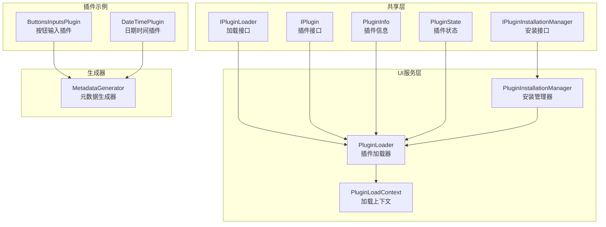
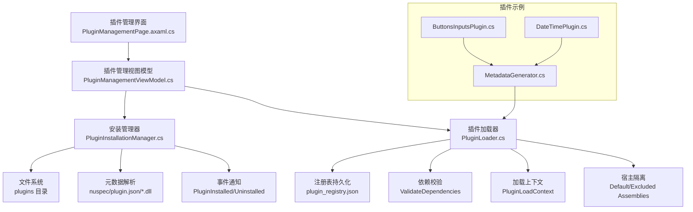
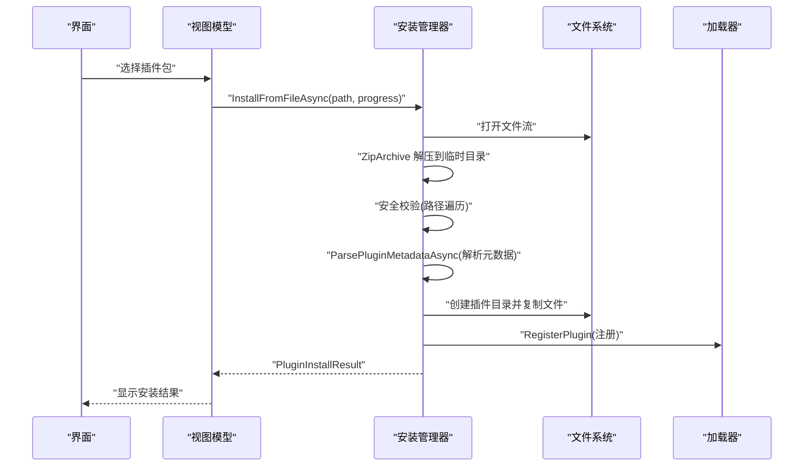
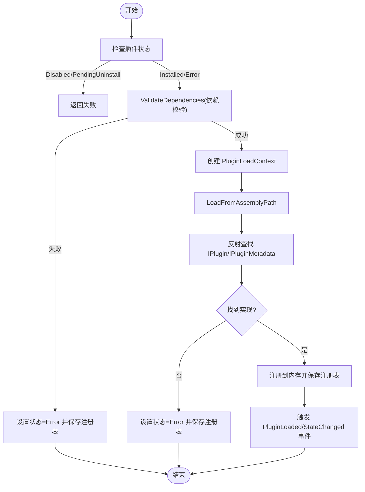
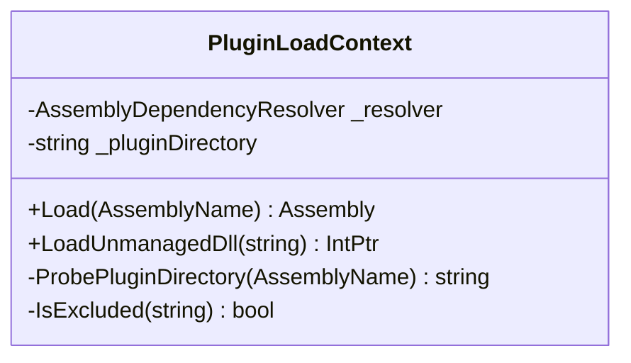
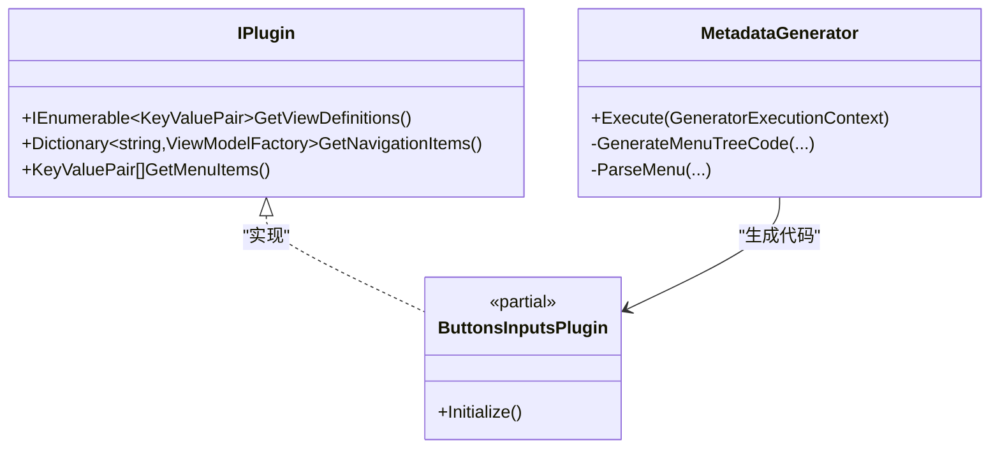
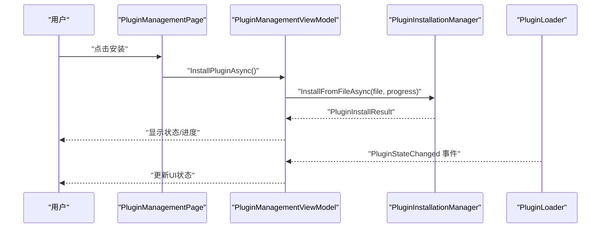
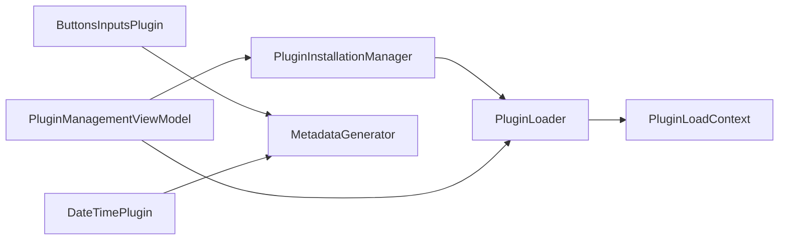
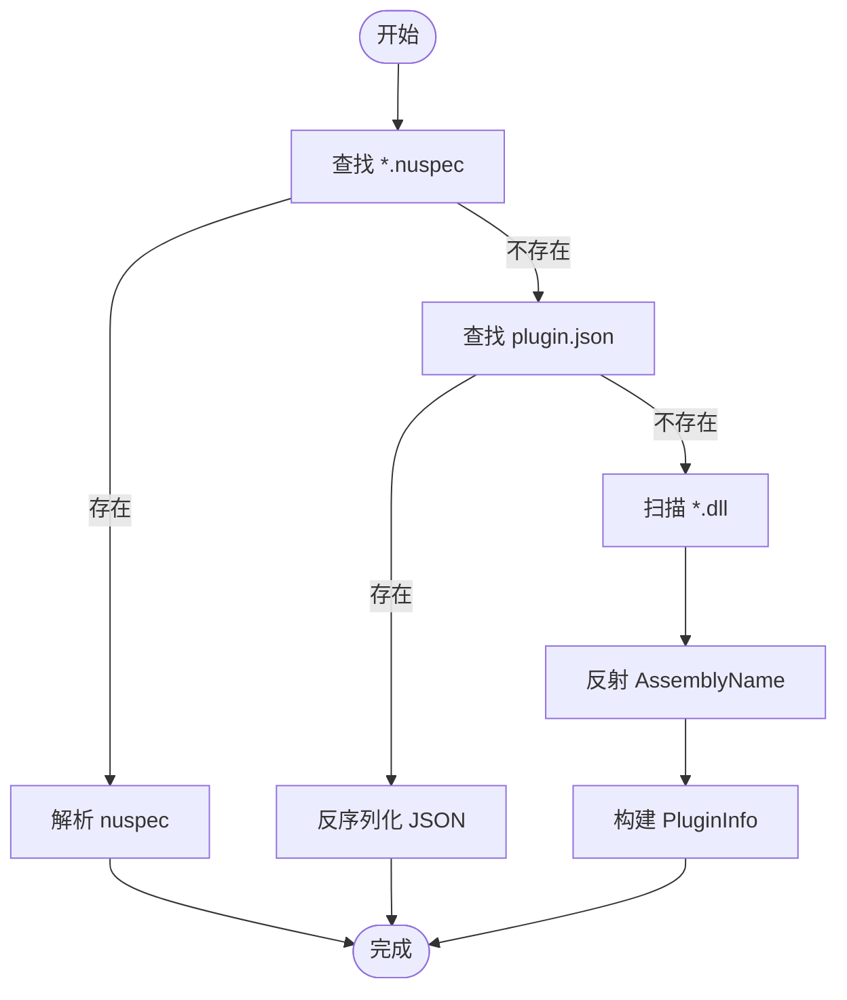

# 插件安装管理

<cite>
**本文档引用的文件**
- [IPluginInstallationManager.cs](file://src/Avalonia.Plugin.Shared/services/IPluginInstallationManager.cs)
- [PluginInstallationManager.cs](file://src/Avalonia.UI/services/PluginInstallationManager.cs)
- [IPluginLoader.cs](file://src/Avalonia.Plugin.Shared/services/IPluginLoader.cs)
- [PluginLoader.cs](file://src/Avalonia.UI/services/PluginLoader.cs)
- [IPlugin.cs](file://src/Avalonia.Plugin.Shared/IPlugin.cs)
- [PluginInfo.cs](file://src/Avalonia.Plugin.Shared/models/PluginInfo.cs)
- [PluginState.cs](file://src/Avalonia.Plugin.Shared/models/PluginState.cs)
- [PluginLoadContext.cs](file://src/Avalonia.UI/services/PluginLoadContext.cs)
- [PluginManagementPage.axaml.cs](file://src/Avalonia.UI/pages/PluginManagementPage.axaml.cs)
- [PluginManagementViewModel.cs](file://src/Avalonia.UI/viewmodels/PluginManagementViewModel.cs)
- [ButtonsInputsPlugin.cs](file://plugins/Avalonia.Plugin.ButtonsInputs/ButtonsInputsPlugin.cs)
- [DateTimePlugin.cs](file://plugins/Avalonia.Plugin.DateTime/DateTimePlugin.cs)
- [MetadataGenerator.cs](file://src/Avalonia.Plugin.Generators/MetadataGenerator.cs)
- [Avalonia.Launcher.Desktop.1.0.0.nuspec](file://src/launcher/Avalonia.Launcher.Desktop/obj/Debug/Avalonia.Launcher.Desktop.1.0.0.nuspec)
</cite>

## 目录
1. [简介](#简介)
2. [项目结构](#项目结构)
3. [核心组件](#核心组件)
4. [架构总览](#架构总览)
5. [详细组件分析](#详细组件分析)
6. [依赖关系分析](#依赖关系分析)
7. [性能考虑](#性能考虑)
8. [故障排除指南](#故障排除指南)
9. [结论](#结论)
10. [附录](#附录)

## 简介
本指南围绕插件安装管理展开，重点解析 PluginInstallationManager 的功能与实现，涵盖插件包的发现、验证、安装与卸载流程；深入阐述插件依赖管理机制（版本检查、兼容性验证与循环依赖检测）；提供自动化脚本与命令行工具使用建议；说明安全验证机制（路径遍历防护等）；并给出插件更新与回滚策略、批量安装与配置管理的最佳实践。

## 项目结构
该仓库采用多项目结构，插件系统由共享接口层、UI服务层与插件示例组成：
- 共享接口与模型：定义插件接口、安装管理接口、状态枚举与插件信息模型
- UI服务层：实现插件安装管理器与插件加载器，负责安装、卸载、加载、依赖校验与注册表持久化
- 插件示例：展示如何通过特性生成元数据，声明依赖与标识
- 生成器：在编译期扫描特性并生成插件实现代码

**图表来源**
- [IPluginInstallationManager.cs:5-16](file://src/Avalonia.Plugin.Shared/services/IPluginInstallationManager.cs#L5-L16)
- [PluginInstallationManager.cs:10-23](file://src/Avalonia.UI/services/PluginInstallationManager.cs#L10-L23)
- [IPluginLoader.cs:5-17](file://src/Avalonia.Plugin.Shared/services/IPluginLoader.cs#L5-L17)
- [PluginLoader.cs:10-35](file://src/Avalonia.UI/services/PluginLoader.cs#L10-L35)
- [PluginLoadContext.cs:6-34](file://src/Avalonia.UI/services/PluginLoadContext.cs#L6-L34)
- [ButtonsInputsPlugin.cs:6-23](file://plugins/Avalonia.Plugin.ButtonsInputs/ButtonsInputsPlugin.cs#L6-L23)
- [DateTimePlugin.cs:6-18](file://plugins/Avalonia.Plugin.DateTime/DateTimePlugin.cs#L6-L18)
- [MetadataGenerator.cs:7-13](file://src/Avalonia.Plugin.Generators/MetadataGenerator.cs#L7-L13)

**章节来源**
- [IPluginInstallationManager.cs:1-24](file://src/Avalonia.Plugin.Shared/services/IPluginInstallationManager.cs#L1-L24)
- [IPluginLoader.cs:1-26](file://src/Avalonia.Plugin.Shared/services/IPluginLoader.cs#L1-L26)
- [PluginInstallationManager.cs:1-261](file://src/Avalonia.UI/services/PluginInstallationManager.cs#L1-L261)
- [PluginLoader.cs:1-460](file://src/Avalonia.UI/services/PluginLoader.cs#L1-L460)
- [PluginLoadContext.cs:1-107](file://src/Avalonia.UI/services/PluginLoadContext.cs#L1-L107)
- [ButtonsInputsPlugin.cs:1-100](file://plugins/Avalonia.Plugin.ButtonsInputs/ButtonsInputsPlugin.cs#L1-L100)
- [DateTimePlugin.cs:1-20](file://plugins/Avalonia.Plugin.DateTime/DateTimePlugin.cs#L1-L20)
- [MetadataGenerator.cs:1-246](file://src/Avalonia.Plugin.Generators/MetadataGenerator.cs#L1-L246)

## 核心组件
- 安装接口与结果封装：定义安装/卸载/启用/禁用操作与结果载体
- 安装管理器：负责从文件或流读取插件包、解压、元数据解析、安装目录准备、安全校验与事件通知
- 加载器：维护插件注册表、加载/卸载插件、依赖校验、状态变更与持久化
- 加载上下文：隔离插件程序集加载，避免与宿主冲突
- 插件接口与模型：统一插件能力描述与状态管理
- UI绑定：提供插件管理界面与视图模型，支持用户交互

**章节来源**
- [IPluginInstallationManager.cs:5-24](file://src/Avalonia.Plugin.Shared/services/IPluginInstallationManager.cs#L5-L24)
- [PluginInstallationManager.cs:10-151](file://src/Avalonia.UI/services/PluginInstallationManager.cs#L10-L151)
- [IPluginLoader.cs:5-26](file://src/Avalonia.Plugin.Shared/services/IPluginLoader.cs#L5-L26)
- [PluginLoader.cs:10-156](file://src/Avalonia.UI/services/PluginLoader.cs#L10-L156)
- [PluginLoadContext.cs:6-107](file://src/Avalonia.UI/services/PluginLoadContext.cs#L6-L107)
- [IPlugin.cs:9-26](file://src/Avalonia.Plugin.Shared/IPlugin.cs#L9-L26)
- [PluginInfo.cs:3-18](file://src/Avalonia.Plugin.Shared/models/PluginInfo.cs#L3-L18)
- [PluginState.cs:3-11](file://src/Avalonia.Plugin.Shared/models/PluginState.cs#L3-L11)

## 架构总览
下图展示了插件安装管理的整体架构与关键交互：

**图表来源**
- [PluginManagementPage.axaml.cs:5-11](file://src/Avalonia.UI/pages/PluginManagementPage.axaml.cs#L5-L11)
- [PluginManagementViewModel.cs:10-33](file://src/Avalonia.UI/viewmodels/PluginManagementViewModel.cs#L10-L33)
- [PluginInstallationManager.cs:10-23](file://src/Avalonia.UI/services/PluginInstallationManager.cs#L10-L23)
- [PluginLoader.cs:10-35](file://src/Avalonia.UI/services/PluginLoader.cs#L10-L35)
- [PluginLoadContext.cs:6-34](file://src/Avalonia.UI/services/PluginLoadContext.cs#L6-L34)
- [ButtonsInputsPlugin.cs:6-23](file://plugins/Avalonia.Plugin.ButtonsInputs/ButtonsInputsPlugin.cs#L6-L23)
- [DateTimePlugin.cs:6-18](file://plugins/Avalonia.Plugin.DateTime/DateTimePlugin.cs#L6-L18)
- [MetadataGenerator.cs:7-13](file://src/Avalonia.Plugin.Generators/MetadataGenerator.cs#L7-L13)

## 详细组件分析

### 安装管理器（PluginInstallationManager）
职责与流程：
- 文件/流安装：从文件路径或流读取插件包，解压至临时目录，执行安全校验（路径遍历防护），解析元数据，复制到目标插件目录，注册并触发事件
- 卸载：标记待卸载，触发事件，实际删除在重启时处理
- 启用/禁用：委托加载器进行状态切换
- 元数据解析：优先解析 nuspec，其次 plugin.json，最后回退到从 DLL 反射提取信息
- 安全校验：严格限制解压与复制的目标路径，防止路径遍历攻击

**图表来源**
- [PluginManagementViewModel.cs:47-88](file://src/Avalonia.UI/viewmodels/PluginManagementViewModel.cs#L47-L88)
- [PluginInstallationManager.cs:29-151](file://src/Avalonia.UI/services/PluginInstallationManager.cs#L29-L151)

**章节来源**
- [PluginInstallationManager.cs:10-151](file://src/Avalonia.UI/services/PluginInstallationManager.cs#L10-L151)
- [PluginManagementViewModel.cs:47-88](file://src/Avalonia.UI/viewmodels/PluginManagementViewModel.cs#L47-L88)

### 插件加载器（PluginLoader）
职责与流程：
- 注册表管理：持久化插件清单，支持重启后恢复状态
- 加载/卸载：基于插件信息加载主程序集，反射获取 IPlugin 与 IPluginMetadata 实例，维护加载上下文
- 依赖校验：确保依赖已安装且已加载，避免循环依赖（通过状态约束）
- 状态机：NotInstalled → Installed → Loaded，Disabled/PendingUninstall/Error 等状态转换
- 额外插件：支持通过环境变量加载额外插件目录中的 DLL

**图表来源**
- [PluginLoader.cs:53-156](file://src/Avalonia.UI/services/PluginLoader.cs#L53-L156)
- [PluginLoader.cs:353-372](file://src/Avalonia.UI/services/PluginLoader.cs#L353-L372)

**章节来源**
- [PluginLoader.cs:10-156](file://src/Avalonia.UI/services/PluginLoader.cs#L10-L156)
- [PluginLoader.cs:353-372](file://src/Avalonia.UI/services/PluginLoader.cs#L353-L372)

### 插件加载上下文（PluginLoadContext）
职责与流程：
- 隔离加载：基于收集式加载上下文，避免与宿主共享程序集冲突
- 排除规则：对 System./Microsoft./Avalonia 等前缀及特定名称进行排除，强制使用宿主程序集
- 依赖解析：优先使用 AssemblyDependencyResolver，其次在插件目录内探测匹配的 DLL
- 非托管库：支持非托管 DLL 的解析与加载

**图表来源**
- [PluginLoadContext.cs:6-107](file://src/Avalonia.UI/services/PluginLoadContext.cs#L6-L107)

**章节来源**
- [PluginLoadContext.cs:6-107](file://src/Avalonia.UI/services/PluginLoadContext.cs#L6-L107)

### 插件接口与元数据生成
- 插件接口：定义视图映射、导航项与菜单项的提供能力
- 元数据生成器：在编译期扫描特性（如 [GenerateMetadata]、[ViewMap]、[NavigationItem]、[Menu]），自动生成插件实现代码，构建菜单树与导航映射

**图表来源**
- [IPlugin.cs:9-26](file://src/Avalonia.Plugin.Shared/IPlugin.cs#L9-L26)
- [MetadataGenerator.cs:7-130](file://src/Avalonia.Plugin.Generators/MetadataGenerator.cs#L7-L130)
- [ButtonsInputsPlugin.cs:6-23](file://plugins/Avalonia.Plugin.ButtonsInputs/ButtonsInputsPlugin.cs#L6-L23)

**章节来源**
- [IPlugin.cs:9-26](file://src/Avalonia.Plugin.Shared/IPlugin.cs#L9-L26)
- [MetadataGenerator.cs:1-246](file://src/Avalonia.Plugin.Generators/MetadataGenerator.cs#L1-L246)
- [ButtonsInputsPlugin.cs:1-100](file://plugins/Avalonia.Plugin.ButtonsInputs/ButtonsInputsPlugin.cs#L1-L100)

### UI 绑定与交互
- 插件管理页面：承载插件管理视图模型
- 视图模型：提供刷新、安装、卸载、启用/禁用命令，绑定进度与状态消息，订阅安装与状态变化事件

**图表来源**
- [PluginManagementPage.axaml.cs:5-11](file://src/Avalonia.UI/pages/PluginManagementPage.axaml.cs#L5-L11)
- [PluginManagementViewModel.cs:47-115](file://src/Avalonia.UI/viewmodels/PluginManagementViewModel.cs#L47-L115)
- [PluginInstallationManager.cs:29-151](file://src/Avalonia.UI/services/PluginInstallationManager.cs#L29-L151)
- [PluginLoader.cs:23-25](file://src/Avalonia.UI/services/PluginLoader.cs#L23-L25)

**章节来源**
- [PluginManagementPage.axaml.cs:1-12](file://src/Avalonia.UI/pages/PluginManagementPage.axaml.cs#L1-L12)
- [PluginManagementViewModel.cs:10-159](file://src/Avalonia.UI/viewmodels/PluginManagementViewModel.cs#L10-L159)

## 依赖关系分析
- 安装管理器依赖加载器进行注册与状态变更
- 加载器依赖加载上下文进行程序集隔离加载
- 插件示例通过生成器生成实现，供加载器反射加载
- UI 层通过视图模型协调安装与加载流程

**图表来源**
- [PluginInstallationManager.cs:12-23](file://src/Avalonia.UI/services/PluginInstallationManager.cs#L12-L23)
- [PluginLoader.cs:14-35](file://src/Avalonia.UI/services/PluginLoader.cs#L14-L35)
- [PluginLoadContext.cs:27-34](file://src/Avalonia.UI/services/PluginLoadContext.cs#L27-L34)
- [ButtonsInputsPlugin.cs:6-23](file://plugins/Avalonia.Plugin.ButtonsInputs/ButtonsInputsPlugin.cs#L6-L23)
- [DateTimePlugin.cs:6-18](file://plugins/Avalonia.Plugin.DateTime/DateTimePlugin.cs#L6-L18)
- [MetadataGenerator.cs:7-13](file://src/Avalonia.Plugin.Generators/MetadataGenerator.cs#L7-L13)
- [PluginManagementViewModel.cs:12-33](file://src/Avalonia.UI/viewmodels/PluginManagementViewModel.cs#L12-L33)

**章节来源**
- [PluginInstallationManager.cs:10-23](file://src/Avalonia.UI/services/PluginInstallationManager.cs#L10-L23)
- [PluginLoader.cs:10-35](file://src/Avalonia.UI/services/PluginLoader.cs#L10-L35)
- [PluginLoadContext.cs:6-34](file://src/Avalonia.UI/services/PluginLoadContext.cs#L6-L34)
- [PluginManagementViewModel.cs:10-33](file://src/Avalonia.UI/viewmodels/PluginManagementViewModel.cs#L10-L33)

## 性能考虑
- 异步安装：安装过程使用异步流与进度回调，避免阻塞 UI
- 依赖校验：在加载前进行依赖存在性与加载状态检查，减少运行时失败
- 程序集隔离：使用收集式加载上下文，便于卸载与资源回收
- 注册表持久化：仅在状态变更时写入，降低 I/O 开销
- 批量操作：建议在 UI 中合并多次状态更新，减少 UI 刷新次数

## 故障排除指南
常见问题与定位要点：
- 安装失败：检查安装结果错误信息，确认包格式、元数据完整性与权限
- 加载失败：查看注册表中状态是否为 Error，检查依赖是否已加载
- 路径遍历：若出现安全错误提示，检查压缩包内条目路径合法性
- 依赖缺失：确认依赖插件已安装且状态为 Loaded
- 卸载未生效：确认状态为 PendingUninstall，等待重启清理

**章节来源**
- [PluginInstallationManager.cs:140-143](file://src/Avalonia.UI/services/PluginInstallationManager.cs#L140-L143)
- [PluginLoader.cs:85-92](file://src/Avalonia.UI/services/PluginLoader.cs#L85-L92)
- [PluginLoader.cs:374-404](file://src/Avalonia.UI/services/PluginLoader.cs#L374-L404)

## 结论
该插件安装管理系统通过清晰的接口分层、严格的安装与加载流程、完善的依赖校验与状态管理，提供了稳定可靠的插件生态。结合 UI 交互与生成器能力，开发者可以高效地开发、安装与管理插件。建议在生产环境中配合安全扫描与版本策略，确保插件供应链安全与稳定性。

## 附录

### 插件包元数据解析流程
- 优先级：nuspec → plugin.json → *.dll 反射
- nuspec 解析：提取 id/version/title/authors/description 与 dependencies
- plugin.json 解析：反序列化为 PluginInfo
- 回退策略：从 DLL 反射 AssemblyName 生成基础信息

**图表来源**
- [PluginInstallationManager.cs:178-214](file://src/Avalonia.UI/services/PluginInstallationManager.cs#L178-L214)
- [PluginInstallationManager.cs:216-259](file://src/Avalonia.UI/services/PluginInstallationManager.cs#L216-L259)

**章节来源**
- [PluginInstallationManager.cs:178-259](file://src/Avalonia.UI/services/PluginInstallationManager.cs#L178-L259)

### 依赖管理机制
- 依赖检查：ValidateDependencies 确保依赖存在且已加载
- 状态约束：禁止在 Disabled/PendingUninstall 状态加载
- 循环依赖规避：通过状态机与依赖链路检查，避免循环引用导致的加载失败

**章节来源**
- [PluginLoader.cs:353-372](file://src/Avalonia.UI/services/PluginLoader.cs#L353-L372)
- [PluginLoader.cs:67-92](file://src/Avalonia.UI/services/PluginLoader.cs#L67-L92)

### 安全验证机制
- 路径遍历防护：解压与复制阶段均进行路径合法性校验
- 程序集隔离：排除 System./Microsoft./Avalonia 等关键程序集，强制使用宿主版本
- 非托管库解析：通过 Resolver 与目录探测，确保安全加载

**章节来源**
- [PluginInstallationManager.cs:62-69](file://src/Avalonia.UI/services/PluginInstallationManager.cs#L62-L69)
- [PluginInstallationManager.cs:110-117](file://src/Avalonia.UI/services/PluginInstallationManager.cs#L110-L117)
- [PluginLoadContext.cs:40-72](file://src/Avalonia.UI/services/PluginLoadContext.cs#L40-L72)
- [PluginLoadContext.cs:96-105](file://src/Avalonia.UI/services/PluginLoadContext.cs#L96-L105)

### 更新与回滚策略
- 更新流程：安装新版本会覆盖旧版本目录，注册表记录新信息
- 回滚策略：当前实现未提供自动回滚，建议保留历史版本目录或使用版本号命名目录
- 卸载清理：标记为 PendingUninstall，重启后删除目录并移除注册表项

**章节来源**
- [PluginInstallationManager.cs:92-100](file://src/Avalonia.UI/services/PluginInstallationManager.cs#L92-L100)
- [PluginLoader.cs:374-404](file://src/Avalonia.UI/services/PluginLoader.cs#L374-L404)

### 批量安装与配置管理最佳实践
- 批量安装：建议在后台线程逐个安装，聚合结果与错误信息
- 配置管理：通过 plugin.json 或插件内部设置接口进行配置持久化
- 环境变量：利用额外插件路径环境变量集中管理第三方插件

**章节来源**
- [PluginLoader.cs:267-286](file://src/Avalonia.UI/services/PluginLoader.cs#L267-L286)
- [PluginManagementViewModel.cs:47-88](file://src/Avalonia.UI/viewmodels/PluginManagementViewModel.cs#L47-L88)

### 命令行工具与自动化脚本建议
- 当前仓库未提供专用命令行工具，可通过以下方式扩展：
  - 使用 PowerShell/批处理脚本调用安装管理器 API 进行自动化安装
  - 在 CI/CD 流水线中集成安装流程，结合 nuspec 与 plugin.json 进行版本控制
  - 通过 NuGet 包管理器发布插件包，简化依赖与版本管理

[本节为通用建议，不直接分析具体文件]

### 示例插件结构参考
- 按钮输入插件：展示 [GenerateMetadata] 特性与基本元数据
- 日期时间插件：展示最小化元数据实现

**章节来源**
- [ButtonsInputsPlugin.cs:6-23](file://plugins/Avalonia.Plugin.ButtonsInputs/ButtonsInputsPlugin.cs#L6-L23)
- [DateTimePlugin.cs:6-18](file://plugins/Avalonia.Plugin.DateTime/DateTimePlugin.cs#L6-L18)

### 发布与打包参考
- 启动器桌面项目包含 nuspec 依赖声明，可作为插件打包与发布的参考

**章节来源**
- [Avalonia.Launcher.Desktop.1.0.0.nuspec:1-24](file://src/launcher/Avalonia.Launcher.Desktop/obj/Debug/Avalonia.Launcher.Desktop.1.0.0.nuspec#L1-L24)