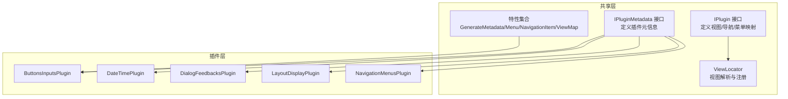
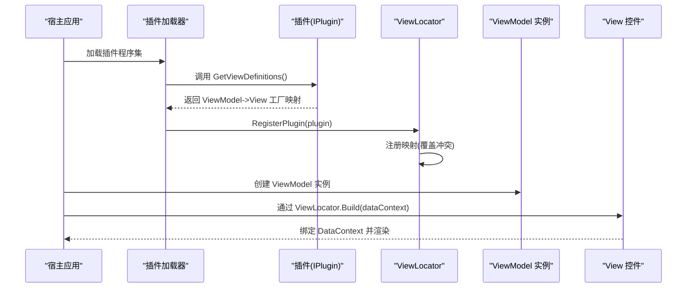
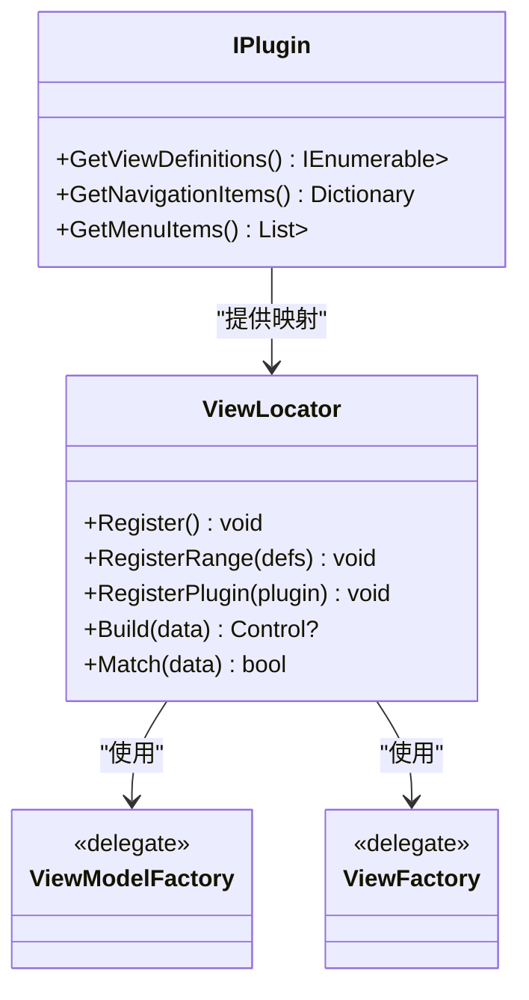
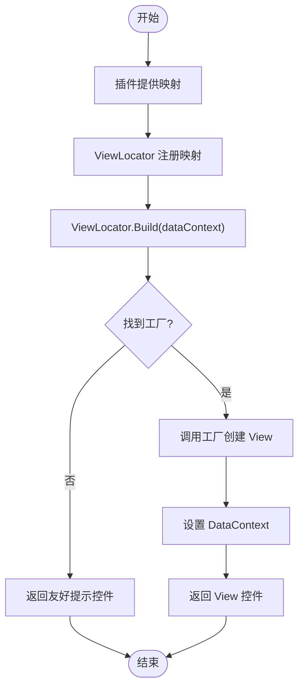
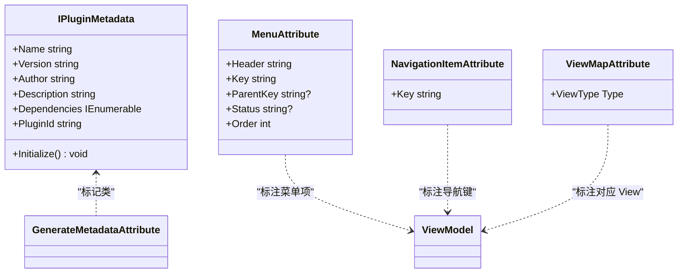
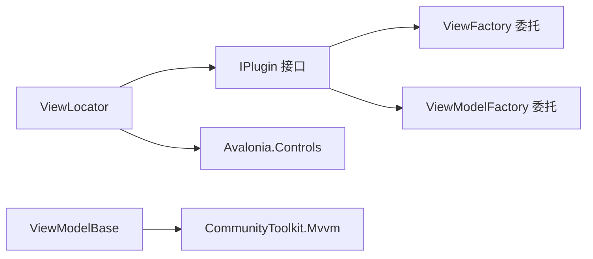

# 插件接口设计

<cite>
**本文档引用的文件**
- [IPlugin.cs](file://src/Avalonia.Plugin.Shared/IPlugin.cs)
- [IPluginMetadata.cs](file://src/Avalonia.Plugin.Shared/IPluginMetadata.cs)
- [ViewLocator.cs](file://src/Avalonia.Plugin.Shared/ViewLocator.cs)
- [ViewModelBase.cs](file://src/Avalonia.Plugin.Shared/ViewModelBase.cs)
- [GenerateMetadataAttribute.cs](file://src/Avalonia.Plugin.Shared/Attributes/GenerateMetadataAttribute.cs)
- [MenuAttribute.cs](file://src/Avalonia.Plugin.Shared/Attributes/MenuAttribute.cs)
- [NavigationItemAttribute.cs](file://src/Avalonia.Plugin.Shared/Attributes/NavigationItemAttribute.cs)
- [ViewMapAttribute.cs](file://src/Avalonia.Plugin.Shared/Attributes/ViewMapAttribute.cs)
- [ButtonsInputsPlugin.cs](file://plugins/Avalonia.Plugin.ButtonsInputs/ButtonsInputsPlugin.cs)
- [DateTimePlugin.cs](file://plugins/Avalonia.Plugin.DateTime/DateTimePlugin.cs)
- [DialogFeedbacksPlugin.cs](file://plugins/Avalonia.Plugin.DialogFeedbacks/DialogFeedbacksPlugin.cs)
- [LayoutDisplayPlugin.cs](file://plugins/Avalonia.Plugin.LayoutDisplay/LayoutDisplayPlugin.cs)
- [NavigationMenusPlugin.cs](file://plugins/Avalonia.Plugin.NavigationMenus/NavigationMenusPlugin.cs)
</cite>

## 目录
1. [简介](#简介)
2. [项目结构](#项目结构)
3. [核心组件](#核心组件)
4. [架构总览](#架构总览)
5. [详细组件分析](#详细组件分析)
6. [依赖分析](#依赖分析)
7. [性能考虑](#性能考虑)
8. [故障排除指南](#故障排除指南)
9. [结论](#结论)
10. [附录](#附录)

## 简介
本文件面向插件开发者，系统化阐述 Avalonia 插件系统的接口设计与实现规范。重点围绕 IPlugin 接口的三个核心方法：GetViewDefinitions()、GetNavigationItems()、GetMenuItems()，以及 ViewModel 工厂委托与 View 工厂委托的设计模式与最佳实践。文档同时给出完整实现示例的路径指引、常见错误与调试技巧，帮助开发者确保插件与主应用的兼容性。

## 项目结构
该仓库采用“共享层 + 插件层”的分层组织方式：
- 共享层（src/Avalonia.Plugin.Shared）：定义插件接口、元数据接口、视图定位器、工具类等通用能力
- 插件层（plugins/*）：各功能插件，实现 IPlugin 或 IPluginMetadata 接口，并通过特性标注生成元数据

图表来源
- [IPlugin.cs:9-26](file://src/Avalonia.Plugin.Shared/IPlugin.cs#L9-L26)
- [IPluginMetadata.cs:3-41](file://src/Avalonia.Plugin.Shared/IPluginMetadata.cs#L3-L41)
- [ViewLocator.cs:6-71](file://src/Avalonia.Plugin.Shared/ViewLocator.cs#L6-L71)
- [GenerateMetadataAttribute.cs:1-4](file://src/Avalonia.Plugin.Shared/Attributes/GenerateMetadataAttribute.cs#L1-L4)
- [MenuAttribute.cs:1-39](file://src/Avalonia.Plugin.Shared/Attributes/MenuAttribute.cs#L1-L39)
- [NavigationItemAttribute.cs:1-8](file://src/Avalonia.Plugin.Shared/Attributes/NavigationItemAttribute.cs#L1-L8)
- [ViewMapAttribute.cs:1-9](file://src/Avalonia.Plugin.Shared/Attributes/ViewMapAttribute.cs#L1-L9)

章节来源
- [IPlugin.cs:1-81](file://src/Avalonia.Plugin.Shared/IPlugin.cs#L1-L81)
- [IPluginMetadata.cs:1-44](file://src/Avalonia.Plugin.Shared/IPluginMetadata.cs#L1-L44)
- [ViewLocator.cs:1-72](file://src/Avalonia.Plugin.Shared/ViewLocator.cs#L1-L72)

## 核心组件
- IPlugin 接口：定义插件向宿主暴露的三类能力
  - GetViewDefinitions()：返回 ViewModel 到 View 的工厂映射
  - GetNavigationItems()：返回导航项字典（键为导航键，值为 ViewModel 工厂）
  - GetMenuItems()：返回菜单项列表（含可选父级键）
- 工厂委托
  - ViewModelFactory：无参工厂，创建 ViewModel 实例
  - ViewFactory：无参工厂，创建 Avalonia 控件实例
- ViewLocator：统一的视图解析器，负责将 ViewModel 实例解析为对应的 View 控件
- IPluginMetadata：插件元数据接口，用于声明插件基本信息与初始化入口
- 特性体系：GenerateMetadata、Menu、NavigationItem、ViewMap，辅助自动化生成元数据与映射

章节来源
- [IPlugin.cs:9-26](file://src/Avalonia.Plugin.Shared/IPlugin.cs#L9-L26)
- [IPlugin.cs:29-36](file://src/Avalonia.Plugin.Shared/IPlugin.cs#L29-L36)
- [ViewLocator.cs:6-71](file://src/Avalonia.Plugin.Shared/ViewLocator.cs#L6-L71)
- [IPluginMetadata.cs:3-41](file://src/Avalonia.Plugin.Shared/IPluginMetadata.cs#L3-L41)
- [GenerateMetadataAttribute.cs:1-4](file://src/Avalonia.Plugin.Shared/Attributes/GenerateMetadataAttribute.cs#L1-L4)
- [MenuAttribute.cs:1-39](file://src/Avalonia.Plugin.Shared/Attributes/MenuAttribute.cs#L1-L39)
- [NavigationItemAttribute.cs:1-8](file://src/Avalonia.Plugin.Shared/Attributes/NavigationItemAttribute.cs#L1-L8)
- [ViewMapAttribute.cs:1-9](file://src/Avalonia.Plugin.Shared/Attributes/ViewMapAttribute.cs#L1-L9)

## 架构总览
下图展示了插件系统的核心交互流程：插件通过 IPlugin 暴露映射，ViewLocator 注册并解析映射，最终由 Avalonia 框架根据 DataContext 自动绑定到 View。

图表来源
- [ViewLocator.cs:32-42](file://src/Avalonia.Plugin.Shared/ViewLocator.cs#L32-L42)
- [ViewLocator.cs:47-68](file://src/Avalonia.Plugin.Shared/ViewLocator.cs#L47-L68)
- [IPlugin.cs:15-15](file://src/Avalonia.Plugin.Shared/IPlugin.cs#L15-L15)

## 详细组件分析

### IPlugin 接口与职责
- GetViewDefinitions()
  - 用途：建立 ViewModel 类型到 View 工厂的映射，使宿主能按需创建 View
  - 返回：IEnumerable<KeyValuePair<Type, ViewFactory>>
  - 实现要点：保证每个 ViewModel 都有唯一且稳定的映射；避免重复注册导致的歧义
- GetNavigationItems()
  - 用途：提供可导航的页面入口，键为导航键，值为 ViewModel 工厂
  - 返回：Dictionary<string, ViewModelFactory>
  - 实现要点：导航键全局唯一；工厂延迟创建，避免不必要的资源占用
- GetMenuItems()
  - 用途：提供菜单项集合，支持父子层级关系
  - 返回：List<KeyValuePair<string, MenuItemViewModel>>
  - 实现要点：父键可为空表示根级菜单；MenuItemViewModel 包含菜单标题、命令、状态等

图表来源
- [IPlugin.cs:9-26](file://src/Avalonia.Plugin.Shared/IPlugin.cs#L9-L26)
- [ViewLocator.cs:6-71](file://src/Avalonia.Plugin.Shared/ViewLocator.cs#L6-L71)
- [IPlugin.cs:29-36](file://src/Avalonia.Plugin.Shared/IPlugin.cs#L29-L36)

章节来源
- [IPlugin.cs:9-26](file://src/Avalonia.Plugin.Shared/IPlugin.cs#L9-L26)

### ViewModel 工厂委托与 View 工厂委托
- 设计模式
  - 工厂委托用于解耦 ViewModel 与 View 的创建过程，遵循开闭原则
  - 通过延迟创建（惰性）避免一次性加载所有视图带来的性能问题
- 在插件系统中的作用
  - IPlugin.GetViewDefinitions() 返回映射，ViewLocator.RegisterPlugin() 注册映射
  - ViewLocator.Build() 根据 DataContext 的类型查找工厂并创建 View，自动设置 DataContext

图表来源
- [ViewLocator.cs:47-68](file://src/Avalonia.Plugin.Shared/ViewLocator.cs#L47-L68)
- [ViewLocator.cs:32-42](file://src/Avalonia.Plugin.Shared/ViewLocator.cs#L32-L42)

章节来源
- [ViewLocator.cs:1-72](file://src/Avalonia.Plugin.Shared/ViewLocator.cs#L1-L72)
- [IPlugin.cs:29-36](file://src/Avalonia.Plugin.Shared/IPlugin.cs#L29-L36)

### IPluginMetadata 与特性驱动的元数据生成
- IPluginMetadata
  - 提供插件名称、版本、作者、描述、依赖、唯一标识等元信息
  - Initialize() 作为插件初始化入口，可在其中调用 IPlugin 的方法进行注册
- 特性
  - GenerateMetadataAttribute：标记类以生成元数据
  - MenuAttribute：为 ViewModel 标记菜单项，包含标题、键、父键、状态、排序
  - NavigationItemAttribute：为 ViewModel 标记导航项键
  - ViewMapAttribute：为 ViewModel 标记对应的 View 类型

图表来源
- [IPluginMetadata.cs:3-41](file://src/Avalonia.Plugin.Shared/IPluginMetadata.cs#L3-L41)
- [GenerateMetadataAttribute.cs:1-4](file://src/Avalonia.Plugin.Shared/Attributes/GenerateMetadataAttribute.cs#L1-L4)
- [MenuAttribute.cs:1-39](file://src/Avalonia.Plugin.Shared/Attributes/MenuAttribute.cs#L1-L39)
- [NavigationItemAttribute.cs:1-8](file://src/Avalonia.Plugin.Shared/Attributes/NavigationItemAttribute.cs#L1-L8)
- [ViewMapAttribute.cs:1-9](file://src/Avalonia.Plugin.Shared/Attributes/ViewMapAttribute.cs#L1-L9)

章节来源
- [IPluginMetadata.cs:1-44](file://src/Avalonia.Plugin.Shared/IPluginMetadata.cs#L1-L44)
- [GenerateMetadataAttribute.cs:1-4](file://src/Avalonia.Plugin.Shared/Attributes/GenerateMetadataAttribute.cs#L1-L4)
- [MenuAttribute.cs:1-39](file://src/Avalonia.Plugin.Shared/Attributes/MenuAttribute.cs#L1-L39)
- [NavigationItemAttribute.cs:1-8](file://src/Avalonia.Plugin.Shared/Attributes/NavigationItemAttribute.cs#L1-L8)
- [ViewMapAttribute.cs:1-9](file://src/Avalonia.Plugin.Shared/Attributes/ViewMapAttribute.cs#L1-L9)

### 插件实现示例与最佳实践
- 示例路径
  - 基础元数据插件实现：[DateTimePlugin.cs:1-20](file://plugins/Avalonia.Plugin.DateTime/DateTimePlugin.cs#L1-L20)
  - 基础元数据插件实现：[DialogFeedbacksPlugin.cs:1-20](file://plugins/Avalonia.Plugin.DialogFeedbacks/DialogFeedbacksPlugin.cs#L1-L20)
  - 基础元数据插件实现：[LayoutDisplayPlugin.cs:1-20](file://plugins/Avalonia.Plugin.LayoutDisplay/LayoutDisplayPlugin.cs#L1-L20)
  - 基础元数据插件实现：[NavigationMenusPlugin.cs:1-20](file://plugins/Avalonia.Plugin.NavigationMenus/NavigationMenusPlugin.cs#L1-L20)
  - 展示 IPlugin 接口方法注释的插件：[ButtonsInputsPlugin.cs:1-100](file://plugins/Avalonia.Plugin.ButtonsInputs/ButtonsInputsPlugin.cs#L1-L100)
- 最佳实践
  - 明确职责分离：IPlugin 仅负责映射与菜单/导航项，IPluginMetadata 负责元信息与初始化
  - 使用工厂委托：避免直接 new ViewModel/View，通过工厂延迟创建
  - 唯一键约束：导航键、菜单键必须全局唯一，防止冲突
  - 清晰的命名与目录结构：ViewModels 与 Pages 分离，便于维护
  - 可测试性：工厂委托便于单元测试替换依赖

章节来源
- [DateTimePlugin.cs:1-20](file://plugins/Avalonia.Plugin.DateTime/DateTimePlugin.cs#L1-L20)
- [DialogFeedbacksPlugin.cs:1-20](file://plugins/Avalonia.Plugin.DialogFeedbacks/DialogFeedbacksPlugin.cs#L1-L20)
- [LayoutDisplayPlugin.cs:1-20](file://plugins/Avalonia.Plugin.LayoutDisplay/LayoutDisplayPlugin.cs#L1-L20)
- [NavigationMenusPlugin.cs:1-20](file://plugins/Avalonia.Plugin.NavigationMenus/NavigationMenusPlugin.cs#L1-L20)
- [ButtonsInputsPlugin.cs:1-100](file://plugins/Avalonia.Plugin.ButtonsInputs/ButtonsInputsPlugin.cs#L1-L100)

## 依赖分析
- 组件耦合
  - ViewLocator 对 IPlugin 的依赖是单向的，通过 RegisterPlugin 注入映射
  - IPlugin 与工厂委托之间为弱耦合，通过类型键值对解绑具体实现
- 外部依赖
  - Avalonia.Controls：ViewFactory 返回的控件基类
  - CommunityToolkit.Mvvm：ViewModelBase 提供 MVVM 基础能力

图表来源
- [IPlugin.cs:9-26](file://src/Avalonia.Plugin.Shared/IPlugin.cs#L9-L26)
- [ViewLocator.cs:6-71](file://src/Avalonia.Plugin.Shared/ViewLocator.cs#L6-L71)
- [ViewModelBase.cs:1-12](file://src/Avalonia.Plugin.Shared/ViewModelBase.cs#L1-L12)

章节来源
- [IPlugin.cs:1-81](file://src/Avalonia.Plugin.Shared/IPlugin.cs#L1-L81)
- [ViewLocator.cs:1-72](file://src/Avalonia.Plugin.Shared/ViewLocator.cs#L1-L72)
- [ViewModelBase.cs:1-12](file://src/Avalonia.Plugin.Shared/ViewModelBase.cs#L1-L12)

## 性能考虑
- 工厂委托的延迟创建：避免一次性初始化大量 ViewModel/View，降低启动成本
- ViewLocator 内部使用字典存储映射，查找复杂度 O(1)，适合高频绑定场景
- 批量注册：通过 RegisterRange 一次性注入多个映射，减少循环注册开销
- 冲突处理：后注册映射会覆盖旧映射，确保插件更新时行为一致

## 故障排除指南
- 症状：View 未找到，显示提示文本
  - 可能原因：未在插件中正确实现 GetViewDefinitions() 或未调用 RegisterPlugin
  - 解决步骤：检查插件是否返回非空映射；确认宿主在加载时调用了 ViewLocator.RegisterPlugin(plugin)
- 症状：导航或菜单项不显示
  - 可能原因：导航键或菜单键重复；菜单项父键不存在
  - 解决步骤：确保键的唯一性；核对父子关系
- 症状：ViewModel 无法绑定到 View
  - 可能原因：DataContext 类型与映射键不匹配；未设置 DataContext
  - 解决步骤：确认 DataContext 类型与映射键一致；ViewLocator 会自动设置 DataContext

章节来源
- [ViewLocator.cs:47-68](file://src/Avalonia.Plugin.Shared/ViewLocator.cs#L47-L68)
- [ViewLocator.cs:32-42](file://src/Avalonia.Plugin.Shared/ViewLocator.cs#L32-L42)

## 结论
IPlugin 接口通过工厂委托与映射机制，为插件系统提供了高内聚、低耦合的扩展点。配合 IPluginMetadata 与特性体系，开发者可以快速实现插件的元数据与界面映射。遵循本文的最佳实践与排错建议，可显著提升插件的稳定性与可维护性。

## 附录
- 快速实现清单
  - 实现 IPlugin 并至少提供 GetViewDefinitions() 的有效映射
  - 如需导航/菜单，实现 GetNavigationItems()/GetMenuItems()
  - 在 IPluginMetadata.Initialize() 中调用 ViewLocator.RegisterPlugin(this)
  - 使用特性标注 ViewModel，自动生成菜单/导航/视图映射（可选）
- 参考实现路径
  - [ButtonsInputsPlugin.cs:1-100](file://plugins/Avalonia.Plugin.ButtonsInputs/ButtonsInputsPlugin.cs#L1-L100)
  - [DateTimePlugin.cs:1-20](file://plugins/Avalonia.Plugin.DateTime/DateTimePlugin.cs#L1-L20)
  - [DialogFeedbacksPlugin.cs:1-20](file://plugins/Avalonia.Plugin.DialogFeedbacks/DialogFeedbacksPlugin.cs#L1-L20)
  - [LayoutDisplayPlugin.cs:1-20](file://plugins/Avalonia.Plugin.LayoutDisplay/LayoutDisplayPlugin.cs#L1-L20)
  - [NavigationMenusPlugin.cs:1-20](file://plugins/Avalonia.Plugin.NavigationMenus/NavigationMenusPlugin.cs#L1-L20)