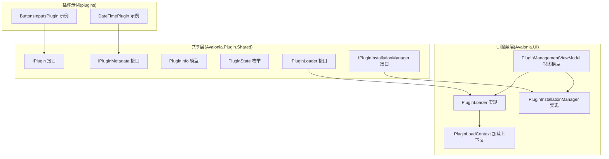
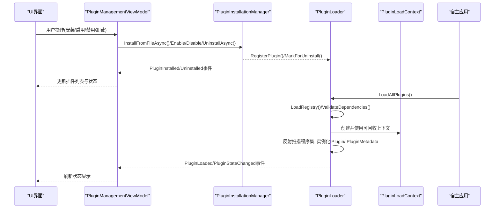
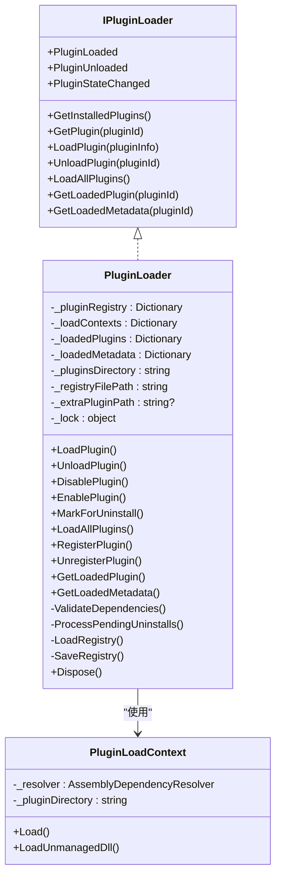
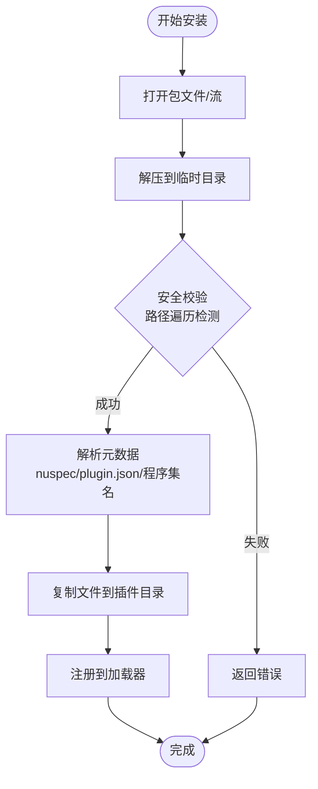
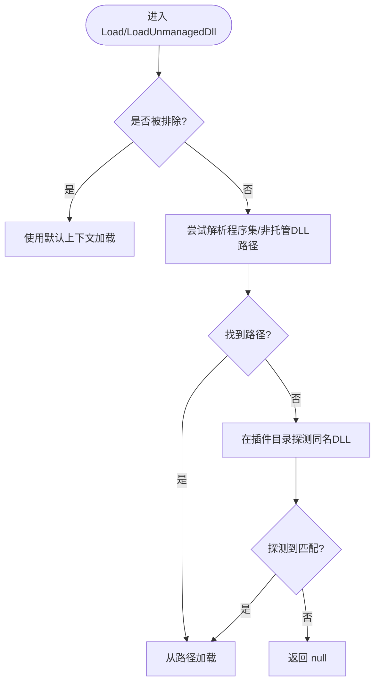
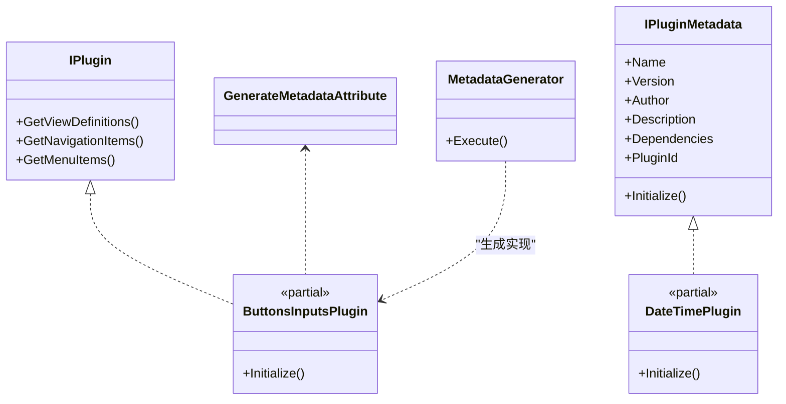
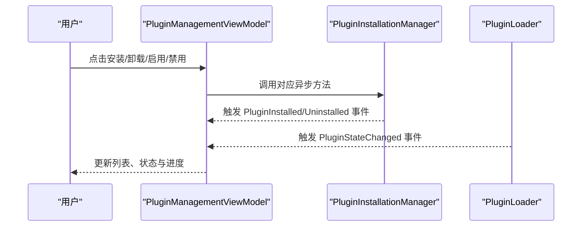
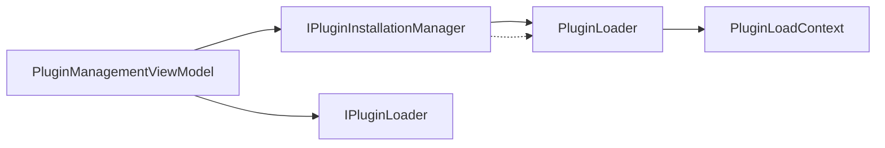
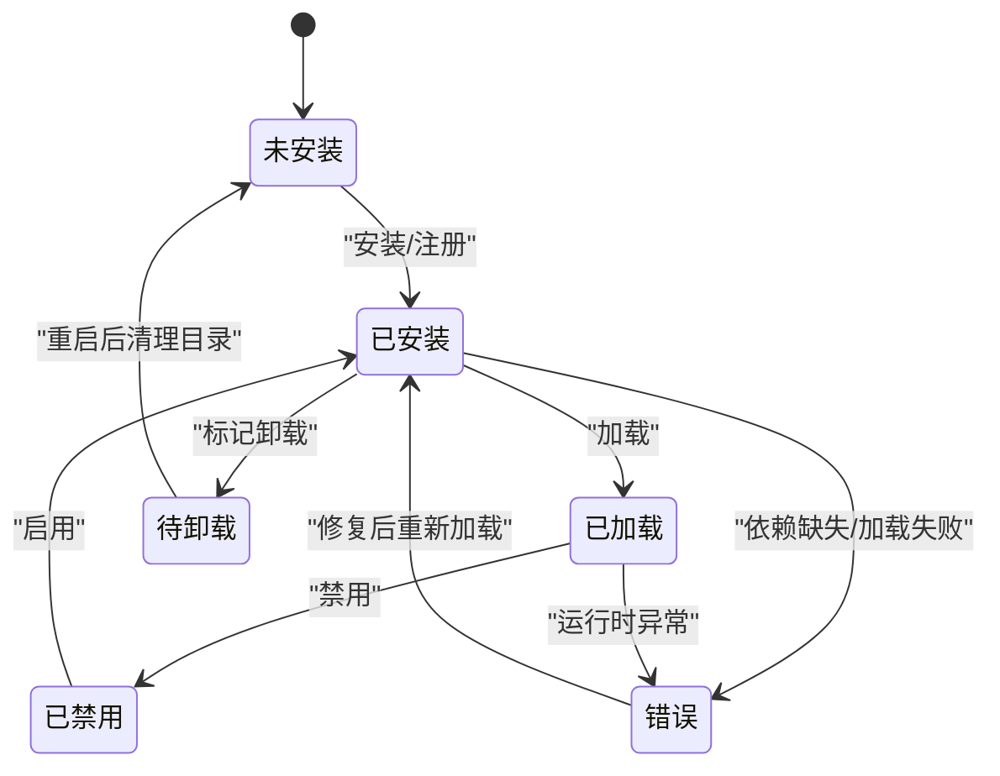

# 插件生命周期管理

<cite>
**本文档引用的文件**
- [PluginLoader.cs](file://src/Avalonia.UI/Services/PluginLoader.cs)
- [PluginInstallationManager.cs](file://src/Avalonia.UI/Services/PluginInstallationManager.cs)
- [PluginLoadContext.cs](file://src/Avalonia.UI/Services/PluginLoadContext.cs)
- [IPluginLoader.cs](file://src/Avalonia.Plugin.Shared/Services/IPluginLoader.cs)
- [IPluginInstallationManager.cs](file://src/Avalonia.Plugin.Shared/Services/IPluginInstallationManager.cs)
- [IPlugin.cs](file://src/Avalonia.Plugin.Shared/IPlugin.cs)
- [IPluginMetadata.cs](file://src/Avalonia.Plugin.Shared/IPluginMetadata.cs)
- [PluginInfo.cs](file://src/Avalonia.Plugin.Shared/Models/PluginInfo.cs)
- [PluginState.cs](file://src/Avalonia.Plugin.Shared/Models/PluginState.cs)
- [PluginManagementViewModel.cs](file://src/Avalonia.UI/ViewModels/PluginManagementViewModel.cs)
- [ButtonsInputsPlugin.cs](file://plugins/Avalonia.Plugin.ButtonsInputs/ButtonsInputsPlugin.cs)
- [DateTimePlugin.cs](file://plugins/Avalonia.Plugin.DateTime/DateTimePlugin.cs)
- [Avalonia.Plugin.ButtonsInputs.csproj](file://plugins/Avalonia.Plugin.ButtonsInputs/Avalonia.Plugin.ButtonsInputs.csproj)
- [Avalonia.Plugin.DateTime.csproj](file://plugins/Avalonia.Plugin.DateTime/Avalonia.Plugin.DateTime.csproj)
- [MetadataGenerator.cs](file://src/Avalonia.Plugin.Generators/MetadataGenerator.cs)
- [GenerateMetadataAttribute.cs](file://src/Avalonia.Plugin.Shared/Attributes/GenerateMetadataAttribute.cs)
</cite>

## 目录
1. [简介](#简介)
2. [项目结构](#项目结构)
3. [核心组件](#核心组件)
4. [架构总览](#架构总览)
5. [详细组件分析](#详细组件分析)
6. [依赖关系分析](#依赖关系分析)
7. [性能考虑](#性能考虑)
8. [故障排除指南](#故障排除指南)
9. [结论](#结论)
10. [附录](#附录)

## 简介
本指南围绕插件生命周期管理进行系统性说明，覆盖从安装、注册、加载、激活、运行、停用到卸载的完整流程；深入解析 PluginLoader 的程序集加载、实例化与依赖解析机制；总结状态管理最佳实践（状态同步、异常处理、资源清理）；并介绍生命周期事件监听与处理机制，以及插件热重载与动态更新的实现思路。

## 项目结构
该仓库采用“共享接口层 + UI服务层 + 插件示例”的分层组织方式：
- 共享接口与模型位于 Avalonia.Plugin.Shared，定义插件契约、状态枚举与安装结果类型。
- UI服务层（Avalonia.UI）提供插件加载器、安装器与加载上下文，负责插件的发现、加载、卸载与状态持久化。
- 插件示例位于 plugins 目录，每个插件项目引用共享库与元数据生成器，通过特性标注自动生成插件接口实现。

**图表来源**
- [PluginLoader.cs:10-460](file://src/Avalonia.UI/Services/PluginLoader.cs#L10-L460)
- [PluginInstallationManager.cs:10-261](file://src/Avalonia.UI/Services/PluginInstallationManager.cs#L10-L261)
- [PluginLoadContext.cs:6-107](file://src/Avalonia.UI/Services/PluginLoadContext.cs#L6-L107)
- [IPluginLoader.cs:5-26](file://src/Avalonia.Plugin.Shared/Services/IPluginLoader.cs#L5-L26)
- [IPluginInstallationManager.cs:5-24](file://src/Avalonia.Plugin.Shared/Services/IPluginInstallationManager.cs#L5-L24)
- [IPlugin.cs:9-26](file://src/Avalonia.Plugin.Shared/IPlugin.cs#L9-L26)
- [IPluginMetadata.cs:3-41](file://src/Avalonia.Plugin.Shared/IPluginMetadata.cs#L3-L41)
- [PluginInfo.cs:3-18](file://src/Avalonia.Plugin.Shared/Models/PluginInfo.cs#L3-L18)
- [PluginState.cs:3-11](file://src/Avalonia.Plugin.Shared/Models/PluginState.cs#L3-L11)
- [PluginManagementViewModel.cs:10-208](file://src/Avalonia.UI/ViewModels/PluginManagementViewModel.cs#L10-L208)
- [ButtonsInputsPlugin.cs:6-24](file://plugins/Avalonia.Plugin.ButtonsInputs/ButtonsInputsPlugin.cs#L6-L24)
- [DateTimePlugin.cs:6-19](file://plugins/Avalonia.Plugin.DateTime/DateTimePlugin.cs#L6-L19)

**章节来源**
- [PluginLoader.cs:10-460](file://src/Avalonia.UI/Services/PluginLoader.cs#L10-L460)
- [PluginInstallationManager.cs:10-261](file://src/Avalonia.UI/Services/PluginInstallationManager.cs#L10-L261)
- [PluginLoadContext.cs:6-107](file://src/Avalonia.UI/Services/PluginLoadContext.cs#L6-L107)
- [IPluginLoader.cs:5-26](file://src/Avalonia.Plugin.Shared/Services/IPluginLoader.cs#L5-L26)
- [IPluginInstallationManager.cs:5-24](file://src/Avalonia.Plugin.Shared/Services/IPluginInstallationManager.cs#L5-L24)
- [IPlugin.cs:9-26](file://src/Avalonia.Plugin.Shared/IPlugin.cs#L9-L26)
- [IPluginMetadata.cs:3-41](file://src/Avalonia.Plugin.Shared/IPluginMetadata.cs#L3-L41)
- [PluginInfo.cs:3-18](file://src/Avalonia.Plugin.Shared/Models/PluginInfo.cs#L3-L18)
- [PluginState.cs:3-11](file://src/Avalonia.Plugin.Shared/Models/PluginState.cs#L3-L11)
- [PluginManagementViewModel.cs:10-208](file://src/Avalonia.UI/ViewModels/PluginManagementViewModel.cs#L10-L208)
- [ButtonsInputsPlugin.cs:6-24](file://plugins/Avalonia.Plugin.ButtonsInputs/ButtonsInputsPlugin.cs#L6-L24)
- [DateTimePlugin.cs:6-19](file://plugins/Avalonia.Plugin.DateTime/DateTimePlugin.cs#L6-L19)

## 核心组件
- 插件接口族
  - IPlugin：声明插件提供的视图-视图模型映射、导航项与菜单项能力。
  - IPluginMetadata：声明插件元数据与初始化入口。
- 插件状态模型
  - PluginInfo：记录插件标识、版本、作者、描述、依赖、安装路径、程序集路径、状态、错误信息、安装时间、是否内置、是否有元数据等。
  - PluginState：定义 NotInstalled、Installed、Loaded、Disabled、PendingUninstall、Error 等状态。
- 插件加载器
  - PluginLoader：负责插件注册表读写、依赖校验、程序集加载、实例化、状态变更通知、卸载与禁用、额外插件目录扫描、收集器式卸载上下文释放。
- 插件安装器
  - PluginInstallationManager：负责从包文件或流解压安装、解析元数据、复制文件、注册插件、触发安装/卸载事件。
- 加载上下文
  - PluginLoadContext：基于 AssemblyLoadContext 的可回收上下文，隔离插件依赖，避免与宿主冲突。
- 视图模型
  - PluginManagementViewModel：提供插件管理界面的数据绑定与命令，订阅加载器事件以实时更新UI。

**章节来源**
- [IPlugin.cs:9-26](file://src/Avalonia.Plugin.Shared/IPlugin.cs#L9-L26)
- [IPluginMetadata.cs:3-41](file://src/Avalonia.Plugin.Shared/IPluginMetadata.cs#L3-L41)
- [PluginInfo.cs:3-18](file://src/Avalonia.Plugin.Shared/Models/PluginInfo.cs#L3-L18)
- [PluginState.cs:3-11](file://src/Avalonia.Plugin.Shared/Models/PluginState.cs#L3-L11)
- [PluginLoader.cs:10-460](file://src/Avalonia.UI/Services/PluginLoader.cs#L10-L460)
- [PluginInstallationManager.cs:10-261](file://src/Avalonia.UI/Services/PluginInstallationManager.cs#L10-L261)
- [PluginLoadContext.cs:6-107](file://src/Avalonia.UI/Services/PluginLoadContext.cs#L6-L107)
- [PluginManagementViewModel.cs:10-208](file://src/Avalonia.UI/ViewModels/PluginManagementViewModel.cs#L10-L208)

## 架构总览
下图展示了插件生命周期在各组件间的流转与交互：

**图表来源**
- [PluginManagementViewModel.cs:23-158](file://src/Avalonia.UI/ViewModels/PluginManagementViewModel.cs#L23-L158)
- [PluginInstallationManager.cs:18-176](file://src/Avalonia.UI/Services/PluginInstallationManager.cs#L18-L176)
- [PluginLoader.cs:27-264](file://src/Avalonia.UI/Services/PluginLoader.cs#L27-L264)
- [PluginLoadContext.cs:30-58](file://src/Avalonia.UI/Services/PluginLoadContext.cs#L30-L58)

## 详细组件分析

### 组件一：PluginLoader 插件加载器
职责与流程
- 注册表管理：加载/保存 JSON 注册表，确保 Loaded 状态回退为 Installed，支持卸载后清理。
- 依赖验证：检查依赖是否存在且已加载，保证拓扑有序。
- 程序集加载：使用可回收的 PluginLoadContext 加载插件程序集，反射定位 IPlugin 与 IPluginMetadata 实例。
- 实例化与装配：创建插件实例与元数据实例，更新状态并触发事件。
- 卸载与禁用：移除内存缓存，卸载上下文，必要时删除安装目录。
- 额外插件：扫描环境变量指定的额外插件路径，动态加载未注册的DLL。

关键实现要点
- 线程安全：所有公开方法均使用锁保护内部字典与状态。
- 事件驱动：对外暴露 PluginLoaded、PluginUnloaded、PluginStateChanged 事件，便于UI与业务层响应。
- 容错与恢复：遇到异常或缺失依赖时，设置状态为 Error 并持久化，同时发出状态变更通知。
- 资源回收：在 Dispose 中卸载所有上下文，清空缓存，避免内存泄漏。

**图表来源**
- [IPluginLoader.cs:5-26](file://src/Avalonia.Plugin.Shared/Services/IPluginLoader.cs#L5-L26)
- [PluginLoader.cs:10-460](file://src/Avalonia.UI/Services/PluginLoader.cs#L10-L460)
- [PluginLoadContext.cs:6-107](file://src/Avalonia.UI/Services/PluginLoadContext.cs#L6-L107)

**章节来源**
- [PluginLoader.cs:10-460](file://src/Avalonia.UI/Services/PluginLoader.cs#L10-L460)
- [PluginLoadContext.cs:6-107](file://src/Avalonia.UI/Services/PluginLoadContext.cs#L6-L107)
- [IPluginLoader.cs:5-26](file://src/Avalonia.Plugin.Shared/Services/IPluginLoader.cs#L5-L26)

### 组件二：PluginInstallationManager 插件安装器
职责与流程
- 包安装：从文件或流解压，执行安全校验（路径遍历防护），复制到目标目录，解析元数据（优先 nuspec，其次 plugin.json，最后回退到程序集名）。
- 注册与发布：将插件信息注册到加载器，触发安装事件。
- 启用/禁用/卸载：调用加载器对应方法，更新状态并触发事件；卸载标记为 PendingUninstall，重启后清理目录。

**图表来源**
- [PluginInstallationManager.cs:29-151](file://src/Avalonia.UI/Services/PluginInstallationManager.cs#L29-L151)

**章节来源**
- [PluginInstallationManager.cs:10-261](file://src/Avalonia.UI/Services/PluginInstallationManager.cs#L10-L261)
- [IPluginInstallationManager.cs:5-24](file://src/Avalonia.Plugin.Shared/Services/IPluginInstallationManager.cs#L5-L24)

### 组件三：PluginLoadContext 加载上下文
职责与流程
- 隔离加载：基于 AssemblyLoadContext.Default 的排除规则，避免污染宿主依赖。
- 依赖解析：优先使用 AssemblyDependencyResolver，其次在插件目录内探测匹配的DLL。
- 可回收：支持卸载，配合 PluginLoader 的 Dispose 进行资源回收。

**图表来源**
- [PluginLoadContext.cs:36-105](file://src/Avalonia.UI/Services/PluginLoadContext.cs#L36-L105)

**章节来源**
- [PluginLoadContext.cs:6-107](file://src/Avalonia.UI/Services/PluginLoadContext.cs#L6-L107)

### 组件四：插件接口与元数据生成
- IPlugin：声明插件提供的视图-视图模型映射、导航项与菜单项集合。
- IPluginMetadata：声明插件元数据与 Initialize 方法。
- GenerateMetadataAttribute：用于标记需要生成插件接口实现的类。
- MetadataGenerator：编译期源生成器，扫描特性（ViewMap、NavigationItem、Menu），生成部分类实现，自动构建菜单树与导航映射。

**图表来源**
- [IPlugin.cs:9-26](file://src/Avalonia.Plugin.Shared/IPlugin.cs#L9-L26)
- [IPluginMetadata.cs:3-41](file://src/Avalonia.Plugin.Shared/IPluginMetadata.cs#L3-L41)
- [GenerateMetadataAttribute.cs:1-4](file://src/Avalonia.Plugin.Shared/Attributes/GenerateMetadataAttribute.cs#L1-L4)
- [MetadataGenerator.cs:7-130](file://src/Avalonia.Plugin.Generators/MetadataGenerator.cs#L7-L130)
- [ButtonsInputsPlugin.cs:6-24](file://plugins/Avalonia.Plugin.ButtonsInputs/ButtonsInputsPlugin.cs#L6-L24)
- [DateTimePlugin.cs:6-19](file://plugins/Avalonia.Plugin.DateTime/DateTimePlugin.cs#L6-L19)

**章节来源**
- [IPlugin.cs:9-26](file://src/Avalonia.Plugin.Shared/IPlugin.cs#L9-L26)
- [IPluginMetadata.cs:3-41](file://src/Avalonia.Plugin.Shared/IPluginMetadata.cs#L3-L41)
- [GenerateMetadataAttribute.cs:1-4](file://src/Avalonia.Plugin.Shared/Attributes/GenerateMetadataAttribute.cs#L1-L4)
- [MetadataGenerator.cs:7-130](file://src/Avalonia.Plugin.Generators/MetadataGenerator.cs#L7-L130)
- [ButtonsInputsPlugin.cs:6-24](file://plugins/Avalonia.Plugin.ButtonsInputs/ButtonsInputsPlugin.cs#L6-L24)
- [DateTimePlugin.cs:6-19](file://plugins/Avalonia.Plugin.DateTime/DateTimePlugin.cs#L6-L19)

### 组件五：插件管理视图模型
职责与流程
- 订阅安装器与加载器事件，实时刷新插件列表与状态。
- 提供安装、卸载、启用、禁用命令，绑定进度与状态消息。
- 将 PluginInfo 映射为 UI 友好的 PluginItemViewModel，包含状态文本与颜色、可用操作按钮等。

**图表来源**
- [PluginManagementViewModel.cs:23-158](file://src/Avalonia.UI/ViewModels/PluginManagementViewModel.cs#L23-L158)

**章节来源**
- [PluginManagementViewModel.cs:10-208](file://src/Avalonia.UI/ViewModels/PluginManagementViewModel.cs#L10-L208)

## 依赖关系分析
- 组件耦合
  - PluginManagementViewModel 依赖 IPluginLoader 与 IPluginInstallationManager，形成 UI 对服务层的单向依赖。
  - PluginLoader 依赖 PluginLoadContext 与共享模型，负责状态持久化与事件发布。
  - PluginInstallationManager 依赖 PluginLoader 与文件系统，负责包解析与安装。
- 外部依赖
  - 使用 System.Reflection、System.Runtime.Loader 进行程序集加载与依赖解析。
  - 使用 System.Text.Json 进行注册表序列化。
  - 使用 System.IO.Compression、System.Xml.Linq 进行包解压与元数据解析。
- 循环依赖
  - 无直接循环依赖；事件回调在UI层聚合，避免深层耦合。

**图表来源**
- [PluginManagementViewModel.cs:12-33](file://src/Avalonia.UI/ViewModels/PluginManagementViewModel.cs#L12-L33)
- [PluginInstallationManager.cs:18-23](file://src/Avalonia.UI/Services/PluginInstallationManager.cs#L18-L23)
- [PluginLoader.cs:27-35](file://src/Avalonia.UI/Services/PluginLoader.cs#L27-L35)

**章节来源**
- [PluginManagementViewModel.cs:10-33](file://src/Avalonia.UI/ViewModels/PluginManagementViewModel.cs#L10-L33)
- [PluginInstallationManager.cs:10-23](file://src/Avalonia.UI/Services/PluginInstallationManager.cs#L10-L23)
- [PluginLoader.cs:10-35](file://src/Avalonia.UI/Services/PluginLoader.cs#L10-L35)

## 性能考虑
- 程序集加载
  - 使用可回收的 AssemblyLoadContext，避免全局域污染；在卸载时及时 Unload，降低内存占用。
- 依赖解析
  - 优先使用 AssemblyDependencyResolver，减少磁盘扫描；仅在必要时探测插件目录。
- 线程安全
  - 在 PluginLoader 中对共享状态使用锁，避免并发写入导致的异常；建议在UI线程更新状态，避免跨线程UI异常。
- 序列化与IO
  - 注册表读写采用异步化（可扩展）；解压与复制文件时进行路径安全校验，避免异常IO开销。
- 事件风暴
  - 事件发布频率较高（加载/状态变更），建议UI端做去抖或批量刷新，提升渲染性能。

## 故障排除指南
常见问题与处理
- 程序集未找到
  - 现象：加载失败，状态置为 Error，错误信息包含路径。
  - 处理：确认 AssemblyPath 是否正确，插件目录权限与完整性。
- 依赖未满足
  - 现象：依赖缺失或未加载，状态置为 Error。
  - 处理：先安装/加载依赖插件，确保依赖列表中的插件处于 Loaded 状态。
- 路径遍历攻击防护
  - 现象：安装包解压时报安全错误。
  - 处理：检查压缩包内容，确保无 ../ 等非法路径。
- 状态不一致
  - 现象：UI显示与实际状态不符。
  - 处理：调用 RefreshPlugins 刷新列表；检查事件订阅是否生效。
- 资源未释放
  - 现象：频繁卸载/重装后内存增长。
  - 处理：确保 PluginLoader.Dispose 被调用；确认所有上下文均已卸载。

**章节来源**
- [PluginLoader.cs:76-92](file://src/Avalonia.UI/Services/PluginLoader.cs#L76-L92)
- [PluginInstallationManager.cs:62-69](file://src/Avalonia.UI/Services/PluginInstallationManager.cs#L62-L69)
- [PluginManagementViewModel.cs:145-158](file://src/Avalonia.UI/ViewModels/PluginManagementViewModel.cs#L145-L158)

## 结论
该插件系统通过清晰的接口抽象、可回收的加载上下文与完善的事件机制，实现了从安装到卸载的全生命周期管理。PluginLoader 负责加载与状态控制，PluginInstallationManager 负责安装与元数据解析，PluginLoadContext 提供隔离与依赖解析，UI 层通过 PluginManagementViewModel 实时感知变化。遵循本文的最佳实践，可在保证稳定性的同时获得良好的性能与可维护性。

## 附录
- 插件状态转换图

- 插件项目示例
  - 按钮与输入插件：展示 GenerateMetadata 特性与部分类生成。
  - 日期与时间插件：展示元数据接口实现与 Initialize。

**章节来源**
- [PluginState.cs:3-11](file://src/Avalonia.Plugin.Shared/Models/PluginState.cs#L3-L11)
- [ButtonsInputsPlugin.cs:6-24](file://plugins/Avalonia.Plugin.ButtonsInputs/ButtonsInputsPlugin.cs#L6-L24)
- [DateTimePlugin.cs:6-19](file://plugins/Avalonia.Plugin.DateTime/DateTimePlugin.cs#L6-L19)
- [Avalonia.Plugin.ButtonsInputs.csproj:1-20](file://plugins/Avalonia.Plugin.ButtonsInputs/Avalonia.Plugin.ButtonsInputs.csproj#L1-L20)
- [Avalonia.Plugin.DateTime.csproj:1-21](file://plugins/Avalonia.Plugin.DateTime/Avalonia.Plugin.DateTime.csproj#L1-L21)