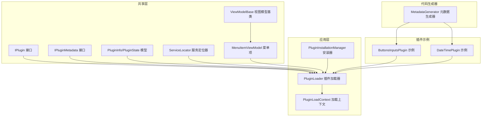
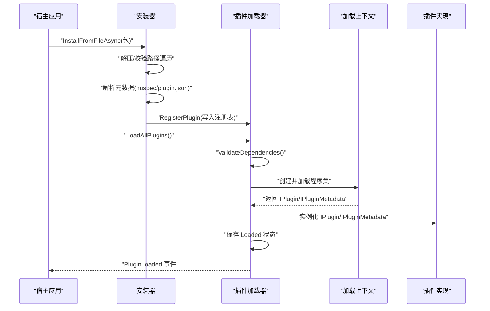
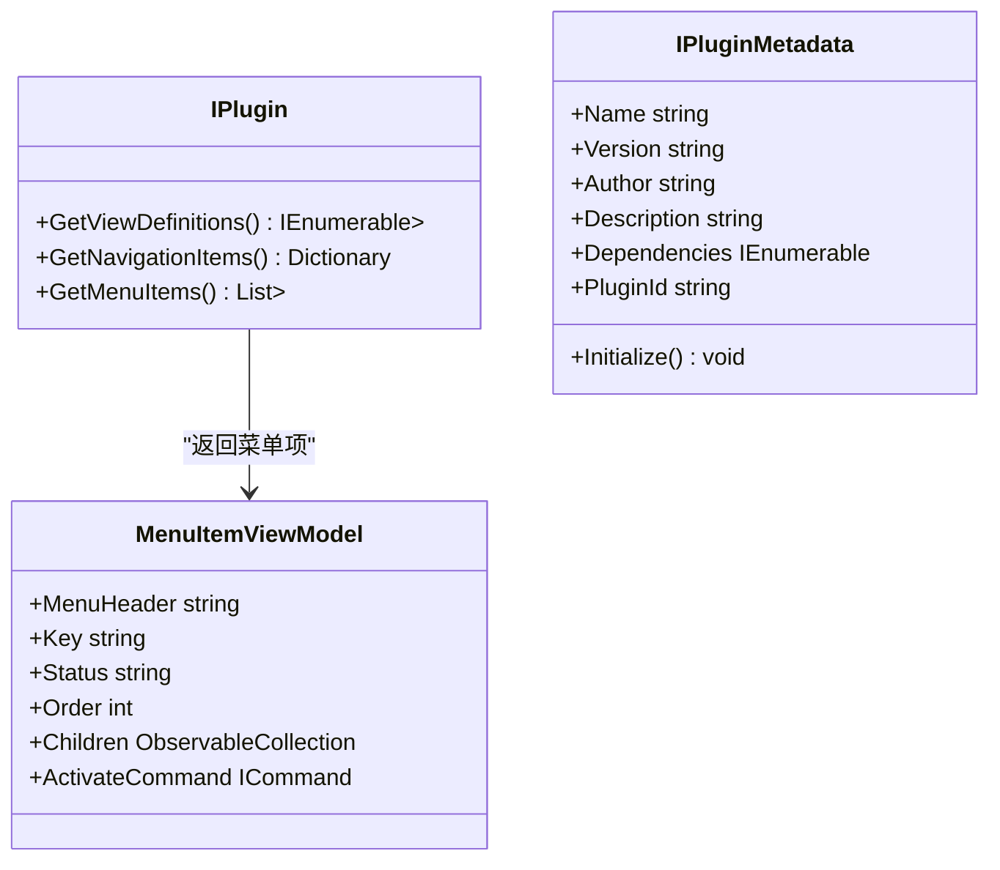
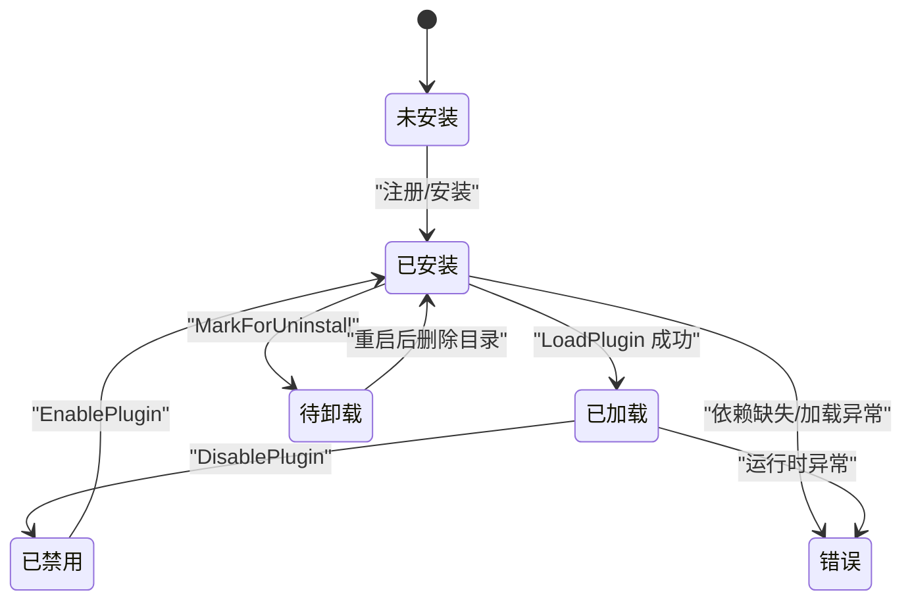
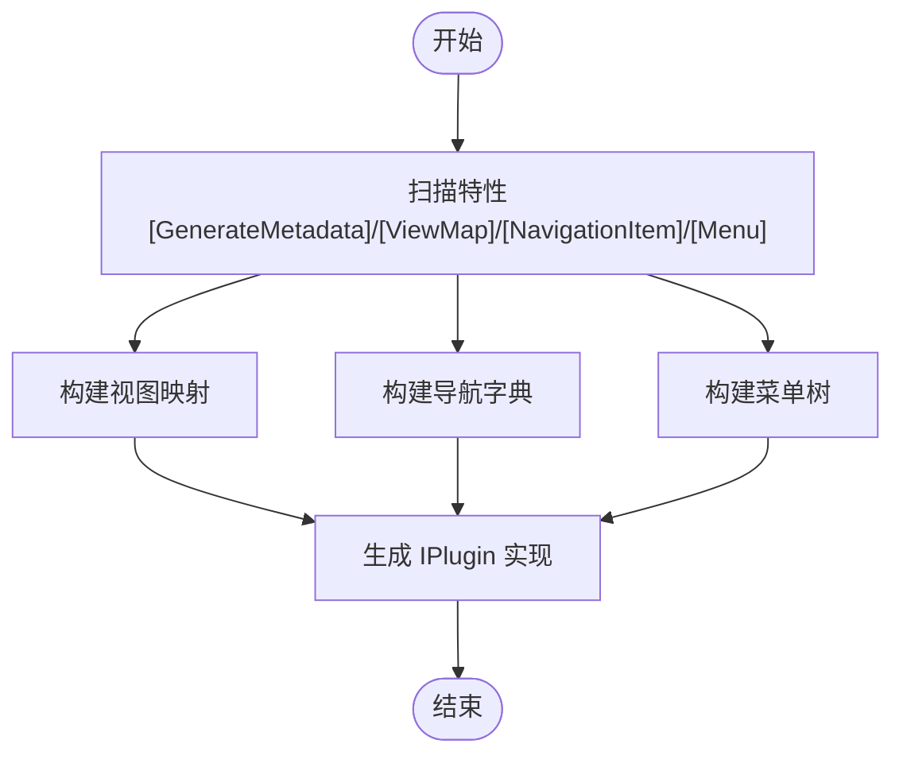
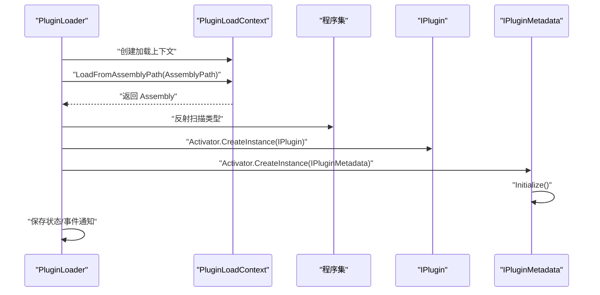
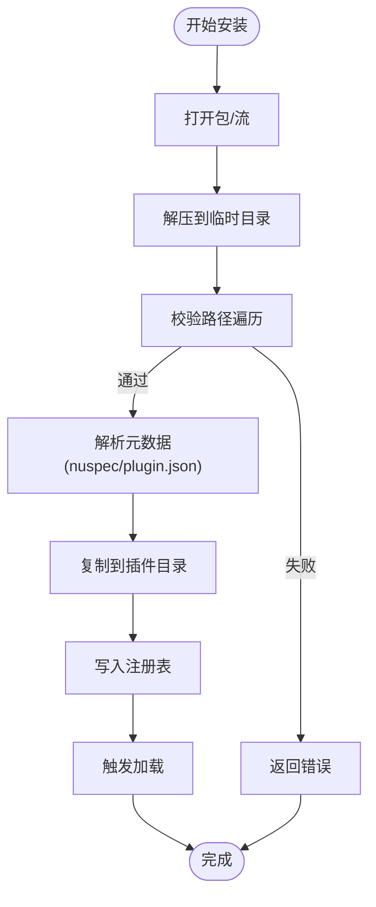
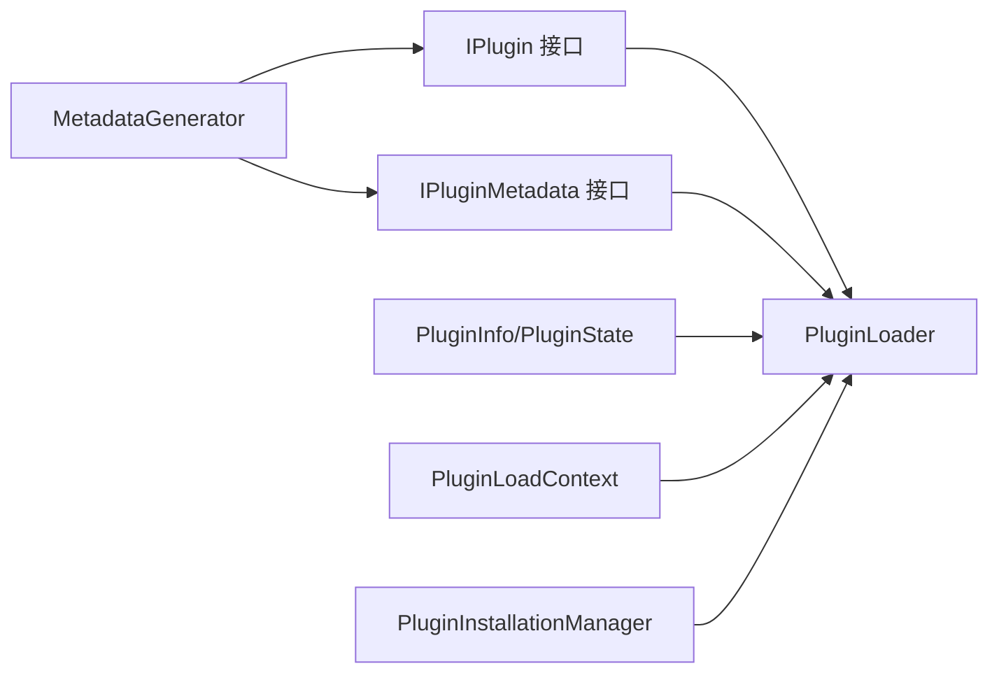

# 插件系统开发

<cite>
**本文引用的文件**
- [IPlugin.cs](file://src/Avalonia.Plugin.Shared/IPlugin.cs)
- [IPluginMetadata.cs](file://src/Avalonia.Plugin.Shared/IPluginMetadata.cs)
- [PluginInfo.cs](file://src/Avalonia.Plugin.Shared/Models/PluginInfo.cs)
- [PluginState.cs](file://src/Avalonia.Plugin.Shared/Models/PluginState.cs)
- [ServiceLocator.cs](file://src/Avalonia.Plugin.Shared/ServiceLocator.cs)
- [ViewModelBase.cs](file://src/Avalonia.Plugin.Shared/ViewModelBase.cs)
- [MenuItemViewModel.cs](file://src/Avalonia.Plugin.Shared/ViewModels/MenuItemViewModel.cs)
- [PluginLoader.cs](file://src/Avalonia.UI/Services/PluginLoader.cs)
- [PluginLoadContext.cs](file://src/Avalonia.UI/Services/PluginLoadContext.cs)
- [PluginInstallationManager.cs](file://src/Avalonia.UI/Services/PluginInstallationManager.cs)
- [MetadataGenerator.cs](file://src/Avalonia.Plugin.Generators/MetadataGenerator.cs)
- [ButtonsInputsPlugin.cs](file://plugins/Avalonia.Plugin.ButtonsInputs/ButtonsInputsPlugin.cs)
- [DateTimePlugin.cs](file://plugins/Avalonia.Plugin.DateTime/DateTimePlugin.cs)
</cite>

## 目录
1. [简介](#简介)
2. [项目结构](#项目结构)
3. [核心组件](#核心组件)
4. [架构总览](#架构总览)
5. [详细组件分析](#详细组件分析)
6. [依赖分析](#依赖分析)
7. [性能考虑](#性能考虑)
8. [故障排查指南](#故障排查指南)
9. [结论](#结论)
10. [附录](#附录)

## 简介
本指南面向使用 AvaloniaTemplate 的插件开发者，系统讲解插件接口设计、元数据与依赖注入支持、插件加载器工作原理、安装与卸载流程，以及从项目创建到部署发布的完整开发流程。文档同时提供最佳实践、常见陷阱与性能优化建议，并给出实用的开发与调试技巧。

## 项目结构
AvaloniaTemplate 将插件系统分为三层：
- 共享层（Avalonia.Plugin.Shared）：定义插件接口、元数据模型、服务定位器与通用视图模型。
- 应用层（Avalonia.UI）：实现插件加载、安装、卸载与加载上下文隔离。
- 插件示例（plugins/*）：提供具体插件实现与演示页面。
- 代码生成器（Avalonia.Plugin.Generators）：通过 Roslyn 生成插件的导航、菜单与视图映射代码。

图表来源
- [IPlugin.cs:9-26](file://src/Avalonia.Plugin.Shared/IPlugin.cs#L9-L26)
- [IPluginMetadata.cs:3-41](file://src/Avalonia.Plugin.Shared/IPluginMetadata.cs#L3-L41)
- [PluginInfo.cs:3-18](file://src/Avalonia.Plugin.Shared/Models/PluginInfo.cs#L3-L18)
- [PluginState.cs:3-11](file://src/Avalonia.Plugin.Shared/Models/PluginState.cs#L3-L11)
- [ServiceLocator.cs:5-63](file://src/Avalonia.Plugin.Shared/ServiceLocator.cs#L5-L63)
- [MenuItemViewModel.cs:15-39](file://src/Avalonia.Plugin.Shared/ViewModels/MenuItemViewModel.cs#L15-L39)
- [PluginLoader.cs:10-459](file://src/Avalonia.UI/Services/PluginLoader.cs#L10-L459)
- [PluginLoadContext.cs:6-106](file://src/Avalonia.UI/Services/PluginLoadContext.cs#L6-L106)
- [PluginInstallationManager.cs:10-260](file://src/Avalonia.UI/Services/PluginInstallationManager.cs#L10-L260)
- [MetadataGenerator.cs:8-245](file://src/Avalonia.Plugin.Generators/MetadataGenerator.cs#L8-L245)
- [ButtonsInputsPlugin.cs:6-24](file://plugins/Avalonia.Plugin.ButtonsInputs/ButtonsInputsPlugin.cs#L6-L24)
- [DateTimePlugin.cs:6-19](file://plugins/Avalonia.Plugin.DateTime/DateTimePlugin.cs#L6-L19)

章节来源
- [IPlugin.cs:9-26](file://src/Avalonia.Plugin.Shared/IPlugin.cs#L9-L26)
- [PluginLoader.cs:10-459](file://src/Avalonia.UI/Services/PluginLoader.cs#L10-L459)
- [PluginInstallationManager.cs:10-260](file://src/Avalonia.UI/Services/PluginInstallationManager.cs#L10-L260)

## 核心组件
- IPlugin：定义插件向宿主暴露的能力，包括视图与 ViewModel 的映射、导航项与菜单项。
- IPluginMetadata：定义插件元数据与初始化入口。
- PluginInfo/PluginState：记录插件的安装路径、程序集路径、状态、依赖等信息。
- ServiceLocator：提供全局服务定位能力，支持注册与获取服务。
- PluginLoader：负责插件发现、加载、卸载、启用/禁用、依赖校验与注册表持久化。
- PluginLoadContext：基于 AssemblyLoadContext 的可回收加载上下文，隔离插件依赖。
- PluginInstallationManager：负责从包安装/卸载插件，解析 nuspec/plugin.json 并写入注册表。
- MetadataGenerator：Roslyn 源生成器，扫描特性并生成 IPlugin 实现（视图映射、导航、菜单）。

章节来源
- [IPlugin.cs:9-26](file://src/Avalonia.Plugin.Shared/IPlugin.cs#L9-L26)
- [IPluginMetadata.cs:3-41](file://src/Avalonia.Plugin.Shared/IPluginMetadata.cs#L3-L41)
- [PluginInfo.cs:3-18](file://src/Avalonia.Plugin.Shared/Models/PluginInfo.cs#L3-L18)
- [PluginState.cs:3-11](file://src/Avalonia.Plugin.Shared/Models/PluginState.cs#L3-L11)
- [ServiceLocator.cs:5-63](file://src/Avalonia.Plugin.Shared/ServiceLocator.cs#L5-L63)
- [PluginLoader.cs:10-459](file://src/Avalonia.UI/Services/PluginLoader.cs#L10-L459)
- [PluginLoadContext.cs:6-106](file://src/Avalonia.UI/Services/PluginLoadContext.cs#L6-L106)
- [PluginInstallationManager.cs:10-260](file://src/Avalonia.UI/Services/PluginInstallationManager.cs#L10-L260)
- [MetadataGenerator.cs:8-245](file://src/Avalonia.Plugin.Generators/MetadataGenerator.cs#L8-L245)

## 架构总览
插件系统采用“接口契约 + 源生成 + 可回收加载上下文”的架构：
- 插件通过 IPlugin/IPluginMetadata 暴露能力与元数据。
- 使用 MetadataGenerator 自动扫描特性生成 IPlugin 实现，减少样板代码。
- PluginLoader 使用 PluginLoadContext 隔离加载，避免依赖污染。
- 注册表 plugin_registry.json 记录插件状态与依赖，支持启用/禁用/卸载。
- 安装器支持从 zip 包安装，解析 nuspec/plugin.json，写入注册表并触发加载。

图表来源
- [PluginInstallationManager.cs:29-151](file://src/Avalonia.UI/Services/PluginInstallationManager.cs#L29-L151)
- [PluginLoader.cs:53-156](file://src/Avalonia.UI/Services/PluginLoader.cs#L53-L156)
- [PluginLoadContext.cs:36-58](file://src/Avalonia.UI/Services/PluginLoadContext.cs#L36-L58)

## 详细组件分析

### IPlugin 接口与实现要求
- 视图与 ViewModel 映射：GetViewDefinitions 返回类型到视图工厂的映射，便于宿主按 VM 自动绑定视图。
- 导航项：GetNavigationItems 返回导航键到 ViewModel 工厂的字典，用于动态导航。
- 菜单项：GetMenuItems 返回菜单项列表，支持父子关系与排序，由生成器自动构建树形结构。
- 工厂委托：ViewModelFactory/ViewFactory 用于延迟实例化，降低启动成本。
- 工具栏项模型：ToolBarItemViewModel 系列用于扩展工具栏集成。

图表来源
- [IPlugin.cs:9-26](file://src/Avalonia.Plugin.Shared/IPlugin.cs#L9-L26)
- [IPluginMetadata.cs:3-41](file://src/Avalonia.Plugin.Shared/IPluginMetadata.cs#L3-L41)
- [MenuItemViewModel.cs:15-39](file://src/Avalonia.Plugin.Shared/ViewModels/MenuItemViewModel.cs#L15-L39)

章节来源
- [IPlugin.cs:9-26](file://src/Avalonia.Plugin.Shared/IPlugin.cs#L9-L26)
- [MenuItemViewModel.cs:15-39](file://src/Avalonia.Plugin.Shared/ViewModels/MenuItemViewModel.cs#L15-L39)

### 插件生命周期管理
- 状态机：NotInstalled → Installed → Loaded → Disabled → PendingUninstall → Error。
- 启停控制：EnablePlugin/DisablePlugin 切换状态；UnloadPlugin 卸载并释放上下文；MarkForUninstall 标记卸载并在重启后删除目录。
- 注册表：plugin_registry.json 持久化状态与错误信息；加载时修复 Loaded → Installed 的不一致。
- 事件：PluginLoaded/PluginUnloaded/PluginStateChanged 通知宿主状态变化。

图表来源
- [PluginState.cs:3-11](file://src/Avalonia.Plugin.Shared/Models/PluginState.cs#L3-L11)
- [PluginLoader.cs:183-222](file://src/Avalonia.UI/Services/PluginLoader.cs#L183-L222)
- [PluginLoader.cs:224-249](file://src/Avalonia.UI/Services/PluginLoader.cs#L224-L249)
- [PluginLoader.cs:407-431](file://src/Avalonia.UI/Services/PluginLoader.cs#L407-L431)

章节来源
- [PluginState.cs:3-11](file://src/Avalonia.Plugin.Shared/Models/PluginState.cs#L3-L11)
- [PluginLoader.cs:183-249](file://src/Avalonia.UI/Services/PluginLoader.cs#L183-L249)
- [PluginLoader.cs:407-431](file://src/Avalonia.UI/Services/PluginLoader.cs#L407-L431)

### 元数据管理与依赖注入支持
- 元数据接口：IPluginMetadata 提供 Name/Version/Author/Description/Dependencies/PluginId/Initialize。
- 依赖注入：通过 ServiceLocator.Initialize 设置 IServiceProvider，ServiceLocator.GetService/TryGetService 支持获取服务或抛出明确异常。
- 生成器：MetadataGenerator 扫描 [GenerateMetadata]/[ViewMap]/[NavigationItem]/[Menu] 特性，自动生成 IPlugin 实现，减少手写样板。

图表来源
- [MetadataGenerator.cs:12-130](file://src/Avalonia.Plugin.Generators/MetadataGenerator.cs#L12-L130)
- [MetadataGenerator.cs:201-245](file://src/Avalonia.Plugin.Generators/MetadataGenerator.cs#L201-L245)

章节来源
- [IPluginMetadata.cs:3-41](file://src/Avalonia.Plugin.Shared/IPluginMetadata.cs#L3-L41)
- [ServiceLocator.cs:5-63](file://src/Avalonia.Plugin.Shared/ServiceLocator.cs#L5-L63)
- [MetadataGenerator.cs:12-130](file://src/Avalonia.Plugin.Generators/MetadataGenerator.cs#L12-L130)

### 插件加载器工作原理
- 程序集加载：PluginLoadContext 使用 AssemblyDependencyResolver + 插件目录探测，优先加载插件自带依赖，排除宿主框架程序集。
- 实例化：反射扫描导出类型，分别实例化 IPlugin 与 IPluginMetadata（若存在），调用 Initialize。
- 错误处理：捕获加载异常，设置 Error 状态并持久化；依赖校验失败同样置错。
- 注册表：保存/读取 plugin_registry.json，支持额外插件路径环境变量。

图表来源
- [PluginLoader.cs:94-156](file://src/Avalonia.UI/Services/PluginLoader.cs#L94-L156)
- [PluginLoadContext.cs:36-58](file://src/Avalonia.UI/Services/PluginLoadContext.cs#L36-L58)

章节来源
- [PluginLoader.cs:94-156](file://src/Avalonia.UI/Services/PluginLoader.cs#L94-L156)
- [PluginLoadContext.cs:36-58](file://src/Avalonia.UI/Services/PluginLoadContext.cs#L36-L58)

### 插件安装与卸载流程
- 安装：支持从文件/流安装，校验路径遍历风险，解析 nuspec/plugin.json，复制文件到插件目录，写入注册表并触发加载。
- 卸载：标记待卸载，重启后删除插件目录并移除注册表项；内置插件不可卸载。
- 启用/禁用：切换状态并触发加载/卸载事件。

图表来源
- [PluginInstallationManager.cs:29-151](file://src/Avalonia.UI/Services/PluginInstallationManager.cs#L29-L151)

章节来源
- [PluginInstallationManager.cs:29-151](file://src/Avalonia.UI/Services/PluginInstallationManager.cs#L29-L151)

### 代码生成器与插件开发模板
- 生成目标：在插件项目中使用 [GenerateMetadata] 标注元数据类，配合 [ViewMap]/[NavigationItem]/[Menu] 特性，自动生成 IPlugin 实现。
- 菜单树构建：根据 ParentKey 自动补全虚拟根节点，构建父子关系并按 Order 排序输出顶级菜单。
- 示例插件：ButtonsInputsPlugin 与 DateTimePlugin 展示了元数据类的最小实现与可选的导航/菜单注释。

章节来源
- [MetadataGenerator.cs:12-130](file://src/Avalonia.Plugin.Generators/MetadataGenerator.cs#L12-L130)
- [ButtonsInputsPlugin.cs:6-24](file://plugins/Avalonia.Plugin.ButtonsInputs/ButtonsInputsPlugin.cs#L6-L24)
- [DateTimePlugin.cs:6-19](file://plugins/Avalonia.Plugin.DateTime/DateTimePlugin.cs#L6-L19)

## 依赖分析
- 组件耦合：PluginLoader 依赖 IPlugin/IPluginMetadata、PluginInfo/PluginState、PluginLoadContext；安装器依赖加载器与注册表。
- 外部依赖：System.Reflection、System.Runtime.Loader、System.Text.Json、Microsoft.CodeAnalysis（生成器）。
- 循环依赖：无直接循环；生成器仅在编译期参与，运行时不依赖生成结果。
- 接口契约：IPlugin/IPluginMetadata 为弱耦合点，宿主通过接口消费插件能力。

图表来源
- [PluginLoader.cs:10-459](file://src/Avalonia.UI/Services/PluginLoader.cs#L10-L459)
- [PluginInstallationManager.cs:10-260](file://src/Avalonia.UI/Services/PluginInstallationManager.cs#L10-L260)
- [MetadataGenerator.cs:8-245](file://src/Avalonia.Plugin.Generators/MetadataGenerator.cs#L8-L245)

章节来源
- [PluginLoader.cs:10-459](file://src/Avalonia.UI/Services/PluginLoader.cs#L10-L459)
- [PluginInstallationManager.cs:10-260](file://src/Avalonia.UI/Services/PluginInstallationManager.cs#L10-L260)
- [MetadataGenerator.cs:8-245](file://src/Avalonia.Plugin.Generators/MetadataGenerator.cs#L8-L245)

## 性能考虑
- 延迟实例化：通过工厂委托延迟创建 ViewModel/View，避免启动时的昂贵对象分配。
- 可回收加载上下文：使用 collectible AssemblyLoadContext，在卸载时释放内存，降低长期运行的内存压力。
- 依赖隔离：通过 PluginLoadContext 排除宿主框架程序集，减少不必要的依赖解析开销。
- 注册表持久化：批量序列化/反序列化，避免频繁 IO；仅在状态变更时保存。
- 菜单树构建：生成器在编译期完成，运行时仅执行查询与挂载，复杂度可控。

## 故障排查指南
- 插件未加载：检查 plugin_registry.json 中状态是否为 Error，查看 ErrorMessage；确认依赖已加载且版本匹配。
- 依赖缺失：ValidateDependencies 报错，检查 Dependencies 是否存在于注册表且状态为 Loaded。
- 程序集找不到：AssemblyPath 是否正确；确认 ExtraPlugin 环境变量指向的路径存在且可访问。
- 卸载失败：内置插件不可卸载；待卸载插件需等待重启后清理目录。
- 安装安全：路径遍历检测失败会拒绝安装，检查包内条目路径合法性。
- 服务未找到：ServiceLocator 未初始化或服务未注册，检查 Initialize 与注册逻辑。

章节来源
- [PluginLoader.cs:76-92](file://src/Avalonia.UI/Services/PluginLoader.cs#L76-L92)
- [PluginLoader.cs:353-372](file://src/Avalonia.UI/Services/PluginLoader.cs#L353-L372)
- [PluginInstallationManager.cs:62-78](file://src/Avalonia.UI/Services/PluginInstallationManager.cs#L62-L78)
- [ServiceLocator.cs:15-42](file://src/Avalonia.Plugin.Shared/ServiceLocator.cs#L15-L42)

## 结论
AvaloniaTemplate 的插件系统以清晰的接口契约、可回收的加载上下文与自动化的源生成为核心，提供了稳定、可扩展且易于维护的插件生态。遵循本文的开发流程与最佳实践，可高效构建高质量插件并平滑集成到宿主应用中。

## 附录

### 插件开发全流程（从创建到发布）
- 创建插件项目：新建类库，引用共享包与生成器包。
- 定义元数据类：使用 [GenerateMetadata] 标注，实现 IPluginMetadata。
- 标注特性：在 ViewModel 上使用 [ViewMap]、[NavigationItem]、[Menu]，生成 IPlugin 实现。
- 编写页面与 VM：按约定放置 Pages/ViewModels，确保命名与特性一致。
- 构建与测试：生成器在编译期注入 IPlugin 实现；运行时验证导航/菜单/视图映射。
- 打包发布：使用安装器将插件打包为 zip，包含 nuspec/plugin.json；或直接复制 DLL 至插件目录（结合 ExtraPlugin 环境变量）。

章节来源
- [MetadataGenerator.cs:12-130](file://src/Avalonia.Plugin.Generators/MetadataGenerator.cs#L12-L130)
- [PluginInstallationManager.cs:178-214](file://src/Avalonia.UI/Services/PluginInstallationManager.cs#L178-L214)

### 最佳实践
- 使用 [GenerateMetadata] 与特性标注，减少手写样板。
- 将重型初始化放入 IPluginMetadata.Initialize，避免在构造阶段阻塞。
- 导航键与菜单 Key 使用稳定字符串，避免硬编码。
- 依赖声明尽量精简，避免循环依赖。
- 使用工厂委托延迟实例化，提升启动性能。

### 常见陷阱
- 忘记初始化 ServiceLocator 导致服务获取失败。
- 在插件中直接引用宿主框架类型，导致加载上下文冲突。
- 路径遍历攻击：安装包必须经过安全校验。
- 未处理插件卸载后的残留目录。

### 调试技巧
- 启用 ExtraPlugin 环境变量指向插件目录，便于本地调试额外插件。
- 查看 plugin_registry.json 了解插件状态与错误信息。
- 使用事件订阅 PluginLoaded/PluginUnloaded/PluginStateChanged 追踪生命周期。
- 在生成器未生效时，检查编译日志与生成的 .g.cs 文件是否存在。