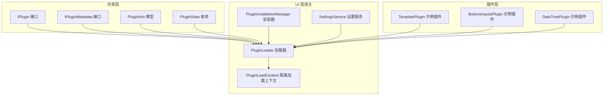
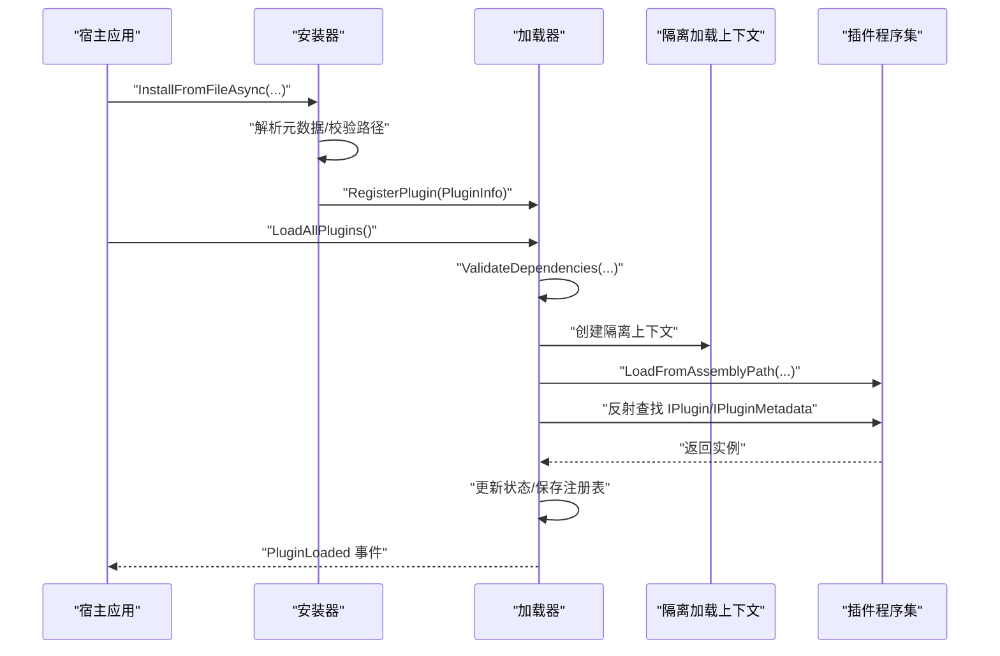
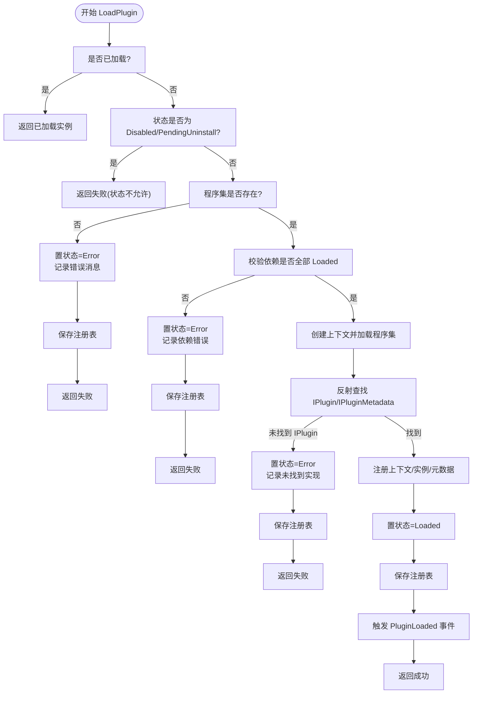
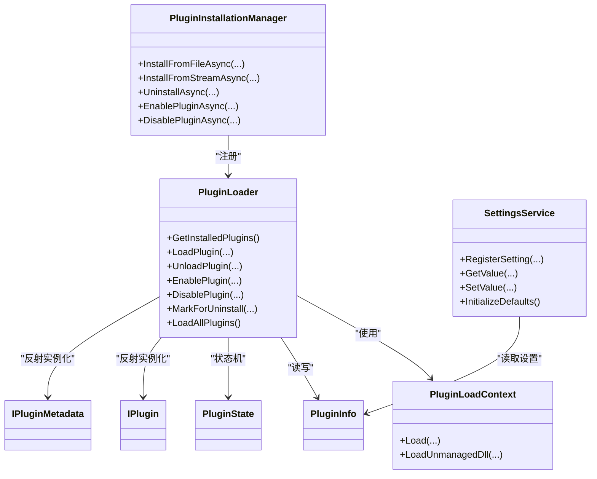

# 故障排除和调试

<cite>
**本文引用的文件**
- [IPlugin.cs](file://src/Avalonia.Plugin.Shared/IPlugin.cs)
- [IPluginMetadata.cs](file://src/Avalonia.Plugin.Shared/IPluginMetadata.cs)
- [PluginInfo.cs](file://src/Avalonia.Plugin.Shared/Models/PluginInfo.cs)
- [PluginState.cs](file://src/Avalonia.Plugin.Shared/Models/PluginState.cs)
- [PluginLoader.cs](file://src/Avalonia.UI/Services/PluginLoader.cs)
- [PluginInstallationManager.cs](file://src/Avalonia.UI/Services/PluginInstallationManager.cs)
- [PluginLoadContext.cs](file://src/Avalonia.UI/Services/PluginLoadContext.cs)
- [SettingsService.cs](file://src/Avalonia.UI/Services/SettingsService.cs)
- [TemplatePlugin.cs](file://plugins/Avalonia.Plugin.Template/TemplatePlugin.cs)
- [ButtonsInputsPlugin.cs](file://plugins/Avalonia.Plugin.ButtonsInputs/ButtonsInputsPlugin.cs)
- [DateTimePlugin.cs](file://plugins/Avalonia.Plugin.DateTime/DateTimePlugin.cs)
- [UiLoggerProvider.cs](file://plugins/Avalonia.Plugin.TDLSharp/Services/UiLoggerProvider.cs)
</cite>

## 目录
1. [简介](#简介)
2. [项目结构](#项目结构)
3. [核心组件](#核心组件)
4. [架构总览](#架构总览)
5. [详细组件分析](#详细组件分析)
6. [依赖分析](#依赖分析)
7. [性能考虑](#性能考虑)
8. [故障排除指南](#故障排除指南)
9. [结论](#结论)
10. [附录：标准化问题报告模板](#附录标准化问题报告模板)

## 简介
本指南面向使用 AvaloniaTemplate 插件系统的开发者与技术支持人员，聚焦于插件加载失败、服务初始化错误、平台兼容性问题等常见场景，提供系统化的调试方法、日志记录与错误跟踪策略、性能分析建议，并给出常见错误码的含义与修复建议，以及标准化的问题反馈模板。

## 项目结构
AvaloniaTemplate 采用多项目分层组织，核心围绕“共享接口层”“UI 层（宿主应用）”“平台适配层”“插件层”展开。插件系统通过独立的程序集加载上下文进行隔离，支持安装、卸载、启用/禁用、依赖校验与注册表持久化。

图表来源
- [IPlugin.cs:9-26](file://src/Avalonia.Plugin.Shared/IPlugin.cs#L9-L26)
- [IPluginMetadata.cs:3-41](file://src/Avalonia.Plugin.Shared/IPluginMetadata.cs#L3-L41)
- [PluginInfo.cs:3-18](file://src/Avalonia.Plugin.Shared/Models/PluginInfo.cs#L3-L18)
- [PluginState.cs:3-11](file://src/Avalonia.Plugin.Shared/Models/PluginState.cs#L3-L11)
- [PluginLoader.cs:10-35](file://src/Avalonia.UI/Services/PluginLoader.cs#L10-L35)
- [PluginInstallationManager.cs:10-23](file://src/Avalonia.UI/Services/PluginInstallationManager.cs#L10-L23)
- [PluginLoadContext.cs:6-34](file://src/Avalonia.UI/Services/PluginLoadContext.cs#L6-L34)
- [SettingsService.cs:8-15](file://src/Avalonia.UI/Services/SettingsService.cs#L8-L15)
- [TemplatePlugin.cs:6-18](file://plugins/Avalonia.Plugin.Template/TemplatePlugin.cs#L6-L18)
- [ButtonsInputsPlugin.cs:6-23](file://plugins/Avalonia.Plugin.ButtonsInputs/ButtonsInputsPlugin.cs#L6-L23)
- [DateTimePlugin.cs:6-18](file://plugins/Avalonia.Plugin.DateTime/DateTimePlugin.cs#L6-L18)

章节来源
- [IPlugin.cs:9-26](file://src/Avalonia.Plugin.Shared/IPlugin.cs#L9-L26)
- [IPluginMetadata.cs:3-41](file://src/Avalonia.Plugin.Shared/IPluginMetadata.cs#L3-L41)
- [PluginInfo.cs:3-18](file://src/Avalonia.Plugin.Shared/Models/PluginInfo.cs#L3-L18)
- [PluginState.cs:3-11](file://src/Avalonia.Plugin.Shared/Models/PluginState.cs#L3-L11)
- [PluginLoader.cs:10-35](file://src/Avalonia.UI/Services/PluginLoader.cs#L10-L35)
- [PluginInstallationManager.cs:10-23](file://src/Avalonia.UI/Services/PluginInstallationManager.cs#L10-L23)
- [PluginLoadContext.cs:6-34](file://src/Avalonia.UI/Services/PluginLoadContext.cs#L6-L34)
- [SettingsService.cs:8-15](file://src/Avalonia.UI/Services/SettingsService.cs#L8-L15)
- [TemplatePlugin.cs:6-18](file://plugins/Avalonia.Plugin.Template/TemplatePlugin.cs#L6-L18)
- [ButtonsInputsPlugin.cs:6-23](file://plugins/Avalonia.Plugin.ButtonsInputs/ButtonsInputsPlugin.cs#L6-L23)
- [DateTimePlugin.cs:6-18](file://plugins/Avalonia.Plugin.DateTime/DateTimePlugin.cs#L6-L18)

## 核心组件
- 插件接口与元数据
  - IPlugin：定义插件提供的视图-视图模型映射、导航项、菜单项等能力。
  - IPluginMetadata：定义插件元数据与初始化入口。
- 插件信息与状态
  - PluginInfo：记录插件标识、版本、依赖、安装路径、当前状态等。
  - PluginState：NotInstalled → Installed → Loaded → Disabled → PendingUninstall → Error。
- 加载与安装
  - PluginLoader：负责扫描、注册、加载、卸载、启用/禁用插件，维护注册表与事件。
  - PluginInstallationManager：负责从包安装/卸载插件，解析元数据（nuspec/plugin.json/dll），安全解压与复制。
  - PluginLoadContext：基于 AssemblyLoadContext 的隔离加载，控制依赖解析与卸载。
- 设置服务
  - SettingsService：基于 EF Core 的设置注册、读取、写入与默认值初始化。

章节来源
- [IPlugin.cs:9-26](file://src/Avalonia.Plugin.Shared/IPlugin.cs#L9-L26)
- [IPluginMetadata.cs:3-41](file://src/Avalonia.Plugin.Shared/IPluginMetadata.cs#L3-L41)
- [PluginInfo.cs:3-18](file://src/Avalonia.Plugin.Shared/Models/PluginInfo.cs#L3-L18)
- [PluginState.cs:3-11](file://src/Avalonia.Plugin.Shared/Models/PluginState.cs#L3-L11)
- [PluginLoader.cs:10-35](file://src/Avalonia.UI/Services/PluginLoader.cs#L10-L35)
- [PluginInstallationManager.cs:10-23](file://src/Avalonia.UI/Services/PluginInstallationManager.cs#L10-L23)
- [PluginLoadContext.cs:6-34](file://src/Avalonia.UI/Services/PluginLoadContext.cs#L6-L34)
- [SettingsService.cs:8-15](file://src/Avalonia.UI/Services/SettingsService.cs#L8-L15)

## 架构总览
下图展示插件系统在启动时的关键流程：安装器解析包并注册到加载器；加载器根据状态与依赖决定是否加载；加载成功后触发事件并持久化状态；插件通过元数据暴露能力。

图表来源
- [PluginInstallationManager.cs:29-151](file://src/Avalonia.UI/Services/PluginInstallationManager.cs#L29-L151)
- [PluginLoader.cs:53-156](file://src/Avalonia.UI/Services/PluginLoader.cs#L53-L156)
- [PluginLoadContext.cs:36-58](file://src/Avalonia.UI/Services/PluginLoadContext.cs#L36-L58)

## 详细组件分析

### 组件一：插件加载器（PluginLoader）
职责与行为
- 注册表管理：读取/保存 plugin_registry.json，记录插件状态与错误信息。
- 加载控制：按状态与依赖校验决定加载/跳过；异常捕获并置为 Error。
- 隔离加载：使用 PluginLoadContext 进行 collectible 加载上下文，支持卸载。
- 扩展插件：支持通过环境变量指定额外插件目录，动态加载 *.dll。

常见问题与定位
- 状态为 Error 且包含“Assembly not found”：检查 AssemblyPath 是否存在或权限。
- 状态为 Error 且包含“Dependency not loaded”：确认被依赖插件已安装并处于 Loaded。
- 重复加载：若已加载则直接返回已加载实例，避免二次初始化。
- 卸载与禁用：卸载会释放上下文并回滚状态；禁用仅标记状态，不删除文件。

图表来源
- [PluginLoader.cs:53-156](file://src/Avalonia.UI/Services/PluginLoader.cs#L53-L156)
- [PluginState.cs:3-11](file://src/Avalonia.Plugin.Shared/Models/PluginState.cs#L3-L11)

章节来源
- [PluginLoader.cs:53-156](file://src/Avalonia.UI/Services/PluginLoader.cs#L53-L156)
- [PluginState.cs:3-11](file://src/Avalonia.Plugin.Shared/Models/PluginState.cs#L3-L11)

### 组件二：插件安装器（PluginInstallationManager）
职责与行为
- 安全解包：ZipArchive 解压，严格路径校验防止路径穿越。
- 元数据解析：优先 nuspec，其次 plugin.json，最后回退到程序集信息。
- 安装复制：目标目录不存在则创建，逐文件复制并校验相对路径。
- 注册与事件：注册到加载器并触发安装完成事件。

常见问题与定位
- “Security: Path traversal detected”：包内条目路径越界，检查压缩包内容与签名。
- “Invalid plugin package: no valid metadata found”：缺少 nuspec/plugin.json 或无法解析。
- 安装后未出现在已安装列表：确认安装目录与注册表一致，检查保存注册表是否成功。

章节来源
- [PluginInstallationManager.cs:29-151](file://src/Avalonia.UI/Services/PluginInstallationManager.cs#L29-L151)

### 组件三：隔离加载上下文（PluginLoadContext）
职责与行为
- 依赖解析：优先使用 Resolver 解析，否则在插件目录探测匹配程序集。
- 平台隔离：对 System.*、Microsoft.*、Avalonia.* 等保留使用默认上下文，避免污染宿主。
- 可回收：支持卸载，释放内存与句柄。

常见问题与定位
- 依赖找不到：确认插件目录包含所需 *.dll，且名称与版本匹配。
- 与宿主冲突：若出现类型冲突，检查是否误将宿主框架程序集纳入插件目录。

章节来源
- [PluginLoadContext.cs:36-94](file://src/Avalonia.UI/Services/PluginLoadContext.cs#L36-L94)

### 组件四：设置服务（SettingsService）
职责与行为
- 设置注册：首次注册时写入默认值，后续更新显示名/分组/顺序等。
- 值读写：按 Key 读取/写入，支持泛型转换。
- 默认项：内置若干应用级设置项，便于新用户快速上手。

常见问题与定位
- 设置未生效：确认已调用 RegisterSetting 或 InitializeDefaults，数据库已迁移。
- 读取为空：确认 Key 正确且已存在，或先注册再读取。

章节来源
- [SettingsService.cs:17-135](file://src/Avalonia.UI/Services/SettingsService.cs#L17-L135)

### 组件五：示例插件（TemplatePlugin/ButtonsInputsPlugin/DateTimePlugin）
职责与行为
- 作为最小可用插件示例，展示如何标注元数据、声明依赖与 ID。
- 可用于验证插件系统是否正常工作（加载、事件、状态变更）。

常见问题与定位
- 插件未显示：确认插件已安装并处于 Loaded，且元数据 Initialize 成功。
- 导航/菜单未出现：检查插件是否实现相应接口方法并返回有效数据。

章节来源
- [TemplatePlugin.cs:6-18](file://plugins/Avalonia.Plugin.Template/TemplatePlugin.cs#L6-L18)
- [ButtonsInputsPlugin.cs:6-23](file://plugins/Avalonia.Plugin.ButtonsInputs/ButtonsInputsPlugin.cs#L6-L23)
- [DateTimePlugin.cs:6-18](file://plugins/Avalonia.Plugin.DateTime/DateTimePlugin.cs#L6-L18)

## 依赖分析
- 组件耦合
  - PluginLoader 依赖 PluginLoadContext、PluginInfo、PluginState、事件与注册表文件。
  - PluginInstallationManager 依赖 PluginLoader 以注册新安装的插件。
  - 插件程序集依赖 IPlugin/IPluginMetadata 接口，由共享层提供。
- 外部依赖
  - .NET 反射与 AssemblyLoadContext。
  - JSON 序列化用于注册表持久化。
  - EF Core 用于设置存储（SettingsService）。

图表来源
- [PluginLoader.cs:10-35](file://src/Avalonia.UI/Services/PluginLoader.cs#L10-L35)
- [PluginInstallationManager.cs:10-23](file://src/Avalonia.UI/Services/PluginInstallationManager.cs#L10-L23)
- [PluginLoadContext.cs:6-34](file://src/Avalonia.UI/Services/PluginLoadContext.cs#L6-L34)
- [SettingsService.cs:8-15](file://src/Avalonia.UI/Services/SettingsService.cs#L8-L15)
- [IPlugin.cs:9-26](file://src/Avalonia.Plugin.Shared/IPlugin.cs#L9-L26)
- [IPluginMetadata.cs:3-41](file://src/Avalonia.Plugin.Shared/IPluginMetadata.cs#L3-L41)
- [PluginInfo.cs:3-18](file://src/Avalonia.Plugin.Shared/Models/PluginInfo.cs#L3-L18)
- [PluginState.cs:3-11](file://src/Avalonia.Plugin.Shared/Models/PluginState.cs#L3-L11)

## 性能考虑
- 加载上下文回收：使用 collectible 上下文并在卸载时释放，避免内存泄漏。
- 依赖解析优化：优先使用 Resolver，减少插件目录扫描次数。
- 注册表持久化：批量写入，避免频繁 IO；异常时记录但不影响主流程。
- 安装过程进度：提供进度回调，改善用户体验。
- 设置访问：按需查询，避免一次性拉取大量设置项。

## 故障排除指南

### 一、插件加载失败
常见症状
- 插件状态停留在 Installed 或 Error。
- 无任何 UI/菜单变化。
- 控制台或日志出现错误消息。

排查步骤
1. 检查插件状态与错误消息
   - 使用加载器的 GetPlugin 获取 PluginInfo，查看 State 与 ErrorMessage。
   - 关注“Assembly not found”“Dependency not loaded”“No IPlugin implementation found”等提示。
2. 校验程序集与依赖
   - 确认 AssemblyPath 存在且可读。
   - 检查 Dependencies 列表中的插件是否均已安装且处于 Loaded。
3. 验证插件实现
   - 确保程序集中存在实现 IPlugin 的类型，且 IPluginMetadata 实现存在。
   - 确认 IPluginMetadata.Initialize 调用成功。
4. 清理与重试
   - 尝试 Disable/Unload 再 Enable/Load，或重启宿主应用。
   - 如为扩展插件，检查额外插件目录环境变量与权限。

相关实现参考
- [PluginLoader.cs:53-156](file://src/Avalonia.UI/Services/PluginLoader.cs#L53-L156)
- [PluginState.cs:3-11](file://src/Avalonia.Plugin.Shared/Models/PluginState.cs#L3-L11)

### 二、服务初始化错误
常见症状
- 启动即报错，或功能模块不可用。
- 设置读取为空或异常。

排查步骤
1. 设置服务
   - 确认数据库上下文工厂可用，EF Core 迁移已完成。
   - 检查 InitializeDefaults 是否执行，必要时手动注册缺失设置。
2. 安装器
   - 若安装过程中出现“路径穿越”或“无效元数据”，修正包内容或重新打包。
3. 日志与事件
   - 订阅加载器的 PluginStateChanged/PluginLoaded 事件，观察状态变化。
   - 在插件 Initialize 中添加日志输出，确认执行路径。

相关实现参考
- [SettingsService.cs:17-135](file://src/Avalonia.UI/Services/SettingsService.cs#L17-L135)
- [PluginInstallationManager.cs:29-151](file://src/Avalonia.UI/Services/PluginInstallationManager.cs#L29-L151)
- [PluginLoader.cs:23-25](file://src/Avalonia.UI/Services/PluginLoader.cs#L23-L25)

### 三、平台兼容性问题
常见症状
- Linux/MacOS/Windows 下行为不一致。
- 某些平台无法弹出通知或定位服务不可用。

排查步骤
1. 平台服务
   - 检查平台服务实现是否正确注册与注入。
   - 确认平台特定的依赖（如 Windows 的原生方法、Linux 的桌面通知代理）可用。
2. 加载上下文
   - 确保隔离加载上下文未强制加载宿主框架程序集，避免版本冲突。
3. 文件权限与路径
   - 确认插件目录与注册表文件具有读写权限。

相关实现参考
- [PluginLoadContext.cs:36-94](file://src/Avalonia.UI/Services/PluginLoadContext.cs#L36-L94)

### 四、日志记录与错误跟踪
- 插件内部日志
  - 在插件 Initialize 或业务逻辑中使用日志框架输出关键信息。
  - 可参考 TDLSharp 插件的日志提供器，统一级别与消息格式。
- 宿主侧日志
  - 订阅加载器事件，记录状态变更与错误消息。
  - 对安装器的安装/卸载过程增加进度与错误输出。

相关实现参考
- [UiLoggerProvider.cs:42-62](file://plugins/Avalonia.Plugin.TDLSharp/Services/UiLoggerProvider.cs#L42-L62)
- [PluginLoader.cs:23-25](file://src/Avalonia.UI/Services/PluginLoader.cs#L23-L25)
- [PluginInstallationManager.cs:140-151](file://src/Avalonia.UI/Services/PluginInstallationManager.cs#L140-L151)

### 五、性能分析建议
- 加载耗时
  - 使用计时器测量 LoadPlugin 的耗时，关注依赖解析与反射查找阶段。
- 内存占用
  - 卸载插件后确认上下文已释放，避免内存泄漏。
- 安装吞吐
  - 对大体积包的解压与复制阶段增加进度回调，提升可观测性。

### 六、常见错误码与含义
- 状态枚举（PluginState）
  - NotInstalled：未安装。
  - Installed：已安装，等待加载。
  - Loaded：已成功加载。
  - Disabled：已禁用。
  - PendingUninstall：标记卸载，待清理。
  - Error：加载失败，包含具体错误消息。
- 错误消息示例
  - “Assembly not found: ...”：程序集路径无效或权限不足。
  - “Dependency not loaded: ...”：依赖插件未满足加载条件。
  - “No IPlugin implementation found in assembly”：程序集未导出符合接口的类型。
  - “Security: Path traversal detected”：安装包存在路径穿越风险。

章节来源
- [PluginState.cs:3-11](file://src/Avalonia.Plugin.Shared/Models/PluginState.cs#L3-L11)
- [PluginLoader.cs:76-128](file://src/Avalonia.UI/Services/PluginLoader.cs#L76-L128)
- [PluginInstallationManager.cs:64-117](file://src/Avalonia.UI/Services/PluginInstallationManager.cs#L64-L117)

## 结论
AvaloniaTemplate 的插件系统通过清晰的接口、严格的依赖校验与隔离加载机制，提供了可靠的扩展能力。遇到问题时，建议从“状态与错误消息”入手，结合“依赖与程序集路径”“平台服务可用性”“日志与事件”进行系统化排查，并利用注册表与事件流进行回溯分析。对于高频问题，可沉淀为自动化检测脚本与诊断工具，进一步提升运维效率。

## 附录：标准化问题报告模板
请在提交问题时附带以下信息，以便快速定位与修复：

- 基本信息
  - 操作系统与版本
  - .NET 版本
  - AvaloniaTemplate 版本
  - 插件名称与版本
- 复现步骤
  - 期望行为
  - 实际行为
  - 最小可复现操作序列
- 日志与截图
  - 控制台输出（含异常堆栈）
  - 插件状态与错误消息（可通过加载器获取）
  - 相关 UI 截图
- 环境信息
  - 插件安装目录与权限
  - 额外插件目录环境变量（如有）
  - 是否使用自定义设置或覆盖默认值
- 附加信息
  - 是否在不同平台出现差异
  - 是否与特定依赖版本相关
  - 曾尝试过的修复措施