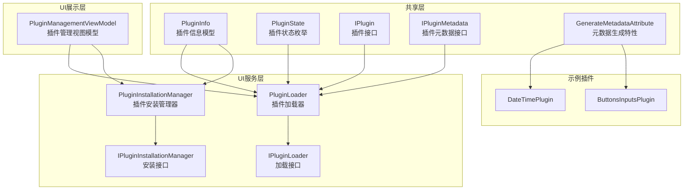
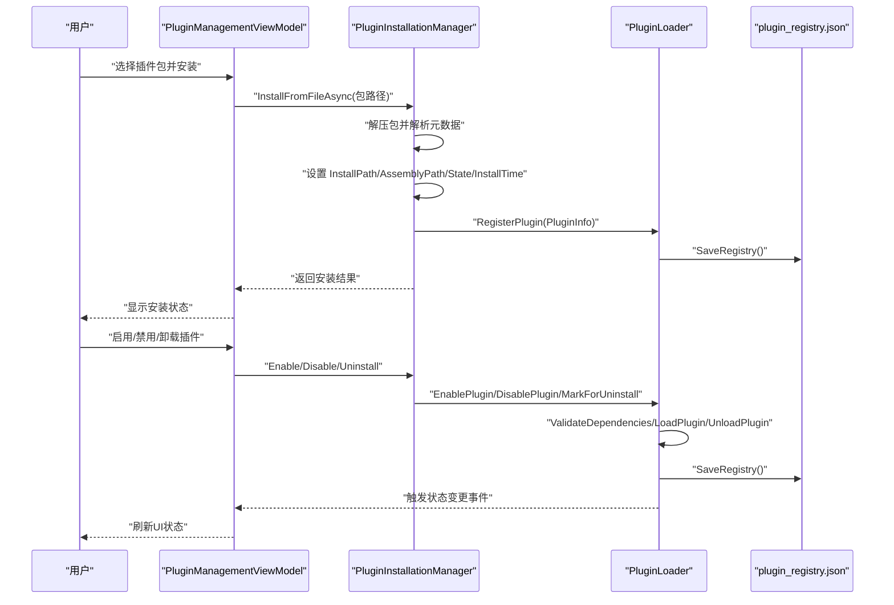
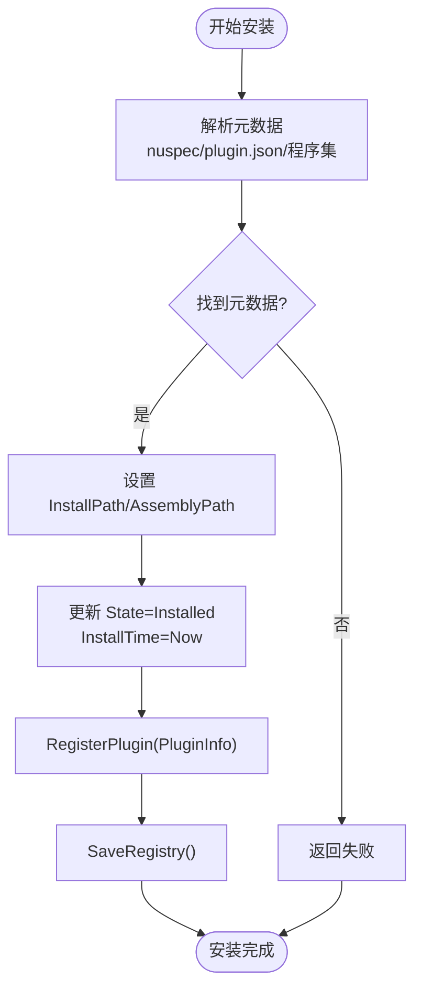
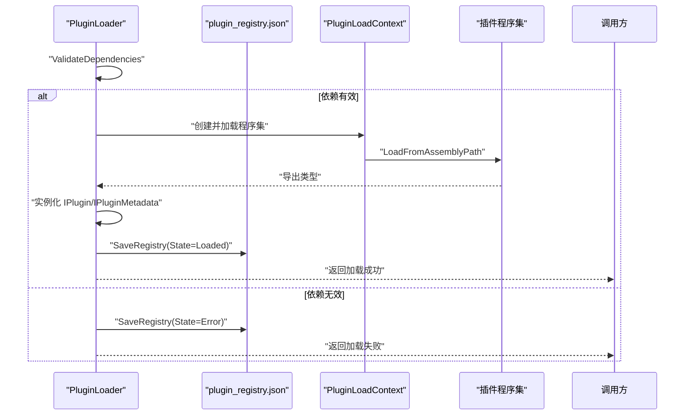
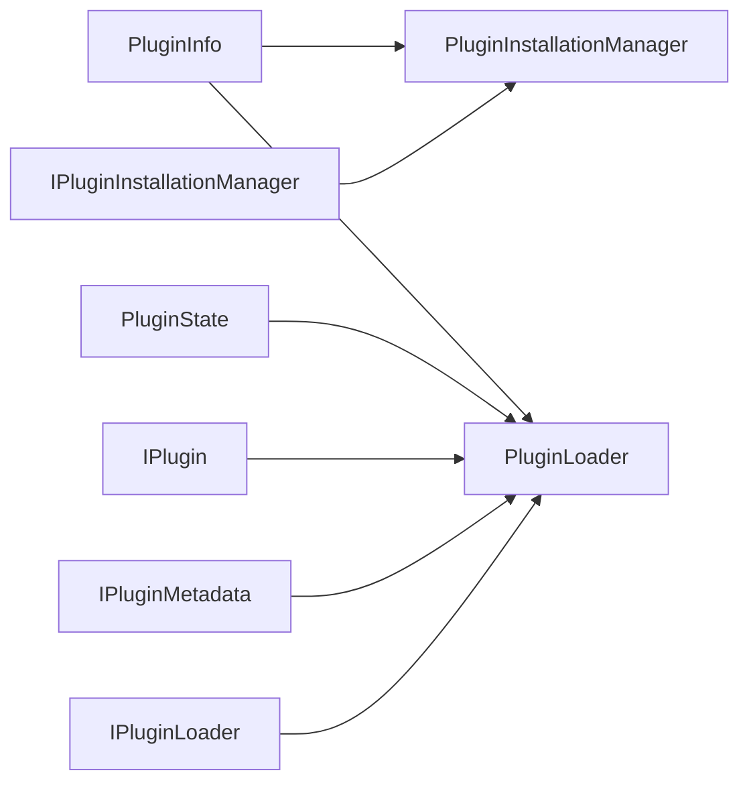

# 插件信息模型

<cite>
**本文档引用的文件**
- [PluginInfo.cs](file://src/Avalonia.Plugin.Shared/Models/PluginInfo.cs)
- [PluginState.cs](file://src/Avalonia.Plugin.Shared/Models/PluginState.cs)
- [IPlugin.cs](file://src/Avalonia.Plugin.Shared/IPlugin.cs)
- [IPluginMetadata.cs](file://src/Avalonia.Plugin.Shared/IPluginMetadata.cs)
- [PluginInstallationManager.cs](file://src/Avalonia.UI/Services/PluginInstallationManager.cs)
- [PluginLoader.cs](file://src/Avalonia.UI/Services/PluginLoader.cs)
- [IPluginInstallationManager.cs](file://src/Avalonia.Plugin.Shared/Services/IPluginInstallationManager.cs)
- [IPluginLoader.cs](file://src/Avalonia.Plugin.Shared/Services/IPluginLoader.cs)
- [PluginManagementViewModel.cs](file://src/Avalonia.UI/ViewModels/PluginManagementViewModel.cs)
- [GenerateMetadataAttribute.cs](file://src/Avalonia.Plugin.Shared/Attributes/GenerateMetadataAttribute.cs)
- [ButtonsInputsPlugin.cs](file://plugins/Avalonia.Plugin.ButtonsInputs/ButtonsInputsPlugin.cs)
- [DateTimePlugin.cs](file://plugins/Avalonia.Plugin.DateTime/DateTimePlugin.cs)
</cite>

## 目录
1. [简介](#简介)
2. [项目结构](#项目结构)
3. [核心组件](#核心组件)
4. [架构总览](#架构总览)
5. [详细组件分析](#详细组件分析)
6. [依赖关系分析](#依赖关系分析)
7. [性能考虑](#性能考虑)
8. [故障排除指南](#故障排除指南)
9. [结论](#结论)
10. [附录](#附录)

## 简介
本文件围绕插件系统中的“插件信息模型”进行深入解析，重点阐述 PluginInfo 类的设计目的、核心属性、技术属性及其在插件生命周期中的作用；同时结合 PluginState 枚举、安装管理器与加载器的工作流程，说明插件状态变更、错误处理、安装时间记录等机制，并给出创建、更新与查询插件信息的实践建议与交互关系。

## 项目结构
插件信息模型位于共享库中，作为跨模块的数据载体，配合安装管理器与加载器完成插件的安装、加载、卸载与状态管理。UI 层通过视图模型展示插件信息并提供用户操作入口。

图表来源
- [PluginInfo.cs:1-19](file://src/Avalonia.Plugin.Shared/Models/PluginInfo.cs#L1-L19)
- [PluginState.cs:1-12](file://src/Avalonia.Plugin.Shared/Models/PluginState.cs#L1-L12)
- [IPlugin.cs:1-81](file://src/Avalonia.Plugin.Shared/IPlugin.cs#L1-L81)
- [IPluginMetadata.cs:1-44](file://src/Avalonia.Plugin.Shared/IPluginMetadata.cs#L1-L44)
- [PluginInstallationManager.cs:1-261](file://src/Avalonia.UI/Services/PluginInstallationManager.cs#L1-L261)
- [PluginLoader.cs:1-460](file://src/Avalonia.UI/Services/PluginLoader.cs#L1-L460)
- [IPluginInstallationManager.cs:1-24](file://src/Avalonia.Plugin.Shared/Services/IPluginInstallationManager.cs#L1-L24)
- [IPluginLoader.cs:1-26](file://src/Avalonia.Plugin.Shared/Services/IPluginLoader.cs#L1-L26)
- [PluginManagementViewModel.cs:1-208](file://src/Avalonia.UI/ViewModels/PluginManagementViewModel.cs#L1-L208)
- [GenerateMetadataAttribute.cs:1-4](file://src/Avalonia.Plugin.Shared/Attributes/GenerateMetadataAttribute.cs#L1-L4)
- [ButtonsInputsPlugin.cs:1-100](file://plugins/Avalonia.Plugin.ButtonsInputs/ButtonsInputsPlugin.cs#L1-L100)
- [DateTimePlugin.cs:1-20](file://plugins/Avalonia.Plugin.DateTime/DateTimePlugin.cs#L1-L20)

章节来源
- [PluginInfo.cs:1-19](file://src/Avalonia.Plugin.Shared/Models/PluginInfo.cs#L1-L19)
- [PluginState.cs:1-12](file://src/Avalonia.Plugin.Shared/Models/PluginState.cs#L1-L12)
- [PluginInstallationManager.cs:1-261](file://src/Avalonia.UI/Services/PluginInstallationManager.cs#L1-L261)
- [PluginLoader.cs:1-460](file://src/Avalonia.UI/Services/PluginLoader.cs#L1-L460)
- [PluginManagementViewModel.cs:1-208](file://src/Avalonia.UI/ViewModels/PluginManagementViewModel.cs#L1-L208)

## 核心组件
- PluginInfo：承载插件的标识、名称、版本、作者、描述、依赖、安装路径、程序集路径、状态、错误信息、安装时间、是否内置、是否有元数据等信息。
- PluginState：定义插件生命周期状态集合，用于驱动安装、加载、禁用、卸载与错误处理。
- IPlugin 与 IPluginMetadata：定义插件能力边界与元数据接口，加载器通过反射发现并实例化具体实现。
- PluginInstallationManager：负责从包文件或流安装插件，解析元数据，设置安装路径与程序集路径，更新状态与安装时间。
- PluginLoader：负责注册、加载、卸载插件，维护状态机与依赖校验，持久化注册表。
- PluginManagementViewModel：UI 层的管理视图模型，绑定插件列表与操作命令，订阅安装与状态事件。

章节来源
- [PluginInfo.cs:1-19](file://src/Avalonia.Plugin.Shared/Models/PluginInfo.cs#L1-L19)
- [PluginState.cs:1-12](file://src/Avalonia.Plugin.Shared/Models/PluginState.cs#L1-L12)
- [IPlugin.cs:1-81](file://src/Avalonia.Plugin.Shared/IPlugin.cs#L1-L81)
- [IPluginMetadata.cs:1-44](file://src/Avalonia.Plugin.Shared/IPluginMetadata.cs#L1-L44)
- [PluginInstallationManager.cs:1-261](file://src/Avalonia.UI/Services/PluginInstallationManager.cs#L1-L261)
- [PluginLoader.cs:1-460](file://src/Avalonia.UI/Services/PluginLoader.cs#L1-L460)
- [PluginManagementViewModel.cs:1-208](file://src/Avalonia.UI/ViewModels/PluginManagementViewModel.cs#L1-L208)

## 架构总览
下图展示了插件信息在安装与加载过程中的流转与更新：

图表来源
- [PluginManagementViewModel.cs:1-208](file://src/Avalonia.UI/ViewModels/PluginManagementViewModel.cs#L1-L208)
- [PluginInstallationManager.cs:1-261](file://src/Avalonia.UI/Services/PluginInstallationManager.cs#L1-L261)
- [PluginLoader.cs:1-460](file://src/Avalonia.UI/Services/PluginLoader.cs#L1-L460)

## 详细组件分析

### PluginInfo 类设计与属性详解
- 设计目的
  - 作为插件生命周期的统一数据载体，贯穿安装、注册、加载、状态变更与卸载全过程。
  - 提供插件元数据与运行时信息，便于 UI 展示与业务逻辑判断。
- 基本信息字段
  - 插件标识符：用于唯一识别插件，支持依赖解析与注册表索引。
  - 名称、版本、作者、描述：用于 UI 展示与用户决策。
- 技术属性
  - 依赖关系列表：用于加载前的依赖校验，确保按序加载。
  - 安装路径：插件目录位置，卸载时用于删除。
  - 程序集路径：主程序集路径，加载器据此反射加载。
- 状态与错误
  - 状态：由 PluginState 枚举控制，驱动加载器的状态机。
  - 错误消息：当加载失败或依赖缺失时记录错误原因。
  - 安装时间：记录安装完成的时间点，便于审计与排序。
- 其他标志位
  - 是否内置：用于限制卸载与禁用操作。
  - 是否有元数据：用于 UI 过滤仅展示具备元数据的插件。

章节来源
- [PluginInfo.cs:1-19](file://src/Avalonia.Plugin.Shared/Models/PluginInfo.cs#L1-L19)

### PluginState 枚举与状态机
- 枚举值
  - 未安装、已安装、已加载、已禁用、待卸载、错误。
- 状态流转
  - 安装后进入“已安装”，调用加载后进入“已加载”，禁用后进入“已禁用”，卸载标记后进入“待卸载”，异常时进入“错误”。
- 依赖校验
  - 加载前检查依赖是否已加载，否则置为“错误”。

章节来源
- [PluginState.cs:1-12](file://src/Avalonia.Plugin.Shared/Models/PluginState.cs#L1-L12)
- [PluginLoader.cs:353-372](file://src/Avalonia.UI/Services/PluginLoader.cs#L353-L372)

### 插件接口与元数据
- IPlugin：定义插件提供的视图与导航能力，用于 UI 组合。
- IPluginMetadata：定义插件元数据与初始化方法，通常由生成器特性辅助实现。
- GenerateMetadataAttribute：标记类以生成元数据，简化插件声明。

章节来源
- [IPlugin.cs:1-81](file://src/Avalonia.Plugin.Shared/IPlugin.cs#L1-L81)
- [IPluginMetadata.cs:1-44](file://src/Avalonia.Plugin.Shared/IPluginMetadata.cs#L1-L44)
- [GenerateMetadataAttribute.cs:1-4](file://src/Avalonia.Plugin.Shared/Attributes/GenerateMetadataAttribute.cs#L1-L4)
- [ButtonsInputsPlugin.cs:1-100](file://plugins/Avalonia.Plugin.ButtonsInputs/ButtonsInputsPlugin.cs#L1-L100)
- [DateTimePlugin.cs:1-20](file://plugins/Avalonia.Plugin.DateTime/DateTimePlugin.cs#L1-L20)

### 安装流程与 PluginInfo 更新
- 解析元数据：优先读取 nuspec 或 plugin.json，若无则回退到程序集信息。
- 设置安装路径与程序集路径：定位主程序集并填充到 PluginInfo。
- 更新状态与安装时间：安装完成后置为“已安装”，记录安装时间。
- 注册与持久化：调用注册接口写入注册表。

图表来源
- [PluginInstallationManager.cs:178-214](file://src/Avalonia.UI/Services/PluginInstallationManager.cs#L178-L214)
- [PluginInstallationManager.cs:28-151](file://src/Avalonia.UI/Services/PluginInstallationManager.cs#L28-L151)
- [PluginLoader.cs:407-444](file://src/Avalonia.UI/Services/PluginLoader.cs#L407-L444)

章节来源
- [PluginInstallationManager.cs:1-261](file://src/Avalonia.UI/Services/PluginInstallationManager.cs#L1-L261)
- [PluginLoader.cs:1-460](file://src/Avalonia.UI/Services/PluginLoader.cs#L1-L460)

### 加载流程与状态变更
- 依赖校验：遍历依赖并确认均已加载。
- 反射加载：基于独立的 AssemblyLoadContext 加载程序集，查找 IPlugin 与 IPluginMetadata 实现。
- 状态更新：成功则置为“已加载”，失败置为“错误”，并记录错误信息。
- 注册表持久化：每次状态变更均保存注册表。

图表来源
- [PluginLoader.cs:53-156](file://src/Avalonia.UI/Services/PluginLoader.cs#L53-L156)
- [PluginLoader.cs:353-372](file://src/Avalonia.UI/Services/PluginLoader.cs#L353-L372)
- [PluginLoader.cs:407-444](file://src/Avalonia.UI/Services/PluginLoader.cs#L407-L444)

章节来源
- [PluginLoader.cs:1-460](file://src/Avalonia.UI/Services/PluginLoader.cs#L1-L460)

### UI 层交互与插件信息展示
- 列表展示：仅展示 HasMetadata 为 true 的插件，避免非元数据插件干扰。
- 操作命令：支持启用、禁用、卸载，根据状态动态启用/禁用按钮。
- 事件驱动：订阅安装与状态变更事件，实时刷新 UI。

章节来源
- [PluginManagementViewModel.cs:1-208](file://src/Avalonia.UI/ViewModels/PluginManagementViewModel.cs#L1-L208)

## 依赖关系分析
- 耦合与内聚
  - PluginInfo 作为纯数据模型，低耦合、高内聚，被安装管理器与加载器广泛使用。
  - 加载器对 PluginInfo 的依赖集中在状态机与注册表持久化。
- 外部依赖
  - 文件系统：安装路径与注册表文件。
  - 反射与程序集：通过独立加载上下文隔离插件程序集。
- 接口契约
  - IPluginInstallationManager 与 IPluginLoader 提供稳定的扩展点，便于替换实现。

图表来源
- [PluginInfo.cs:1-19](file://src/Avalonia.Plugin.Shared/Models/PluginInfo.cs#L1-L19)
- [PluginState.cs:1-12](file://src/Avalonia.Plugin.Shared/Models/PluginState.cs#L1-L12)
- [IPlugin.cs:1-81](file://src/Avalonia.Plugin.Shared/IPlugin.cs#L1-L81)
- [IPluginMetadata.cs:1-44](file://src/Avalonia.Plugin.Shared/IPluginMetadata.cs#L1-L44)
- [PluginInstallationManager.cs:1-261](file://src/Avalonia.UI/Services/PluginInstallationManager.cs#L1-L261)
- [PluginLoader.cs:1-460](file://src/Avalonia.UI/Services/PluginLoader.cs#L1-L460)
- [IPluginInstallationManager.cs:1-24](file://src/Avalonia.Plugin.Shared/Services/IPluginInstallationManager.cs#L1-L24)
- [IPluginLoader.cs:1-26](file://src/Avalonia.Plugin.Shared/Services/IPluginLoader.cs#L1-L26)

## 性能考虑
- 状态持久化频率：每次状态变更均写入注册表，建议批量操作或合并写入以减少 IO。
- 反射与加载上下文：独立的 AssemblyLoadContext 避免程序集污染，但频繁卸载/加载会带来开销。
- 依赖校验：在大型插件树中，依赖链越长，校验成本越高，建议合理组织依赖层次。
- UI 刷新：UI 层订阅事件后应避免过度刷新，可通过节流或批量更新优化。

## 故障排除指南
- 安装失败
  - 检查包文件是否存在与路径安全（防路径穿越）。
  - 查看安装返回的错误信息，定位元数据解析或复制阶段的问题。
- 加载失败
  - 确认程序集路径存在且可访问。
  - 检查依赖是否已加载，依赖缺失会导致加载失败。
  - 查看错误消息中是否包含“未找到程序集”或“未发现 IPlugin 实现”。
- 状态异常
  - 若状态卡在“错误”，查看 ErrorMessage 并修复依赖或程序集问题。
  - 卸载后状态未更新：等待重启或手动触发注册表清理流程。

章节来源
- [PluginInstallationManager.cs:140-151](file://src/Avalonia.UI/Services/PluginInstallationManager.cs#L140-L151)
- [PluginLoader.cs:76-92](file://src/Avalonia.UI/Services/PluginLoader.cs#L76-L92)
- [PluginLoader.cs:147-154](file://src/Avalonia.UI/Services/PluginLoader.cs#L147-L154)

## 结论
PluginInfo 作为插件系统的核心数据模型，承担了从安装、注册、加载到状态管理的全生命周期职责。配合 PluginState 的状态机、安装管理器的元数据解析与路径设置、加载器的依赖校验与反射加载，以及 UI 层的事件驱动展示，形成了清晰、可扩展的插件体系。通过规范的属性设计与事件驱动的更新机制，插件信息模型既满足了功能需求，也兼顾了可维护性与可观测性。

## 附录

### 插件信息模型的创建、更新与查询示例（步骤说明）
- 创建
  - 通过安装管理器解析包并生成 PluginInfo，设置 InstallPath、AssemblyPath、State、InstallTime 后注册。
- 更新
  - 启用/禁用/卸载操作会触发加载器更新状态并持久化；安装完成后也会更新状态与时间戳。
- 查询
  - 使用加载器的 GetInstalledPlugins 或 GetPlugin 获取当前插件信息；UI 层通过视图模型订阅事件以实时更新。

章节来源
- [PluginInstallationManager.cs:178-214](file://src/Avalonia.UI/Services/PluginInstallationManager.cs#L178-L214)
- [PluginLoader.cs:37-51](file://src/Avalonia.UI/Services/PluginLoader.cs#L37-L51)
- [PluginManagementViewModel.cs:35-44](file://src/Avalonia.UI/ViewModels/PluginManagementViewModel.cs#L35-L44)