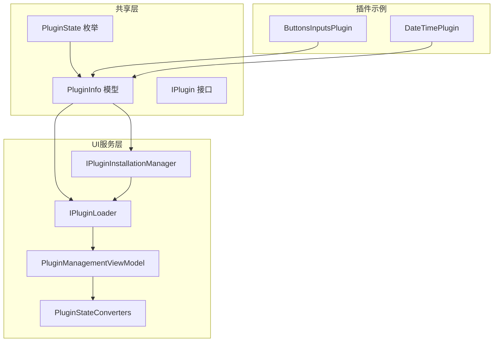
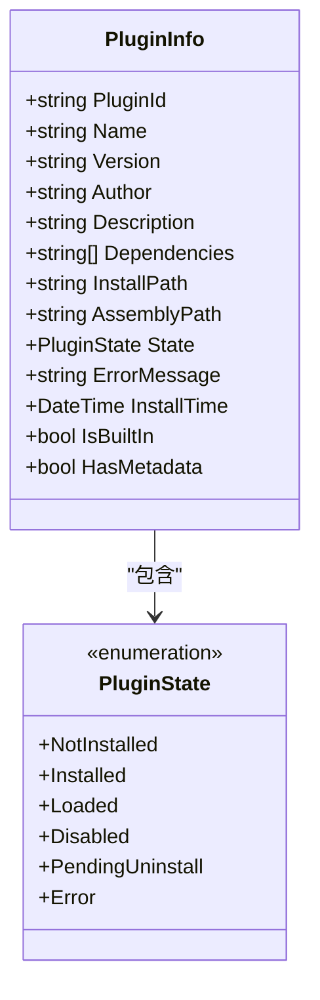
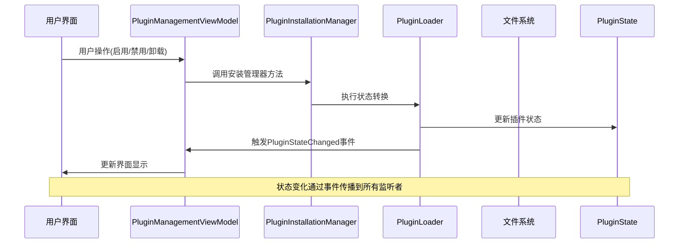
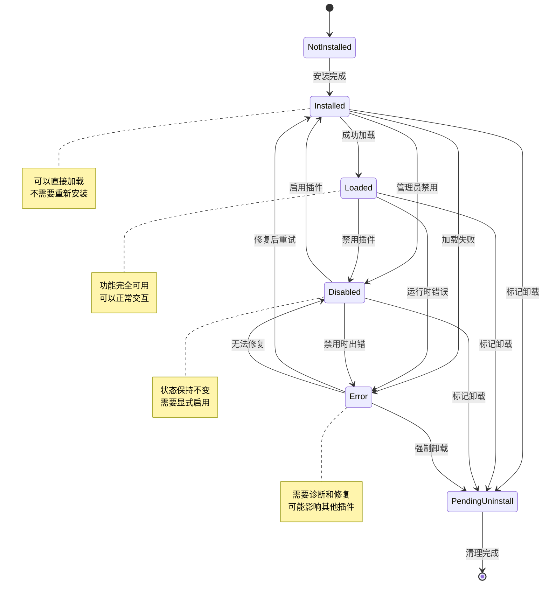
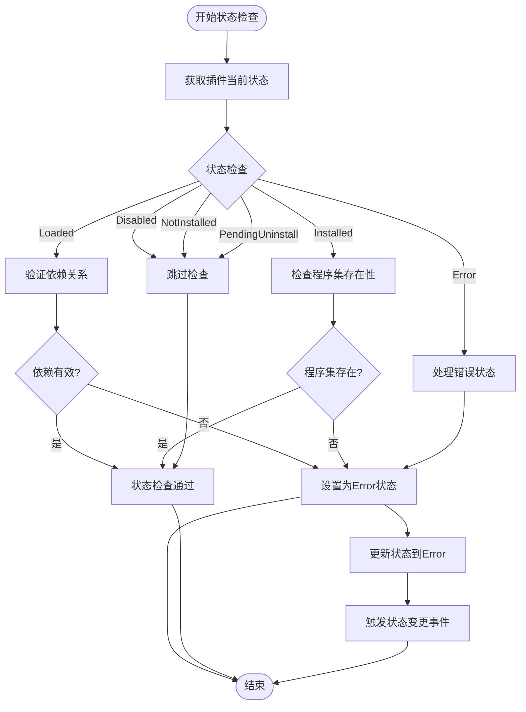
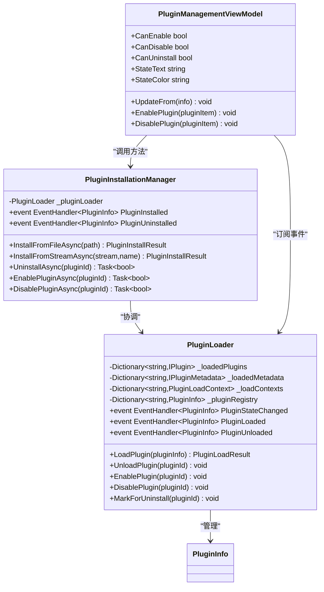
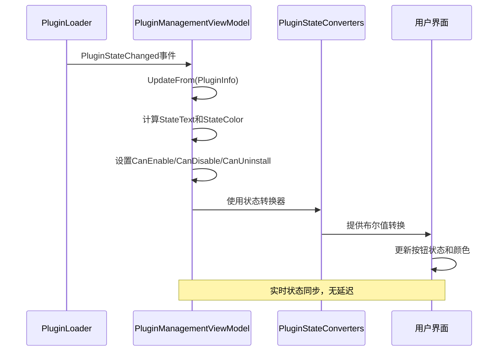
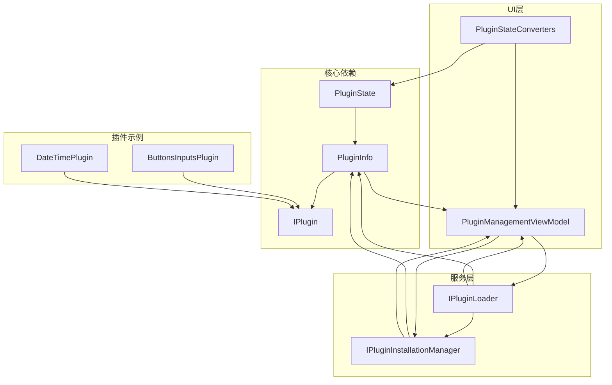
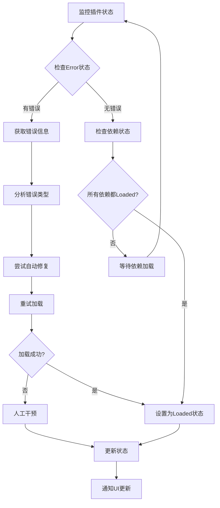

# 插件状态枚举

<cite>
**本文档引用的文件**
- [PluginState.cs](file://src/Avalonia.Plugin.Shared/Models/PluginState.cs)
- [PluginInfo.cs](file://src/Avalonia.Plugin.Shared/Models/PluginInfo.cs)
- [IPlugin.cs](file://src/Avalonia.Plugin.Shared/IPlugin.cs)
- [IPluginInstallationManager.cs](file://src/Avalonia.Plugin.Shared/Services/IPluginInstallationManager.cs)
- [IPluginLoader.cs](file://src/Avalonia.Plugin.Shared/Services/IPluginLoader.cs)
- [PluginInstallationManager.cs](file://src/Avalonia.UI/Services/PluginInstallationManager.cs)
- [PluginLoader.cs](file://src/Avalonia.UI/Services/PluginLoader.cs)
- [PluginManagementViewModel.cs](file://src/Avalonia.UI/ViewModels/PluginManagementViewModel.cs)
- [PluginStateConverters.cs](file://src/Avalonia.UI/ViewModels/PluginStateConverters.cs)
- [ButtonsInputsPlugin.cs](file://plugins/Avalonia.Plugin.ButtonsInputs/ButtonsInputsPlugin.cs)
- [DateTimePlugin.cs](file://plugins/Avalonia.Plugin.DateTime/DateTimePlugin.cs)
</cite>

## 目录
1. [简介](#简介)
2. [项目结构](#项目结构)
3. [核心组件](#核心组件)
4. [架构概览](#架构概览)
5. [详细组件分析](#详细组件分析)
6. [依赖关系分析](#依赖关系分析)
7. [性能考虑](#性能考虑)
8. [故障排除指南](#故障排除指南)
9. [结论](#结论)

## 简介

本文件专注于Avalonia模板项目中的插件状态枚举系统，详细解释PluginState枚举的各个状态值及其含义，包括NotInstalled、Installed、Loaded、Disabled、PendingUninstall、Error等状态的定义和转换规则。文档阐述了插件状态机的工作原理和状态转换条件，提供了插件状态检查、状态更新和状态同步的代码示例，并解释了插件状态在插件生命周期管理中的重要作用，以及状态变化对应用程序行为的影响。同时包含了插件状态异常处理和故障恢复的最佳实践。

## 项目结构

插件状态系统在整个项目中分布于多个关键位置，形成了一个完整的状态管理体系：

**图表来源**
- [PluginState.cs:1-12](file://src/Avalonia.Plugin.Shared/Models/PluginState.cs#L1-L12)
- [PluginInfo.cs:1-19](file://src/Avalonia.Plugin.Shared/Models/PluginInfo.cs#L1-L19)
- [PluginInstallationManager.cs:1-261](file://src/Avalonia.UI/Services/PluginInstallationManager.cs#L1-L261)
- [PluginLoader.cs:70-378](file://src/Avalonia.UI/Services/PluginLoader.cs#L70-L378)

**章节来源**
- [PluginState.cs:1-12](file://src/Avalonia.Plugin.Shared/Models/PluginState.cs#L1-L12)
- [PluginInfo.cs:1-19](file://src/Avalonia.Plugin.Shared/Models/PluginInfo.cs#L1-L19)

## 核心组件

### PluginState枚举定义

PluginState枚举是整个插件状态管理系统的核心，定义了插件生命周期中的所有可能状态：

**图表来源**
- [PluginState.cs:3-11](file://src/Avalonia.Plugin.Shared/Models/PluginState.cs#L3-L11)
- [PluginInfo.cs:3-18](file://src/Avalonia.Plugin.Shared/Models/PluginInfo.cs#L3-L18)

### 状态含义详解

每个状态都有其特定的含义和用途：

| 状态 | 含义 | 用途 | 典型场景 |
|------|------|------|----------|
| NotInstalled | 未安装 | 表示插件尚未安装到系统中 | 初始状态，新发现的插件 |
| Installed | 已安装 | 插件已下载但未加载 | 可以启用或卸载的状态 |
| Loaded | 已加载 | 插件已成功加载到内存中 | 插件功能可用的状态 |
| Disabled | 已禁用 | 插件被管理员禁用 | 需要临时停用插件时 |
| PendingUninstall | 待卸载 | 插件标记为卸载，等待清理 | 卸载流程开始时 |
| Error | 错误状态 | 插件加载失败或运行时出错 | 异常处理和故障恢复 |

**章节来源**
- [PluginState.cs:3-11](file://src/Avalonia.Plugin.Shared/Models/PluginState.cs#L3-L11)
- [PluginInfo.cs:3-18](file://src/Avalonia.Plugin.Shared/Models/PluginInfo.cs#L3-L18)

## 架构概览

插件状态管理系统采用事件驱动的设计模式，通过事件通知机制实现状态的实时更新和同步：

**图表来源**
- [PluginManagementViewModel.cs:103-158](file://src/Avalonia.UI/ViewModels/PluginManagementViewModel.cs#L103-L158)
- [PluginInstallationManager.cs:166-176](file://src/Avalonia.UI/Services/PluginInstallationManager.cs#L166-L176)
- [PluginLoader.cs:183-222](file://src/Avalonia.UI/Services/PluginLoader.cs#L183-L222)

## 详细组件分析

### 状态转换规则

插件状态转换遵循严格的业务规则和约束条件：

**图表来源**
- [PluginLoader.cs:183-222](file://src/Avalonia.UI/Services/PluginLoader.cs#L183-L222)
- [PluginLoader.cs:224-247](file://src/Avalonia.UI/Services/PluginLoader.cs#L224-L247)
- [PluginLoader.cs:76-92](file://src/Avalonia.UI/Services/PluginLoader.cs#L76-L92)

### 状态检查和验证

状态检查是确保插件正确运行的关键机制：

**图表来源**
- [PluginLoader.cs:76-92](file://src/Avalonia.UI/Services/PluginLoader.cs#L76-L92)
- [PluginLoader.cs:353-372](file://src/Avalonia.UI/Services/PluginLoader.cs#L353-L372)

### 状态更新机制

状态更新通过事件驱动的方式实现，确保所有组件都能及时获知状态变化：

**图表来源**
- [PluginLoader.cs:5-17](file://src/Avalonia.UI/Services/PluginLoader.cs#L5-L17)
- [PluginInstallationManager.cs:5-16](file://src/Avalonia.UI/Services/PluginInstallationManager.cs#L5-L16)
- [PluginManagementViewModel.cs:161-207](file://src/Avalonia.UI/ViewModels/PluginManagementViewModel.cs#L161-L207)

**章节来源**
- [PluginLoader.cs:5-17](file://src/Avalonia.UI/Services/PluginLoader.cs#L5-L17)
- [PluginInstallationManager.cs:5-16](file://src/Avalonia.UI/Services/PluginInstallationManager.cs#L5-L16)
- [PluginManagementViewModel.cs:161-207](file://src/Avalonia.UI/ViewModels/PluginManagementViewModel.cs#L161-L207)

### 状态同步和UI绑定

状态同步通过MVVM模式实现，确保UI与插件状态保持一致：

**图表来源**
- [PluginManagementViewModel.cs:182-207](file://src/Avalonia.UI/ViewModels/PluginManagementViewModel.cs#L182-L207)
- [PluginStateConverters.cs:6-13](file://src/Avalonia.UI/ViewModels/PluginStateConverters.cs#L6-L13)

**章节来源**
- [PluginManagementViewModel.cs:182-207](file://src/Avalonia.UI/ViewModels/PluginManagementViewModel.cs#L182-L207)
- [PluginStateConverters.cs:6-13](file://src/Avalonia.UI/ViewModels/PluginStateConverters.cs#L6-L13)

## 依赖关系分析

插件状态系统与其他组件的依赖关系如下：

**图表来源**
- [PluginState.cs:1-12](file://src/Avalonia.Plugin.Shared/Models/PluginState.cs#L1-L12)
- [PluginInfo.cs:1-19](file://src/Avalonia.Plugin.Shared/Models/PluginInfo.cs#L1-L19)
- [IPluginInstallationManager.cs:1-24](file://src/Avalonia.Plugin.Shared/Services/IPluginInstallationManager.cs#L1-L24)
- [IPluginLoader.cs:1-26](file://src/Avalonia.Plugin.Shared/Services/IPluginLoader.cs#L1-L26)

**章节来源**
- [IPluginInstallationManager.cs:1-24](file://src/Avalonia.Plugin.Shared/Services/IPluginInstallationManager.cs#L1-L24)
- [IPluginLoader.cs:1-26](file://src/Avalonia.Plugin.Shared/Services/IPluginLoader.cs#L1-L26)

## 性能考虑

插件状态管理系统的性能优化策略：

1. **事件驱动架构**：使用事件通知避免轮询，减少CPU占用
2. **线程安全**：使用锁机制保护状态转换，避免竞态条件
3. **延迟加载**：仅在需要时加载插件，减少内存占用
4. **状态缓存**：缓存已加载的插件实例，提高访问速度
5. **异步操作**：安装和卸载操作异步执行，不阻塞UI线程

## 故障排除指南

### 常见状态异常及解决方案

| 异常状态 | 可能原因 | 解决方案 |
|----------|----------|----------|
| Error状态 | 程序集缺失、依赖失败、加载异常 | 检查文件完整性、验证依赖关系、查看错误日志 |
| PendingUninstall | 卸载过程中断、文件锁定 | 等待系统清理、重启应用、手动删除残留文件 |
| Disabled | 管理员禁用、配置错误 | 检查权限设置、验证配置文件、重新启用插件 |
| Loaded但功能异常 | 插件版本不兼容、资源冲突 | 更新插件版本、检查资源占用、隔离冲突插件 |

### 状态监控和诊断

**图表来源**
- [PluginLoader.cs:76-92](file://src/Avalonia.UI/Services/PluginLoader.cs#L76-L92)
- [PluginLoader.cs:353-372](file://src/Avalonia.UI/Services/PluginLoader.cs#L353-L372)

**章节来源**
- [PluginLoader.cs:76-92](file://src/Avalonia.UI/Services/PluginLoader.cs#L76-L92)
- [PluginLoader.cs:353-372](file://src/Avalonia.UI/Services/PluginLoader.cs#L353-L372)

## 结论

PluginState枚举系统为Avalonia模板项目提供了完整、可靠且易于扩展的插件生命周期管理机制。通过明确的状态定义、严格的转换规则和完善的事件驱动架构，该系统确保了插件状态的一致性和可靠性。

关键优势包括：
- **清晰的状态语义**：每个状态都有明确的含义和用途
- **严格的转换约束**：防止非法状态转换，保证系统稳定性
- **实时状态同步**：通过事件机制实现实时状态更新
- **完善的错误处理**：提供完整的异常处理和故障恢复机制
- **良好的扩展性**：支持新的状态和状态转换规则

该系统不仅满足了当前的功能需求，还为未来的功能扩展和维护提供了坚实的基础。通过遵循本文档的最佳实践，开发者可以有效地管理和维护插件状态，确保应用程序的稳定运行。