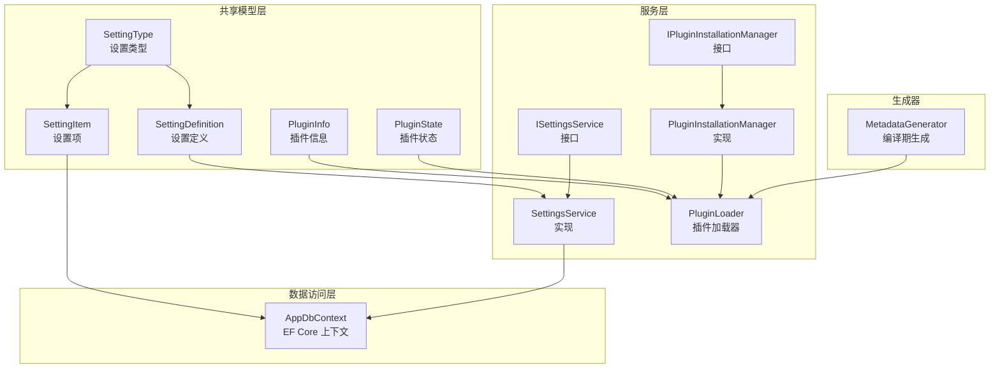
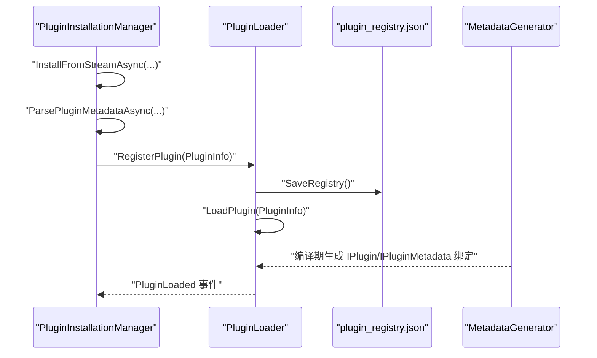
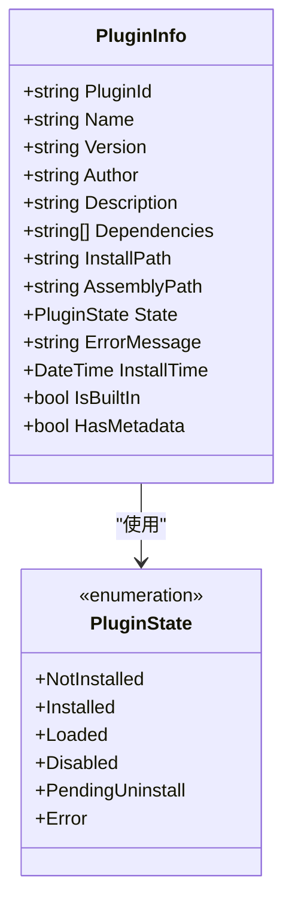
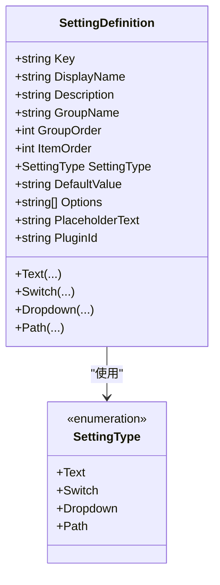
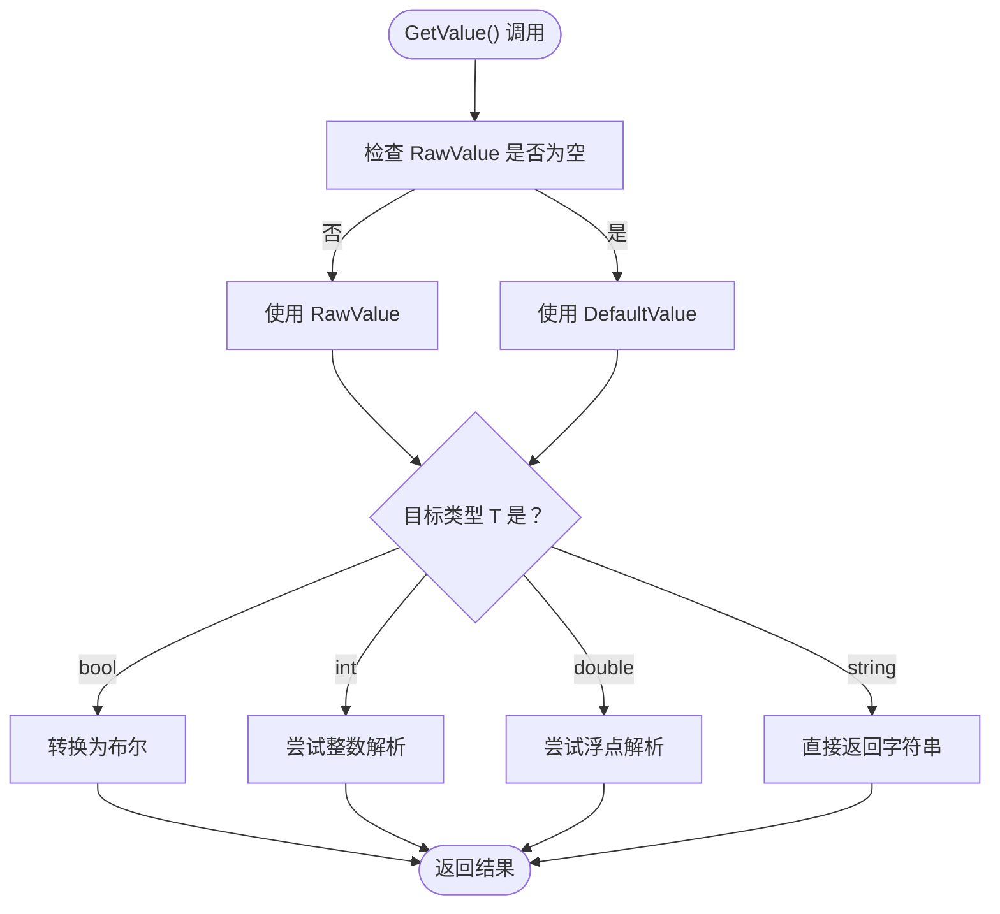
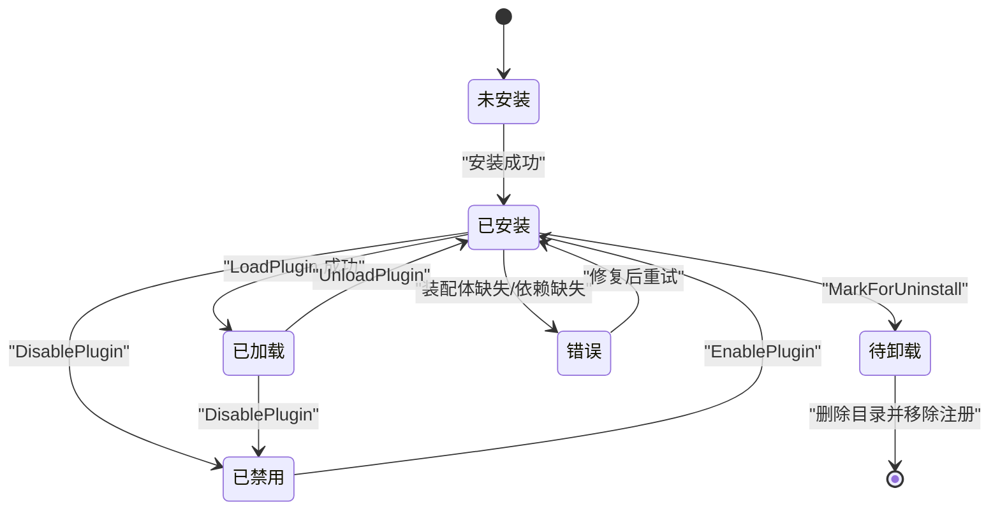
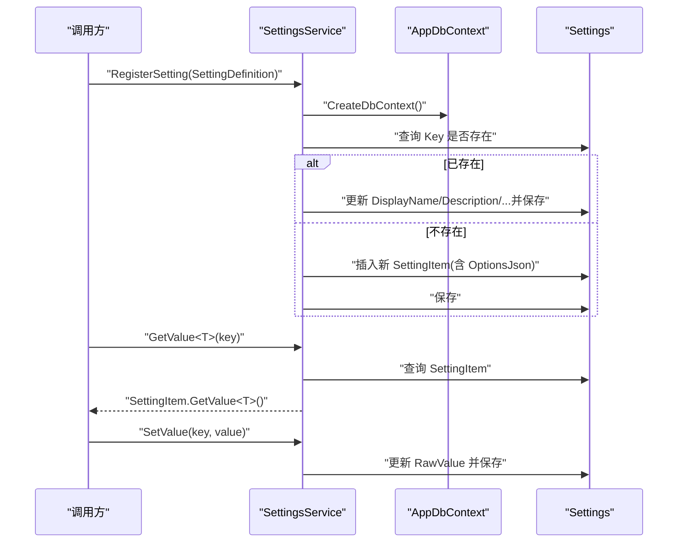
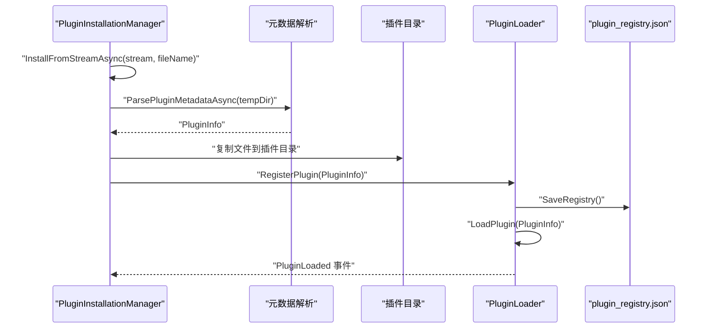
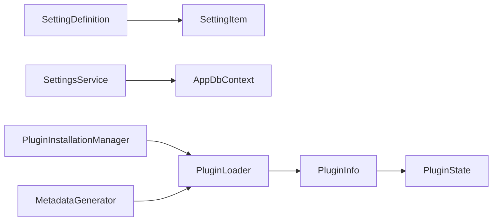

# 数据模型

<cite>
**本文档引用的文件**
- [PluginInfo.cs](file://src/Avalonia.Plugin.Shared/Models/PluginInfo.cs)
- [SettingDefinition.cs](file://src/Avalonia.Plugin.Shared/Models/SettingDefinition.cs)
- [SettingItem.cs](file://src/Avalonia.Plugin.Shared/Models/SettingItem.cs)
- [PluginState.cs](file://src/Avalonia.Plugin.Shared/Models/PluginState.cs)
- [SettingType.cs](file://src/Avalonia.Plugin.Shared/Models/SettingType.cs)
- [ISettingsService.cs](file://src/Avalonia.Plugin.Shared/Services/ISettingsService.cs)
- [SettingsService.cs](file://src/Avalonia.UI/Services/SettingsService.cs)
- [AppDbContext.cs](file://src/Avalonia.UI/Data/AppDbContext.cs)
- [IPluginInstallationManager.cs](file://src/Avalonia.Plugin.Shared/Services/IPluginInstallationManager.cs)
- [PluginInstallationManager.cs](file://src/Avalonia.UI/Services/PluginInstallationManager.cs)
- [PluginLoader.cs](file://src/Avalonia.UI/Services/PluginLoader.cs)
- [MetadataGenerator.cs](file://src/Avalonia.Plugin.Generators/MetadataGenerator.cs)
- [ButtonsInputsPlugin.cs](file://plugins/Avalonia.Plugin.ButtonsInputs/ButtonsInputsPlugin.cs)
- [TemplatePlugin.cs](file://plugins/Avalonia.Plugin.Template/TemplatePlugin.cs)
</cite>

## 目录
1. [简介](#简介)
2. [项目结构](#项目结构)
3. [核心组件](#核心组件)
4. [架构总览](#架构总览)
5. [详细组件分析](#详细组件分析)
6. [依赖分析](#依赖分析)
7. [性能考量](#性能考量)
8. [故障排查指南](#故障排查指南)
9. [结论](#结论)
10. [附录](#附录)

## 简介
本文件系统性梳理 AvaloniaTemplate 中“数据模型”的设计与实现，重点覆盖以下方面：
- 插件信息模型 PluginInfo 的字段、职责与生命周期
- 设置定义模型 SettingDefinition 的静态工厂方法与分组排序机制
- 设置项模型 SettingItem 的类型转换、序列化与默认值处理
- 插件状态枚举 PluginState 的状态流转与约束
- 设置类型枚举 SettingType 的取值范围与 UI 映射
- 数据持久化策略（EF Core + SQLite）与缓存机制（内存注册表）
- 数据验证规则与约束条件
- 使用示例与最佳实践
- 扩展与自定义指导
- 版本管理与向后兼容性考虑

## 项目结构
围绕数据模型的相关目录与文件分布如下：
- 模型层：位于共享库，定义插件与设置的核心数据结构
- 服务层：面向应用 UI，提供设置注册、读写、分组查询等能力，并负责插件安装与加载
- 数据访问层：基于 EF Core 的 AppDbContext，映射 SettingItem 到数据库
- 生成器：在编译期扫描插件元数据，生成视图与导航绑定代码

图表来源
- [PluginInfo.cs:1-19](file://src/Avalonia.Plugin.Shared/Models/PluginInfo.cs#L1-L19)
- [SettingDefinition.cs:1-89](file://src/Avalonia.Plugin.Shared/Models/SettingDefinition.cs#L1-L89)
- [SettingItem.cs:1-61](file://src/Avalonia.Plugin.Shared/Models/SettingItem.cs#L1-L61)
- [PluginState.cs:1-12](file://src/Avalonia.Plugin.Shared/Models/PluginState.cs#L1-L12)
- [SettingType.cs:1-10](file://src/Avalonia.Plugin.Shared/Models/SettingType.cs#L1-L10)
- [ISettingsService.cs:1-19](file://src/Avalonia.Plugin.Shared/Services/ISettingsService.cs#L1-L19)
- [SettingsService.cs:1-137](file://src/Avalonia.UI/Services/SettingsService.cs#L1-L137)
- [AppDbContext.cs:1-30](file://src/Avalonia.UI/Data/AppDbContext.cs#L1-L30)
- [IPluginInstallationManager.cs:1-24](file://src/Avalonia.Plugin.Shared/Services/IPluginInstallationManager.cs#L1-L24)
- [PluginInstallationManager.cs:1-261](file://src/Avalonia.UI/Services/PluginInstallationManager.cs#L1-L261)
- [PluginLoader.cs:1-460](file://src/Avalonia.UI/Services/PluginLoader.cs#L1-L460)
- [MetadataGenerator.cs:1-246](file://src/Avalonia.Plugin.Generators/MetadataGenerator.cs#L1-L246)

章节来源
- [PluginInfo.cs:1-19](file://src/Avalonia.Plugin.Shared/Models/PluginInfo.cs#L1-L19)
- [SettingDefinition.cs:1-89](file://src/Avalonia.Plugin.Shared/Models/SettingDefinition.cs#L1-L89)
- [SettingItem.cs:1-61](file://src/Avalonia.Plugin.Shared/Models/SettingItem.cs#L1-L61)
- [PluginState.cs:1-12](file://src/Avalonia.Plugin.Shared/Models/PluginState.cs#L1-L12)
- [SettingType.cs:1-10](file://src/Avalonia.Plugin.Shared/Models/SettingType.cs#L1-L10)
- [ISettingsService.cs:1-19](file://src/Avalonia.Plugin.Shared/Services/ISettingsService.cs#L1-L19)
- [SettingsService.cs:1-137](file://src/Avalonia.UI/Services/SettingsService.cs#L1-L137)
- [AppDbContext.cs:1-30](file://src/Avalonia.UI/Data/AppDbContext.cs#L1-L30)
- [IPluginInstallationManager.cs:1-24](file://src/Avalonia.Plugin.Shared/Services/IPluginInstallationManager.cs#L1-L24)
- [PluginInstallationManager.cs:1-261](file://src/Avalonia.UI/Services/PluginInstallationManager.cs#L1-L261)
- [PluginLoader.cs:1-460](file://src/Avalonia.UI/Services/PluginLoader.cs#L1-L460)
- [MetadataGenerator.cs:1-246](file://src/Avalonia.Plugin.Generators/MetadataGenerator.cs#L1-L246)

## 核心组件
- 插件信息模型 PluginInfo：描述插件标识、名称、版本、作者、描述、依赖、安装路径、程序集路径、当前状态、错误信息、安装时间、是否内置、是否存在元数据等
- 设置定义模型 SettingDefinition：用于注册设置项，包含键、显示名、描述、分组名与顺序、项顺序、设置类型、默认值、可选项列表、占位文本、所属插件 ID 等；提供多种静态工厂方法快速创建不同类型的设置
- 设置项模型 SettingItem：持久化存储的设置实体，包含键、显示名、描述、分组与顺序、设置类型、原始值、可选项 JSON、所属插件 ID、默认值、占位文本；提供类型安全的 GetValue<T>() 与 SetValue()，支持 bool/int/double 与字符串互转
- 插件状态枚举 PluginState：定义 NotInstalled、Installed、Loaded、Disabled、PendingUninstall、Error 等状态，驱动插件生命周期与加载行为
- 设置类型枚举 SettingType：定义 Text、Switch、Dropdown、Path 四种类型，与 UI 控件与校验规则对应

章节来源
- [PluginInfo.cs:1-19](file://src/Avalonia.Plugin.Shared/Models/PluginInfo.cs#L1-L19)
- [SettingDefinition.cs:1-89](file://src/Avalonia.Plugin.Shared/Models/SettingDefinition.cs#L1-L89)
- [SettingItem.cs:1-61](file://src/Avalonia.Plugin.Shared/Models/SettingItem.cs#L1-L61)
- [PluginState.cs:1-12](file://src/Avalonia.Plugin.Shared/Models/PluginState.cs#L1-L12)
- [SettingType.cs:1-10](file://src/Avalonia.Plugin.Shared/Models/SettingType.cs#L1-L10)

## 架构总览
数据模型贯穿“插件系统”与“设置系统”，二者通过服务层协同工作：
- 插件系统：安装器负责解压、解析元数据、复制文件、更新注册表；加载器负责按需加载、依赖校验、状态维护；生成器在编译期生成元数据绑定
- 设置系统：服务层负责注册设置、读写值、分组查询；数据层通过 EF Core 将 SettingItem 持久化到数据库

图表来源
- [PluginInstallationManager.cs:1-261](file://src/Avalonia.UI/Services/PluginInstallationManager.cs#L1-L261)
- [PluginLoader.cs:1-460](file://src/Avalonia.UI/Services/PluginLoader.cs#L1-L460)
- [MetadataGenerator.cs:1-246](file://src/Avalonia.Plugin.Generators/MetadataGenerator.cs#L1-L246)

## 详细组件分析

### 插件信息模型 PluginInfo
- 字段与职责
  - 标识与元信息：PluginId、Name、Version、Author、Description
  - 依赖与路径：Dependencies、InstallPath、AssemblyPath
  - 状态与诊断：State、ErrorMessage、InstallTime、IsBuiltIn、HasMetadata
- 设计要点
  - 作为插件生命周期的载体，贯穿安装、加载、启用/禁用、卸载全过程
  - 支持内置插件标记与元数据存在性标记，便于 UI 与功能控制
- 约束与验证
  - 插件 ID 应全局唯一
  - 程序集路径必须存在且可加载
  - 依赖 ID 必须在注册表中已加载

图表来源
- [PluginInfo.cs:1-19](file://src/Avalonia.Plugin.Shared/Models/PluginInfo.cs#L1-L19)
- [PluginState.cs:1-12](file://src/Avalonia.Plugin.Shared/Models/PluginState.cs#L1-L12)

章节来源
- [PluginInfo.cs:1-19](file://src/Avalonia.Plugin.Shared/Models/PluginInfo.cs#L1-L19)
- [PluginState.cs:1-12](file://src/Avalonia.Plugin.Shared/Models/PluginState.cs#L1-L12)

### 设置定义模型 SettingDefinition
- 字段与职责
  - 键与展示：Key、DisplayName、Description
  - 分组与排序：GroupName、GroupOrder、ItemOrder
  - 类型与默认值：SettingType、DefaultValue、Options
  - UI 提示：PlaceholderText
  - 关联：PluginId
- 工厂方法
  - 提供 Text/Switch/Dropdown/Path 四类静态工厂，统一创建流程，减少重复配置
- 设计要点
  - 通过 GroupOrder 与 ItemOrder 实现稳定的 UI 分组与排序
  - Options 仅对下拉类型有效，避免冗余字段污染其他类型
- 约束与验证
  - Key 具有唯一性（数据库索引约束）
  - GroupName 与 DisplayName 不能为空且长度受限
  - DefaultValue 与 RawValue 在读取时互为后备

图表来源
- [SettingDefinition.cs:1-89](file://src/Avalonia.Plugin.Shared/Models/SettingDefinition.cs#L1-L89)
- [SettingType.cs:1-10](file://src/Avalonia.Plugin.Shared/Models/SettingType.cs#L1-L10)

章节来源
- [SettingDefinition.cs:1-89](file://src/Avalonia.Plugin.Shared/Models/SettingDefinition.cs#L1-L89)
- [SettingType.cs:1-10](file://src/Avalonia.Plugin.Shared/Models/SettingType.cs#L1-L10)

### 设置项模型 SettingItem
- 字段与职责
  - 键与展示：Key、DisplayName、Description
  - 分组与排序：GroupName、GroupOrder、ItemOrder
  - 类型与值：SettingType、RawValue、DefaultValue
  - 可选项：OptionsJson（JSON 序列化）
  - UI 提示：PlaceholderText
  - 关联：PluginId
- 类型转换与默认值
  - GetValue<T>() 支持 bool/int/double/string
  - SetValue() 将对象转换为字符串存储（布尔使用 "true"/"false"）
  - 若 RawValue 为空则回退到 DefaultValue
- 设计要点
  - 通过 OptionsJson 存储动态选项，避免为每种类型单独建模
  - 保持 RawValue 与 DefaultValue 的清晰边界，便于 UI 与业务层判断
- 约束与验证
  - Key 唯一（数据库索引）
  - 各字段长度限制（数据库属性配置）

图表来源
- [SettingItem.cs:1-61](file://src/Avalonia.Plugin.Shared/Models/SettingItem.cs#L1-L61)

章节来源
- [SettingItem.cs:1-61](file://src/Avalonia.Plugin.Shared/Models/SettingItem.cs#L1-L61)

### 插件状态枚举 PluginState 与状态流转
- 状态定义
  - NotInstalled：未安装
  - Installed：已安装但未加载
  - Loaded：已加载
  - Disabled：已禁用
  - PendingUninstall：待卸载
  - Error：加载失败或装配体缺失
- 流转规则
  - 安装完成 -> Installed
  - 成功加载 -> Loaded
  - 禁用 -> Disabled
  - 卸载标记 -> PendingUninstall
  - 加载失败或装配体缺失 -> Error
- 依赖校验
  - 加载前校验依赖是否已 Loaded，否则置为 Error 并记录错误信息

图表来源
- [PluginState.cs:1-12](file://src/Avalonia.Plugin.Shared/Models/PluginState.cs#L1-L12)
- [PluginLoader.cs:1-460](file://src/Avalonia.UI/Services/PluginLoader.cs#L1-L460)
- [PluginInstallationManager.cs:1-261](file://src/Avalonia.UI/Services/PluginInstallationManager.cs#L1-L261)

章节来源
- [PluginState.cs:1-12](file://src/Avalonia.Plugin.Shared/Models/PluginState.cs#L1-L12)
- [PluginLoader.cs:1-460](file://src/Avalonia.UI/Services/PluginLoader.cs#L1-L460)
- [PluginInstallationManager.cs:1-261](file://src/Avalonia.UI/Services/PluginInstallationManager.cs#L1-L261)

### 设置类型枚举 SettingType 与 UI 映射
- 枚举值
  - Text：文本输入
  - Switch：开关
  - Dropdown：下拉选择
  - Path：路径选择
- 设计要点
  - 与 SettingDefinition/SettingItem 的 SettingType 字段一一对应
  - UI 层根据类型选择控件与校验策略（如路径类型进行路径合法性校验）

章节来源
- [SettingType.cs:1-10](file://src/Avalonia.Plugin.Shared/Models/SettingType.cs#L1-L10)
- [SettingDefinition.cs:1-89](file://src/Avalonia.Plugin.Shared/Models/SettingDefinition.cs#L1-L89)
- [SettingItem.cs:1-61](file://src/Avalonia.Plugin.Shared/Models/SettingItem.cs#L1-L61)

### 设置服务 ISettingsService 与 SettingsService
- 服务接口职责
  - 注册单个/批量设置定义
  - 读取/写入指定键的值（泛型/字符串）
  - 获取全部设置、按分组获取、获取分组列表
  - 删除设置、初始化默认设置
- 实现要点
  - 使用 EF Core 上下文访问 Settings 表
  - 注册时若键已存在则更新非空字段并保存
  - GetValue<T>() 委托给 SettingItem.GetValue<T>()
  - SetValue() 更新 SettingItem.RawValue 并保存
- 默认设置
  - 提供 InitializeDefaults() 注册主题、侧边栏折叠、用户名等常用设置

图表来源
- [ISettingsService.cs:1-19](file://src/Avalonia.Plugin.Shared/Services/ISettingsService.cs#L1-L19)
- [SettingsService.cs:1-137](file://src/Avalonia.UI/Services/SettingsService.cs#L1-L137)
- [AppDbContext.cs:1-30](file://src/Avalonia.UI/Data/AppDbContext.cs#L1-L30)
- [SettingItem.cs:1-61](file://src/Avalonia.Plugin.Shared/Models/SettingItem.cs#L1-L61)

章节来源
- [ISettingsService.cs:1-19](file://src/Avalonia.Plugin.Shared/Services/ISettingsService.cs#L1-L19)
- [SettingsService.cs:1-137](file://src/Avalonia.UI/Services/SettingsService.cs#L1-L137)
- [AppDbContext.cs:1-30](file://src/Avalonia.UI/Data/AppDbContext.cs#L1-L30)
- [SettingItem.cs:1-61](file://src/Avalonia.Plugin.Shared/Models/SettingItem.cs#L1-L61)

### 插件安装与加载：IPluginInstallationManager、PluginInstallationManager、PluginLoader
- 安装流程
  - 从流/文件安装：解压包、解析元数据（优先 nuspec/plugin.json，其次程序集反射），复制文件至插件目录，更新 PluginInfo，注册到加载器
  - 安全校验：防止路径穿越攻击
- 加载流程
  - 创建独立 AssemblyLoadContext 加载程序集，反射查找 IPlugin 与 IPluginMetadata 实例
  - 依赖校验：要求所有依赖已 Loaded
  - 状态维护：成功 -> Loaded，失败 -> Error
- 注册表持久化
  - 以 JSON 文件保存插件注册表，包含状态、安装路径、程序集路径、依赖等
- 编译期元数据生成
  - 通过 MetadataGenerator 扫描特性，生成 IPlugin/IPluginMetadata 的绑定代码，简化插件开发

图表来源
- [IPluginInstallationManager.cs:1-24](file://src/Avalonia.Plugin.Shared/Services/IPluginInstallationManager.cs#L1-L24)
- [PluginInstallationManager.cs:1-261](file://src/Avalonia.UI/Services/PluginInstallationManager.cs#L1-L261)
- [PluginLoader.cs:1-460](file://src/Avalonia.UI/Services/PluginLoader.cs#L1-L460)

章节来源
- [IPluginInstallationManager.cs:1-24](file://src/Avalonia.Plugin.Shared/Services/IPluginInstallationManager.cs#L1-L24)
- [PluginInstallationManager.cs:1-261](file://src/Avalonia.UI/Services/PluginInstallationManager.cs#L1-L261)
- [PluginLoader.cs:1-460](file://src/Avalonia.UI/Services/PluginLoader.cs#L1-L460)
- [MetadataGenerator.cs:1-246](file://src/Avalonia.Plugin.Generators/MetadataGenerator.cs#L1-L246)

### 插件示例与元数据生成
- 示例插件
  - ButtonsInputsPlugin：演示如何声明插件元数据与 ID
  - TemplatePlugin：最小模板，展示基本结构
- 元数据生成
  - 通过 [GenerateMetadata] 特性触发编译期生成，自动注入 GetViewDefinitions/GetNavigationItems/GetMenuItems 等实现

章节来源
- [ButtonsInputsPlugin.cs:1-100](file://plugins/Avalonia.Plugin.ButtonsInputs/ButtonsInputsPlugin.cs#L1-L100)
- [TemplatePlugin.cs:1-20](file://plugins/Avalonia.Plugin.Template/TemplatePlugin.cs#L1-L20)
- [MetadataGenerator.cs:1-246](file://src/Avalonia.Plugin.Generators/MetadataGenerator.cs#L1-L246)

## 依赖分析
- 组件耦合
  - PluginInfo 与 PluginState 强关联，驱动加载器状态机
  - SettingDefinition 与 SettingItem 通过 Key 关联，服务层在注册时建立一对一映射
  - SettingsService 依赖 AppDbContext 进行持久化
  - PluginInstallationManager 依赖 PluginLoader 进行注册与状态变更
- 外部依赖
  - EF Core：数据持久化
  - System.IO.Compression/System.Text.Json：安装包解析与元数据反序列化
  - Microsoft.CodeAnalysis：编译期代码生成

图表来源
- [PluginInfo.cs:1-19](file://src/Avalonia.Plugin.Shared/Models/PluginInfo.cs#L1-L19)
- [PluginState.cs:1-12](file://src/Avalonia.Plugin.Shared/Models/PluginState.cs#L1-L12)
- [SettingDefinition.cs:1-89](file://src/Avalonia.Plugin.Shared/Models/SettingDefinition.cs#L1-L89)
- [SettingItem.cs:1-61](file://src/Avalonia.Plugin.Shared/Models/SettingItem.cs#L1-L61)
- [SettingsService.cs:1-137](file://src/Avalonia.UI/Services/SettingsService.cs#L1-L137)
- [AppDbContext.cs:1-30](file://src/Avalonia.UI/Data/AppDbContext.cs#L1-L30)
- [IPluginInstallationManager.cs:1-24](file://src/Avalonia.Plugin.Shared/Services/IPluginInstallationManager.cs#L1-L24)
- [PluginInstallationManager.cs:1-261](file://src/Avalonia.UI/Services/PluginInstallationManager.cs#L1-L261)
- [PluginLoader.cs:1-460](file://src/Avalonia.UI/Services/PluginLoader.cs#L1-L460)
- [MetadataGenerator.cs:1-246](file://src/Avalonia.Plugin.Generators/MetadataGenerator.cs#L1-L246)

章节来源
- [SettingsService.cs:1-137](file://src/Avalonia.UI/Services/SettingsService.cs#L1-L137)
- [PluginInstallationManager.cs:1-261](file://src/Avalonia.UI/Services/PluginInstallationManager.cs#L1-L261)
- [PluginLoader.cs:1-460](file://src/Avalonia.UI/Services/PluginLoader.cs#L1-L460)
- [AppDbContext.cs:1-30](file://src/Avalonia.UI/Data/AppDbContext.cs#L1-L30)

## 性能考量
- 数据库访问
  - SettingsService 对每个操作均创建 DbContext，频繁调用时可考虑复用或批量操作以降低开销
  - 查询按 GroupOrder/ItemOrder 排序，建议在数据库层面建立复合索引优化排序
- 插件加载
  - 加载器使用独立 AssemblyLoadContext，避免主程序域污染；但频繁卸载/加载会带来额外成本
  - 依赖校验在加载前执行，确保后续运行稳定
- 序列化
  - SettingItem 的 OptionsJson 使用 JSON 序列化/反序列化，建议在高频场景下缓存解析结果

## 故障排查指南
- 插件安装失败
  - 检查包内路径是否包含非法字符或路径穿越
  - 确认元数据文件（nuspec/plugin.json）格式正确
  - 查看安装器返回的错误消息与 PluginInfo.ErrorMessage
- 插件加载失败
  - 检查装配体路径是否存在
  - 确认依赖插件均已 Loaded
  - 查看加载器日志与状态变更事件
- 设置读写异常
  - 检查 Key 是否唯一且拼写一致
  - 确认 GetValue<T>() 的类型与实际存储值匹配
  - 若 DefaultValue 为空，UI 层应提供合理的降级显示

章节来源
- [PluginInstallationManager.cs:1-261](file://src/Avalonia.UI/Services/PluginInstallationManager.cs#L1-L261)
- [PluginLoader.cs:1-460](file://src/Avalonia.UI/Services/PluginLoader.cs#L1-L460)
- [SettingsService.cs:1-137](file://src/Avalonia.UI/Services/SettingsService.cs#L1-L137)
- [SettingItem.cs:1-61](file://src/Avalonia.Plugin.Shared/Models/SettingItem.cs#L1-L61)

## 结论
AvaloniaTemplate 的数据模型以“插件信息 + 设置定义/项 + 状态枚举 + 类型枚举”为核心，配合服务层与数据访问层实现了完整的插件生命周期与设置管理能力。通过编译期元数据生成与数据库持久化，系统在易用性与可扩展性之间取得良好平衡。建议在生产环境中关注数据库连接池、批量操作与依赖校验的性能优化，并完善错误日志与状态监控。

## 附录

### 数据验证规则与约束条件
- 设置项 Key 唯一，长度不超过 256；显示名不超过 256；分组名不超过 128；原始值/默认值不超过 2048；可选项 JSON 不超过 4096；插件 ID 不超过 128
- 插件 ID 唯一，程序集路径必须存在，依赖必须已加载
- 设置类型与 UI 控件一一对应，路径类型需进行路径合法性校验

章节来源
- [AppDbContext.cs:1-30](file://src/Avalonia.UI/Data/AppDbContext.cs#L1-L30)
- [PluginLoader.cs:1-460](file://src/Avalonia.UI/Services/PluginLoader.cs#L1-L460)
- [SettingDefinition.cs:1-89](file://src/Avalonia.Plugin.Shared/Models/SettingDefinition.cs#L1-L89)
- [SettingItem.cs:1-61](file://src/Avalonia.Plugin.Shared/Models/SettingItem.cs#L1-L61)

### 使用示例与最佳实践
- 注册设置
  - 使用 SettingDefinition 的静态工厂方法快速创建设置定义
  - 在应用启动时调用 SettingsService.InitializeDefaults() 注册常用设置
- 读取与写入
  - 使用 GetValue<T>() 获取强类型值，避免手动解析
  - 写入时使用 SetValue()，内部自动处理布尔与数值转换
- 插件开发
  - 在插件类上添加 [GenerateMetadata] 特性，由生成器自动生成元数据绑定
  - 明确插件 ID、版本与依赖，确保加载器能正确识别与校验
- UI 集成
  - 根据 SettingType 选择合适的控件（文本框/开关/下拉/路径选择）
  - 使用分组与顺序控制界面布局

章节来源
- [SettingsService.cs:1-137](file://src/Avalonia.UI/Services/SettingsService.cs#L1-L137)
- [SettingDefinition.cs:1-89](file://src/Avalonia.Plugin.Shared/Models/SettingDefinition.cs#L1-L89)
- [SettingItem.cs:1-61](file://src/Avalonia.Plugin.Shared/Models/SettingItem.cs#L1-L61)
- [MetadataGenerator.cs:1-246](file://src/Avalonia.Plugin.Generators/MetadataGenerator.cs#L1-L246)

### 扩展与自定义指导
- 新增设置类型
  - 在 SettingType 中新增枚举值，并在 UI 层与服务层补充对应处理逻辑
  - 在 SettingItem 中扩展 GetValue<T>()/SetValue() 的分支
- 自定义元数据生成
  - 在插件中使用 [GenerateMetadata] 特性，结合 [ViewMap]/[NavigationItem]/[Menu] 等特性声明视图与导航关系
- 插件状态扩展
  - 如需新增状态，扩展 PluginState 并在加载器的状态机中补充处理逻辑

章节来源
- [SettingType.cs:1-10](file://src/Avalonia.Plugin.Shared/Models/SettingType.cs#L1-L10)
- [SettingItem.cs:1-61](file://src/Avalonia.Plugin.Shared/Models/SettingItem.cs#L1-L61)
- [PluginState.cs:1-12](file://src/Avalonia.Plugin.Shared/Models/PluginState.cs#L1-L12)
- [PluginLoader.cs:1-460](file://src/Avalonia.UI/Services/PluginLoader.cs#L1-L460)
- [MetadataGenerator.cs:1-246](file://src/Avalonia.Plugin.Generators/MetadataGenerator.cs#L1-L246)

### 版本管理与向后兼容性
- 版本管理
  - 插件版本与应用设置版本各自独立管理，通过 PluginInfo.Version 与 SettingItem.DefaultValue 区分
- 向后兼容
  - 新增设置项时保留 DefaultValue，避免破坏旧用户配置
  - 修改设置类型或 UI 控件时提供迁移脚本或兼容读取逻辑
  - 插件状态机新增状态时保持旧状态的兼容处理

章节来源
- [PluginInfo.cs:1-19](file://src/Avalonia.Plugin.Shared/Models/PluginInfo.cs#L1-L19)
- [SettingItem.cs:1-61](file://src/Avalonia.Plugin.Shared/Models/SettingItem.cs#L1-L61)
- [PluginLoader.cs:1-460](file://src/Avalonia.UI/Services/PluginLoader.cs#L1-L460)