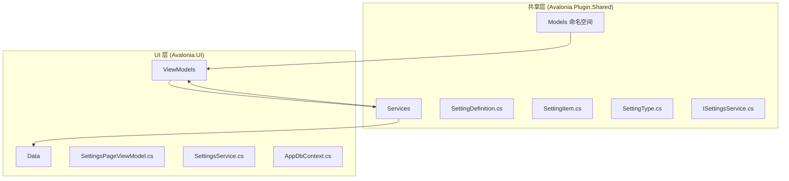
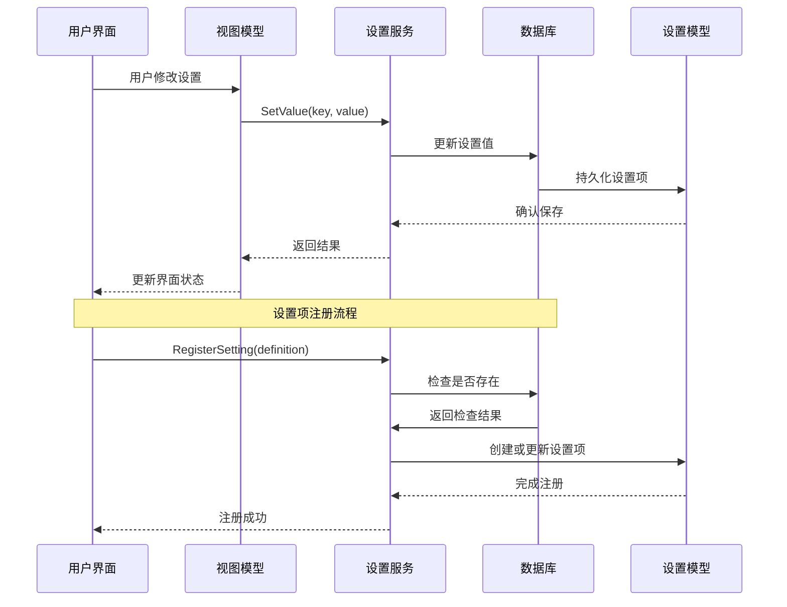
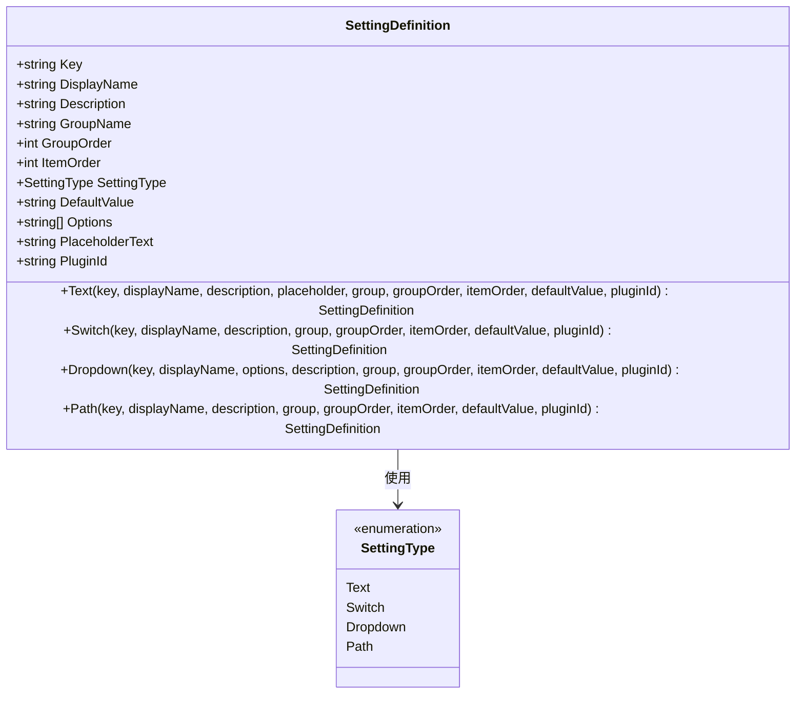
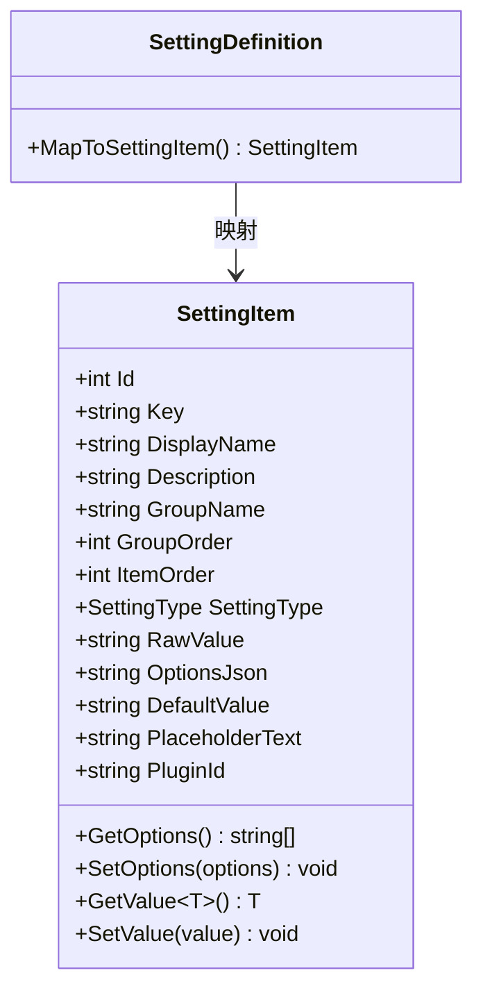
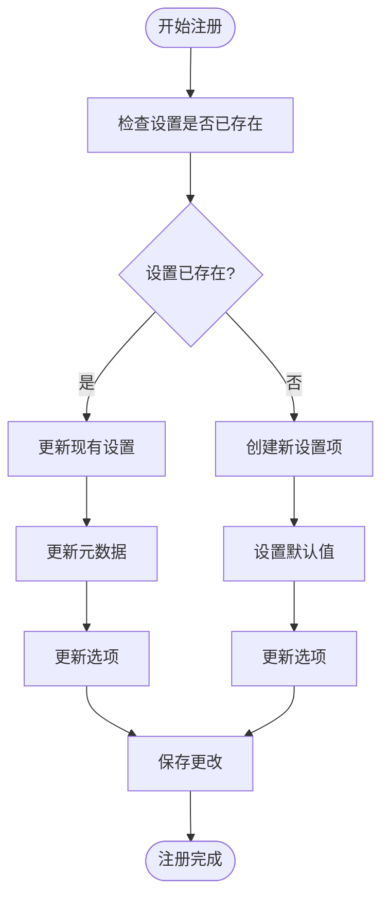
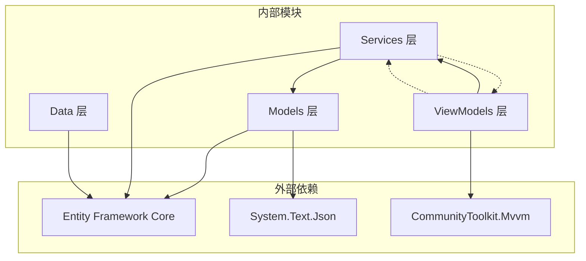

# 设置定义模型

<cite>
**本文档引用的文件**
- [SettingDefinition.cs](file://src/Avalonia.Plugin.Shared/Models/SettingDefinition.cs)
- [SettingItem.cs](file://src/Avalonia.Plugin.Shared/Models/SettingItem.cs)
- [SettingType.cs](file://src/Avalonia.Plugin.Shared/Models/SettingType.cs)
- [ISettingsService.cs](file://src/Avalonia.Plugin.Shared/Services/ISettingsService.cs)
- [SettingsService.cs](file://src/Avalonia.UI/Services/SettingsService.cs)
- [SettingsPageViewModel.cs](file://src/Avalonia.UI/ViewModels/SettingsPageViewModel.cs)
- [AppDbContext.cs](file://src/Avalonia.UI/Data/AppDbContext.cs)
</cite>

## 目录
1. [简介](#简介)
2. [项目结构](#项目结构)
3. [核心组件](#核心组件)
4. [架构概览](#架构概览)
5. [详细组件分析](#详细组件分析)
6. [依赖关系分析](#依赖关系分析)
7. [性能考虑](#性能考虑)
8. [故障排除指南](#故障排除指南)
9. [结论](#结论)
10. [附录](#附录)

## 简介

设置定义模型是 Avalonia 插件系统中的核心组件，用于描述和管理应用程序的各种设置项。该模型提供了统一的接口来定义设置项的元数据、数据类型、默认值、验证规则等核心属性，同时支持用户体验相关的属性如设置分类、显示名称、描述信息等。

本模型采用面向对象的设计理念，通过静态工厂方法提供简洁易用的创建方式，支持多种设置类型（文本、开关、下拉框、路径选择器），并具备良好的扩展性和自定义属性支持能力。

## 项目结构

设置定义模型位于 Avalonia.Plugin.Shared 项目的 Models 命名空间中，与服务层和视图模型层形成清晰的分层架构：



**图表来源**
- [SettingDefinition.cs:1-89](file://src/Avalonia.Plugin.Shared/Models/SettingDefinition.cs#L1-L89)
- [SettingItem.cs:1-61](file://src/Avalonia.Plugin.Shared/Models/SettingItem.cs#L1-L61)
- [SettingsService.cs:1-137](file://src/Avalonia.UI/Services/SettingsService.cs#L1-L137)

**章节来源**
- [SettingDefinition.cs:1-89](file://src/Avalonia.Plugin.Shared/Models/SettingDefinition.cs#L1-L89)
- [SettingItem.cs:1-61](file://src/Avalonia.Plugin.Shared/Models/SettingItem.cs#L1-L61)
- [SettingType.cs:1-10](file://src/Avalonia.Plugin.Shared/Models/SettingType.cs#L1-L10)

## 核心组件

设置定义模型由三个核心类组成：SettingDefinition、SettingItem 和 SettingType，它们共同构成了完整的设置管理系统。

### SettingDefinition 类

SettingDefinition 是设置定义的核心类，负责描述设置项的所有元数据信息：

**主要属性设计**：
- **Key**: 唯一标识符，用于区分不同的设置项
- **DisplayName**: 用户可见的显示名称
- **Description**: 设置项的详细描述信息
- **GroupName**: 设置分类，默认为 "General"
- **GroupOrder**: 分类内的排序优先级
- **ItemOrder**: 同一分类内设置项的排序
- **SettingType**: 设置项的数据类型
- **DefaultValue**: 默认值，以字符串形式存储
- **Options**: 下拉框选项列表
- **PlaceholderText**: 占位符文本
- **PluginId**: 插件标识符

**静态工厂方法**：
- **Text()**: 创建文本输入类型的设置项
- **Switch()**: 创建开关类型的设置项
- **Dropdown()**: 创建下拉框类型的设置项
- **Path()**: 创建路径选择器类型的设置项

### SettingItem 类

SettingItem 是设置项的运行时表示，包含了实际存储和使用的数据：

**核心功能**：
- **RawValue**: 存储原始字符串值
- **OptionsJson**: 序列化后的选项列表
- **GetValue<T>()**: 泛型类型转换方法
- **SetValue()**: 设置值的方法

**类型转换机制**：
- 支持 bool、int、double 等基本类型的自动转换
- 提供默认值回退机制
- 处理空值和格式错误的情况

### SettingType 枚举

定义了四种标准的设置类型：
- **Text**: 文本输入
- **Switch**: 开关切换
- **Dropdown**: 下拉选择
- **Path**: 路径选择

**章节来源**
- [SettingDefinition.cs:3-88](file://src/Avalonia.Plugin.Shared/Models/SettingDefinition.cs#L3-L88)
- [SettingItem.cs:5-60](file://src/Avalonia.Plugin.Shared/Models/SettingItem.cs#L5-L60)
- [SettingType.cs:3-9](file://src/Avalonia.Plugin.Shared/Models/SettingType.cs#L3-L9)

## 架构概览

设置定义模型在整个应用架构中扮演着桥梁的角色，连接了用户界面、业务逻辑和服务层：



**图表来源**
- [SettingsService.cs:17-55](file://src/Avalonia.UI/Services/SettingsService.cs#L17-L55)
- [SettingsPageViewModel.cs:38-62](file://src/Avalonia.UI/ViewModels/SettingsPageViewModel.cs#L38-L62)

**章节来源**
- [ISettingsService.cs:5-18](file://src/Avalonia.Plugin.Shared/Services/ISettingsService.cs#L5-L18)
- [SettingsService.cs:8-136](file://src/Avalonia.UI/Services/SettingsService.cs#L8-L136)

## 详细组件分析

### SettingDefinition 类深度分析

SettingDefinition 采用了静态工厂模式，提供了简洁直观的创建方式：



**图表来源**
- [SettingDefinition.cs:3-88](file://src/Avalonia.Plugin.Shared/Models/SettingDefinition.cs#L3-L88)
- [SettingType.cs:3-9](file://src/Avalonia.Plugin.Shared/Models/SettingType.cs#L3-L9)

#### 静态工厂方法设计

每种设置类型都有对应的静态工厂方法，这些方法提供了类型安全的创建方式：

**文本设置项创建**：
- 支持占位符文本
- 可选的默认值
- 自定义分组和排序

**开关设置项创建**：
- 自动处理布尔值到字符串的转换
- 默认值为 false

**下拉框设置项创建**：
- 必需的选项列表
- 支持自定义默认值

**路径设置项创建**：
- 专门用于文件路径选择
- 支持插件集成

### SettingItem 类详细分析

SettingItem 作为运行时的数据载体，实现了类型安全的值管理和持久化：



**图表来源**
- [SettingItem.cs:5-60](file://src/Avalonia.Plugin.Shared/Models/SettingItem.cs#L5-L60)

#### 类型转换机制

SettingItem 实现了智能的类型转换，支持以下数据类型：

**布尔类型转换**：
- "true"、"1" 转换为 true
- 其他值转换为 false

**数值类型转换**：
- 使用 TryParse 方法进行安全转换
- 失败时返回默认值

**字符串类型转换**：
- 直接返回原始值
- 支持空值处理

### 设置服务集成

设置服务负责协调设置定义模型与数据库之间的交互：



**图表来源**
- [SettingsService.cs:17-55](file://src/Avalonia.UI/Services/SettingsService.cs#L17-L55)

**章节来源**
- [SettingDefinition.cs:19-87](file://src/Avalonia.Plugin.Shared/Models/SettingDefinition.cs#L19-L87)
- [SettingItem.cs:22-60](file://src/Avalonia.Plugin.Shared/Models/SettingItem.cs#L22-L60)
- [SettingsService.cs:17-135](file://src/Avalonia.UI/Services/SettingsService.cs#L17-L135)

## 依赖关系分析

设置定义模型的依赖关系清晰明确，遵循了单一职责原则和依赖倒置原则：



**图表来源**
- [AppDbContext.cs:14-28](file://src/Avalonia.UI/Data/AppDbContext.cs#L14-L28)
- [SettingsPageViewModel.cs:1-329](file://src/Avalonia.UI/ViewModels/SettingsPageViewModel.cs#L1-L329)

**章节来源**
- [AppDbContext.cs:1-30](file://src/Avalonia.UI/Data/AppDbContext.cs#L1-L30)
- [ISettingsService.cs:1-19](file://src/Avalonia.Plugin.Shared/Services/ISettingsService.cs#L1-L19)

## 性能考虑

设置定义模型在设计时充分考虑了性能优化：

### 内存管理
- 使用值类型和不可变集合减少内存分配
- 懒加载选项列表避免不必要的序列化开销
- 缓存常用设置项提高访问速度

### 数据库优化
- 使用索引优化 Key 字段查询
- 限制字段长度防止数据库膨胀
- 批量操作减少数据库往返次数

### 序列化优化
- 仅在需要时进行 JSON 序列化
- 使用高效的序列化库
- 避免重复序列化相同数据

## 故障排除指南

### 常见问题及解决方案

**设置项未显示在界面上**
- 检查 GroupName 和 GroupOrder 是否正确设置
- 确认设置项已被注册到服务中
- 验证视图模型是否正确加载设置

**类型转换错误**
- 确保 DefaultValue 格式与设置类型匹配
- 检查用户输入是否符合预期格式
- 使用 GetValue<T>() 方法进行类型安全访问

**数据库连接问题**
- 验证数据库连接字符串配置
- 检查实体框架迁移是否完成
- 确认数据库权限设置正确

**章节来源**
- [SettingsService.cs:65-83](file://src/Avalonia.UI/Services/SettingsService.cs#L65-L83)
- [SettingItem.cs:34-50](file://src/Avalonia.Plugin.Shared/Models/SettingItem.cs#L34-L50)

## 结论

设置定义模型通过精心设计的架构和清晰的职责分离，为 Avalonia 插件系统提供了强大而灵活的设置管理能力。该模型不仅满足了当前的功能需求，还具备良好的扩展性，能够适应未来的需求变化。

关键优势包括：
- **类型安全**: 通过泛型和枚举确保编译时类型安全
- **易于使用**: 静态工厂方法提供简洁的创建接口
- **可扩展性**: 支持自定义属性和插件集成
- **性能优化**: 采用多种优化策略提升运行效率
- **错误处理**: 完善的异常处理和回退机制

## 附录

### 设置定义创建示例

以下是一些常见的设置定义创建示例：

**文本设置项**：
```csharp
var userNameSetting = SettingDefinition.Text(
    key: "App.UserName",
    displayName: "用户名",
    description: "设置显示的用户名",
    placeholder: "请输入用户名",
    group: "通用",
    groupOrder: 1,
    itemOrder: 0,
    defaultValue: ""
);
```

**开关设置项**：
```csharp
var autoSaveSetting = SettingDefinition.Switch(
    key: "Editor.AutoSave",
    displayName: "自动保存",
    description: "启用自动保存功能",
    group: "编辑器",
    groupOrder: 2,
    itemOrder: 1,
    defaultValue: true
);
```

**下拉框设置项**：
```csharp
var themeSetting = SettingDefinition.Dropdown(
    key: "App.Theme",
    displayName: "主题",
    options: ["浅色", "深色", "跟随系统"],
    description: "选择应用程序主题",
    group: "外观",
    groupOrder: 0,
    itemOrder: 0,
    defaultValue: "跟随系统"
);
```

**路径设置项**：
```csharp
var backupPathSetting = SettingDefinition.Path(
    key: "Backup.Path",
    displayName: "备份路径",
    description: "设置备份文件保存路径",
    group: "备份",
    groupOrder: 3,
    itemOrder: 0,
    defaultValue: ""
);
```

### 配置方法

**服务注册**：
```csharp
// 在应用启动时注册所有设置项
public void ConfigureServices(IServiceCollection services)
{
    services.AddSingleton<ISettingsService, SettingsService>();
    
    // 注册设置项
    var settingsService = services.GetRequiredService<ISettingsService>();
    settingsService.RegisterSettings(GetAllSettings());
}
```

**视图模型集成**：
```csharp
public class SettingsPageViewModel
{
    public SettingsPageViewModel(ISettingsService settingsService)
    {
        _settingsService = settingsService;
        LoadSettings();
    }
    
    private void LoadSettings()
    {
        var allSettings = _settingsService.GetAllSettings();
        // 创建分组和视图模型
    }
}
```

**章节来源**
- [SettingDefinition.cs:19-87](file://src/Avalonia.Plugin.Shared/Models/SettingDefinition.cs#L19-L87)
- [SettingsService.cs:125-135](file://src/Avalonia.UI/Services/SettingsService.cs#L125-L135)
- [SettingsPageViewModel.cs:107-127](file://src/Avalonia.UI/ViewModels/SettingsPageViewModel.cs#L107-L127)