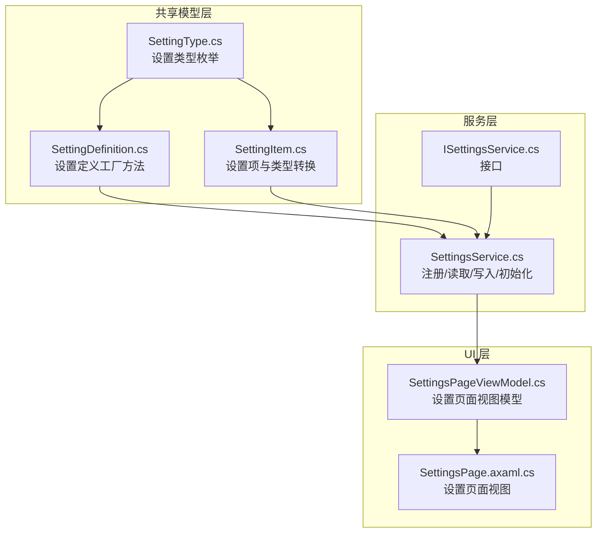
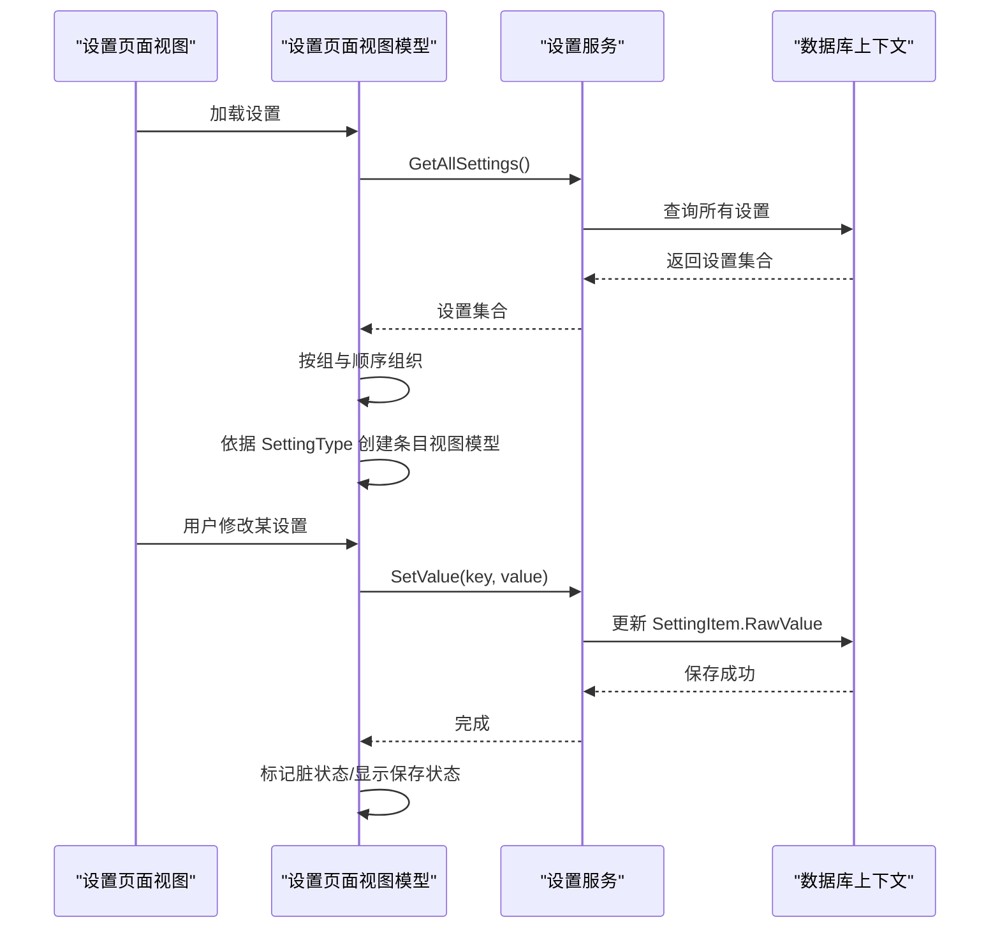
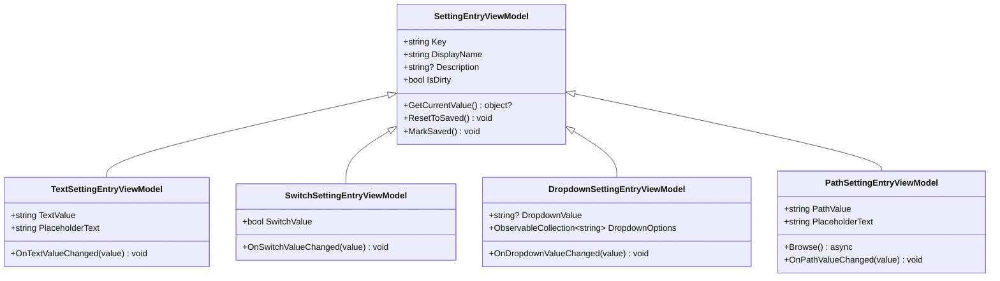
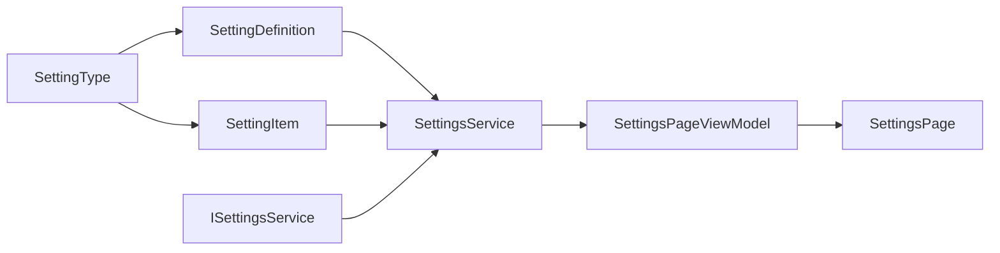

# 设置类型枚举

<cite>
**本文引用的文件**
- [SettingType.cs](file://src/Avalonia.Plugin.Shared/Models/SettingType.cs)
- [SettingDefinition.cs](file://src/Avalonia.Plugin.Shared/Models/SettingDefinition.cs)
- [SettingItem.cs](file://src/Avalonia.Plugin.Shared/Models/SettingItem.cs)
- [ISettingsService.cs](file://src/Avalonia.Plugin.Shared/Services/ISettingsService.cs)
- [SettingsService.cs](file://src/Avalonia.UI/Services/SettingsService.cs)
- [SettingsPageViewModel.cs](file://src/Avalonia.UI/ViewModels/SettingsPageViewModel.cs)
- [SettingsPage.axaml.cs](file://src/Avalonia.UI/Pages/SettingsPage.axaml.cs)
</cite>

## 目录
1. [引言](#引言)
2. [项目结构](#项目结构)
3. [核心组件](#核心组件)
4. [架构总览](#架构总览)
5. [详细组件分析](#详细组件分析)
6. [依赖关系分析](#依赖关系分析)
7. [性能考虑](#性能考虑)
8. [故障排除指南](#故障排除指南)
9. [结论](#结论)
10. [附录](#附录)

## 引言
本文件围绕设置类型枚举 SettingType 及其相关模型与服务，系统性说明设置项的数据类型定义、UI 渲染、验证与序列化流程，并给出扩展与自定义类型的开发指导。当前仓库实现聚焦于文本、开关、下拉列表与路径四类设置类型，通过统一的注册、读取、写入与持久化机制，为应用提供可配置、可分组、可运行时生效的设置体系。

## 项目结构
设置系统由共享模型层（定义设置类型、设置定义、设置项）、服务层（注册、读取、写入、初始化默认值）与 UI 层（设置页面与视图模型）组成。关键文件如下：

**图表来源**
- [SettingType.cs:1-10](file://src/Avalonia.Plugin.Shared/Models/SettingType.cs#L1-L10)
- [SettingDefinition.cs:1-89](file://src/Avalonia.Plugin.Shared/Models/SettingDefinition.cs#L1-L89)
- [SettingItem.cs:1-61](file://src/Avalonia.Plugin.Shared/Models/SettingItem.cs#L1-L61)
- [ISettingsService.cs:1-19](file://src/Avalonia.Plugin.Shared/Services/ISettingsService.cs#L1-L19)
- [SettingsService.cs:1-137](file://src/Avalonia.UI/Services/SettingsService.cs#L1-L137)
- [SettingsPageViewModel.cs:1-329](file://src/Avalonia.UI/ViewModels/SettingsPageViewModel.cs#L1-L329)
- [SettingsPage.axaml.cs:1-11](file://src/Avalonia.UI/Pages/SettingsPage.axaml.cs#L1-L11)

**章节来源**
- [SettingType.cs:1-10](file://src/Avalonia.Plugin.Shared/Models/SettingType.cs#L1-L10)
- [SettingDefinition.cs:1-89](file://src/Avalonia.Plugin.Shared/Models/SettingDefinition.cs#L1-L89)
- [SettingItem.cs:1-61](file://src/Avalonia.Plugin.Shared/Models/SettingItem.cs#L1-L61)
- [ISettingsService.cs:1-19](file://src/Avalonia.Plugin.Shared/Services/ISettingsService.cs#L1-L19)
- [SettingsService.cs:1-137](file://src/Avalonia.UI/Services/SettingsService.cs#L1-L137)
- [SettingsPageViewModel.cs:1-329](file://src/Avalonia.UI/ViewModels/SettingsPageViewModel.cs#L1-L329)
- [SettingsPage.axaml.cs:1-11](file://src/Avalonia.UI/Pages/SettingsPage.axaml.cs#L1-L11)

## 核心组件
- SettingType：设置类型枚举，定义了 Text、Switch、Dropdown、Path 四种类型。
- SettingDefinition：设置定义工厂方法，用于快速构建不同类型的设置项定义。
- SettingItem：设置项实体，负责原始值存储、选项序列化、类型转换与默认值回退。
- ISettingsService/SettingsService：设置服务接口与实现，提供注册、批量注册、读取、写入、按组查询、分组列表、删除与默认值初始化。
- SettingsPageViewModel：设置页面视图模型，负责加载设置、按类型创建对应条目视图模型、保存与重置、运行时应用设置。

**章节来源**
- [SettingType.cs:3-9](file://src/Avalonia.Plugin.Shared/Models/SettingType.cs#L3-L9)
- [SettingDefinition.cs:3-88](file://src/Avalonia.Plugin.Shared/Models/SettingDefinition.cs#L3-L88)
- [SettingItem.cs:5-60](file://src/Avalonia.Plugin.Shared/Models/SettingItem.cs#L5-L60)
- [ISettingsService.cs:5-18](file://src/Avalonia.Plugin.Shared/Services/ISettingsService.cs#L5-L18)
- [SettingsService.cs:8-136](file://src/Avalonia.UI/Services/SettingsService.cs#L8-L136)
- [SettingsPageViewModel.cs:12-140](file://src/Avalonia.UI/ViewModels/SettingsPageViewModel.cs#L12-L140)

## 架构总览
设置系统采用“定义-持久化-读取-渲染-保存”的闭环流程。定义阶段通过 SettingDefinition 工厂方法生成 SettingDefinition；注册阶段由 SettingsService 将定义持久化为 SettingItem；读取阶段通过 SettingsService.GetValue<T>() 获取强类型值；渲染阶段由 SettingsPageViewModel 基于 SettingType 创建对应的条目视图模型；保存阶段将变更写回 SettingItem 并持久化。

**图表来源**
- [SettingsService.cs:85-123](file://src/Avalonia.UI/Services/SettingsService.cs#L85-L123)
- [SettingsPageViewModel.cs:107-139](file://src/Avalonia.UI/ViewModels/SettingsPageViewModel.cs#L107-L139)

## 详细组件分析

### SettingType 枚举与类型特性
- Text：文本输入类型，适用于任意字符串，支持占位符与默认值。
- Switch：布尔开关类型，内部以字符串形式存储 true/false 或 1/0，读取时自动转换为 bool。
- Dropdown：下拉列表类型，支持预定义选项集，选项以 JSON 序列化存储于 OptionsJson。
- Path：路径选择类型，适用于文件或目录路径，通常配合文件选择器使用。

特点与适用场景
- Text：适合用户可自由编辑的字符串，如用户名、描述等。
- Switch：适合二元开关，如启用/禁用、显示/隐藏等。
- Dropdown：适合有限集合的选择，如主题、语言、单位等。
- Path：适合需要交互式选择的文件或目录路径。

限制条件
- 所有类型均以字符串形式持久化，读取时通过 SettingItem.GetValue<T>() 进行类型转换。
- Switch 的布尔转换接受 "true"/"false" 与 "1"/"0" 两种常见形式。
- Dropdown 的选项通过 JSON 序列化/反序列化存储，需保证选项列表可被正确序列化。

**章节来源**
- [SettingType.cs:3-9](file://src/Avalonia.Plugin.Shared/Models/SettingType.cs#L3-L9)
- [SettingDefinition.cs:19-87](file://src/Avalonia.Plugin.Shared/Models/SettingDefinition.cs#L19-L87)
- [SettingItem.cs:22-32](file://src/Avalonia.Plugin.Shared/Models/SettingItem.cs#L22-L32)
- [SettingItem.cs:34-50](file://src/Avalonia.Plugin.Shared/Models/SettingItem.cs#L34-L50)

### SettingDefinition 工厂方法
- Text(key, displayName, ...)：创建文本类型设置定义，支持占位符与默认值。
- Switch(key, displayName, ..., defaultValue: bool)：创建开关类型设置定义，默认值会转换为字符串形式存储。
- Dropdown(key, displayName, options, ..., defaultValue)：创建下拉类型设置定义，options 作为选项列表传入。
- Path(key, displayName, ...)：创建路径类型设置定义，适用于文件/目录选择。

使用建议
- 为每个设置提供清晰的 DisplayName 与可选的 Description，便于 UI 展示。
- 合理设置 GroupName、GroupOrder、ItemOrder，控制设置分组与排序。
- 对于 Switch 类型，确保默认值符合预期；对于 Dropdown 类型，确保选项完整且稳定。

**章节来源**
- [SettingDefinition.cs:19-87](file://src/Avalonia.Plugin.Shared/Models/SettingDefinition.cs#L19-L87)

### SettingItem 类型转换与序列化
- OptionsJson：下拉选项的 JSON 序列化字段，提供 GetOptions()/SetOptions() 方法进行读写。
- GetValue<T>()：根据类型进行转换，支持 bool、int、double 与字符串；空值优先使用 DefaultValue。
- SetValue(object?)：将值转换为字符串形式存储，布尔值转换为 "true"/"false"。

复杂度与性能
- 序列化/反序列化选项列表的时间复杂度为 O(n)，n 为选项数量。
- 类型转换为 O(1)，字符串解析为 O(m)，m 为数值字符串长度。

**章节来源**
- [SettingItem.cs:22-32](file://src/Avalonia.Plugin.Shared/Models/SettingItem.cs#L22-L32)
- [SettingItem.cs:34-50](file://src/Avalonia.Plugin.Shared/Models/SettingItem.cs#L34-L50)
- [SettingItem.cs:52-59](file://src/Avalonia.Plugin.Shared/Models/SettingItem.cs#L52-L59)

### ISettingsService 与 SettingsService 实现
职责
- 注册单个或多个设置定义，若键已存在则更新非选项字段，否则新增并填充默认值。
- 提供 GetValue<T>()、GetValue(string)、SetValue(string, object?) 等读写接口。
- 支持按组查询、获取分组列表、删除设置与初始化默认设置。

默认设置初始化
- 在初始化阶段注册若干默认设置，如主题、侧边栏折叠状态、用户名等。

**章节来源**
- [ISettingsService.cs:5-18](file://src/Avalonia.Plugin.Shared/Services/ISettingsService.cs#L5-L18)
- [SettingsService.cs:17-55](file://src/Avalonia.UI/Services/SettingsService.cs#L17-L55)
- [SettingsService.cs:65-74](file://src/Avalonia.UI/Services/SettingsService.cs#L65-L74)
- [SettingsService.cs:76-83](file://src/Avalonia.UI/Services/SettingsService.cs#L76-L83)
- [SettingsService.cs:125-135](file://src/Avalonia.UI/Services/SettingsService.cs#L125-L135)

### 设置页面与视图模型
- 加载设置：从 SettingsService 获取全部设置，按组与顺序组织，创建对应条目视图模型。
- 条目类型映射：根据 SettingType 创建 TextSettingEntryViewModel、SwitchSettingEntryViewModel、DropdownSettingEntryViewModel、PathSettingEntryViewModel。
- 保存与重置：遍历脏条目调用 SettingsService.SetValue 写入，标记已保存；重置时恢复到已保存值。
- 运行时应用：保存后根据主题设置切换应用主题变体。

**图表来源**
- [SettingsPageViewModel.cs:155-329](file://src/Avalonia.UI/ViewModels/SettingsPageViewModel.cs#L155-L329)

**章节来源**
- [SettingsPageViewModel.cs:107-139](file://src/Avalonia.UI/ViewModels/SettingsPageViewModel.cs#L107-L139)
- [SettingsPageViewModel.cs:185-214](file://src/Avalonia.UI/ViewModels/SettingsPageViewModel.cs#L185-L214)
- [SettingsPageViewModel.cs:216-243](file://src/Avalonia.UI/ViewModels/SettingsPageViewModel.cs#L216-L243)
- [SettingsPageViewModel.cs:245-274](file://src/Avalonia.UI/ViewModels/SettingsPageViewModel.cs#L245-L274)
- [SettingsPageViewModel.cs:276-329](file://src/Avalonia.UI/ViewModels/SettingsPageViewModel.cs#L276-L329)

## 依赖关系分析
- SettingType 被 SettingDefinition 与 SettingItem 使用，是类型选择与渲染的基础。
- SettingDefinition 仅用于构建 SettingItem，不直接参与持久化。
- SettingItem 负责类型转换与选项序列化，是服务层读写的实体。
- SettingsService 依赖 AppDbContext（通过 IDbContextFactory）进行持久化操作。
- SettingsPageViewModel 依赖 ISettingsService 进行设置管理，并驱动 UI 更新。

**图表来源**
- [SettingType.cs:3-9](file://src/Avalonia.Plugin.Shared/Models/SettingType.cs#L3-L9)
- [SettingDefinition.cs:11](file://src/Avalonia.Plugin.Shared/Models/SettingDefinition.cs#L11)
- [SettingItem.cs:14](file://src/Avalonia.Plugin.Shared/Models/SettingItem.cs#L14)
- [SettingsService.cs:10-15](file://src/Avalonia.UI/Services/SettingsService.cs#L10-L15)
- [SettingsPageViewModel.cs:14](file://src/Avalonia.UI/ViewModels/SettingsPageViewModel.cs#L14)

**章节来源**
- [SettingDefinition.cs:11](file://src/Avalonia.Plugin.Shared/Models/SettingDefinition.cs#L11)
- [SettingItem.cs:14](file://src/Avalonia.Plugin.Shared/Models/SettingItem.cs#L14)
- [SettingsService.cs:10-15](file://src/Avalonia.UI/Services/SettingsService.cs#L10-L15)
- [SettingsPageViewModel.cs:14](file://src/Avalonia.UI/ViewModels/SettingsPageViewModel.cs#L14)

## 性能考虑
- 类型转换：GetValue<T>() 为常数时间操作，开销极低。
- 选项序列化：下拉选项的序列化/反序列化成本与选项数量线性相关，建议控制选项规模或延迟加载。
- 数据库访问：注册、读取、写入均涉及数据库操作，建议批量操作时合并事务以减少往返。
- UI 绑定：视图模型对 IsDirty 的标记与保存状态提示避免不必要的刷新。

## 故障排除指南
- 读取值为空：检查 DefaultValue 是否设置，或确认数据库中是否存在该键。
- 布尔值读取异常："true"/"false" 与 "1"/"0" 均可识别，若出现解析错误，请确认存储值格式。
- 下拉选项不显示：确认 OptionsJson 是否正确序列化，且 UI 正确调用 GetOptions()。
- 保存未生效：确认已触发保存命令，且 SetValue 已成功写入数据库；检查运行时应用逻辑是否覆盖了设置。

**章节来源**
- [SettingItem.cs:34-50](file://src/Avalonia.Plugin.Shared/Models/SettingItem.cs#L34-L50)
- [SettingItem.cs:22-32](file://src/Avalonia.Plugin.Shared/Models/SettingItem.cs#L22-L32)
- [SettingsService.cs:76-83](file://src/Avalonia.UI/Services/SettingsService.cs#L76-L83)
- [SettingsPageViewModel.cs:37-62](file://src/Avalonia.UI/ViewModels/SettingsPageViewModel.cs#L37-L62)

## 结论
SettingType 与相关模型提供了简洁而强大的设置系统基础：以统一的类型枚举与工厂方法定义设置，以 SettingItem 负责类型转换与序列化，以 SettingsService 提供稳定的注册与读写能力，并通过 SettingsPageViewModel 将设置与 UI 紧密结合。当前实现覆盖常用设置类型，具备良好的扩展性，可按需增加新的设置类型与对应的 UI 条目视图模型。

## 附录

### 不同设置类型的创建、验证与转换示例（路径引用）
- 文本设置创建与默认值
  - [SettingDefinition.Text(...) 示例:133-134](file://src/Avalonia.UI/Services/SettingsService.cs#L133-L134)
- 开关设置创建与默认值
  - [SettingDefinition.Switch(...) 示例:130-131](file://src/Avalonia.UI/Services/SettingsService.cs#L130-L131)
- 下拉设置创建与选项
  - [SettingDefinition.Dropdown(...) 示例:127-128](file://src/Avalonia.UI/Services/SettingsService.cs#L127-L128)
- 路径设置创建
  - [SettingDefinition.Path(...) 示例:127-128](file://src/Avalonia.UI/Services/SettingsService.cs#L127-L128)
- 读取与写入
  - [GetValue<T>(key):65-69](file://src/Avalonia.UI/Services/SettingsService.cs#L65-L69)
  - [GetValue(key):71-74](file://src/Avalonia.UI/Services/SettingsService.cs#L71-L74)
  - [SetValue(key, value):76-83](file://src/Avalonia.UI/Services/SettingsService.cs#L76-L83)
- 类型转换
  - [GetValue<T>() 实现:34-50](file://src/Avalonia.Plugin.Shared/Models/SettingItem.cs#L34-L50)
  - [SetValue(object?) 实现:52-59](file://src/Avalonia.Plugin.Shared/Models/SettingItem.cs#L52-L59)

### 设置类型扩展与自定义类型开发指导
- 新增类型枚举值
  - 在 SettingType 中添加新类型标识。
  - 在 SettingDefinition 中添加对应的工厂方法，处理默认值与占位符等。
- 新增 UI 条目视图模型
  - 在 SettingsPageViewModel 中新增条目视图模型类，实现 GetCurrentValue()/ResetToSaved()/MarkSaved()。
  - 在类型映射处添加新类型的分支，返回新条目视图模型实例。
- 新增持久化与序列化
  - 若新类型需要额外选项或特殊序列化，可在 SettingItem 中扩展相应字段与方法。
- 新增运行时应用逻辑
  - 在 SettingsPageViewModel.ApplyRuntimeSettings() 中添加新类型的运行时应用逻辑。

**章节来源**
- [SettingType.cs:3-9](file://src/Avalonia.Plugin.Shared/Models/SettingType.cs#L3-L9)
- [SettingDefinition.cs:19-87](file://src/Avalonia.Plugin.Shared/Models/SettingDefinition.cs#L19-L87)
- [SettingsPageViewModel.cs:129-139](file://src/Avalonia.UI/ViewModels/SettingsPageViewModel.cs#L129-L139)
- [SettingItem.cs:22-32](file://src/Avalonia.Plugin.Shared/Models/SettingItem.cs#L22-L32)
- [SettingItem.cs:34-50](file://src/Avalonia.Plugin.Shared/Models/SettingItem.cs#L34-L50)
- [SettingsPageViewModel.cs:81-99](file://src/Avalonia.UI/ViewModels/SettingsPageViewModel.cs#L81-L99)