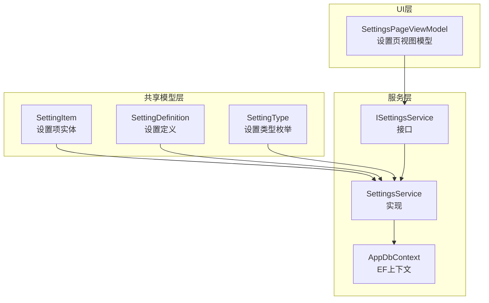
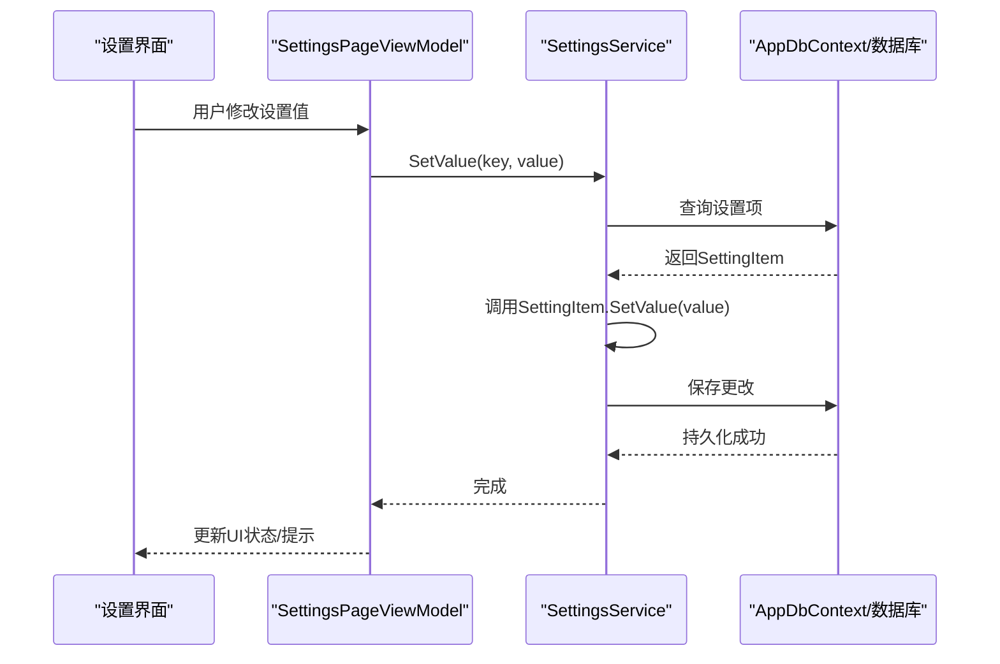
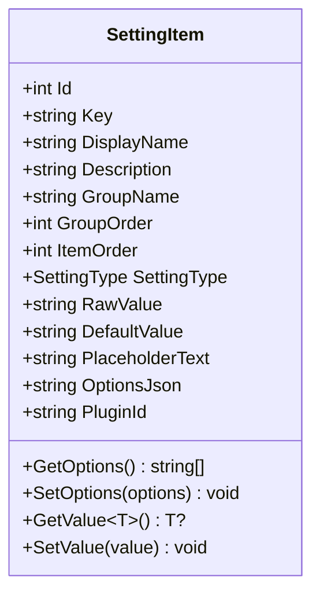
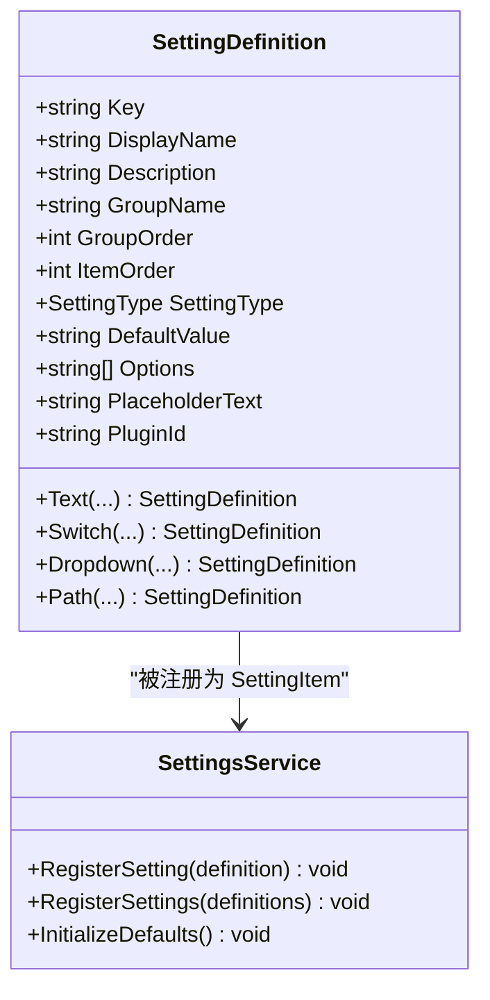
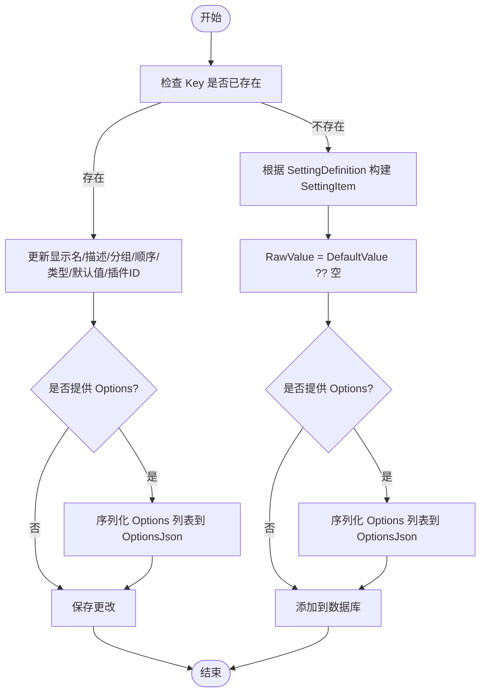
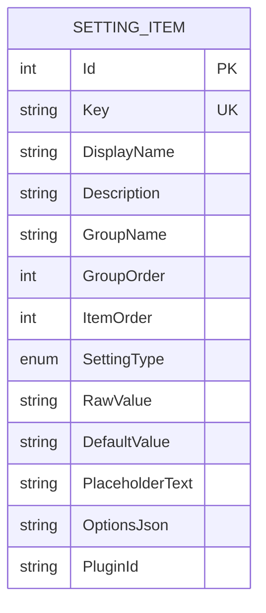
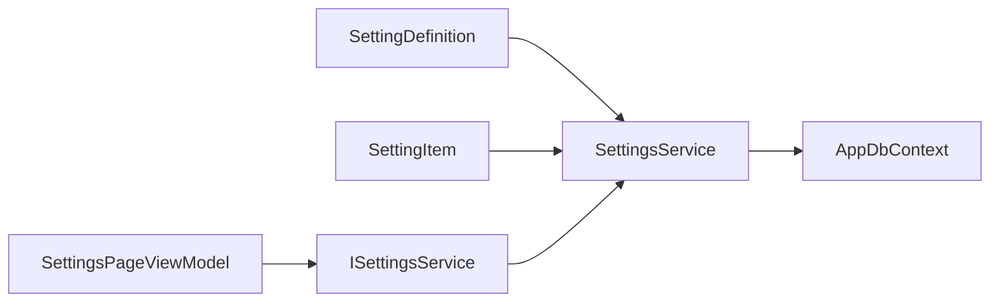

# 设置项模型

<cite>
**本文档引用的文件**
- [SettingItem.cs](file://src/Avalonia.Plugin.Shared/Models/SettingItem.cs)
- [SettingDefinition.cs](file://src/Avalonia.Plugin.Shared/Models/SettingDefinition.cs)
- [SettingType.cs](file://src/Avalonia.Plugin.Shared/Models/SettingType.cs)
- [ISettingsService.cs](file://src/Avalonia.Plugin.Shared/Services/ISettingsService.cs)
- [SettingsService.cs](file://src/Avalonia.UI/Services/SettingsService.cs)
- [AppDbContext.cs](file://src/Avalonia.UI/Data/AppDbContext.cs)
- [SettingsPageViewModel.cs](file://src/Avalonia.UI/ViewModels/SettingsPageViewModel.cs)
</cite>

## 目录
1. [简介](#简介)
2. [项目结构](#项目结构)
3. [核心组件](#核心组件)
4. [架构总览](#架构总览)
5. [详细组件分析](#详细组件分析)
6. [依赖关系分析](#依赖关系分析)
7. [性能考虑](#性能考虑)
8. [故障排除指南](#故障排除指南)
9. [结论](#结论)

## 简介
本文件系统性地阐述设置项模型（SettingItem）的设计与实现，涵盖其数据结构、类型转换、默认值处理、存储机制、序列化格式、持久化策略，以及与设置定义模型（SettingDefinition）的关系与一致性保障。同时提供创建、读取、更新、删除操作的实践示例，并说明设置项在应用配置管理中的作用及性能优化建议。

## 项目结构
设置项模型位于共享层（Avalonia.Plugin.Shared），服务层（Avalonia.UI.Services）负责持久化与业务逻辑，视图模型层（Avalonia.UI/ViewModels）负责UI交互与运行时应用。

图表来源
- [SettingItem.cs:1-61](file://src/Avalonia.Plugin.Shared/Models/SettingItem.cs#L1-L61)
- [SettingDefinition.cs:1-89](file://src/Avalonia.Plugin.Shared/Models/SettingDefinition.cs#L1-L89)
- [SettingType.cs:1-10](file://src/Avalonia.Plugin.Shared/Models/SettingType.cs#L1-L10)
- [ISettingsService.cs:1-19](file://src/Avalonia.Plugin.Shared/Services/ISettingsService.cs#L1-L19)
- [SettingsService.cs:1-137](file://src/Avalonia.UI/Services/SettingsService.cs#L1-L137)
- [AppDbContext.cs:1-30](file://src/Avalonia.UI/Data/AppDbContext.cs#L1-L30)
- [SettingsPageViewModel.cs:1-329](file://src/Avalonia.UI/ViewModels/SettingsPageViewModel.cs#L1-L329)

章节来源
- [SettingItem.cs:1-61](file://src/Avalonia.Plugin.Shared/Models/SettingItem.cs#L1-L61)
- [SettingDefinition.cs:1-89](file://src/Avalonia.Plugin.Shared/Models/SettingDefinition.cs#L1-L89)
- [SettingType.cs:1-10](file://src/Avalonia.Plugin.Shared/Models/SettingType.cs#L1-L10)
- [ISettingsService.cs:1-19](file://src/Avalonia.Plugin.Shared/Services/ISettingsService.cs#L1-L19)
- [SettingsService.cs:1-137](file://src/Avalonia.UI/Services/SettingsService.cs#L1-L137)
- [AppDbContext.cs:1-30](file://src/Avalonia.UI/Data/AppDbContext.cs#L1-L30)
- [SettingsPageViewModel.cs:1-329](file://src/Avalonia.UI/ViewModels/SettingsPageViewModel.cs#L1-L329)

## 核心组件
- SettingItem：设置项实体，承载键值对、显示名、描述、分组信息、类型、原始值、默认值、选项列表、占位符等字段；提供选项序列化/反序列化与泛型值读取/写入能力。
- SettingDefinition：设置定义，用于声明设置项的元数据（键、显示名、描述、分组、顺序、类型、默认值、可选项、插件ID等），并提供多种静态工厂方法快速构建常见设置类型。
- SettingType：设置类型枚举，支持文本、开关、下拉、路径四类。
- ISettingsService/SettingsService：设置服务接口与实现，负责注册设置、读取/写入值、按组查询、初始化默认设置、删除设置等；基于Entity Framework Core持久化到数据库。
- AppDbContext：EF Core上下文，映射SettingItem为数据库表，定义索引与字段约束。
- SettingsPageViewModel：设置页面视图模型，负责加载设置、组织分组、驱动UI控件与运行时应用变更。

章节来源
- [SettingItem.cs:5-60](file://src/Avalonia.Plugin.Shared/Models/SettingItem.cs#L5-L60)
- [SettingDefinition.cs:3-88](file://src/Avalonia.Plugin.Shared/Models/SettingDefinition.cs#L3-L88)
- [SettingType.cs:3-9](file://src/Avalonia.Plugin.Shared/Models/SettingType.cs#L3-L9)
- [ISettingsService.cs:5-18](file://src/Avalonia.Plugin.Shared/Services/ISettingsService.cs#L5-L18)
- [SettingsService.cs:8-136](file://src/Avalonia.UI/Services/SettingsService.cs#L8-L136)
- [AppDbContext.cs:6-28](file://src/Avalonia.UI/Data/AppDbContext.cs#L6-L28)
- [SettingsPageViewModel.cs:12-140](file://src/Avalonia.UI/ViewModels/SettingsPageViewModel.cs#L12-L140)

## 架构总览
设置项模型通过服务层与EF Core进行数据持久化，UI层通过视图模型与服务交互，实现设置的可视化编辑与运行时应用。

图表来源
- [SettingsService.cs:76-83](file://src/Avalonia.UI/Services/SettingsService.cs#L76-L83)
- [SettingItem.cs:52-59](file://src/Avalonia.Plugin.Shared/Models/SettingItem.cs#L52-L59)
- [AppDbContext.cs:6-28](file://src/Avalonia.UI/Data/AppDbContext.cs#L6-L28)

## 详细组件分析

### SettingItem 数据结构与业务逻辑
- 字段设计
  - 标识与元信息：Id、Key、DisplayName、Description、GroupName、GroupOrder、ItemOrder、PluginId
  - 类型与值：SettingType、RawValue、DefaultValue、PlaceholderText
  - 选项：OptionsJson（JSON序列化的字符串列表）
- 值处理
  - 读取：GetValue<T>() 支持 bool/int/double 的解析，其他类型返回字符串；空值优先使用DefaultValue
  - 写入：SetValue(object) 将布尔值映射为 "true"/"false"，其他类型转为字符串
  - 选项：GetOptions()/SetOptions() 基于 System.Text.Json 进行序列化/反序列化
- 默认值与占位符
  - DefaultValue 为空时，读取时回退到 RawValue
  - PlaceholderText 用于UI输入控件的提示文本

图表来源
- [SettingItem.cs:5-60](file://src/Avalonia.Plugin.Shared/Models/SettingItem.cs#L5-L60)

章节来源
- [SettingItem.cs:7-18](file://src/Avalonia.Plugin.Shared/Models/SettingItem.cs#L7-L18)
- [SettingItem.cs:22-32](file://src/Avalonia.Plugin.Shared/Models/SettingItem.cs#L22-L32)
- [SettingItem.cs:34-50](file://src/Avalonia.Plugin.Shared/Models/SettingItem.cs#L34-L50)
- [SettingItem.cs:52-59](file://src/Avalonia.Plugin.Shared/Models/SettingItem.cs#L52-L59)

### SettingDefinition 与 SettingItem 的关系
- SettingDefinition 是 SettingItem 的“蓝图”：包含键、显示名、描述、分组、顺序、类型、默认值、可选项、插件ID等元信息
- 注册流程：SettingsService.RegisterSetting(SettingDefinition) 将定义转换为 SettingItem 并持久化；若键已存在则更新元信息与默认值
- 一致性保障：Key 唯一索引确保键冲突；DefaultValue 与 Options 通过 SettingItem 的 SetValue/GetOptions/SetOptions 保持一致

图表来源
- [SettingDefinition.cs:3-88](file://src/Avalonia.Plugin.Shared/Models/SettingDefinition.cs#L3-L88)
- [SettingsService.cs:17-55](file://src/Avalonia.UI/Services/SettingsService.cs#L17-L55)

章节来源
- [SettingDefinition.cs:19-87](file://src/Avalonia.Plugin.Shared/Models/SettingDefinition.cs#L19-L87)
- [SettingsService.cs:17-55](file://src/Avalonia.UI/Services/SettingsService.cs#L17-L55)

### 存储机制、序列化格式与持久化策略
- EF Core 映射
  - DbSet<SettingItem> Settings
  - 主键：Id；唯一索引：Key
  - 字段长度限制：Key/DisplayName/GroupName/RawValue/DefaultValue/OptionsJson/PluginId 等
- 序列化
  - OptionsJson 使用 System.Text.Json 对 List<string> 进行序列化/反序列化
- 持久化策略
  - 新增：根据 SettingDefinition 创建 SettingItem，RawValue 初始化为 DefaultValue 或空
  - 更新：若键已存在，仅更新元信息与默认值，必要时更新 OptionsJson
  - 删除：按 Key 查找并移除
  - 查询：支持按组查询、获取所有设置并排序、获取分组列表

图表来源
- [SettingsService.cs:17-55](file://src/Avalonia.UI/Services/SettingsService.cs#L17-L55)
- [SettingItem.cs:22-32](file://src/Avalonia.Plugin.Shared/Models/SettingItem.cs#L22-L32)
- [AppDbContext.cs:14-28](file://src/Avalonia.UI/Data/AppDbContext.cs#L14-L28)

章节来源
- [AppDbContext.cs:14-28](file://src/Avalonia.UI/Data/AppDbContext.cs#L14-L28)
- [SettingsService.cs:17-55](file://src/Avalonia.UI/Services/SettingsService.cs#L17-L55)
- [SettingItem.cs:22-32](file://src/Avalonia.Plugin.Shared/Models/SettingItem.cs#L22-L32)

### 设置项的 CRUD 操作示例
- 创建/注册
  - 使用 SettingDefinition 工厂方法创建定义，调用 SettingsService.RegisterSetting 或 RegisterSettings
  - 参考：[SettingDefinition.Text/Switch/Dropdown/Path:19-87](file://src/Avalonia.Plugin.Shared/Models/SettingDefinition.cs#L19-L87)，[SettingsService.RegisterSetting:17-55](file://src/Avalonia.UI/Services/SettingsService.cs#L17-L55)
- 读取
  - 获取单个设置：ISettingsService.GetSetting(key) 或 GetValue<T>(key)
  - 获取全部/按组：GetAllSettings()/GetSettingsByGroup(groupName)/GetGroups()
  - 参考：[ISettingsService 接口:5-18](file://src/Avalonia.Plugin.Shared/Services/ISettingsService.cs#L5-L18)，[SettingsService 实现:85-108](file://src/Avalonia.UI/Services/SettingsService.cs#L85-L108)
- 更新
  - SetValue(key, value)：将值写入 RawValue 并持久化
  - 参考：[SettingsService.SetValue:76-83](file://src/Avalonia.UI/Services/SettingsService.cs#L76-L83)，[SettingItem.SetValue:52-59](file://src/Avalonia.Plugin.Shared/Models/SettingItem.cs#L52-L59)
- 删除
  - RemoveSetting(key)：按键删除设置项
  - 参考：[SettingsService.RemoveSetting:116-123](file://src/Avalonia.UI/Services/SettingsService.cs#L116-L123)

章节来源
- [SettingDefinition.cs:19-87](file://src/Avalonia.Plugin.Shared/Models/SettingDefinition.cs#L19-L87)
- [ISettingsService.cs:7-17](file://src/Avalonia.Plugin.Shared/Services/ISettingsService.cs#L7-L17)
- [SettingsService.cs:17-123](file://src/Avalonia.UI/Services/SettingsService.cs#L17-L123)
- [SettingItem.cs:52-59](file://src/Avalonia.Plugin.Shared/Models/SettingItem.cs#L52-L59)

### 与设置定义模型的关系与一致性保证
- 关系
  - SettingDefinition 描述设置的“规范”，SettingItem 表示数据库中的“实例”
  - 注册时由 SettingDefinition 生成 SettingItem，后续通过键关联
- 一致性
  - Key 唯一性：数据库唯一索引防止重复键
  - 默认值与类型：SettingDefinition 提供默认值，SettingItem.GetValue<T>() 在空值时回退
  - 选项同步：Options 通过 JSON 序列化在 SettingDefinition 与 SettingItem 之间保持一致

图表来源
- [AppDbContext.cs:16-27](file://src/Avalonia.UI/Data/AppDbContext.cs#L16-L27)

章节来源
- [AppDbContext.cs:16-27](file://src/Avalonia.UI/Data/AppDbContext.cs#L16-L27)
- [SettingDefinition.cs:19-87](file://src/Avalonia.Plugin.Shared/Models/SettingDefinition.cs#L19-L87)
- [SettingItem.cs:34-50](file://src/Avalonia.Plugin.Shared/Models/SettingItem.cs#L34-L50)

### 在应用配置管理中的作用与运行时应用
- 配置管理
  - SettingsPageViewModel 加载所有设置并按分组组织，驱动不同类型的设置条目（文本、开关、下拉、路径）
  - 保存时逐项调用 SetValue，标记脏状态并应用运行时设置
- 运行时应用
  - 例如根据 App.Theme 的值切换主题变体
- 参考
  - [SettingsPageViewModel.Save:38-62](file://src/Avalonia.UI/ViewModels/SettingsPageViewModel.cs#L38-L62)
  - [SettingsPageViewModel.ApplyRuntimeSettings:81-99](file://src/Avalonia.UI/ViewModels/SettingsPageViewModel.cs#L81-L99)

章节来源
- [SettingsPageViewModel.cs:38-99](file://src/Avalonia.UI/ViewModels/SettingsPageViewModel.cs#L38-L99)

## 依赖关系分析
- 组件耦合
  - SettingItem 与 SettingDefinition 通过注册流程耦合，键作为契约
  - SettingsService 同时依赖 SettingDefinition 与 SettingItem，承担数据转换与持久化职责
  - AppDbContext 仅依赖 SettingItem，提供数据访问层
  - SettingsPageViewModel 依赖 ISettingsService，不直接依赖 EF Core
- 外部依赖
  - System.Text.Json：用于选项序列化
  - Entity Framework Core：用于数据库访问与映射

图表来源
- [SettingDefinition.cs:3-88](file://src/Avalonia.Plugin.Shared/Models/SettingDefinition.cs#L3-L88)
- [SettingItem.cs:5-60](file://src/Avalonia.Plugin.Shared/Models/SettingItem.cs#L5-L60)
- [SettingsService.cs:8-15](file://src/Avalonia.UI/Services/SettingsService.cs#L8-L15)
- [AppDbContext.cs:6-12](file://src/Avalonia.UI/Data/AppDbContext.cs#L6-L12)
- [SettingsPageViewModel.cs:12-29](file://src/Avalonia.UI/ViewModels/SettingsPageViewModel.cs#L12-L29)

章节来源
- [SettingsService.cs:8-15](file://src/Avalonia.UI/Services/SettingsService.cs#L8-L15)
- [AppDbContext.cs:6-12](file://src/Avalonia.UI/Data/AppDbContext.cs#L6-L12)
- [SettingsPageViewModel.cs:12-29](file://src/Avalonia.UI/ViewModels/SettingsPageViewModel.cs#L12-L29)

## 性能考虑
- 序列化开销
  - 选项列表采用 JSON 序列化，建议控制选项数量与字符串长度，避免 OptionsJson 过大
- 查询与排序
  - 按组查询与全量查询均使用数据库排序，注意 GroupOrder/ItemOrder 的索引与数据规模
- 写入频率
  - SetValue 每次修改都会触发一次数据库写入，批量保存时建议合并提交以减少往返
- UI 层
  - 视图模型中对每个设置项维护脏状态，避免不必要的保存操作

## 故障排除指南
- 键冲突
  - 现象：注册时报唯一键冲突
  - 处理：确保 Key 全局唯一，或先删除再注册
  - 参考：[AppDbContext 唯一键定义](file://src/Avalonia.UI/Data/AppDbContext.cs#L19)
- 选项解析失败
  - 现象：GetOptions 返回空列表
  - 处理：确认 OptionsJson 格式正确且非空
  - 参考：[SettingItem.GetOptions/SetOptions:22-32](file://src/Avalonia.Plugin.Shared/Models/SettingItem.cs#L22-L32)
- 类型转换异常
  - 现象：GetValue<int/double> 解析失败
  - 处理：确保 RawValue/DefaultValue 为可解析格式，布尔值使用 "true"/"false" 或 "1"/"0"
  - 参考：[SettingItem.GetValue<T>:34-50](file://src/Avalonia.Plugin.Shared/Models/SettingItem.cs#L34-L50)
- 未找到设置
  - 现象：GetValue/SetValue 返回空或无效果
  - 处理：确认键是否存在，必要时调用 InitializeDefaults 初始化默认设置
  - 参考：[SettingsService.InitializeDefaults:125-135](file://src/Avalonia.UI/Services/SettingsService.cs#L125-L135)

章节来源
- [AppDbContext.cs:19](file://src/Avalonia.UI/Data/AppDbContext.cs#L19)
- [SettingItem.cs:22-32](file://src/Avalonia.Plugin.Shared/Models/SettingItem.cs#L22-L32)
- [SettingItem.cs:34-50](file://src/Avalonia.Plugin.Shared/Models/SettingItem.cs#L34-L50)
- [SettingsService.cs:125-135](file://src/Avalonia.UI/Services/SettingsService.cs#L125-L135)

## 结论
SettingItem 作为设置项的核心实体，通过清晰的字段设计、完善的类型转换与默认值回退机制、基于 JSON 的选项序列化，以及 EF Core 的强约束持久化，实现了稳定可靠的配置管理能力。配合 SettingDefinition 的声明式定义与 SettingsService 的统一服务接口，既满足了 UI 层的灵活展示与运行时应用，又保证了数据一致性与扩展性。在实际使用中，应关注键唯一性、选项大小与类型转换规则，并结合批量保存策略提升性能。