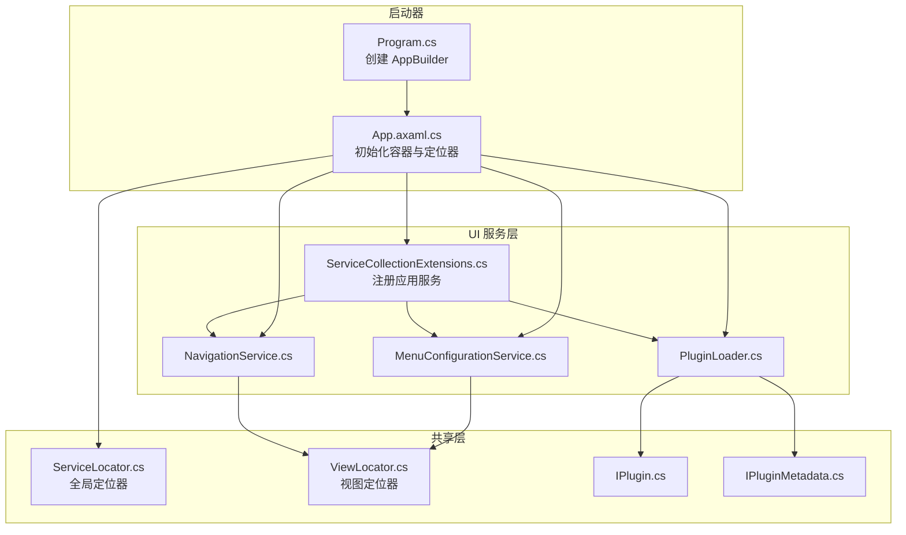
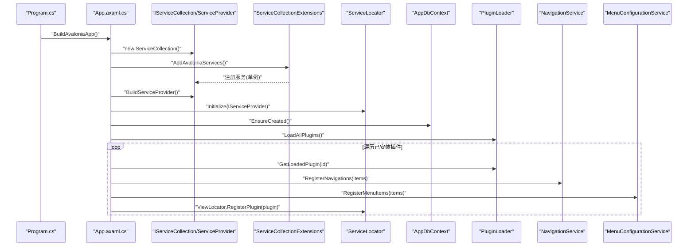
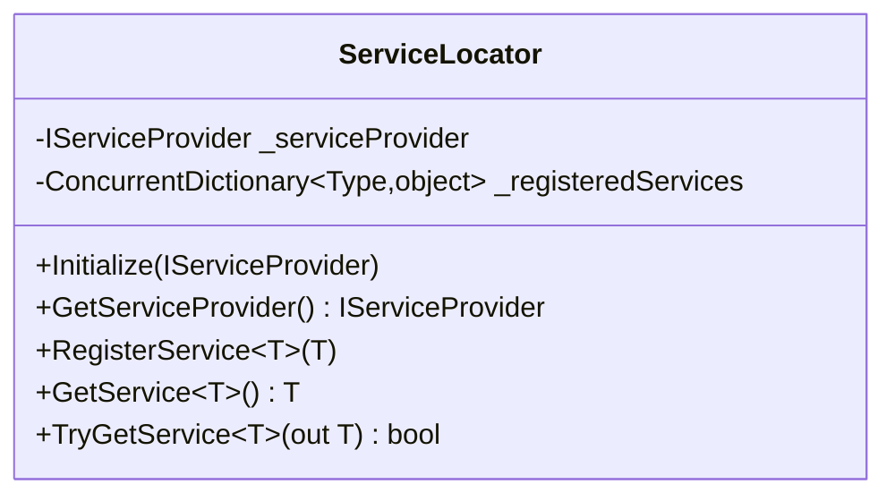
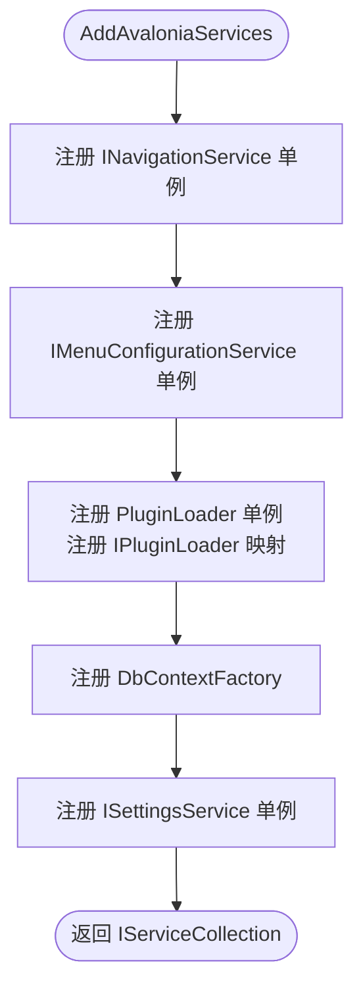
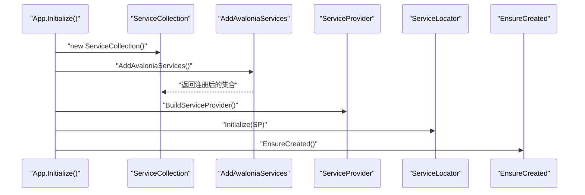
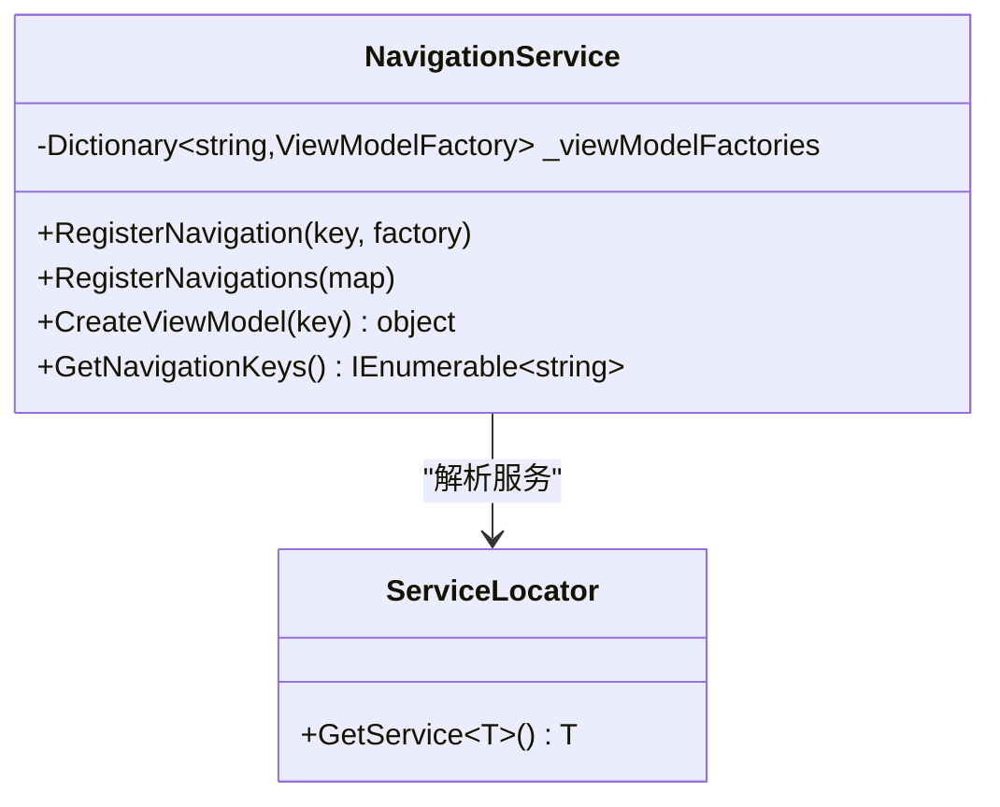
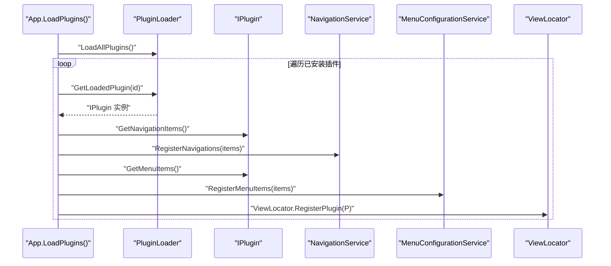
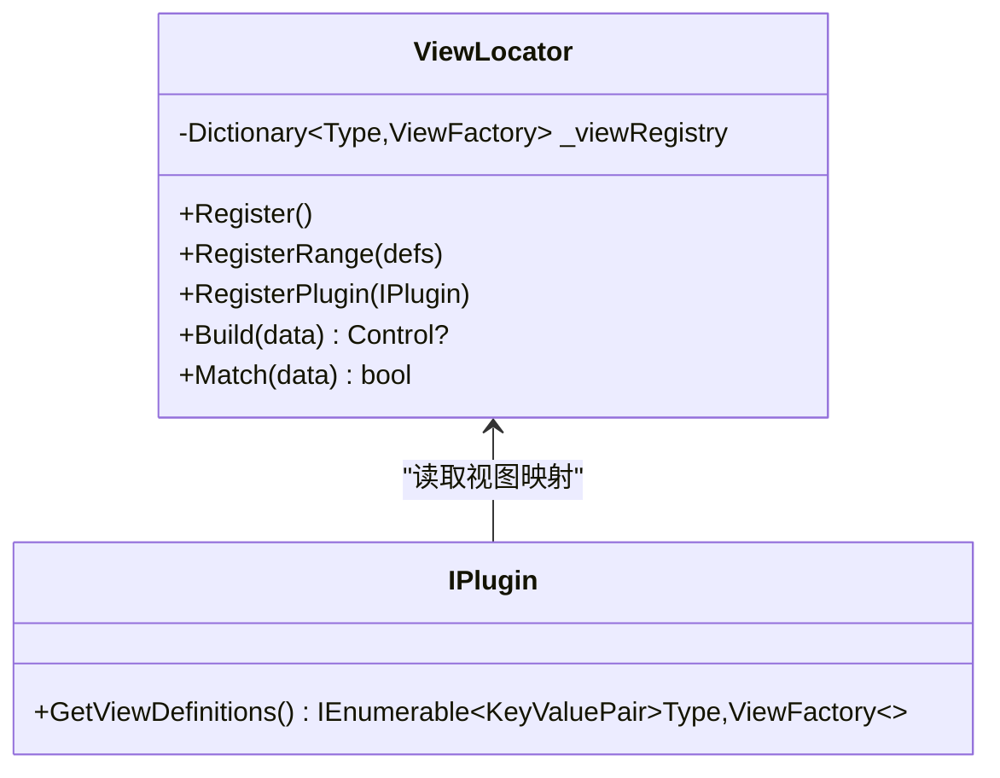
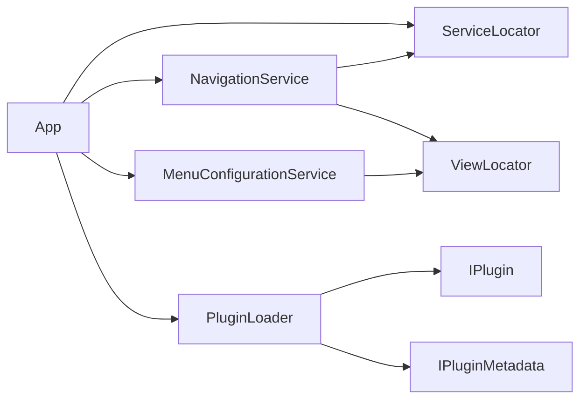

# 依赖注入模式

<cite>
**本文引用的文件**
- [ServiceLocator.cs](file://src/Avalonia.Plugin.Shared/ServiceLocator.cs)
- [ServiceCollectionExtensions.cs](file://src/Avalonia.UI/Services/ServiceCollectionExtensions.cs)
- [App.axaml.cs](file://src/launcher/Avalonia.Launcher.Desktop/App.axaml.cs)
- [Program.cs](file://src/launcher/Avalonia.Launcher.Desktop/Program.cs)
- [NavigationService.cs](file://src/Avalonia.UI/Services/NavigationService.cs)
- [MenuConfigurationService.cs](file://src/Avalonia.UI/Services/MenuConfigurationService.cs)
- [PluginLoader.cs](file://src/Avalonia.UI/Services/PluginLoader.cs)
- [IPlugin.cs](file://src/Avalonia.Plugin.Shared/IPlugin.cs)
- [IPluginMetadata.cs](file://src/Avalonia.Plugin.Shared/IPluginMetadata.cs)
- [ViewLocator.cs](file://src/Avalonia.Plugin.Shared/ViewLocator.cs)
</cite>

## 目录
1. [简介](#简介)
2. [项目结构](#项目结构)
3. [核心组件](#核心组件)
4. [架构总览](#架构总览)
5. [详细组件分析](#详细组件分析)
6. [依赖关系分析](#依赖关系分析)
7. [性能考量](#性能考量)
8. [故障排查指南](#故障排查指南)
9. [结论](#结论)
10. [附录](#附录)

## 简介
本文件系统性阐述 AvaloniaTemplate 中的依赖注入模式，围绕以下主题展开：
- 依赖注入容器的配置与使用：服务注册、生命周期管理、解析机制
- 服务定位器的实现原理及其在应用中的作用
- 如何通过依赖注入实现松耦合设计与服务间依赖管理
- 不同生命周期（单例、瞬态、作用域）的使用场景与策略
- 最佳实践与常见陷阱

## 项目结构
AvaloniaTemplate 采用“多模块+插件化”的组织方式，依赖注入主要集中在 UI 层与共享层：
- 启动与容器初始化位于桌面启动器模块
- 服务注册扩展位于 UI 服务模块
- 共享层提供服务定位器与视图定位器
- 插件加载器负责动态加载插件并注册导航、菜单与视图映射

图表来源
- [Program.cs:16-23](file://src/launcher/Avalonia.Launcher.Desktop/Program.cs#L16-L23)
- [App.axaml.cs:29-33](file://src/launcher/Avalonia.Launcher.Desktop/App.axaml.cs#L29-L33)
- [ServiceCollectionExtensions.cs:10-28](file://src/Avalonia.UI/Services/ServiceCollectionExtensions.cs#L10-L28)
- [ServiceLocator.cs:10-22](file://src/Avalonia.Plugin.Shared/ServiceLocator.cs#L10-L22)
- [ViewLocator.cs:47-68](file://src/Avalonia.Plugin.Shared/ViewLocator.cs#L47-L68)

章节来源
- [Program.cs:1-25](file://src/launcher/Avalonia.Launcher.Desktop/Program.cs#L1-L25)
- [App.axaml.cs:23-40](file://src/launcher/Avalonia.Launcher.Desktop/App.axaml.cs#L23-L40)
- [ServiceCollectionExtensions.cs:8-29](file://src/Avalonia.UI/Services/ServiceCollectionExtensions.cs#L8-L29)

## 核心组件
- 依赖注入容器与服务注册
  - 在 UI 服务扩展中集中注册应用服务，包括导航、菜单配置、插件加载、设置服务与数据库上下文工厂等。
- 服务定位器
  - 提供全局静态入口以解析服务，支持本地注册表与容器解析的双重回退。
- 插件系统
  - 动态加载插件，解析导航项、菜单项与视图映射，并将其注册到应用。
- 视图定位器
  - 基于 ViewModel 到 View 的工厂映射，支持插件注入与冲突覆盖。

章节来源
- [ServiceCollectionExtensions.cs:10-28](file://src/Avalonia.UI/Services/ServiceCollectionExtensions.cs#L10-L28)
- [ServiceLocator.cs:10-62](file://src/Avalonia.Plugin.Shared/ServiceLocator.cs#L10-L62)
- [IPlugin.cs:9-26](file://src/Avalonia.Plugin.Shared/IPlugin.cs#L9-L26)
- [ViewLocator.cs:6-71](file://src/Avalonia.Plugin.Shared/ViewLocator.cs#L6-L71)

## 架构总览
下图展示了从应用启动到服务解析与插件注册的关键流程：

图表来源
- [Program.cs:16-23](file://src/launcher/Avalonia.Launcher.Desktop/Program.cs#L16-L23)
- [App.axaml.cs:29-88](file://src/launcher/Avalonia.Launcher.Desktop/App.axaml.cs#L29-L88)
- [ServiceCollectionExtensions.cs:10-28](file://src/Avalonia.UI/Services/ServiceCollectionExtensions.cs#L10-L28)
- [ServiceLocator.cs:10-22](file://src/Avalonia.Plugin.Shared/ServiceLocator.cs#L10-L22)

## 详细组件分析

### 服务定位器 ServiceLocator
- 设计目标
  - 提供全局静态入口以解析服务，兼容“本地注册表 + 容器解析”的双通道回退策略。
- 关键行为
  - 初始化：接收并缓存 IServiceProvider
  - 解析：优先从本地注册表返回；否则委托容器解析；失败则抛出异常
  - 可选解析：TryGetService 支持安全查询，避免异常
  - 本地注册：RegisterService 支持在容器之外注册实例
- 使用场景
  - 在尚未完全迁移到构造函数注入的代码中，作为过渡期的解耦手段
  - 与插件系统配合，向插件暴露服务

图表来源
- [ServiceLocator.cs:5-63](file://src/Avalonia.Plugin.Shared/ServiceLocator.cs#L5-L63)

章节来源
- [ServiceLocator.cs:10-62](file://src/Avalonia.Plugin.Shared/ServiceLocator.cs#L10-L62)

### 服务注册扩展 ServiceCollectionExtensions
- 注册内容
  - 导航服务、菜单配置服务、插件加载器、安装管理器、设置服务
  - 数据库上下文工厂（SQLite）
- 生命周期策略
  - 单例：导航、菜单、插件加载器、安装管理器、设置服务
  - 上下文工厂：单例（工厂），每次 CreateDbContext 生成新的 DbContext 实例
- 作用域说明
  - 本扩展未显式注册作用域服务；如需作用域服务，可在扩展中补充

图表来源
- [ServiceCollectionExtensions.cs:10-28](file://src/Avalonia.UI/Services/ServiceCollectionExtensions.cs#L10-L28)

章节来源
- [ServiceCollectionExtensions.cs:10-28](file://src/Avalonia.UI/Services/ServiceCollectionExtensions.cs#L10-L28)

### 应用启动与容器初始化 App
- 初始化流程
  - 构建 ServiceCollection，调用扩展注册服务
  - 构建 ServiceProvider 并初始化 ServiceLocator
  - 初始化数据库（确保 SQLite 数据库存在）
  - 加载插件并注册导航、菜单与视图映射
- 生命周期注意
  - 在构建 ServiceProvider 后再进行数据库初始化与插件加载，确保服务可用

图表来源
- [App.axaml.cs:29-52](file://src/launcher/Avalonia.Launcher.Desktop/App.axaml.cs#L29-L52)
- [ServiceCollectionExtensions.cs:10-28](file://src/Avalonia.UI/Services/ServiceCollectionExtensions.cs#L10-L28)
- [ServiceLocator.cs:10-22](file://src/Avalonia.Plugin.Shared/ServiceLocator.cs#L10-L22)

章节来源
- [App.axaml.cs:23-40](file://src/launcher/Avalonia.Launcher.Desktop/App.axaml.cs#L23-L40)
- [App.axaml.cs:42-52](file://src/launcher/Avalonia.Launcher.Desktop/App.axaml.cs#L42-L52)

### 导航服务 NavigationService
- 职责
  - 维护导航键到 ViewModel 工厂的映射
  - 注册默认导航项与视图映射
  - 通过 ServiceLocator 解析所需服务（如设置服务、插件加载器）
- 松耦合体现
  - 使用工厂委托延迟创建 ViewModel，避免直接依赖具体类型
  - 通过 ServiceLocator 解耦对具体服务的依赖

图表来源
- [NavigationService.cs:9-61](file://src/Avalonia.UI/Services/NavigationService.cs#L9-L61)
- [ServiceLocator.cs:29-42](file://src/Avalonia.Plugin.Shared/ServiceLocator.cs#L29-L42)

章节来源
- [NavigationService.cs:19-33](file://src/Avalonia.UI/Services/NavigationService.cs#L19-L33)
- [NavigationService.cs:48-55](file://src/Avalonia.UI/Services/NavigationService.cs#L48-L55)

### 菜单配置服务 MenuConfigurationService
- 职责
  - 维护菜单树结构，支持注册、查找、移除菜单项
  - 将插件提供的菜单项注册到应用菜单树
- 松耦合体现
  - 通过传入的父键建立父子关系，避免硬编码依赖

章节来源
- [MenuConfigurationService.cs:66-99](file://src/Avalonia.UI/Services/MenuConfigurationService.cs#L66-L99)
- [MenuConfigurationService.cs:123-129](file://src/Avalonia.UI/Services/MenuConfigurationService.cs#L123-L129)

### 插件加载器 PluginLoader 与插件接口
- 插件加载流程
  - 读取插件元数据与实现类型
  - 创建加载上下文并加载程序集
  - 实例化 IPlugin 与 IPluginMetadata
  - 更新状态并触发事件
- 插件接口
  - IPlugin：提供视图映射、导航项、菜单项
  - IPluginMetadata：提供插件元信息与依赖声明

图表来源
- [App.axaml.cs:54-88](file://src/launcher/Avalonia.Launcher.Desktop/App.axaml.cs#L54-L88)
- [PluginLoader.cs:94-146](file://src/Avalonia.UI/Services/PluginLoader.cs#L94-L146)
- [IPlugin.cs:9-26](file://src/Avalonia.Plugin.Shared/IPlugin.cs#L9-L26)

章节来源
- [PluginLoader.cs:94-146](file://src/Avalonia.UI/Services/PluginLoader.cs#L94-L146)
- [IPlugin.cs:9-26](file://src/Avalonia.Plugin.Shared/IPlugin.cs#L9-L26)

### 视图定位器 ViewLocator
- 职责
  - 维护 ViewModel 到 View 工厂的字典映射
  - 支持批量注册与插件注册，后注册覆盖先注册
  - 未匹配时返回友好提示控件
- 性能特性
  - 字典 O(1) 查找，适合高频调用场景

图表来源
- [ViewLocator.cs:6-71](file://src/Avalonia.Plugin.Shared/ViewLocator.cs#L6-L71)
- [IPlugin.cs:15](file://src/Avalonia.Plugin.Shared/IPlugin.cs#L15)

章节来源
- [ViewLocator.cs:13-42](file://src/Avalonia.Plugin.Shared/ViewLocator.cs#L13-L42)
- [ViewLocator.cs:47-68](file://src/Avalonia.Plugin.Shared/ViewLocator.cs#L47-L68)

## 依赖关系分析
- 容器与定位器
  - App 在构建 ServiceProvider 后初始化 ServiceLocator，确保后续解析统一走容器
- 服务间依赖
  - NavigationService 通过 ServiceLocator 解析 ISettingsService、IPluginLoader 等
  - App 在初始化阶段解析 IPluginLoader、IMenuConfigurationService、INavigationService，用于插件注册
- 插件与定位器
  - 插件通过 IPlugin.GetViewDefinitions 返回映射，由 ViewLocator 注册
  - 插件通过 IPlugin.GetNavigationItems 与 IPlugin.GetMenuItems 提供导航与菜单项，由 App 注册到服务

图表来源
- [App.axaml.cs:54-88](file://src/launcher/Avalonia.Launcher.Desktop/App.axaml.cs#L54-L88)
- [NavigationService.cs:23-27](file://src/Avalonia.UI/Services/NavigationService.cs#L23-L27)
- [IPlugin.cs:9-26](file://src/Avalonia.Plugin.Shared/IPlugin.cs#L9-L26)
- [ViewLocator.cs:32-42](file://src/Avalonia.Plugin.Shared/ViewLocator.cs#L32-L42)

章节来源
- [App.axaml.cs:54-88](file://src/launcher/Avalonia.Launcher.Desktop/App.axaml.cs#L54-L88)
- [NavigationService.cs:23-27](file://src/Avalonia.UI/Services/NavigationService.cs#L23-L27)

## 性能考量
- 容器解析成本
  - ServiceLocator 的本地注册表提供 O(1) 快速路径，减少容器解析开销
  - 对频繁使用的跨模块服务，建议通过本地注册表缓存实例
- 视图定位器
  - 字典查找为 O(1)，适合在 UI 渲染路径中使用
- 插件加载
  - 插件加载涉及反射与程序集加载，应避免在热路径重复执行
  - 可考虑预加载常用插件或延迟加载非关键插件

## 故障排查指南
- 服务未初始化
  - 现象：调用 ServiceLocator.GetService 抛出未初始化异常
  - 排查：确认 App.Initialize 中已调用 ServiceLocator.Initialize
- 服务解析失败
  - 现象：ServiceLocator.GetService 返回空并抛出异常
  - 排查：检查是否在 AddAvaloniaServices 中正确注册；确认容器已 Build
- 插件未生效
  - 现象：插件未出现在导航或菜单中
  - 排查：确认插件已加载且状态为 Loaded；检查 App.LoadPlugins 是否调用了注册逻辑
- 视图未找到
  - 现象：显示“未找到视图”的提示文本
  - 排查：确认插件已通过 ViewLocator.RegisterPlugin 注册视图映射；或插件实现了 IPlugin.GetViewDefinitions

章节来源
- [ServiceLocator.cs:17-21](file://src/Avalonia.Plugin.Shared/ServiceLocator.cs#L17-L21)
- [ServiceLocator.cs:36-41](file://src/Avalonia.Plugin.Shared/ServiceLocator.cs#L36-L41)
- [App.axaml.cs:54-88](file://src/launcher/Avalonia.Launcher.Desktop/App.axaml.cs#L54-L88)
- [ViewLocator.cs:61-67](file://src/Avalonia.Plugin.Shared/ViewLocator.cs#L61-L67)

## 结论
AvaloniaTemplate 通过“容器 + 定位器”的混合模式实现了依赖注入：
- 容器承担主要服务注册与生命周期管理
- 定位器提供全局访问与过渡期解耦能力
- 插件系统与视图定位器共同实现模块化与动态扩展
遵循单例为主、按需注册作用域的原则，结合工厂委托与本地注册表，可有效降低耦合并提升可维护性。

## 附录

### 生命周期策略与使用建议
- 单例（Singleton）
  - 适用：无状态或线程安全的服务、跨模块共享的配置服务
  - 示例：导航服务、菜单配置服务、设置服务、插件加载器
- 瞬态（Transient）
  - 适用：轻量、易创建的对象，避免跨请求共享状态
  - 建议：在需要隔离状态或频繁创建的场景使用
- 作用域（Scoped）
  - 适用：与请求或操作周期绑定的对象（如数据库上下文）
  - 建议：使用 DbContextFactory 在需要时创建实例，避免长生命周期持有上下文

章节来源
- [ServiceCollectionExtensions.cs:12-25](file://src/Avalonia.UI/Services/ServiceCollectionExtensions.cs#L12-L25)

### 最佳实践
- 优先使用构造函数注入，减少对 ServiceLocator 的直接依赖
- 将跨模块共享的实例通过本地注册表短路解析，提高性能
- 插件接口统一返回工厂委托，便于延迟创建与依赖注入
- 对频繁调用的映射（如视图定位）采用高效数据结构（字典）

### 常见陷阱
- 过度依赖 ServiceLocator：导致测试困难与隐式依赖
- 忘记初始化 ServiceLocator：引发运行时异常
- 插件未正确注册导航/菜单/视图映射：导致功能不可用
- 在容器外手动创建对象：破坏生命周期与作用域语义