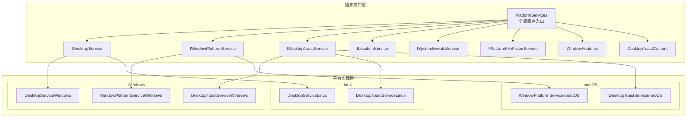
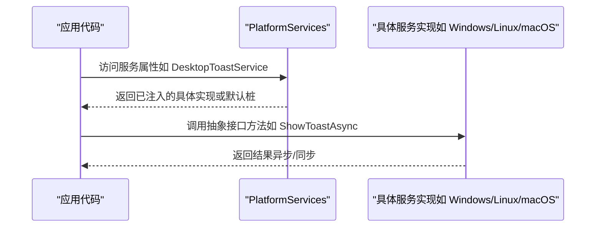
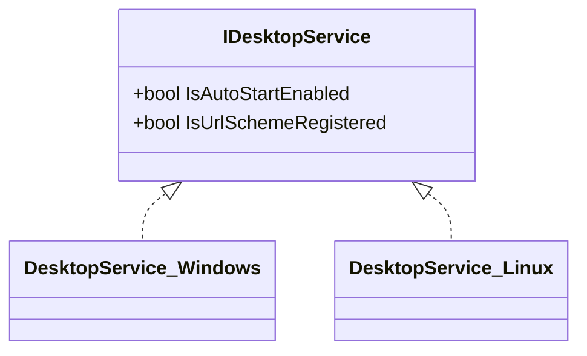
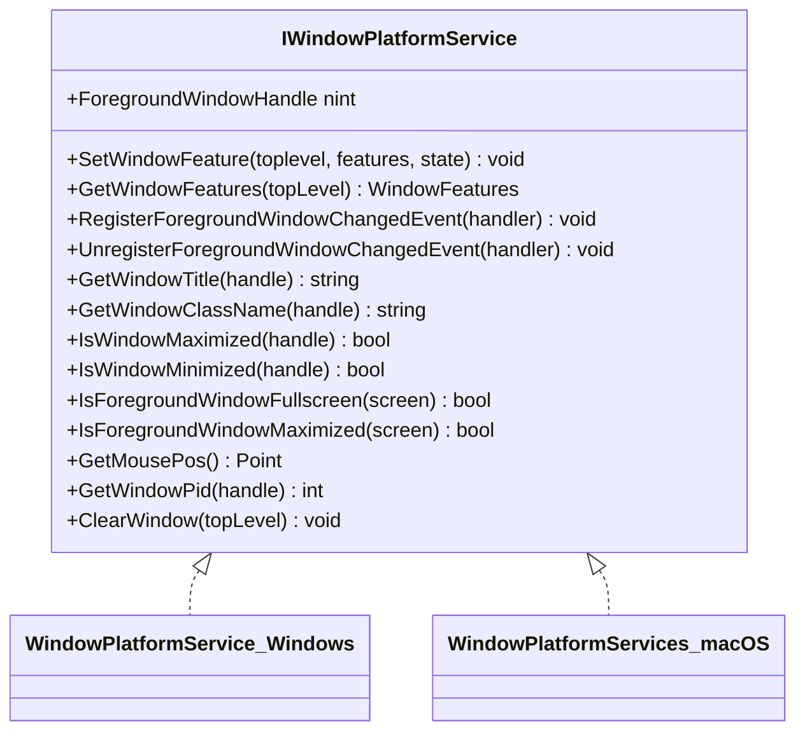
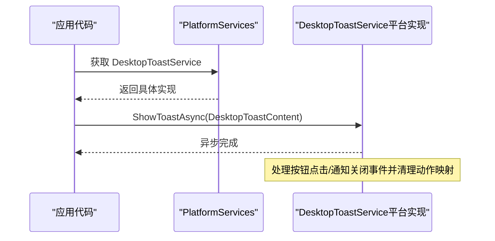
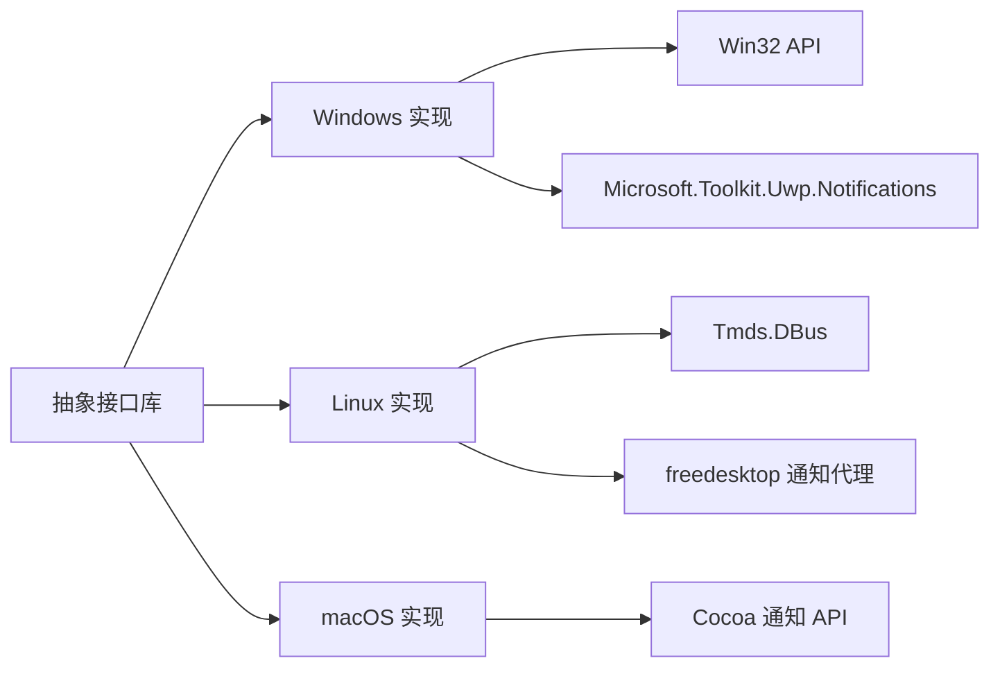

# 平台抽象层架构

<cite>
**本文档引用的文件**
- [PlatformServices.cs](file://src/Avalonia.Platforms.Abstractions/PlatformServices.cs)
- [IDesktopService.cs](file://src/Avalonia.Platforms.Abstractions/Services/IDesktopService.cs)
- [IWindowPlatformService.cs](file://src/Avalonia.Platforms.Abstractions/Services/IWindowPlatformService.cs)
- [IDesktopToastService.cs](file://src/Avalonia.Platforms.Abstractions/Services/IDesktopToastService.cs)
- [ILocationService.cs](file://src/Avalonia.Platforms.Abstractions/Services/ILocationService.cs)
- [ISystemEventsService.cs](file://src/Avalonia.Platforms.Abstractions/Services/ISystemEventsService.cs)
- [IPlatformFilePickerService.cs](file://src/Avalonia.Platforms.Abstractions/Services/IPlatformFilePickerService.cs)
- [WindowFeatures.cs](file://src/Avalonia.Platforms.Abstractions/Enums/WindowFeatures.cs)
- [DesktopToastContent.cs](file://src/Avalonia.Platforms.Abstractions/Models/DesktopToastContent.cs)
- [DesktopService.cs（Windows）](file://src/platforms/Avalonia.Platforms.Windows/Services/DesktopService.cs)
- [DesktopToastService.cs（Windows）](file://src/platforms/Avalonia.Platforms.Windows/Services/DesktopToastService.cs)
- [WindowPlatformService.cs（Windows）](file://src/platforms/Avalonia.Platforms.Windows/Services/WindowPlatformService.cs)
- [DesktopService.cs（Linux）](file://src/platforms/Avalonia.Platforms.Linux/Services/DesktopService.cs)
- [DesktopToastService.cs（Linux）](file://src/platforms/Avalonia.Platforms.Linux/Services/DesktopToastService.cs)
- [DesktopToastService.cs（macOS）](file://src/platforms/Avalonia.Platforms.MacOs/Services/DesktopToastService.cs)
- [WindowPlatformServices.cs（macOS）](file://src/platforms/Avalonia.Platforms.MacOs/Services/WindowPlatformServices.cs)
- [README.md（Abstractions）](file://src/Avalonia.Platforms.Abstractions/README.md)
</cite>

## 目录
1. [引言](#引言)
2. [项目结构](#项目结构)
3. [核心组件](#核心组件)
4. [架构总览](#架构总览)
5. [详细组件分析](#详细组件分析)
6. [依赖关系分析](#依赖关系分析)
7. [性能考量](#性能考量)
8. [故障排查指南](#故障排查指南)
9. [结论](#结论)
10. [附录：新平台接入指南与最佳实践](#附录新平台接入指南与最佳实践)

## 引言
本文件系统性阐述 AvaloniaTemplate 的“平台抽象层”设计与实现，重点说明如何通过一组统一的抽象接口实现跨 Windows、Linux 与 macOS 的平台兼容；并围绕桌面服务、桌面通知服务、窗口平台服务等核心能力，解析各平台具体实现的差异与共性，给出可复用的扩展策略与最佳实践。

## 项目结构
平台抽象层由“抽象接口库 + 平台实现库”组成：
- 抽象接口库：定义统一服务契约与数据模型，供上层业务调用。
- 平台实现库：针对不同操作系统提供具体实现，注入到抽象层的全局入口中。

图表来源
- [PlatformServices.cs:9-45](file://src/Avalonia.Platforms.Abstractions/PlatformServices.cs#L9-L45)
- [IDesktopService.cs:6-17](file://src/Avalonia.Platforms.Abstractions/Services/IDesktopService.cs#L6-L17)
- [IWindowPlatformService.cs:12-106](file://src/Avalonia.Platforms.Abstractions/Services/IWindowPlatformService.cs#L12-L106)
- [IDesktopToastService.cs:8-30](file://src/Avalonia.Platforms.Abstractions/Services/IDesktopToastService.cs#L8-L30)
- [ILocationService.cs:8-15](file://src/Avalonia.Platforms.Abstractions/Services/ILocationService.cs#L8-L15)
- [ISystemEventsService.cs:6-12](file://src/Avalonia.Platforms.Abstractions/Services/ISystemEventsService.cs#L6-L12)
- [IPlatformFilePickerService.cs:9-35](file://src/Avalonia.Platforms.Abstractions/Services/IPlatformFilePickerService.cs#L9-L35)
- [WindowFeatures.cs:7-37](file://src/Avalonia.Platforms.Abstractions/Enums/WindowFeatures.cs#L7-L37)
- [DesktopToastContent.cs:6-42](file://src/Avalonia.Platforms.Abstractions/Models/DesktopToastContent.cs#L6-L42)
- [DesktopService.cs（Windows）:8-45](file://src/platforms/Avalonia.Platforms.Windows/Services/DesktopService.cs#L8-L45)
- [DesktopToastService.cs（Windows）:21-161](file://src/platforms/Avalonia.Platforms.Windows/Services/DesktopToastService.cs#L21-L161)
- [WindowPlatformService.cs（Windows）:15-310](file://src/platforms/Avalonia.Platforms.Windows/Services/WindowPlatformService.cs#L15-L310)
- [DesktopService.cs（Linux）:8-45](file://src/platforms/Avalonia.Platforms.Linux/Services/DesktopService.cs#L8-L45)
- [DesktopToastService.cs（Linux）:12-246](file://src/platforms/Avalonia.Platforms.Linux/Services/DesktopToastService.cs#L12-L246)
- [DesktopToastService.cs（macOS）](file://src/platforms/Avalonia.Platforms.MacOs/Services/DesktopToastService.cs)
- [WindowPlatformServices.cs（macOS）](file://src/platforms/Avalonia.Platforms.MacOs/Services/WindowPlatformServices.cs)

章节来源
- [README.md（Abstractions）:1-3](file://src/Avalonia.Platforms.Abstractions/README.md#L1-L3)
- [PlatformServices.cs:9-45](file://src/Avalonia.Platforms.Abstractions/PlatformServices.cs#L9-L45)

## 核心组件
- 平台服务入口（PlatformServices）
  - 提供静态属性访问各类平台服务实例，并内置默认“桩”实现，确保在未注入具体实现时仍可运行。
  - 关键字段：窗口平台服务、定位服务、桌面服务、系统事件服务、桌面通知服务、文件选择器服务。
  - 支持“定位服务可用性”检测，便于按需启用功能。

- 抽象接口族
  - 桌面服务：控制自启动、URL 协议注册等桌面级行为。
  - 窗口平台服务：窗口特性设置、前景窗口变更事件、窗口信息查询、鼠标位置、进程 ID、强制重绘等。
  - 桌面通知服务：异步显示通知、按钮动作绑定、通知激活处理。
  - 定位服务：获取设备地理坐标。
  - 系统事件服务：系统时间变化事件。
  - 文件选择器服务：跨平台文件/文件夹选择对话框。

- 数据模型与枚举
  - WindowFeatures：窗口特性位集合，包含穿透、置底/置顶、隐私、工具窗口、跳过窗口管理等。
  - DesktopToastContent：通知内容载体，支持标题、正文、多图资源、按钮与激活回调。

章节来源
- [PlatformServices.cs:9-45](file://src/Avalonia.Platforms.Abstractions/PlatformServices.cs#L9-L45)
- [IDesktopService.cs:6-17](file://src/Avalonia.Platforms.Abstractions/Services/IDesktopService.cs#L6-L17)
- [IWindowPlatformService.cs:12-106](file://src/Avalonia.Platforms.Abstractions/Services/IWindowPlatformService.cs#L12-L106)
- [IDesktopToastService.cs:8-30](file://src/Avalonia.Platforms.Abstractions/Services/IDesktopToastService.cs#L8-L30)
- [ILocationService.cs:8-15](file://src/Avalonia.Platforms.Abstractions/Services/ILocationService.cs#L8-L15)
- [ISystemEventsService.cs:6-12](file://src/Avalonia.Platforms.Abstractions/Services/ISystemEventsService.cs#L6-L12)
- [IPlatformFilePickerService.cs:9-35](file://src/Avalonia.Platforms.Abstractions/Services/IPlatformFilePickerService.cs#L9-L35)
- [WindowFeatures.cs:7-37](file://src/Avalonia.Platforms.Abstractions/Enums/WindowFeatures.cs#L7-L37)
- [DesktopToastContent.cs:6-42](file://src/Avalonia.Platforms.Abstractions/Models/DesktopToastContent.cs#L6-L42)

## 架构总览
平台抽象层采用“接口 + 默认桩 + 平台注入”的模式：
- 上层仅依赖抽象接口，不感知平台差异。
- 运行时通过 PlatformServices 注入具体实现，若未注入则使用桩实现。
- 各平台实现遵循统一契约，保证行为一致性与可替换性。

图表来源
- [PlatformServices.cs:9-45](file://src/Avalonia.Platforms.Abstractions/PlatformServices.cs#L9-L45)
- [IDesktopToastService.cs:8-30](file://src/Avalonia.Platforms.Abstractions/Services/IDesktopToastService.cs#L8-L30)

## 详细组件分析

### 桌面服务（IDesktopService）
职责
- 控制应用自启动（开机自启）。
- 注册/注销 URL 协议，使系统可交由应用处理特定协议。

实现差异
- Windows：通过快捷方式与注册表实现自启动与协议注册。
- Linux：通过 Freedesktop 自启动目录创建/删除 .desktop 快捷方式，URL 协议注册返回不支持。
- macOS：未在抽象层提供对应实现文件，建议按 Windows/Linux 模式补充。

图表来源
- [IDesktopService.cs:6-17](file://src/Avalonia.Platforms.Abstractions/Services/IDesktopService.cs#L6-L17)
- [DesktopService.cs（Windows）:8-45](file://src/platforms/Avalonia.Platforms.Windows/Services/DesktopService.cs#L8-L45)
- [DesktopService.cs（Linux）:8-45](file://src/platforms/Avalonia.Platforms.Linux/Services/DesktopService.cs#L8-L45)

章节来源
- [IDesktopService.cs:6-17](file://src/Avalonia.Platforms.Abstractions/Services/IDesktopService.cs#L6-L17)
- [DesktopService.cs（Windows）:8-45](file://src/platforms/Avalonia.Platforms.Windows/Services/DesktopService.cs#L8-L45)
- [DesktopService.cs（Linux）:8-45](file://src/platforms/Avalonia.Platforms.Linux/Services/DesktopService.cs#L8-L45)

### 窗口平台服务（IWindowPlatformService）
职责
- 设置/查询窗口特性（穿透、置底/置顶、隐私、工具窗口、跳过窗口管理）。
- 注册/取消前景窗口变更事件，查询前台窗口句柄、标题、类名、最大化/最小化/全屏状态、鼠标位置、进程 ID、强制重绘等。

实现差异
- Windows：通过 Win32 API 实现窗口特性设置、事件钩子、前景窗口监控、窗口信息查询与鼠标位置获取。
- macOS：提供窗口平台服务实现文件，但接口签名与 Windows 不完全一致，需按需对齐或拆分平台专用接口。
- Linux：未在抽象层提供对应实现文件，建议按 Windows 模式补充。

图表来源
- [IWindowPlatformService.cs:12-106](file://src/Avalonia.Platforms.Abstractions/Services/IWindowPlatformService.cs#L12-L106)
- [WindowPlatformService.cs（Windows）:15-310](file://src/platforms/Avalonia.Platforms.Windows/Services/WindowPlatformService.cs#L15-L310)
- [WindowPlatformServices.cs（macOS）](file://src/platforms/Avalonia.Platforms.MacOs/Services/WindowPlatformServices.cs)

章节来源
- [IWindowPlatformService.cs:12-106](file://src/Avalonia.Platforms.Abstractions/Services/IWindowPlatformService.cs#L12-L106)
- [WindowPlatformService.cs（Windows）:15-310](file://src/platforms/Avalonia.Platforms.Windows/Services/WindowPlatformService.cs#L15-L310)
- [WindowPlatformServices.cs（macOS）](file://src/platforms/Avalonia.Platforms.MacOs/Services/WindowPlatformServices.cs)

### 桌面通知服务（IDesktopToastService）
职责
- 异步显示桌面通知，支持标题、正文、图片资源、按钮与激活回调。
- 统一处理通知被点击或按钮点击后的动作执行。

实现差异
- Windows：使用 Microsoft.Toolkit.Uwp.Notifications 构建 Toast XML，兼容 Win10+ 行为，支持按钮与激活回调清理。
- Linux：通过 D-Bus freedesktop 通知协议发送通知，支持按钮与关闭事件监听，图片能力受桌面环境限制。
- macOS：提供服务实现文件，但接口契约与 Windows/Linux 存在差异，建议统一接口或平台隔离。

图表来源
- [IDesktopToastService.cs:8-30](file://src/Avalonia.Platforms.Abstractions/Services/IDesktopToastService.cs#L8-L30)
- [DesktopToastService.cs（Windows）:21-161](file://src/platforms/Avalonia.Platforms.Windows/Services/DesktopToastService.cs#L21-L161)
- [DesktopToastService.cs（Linux）:12-246](file://src/platforms/Avalonia.Platforms.Linux/Services/DesktopToastService.cs#L12-L246)
- [DesktopToastService.cs（macOS）](file://src/platforms/Avalonia.Platforms.MacOs/Services/DesktopToastService.cs)

章节来源
- [IDesktopToastService.cs:8-30](file://src/Avalonia.Platforms.Abstractions/Services/IDesktopToastService.cs#L8-L30)
- [DesktopToastService.cs（Windows）:21-161](file://src/platforms/Avalonia.Platforms.Windows/Services/DesktopToastService.cs#L21-L161)
- [DesktopToastService.cs（Linux）:12-246](file://src/platforms/Avalonia.Platforms.Linux/Services/DesktopToastService.cs#L12-L246)
- [DesktopToastService.cs（macOS）](file://src/platforms/Avalonia.Platforms.MacOs/Services/DesktopToastService.cs)

### 定位服务（ILocationService）与系统事件（ISystemEventsService）
职责
- 定位服务：异步获取设备地理坐标。
- 系统事件服务：系统时间变化事件通知。

实现现状
- 抽象接口定义清晰，Linux 实现文件存在但未在 PlatformServices 中注入，macOS 未提供实现文件。
- 建议按平台能力差异提供实现，或在不支持的平台返回空实现/抛出 NotSupportedException。

章节来源
- [ILocationService.cs:8-15](file://src/Avalonia.Platforms.Abstractions/Services/ILocationService.cs#L8-L15)
- [ISystemEventsService.cs:6-12](file://src/Avalonia.Platforms.Abstractions/Services/ISystemEventsService.cs#L6-L12)

### 文件选择器服务（IPlatformFilePickerService）
职责
- 打开文件/保存文件/打开文件夹的选择器，返回用户选择结果。

实现现状
- 抽象接口定义统一参数与返回值，PlatformServices 中默认注入 Avalonia 默认实现。
- 各平台可按需覆盖，以获得更贴近系统风格的体验。

章节来源
- [IPlatformFilePickerService.cs:9-35](file://src/Avalonia.Platforms.Abstractions/Services/IPlatformFilePickerService.cs#L9-L35)
- [PlatformServices.cs:44-44](file://src/Avalonia.Platforms.Abstractions/PlatformServices.cs#L44-L44)

## 依赖关系分析
- 抽象层与平台实现解耦：上层仅依赖抽象接口，平台实现通过 PlatformServices 注入。
- 平台实现内部依赖系统 API 或第三方库（如 Windows 的 Win32 API、Microsoft.Toolkit.Uwp.Notifications；Linux 的 Tmds.DBus、freedesktop 通知代理）。
- 事件与资源：通知服务涉及事件订阅/取消、资源下载/缓存、UI 线程调度等。

图表来源
- [WindowPlatformService.cs（Windows）:15-310](file://src/platforms/Avalonia.Platforms.Windows/Services/WindowPlatformService.cs#L15-L310)
- [DesktopToastService.cs（Windows）:21-161](file://src/platforms/Avalonia.Platforms.Windows/Services/DesktopToastService.cs#L21-L161)
- [DesktopToastService.cs（Linux）:12-246](file://src/platforms/Avalonia.Platforms.Linux/Services/DesktopToastService.cs#L12-L246)
- [DesktopToastService.cs（macOS）](file://src/platforms/Avalonia.Platforms.MacOs/Services/DesktopToastService.cs)

## 性能考量
- 事件钩子与回调
  - Windows 前景窗口事件钩子需谨慎管理生命周期，避免重复注册与泄漏。
  - 通知按钮与关闭事件需及时清理动作映射，防止内存累积。
- 资源处理
  - 图片资源在不同平台可能需要临时文件落盘或网络下载，注意异常处理与资源释放。
- UI 线程调度
  - 事件回调中尽量将 UI 更新切换至 UI 线程，避免跨线程访问导致异常。

## 故障排查指南
- 通知无法显示
  - Windows：检查系统版本与通知兼容性，确认 AUMID 与图标资源路径。
  - Linux：确认 D-Bus 会话连接、freedesktop 能力支持与桌面环境配置。
  - macOS：核对通知权限与接口契约一致性。
- 前景窗口事件无效
  - Windows：确认事件钩子初始化顺序与句柄有效性，避免重复注册。
- 自启动/协议注册失败
  - Linux：检查 ~/.config/autostart 目录权限与 Freedesktop 快捷方式生成逻辑。
  - Windows：检查注册表写入权限与快捷方式保存路径。

章节来源
- [DesktopToastService.cs（Windows）:21-161](file://src/platforms/Avalonia.Platforms.Windows/Services/DesktopToastService.cs#L21-L161)
- [DesktopToastService.cs（Linux）:12-246](file://src/platforms/Avalonia.Platforms.Linux/Services/DesktopToastService.cs#L12-L246)
- [WindowPlatformService.cs（Windows）:15-310](file://src/platforms/Avalonia.Platforms.Windows/Services/WindowPlatformService.cs#L15-L310)
- [DesktopService.cs（Linux）:8-45](file://src/platforms/Avalonia.Platforms.Linux/Services/DesktopService.cs#L8-L45)

## 结论
平台抽象层通过统一接口与默认桩实现，有效屏蔽了 Windows、Linux 与 macOS 的平台差异，使上层业务可专注于功能实现而非平台细节。现有实现覆盖桌面服务、窗口平台服务与桌面通知服务的核心场景，建议后续完善 Linux 与 macOS 的缺失实现，并统一各平台接口契约，提升可维护性与可移植性。

## 附录：新平台接入指南与最佳实践

- 接入步骤
  1. 在抽象接口库中确认所需接口是否完备（如缺少接口则先扩展抽象）。
  2. 新建平台实现库，实现抽象接口（如 IDesktopService、IWindowPlatformService、IDesktopToastService 等）。
  3. 在平台实现库中提供服务注册（或在宿主应用中通过 PlatformServices 注入具体实现）。
  4. 编写平台特定的资源处理与系统 API 调用逻辑，确保异常处理与资源释放。
  5. 编写单元测试与集成测试，验证关键流程（通知、窗口特性、自启动等）。

- 最佳实践
  - 统一接口契约：尽量保持各平台接口签名一致，减少上层分支判断。
  - 生命周期管理：事件订阅/取消、资源释放、句柄回收必须成对出现。
  - 资源与线程：图片资源转换为本地路径、UI 回调切换到 UI 线程。
  - 错误降级：在不支持的功能上返回空实现或抛出明确异常，避免静默失败。
  - 文档与测试：为每个平台实现编写简要说明与回归测试。