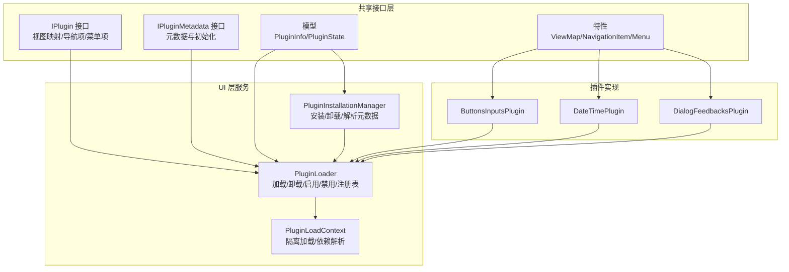
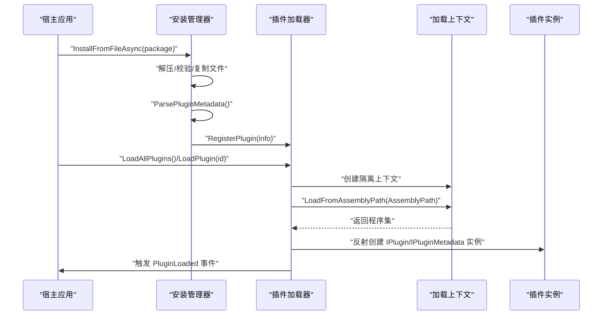
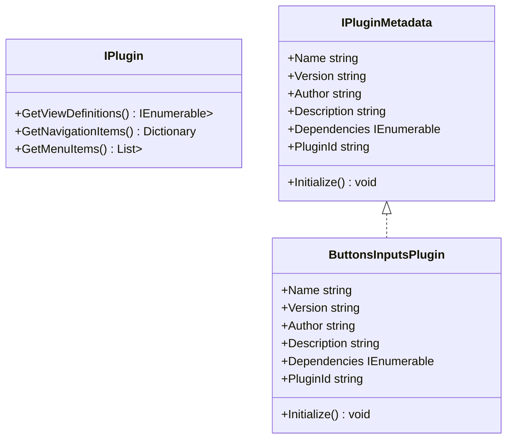
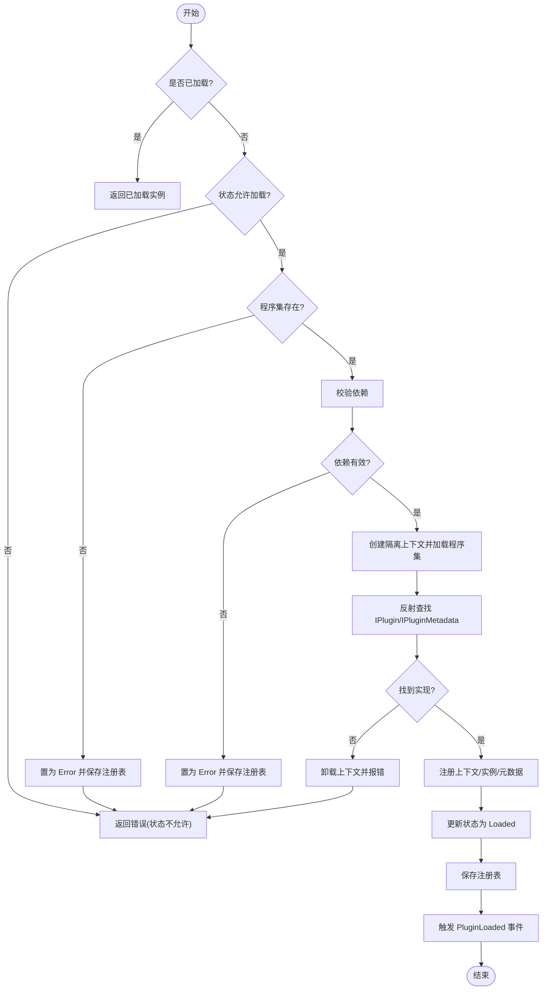
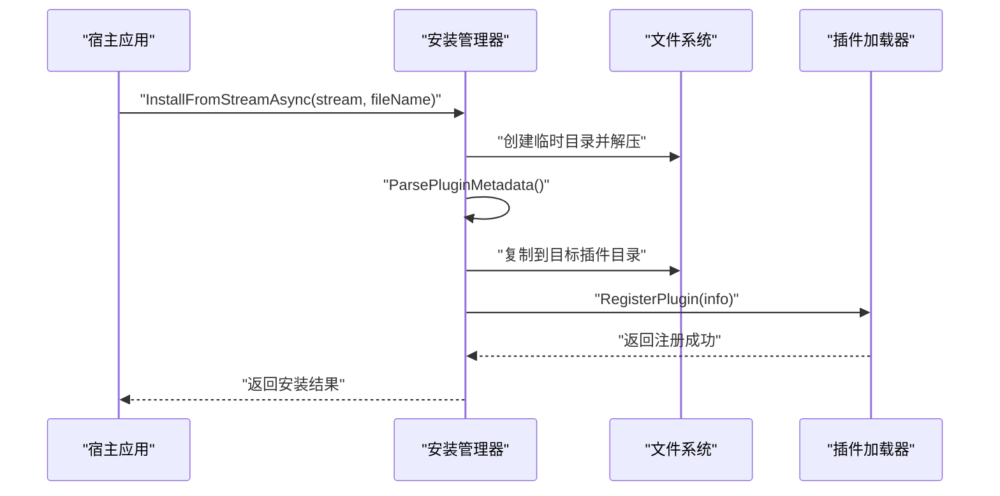
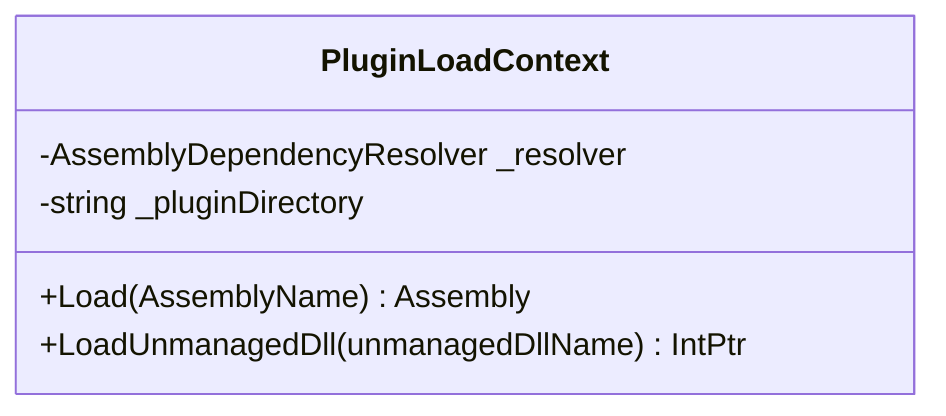
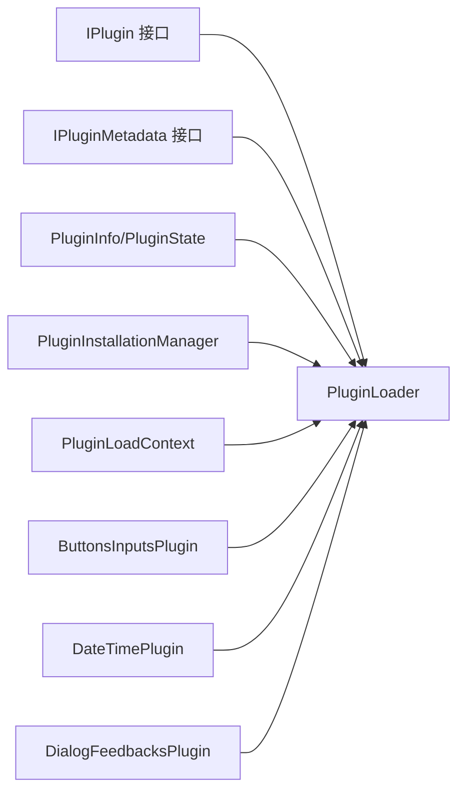

# 插件系统架构

<cite>
**本文引用的文件**
- [IPlugin.cs](file://src/Avalonia.Plugin.Shared/IPlugin.cs)
- [IPluginMetadata.cs](file://src/Avalonia.Plugin.Shared/IPluginMetadata.cs)
- [ViewMapAttribute.cs](file://src/Avalonia.Plugin.Shared/Attributes/ViewMapAttribute.cs)
- [NavigationItemAttribute.cs](file://src/Avalonia.Plugin.Shared/Attributes/NavigationItemAttribute.cs)
- [MenuAttribute.cs](file://src/Avalonia.Plugin.Shared/Attributes/MenuAttribute.cs)
- [PluginLoader.cs](file://src/Avalonia.UI/Serivces/PluginLoader.cs)
- [PluginInstallationManager.cs](file://src/Avalonia.UI/Serivces/PluginInstallationManager.cs)
- [PluginLoadContext.cs](file://src/Avalonia.UI/Serivces/PluginLoadContext.cs)
- [PluginInfo.cs](file://src/Avalonia.Plugin.Shared/Models/PluginInfo.cs)
- [PluginState.cs](file://src/Avalonia.Plugin.Shared/Models/PluginState.cs)
- [ButtonsInputsPlugin.cs](file://plugins/Avalonia.Plugin.ButtonsInputs/ButtonsInputsPlugin.cs)
- [DateTimePlugin.cs](file://plugins/Avalonia.Plugin.DateTime/DateTimePlugin.cs)
- [DialogFeedbacksPlugin.cs](file://plugins/Avalonia.Plugin.DialogFeedbacks/DialogFeedbacksPlugin.cs)
</cite>

## 目录
1. [简介](#简介)
2. [项目结构](#项目结构)
3. [核心组件](#核心组件)
4. [架构总览](#架构总览)
5. [详细组件分析](#详细组件分析)
6. [依赖关系分析](#依赖关系分析)
7. [性能考量](#性能考量)
8. [故障排查指南](#故障排查指南)
9. [结论](#结论)
10. [附录：插件开发标准流程与最佳实践](#附录插件开发标准流程与最佳实践)

## 简介
本文件系统性阐述 AvaloniaTemplate 插件系统的架构设计与实现细节，重点覆盖以下方面：
- 插件接口 IPlugin 的设计原理：视图映射、导航项与菜单项的提供机制
- 插件加载器的工作原理：程序集加载、实例化与生命周期管理
- 插件安装管理器的功能：插件发现、验证与状态管理
- 插件间通信与依赖关系处理
- 插件开发的标准流程与最佳实践

## 项目结构
插件系统由“共享接口层”“UI 层服务”“具体插件实现”三部分组成：
- 共享接口层：定义插件接口 IPlugin、元数据接口 IPluginMetadata 及相关模型、特性
- UI 层服务：提供插件加载器、安装管理器与专用的 AssemblyLoadContext
- 具体插件：实现 IPlugin 或 IPluginMetadata，暴露视图映射、导航项、菜单项等能力

图表来源
- [IPlugin.cs:9-26](file://src/Avalonia.Plugin.Shared/IPlugin.cs#L9-L26)
- [IPluginMetadata.cs:3-41](file://src/Avalonia.Plugin.Shared/IPluginMetadata.cs#L3-L41)
- [ViewMapAttribute.cs:5-9](file://src/Avalonia.Plugin.Shared/Attributes/ViewMapAttribute.cs#L5-L9)
- [NavigationItemAttribute.cs:4-8](file://src/Avalonia.Plugin.Shared/Attributes/NavigationItemAttribute.cs#L4-L8)
- [MenuAttribute.cs:11-38](file://src/Avalonia.Plugin.Shared/Attributes/MenuAttribute.cs#L11-L38)
- [PluginLoader.cs:10-35](file://src/Avalonia.UI/Serivces/PluginLoader.cs#L10-L35)
- [PluginInstallationManager.cs:10-23](file://src/Avalonia.UI/Serivces/PluginInstallationManager.cs#L10-L23)
- [PluginLoadContext.cs:6-34](file://src/Avalonia.UI/Serivces/PluginLoadContext.cs#L6-L34)
- [PluginInfo.cs:3-18](file://src/Avalonia.Plugin.Shared/Models/PluginInfo.cs#L3-L18)
- [PluginState.cs:3-11](file://src/Avalonia.Plugin.Shared/Models/PluginState.cs#L3-L11)
- [ButtonsInputsPlugin.cs:6-24](file://plugins/Avalonia.Plugin.ButtonsInputs/ButtonsInputsPlugin.cs#L6-L24)
- [DateTimePlugin.cs:6-18](file://plugins/Avalonia.Plugin.DateTime/DateTimePlugin.cs#L6-L18)
- [DialogFeedbacksPlugin.cs:6-18](file://plugins/Avalonia.Plugin.DialogFeedbacks/DialogFeedbacksPlugin.cs#L6-L18)

章节来源
- [IPlugin.cs:9-26](file://src/Avalonia.Plugin.Shared/IPlugin.cs#L9-L26)
- [IPluginMetadata.cs:3-41](file://src/Avalonia.Plugin.Shared/IPluginMetadata.cs#L3-L41)
- [PluginLoader.cs:10-35](file://src/Avalonia.UI/Serivces/PluginLoader.cs#L10-L35)
- [PluginInstallationManager.cs:10-23](file://src/Avalonia.UI/Serivces/PluginInstallationManager.cs#L10-L23)
- [PluginLoadContext.cs:6-34](file://src/Avalonia.UI/Serivces/PluginLoadContext.cs#L6-L34)
- [PluginInfo.cs:3-18](file://src/Avalonia.Plugin.Shared/Models/PluginInfo.cs#L3-L18)
- [PluginState.cs:3-11](file://src/Avalonia.Plugin.Shared/Models/PluginState.cs#L3-L11)

## 核心组件
- 插件接口 IPlugin：定义三类能力输出
  - 视图映射：通过 GetViewDefinitions 提供 ViewModel 到 View 的工厂映射
  - 导航项：通过 GetNavigationItems 提供导航键到 ViewModel 工厂的映射
  - 菜单项：通过 GetMenuItems 提供菜单项列表及其父级关系
- 元数据接口 IPluginMetadata：提供插件元信息（名称、版本、作者、描述、依赖、唯一标识）及 Initialize 初始化钩子
- 特性系统：
  - ViewMapAttribute：声明 ViewModel 对应的 View 类型
  - NavigationItemAttribute：声明 ViewModel 的导航键
  - MenuAttribute：声明菜单项的标题、键、父键、状态与排序
- 模型与状态：
  - PluginInfo：记录插件的标识、版本、依赖、安装路径、程序集路径、状态、错误信息等
  - PluginState：NotInstalled/Installed/Loaded/Disabled/PendingUninstall/Error

章节来源
- [IPlugin.cs:9-26](file://src/Avalonia.Plugin.Shared/IPlugin.cs#L9-L26)
- [IPluginMetadata.cs:3-41](file://src/Avalonia.Plugin.Shared/IPluginMetadata.cs#L3-L41)
- [ViewMapAttribute.cs:5-9](file://src/Avalonia.Plugin.Shared/Attributes/ViewMapAttribute.cs#L5-L9)
- [NavigationItemAttribute.cs:4-8](file://src/Avalonia.Plugin.Shared/Attributes/NavigationItemAttribute.cs#L4-L8)
- [MenuAttribute.cs:11-38](file://src/Avalonia.Plugin.Shared/Attributes/MenuAttribute.cs#L11-L38)
- [PluginInfo.cs:3-18](file://src/Avalonia.Plugin.Shared/Models/PluginInfo.cs#L3-L18)
- [PluginState.cs:3-11](file://src/Avalonia.Plugin.Shared/Models/PluginState.cs#L3-L11)

## 架构总览
插件系统采用“隔离加载 + 注册表 + 安装管理”的架构：
- 隔离加载：使用自定义 AssemblyLoadContext 在独立上下文中加载插件程序集，避免与宿主或其它插件污染
- 注册表：持久化记录已安装插件的状态、依赖、路径等信息，支持重启后恢复
- 安装管理：支持从压缩包安装、解析 nuspec/plugin.json 等元数据，执行安全校验与目录迁移

图表来源
- [PluginInstallationManager.cs:29-151](file://src/Avalonia.UI/Serivces/PluginInstallationManager.cs#L29-L151)
- [PluginLoader.cs:53-156](file://src/Avalonia.UI/Serivces/PluginLoader.cs#L53-L156)
- [PluginLoadContext.cs:30-58](file://src/Avalonia.UI/Serivces/PluginLoadContext.cs#L30-L58)

## 详细组件分析

### 组件一：插件接口 IPlugin 设计与实现模式
- 设计要点
  - 视图映射：以键值对形式返回 ViewModel 类型与其对应的 View 工厂，便于运行时动态绑定
  - 导航项：以导航键到 ViewModel 工厂的字典形式，支持按需延迟创建
  - 菜单项：以列表形式返回菜单项及其父键，支持层级组织与可选状态
- 实现建议
  - 使用特性标注（如 ViewMap、NavigationItem、Menu）可简化元数据生成与注册
  - 将视图与 ViewModel 的映射集中在插件入口类中，保持职责单一

图表来源
- [IPlugin.cs:9-26](file://src/Avalonia.Plugin.Shared/IPlugin.cs#L9-L26)
- [IPluginMetadata.cs:3-41](file://src/Avalonia.Plugin.Shared/IPluginMetadata.cs#L3-L41)
- [ButtonsInputsPlugin.cs:6-24](file://plugins/Avalonia.Plugin.ButtonsInputs/ButtonsInputsPlugin.cs#L6-L24)

章节来源
- [IPlugin.cs:9-26](file://src/Avalonia.Plugin.Shared/IPlugin.cs#L9-L26)
- [ButtonsInputsPlugin.cs:6-24](file://plugins/Avalonia.Plugin.ButtonsInputs/ButtonsInputsPlugin.cs#L6-L24)

### 组件二：插件加载器 PluginLoader
- 职责
  - 加载/卸载/启用/禁用插件
  - 维护插件注册表与状态
  - 处理依赖验证与异常状态回写
  - 支持额外插件目录（环境变量）的动态加载
- 关键流程
  - 加载：创建隔离上下文 -> 加载程序集 -> 反射查找 IPlugin/IPluginMetadata -> 记录上下文与实例 -> 更新状态并持久化
  - 卸载/禁用：移除实例与上下文，更新状态
  - 依赖校验：确保依赖已安装且已加载
- 并发与线程安全：使用锁保护内部字典与注册表读写

图表来源
- [PluginLoader.cs:53-156](file://src/Avalonia.UI/Serivces/PluginLoader.cs#L53-L156)
- [PluginLoader.cs:353-372](file://src/Avalonia.UI/Serivces/PluginLoader.cs#L353-L372)
- [PluginLoader.cs:407-444](file://src/Avalonia.UI/Serivces/PluginLoader.cs#L407-L444)

章节来源
- [PluginLoader.cs:10-35](file://src/Avalonia.UI/Serivces/PluginLoader.cs#L10-L35)
- [PluginLoader.cs:53-156](file://src/Avalonia.UI/Serivces/PluginLoader.cs#L53-L156)
- [PluginLoader.cs:158-222](file://src/Avalonia.UI/Serivces/PluginLoader.cs#L158-L222)
- [PluginLoader.cs:224-286](file://src/Avalonia.UI/Serivces/PluginLoader.cs#L224-L286)
- [PluginLoader.cs:353-372](file://src/Avalonia.UI/Serivces/PluginLoader.cs#L353-L372)
- [PluginLoader.cs:407-444](file://src/Avalonia.UI/Serivces/PluginLoader.cs#L407-L444)

### 组件三：插件安装管理器 PluginInstallationManager
- 职责
  - 从文件/流安装插件包，进行安全校验（防路径穿越）
  - 解析元数据：优先 nuspec，其次 plugin.json，最后回退到程序集信息
  - 执行安装目录迁移与注册
  - 支持卸载（标记待卸载）、启用/禁用
- 安全与健壮性
  - 严格校验解压路径，防止路径穿越
  - 异常捕获并返回标准化结果

图表来源
- [PluginInstallationManager.cs:29-151](file://src/Avalonia.UI/Serivces/PluginInstallationManager.cs#L29-L151)
- [PluginInstallationManager.cs:178-214](file://src/Avalonia.UI/Serivces/PluginInstallationManager.cs#L178-L214)

章节来源
- [PluginInstallationManager.cs:10-23](file://src/Avalonia.UI/Serivces/PluginInstallationManager.cs#L10-L23)
- [PluginInstallationManager.cs:29-151](file://src/Avalonia.UI/Serivces/PluginInstallationManager.cs#L29-L151)
- [PluginInstallationManager.cs:178-214](file://src/Avalonia.UI/Serivces/PluginInstallationManager.cs#L178-L214)

### 组件四：隔离加载上下文 PluginLoadContext
- 职责
  - 基于 AssemblyDependencyResolver 解析依赖
  - 排除宿主框架与常用库，避免冲突
  - 在插件目录内探测缺失依赖
- 生命周期
  - 上下文可回收，配合卸载实现彻底释放

图表来源
- [PluginLoadContext.cs:6-107](file://src/Avalonia.UI/Serivces/PluginLoadContext.cs#L6-L107)

章节来源
- [PluginLoadContext.cs:6-107](file://src/Avalonia.UI/Serivces/PluginLoadContext.cs#L6-L107)

### 组件五：插件状态与注册表
- 状态机：NotInstalled → Installed → Loaded；Disabled 与 PendingUninstall 作为中间态
- 注册表：序列化为 JSON 文件，包含插件元信息、状态、错误信息、安装时间等
- 启动恢复：启动时读取注册表，将 Loaded 状态重置为 Installed，随后可选择自动加载

章节来源
- [PluginState.cs:3-11](file://src/Avalonia.Plugin.Shared/Models/PluginState.cs#L3-L11)
- [PluginInfo.cs:3-18](file://src/Avalonia.Plugin.Shared/Models/PluginInfo.cs#L3-L18)
- [PluginLoader.cs:407-431](file://src/Avalonia.UI/Serivces/PluginLoader.cs#L407-L431)

## 依赖关系分析
- 插件实现依赖共享接口层（IPlugin/IPluginMetadata），并通过特性简化元数据声明
- 加载器依赖安装管理器提供的注册信息与程序集路径
- 加载器通过隔离上下文加载插件，避免与宿主共享程序集污染
- 安装管理器在安装阶段解析元数据，决定插件的依赖集合与唯一标识

图表来源
- [IPlugin.cs:9-26](file://src/Avalonia.Plugin.Shared/IPlugin.cs#L9-L26)
- [IPluginMetadata.cs:3-41](file://src/Avalonia.Plugin.Shared/IPluginMetadata.cs#L3-L41)
- [PluginInfo.cs:3-18](file://src/Avalonia.Plugin.Shared/Models/PluginInfo.cs#L3-L18)
- [PluginState.cs:3-11](file://src/Avalonia.Plugin.Shared/Models/PluginState.cs#L3-L11)
- [PluginLoader.cs:10-35](file://src/Avalonia.UI/Serivces/PluginLoader.cs#L10-L35)
- [PluginInstallationManager.cs:10-23](file://src/Avalonia.UI/Serivces/PluginInstallationManager.cs#L10-L23)
- [PluginLoadContext.cs:6-34](file://src/Avalonia.UI/Serivces/PluginLoadContext.cs#L6-L34)
- [ButtonsInputsPlugin.cs:6-24](file://plugins/Avalonia.Plugin.ButtonsInputs/ButtonsInputsPlugin.cs#L6-L24)
- [DateTimePlugin.cs:6-18](file://plugins/Avalonia.Plugin.DateTime/DateTimePlugin.cs#L6-L18)
- [DialogFeedbacksPlugin.cs:6-18](file://plugins/Avalonia.Plugin.DialogFeedbacks/DialogFeedbacksPlugin.cs#L6-L18)

## 性能考量
- 隔离加载上下文可回收，避免内存泄漏；卸载时务必调用 Unload
- 依赖解析优先使用 Resolver，其次在插件目录探测，减少外部依赖查找开销
- 注册表采用 JSON 序列化，建议在批量操作时合并保存，降低 IO 次数
- 导航项与菜单项的构建建议延迟到首次访问，避免启动时的无谓开销

## 故障排查指南
- 程序集未找到或加载失败
  - 检查插件状态是否为 Error，查看错误信息
  - 确认程序集路径正确，依赖是否齐全
- 依赖未满足
  - 校验依赖 ID 是否存在于注册表，且状态为 Loaded
- 卸载后残留
  - 确认是否标记为 PendingUninstall，等待安装器清理
- 安全校验失败
  - 安装包中存在路径穿越风险，检查压缩包内容与目标路径

章节来源
- [PluginLoader.cs:76-92](file://src/Avalonia.UI/Serivces/PluginLoader.cs#L76-L92)
- [PluginLoader.cs:353-372](file://src/Avalonia.UI/Serivces/PluginLoader.cs#L353-L372)
- [PluginInstallationManager.cs:62-78](file://src/Avalonia.UI/Serivces/PluginInstallationManager.cs#L62-L78)
- [PluginInstallationManager.cs:110-118](file://src/Avalonia.UI/Serivces/PluginInstallationManager.cs#L110-L118)

## 结论
该插件系统通过清晰的接口抽象、严格的隔离加载与完善的注册表管理，实现了可扩展、可维护、可诊断的插件生态。开发者只需实现 IPlugin/IPluginMetadata 并遵循元数据规范，即可快速接入导航、菜单与视图映射能力；安装管理器与加载器共同保障了安装、加载、卸载的完整生命周期。

## 附录：插件开发标准流程与最佳实践
- 开发流程
  - 新建插件工程，引用共享接口层与生成器
  - 实现 IPluginMetadata（或使用 [GenerateMetadata] 特性辅助生成），提供 Name/Version/Author/Description/Dependencies/PluginId
  - 实现 IPlugin：提供视图映射、导航项、菜单项
  - 编写特性标注（可选）：ViewMap/NavigationItem/Menu，简化元数据声明
  - 打包发布：生成 nupkg 或包含 plugin.json 的压缩包
- 最佳实践
  - 明确插件依赖：在 Dependencies 中声明必要依赖 ID，确保加载顺序
  - 使用隔离上下文：避免直接引用宿主框架类型，减少耦合
  - 延迟初始化：导航项与菜单项在首次使用时再构建，降低启动成本
  - 错误处理：在 Initialize 中处理资源准备，异常时设置错误状态并记录日志
  - 元数据管理：保持 Name/Version/PluginId 唯一且稳定，便于升级与回滚
  - 安全安装：确保安装包不包含路径穿越内容，安装器会进行校验

章节来源
- [IPluginMetadata.cs:3-41](file://src/Avalonia.Plugin.Shared/IPluginMetadata.cs#L3-L41)
- [IPlugin.cs:9-26](file://src/Avalonia.Plugin.Shared/IPlugin.cs#L9-L26)
- [ViewMapAttribute.cs:5-9](file://src/Avalonia.Plugin.Shared/Attributes/ViewMapAttribute.cs#L5-L9)
- [NavigationItemAttribute.cs:4-8](file://src/Avalonia.Plugin.Shared/Attributes/NavigationItemAttribute.cs#L4-L8)
- [MenuAttribute.cs:11-38](file://src/Avalonia.Plugin.Shared/Attributes/MenuAttribute.cs#L11-L38)
- [PluginInstallationManager.cs:178-214](file://src/Avalonia.UI/Serivces/PluginInstallationManager.cs#L178-L214)
- [PluginLoader.cs:353-372](file://src/Avalonia.UI/Serivces/PluginLoader.cs#L353-L372)