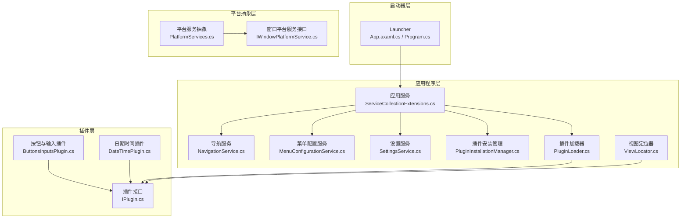
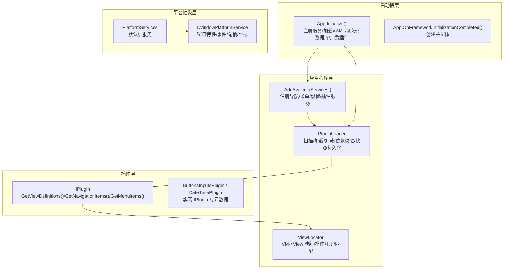
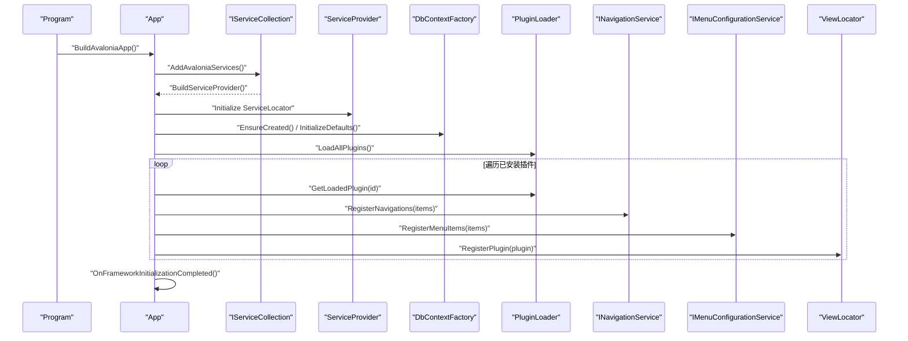
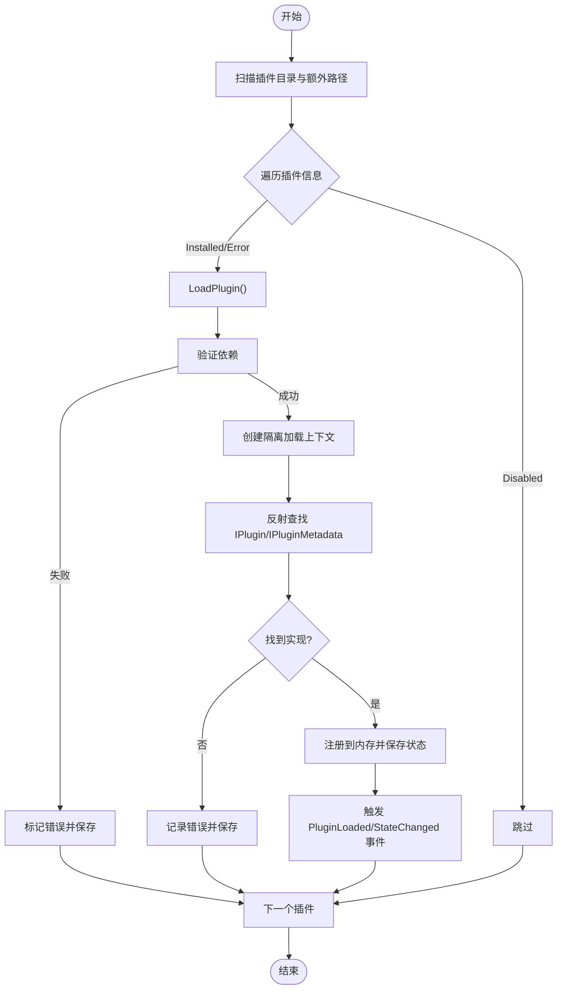
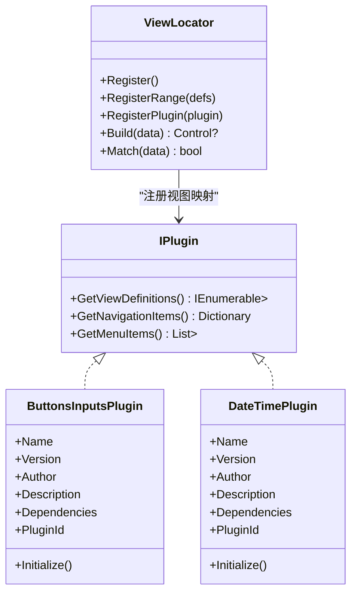
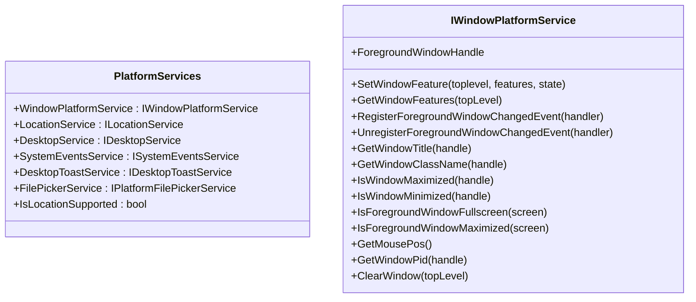
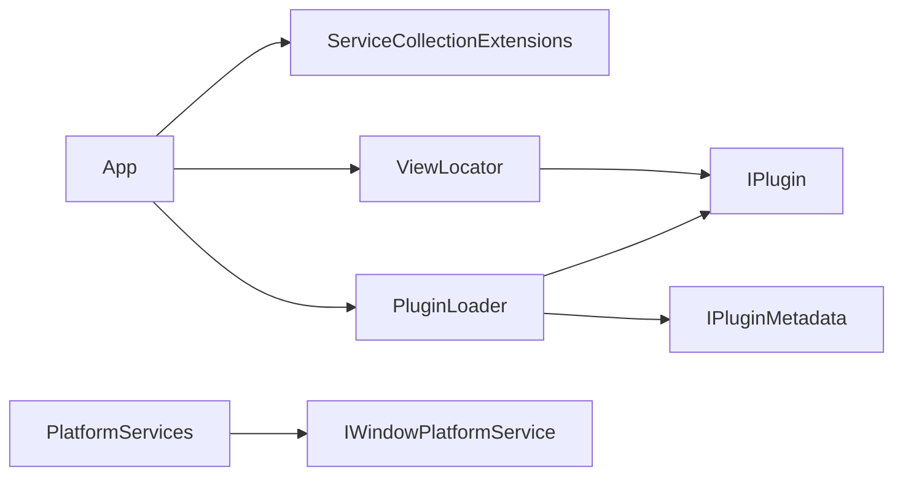

# 整体架构概览

<cite>
**本文引用的文件**
- [App.axaml.cs](file://src/launcher/Avalonia.Launcher.Desktop/App.axaml.cs)
- [Program.cs](file://src/launcher/Avalonia.Launcher.Desktop/Program.cs)
- [ServiceCollectionExtensions.cs](file://src/Avalonia.UI/Services/ServiceCollectionExtensions.cs)
- [PluginLoader.cs](file://src/Avalonia.UI/Services/PluginLoader.cs)
- [IPlugin.cs](file://src/Avalonia.Plugin.Shared/IPlugin.cs)
- [ViewLocator.cs](file://src/Avalonia.Plugin.Shared/ViewLocator.cs)
- [ServiceLocator.cs](file://src/Avalonia.Plugin.Shared/ServiceLocator.cs)
- [PlatformServices.cs](file://src/Avalonia.Platforms.Abstractions/PlatformServices.cs)
- [IWindowPlatformService.cs](file://src/Avalonia.Platforms.Abstractions/Services/IWindowPlatformService.cs)
- [ButtonsInputsPlugin.cs](file://plugins/Avalonia.Plugin.ButtonsInputs/ButtonsInputsPlugin.cs)
- [DateTimePlugin.cs](file://plugins/Avalonia.Plugin.DateTime/DateTimePlugin.cs)
</cite>

## 目录
1. [引言](#引言)
2. [项目结构](#项目结构)
3. [核心组件](#核心组件)
4. [架构总览](#架构总览)
5. [详细组件分析](#详细组件分析)
6. [依赖分析](#依赖分析)
7. [性能考虑](#性能考虑)
8. [故障排除指南](#故障排除指南)
9. [结论](#结论)

## 引言
本文件为 AvaloniaTemplate 提供整体架构概览，聚焦于分层架构设计与插件化体系。系统采用“启动器层 + 应用程序层 + 插件层 + 平台抽象层”的清晰分层，通过依赖注入容器统一管理服务生命周期，借助服务定位器在必要场景下提供便捷的服务访问能力；同时以 ViewLocator 实现 ViewModel 到 View 的自动映射，配合插件加载器实现动态扩展。

## 项目结构
项目采用多项目组织，围绕四大层次展开：
- 启动器层：负责应用入口、平台检测与生命周期初始化。
- 应用程序层：提供导航、菜单、设置、插件安装与加载等核心服务。
- 插件层：按功能模块拆分为多个插件，每个插件实现 IPlugin 接口并暴露导航项、菜单项与视图映射。
- 平台抽象层：定义跨平台服务接口与默认桩实现，具体平台通过独立项目提供真实实现。

图表来源
- [App.axaml.cs:23-40](file://src/launcher/Avalonia.Launcher.Desktop/App.axaml.cs#L23-L40)
- [ServiceCollectionExtensions.cs:10-28](file://src/Avalonia.UI/Services/ServiceCollectionExtensions.cs#L10-L28)
- [PluginLoader.cs:10-35](file://src/Avalonia.UI/Services/PluginLoader.cs#L10-L35)
- [IPlugin.cs:9-26](file://src/Avalonia.Plugin.Shared/IPlugin.cs#L9-L26)
- [ViewLocator.cs:6-42](file://src/Avalonia.Plugin.Shared/ViewLocator.cs#L6-L42)
- [PlatformServices.cs:9-44](file://src/Avalonia.Platforms.Abstractions/PlatformServices.cs#L9-L44)
- [IWindowPlatformService.cs:12-106](file://src/Avalonia.Platforms.Abstractions/Services/IWindowPlatformService.cs#L12-L106)

章节来源
- [App.axaml.cs:23-40](file://src/launcher/Avalonia.Launcher.Desktop/App.axaml.cs#L23-L40)
- [ServiceCollectionExtensions.cs:10-28](file://src/Avalonia.UI/Services/ServiceCollectionExtensions.cs#L10-L28)

## 核心组件
- 启动器 App：完成 XAML 加载、服务注册、数据库初始化、插件加载与主窗体呈现。
- 服务注册扩展：集中注册导航、菜单、设置、插件加载与 DbContext 工厂等服务。
- 插件加载器：负责插件发现、依赖校验、隔离加载、卸载与状态持久化。
- 视图定位器：基于 ViewModel 类型快速解析并实例化对应 View，支持插件注册。
- 服务定位器：在全局范围内提供 IServiceProvider 访问与本地注册服务查询。
- 平台服务抽象：统一声明窗口、定位、系统事件、文件选择等服务接口，并提供默认桩实现。

章节来源
- [App.axaml.cs:23-40](file://src/launcher/Avalonia.Launcher.Desktop/App.axaml.cs#L23-L40)
- [ServiceCollectionExtensions.cs:10-28](file://src/Avalonia.UI/Services/ServiceCollectionExtensions.cs#L10-L28)
- [PluginLoader.cs:10-35](file://src/Avalonia.UI/Services/PluginLoader.cs#L10-L35)
- [ViewLocator.cs:6-42](file://src/Avalonia.Plugin.Shared/ViewLocator.cs#L6-L42)
- [ServiceLocator.cs:5-42](file://src/Avalonia.Plugin.Shared/ServiceLocator.cs#L5-L42)
- [PlatformServices.cs:9-44](file://src/Avalonia.Platforms.Abstractions/PlatformServices.cs#L9-L44)

## 架构总览
系统采用分层解耦与插件化扩展的设计原则：
- 启动器层仅负责装配 DI 容器与触发初始化流程，不承载业务逻辑。
- 应用程序层通过服务注册扩展集中配置服务，确保依赖注入的统一性与可测试性。
- 插件层通过 IPlugin 接口约定三类能力：视图映射、导航项与菜单项，实现功能模块化与热插拔。
- 平台抽象层屏蔽平台差异，具体平台实现通过独立项目替换默认桩，保证跨平台一致性。

图表来源
- [App.axaml.cs:23-40](file://src/launcher/Avalonia.Launcher.Desktop/App.axaml.cs#L23-L40)
- [ServiceCollectionExtensions.cs:10-28](file://src/Avalonia.UI/Services/ServiceCollectionExtensions.cs#L10-L28)
- [PluginLoader.cs:10-35](file://src/Avalonia.UI/Services/PluginLoader.cs#L10-L35)
- [IPlugin.cs:9-26](file://src/Avalonia.Plugin.Shared/IPlugin.cs#L9-L26)
- [ViewLocator.cs:6-42](file://src/Avalonia.Plugin.Shared/ViewLocator.cs#L6-L42)
- [PlatformServices.cs:9-44](file://src/Avalonia.Platforms.Abstractions/PlatformServices.cs#L9-L44)
- [IWindowPlatformService.cs:12-106](file://src/Avalonia.Platforms.Abstractions/Services/IWindowPlatformService.cs#L12-L106)

## 详细组件分析

### 启动器层（App 与 Program）
- 职责
  - 初始化 Avalonia XAML 与开发工具（调试模式）。
  - 构建服务集合，注册 Avalonia 服务与 DbContext 工厂。
  - 初始化服务定位器，使全局可通过 ServiceLocator 访问 IServiceProvider。
  - 初始化数据库并写入默认设置。
  - 遍历已安装插件，注册导航项、菜单项与视图映射。
  - 根据运行时环境创建主窗体（启动画面或单视图）。
- 关键流程
  - 服务注册：通过扩展方法集中注册导航、菜单、设置、插件相关服务。
  - 插件加载：调用插件加载器加载所有插件，逐个读取 IPlugin 的三类输出并注册。
  - 视图映射：通过 ViewLocator.RegisterPlugin 将插件提供的 VM->View 映射注入定位器。

图表来源
- [Program.cs:16-23](file://src/launcher/Avalonia.Launcher.Desktop/Program.cs#L16-L23)
- [App.axaml.cs:23-40](file://src/launcher/Avalonia.Launcher.Desktop/App.axaml.cs#L23-L40)
- [ServiceCollectionExtensions.cs:10-28](file://src/Avalonia.UI/Services/ServiceCollectionExtensions.cs#L10-L28)
- [PluginLoader.cs:251-265](file://src/Avalonia.UI/Services/PluginLoader.cs#L251-L265)
- [ViewLocator.cs:32-42](file://src/Avalonia.Plugin.Shared/ViewLocator.cs#L32-L42)

章节来源
- [Program.cs:16-23](file://src/launcher/Avalonia.Launcher.Desktop/Program.cs#L16-L23)
- [App.axaml.cs:23-40](file://src/launcher/Avalonia.Launcher.Desktop/App.axaml.cs#L23-L40)

### 应用程序层（服务注册与插件管理）
- 服务注册扩展
  - 导航服务与菜单配置服务注册为单例。
  - 插件加载器与安装管理器注册为单例，便于跨模块共享。
  - DbContext 工厂使用 SQLite 存储应用数据与插件注册信息。
  - 设置服务注册为单例，提供默认配置初始化。
- 插件安装与加载
  - 插件目录与注册文件路径约定，支持额外插件路径环境变量。
  - 依赖校验失败则标记错误状态并持久化。
  - 支持启用/禁用/卸载/删除插件目录等生命周期操作。
  - 加载成功后触发事件，便于 UI 或其他模块感知状态变更。

图表来源
- [ServiceCollectionExtensions.cs:10-28](file://src/Avalonia.UI/Services/ServiceCollectionExtensions.cs#L10-L28)
- [PluginLoader.cs:251-265](file://src/Avalonia.UI/Services/PluginLoader.cs#L251-L265)
- [PluginLoader.cs:53-156](file://src/Avalonia.UI/Services/PluginLoader.cs#L53-L156)
- [PluginLoader.cs:353-372](file://src/Avalonia.UI/Services/PluginLoader.cs#L353-L372)

章节来源
- [ServiceCollectionExtensions.cs:10-28](file://src/Avalonia.UI/Services/ServiceCollectionExtensions.cs#L10-L28)
- [PluginLoader.cs:10-35](file://src/Avalonia.UI/Services/PluginLoader.cs#L10-L35)

### 插件层（IPlugin 与插件实现）
- IPlugin 接口
  - 视图映射：返回 ViewModel 类型到 View 工厂的映射集合。
  - 导航项：返回导航键到 ViewModel 工厂的字典。
  - 菜单项：返回菜单项及其可选父级键的列表。
- 插件实现示例
  - 按钮与输入插件：演示如何标注元数据并实现接口。
  - 日期时间插件：展示最小化实现，体现插件的轻量化与可选性。
- 视图定位
  - 插件加载完成后，通过 ViewLocator.RegisterPlugin 注入映射。
  - ViewLocator 内部维护哈希表，提供 O(1) 查找与覆盖策略。

图表来源
- [IPlugin.cs:9-26](file://src/Avalonia.Plugin.Shared/IPlugin.cs#L9-L26)
- [ButtonsInputsPlugin.cs:6-18](file://plugins/Avalonia.Plugin.ButtonsInputs/ButtonsInputsPlugin.cs#L6-L18)
- [DateTimePlugin.cs:6-14](file://plugins/Avalonia.Plugin.DateTime/DateTimePlugin.cs#L6-L14)
- [ViewLocator.cs:6-42](file://src/Avalonia.Plugin.Shared/ViewLocator.cs#L6-L42)

章节来源
- [IPlugin.cs:9-26](file://src/Avalonia.Plugin.Shared/IPlugin.cs#L9-L26)
- [ButtonsInputsPlugin.cs:6-18](file://plugins/Avalonia.Plugin.ButtonsInputs/ButtonsInputsPlugin.cs#L6-L18)
- [DateTimePlugin.cs:6-14](file://plugins/Avalonia.Plugin.DateTime/DateTimePlugin.cs#L6-L14)
- [ViewLocator.cs:6-42](file://src/Avalonia.Plugin.Shared/ViewLocator.cs#L6-L42)

### 平台抽象层（跨平台服务）
- 平台服务抽象
  - 统一声明窗口平台、定位、系统事件、文件选择、桌面通知等服务接口。
  - 默认提供桩实现，确保在任何平台上都能正常运行。
- 窗口平台服务接口
  - 提供窗口特性设置与查询、前台窗口变化事件、标题/类名/状态查询、鼠标位置、进程 ID、强制重绘等能力。
- 设计意义
  - 通过抽象层隔离平台差异，具体平台实现只需替换默认桩即可无缝接入。

图表来源
- [PlatformServices.cs:9-44](file://src/Avalonia.Platforms.Abstractions/PlatformServices.cs#L9-L44)
- [IWindowPlatformService.cs:12-106](file://src/Avalonia.Platforms.Abstractions/Services/IWindowPlatformService.cs#L12-L106)

章节来源
- [PlatformServices.cs:9-44](file://src/Avalonia.Platforms.Abstractions/PlatformServices.cs#L9-L44)
- [IWindowPlatformService.cs:12-106](file://src/Avalonia.Platforms.Abstractions/Services/IWindowPlatformService.cs#L12-L106)

## 依赖分析
- 启动器对应用程序层的依赖
  - 启动器通过服务注册扩展集中注册导航、菜单、设置、插件与数据库服务。
  - 插件加载器作为服务之一被启动器获取并驱动插件生命周期。
- 应用程序层对插件层的依赖
  - 插件加载器通过反射加载插件程序集，解析 IPlugin 与 IPluginMetadata。
  - 视图定位器依赖插件提供的映射进行 UI 渲染。
- 平台抽象层对具体平台的依赖
  - 抽象层提供默认桩，具体平台项目替换桩实现，形成多态注入。

图表来源
- [App.axaml.cs:23-40](file://src/launcher/Avalonia.Launcher.Desktop/App.axaml.cs#L23-L40)
- [ServiceCollectionExtensions.cs:10-28](file://src/Avalonia.UI/Services/ServiceCollectionExtensions.cs#L10-L28)
- [PluginLoader.cs:10-35](file://src/Avalonia.UI/Services/PluginLoader.cs#L10-L35)
- [IPlugin.cs:9-26](file://src/Avalonia.Plugin.Shared/IPlugin.cs#L9-L26)
- [ViewLocator.cs:6-42](file://src/Avalonia.Plugin.Shared/ViewLocator.cs#L6-L42)
- [PlatformServices.cs:9-44](file://src/Avalonia.Platforms.Abstractions/PlatformServices.cs#L9-L44)
- [IWindowPlatformService.cs:12-106](file://src/Avalonia.Platforms.Abstractions/Services/IWindowPlatformService.cs#L12-L106)

章节来源
- [App.axaml.cs:23-40](file://src/launcher/Avalonia.Launcher.Desktop/App.axaml.cs#L23-L40)
- [ServiceCollectionExtensions.cs:10-28](file://src/Avalonia.UI/Services/ServiceCollectionExtensions.cs#L10-L28)
- [PluginLoader.cs:10-35](file://src/Avalonia.UI/Services/PluginLoader.cs#L10-L35)
- [IPlugin.cs:9-26](file://src/Avalonia.Plugin.Shared/IPlugin.cs#L9-L26)
- [ViewLocator.cs:6-42](file://src/Avalonia.Plugin.Shared/ViewLocator.cs#L6-L42)
- [PlatformServices.cs:9-44](file://src/Avalonia.Platforms.Abstractions/PlatformServices.cs#L9-L44)
- [IWindowPlatformService.cs:12-106](file://src/Avalonia.Platforms.Abstractions/Services/IWindowPlatformService.cs#L12-L106)

## 性能考虑
- 插件加载隔离
  - 使用独立的 AssemblyLoadContext 隔离插件程序集，避免类型冲突并支持卸载。
- 视图映射缓存
  - ViewLocator 内部使用字典缓存 VM->View 工厂映射，查找为 O(1)，减少反射成本。
- 依赖注入
  - 单例注册降低对象创建开销；DbContext 工厂按需创建，避免常驻连接。
- 数据持久化
  - 插件注册表 JSON 文件读写加锁，批量保存减少 IO 次数。

## 故障排除指南
- 插件加载失败
  - 检查插件程序集是否存在与可加载。
  - 核对依赖项是否已加载且状态为 Loaded。
  - 查看插件注册表中错误消息字段。
- 视图未找到
  - 确认插件已通过 ViewLocator.RegisterPlugin 注册视图映射。
  - 检查 ViewModel 类型是否正确，避免命名空间或类型不匹配。
- 服务未注册
  - 确保在 App.Initialize 中调用了 AddAvaloniaServices。
  - 使用 ServiceLocator.TryGetService 进行安全查询，避免直接抛出异常。
- 平台服务不可用
  - 若平台不支持某项服务，将使用默认桩实现；请确认平台项目是否正确引用并替换桩。

章节来源
- [PluginLoader.cs:53-156](file://src/Avalonia.UI/Services/PluginLoader.cs#L53-L156)
- [ViewLocator.cs:47-68](file://src/Avalonia.Plugin.Shared/ViewLocator.cs#L47-L68)
- [ServiceLocator.cs:24-42](file://src/Avalonia.Plugin.Shared/ServiceLocator.cs#L24-L42)
- [PlatformServices.cs:9-44](file://src/Avalonia.Platforms.Abstractions/PlatformServices.cs#L9-L44)

## 结论
AvaloniaTemplate 通过清晰的分层架构与插件化设计，实现了启动器层的轻量装配、应用程序层的服务集中治理、插件层的功能模块化扩展以及平台抽象层的跨平台兼容。结合依赖注入容器与服务定位器，系统在可维护性、可扩展性与可移植性方面达到良好平衡。建议在后续演进中持续完善插件元数据与依赖图谱可视化，增强插件生态的可观测性与治理能力。