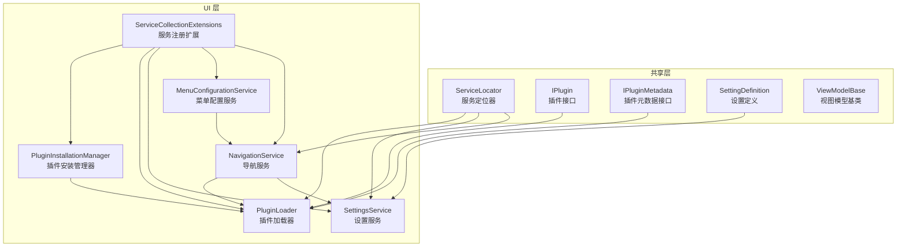
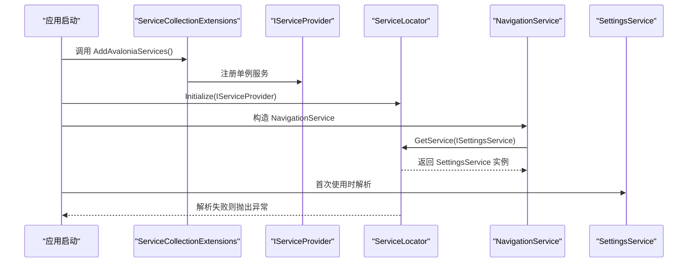
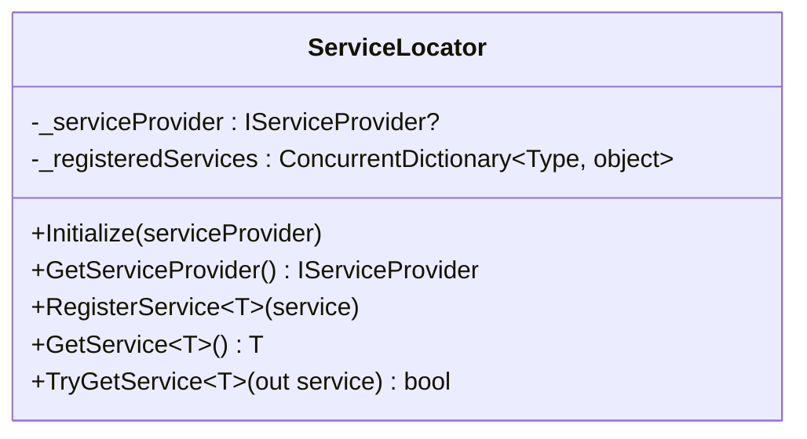
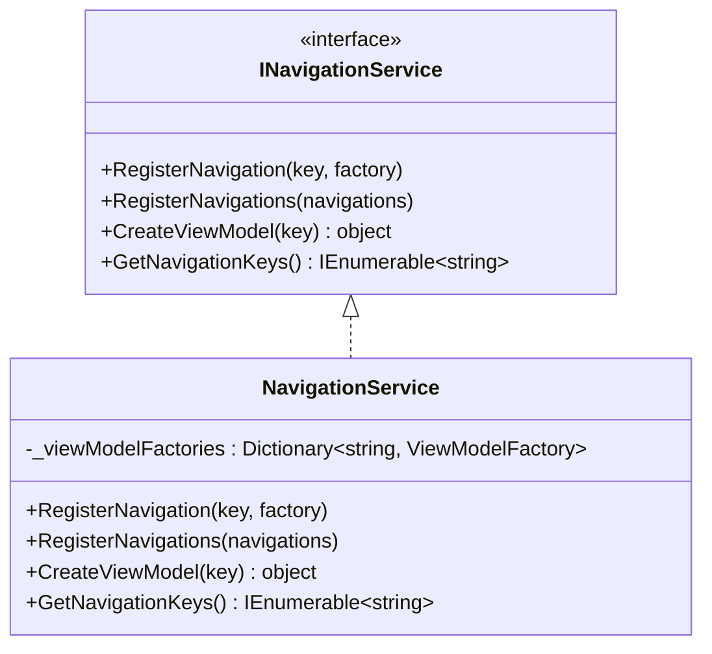
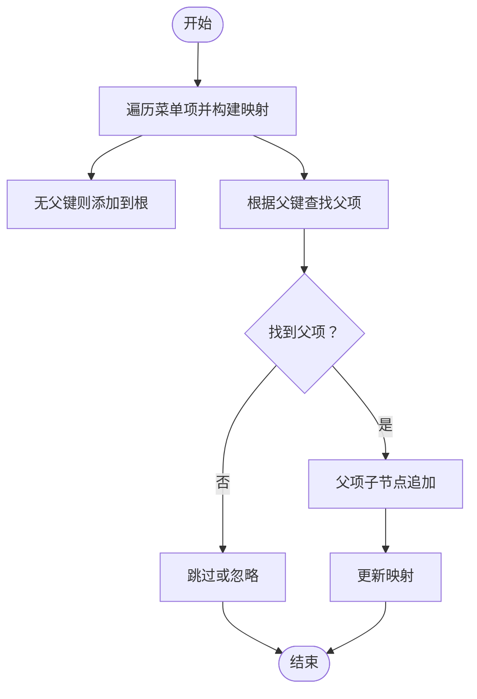
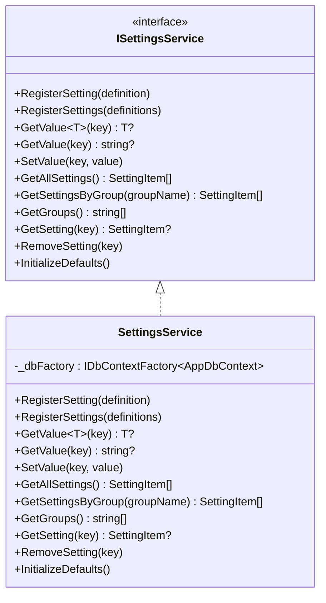
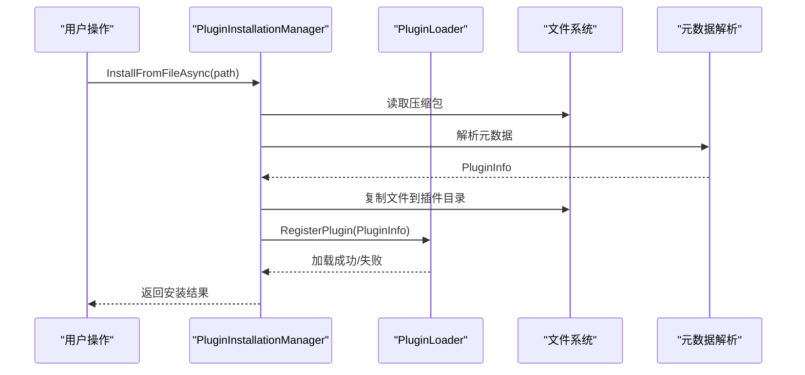
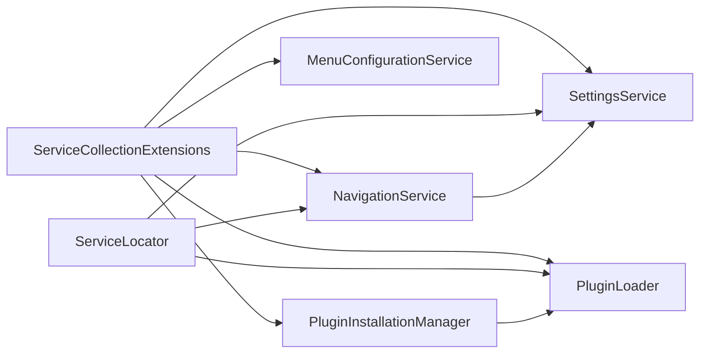

# 服务层架构

<cite>
**本文引用的文件**
- [ServiceLocator.cs](file://src/Avalonia.Plugin.Shared/ServiceLocator.cs)
- [ServiceCollectionExtensions.cs](file://src/Avalonia.UI/Services/ServiceCollectionExtensions.cs)
- [INavigationService.cs](file://src/Avalonia.UI/Services/INavigationService.cs)
- [IMenuConfigurationService.cs](file://src/Avalonia.UI/Services/IMenuConfigurationService.cs)
- [ISettingsService.cs](file://src/Avalonia.Plugin.Shared/Services/ISettingsService.cs)
- [NavigationService.cs](file://src/Avalonia.UI/Services/NavigationService.cs)
- [MenuConfigurationService.cs](file://src/Avalonia.UI/Services/MenuConfigurationService.cs)
- [SettingsService.cs](file://src/Avalonia.UI/Services/SettingsService.cs)
- [PluginInstallationManager.cs](file://src/Avalonia.UI/Services/PluginInstallationManager.cs)
- [PluginLoader.cs](file://src/Avalonia.UI/Services/PluginLoader.cs)
- [IPlugin.cs](file://src/Avalonia.Plugin.Shared/IPlugin.cs)
- [IPluginMetadata.cs](file://src/Avalonia.Plugin.Shared/IPluginMetadata.cs)
- [PluginInfo.cs](file://src/Avalonia.Plugin.Shared/Models/PluginInfo.cs)
- [SettingDefinition.cs](file://src/Avalonia.Plugin.Shared/Models/SettingDefinition.cs)
- [ViewModelBase.cs](file://src/Avalonia.Plugin.Shared/ViewModelBase.cs)
</cite>

## 目录
1. [引言](#引言)
2. [项目结构](#项目结构)
3. [核心组件](#核心组件)
4. [架构总览](#架构总览)
5. [组件详解](#组件详解)
6. [依赖关系分析](#依赖关系分析)
7. [性能考量](#性能考量)
8. [故障排查指南](#故障排查指南)
9. [结论](#结论)
10. [附录](#附录)

## 引言
本文件系统化梳理 AvaloniaTemplate 的服务层架构，重点围绕服务定位器设计模式与实现原理展开，解释依赖注入容器的使用方式与全局服务访问机制；深入剖析导航服务、设置服务、菜单配置服务等核心服务的职责划分与交互关系；阐述服务间的依赖关系与生命周期管理；说明服务注册与解析流程，以及如何实现服务的可替换性与扩展性；最后给出服务开发最佳实践与性能优化建议。

## 项目结构
服务层主要分布在以下模块：
- 共享层：服务定位器、插件接口与元数据、基础模型与工具类
- UI 层：导航、菜单、设置、插件加载与安装管理等服务实现，以及服务注册扩展

图表来源
- [ServiceLocator.cs:1-64](file://src/Avalonia.Plugin.Shared/ServiceLocator.cs#L1-L64)
- [ServiceCollectionExtensions.cs:1-30](file://src/Avalonia.UI/Services/ServiceCollectionExtensions.cs#L1-L30)
- [NavigationService.cs:1-62](file://src/Avalonia.UI/Services/NavigationService.cs#L1-L62)
- [MenuConfigurationService.cs:1-194](file://src/Avalonia.UI/Services/MenuConfigurationService.cs#L1-L194)
- [SettingsService.cs:1-137](file://src/Avalonia.UI/Services/SettingsService.cs#L1-L137)
- [PluginLoader.cs:1-460](file://src/Avalonia.UI/Services/PluginLoader.cs#L1-L460)
- [PluginInstallationManager.cs:1-261](file://src/Avalonia.UI/Services/PluginInstallationManager.cs#L1-L261)
- [IPlugin.cs:1-81](file://src/Avalonia.Plugin.Shared/IPlugin.cs#L1-L81)
- [IPluginMetadata.cs:1-44](file://src/Avalonia.Plugin.Shared/IPluginMetadata.cs#L1-L44)
- [SettingDefinition.cs:1-89](file://src/Avalonia.Plugin.Shared/Models/SettingDefinition.cs#L1-L89)

章节来源
- [ServiceLocator.cs:1-64](file://src/Avalonia.Plugin.Shared/ServiceLocator.cs#L1-L64)
- [ServiceCollectionExtensions.cs:1-30](file://src/Avalonia.UI/Services/ServiceCollectionExtensions.cs#L1-L30)

## 核心组件
- 服务定位器（ServiceLocator）
  - 提供全局初始化与服务解析能力，内部维护一个并发字典用于本地注册服务，并回退到 IServiceProvider 进行解析
  - 支持强制解析与安全解析（TryGetService），避免未初始化或缺失服务导致的异常传播
- 导航服务（NavigationService）
  - 负责注册与创建 ViewModel 工厂，内置默认导航项，同时负责将 ViewModel 与 View 做绑定（通过 ViewLocator）
- 菜单配置服务（MenuConfigurationService）
  - 维护菜单树结构，支持注册、移除、查询菜单项，构建菜单项映射以支持父子关系
- 设置服务（SettingsService）
  - 基于 Entity Framework Core 管理设置项的持久化，提供注册、读取、写入、分组查询与默认初始化
- 插件加载与安装（PluginLoader、PluginInstallationManager）
  - 加载/卸载插件，管理插件状态与依赖校验；支持从包安装、启用/禁用、卸载与额外路径加载

章节来源
- [ServiceLocator.cs:1-64](file://src/Avalonia.Plugin.Shared/ServiceLocator.cs#L1-L64)
- [NavigationService.cs:1-62](file://src/Avalonia.UI/Services/NavigationService.cs#L1-L62)
- [MenuConfigurationService.cs:1-194](file://src/Avalonia.UI/Services/MenuConfigurationService.cs#L1-L194)
- [SettingsService.cs:1-137](file://src/Avalonia.UI/Services/SettingsService.cs#L1-L137)
- [PluginLoader.cs:1-460](file://src/Avalonia.UI/Services/PluginLoader.cs#L1-L460)
- [PluginInstallationManager.cs:1-261](file://src/Avalonia.UI/Services/PluginInstallationManager.cs#L1-L261)

## 架构总览
服务层采用“共享定位器 + DI 容器”的混合模式：
- 启动阶段通过扩展方法集中注册核心服务（单例）
- 运行时通过服务定位器统一解析服务，优先从本地注册表解析，否则回退到 DI 容器
- 导航服务在构造函数中直接通过服务定位器解析依赖，确保默认导航项可用
- 设置服务通过 DbContextFactory 访问 SQLite 数据库，实现设置项持久化
- 插件体系通过独立的加载器与安装管理器解耦，支持动态加载与卸载

图表来源
- [ServiceCollectionExtensions.cs:10-28](file://src/Avalonia.UI/Services/ServiceCollectionExtensions.cs#L10-L28)
- [ServiceLocator.cs:10-42](file://src/Avalonia.Plugin.Shared/ServiceLocator.cs#L10-L42)
- [NavigationService.cs:13-33](file://src/Avalonia.UI/Services/NavigationService.cs#L13-L33)

## 组件详解

### 服务定位器（ServiceLocator）
- 设计要点
  - 单例式静态入口，提供 Initialize 与 GetServiceProvider
  - 内部并发字典用于本地注册服务，提升解析速度并支持替换
  - GetService/TryGetService 双通道解析，增强健壮性
- 生命周期
  - 初始化一次，运行期只读；本地注册服务可按需替换
- 使用建议
  - 在应用启动阶段完成 Initialize
  - 对可替换组件优先使用本地注册，避免硬编码依赖

图表来源
- [ServiceLocator.cs:5-63](file://src/Avalonia.Plugin.Shared/ServiceLocator.cs#L5-L63)

章节来源
- [ServiceLocator.cs:1-64](file://src/Avalonia.Plugin.Shared/ServiceLocator.cs#L1-L64)

### 导航服务（NavigationService）
- 职责
  - 注册导航项（键 -> ViewModel 工厂）
  - 批量注册与枚举导航键
  - 创建 ViewModel 实例
  - 默认注册演示页面与设置页，并建立 ViewModel 与 View 的映射
- 依赖
  - 通过服务定位器解析 ISettingsService、IPluginLoader、IPluginInstallationManager
- 性能
  - 工厂字典 O(1) 查找
  - 默认导航项在构造函数中一次性注册

图表来源
- [INavigationService.cs:6-33](file://src/Avalonia.UI/Services/INavigationService.cs#L6-L33)
- [NavigationService.cs:9-61](file://src/Avalonia.UI/Services/NavigationService.cs#L9-L61)

章节来源
- [NavigationService.cs:1-62](file://src/Avalonia.UI/Services/NavigationService.cs#L1-L62)
- [INavigationService.cs:1-34](file://src/Avalonia.UI/Services/INavigationService.cs#L1-L34)

### 菜单配置服务（MenuConfigurationService）
- 职责
  - 维护菜单树结构，支持注册、移除、查询菜单项
  - 构建菜单项映射，支持父子关系与多级菜单
- 关键算法
  - 递归构建映射与查找父节点
  - 深度优先移除子树

图表来源
- [MenuConfigurationService.cs:19-129](file://src/Avalonia.UI/Services/MenuConfigurationService.cs#L19-L129)

章节来源
- [MenuConfigurationService.cs:1-194](file://src/Avalonia.UI/Services/MenuConfigurationService.cs#L1-L194)
- [IMenuConfigurationService.cs:1-40](file://src/Avalonia.UI/Services/IMenuConfigurationService.cs#L1-L40)

### 设置服务（SettingsService）
- 职责
  - 注册设置定义（去重更新或新增）
  - 读取/写入设置值
  - 分组查询与获取全部设置
  - 初始化默认设置
- 数据持久化
  - 使用 DbContextFactory 创建数据库上下文，SQLite 存储
- 复杂度
  - 注册/读取基于主键查询，O(1)
  - 分组查询带排序，O(n log n)

图表来源
- [ISettingsService.cs:5-18](file://src/Avalonia.Plugin.Shared/Services/ISettingsService.cs#L5-L18)
- [SettingsService.cs:8-136](file://src/Avalonia.UI/Services/SettingsService.cs#L8-L136)

章节来源
- [SettingsService.cs:1-137](file://src/Avalonia.UI/Services/SettingsService.cs#L1-L137)
- [ISettingsService.cs:1-19](file://src/Avalonia.Plugin.Shared/Services/ISettingsService.cs#L1-L19)
- [SettingDefinition.cs:1-89](file://src/Avalonia.Plugin.Shared/Models/SettingDefinition.cs#L1-L89)

### 插件体系（PluginLoader 与 PluginInstallationManager）
- PluginLoader
  - 管理插件注册表、加载上下文、已加载插件与元数据
  - 支持加载/卸载、启用/禁用、标记卸载、批量加载与额外路径加载
  - 依赖验证与状态持久化（注册表 JSON）
- PluginInstallationManager
  - 从文件/流安装插件，解析元数据（nuspec/plugin.json/dll 反射）
  - 安全校验（路径穿越检测）、复制文件、触发加载器注册
  - 发布插件安装/卸载事件

图表来源
- [PluginInstallationManager.cs:29-151](file://src/Avalonia.UI/Services/PluginInstallationManager.cs#L29-L151)
- [PluginLoader.cs:318-351](file://src/Avalonia.UI/Services/PluginLoader.cs#L318-L351)

章节来源
- [PluginLoader.cs:1-460](file://src/Avalonia.UI/Services/PluginLoader.cs#L1-L460)
- [PluginInstallationManager.cs:1-261](file://src/Avalonia.UI/Services/PluginInstallationManager.cs#L1-L261)
- [IPlugin.cs:1-81](file://src/Avalonia.Plugin.Shared/IPlugin.cs#L1-L81)
- [IPluginMetadata.cs:1-44](file://src/Avalonia.Plugin.Shared/IPluginMetadata.cs#L1-L44)
- [PluginInfo.cs:1-19](file://src/Avalonia.Plugin.Shared/Models/PluginInfo.cs#L1-L19)

## 依赖关系分析
- 服务注册
  - 通过扩展方法集中注册：导航、菜单、设置、插件加载器与安装管理器均为单例
- 服务解析
  - 优先本地注册，其次 DI 容器；未初始化或缺失时抛出异常
- 组件耦合
  - NavigationService 依赖 SettingsService 与插件相关服务
  - MenuConfigurationService 依赖导航服务提供的结构（间接）
  - SettingsService 依赖数据库上下文工厂
  - PluginInstallationManager 依赖 PluginLoader 与文件系统
- 循环依赖
  - 当前设计避免了循环依赖：服务定位器仅作为解析入口，不持有具体服务实例

图表来源
- [ServiceCollectionExtensions.cs:10-28](file://src/Avalonia.UI/Services/ServiceCollectionExtensions.cs#L10-L28)
- [ServiceLocator.cs:10-42](file://src/Avalonia.Plugin.Shared/ServiceLocator.cs#L10-L42)
- [NavigationService.cs:13-33](file://src/Avalonia.UI/Services/NavigationService.cs#L13-L33)

章节来源
- [ServiceCollectionExtensions.cs:1-30](file://src/Avalonia.UI/Services/ServiceCollectionExtensions.cs#L1-L30)
- [ServiceLocator.cs:1-64](file://src/Avalonia.Plugin.Shared/ServiceLocator.cs#L1-L64)

## 性能考量
- 服务解析
  - 本地注册使用并发字典，GetService/TryGetService 均为 O(1)
  - 建议对热点服务进行本地注册，减少容器解析开销
- 导航与菜单
  - 导航工厂字典与菜单映射均为内存结构，查询高效
  - 大型菜单建议延迟构建或分层加载
- 设置服务
  - SQLite 访问应避免频繁 IO，建议批量写入与缓存常用设置
  - 分组查询与排序在数据量大时注意索引与分页
- 插件体系
  - 加载上下文隔离带来内存占用，卸载后及时释放
  - 安装流程中路径校验与文件复制为 IO 密集，建议异步与进度反馈

## 故障排查指南
- 未初始化服务定位器
  - 现象：调用 GetService/TryGetService 抛出异常
  - 处理：确保在应用启动阶段调用 Initialize
- 服务缺失
  - 现象：TryGetService 返回 false 或 GetService 抛异常
  - 处理：检查扩展方法是否注册该服务，确认 DI 容器配置
- 导航键不存在
  - 现象：CreateViewModel 抛出参数异常
  - 处理：确认导航键是否正确注册，或检查默认注册逻辑
- 插件安装失败
  - 现象：返回错误信息（路径穿越、缺少元数据、加载异常）
  - 处理：检查包完整性、元数据格式、目标路径权限
- 插件依赖问题
  - 现象：加载失败提示依赖未满足
  - 处理：检查依赖 ID 是否存在且已加载

章节来源
- [ServiceLocator.cs:15-42](file://src/Avalonia.Plugin.Shared/ServiceLocator.cs#L15-L42)
- [NavigationService.cs:48-55](file://src/Avalonia.UI/Services/NavigationService.cs#L48-L55)
- [PluginInstallationManager.cs:30-151](file://src/Avalonia.UI/Services/PluginInstallationManager.cs#L30-L151)
- [PluginLoader.cs:353-372](file://src/Avalonia.UI/Services/PluginLoader.cs#L353-L372)

## 结论
本服务层架构通过“共享定位器 + DI 容器”实现了灵活的服务解析与全局访问；核心服务职责清晰、边界明确，具备良好的可替换性与扩展性。通过本地注册与容器注册双通道，既保证了解析效率，又保留了依赖注入的灵活性。插件体系独立于核心服务，支持动态加载与卸载，进一步增强了系统的开放性与可维护性。

## 附录
- 最佳实践
  - 在应用启动阶段完成服务定位器初始化与服务注册
  - 对高频服务进行本地注册，降低容器解析成本
  - 将跨模块依赖通过接口抽象，避免紧耦合
  - 对外部资源（文件系统、数据库）进行异常捕获与降级处理
- 扩展建议
  - 新增服务时，优先考虑单例注册并通过接口暴露
  - 对复杂业务场景引入工厂或策略模式，便于替换与测试
  - 对插件扩展点进行标准化（如 IPlugin、IPluginMetadata），统一生命周期管理