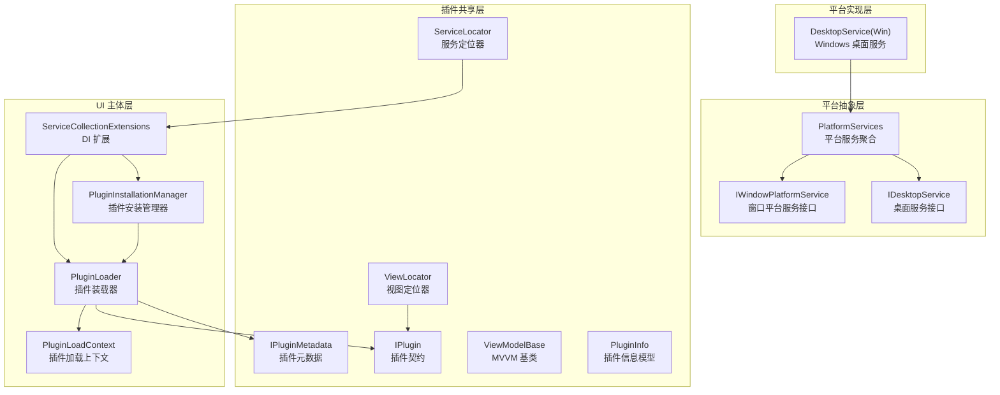
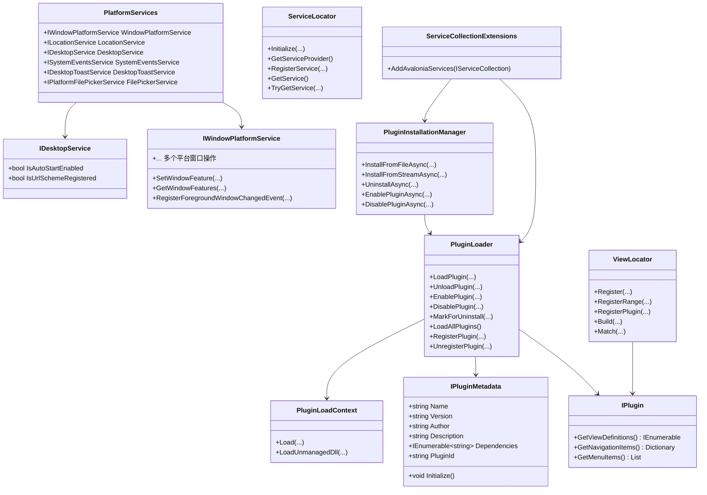
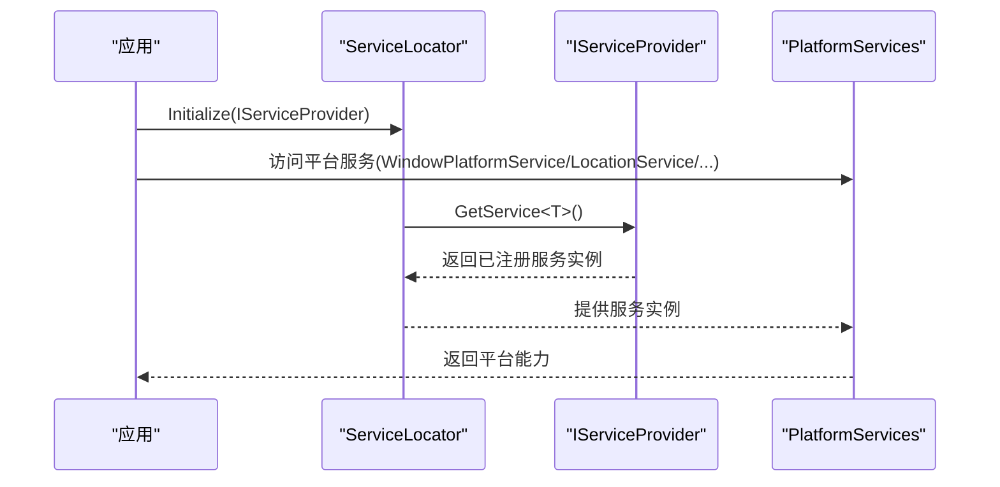
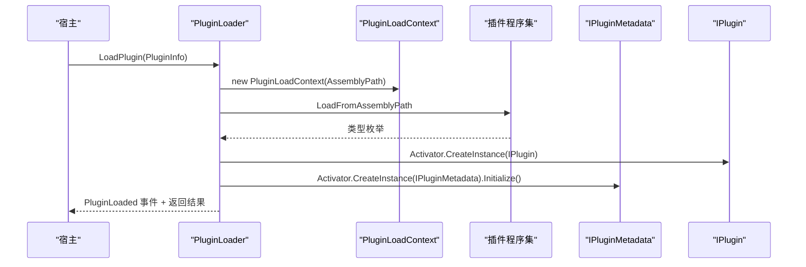
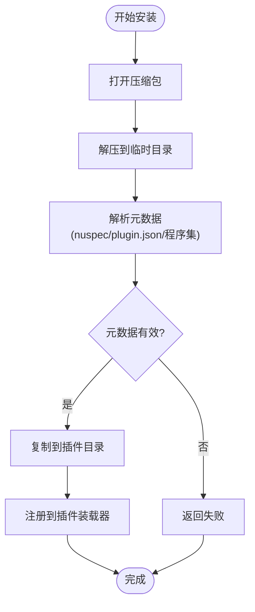
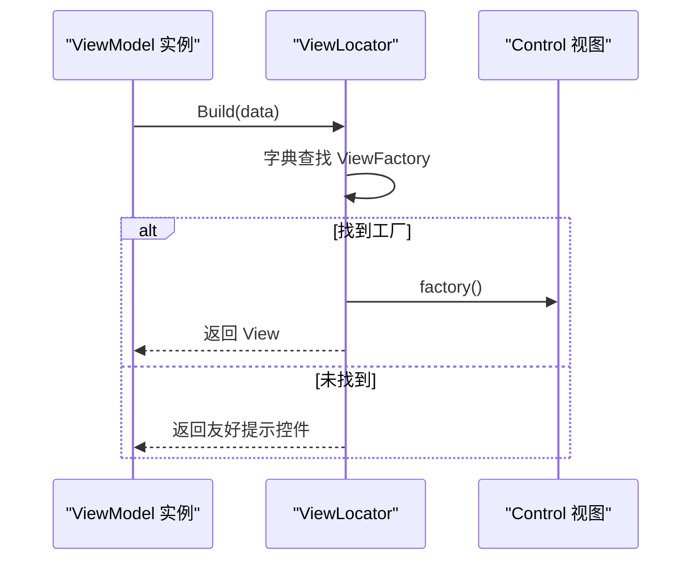
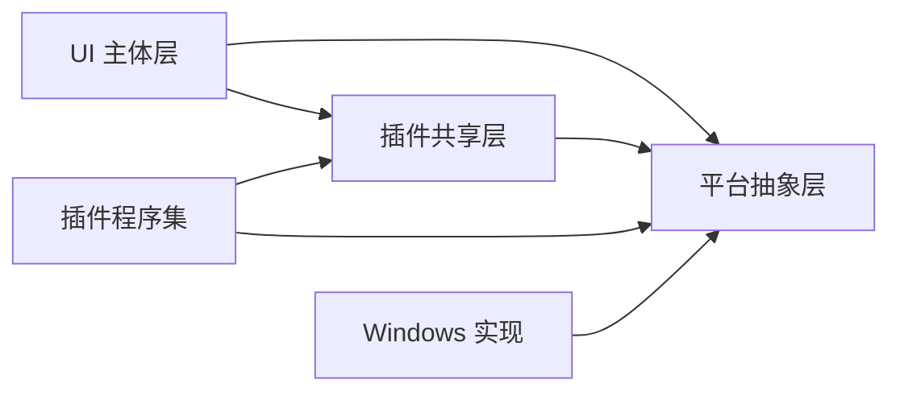

# 架构设计

<cite>
**本文引用的文件**
- [PlatformServices.cs](file://src/Avalonia.Platforms.Abstractions/PlatformServices.cs)
- [IWindowPlatformService.cs](file://src/Avalonia.Platforms.Abstractions/Services/IWindowPlatformService.cs)
- [IDesktopService.cs](file://src/Avalonia.Platforms.Abstractions/Services/IDesktopService.cs)
- [ServiceLocator.cs](file://src/Avalonia.Plugin.Shared/ServiceLocator.cs)
- [IPlugin.cs](file://src/Avalonia.Plugin.Shared/IPlugin.cs)
- [IPluginMetadata.cs](file://src/Avalonia.Plugin.Shared/IPluginMetadata.cs)
- [ViewLocator.cs](file://src/Avalonia.Plugin.Shared/ViewLocator.cs)
- [ViewModelBase.cs](file://src/Avalonia.Plugin.Shared/ViewModelBase.cs)
- [PluginInfo.cs](file://src/Avalonia.Plugin.Shared/Models/PluginInfo.cs)
- [PluginLoader.cs](file://src/Avalonia.UI/Services/PluginLoader.cs)
- [PluginLoadContext.cs](file://src/Avalonia.UI/Services/PluginLoadContext.cs)
- [PluginInstallationManager.cs](file://src/Avalonia.UI/Services/PluginInstallationManager.cs)
- [ServiceCollectionExtensions.cs](file://src/Avalonia.UI/Services/ServiceCollectionExtensions.cs)
- [DesktopService.cs（Windows）](file://src/platforms/Avalonia.Platforms.Windows/Services/DesktopService.cs)
</cite>

## 目录
1. [引言](#引言)
2. [项目结构](#项目结构)
3. [核心组件](#核心组件)
4. [架构总览](#架构总览)
5. [详细组件分析](#详细组件分析)
6. [依赖分析](#依赖分析)
7. [性能考虑](#性能考虑)
8. [故障排查指南](#故障排查指南)
9. [结论](#结论)
10. [附录](#附录)

## 引言
本架构设计文档面向 AvaloniaTemplate 的插件化 UI 模板工程，聚焦于分层设计、插件化架构与依赖注入模式的协同实现。文档将系统性解析平台抽象层、服务定位器、插件装载与生命周期管理、视图/视图模型映射机制，并给出跨平台兼容策略与设计权衡。目标读者为架构师与高级开发者。

## 项目结构
项目采用“平台抽象 + 插件共享 + UI 主体 + 平台实现”的分层组织方式：
- 平台抽象层：定义跨平台服务接口与基础设施，屏蔽平台差异
- 插件共享层：定义插件契约、元数据、视图定位器、服务定位器等通用能力
- UI 主体层：承载应用主窗体、导航、设置、插件安装与装载流程
- 平台实现层：针对 Windows/Linux/macOS 提供具体服务实现

图表来源
- [PlatformServices.cs:1-45](file://src/Avalonia.Platforms.Abstractions/PlatformServices.cs#L1-L45)
- [IWindowPlatformService.cs:1-106](file://src/Avalonia.Platforms.Abstractions/Services/IWindowPlatformService.cs#L1-L106)
- [IDesktopService.cs:1-17](file://src/Avalonia.Platforms.Abstractions/Services/IDesktopService.cs#L1-L17)
- [ServiceLocator.cs:1-64](file://src/Avalonia.Plugin.Shared/ServiceLocator.cs#L1-L64)
- [IPlugin.cs:1-81](file://src/Avalonia.Plugin.Shared/IPlugin.cs#L1-L81)
- [IPluginMetadata.cs:1-44](file://src/Avalonia.Plugin.Shared/IPluginMetadata.cs#L1-L44)
- [ViewLocator.cs:1-72](file://src/Avalonia.Plugin.Shared/ViewLocator.cs#L1-L72)
- [PluginInfo.cs:1-19](file://src/Avalonia.Plugin.Shared/Models/PluginInfo.cs#L1-L19)
- [PluginLoader.cs:1-460](file://src/Avalonia.UI/Services/PluginLoader.cs#L1-L460)
- [PluginLoadContext.cs:1-107](file://src/Avalonia.UI/Services/PluginLoadContext.cs#L1-L107)
- [PluginInstallationManager.cs:1-261](file://src/Avalonia.UI/Services/PluginInstallationManager.cs#L1-L261)
- [ServiceCollectionExtensions.cs:1-30](file://src/Avalonia.UI/Services/ServiceCollectionExtensions.cs#L1-L30)
- [DesktopService.cs（Windows）:1-45](file://src/platforms/Avalonia.Platforms.Windows/Services/DesktopService.cs#L1-L45)

章节来源
- [PlatformServices.cs:1-45](file://src/Avalonia.Platforms.Abstractions/PlatformServices.cs#L1-L45)
- [ServiceCollectionExtensions.cs:1-30](file://src/Avalonia.UI/Services/ServiceCollectionExtensions.cs#L1-L30)

## 核心组件
- 平台服务聚合器：集中暴露窗口、定位、系统事件、桌面通知、文件选择等平台服务，便于上层统一访问
- 插件契约与元数据：定义插件对外暴露的视图/导航/菜单能力，以及插件元信息
- 插件装载器与加载上下文：负责插件装配、依赖校验、隔离卸载、注册表持久化
- 安装管理器：支持从包安装、卸载、启用/禁用插件，解析 nuspec/plugin.json 元数据
- 视图定位器：基于字典的 O(1) 视图映射查找，支持插件注册与冲突覆盖
- 服务定位器：提供轻量级 IServiceProvider 访问与本地注册表兜底
- MVVM 基类：基于 CommunityToolkit 的 ObservableObject 基类

章节来源
- [IPlugin.cs:1-81](file://src/Avalonia.Plugin.Shared/IPlugin.cs#L1-L81)
- [IPluginMetadata.cs:1-44](file://src/Avalonia.Plugin.Shared/IPluginMetadata.cs#L1-L44)
- [PluginLoader.cs:1-460](file://src/Avalonia.UI/Services/PluginLoader.cs#L1-L460)
- [PluginLoadContext.cs:1-107](file://src/Avalonia.UI/Services/PluginLoadContext.cs#L1-L107)
- [PluginInstallationManager.cs:1-261](file://src/Avalonia.UI/Services/PluginInstallationManager.cs#L1-L261)
- [ViewLocator.cs:1-72](file://src/Avalonia.Plugin.Shared/ViewLocator.cs#L1-L72)
- [ServiceLocator.cs:1-64](file://src/Avalonia.Plugin.Shared/ServiceLocator.cs#L1-L64)
- [ViewModelBase.cs:1-12](file://src/Avalonia.Plugin.Shared/ViewModelBase.cs#L1-L12)

## 架构总览
AvaloniaTemplate 采用“平台抽象 + 插件化 + 依赖注入”的混合架构：
- 分层设计：UI 主体层不直接依赖平台细节，通过抽象接口与服务定位器解耦
- 插件化：插件以独立程序集加载，具备独立依赖解析与卸载能力
- 依赖注入：通过扩展方法集中注册导航、菜单、插件、设置等服务
- 跨平台：平台抽象层统一入口，平台实现层按需替换

图表来源
- [PlatformServices.cs:1-45](file://src/Avalonia.Platforms.Abstractions/PlatformServices.cs#L1-L45)
- [IWindowPlatformService.cs:1-106](file://src/Avalonia.Platforms.Abstractions/Services/IWindowPlatformService.cs#L1-L106)
- [IDesktopService.cs:1-17](file://src/Avalonia.Platforms.Abstractions/Services/IDesktopService.cs#L1-L17)
- [IPlugin.cs:1-81](file://src/Avalonia.Plugin.Shared/IPlugin.cs#L1-L81)
- [IPluginMetadata.cs:1-44](file://src/Avalonia.Plugin.Shared/IPluginMetadata.cs#L1-L44)
- [PluginLoader.cs:1-460](file://src/Avalonia.UI/Services/PluginLoader.cs#L1-L460)
- [PluginLoadContext.cs:1-107](file://src/Avalonia.UI/Services/PluginLoadContext.cs#L1-L107)
- [PluginInstallationManager.cs:1-261](file://src/Avalonia.UI/Services/PluginInstallationManager.cs#L1-L261)
- [ViewLocator.cs:1-72](file://src/Avalonia.Plugin.Shared/ViewLocator.cs#L1-L72)
- [ServiceLocator.cs:1-64](file://src/Avalonia.Plugin.Shared/ServiceLocator.cs#L1-L64)
- [ServiceCollectionExtensions.cs:1-30](file://src/Avalonia.UI/Services/ServiceCollectionExtensions.cs#L1-L30)

## 详细组件分析

### 平台抽象层与服务定位器
- 平台服务聚合器集中暴露窗口、定位、系统事件、桌面通知、文件选择等服务，默认提供桩实现，确保上层无感切换
- 服务定位器提供 IServiceProvider 初始化与服务解析，支持本地注册表兜底，避免重复初始化与缺失服务异常

图表来源
- [ServiceLocator.cs:1-64](file://src/Avalonia.Plugin.Shared/ServiceLocator.cs#L1-L64)
- [PlatformServices.cs:1-45](file://src/Avalonia.Platforms.Abstractions/PlatformServices.cs#L1-L45)

章节来源
- [ServiceLocator.cs:1-64](file://src/Avalonia.Plugin.Shared/ServiceLocator.cs#L1-L64)
- [PlatformServices.cs:1-45](file://src/Avalonia.Platforms.Abstractions/PlatformServices.cs#L1-L45)

### 插件系统：装载、依赖与生命周期
- 插件装载器负责：
  - 插件注册表持久化与加载
  - 依赖完整性校验（依赖必须已加载）
  - 基于收集式 AssemblyLoadContext 的隔离加载与卸载
  - 支持额外插件目录扫描（环境变量）
- 加载上下文：
  - 排除系统/框架/工具集程序集，优先解析插件自身依赖
  - 对未解析依赖进行插件目录探测，提升跨平台部署灵活性
- 生命周期事件：加载、卸载、状态变更均广播，便于 UI 与日志联动

图表来源
- [PluginLoader.cs:1-460](file://src/Avalonia.UI/Services/PluginLoader.cs#L1-L460)
- [PluginLoadContext.cs:1-107](file://src/Avalonia.UI/Services/PluginLoadContext.cs#L1-L107)

章节来源
- [PluginLoader.cs:1-460](file://src/Avalonia.UI/Services/PluginLoader.cs#L1-L460)
- [PluginLoadContext.cs:1-107](file://src/Avalonia.UI/Services/PluginLoadContext.cs#L1-L107)

### 插件安装与元数据解析
- 支持从压缩包安装：安全校验（路径穿越）、逐条解压、复制到目标目录
- 元数据解析优先级：nuspec > plugin.json > 程序集元数据
- 支持启用/禁用/卸载与延迟卸载（PendingUninstall）

图表来源
- [PluginInstallationManager.cs:1-261](file://src/Avalonia.UI/Services/PluginInstallationManager.cs#L1-L261)

章节来源
- [PluginInstallationManager.cs:1-261](file://src/Avalonia.UI/Services/PluginInstallationManager.cs#L1-L261)

### 视图/视图模型映射与导航
- 视图定位器采用字典注册，O(1) 查找；支持批量注册与插件注册，后注册覆盖先注册
- 插件通过 IPlugin 暴露导航项与菜单项，由 UI 层统一接入

图表来源
- [ViewLocator.cs:1-72](file://src/Avalonia.Plugin.Shared/ViewLocator.cs#L1-L72)
- [IPlugin.cs:1-81](file://src/Avalonia.Plugin.Shared/IPlugin.cs#L1-L81)

章节来源
- [ViewLocator.cs:1-72](file://src/Avalonia.Plugin.Shared/ViewLocator.cs#L1-L72)
- [IPlugin.cs:1-81](file://src/Avalonia.Plugin.Shared/IPlugin.cs#L1-L81)

### 依赖注入与服务注册
- 通过扩展方法集中注册导航、菜单配置、插件装载器、安装管理器、设置服务与数据库上下文工厂
- 插件装载器与安装管理器作为单例注入，便于全局访问

章节来源
- [ServiceCollectionExtensions.cs:1-30](file://src/Avalonia.UI/Services/ServiceCollectionExtensions.cs#L1-L30)

### 平台实现示例：Windows 桌面服务
- Windows 平台实现 IDesktopService，提供自启动与 URL 协议注册能力
- 通过 PlatformServices 注入默认实现，实现平台无关访问

章节来源
- [DesktopService.cs（Windows）:1-45](file://src/platforms/Avalonia.Platforms.Windows/Services/DesktopService.cs#L1-L45)
- [PlatformServices.cs:1-45](file://src/Avalonia.Platforms.Abstractions/PlatformServices.cs#L1-L45)

## 依赖分析
- 组件内聚与解耦
  - UI 主体层仅依赖抽象接口与共享层契约，避免对平台实现的直接依赖
  - 插件装载器与安装管理器通过事件与注册表解耦 UI 更新
- 外部依赖
  - Avalonia、CommunityToolkit、EF Core、Microsoft.Extensions.DependencyInjection
- 循环依赖规避
  - 通过接口与事件驱动，避免装载器与 UI 的直接循环引用

图表来源
- [ServiceCollectionExtensions.cs:1-30](file://src/Avalonia.UI/Services/ServiceCollectionExtensions.cs#L1-L30)
- [PluginLoader.cs:1-460](file://src/Avalonia.UI/Services/PluginLoader.cs#L1-L460)
- [PlatformServices.cs:1-45](file://src/Avalonia.Platforms.Abstractions/PlatformServices.cs#L1-L45)

## 性能考虑
- 视图定位器采用字典 O(1) 查找，注册与查找均为常数时间复杂度
- 插件装载器使用 AssemblyLoadContext 隔离，卸载后释放内存，降低长期运行内存压力
- 依赖解析优先使用内置解析器与插件目录探测，减少反射与 IO 开销
- 安装流程异步化，支持进度回调，避免阻塞 UI

## 故障排查指南
- 插件无法加载
  - 检查插件依赖是否已加载，确认依赖 ID 与版本匹配
  - 查看插件注册表错误消息字段，定位具体失败原因
- 插件卸载失败
  - 确认插件非内置且状态允许卸载；检查 PendingUninstall 是否触发清理
- 视图未找到
  - 确认插件已注册视图映射；检查冲突覆盖情况
- 服务未找到
  - 确保 ServiceLocator 已初始化；检查本地注册表与容器注册

章节来源
- [PluginLoader.cs:1-460](file://src/Avalonia.UI/Services/PluginLoader.cs#L1-L460)
- [ViewLocator.cs:1-72](file://src/Avalonia.Plugin.Shared/ViewLocator.cs#L1-L72)
- [ServiceLocator.cs:1-64](file://src/Avalonia.Plugin.Shared/ServiceLocator.cs#L1-L64)

## 结论
AvaloniaTemplate 通过平台抽象层、插件化架构与依赖注入的有机结合，实现了高内聚、低耦合、可扩展且跨平台的应用模板。插件装载器与加载上下文提供了安全可控的动态扩展能力；视图定位器与服务定位器保障了 UI 与服务的解耦与易用性。该架构在保证开发体验的同时，兼顾了长期演进与多平台部署需求。

## 附录
- 关键接口与类的职责边界
  - 平台抽象层：统一平台能力入口，提供默认桩实现
  - 插件共享层：定义契约与通用基础设施，屏蔽插件差异
  - UI 主体层：编排导航、设置、插件管理与平台服务
  - 平台实现层：按需替换具体平台能力