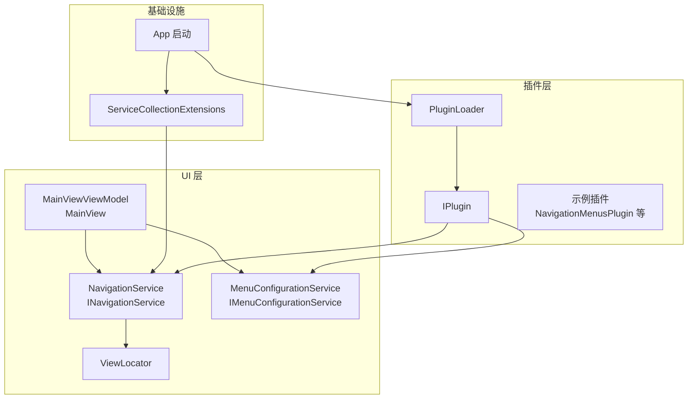
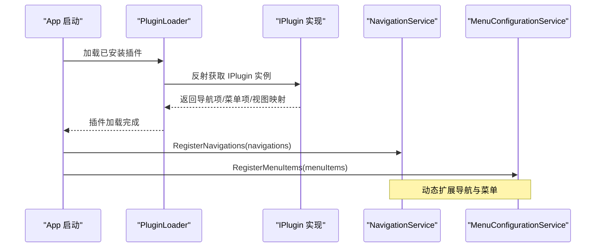
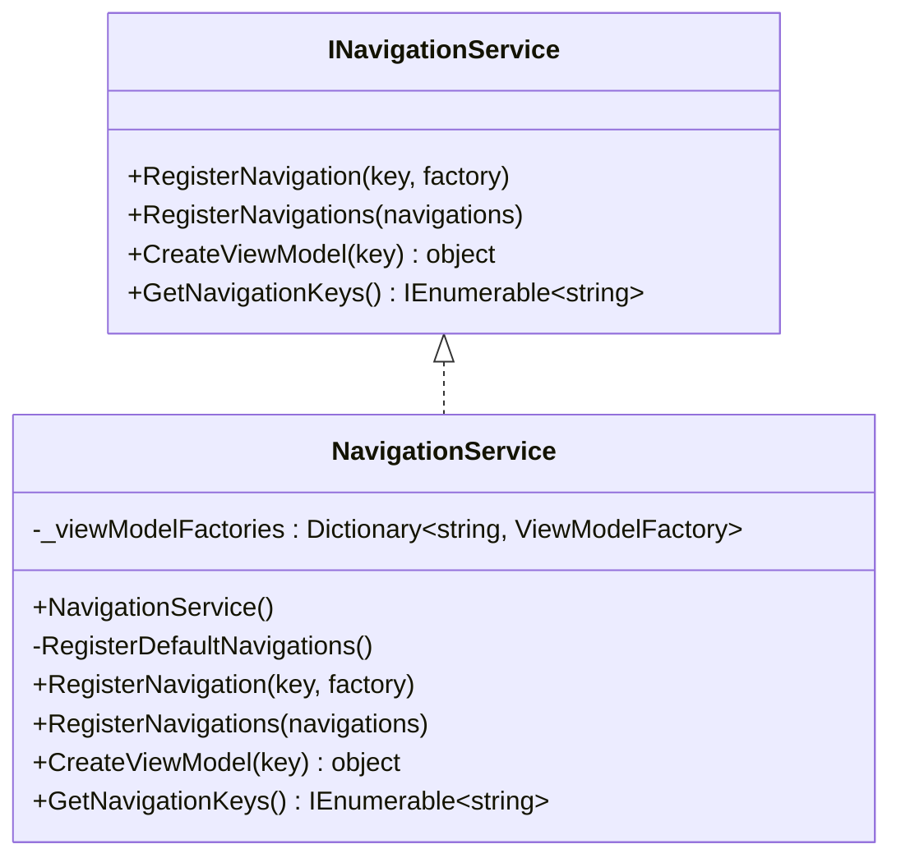
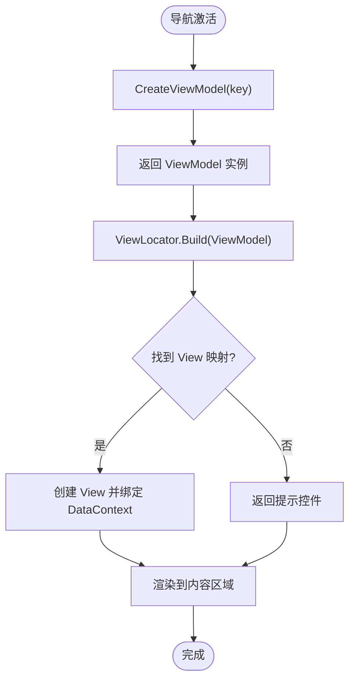
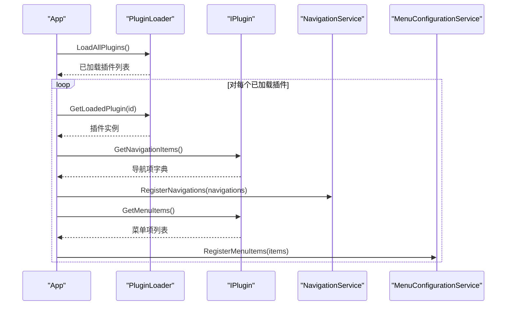
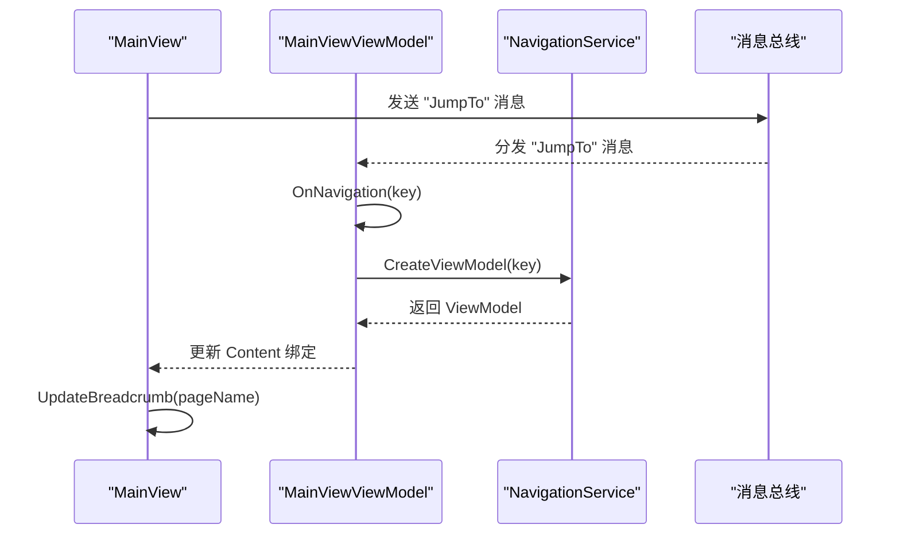
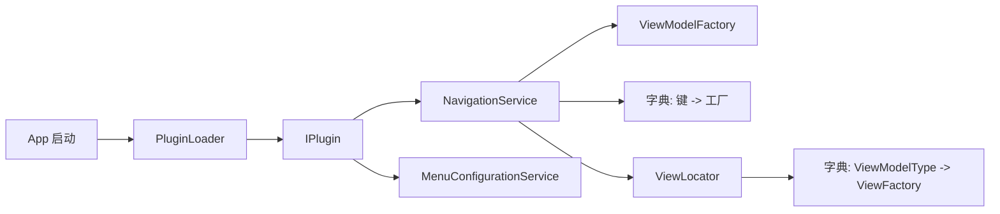

# 导航服务

<cite>
**本文引用的文件**
- [src\Avalonia.UI\Services\INavigationService.cs](file://src/Avalonia.UI/Services/INavigationService.cs)
- [src\Avalonia.UI\Services\NavigationService.cs](file://src/Avalonia.UI/Services/NavigationService.cs)
- [src\Avalonia.UI\Services\ServiceCollectionExtensions.cs](file://src/Avalonia.UI/Services/ServiceCollectionExtensions.cs)
- [src\Avalonia.Plugin.Shared\IPlugin.cs](file://src/Avalonia.Plugin.Shared/IPlugin.cs)
- [src\Avalonia.Plugin.Shared\ViewLocator.cs](file://src/Avalonia.Plugin.Shared/ViewLocator.cs)
- [src\Avalonia.Plugin.Shared\Attributes\NavigationItemAttribute.cs](file://src/Avalonia.Plugin.Shared/Attributes/NavigationItemAttribute.cs)
- [src\Avalonia.UI\Services\PluginLoader.cs](file://src/Avalonia.UI/Services/PluginLoader.cs)
- [src\launcher\Avalonia.Launcher.Desktop\App.axaml.cs](file://src/launcher/Avalonia.Launcher.Desktop/App.axaml.cs)
- [src\Avalonia.UI\Views\MainView.axaml.cs](file://src/Avalonia.UI/Views/MainView.axaml.cs)
- [src\Avalonia.UI\ViewModels\MainViewViewModel.cs](file://src/Avalonia.UI/ViewModels/MainViewViewModel.cs)
- [src\Avalonia.UI\Pages\IntroductionDemo.axaml.cs](file://src/Avalonia.UI/Pages/IntroductionDemo.axaml.cs)
- [src\Avalonia.UI\ViewModels\IntroductionDemoViewModel.cs](file://src/Avalonia.UI/ViewModels/IntroductionDemoViewModel.cs)
- [src\Avalonia.UI\Services\IMenuConfigurationService.cs](file://src/Avalonia.UI/Services/IMenuConfigurationService.cs)
- [src\Avalonia.UI\Services\MenuConfigurationService.cs](file://src/Avalonia.UI/Services/MenuConfigurationService.cs)
</cite>

## 目录
1. [简介](#简介)
2. [项目结构](#项目结构)
3. [核心组件](#核心组件)
4. [架构总览](#架构总览)
5. [详细组件分析](#详细组件分析)
6. [依赖分析](#依赖分析)
7. [性能考虑](#性能考虑)
8. [故障排查指南](#故障排查指南)
9. [结论](#结论)
10. [附录](#附录)

## 简介
本文件系统性地解析导航服务(NavigationService)的设计与实现，涵盖以下主题：
- 路由管理机制：页面导航、参数传递、导航历史管理
- 接口设计与实现原理：导航事件处理、页面生命周期管理
- 具体导航示例：页面跳转与参数传递
- 与插件系统的集成：动态插件的导航注册
- 导航状态管理、性能优化与最佳实践

## 项目结构
导航服务位于 UI 层的服务目录中，并通过依赖注入进行装配；插件系统提供动态扩展能力；主界面通过消息总线驱动导航。

**图表来源**
- [src\Avalonia.UI\Services\NavigationService.cs:1-62](file://src/Avalonia.UI/Services/NavigationService.cs#L1-L62)
- [src\Avalonia.UI\Services\INavigationService.cs:1-34](file://src/Avalonia.UI/Services/INavigationService.cs#L1-L34)
- [src\Avalonia.Plugin.Shared\ViewLocator.cs:1-72](file://src/Avalonia.Plugin.Shared/ViewLocator.cs#L1-L72)
- [src\Avalonia.UI\Services\IMenuConfigurationService.cs:1-40](file://src/Avalonia.UI/Services/IMenuConfigurationService.cs#L1-L40)
- [src\Avalonia.UI\Services\MenuConfigurationService.cs:1-36](file://src/Avalonia.UI/Services/MenuConfigurationService.cs#L1-L36)
- [src\Avalonia.Plugin.Shared\IPlugin.cs:1-81](file://src/Avalonia.Plugin.Shared/IPlugin.cs#L1-L81)
- [src\Avalonia.UI\Services\PluginLoader.cs:100-330](file://src/Avalonia.UI/Services/PluginLoader.cs#L100-L330)
- [src\Avalonia.UI\Services\ServiceCollectionExtensions.cs:1-30](file://src/Avalonia.UI/Services/ServiceCollectionExtensions.cs#L1-L30)
- [src\launcher\Avalonia.Launcher.Desktop\App.axaml.cs:54-80](file://src/launcher/Avalonia.Launcher.Desktop/App.axaml.cs#L54-L80)

**章节来源**
- [src\Avalonia.UI\Services\NavigationService.cs:1-62](file://src/Avalonia.UI/Services/NavigationService.cs#L1-L62)
- [src\Avalonia.UI\Services\INavigationService.cs:1-34](file://src/Avalonia.UI/Services/INavigationService.cs#L1-L34)
- [src\Avalonia.Plugin.Shared\ViewLocator.cs:1-72](file://src/Avalonia.Plugin.Shared/ViewLocator.cs#L1-L72)
- [src\Avalonia.UI\Services\IMenuConfigurationService.cs:1-40](file://src/Avalonia.UI/Services/IMenuConfigurationService.cs#L1-L40)
- [src\Avalonia.UI\Services\MenuConfigurationService.cs:1-36](file://src/Avalonia.UI/Services/MenuConfigurationService.cs#L1-L36)
- [src\Avalonia.Plugin.Shared\IPlugin.cs:1-81](file://src/Avalonia.Plugin.Shared/IPlugin.cs#L1-L81)
- [src\Avalonia.UI\Services\PluginLoader.cs:100-330](file://src/Avalonia.UI/Services/PluginLoader.cs#L100-L330)
- [src\Avalonia.UI\Services\ServiceCollectionExtensions.cs:1-30](file://src/Avalonia.UI/Services/ServiceCollectionExtensions.cs#L1-L30)
- [src\launcher\Avalonia.Launcher.Desktop\App.axaml.cs:54-80](file://src/launcher/Avalonia.Launcher.Desktop/App.axaml.cs#L54-L80)

## 核心组件
- 导航接口 INavigationService：定义注册导航项、批量注册、创建 ViewModel、查询导航键等能力。
- 导航实现 NavigationService：维护导航键到 ViewModel 工厂的字典，负责默认导航项注册与动态注册，提供创建 ViewModel 的入口。
- 视图定位器 ViewLocator：将 ViewModel 类型与 View 工厂进行映射，支持手动注册与插件注入。
- 插件接口 IPlugin：提供导航项、菜单项、视图映射的声明式扩展点。
- 插件加载器 PluginLoader：负责插件发现、加载、元数据解析与状态管理。
- 依赖注入扩展 ServiceCollectionExtensions：集中注册导航服务、菜单配置服务、插件加载器等。
- 应用启动 App：在启动阶段加载插件并将插件的导航项与菜单项注册到导航与菜单服务。

**章节来源**
- [src\Avalonia.UI\Services\INavigationService.cs:1-34](file://src/Avalonia.UI/Services/INavigationService.cs#L1-L34)
- [src\Avalonia.UI\Services\NavigationService.cs:1-62](file://src/Avalonia.UI/Services/NavigationService.cs#L1-L62)
- [src\Avalonia.Plugin.Shared\ViewLocator.cs:1-72](file://src/Avalonia.Plugin.Shared/ViewLocator.cs#L1-L72)
- [src\Avalonia.Plugin.Shared\IPlugin.cs:1-81](file://src/Avalonia.Plugin.Shared/IPlugin.cs#L1-L81)
- [src\Avalonia.UI\Services\PluginLoader.cs:100-330](file://src/Avalonia.UI/Services/PluginLoader.cs#L100-L330)
- [src\Avalonia.UI\Services\ServiceCollectionExtensions.cs:1-30](file://src/Avalonia.UI/Services/ServiceCollectionExtensions.cs#L1-L30)
- [src\launcher\Avalonia.Launcher.Desktop\App.axaml.cs:54-80](file://src/launcher/Avalonia.Launcher.Desktop/App.axaml.cs#L54-L80)

## 架构总览
导航服务采用“键驱动”的轻量级路由机制：以字符串键作为页面标识，通过工厂委托延迟创建 ViewModel；同时配合 ViewLocator 将 ViewModel 与 View 进行类型映射，实现 MVVM 的解耦导航。

**图表来源**
- [src\launcher\Avalonia.Launcher.Desktop\App.axaml.cs:54-80](file://src/launcher/Avalonia.Launcher.Desktop/App.axaml.cs#L54-L80)
- [src\Avalonia.UI\Services\PluginLoader.cs:100-330](file://src/Avalonia.UI/Services/PluginLoader.cs#L100-L330)
- [src\Avalonia.Plugin.Shared\IPlugin.cs:1-81](file://src/Avalonia.Plugin.Shared/IPlugin.cs#L1-L81)
- [src\Avalonia.UI\Services\NavigationService.cs:35-46](file://src/Avalonia.UI/Services/NavigationService.cs#L35-L46)
- [src\Avalonia.UI\Services\IMenuConfigurationService.cs:1-40](file://src/Avalonia.UI/Services/IMenuConfigurationService.cs#L1-L40)

## 详细组件分析

### 组件一：导航接口与实现
- 设计要点
  - 使用工厂委托 ViewModelFactory 作为延迟创建的抽象，避免强耦合。
  - 键到工厂的字典 O(1) 查找，支持默认与动态注册。
  - 提供批量注册 RegisterNavigations 以适配插件一次性注入多条导航项。
- 关键流程
  - 默认注册：构造函数中注册内置导航项并建立 ViewModel 到 View 的映射。
  - 动态注册：插件加载后，App 调用 RegisterNavigations 将插件导航项注入。
  - 创建 ViewModel：CreateViewModel 通过键查找工厂并执行，失败抛出异常。

**图表来源**
- [src\Avalonia.UI\Services\INavigationService.cs:1-34](file://src/Avalonia.UI/Services/INavigationService.cs#L1-L34)
- [src\Avalonia.UI\Services\NavigationService.cs:1-62](file://src/Avalonia.UI/Services/NavigationService.cs#L1-L62)

**章节来源**
- [src\Avalonia.UI\Services\INavigationService.cs:1-34](file://src/Avalonia.UI/Services/INavigationService.cs#L1-L34)
- [src\Avalonia.UI\Services\NavigationService.cs:1-62](file://src/Avalonia.UI/Services/NavigationService.cs#L1-L62)

### 组件二：视图定位与页面生命周期
- 设计要点
  - ViewLocator 通过静态字典维护 ViewModel 到 View 工厂的映射，支持手动注册与插件注入。
  - Build 方法根据 DataContext 类型查找 View 工厂，若未找到返回友好提示控件。
  - 生命周期：页面实例化由框架根据 ViewLocator 的返回结果创建，导航切换时由 ViewModel 层控制内容区域绑定。
- 页面示例
  - IntroductionDemo.axaml.cs 与 IntroductionDemoViewModel.cs 形成一对标准 MVVM 页面，用于演示导航与数据绑定。

**图表来源**
- [src\Avalonia.UI\Services\NavigationService.cs:48-55](file://src/Avalonia.UI/Services/NavigationService.cs#L48-L55)
- [src\Avalonia.Plugin.Shared\ViewLocator.cs:47-71](file://src/Avalonia.Plugin.Shared/ViewLocator.cs#L47-L71)
- [src\Avalonia.UI\Pages\IntroductionDemo.axaml.cs:1-12](file://src/Avalonia.UI/Pages/IntroductionDemo.axaml.cs#L1-L12)
- [src\Avalonia.UI\ViewModels\IntroductionDemoViewModel.cs:1-55](file://src/Avalonia.UI/ViewModels/IntroductionDemoViewModel.cs#L1-L55)

**章节来源**
- [src\Avalonia.Plugin.Shared\ViewLocator.cs:1-72](file://src/Avalonia.Plugin.Shared/ViewLocator.cs#L1-L72)
- [src\Avalonia.UI\Pages\IntroductionDemo.axaml.cs:1-12](file://src/Avalonia.UI/Pages/IntroductionDemo.axaml.cs#L1-L12)
- [src\Avalonia.UI\ViewModels\IntroductionDemoViewModel.cs:1-55](file://src/Avalonia.UI/ViewModels/IntroductionDemoViewModel.cs#L1-L55)

### 组件三：插件系统与动态导航注册
- 设计要点
  - IPlugin 定义 GetNavigationItems、GetMenuItems、GetViewDefinitions 等扩展点。
  - App 在启动时遍历已加载插件，调用导航与菜单注册方法，实现动态扩展。
  - PluginLoader 负责插件装配、状态管理与错误处理。
- 集成流程
  - 启动阶段：App 获取 IPluginLoader、INavigationService、IMenuConfigurationService。
  - 加载插件：PluginLoader.LoadAllPlugins。
  - 注册导航与菜单：遍历插件返回的导航项与菜单项，分别调用 RegisterNavigations 与 RegisterMenuItems。

**图表来源**
- [src\launcher\Avalonia.Launcher.Desktop\App.axaml.cs:54-80](file://src/launcher/Avalonia.Launcher.Desktop/App.axaml.cs#L54-L80)
- [src\Avalonia.UI\Services\PluginLoader.cs:100-330](file://src/Avalonia.UI/Services/PluginLoader.cs#L100-L330)
- [src\Avalonia.Plugin.Shared\IPlugin.cs:1-81](file://src/Avalonia.Plugin.Shared/IPlugin.cs#L1-L81)
- [src\Avalonia.UI\Services\NavigationService.cs:35-46](file://src/Avalonia.UI/Services/NavigationService.cs#L35-L46)
- [src\Avalonia.UI\Services\IMenuConfigurationService.cs:1-40](file://src/Avalonia.UI/Services/IMenuConfigurationService.cs#L1-L40)

**章节来源**
- [src\launcher\Avalonia.Launcher.Desktop\App.axaml.cs:54-80](file://src/launcher/Avalonia.Launcher.Desktop/App.axaml.cs#L54-L80)
- [src\Avalonia.UI\Services\PluginLoader.cs:100-330](file://src/Avalonia.UI/Services/PluginLoader.cs#L100-L330)
- [src\Avalonia.Plugin.Shared\IPlugin.cs:1-81](file://src/Avalonia.Plugin.Shared/IPlugin.cs#L1-L81)

### 组件四：导航事件处理与页面生命周期
- 事件处理
  - MainViewViewModel 通过消息总线接收导航消息，触发 OnNavigation 将目标 ViewModel 设置为当前内容。
  - MainView 订阅消息并更新面包屑导航。
- 页面生命周期
  - 导航切换时，旧 ViewModel 的数据绑定断开，新 ViewModel 被创建并绑定到内容区域。
  - ViewLocator 负责将 ViewModel 实例转换为对应的 View 控件。

**图表来源**
- [src\Avalonia.UI\Views\MainView.axaml.cs:14-59](file://src/Avalonia.UI/Views/MainView.axaml.cs#L14-L59)
- [src\Avalonia.UI\ViewModels\MainViewViewModel.cs:34-46](file://src/Avalonia.UI/ViewModels/MainViewViewModel.cs#L34-L46)

**章节来源**
- [src\Avalonia.UI\Views\MainView.axaml.cs:1-60](file://src/Avalonia.UI/Views/MainView.axaml.cs#L1-L60)
- [src\Avalonia.UI\ViewModels\MainViewViewModel.cs:1-53](file://src/Avalonia.UI/ViewModels/MainViewViewModel.cs#L1-L53)

### 组件五：导航历史管理
- 当前实现
  - NavigationService 未内置导航历史栈；历史管理通常由上层视图模型或路由容器负责。
  - 建议在 MainViewViewModel 中维护导航历史栈，结合消息总线实现前进/后退。
- 参数传递
  - 通过消息总线携带导航键与参数字符串，或在 ViewModel 工厂中注入参数对象。
  - 若需复杂参数，可在 ViewModel 内部使用消息总线或命令参数传递。

[本节为概念性说明，不直接分析具体文件，故无章节来源]

## 依赖分析
- 组件内聚与耦合
  - NavigationService 仅依赖工厂委托与字典，内聚度高、耦合低。
  - ViewLocator 与 IPlugin 协作，形成“声明式映射 + 运行时注入”的模式。
- 外部依赖
  - 依赖注入容器负责服务生命周期与解析。
  - 插件系统通过反射与加载上下文实现隔离与卸载。

**图表来源**
- [src\Avalonia.UI\Services\NavigationService.cs:1-62](file://src/Avalonia.UI/Services/NavigationService.cs#L1-L62)
- [src\Avalonia.Plugin.Shared\ViewLocator.cs:1-72](file://src/Avalonia.Plugin.Shared/ViewLocator.cs#L1-L72)
- [src\launcher\Avalonia.Launcher.Desktop\App.axaml.cs:54-80](file://src/launcher/Avalonia.Launcher.Desktop/App.axaml.cs#L54-L80)
- [src\Avalonia.Plugin.Shared\IPlugin.cs:1-81](file://src/Avalonia.Plugin.Shared/IPlugin.cs#L1-L81)

**章节来源**
- [src\Avalonia.UI\Services\NavigationService.cs:1-62](file://src/Avalonia.UI/Services/NavigationService.cs#L1-L62)
- [src\Avalonia.Plugin.Shared\ViewLocator.cs:1-72](file://src/Avalonia.Plugin.Shared/ViewLocator.cs#L1-L72)
- [src\launcher\Avalonia.Launcher.Desktop\App.axaml.cs:54-80](file://src/launcher/Avalonia.Launcher.Desktop/App.axaml.cs#L54-L80)
- [src\Avalonia.Plugin.Shared\IPlugin.cs:1-81](file://src/Avalonia.Plugin.Shared/IPlugin.cs#L1-L81)

## 性能考虑
- 字典查找与映射
  - 导航键到工厂、ViewModel 到 View 的映射均基于字典，查找为 O(1)，满足高频导航场景。
- 延迟实例化
  - 通过工厂委托延迟创建 ViewModel，避免不必要的对象分配。
- 插件隔离
  - PluginLoader 使用独立加载上下文，避免内存泄漏与类型冲突。
- 建议
  - 对于高频页面，可考虑在 ViewModel 层缓存常用实例（谨慎使用，避免状态污染）。
  - 避免在导航键中使用过长字符串，保持键短小且语义明确。

[本节提供通用建议，不直接分析具体文件，故无章节来源]

## 故障排查指南
- 导航键不存在
  - 现象：CreateViewModel 抛出 ArgumentOutOfRangeException。
  - 排查：确认键是否正确注册；检查插件是否成功加载并注册导航项。
- 视图未找到
  - 现象：ViewLocator 返回提示控件而非目标页面。
  - 排查：确认 ViewLocator 是否已注册 ViewModel 到 View 的映射；检查插件是否通过 GetViewDefinitions 注入映射。
- 插件加载失败
  - 现象：插件状态为 Error，无导航项。
  - 排查：查看 PluginLoader 的错误信息；确认插件实现了 IPlugin 且包含有效元数据。
- 导航无响应
  - 现象：点击菜单无页面切换。
  - 排查：确认消息总线订阅是否生效；确认 MainViewViewModel 的 Content 绑定是否正确。

**章节来源**
- [src\Avalonia.UI\Services\NavigationService.cs:48-55](file://src/Avalonia.UI/Services/NavigationService.cs#L48-L55)
- [src\Avalonia.Plugin.Shared\ViewLocator.cs:47-71](file://src/Avalonia.Plugin.Shared/ViewLocator.cs#L47-L71)
- [src\Avalonia.UI\Services\PluginLoader.cs:100-330](file://src/Avalonia.UI/Services/PluginLoader.cs#L100-L330)
- [src\Avalonia.UI\Views\MainView.axaml.cs:14-59](file://src/Avalonia.UI/Views/MainView.axaml.cs#L14-L59)
- [src\Avalonia.UI\ViewModels\MainViewViewModel.cs:34-46](file://src/Avalonia.UI/ViewModels/MainViewViewModel.cs#L34-L46)

## 结论
导航服务通过“键驱动 + 工厂委托 + 视图定位”的轻量架构，实现了清晰的页面路由与动态扩展能力。结合插件系统，可在运行时无缝注入新的导航项与菜单项；通过消息总线与视图模型协作，实现事件驱动的导航与状态管理。建议在上层引入导航历史栈与参数化导航，进一步完善用户体验与可维护性。

[本节为总结性内容，不直接分析具体文件，故无章节来源]

## 附录

### 示例：页面跳转与参数传递
- 页面跳转
  - 在 UI 中发送消息 "JumpTo" 并携带目标键（如 "AboutUs"），由 MainViewViewModel 接收并调用导航服务创建 ViewModel。
- 参数传递
  - 方案一：通过消息总线携带键与参数字符串，在 ViewModel 内部解析。
  - 方案二：在 ViewModel 工厂中注入参数对象，实现强类型参数传递。
- 导航历史
  - 建议在 MainViewViewModel 中维护历史栈，结合消息总线实现前进/后退。

**章节来源**
- [src\Avalonia.UI\Views\MainView.axaml.cs:33-50](file://src/Avalonia.UI/Views/MainView.axaml.cs#L33-L50)
- [src\Avalonia.UI\ViewModels\MainViewViewModel.cs:23-46](file://src/Avalonia.UI/ViewModels/MainViewViewModel.cs#L23-L46)

### 最佳实践
- 键命名规范
  - 使用语义化、稳定的键名，避免硬编码字符串。
- 工厂职责
  - 工厂仅负责创建 ViewModel，不处理业务逻辑；业务逻辑放入 ViewModel。
- 视图映射
  - 优先使用插件的 GetViewDefinitions 注入映射，减少重复注册。
- 插件开发
  - 明确声明导航项与菜单项，确保元数据完整；提供完善的错误信息以便诊断。

[本节为通用建议，不直接分析具体文件，故无章节来源]