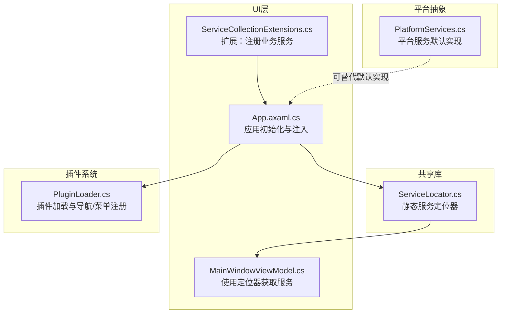
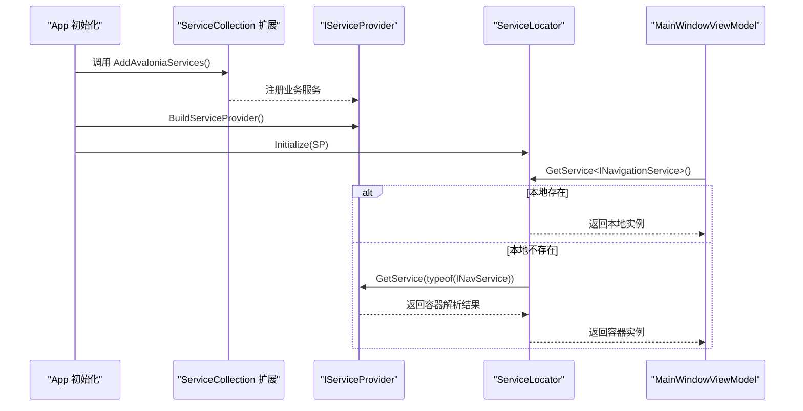
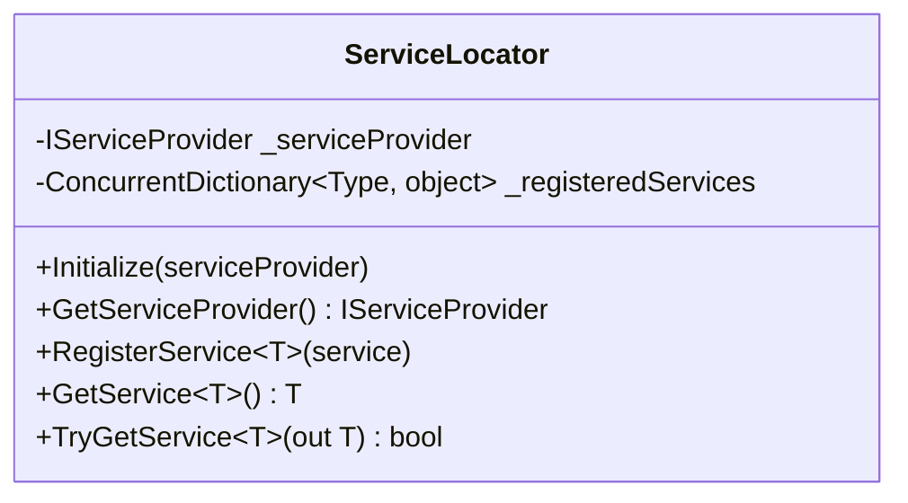
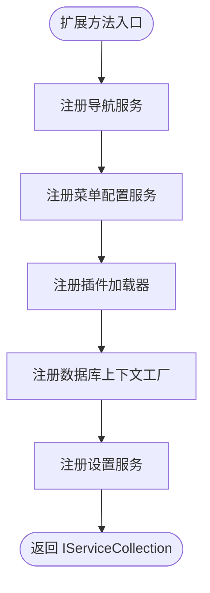
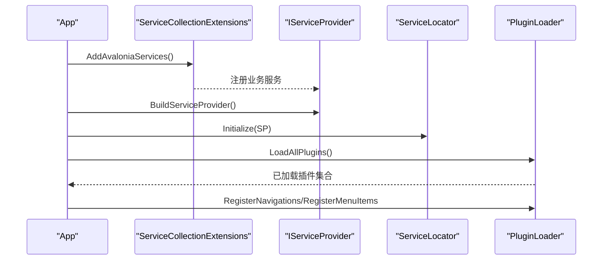
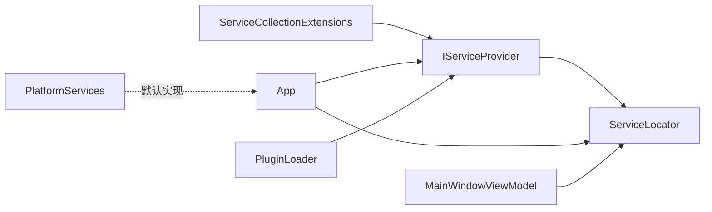
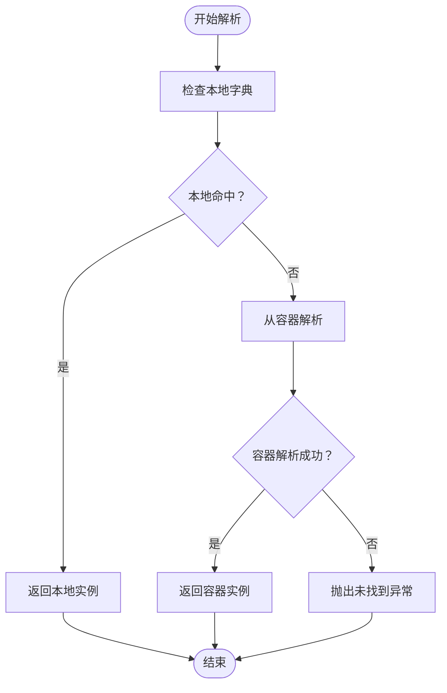

# 服务定位器

<cite>
**本文引用的文件**
- [ServiceLocator.cs](file://src/Avalonia.Plugin.Shared/ServiceLocator.cs)
- [ServiceCollectionExtensions.cs](file://src/Avalonia.UI/Services/ServiceCollectionExtensions.cs)
- [App.axaml.cs](file://src/launcher/Avalonia.Launcher.Desktop/App.axaml.cs)
- [Program.cs](file://src/launcher/Avalonia.Launcher.Desktop/Program.cs)
- [MainWindowViewModel.cs](file://src/Avalonia.UI/ViewModels/MainWindowViewModel.cs)
- [PlatformServices.cs](file://src/Avalonia.Platforms.Abstractions/PlatformServices.cs)
- [PluginLoader.cs](file://src/Avalonia.UI/Services/PluginLoader.cs)
</cite>

## 目录
1. [引言](#引言)
2. [项目结构](#项目结构)
3. [核心组件](#核心组件)
4. [架构总览](#架构总览)
5. [详细组件分析](#详细组件分析)
6. [依赖关系分析](#依赖关系分析)
7. [性能考虑](#性能考虑)
8. [故障排除指南](#故障排除指南)
9. [结论](#结论)
10. [附录](#附录)

## 引言
本文件围绕服务定位器（ServiceLocator）进行系统化说明，重点阐释其“静态服务提供者管理 + 本地注册服务”的双重机制，覆盖初始化流程、服务注册与获取策略、解析优先级（本地注册服务优先于依赖注入容器）、错误处理与最佳实践，并给出与应用启动、插件系统等组件的集成方式。

## 项目结构
服务定位器位于共享库中，作为全局静态入口，配合应用启动阶段构建的依赖注入容器使用；同时在UI层通过扩展方法注册业务服务，最终在应用初始化时将容器注入到服务定位器中。

**图表来源**
- [ServiceLocator.cs:1-64](file://src/Avalonia.Plugin.Shared/ServiceLocator.cs#L1-L64)
- [ServiceCollectionExtensions.cs:1-30](file://src/Avalonia.UI/Services/ServiceCollectionExtensions.cs#L1-L30)
- [App.axaml.cs:1-112](file://src/launcher/Avalonia.Launcher.Desktop/App.axaml.cs#L1-L112)
- [MainWindowViewModel.cs:1-16](file://src/Avalonia.UI/ViewModels/MainWindowViewModel.cs#L1-L16)
- [PlatformServices.cs:1-45](file://src/Avalonia.Platforms.Abstractions/PlatformServices.cs#L1-L45)
- [PluginLoader.cs:70-459](file://src/Avalonia.UI/Services/PluginLoader.cs#L70-L459)

**章节来源**
- [ServiceLocator.cs:1-64](file://src/Avalonia.Plugin.Shared/ServiceLocator.cs#L1-L64)
- [ServiceCollectionExtensions.cs:1-30](file://src/Avalonia.UI/Services/ServiceCollectionExtensions.cs#L1-L30)
- [App.axaml.cs:1-112](file://src/launcher/Avalonia.Launcher.Desktop/App.axaml.cs#L1-L112)

## 核心组件
- 静态服务定位器：提供全局访问点，内部维护一个线程安全的本地服务字典与一个外部IServiceProvider实例。
- 服务提供者扩展：在应用启动时将业务服务注册到容器中，供定位器统一解析。
- 应用初始化：构建容器并调用定位器初始化，随后可直接通过定位器获取服务。
- 视图模型使用：在构造函数或属性初始化阶段通过定位器获取所需服务。

关键职责与行为
- 初始化：接收并保存IServiceProvider实例，后续所有解析均委托该容器。
- 注册：向本地字典注册对象实例，用于优先解析。
- 获取：先查本地字典，未命中再从IServiceProvider解析；失败抛出异常。
- 安全获取：提供TryGetService，避免异常传播。
- 解析优先级：本地注册服务优先于容器解析。

**章节来源**
- [ServiceLocator.cs:10-42](file://src/Avalonia.Plugin.Shared/ServiceLocator.cs#L10-L42)
- [ServiceCollectionExtensions.cs:10-28](file://src/Avalonia.UI/Services/ServiceCollectionExtensions.cs#L10-L28)
- [App.axaml.cs:29-40](file://src/launcher/Avalonia.Launcher.Desktop/App.axaml.cs#L29-L40)
- [MainWindowViewModel.cs:10-15](file://src/Avalonia.UI/ViewModels/MainWindowViewModel.cs#L10-L15)

## 架构总览
服务定位器在应用生命周期中的角色是“桥接层”：一方面由应用初始化阶段建立的容器提供真正的服务解析能力；另一方面为不便于直接注入的场景（如某些视图模型或静态上下文）提供便捷访问。

**图表来源**
- [App.axaml.cs:29-40](file://src/launcher/Avalonia.Launcher.Desktop/App.axaml.cs#L29-L40)
- [ServiceCollectionExtensions.cs:10-28](file://src/Avalonia.UI/Services/ServiceCollectionExtensions.cs#L10-L28)
- [ServiceLocator.cs:10-42](file://src/Avalonia.Plugin.Shared/ServiceLocator.cs#L10-L42)
- [MainWindowViewModel.cs:10-15](file://src/Avalonia.UI/ViewModels/MainWindowViewModel.cs#L10-L15)

## 详细组件分析

### 组件一：ServiceLocator（静态定位器）
- 结构要点
  - 私有字段：IServiceProvider实例与并发字典（类型到实例映射）。
  - 公共接口：Initialize、GetServiceProvider、RegisterService、GetService、TryGetService。
- 实现模式
  - 单例式静态类，无外部依赖注入，仅持有IServiceProvider引用。
  - 本地字典用于“覆盖/替换”容器解析，适合测试或特殊场景。
- 复杂度
  - 字典查询/插入：O(1)平均时间。
  - 容器解析：委托给IServiceProvider，复杂度取决于具体容器实现。
- 错误处理
  - 未初始化：访问服务提供者或获取服务时抛出异常。
  - 容器未解析到服务：GetService抛出异常；TryGetService返回false且输出null。
- 性能影响
  - 本地字典命中可减少容器开销；但频繁注册/覆盖会增加内存占用。
  - 建议仅注册稳定、跨生命周期的对象，避免临时对象污染本地缓存。

**图表来源**
- [ServiceLocator.cs:5-63](file://src/Avalonia.Plugin.Shared/ServiceLocator.cs#L5-L63)

**章节来源**
- [ServiceLocator.cs:1-64](file://src/Avalonia.Plugin.Shared/ServiceLocator.cs#L1-L64)

### 组件二：ServiceCollectionExtensions（服务注册扩展）
- 职责
  - 在IServiceCollection上添加扩展方法，集中注册应用所需的服务（导航、菜单、设置、数据库上下文工厂、插件加载器等）。
- 使用方式
  - 应用初始化时调用扩展方法，构建ServiceProvider后传入ServiceLocator。
- 与定位器的关系
  - 通过扩展注册的服务，由ServiceLocator在GetService时从容器解析得到。

**图表来源**
- [ServiceCollectionExtensions.cs:10-28](file://src/Avalonia.UI/Services/ServiceCollectionExtensions.cs#L10-L28)

**章节来源**
- [ServiceCollectionExtensions.cs:1-30](file://src/Avalonia.UI/Services/ServiceCollectionExtensions.cs#L1-L30)

### 组件三：App（应用初始化与定位器集成）
- 关键步骤
  - 创建ServiceCollection并调用扩展方法注册服务。
  - 构建ServiceProvider并调用ServiceLocator.Initialize。
  - 后续可通过定位器或容器获取服务。
- 插件集成
  - 通过容器获取插件加载器，加载已安装插件并注册导航项与菜单项，同时注册视图映射。

**图表来源**
- [App.axaml.cs:29-88](file://src/launcher/Avalonia.Launcher.Desktop/App.axaml.cs#L29-L88)
- [ServiceCollectionExtensions.cs:10-28](file://src/Avalonia.UI/Services/ServiceCollectionExtensions.cs#L10-L28)
- [PluginLoader.cs:70-459](file://src/Avalonia.UI/Services/PluginLoader.cs#L70-L459)

**章节来源**
- [App.axaml.cs:23-88](file://src/launcher/Avalonia.Launcher.Desktop/App.axaml.cs#L23-L88)

### 组件四：MainWindowViewModel（定位器使用示例）
- 场景
  - 在视图模型构造函数中通过ServiceLocator获取导航与菜单配置服务，用于构造子视图模型。
- 注意
  - 该模式适用于无法直接注入的场景；若可注入，优先使用构造函数注入。

**章节来源**
- [MainWindowViewModel.cs:10-15](file://src/Avalonia.UI/ViewModels/MainWindowViewModel.cs#L10-L15)

### 组件五：PlatformServices（平台服务默认实现）
- 作用
  - 提供平台相关服务的默认实现（窗口、定位、桌面、系统事件、文件选择等），可在不同平台上替换。
- 与定位器关系
  - 通常由容器解析；若需要替换默认实现，可在应用初始化阶段注册自定义实现，ServiceLocator将按容器解析结果返回。

**章节来源**
- [PlatformServices.cs:9-45](file://src/Avalonia.Platforms.Abstractions/PlatformServices.cs#L9-L45)

## 依赖关系分析
- ServiceLocator依赖IServiceProvider（外部容器）与本地字典（内部缓存）。
- App负责构建容器并将容器注入ServiceLocator。
- ServiceCollectionExtensions集中注册业务服务，供App与ServiceLocator共同使用。
- PluginLoader通过容器解析导航与菜单服务，动态注册插件功能。

**图表来源**
- [ServiceLocator.cs:7-8](file://src/Avalonia.Plugin.Shared/ServiceLocator.cs#L7-L8)
- [ServiceCollectionExtensions.cs:10-28](file://src/Avalonia.UI/Services/ServiceCollectionExtensions.cs#L10-L28)
- [App.axaml.cs:29-40](file://src/launcher/Avalonia.Launcher.Desktop/App.axaml.cs#L29-L40)
- [MainWindowViewModel.cs:10-15](file://src/Avalonia.UI/ViewModels/MainWindowViewModel.cs#L10-L15)
- [PluginLoader.cs:70-459](file://src/Avalonia.UI/Services/PluginLoader.cs#L70-L459)
- [PlatformServices.cs:9-45](file://src/Avalonia.Platforms.Abstractions/PlatformServices.cs#L9-L45)

**章节来源**
- [ServiceLocator.cs:1-64](file://src/Avalonia.Plugin.Shared/ServiceLocator.cs#L1-L64)
- [ServiceCollectionExtensions.cs:1-30](file://src/Avalonia.UI/Services/ServiceCollectionExtensions.cs#L1-L30)
- [App.axaml.cs:1-112](file://src/launcher/Avalonia.Launcher.Desktop/App.axaml.cs#L1-L112)

## 性能考虑
- 本地注册服务优先：对热点服务进行本地注册可减少容器解析开销，提升响应速度。
- 线程安全：本地字典为并发字典，适合多线程环境；但应避免频繁注册/覆盖。
- 容器解析成本：复杂容器解析可能带来额外开销，建议仅注册必要的服务。
- 内存占用：本地字典会常驻对象实例，需控制注册对象数量与生命周期。

## 故障排除指南
- 未初始化异常
  - 现象：调用GetServiceProvider或GetService时抛出未初始化异常。
  - 排查：确认应用初始化阶段已调用ServiceLocator.Initialize。
  - 参考路径：[ServiceLocator.cs:15-22](file://src/Avalonia.Plugin.Shared/ServiceLocator.cs#L15-L22)
- 服务未找到异常
  - 现象：GetService抛出“未在服务提供者中找到服务”异常。
  - 排查：检查容器是否已注册该服务；或在定位器中本地注册该实例。
  - 参考路径：[ServiceLocator.cs:29-42](file://src/Avalonia.Plugin.Shared/ServiceLocator.cs#L29-L42)
- TryGetService返回false
  - 现象：TryGetService返回false且输出null。
  - 排查：确认容器注册与类型匹配；必要时本地注册。
  - 参考路径：[ServiceLocator.cs:44-62](file://src/Avalonia.Plugin.Shared/ServiceLocator.cs#L44-L62)
- 插件加载失败
  - 现象：插件状态异常或注册失败。
  - 排查：检查插件依赖、清单与加载上下文；查看日志输出。
  - 参考路径：[PluginLoader.cs:70-459](file://src/Avalonia.UI/Services/PluginLoader.cs#L70-L459)

**章节来源**
- [ServiceLocator.cs:15-62](file://src/Avalonia.Plugin.Shared/ServiceLocator.cs#L15-L62)
- [PluginLoader.cs:70-459](file://src/Avalonia.UI/Services/PluginLoader.cs#L70-L459)

## 结论
服务定位器通过“本地注册服务 + 依赖注入容器”的双重机制，在保证灵活性的同时维持了解析的一致性与可控性。正确初始化与合理使用本地注册，可显著提升关键路径性能并简化非注入场景的开发。建议遵循“尽量注入、局部替换”的原则，并在插件与平台服务层面保持容器解析的统一性。

## 附录

### 使用示例（步骤说明）
- 步骤1：在应用初始化阶段注册业务服务
  - 参考路径：[ServiceCollectionExtensions.cs:10-28](file://src/Avalonia.UI/Services/ServiceCollectionExtensions.cs#L10-L28)
- 步骤2：构建容器并初始化定位器
  - 参考路径：[App.axaml.cs:29-40](file://src/launcher/Avalonia.Launcher.Desktop/App.axaml.cs#L29-L40)
- 步骤3：在视图模型中获取服务
  - 参考路径：[MainWindowViewModel.cs:10-15](file://src/Avalonia.UI/ViewModels/MainWindowViewModel.cs#L10-L15)
- 步骤4：（可选）在定位器中本地注册替换
  - 参考路径：[ServiceLocator.cs:24-27](file://src/Avalonia.Plugin.Shared/ServiceLocator.cs#L24-L27)

### 解析优先级与流程图
- 优先级：本地注册服务 > 容器解析服务
- 流程图如下：

**图表来源**
- [ServiceLocator.cs:29-42](file://src/Avalonia.Plugin.Shared/ServiceLocator.cs#L29-L42)