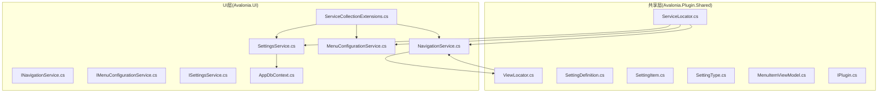
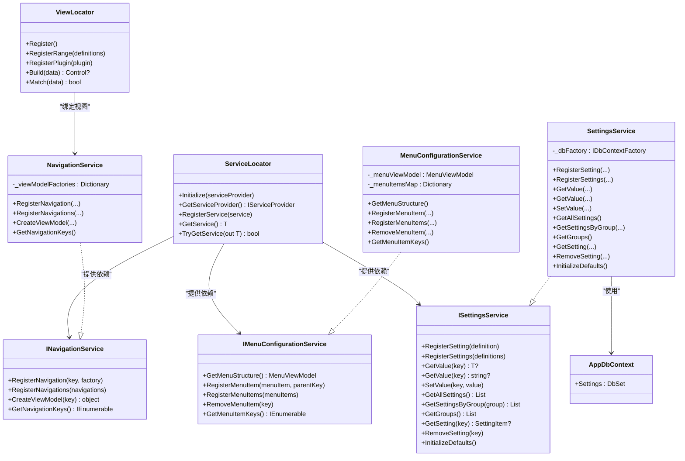
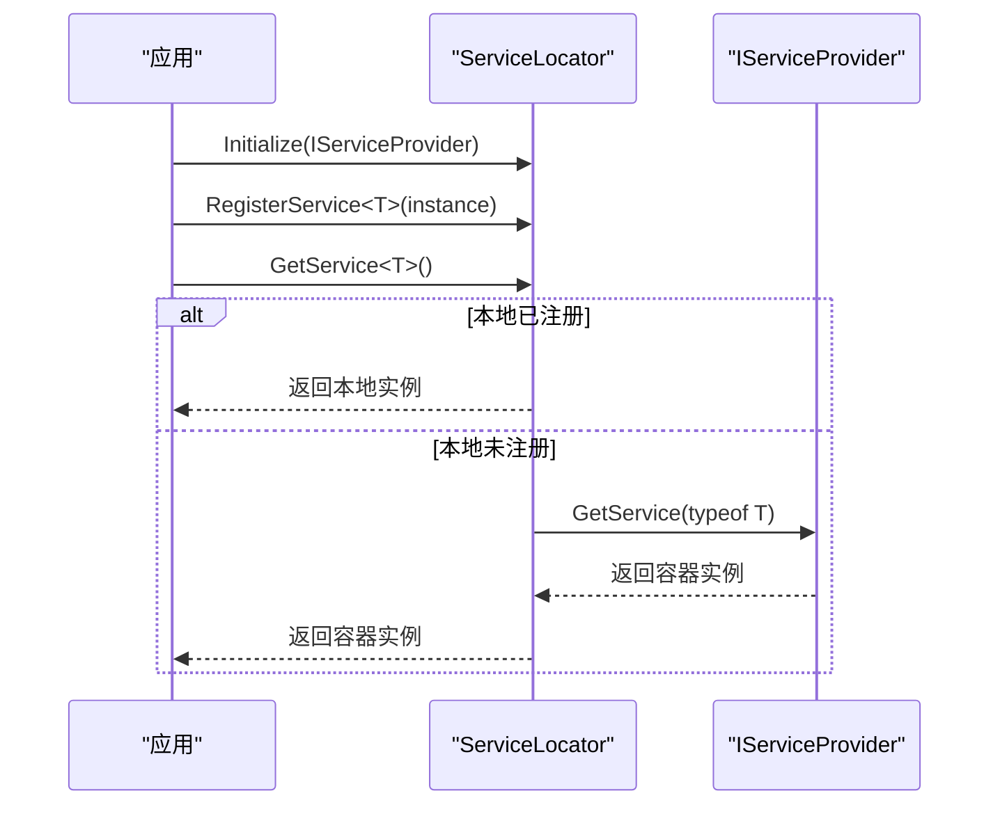
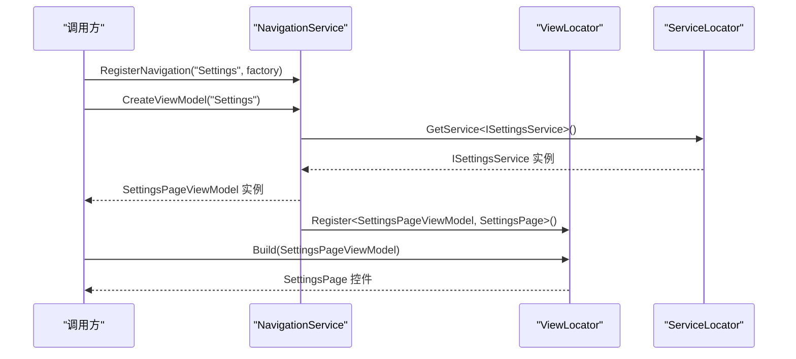
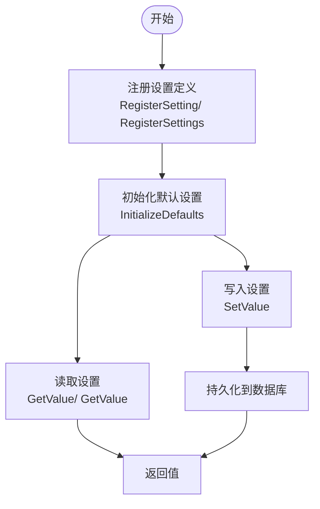
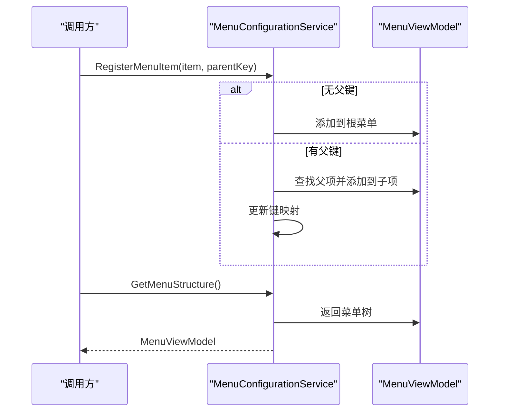
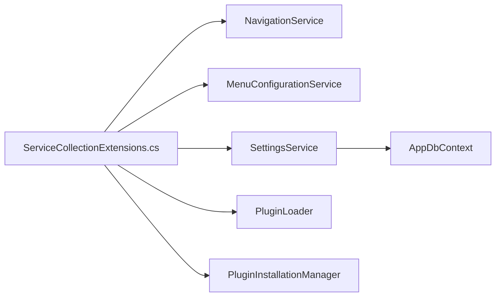

# 核心服务组件

<cite>
**本文引用的文件**
- [ServiceLocator.cs](file://src/Avalonia.Plugin.Shared/ServiceLocator.cs)
- [ViewLocator.cs](file://src/Avalonia.Plugin.Shared/ViewLocator.cs)
- [INavigationService.cs](file://src/Avalonia.UI/Serivces/INavigationService.cs)
- [NavigationService.cs](file://src/Avalonia.UI/Serivces/NavigationService.cs)
- [IMenuConfigurationService.cs](file://src/Avalonia.UI/Serivces/IMenuConfigurationService.cs)
- [MenuConfigurationService.cs](file://src/Avalonia.UI/Serivces/MenuConfigurationService.cs)
- [ISettingsService.cs](file://src/Avalonia.Plugin.Shared/Services/ISettingsService.cs)
- [SettingsService.cs](file://src/Avalonia.UI/Serivces/SettingsService.cs)
- [ServiceCollectionExtensions.cs](file://src/Avalonia.UI/Serivces/ServiceCollectionExtensions.cs)
- [SettingDefinition.cs](file://src/Avalonia.Plugin.Shared/Models/SettingDefinition.cs)
- [SettingItem.cs](file://src/Avalonia.Plugin.Shared/Models/SettingItem.cs)
- [SettingType.cs](file://src/Avalonia.Plugin.Shared/Models/SettingType.cs)
- [MenuItemViewModel.cs](file://src/Avalonia.Plugin.Shared/ViewModels/MenuItemViewModel.cs)
- [IPlugin.cs](file://src/Avalonia.Plugin.Shared/IPlugin.cs)
- [AppDbContext.cs](file://src/Avalonia.UI/Data/AppDbContext.cs)
</cite>

## 目录
1. [简介](#简介)
2. [项目结构](#项目结构)
3. [核心组件](#核心组件)
4. [架构总览](#架构总览)
5. [详细组件分析](#详细组件分析)
6. [依赖分析](#依赖分析)
7. [性能考虑](#性能考虑)
8. [故障排除指南](#故障排除指南)
9. [结论](#结论)
10. [附录](#附录)

## 简介
本文件聚焦 AvaloniaTemplate 的核心服务组件，系统性解析以下服务的设计与实现：
- 服务定位器：统一的服务访问入口与依赖注入容器的桥接方式
- 导航服务：基于键值的导航项注册与 ViewModel 工厂机制
- 设置服务：设置定义、持久化存储与动态读写
- 菜单配置服务：动态菜单树构建与父子关系维护
- 视图定位器：ViewModel 到 View 的快速映射与插件扩展

文档提供 API 参考、使用示例、集成步骤、服务间协作关系以及最佳实践建议。

## 项目结构
核心服务位于两个工程中：
- Avalonia.Plugin.Shared：共享模型、视图定位器、插件接口与基础服务接口
- Avalonia.UI：应用层服务实现、数据库上下文与服务注册扩展

图表来源
- [ServiceLocator.cs:1-64](file://src/Avalonia.Plugin.Shared/ServiceLocator.cs#L1-L64)
- [ViewLocator.cs:1-72](file://src/Avalonia.Plugin.Shared/ViewLocator.cs#L1-L72)
- [INavigationService.cs:1-34](file://src/Avalonia.UI/Serivces/INavigationService.cs#L1-L34)
- [NavigationService.cs:1-62](file://src/Avalonia.UI/Serivces/NavigationService.cs#L1-L62)
- [IMenuConfigurationService.cs:1-40](file://src/Avalonia.UI/Serivces/IMenuConfigurationService.cs#L1-L40)
- [MenuConfigurationService.cs:1-194](file://src/Avalonia.UI/Serivces/MenuConfigurationService.cs#L1-L194)
- [ISettingsService.cs](file://src/Avalonia.Plugin.Shared/Services/ISettingsService.cs)
- [SettingsService.cs:1-137](file://src/Avalonia.UI/Serivces/SettingsService.cs#L1-L137)
- [ServiceCollectionExtensions.cs:1-30](file://src/Avalonia.UI/Serivces/ServiceCollectionExtensions.cs#L1-L30)
- [AppDbContext.cs:1-30](file://src/Avalonia.UI/Data/AppDbContext.cs#L1-L30)

章节来源
- [ServiceLocator.cs:1-64](file://src/Avalonia.Plugin.Shared/ServiceLocator.cs#L1-L64)
- [ServiceCollectionExtensions.cs:1-30](file://src/Avalonia.UI/Serivces/ServiceCollectionExtensions.cs#L1-L30)

## 核心组件
本节概述四大核心服务的能力边界与职责：
- 服务定位器：提供静态入口以初始化 IServiceProvider，并支持本地注册覆盖
- 导航服务：集中注册导航项，按键创建 ViewModel，绑定 View
- 设置服务：注册设置定义、持久化、读取与分组查询
- 菜单配置服务：构建菜单树，支持父子关系与动态增删

章节来源
- [ServiceLocator.cs:10-42](file://src/Avalonia.Plugin.Shared/ServiceLocator.cs#L10-L42)
- [NavigationService.cs:19-60](file://src/Avalonia.UI/Serivces/NavigationService.cs#L19-L60)
- [SettingsService.cs:17-135](file://src/Avalonia.UI/Serivces/SettingsService.cs#L17-L135)
- [MenuConfigurationService.cs:60-185](file://src/Avalonia.UI/Serivces/MenuConfigurationService.cs#L60-L185)

## 架构总览
下图展示服务定位器与各服务之间的交互关系，以及依赖注入容器的装配位置。

图表来源
- [ServiceLocator.cs:5-42](file://src/Avalonia.Plugin.Shared/ServiceLocator.cs#L5-L42)
- [INavigationService.cs:6-33](file://src/Avalonia.UI/Serivces/INavigationService.cs#L6-L33)
- [NavigationService.cs:9-61](file://src/Avalonia.UI/Serivces/NavigationService.cs#L9-L61)
- [IMenuConfigurationService.cs:8-40](file://src/Avalonia.UI/Serivces/IMenuConfigurationService.cs#L8-L40)
- [MenuConfigurationService.cs:8-185](file://src/Avalonia.UI/Serivces/MenuConfigurationService.cs#L8-L185)
- [ISettingsService.cs](file://src/Avalonia.Plugin.Shared/Services/ISettingsService.cs)
- [SettingsService.cs:8-136](file://src/Avalonia.UI/Serivces/SettingsService.cs#L8-L136)
- [ViewLocator.cs:6-71](file://src/Avalonia.Plugin.Shared/ViewLocator.cs#L6-L71)
- [AppDbContext.cs:6-28](file://src/Avalonia.UI/Data/AppDbContext.cs#L6-L28)

## 详细组件分析

### 服务定位器 ServiceLocator
- 设计要点
  - 静态入口：通过 Initialize 接收 IServiceProvider，后续通过 GetServiceProvider 获取容器
  - 本地注册覆盖：RegisterService 支持在容器外注册实例；GetService/TryGetService 优先查本地字典，再回退容器
  - 线程安全：内部使用并发字典保存本地注册
- 使用场景
  - 在插件加载前，先向 ServiceLocator 注册必要实例，避免容器尚未就绪
  - 在测试或特殊场景下，临时替换服务实现
- 最佳实践
  - 尽量通过依赖注入注册服务；仅在必要时使用本地注册
  - 初始化顺序：先 Initialize，再注册本地服务，最后请求服务

图表来源
- [ServiceLocator.cs:10-42](file://src/Avalonia.Plugin.Shared/ServiceLocator.cs#L10-L42)

章节来源
- [ServiceLocator.cs:10-42](file://src/Avalonia.Plugin.Shared/ServiceLocator.cs#L10-L42)

### 导航服务 INavigationService / NavigationService
- 功能特性
  - 键值式导航注册：RegisterNavigation/RegisterNavigations
  - ViewModel 工厂：CreateViewModel 按键创建实例
  - 默认导航：构造函数内注册内置导航项与视图映射
  - 导航键枚举：GetNavigationKeys 提供可用导航项集合
- 参数与返回
  - ViewModel 工厂委托：无参返回对象实例
  - 导航键：字符串标识，用于选择目标页面
- 集成点
  - 与 ViewLocator 协作：在注册默认导航时同时注册视图映射
  - 与服务定位器协作：在创建特定 ViewModel 时通过 ServiceLocator 获取依赖

图表来源
- [NavigationService.cs:19-60](file://src/Avalonia.UI/Serivces/NavigationService.cs#L19-L60)
- [ViewLocator.cs:13-42](file://src/Avalonia.Plugin.Shared/ViewLocator.cs#L13-L42)
- [ServiceLocator.cs:29-42](file://src/Avalonia.Plugin.Shared/ServiceLocator.cs#L29-L42)

章节来源
- [INavigationService.cs:6-33](file://src/Avalonia.UI/Serivces/INavigationService.cs#L6-L33)
- [NavigationService.cs:19-60](file://src/Avalonia.UI/Serivces/NavigationService.cs#L19-L60)
- [ViewLocator.cs:13-42](file://src/Avalonia.Plugin.Shared/ViewLocator.cs#L13-L42)

### 设置服务 ISettingsService / SettingsService
- 能力范围
  - 设置定义注册：RegisterSetting/RegisterSettings
  - 值读取/写入：GetValue<T>/GetValue/SetValue
  - 查询接口：按组查询、获取全部、获取分组名、按键获取
  - 默认初始化：InitializeDefaults 注册常用设置项
  - 删除设置：RemoveSetting
- 数据模型
  - SettingDefinition：描述设置项元信息（键、显示名、分组、类型、默认值、选项等）
  - SettingItem：持久化实体，包含原始值、默认值、选项序列化
  - SettingType：文本、开关、下拉、路径四种类型
- 存储机制
  - 基于 Entity Framework Core 的 SQLite 数据库
  - AppDbContext 定义 Settings 表，Key 唯一索引
- 参数与返回
  - 键：全局唯一标识
  - 值：通过 SetValue 写入，GetValue<T> 解析为强类型

图表来源
- [SettingsService.cs:17-135](file://src/Avalonia.UI/Serivces/SettingsService.cs#L17-L135)
- [SettingDefinition.cs:3-88](file://src/Avalonia.Plugin.Shared/Models/SettingDefinition.cs#L3-L88)
- [SettingItem.cs:5-60](file://src/Avalonia.Plugin.Shared/Models/SettingItem.cs#L5-L60)
- [SettingType.cs:3-9](file://src/Avalonia.Plugin.Shared/Models/SettingType.cs#L3-L9)
- [AppDbContext.cs:6-28](file://src/Avalonia.UI/Data/AppDbContext.cs#L6-L28)

章节来源
- [ISettingsService.cs](file://src/Avalonia.Plugin.Shared/Services/ISettingsService.cs)
- [SettingsService.cs:17-135](file://src/Avalonia.UI/Serivces/SettingsService.cs#L17-L135)
- [SettingDefinition.cs:3-88](file://src/Avalonia.Plugin.Shared/Models/SettingDefinition.cs#L3-L88)
- [SettingItem.cs:5-60](file://src/Avalonia.Plugin.Shared/Models/SettingItem.cs#L5-L60)
- [SettingType.cs:3-9](file://src/Avalonia.Plugin.Shared/Models/SettingType.cs#L3-L9)
- [AppDbContext.cs:6-28](file://src/Avalonia.UI/Data/AppDbContext.cs#L6-L28)

### 菜单配置服务 IMenuConfigurationService / MenuConfigurationService
- 功能特性
  - 菜单树构建：GetMenuStructure 返回完整菜单结构
  - 动态注册：RegisterMenuItem/RegisterMenuItems 支持父子关系
  - 动态删除：RemoveMenuItem 根据键移除菜单项及其子树
  - 键枚举：GetMenuItemKeys 返回当前所有菜单项键
- 数据模型
  - MenuItemViewModel：包含标题、图标、键、状态、分组、排序、子项集合、激活命令
- 实现细节
  - 维护键到菜单项的映射字典，便于快速定位父节点
  - 递归遍历构建映射，支持多级菜单
  - 删除时先从根查找，再递归子节点查找并移除

图表来源
- [MenuConfigurationService.cs:60-129](file://src/Avalonia.UI/Serivces/MenuConfigurationService.cs#L60-L129)
- [MenuItemViewModel.cs:15-39](file://src/Avalonia.Plugin.Shared/ViewModels/MenuItemViewModel.cs#L15-L39)

章节来源
- [IMenuConfigurationService.cs:8-40](file://src/Avalonia.UI/Serivces/IMenuConfigurationService.cs#L8-L40)
- [MenuConfigurationService.cs:60-185](file://src/Avalonia.UI/Serivces/MenuConfigurationService.cs#L60-L185)
- [MenuItemViewModel.cs:15-39](file://src/Avalonia.Plugin.Shared/ViewModels/MenuItemViewModel.cs#L15-L39)

### 视图定位器 ViewLocator
- 设计要点
  - 快速映射：静态字典保存 ViewModel 到 View 工厂的 O(1) 映射
  - 插件扩展：RegisterPlugin 注入插件提供的映射，支持覆盖
  - 构建流程：Build 根据 DataContext 类型查找工厂，创建控件并绑定 DataContext
- 与导航服务协作
  - 导航服务在注册默认导航时同步注册视图映射，确保页面切换时正确渲染

章节来源
- [ViewLocator.cs:6-71](file://src/Avalonia.Plugin.Shared/ViewLocator.cs#L6-L71)
- [NavigationService.cs:29-33](file://src/Avalonia.UI/Serivces/NavigationService.cs#L29-L33)

## 依赖分析
- 依赖注入容器装配
  - 通过 ServiceCollectionExtensions.AddAvaloniaServices 注册核心服务
  - 注册导航服务、菜单配置服务、插件加载器、安装管理器与设置服务
  - 配置 SQLite 数据库上下文工厂，数据文件位于应用基目录下的 appdata.db
- 服务耦合度
  - NavigationService 依赖 ServiceLocator 获取其他服务
  - SettingsService 依赖 AppDbContext 进行持久化
  - MenuConfigurationService 与 ViewModel 层协作，不直接依赖容器
- 循环依赖
  - 当前设计避免循环依赖：服务通过接口解耦，ServiceLocator 仅作为桥接

图表来源
- [ServiceCollectionExtensions.cs:10-28](file://src/Avalonia.UI/Serivces/ServiceCollectionExtensions.cs#L10-L28)
- [SettingsService.cs:10-15](file://src/Avalonia.UI/Serivces/SettingsService.cs#L10-L15)
- [AppDbContext.cs:6-12](file://src/Avalonia.UI/Data/AppDbContext.cs#L6-L12)

章节来源
- [ServiceCollectionExtensions.cs:10-28](file://src/Avalonia.UI/Serivces/ServiceCollectionExtensions.cs#L10-L28)
- [SettingsService.cs:10-15](file://src/Avalonia.UI/Serivces/SettingsService.cs#L10-L15)
- [AppDbContext.cs:6-12](file://src/Avalonia.UI/Data/AppDbContext.cs#L6-L12)

## 性能考虑
- 视图定位器
  - 字典查找 O(1)，适合高频页面切换场景
  - Build 流程尽量避免重复实例化，保持工厂委托缓存
- 导航服务
  - 工厂委托延迟创建 ViewModel，降低启动成本
  - 默认导航在构造函数注册，避免运行时重复注册
- 设置服务
  - 数据库操作使用短生命周期上下文，减少连接占用
  - 分组查询与排序在数据库端完成，减轻客户端负担
- 服务定位器
  - 本地注册字典并发安全，但应避免频繁覆盖注册

## 故障排除指南
- 服务未初始化
  - 现象：调用 ServiceLocator.GetService 抛出未初始化异常
  - 处理：确保在应用启动阶段调用 Initialize 并传入 IServiceProvider
- 服务未找到
  - 现象：GetService 返回空或抛出异常
  - 处理：检查是否已在容器中注册；如需本地覆盖，使用 RegisterService
- 导航键不存在
  - 现象：CreateViewModel 抛出参数越界异常
  - 处理：确认导航键已通过 RegisterNavigation 或插件注册
- 菜单项键冲突
  - 现象：注册同键菜单项导致覆盖或查找异常
  - 处理：确保菜单项键唯一；删除时使用 RemoveMenuItem 清理映射
- 设置项未持久化
  - 现象：SetValue 后重启丢失
  - 处理：确认数据库上下文工厂配置正确，且数据库文件可写

章节来源
- [ServiceLocator.cs:17-41](file://src/Avalonia.Plugin.Shared/ServiceLocator.cs#L17-L41)
- [NavigationService.cs:48-55](file://src/Avalonia.UI/Serivces/NavigationService.cs#L48-L55)
- [MenuConfigurationService.cs:131-180](file://src/Avalonia.UI/Serivces/MenuConfigurationService.cs#L131-L180)
- [SettingsService.cs:76-83](file://src/Avalonia.UI/Serivces/SettingsService.cs#L76-L83)

## 结论
AvaloniaTemplate 的核心服务组件通过清晰的接口与轻量实现，提供了稳定的服务发现、导航、设置与菜单管理能力。服务定位器作为桥接层，既兼容传统容器模式，又允许灵活覆盖；导航与菜单服务以键值为中心，易于扩展与维护；设置服务以实体为中心，具备良好的持久化与查询能力。遵循本文的最佳实践，可在保证性能的同时提升系统的可维护性与可扩展性。

## 附录

### 使用示例与集成指南
- 初始化与注册
  - 在应用启动时调用 ServiceCollectionExtensions.AddAvaloniaServices 注册服务
  - 通过 ServiceLocator.Initialize 传入 IServiceProvider
- 导航使用
  - 在导航服务中注册自定义页面键与工厂
  - 通过 CreateViewModel 获取 ViewModel，交由 ViewLocator 自动绑定视图
- 设置使用
  - 使用 SettingDefinition 工厂方法定义设置项
  - 通过 ISettingsService 注册并读写设置值
- 菜单使用
  - 通过 IMenuConfigurationService 注册菜单项，支持父子关系
  - 使用 MenuItemViewModel 的激活命令触发跳转

章节来源
- [ServiceCollectionExtensions.cs:10-28](file://src/Avalonia.UI/Serivces/ServiceCollectionExtensions.cs#L10-L28)
- [ServiceLocator.cs:10-22](file://src/Avalonia.Plugin.Shared/ServiceLocator.cs#L10-L22)
- [NavigationService.cs:35-55](file://src/Avalonia.UI/Serivces/NavigationService.cs#L35-L55)
- [SettingsService.cs:17-83](file://src/Avalonia.UI/Serivces/SettingsService.cs#L17-L83)
- [MenuConfigurationService.cs:66-129](file://src/Avalonia.UI/Serivces/MenuConfigurationService.cs#L66-L129)